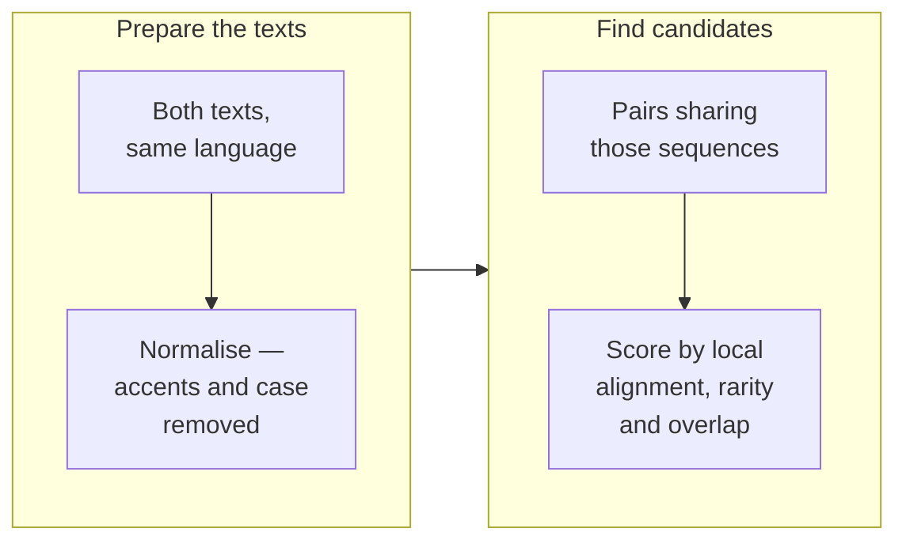

# Diagrams: mermaid that survives the content column

Phase 7 of [SKILL.md](SKILL.md) links here. This is the diagram equivalent of
[style-guide.md](style-guide.md): the content is your problem, but the *shape* has one rule that
matters more than every aesthetic judgement, and it is measurable.

## The width budget is ~560px, and going over it shrinks the text

Mermaid renders a diagram at its natural size and emits `width="100%"` with
`style="max-width: <natural>px"`. In a container narrower than that, the SVG scales down — **the
whole diagram, labels included**. There is no wrapping, no reflow, no horizontal scrollbar. A
too-wide diagram doesn't get cropped; it gets *small*.

The container is narrower than it looks. From the built theme's own CSS (`main.*.min.css`):

```
.md-grid          { max-width: 61rem }    /* 976px */
.md-sidebar       { width: 12.1rem }      /* 194px, twice — nav and TOC */
.md-content__inner{ margin: 0 .8rem }     /* 26px */
```

976 − 194 − 194 − 26 = **~563px** on a study page with a table of contents (any page with two or
more `##` headings, which is all of them). Pages without a TOC get ~750px. Budget to 560.

What that costs, measured:

| Diagram width | Renders at | 16px label becomes |
|---|---|---|
| 560 | 100% | 16px |
| 870 | 65% | 10px |
| 1769 | 32% | 5px |
| 3725 | 15% | 2px |

## The rule: three columns is the ceiling for `flowchart LR`

A column costs ~230px and **that floor is padding, not text** — so shortening labels does almost
nothing. Measured on `how-we-cross-reference.md`: cutting three-line labels to two and degrading
"Index every 4-word sequence" to "4-word run" moved the diagram 870px → 801px. Not worth the
precision. Four `LR` nodes in a rank is already over budget; seven is 1769px.

**Height is cheap and width is expensive.** Nothing gets scaled for being tall — the reader
scrolls, which they are doing anyway. Trade width for height every time.

## Fold a long chain into stages

Group the steps into at most three stages, and stack the steps *inside* each stage:



Two details make this work:

- **`direction TB` inside the subgraph** is what stacks the steps. Mermaid's docs warn that a
  subgraph's direction is ignored when its nodes link outside it — so **link stage-to-stage
  (`prep --> match`), not node-to-node across a boundary**. Both forms are already in this repo
  (`olivet-discourse.md:429` and `:882`), and stage-to-stage is the one that reliably keeps the
  inner direction. This is not a style preference: keeping the per-node edges on
  `about-our-datasets.md` and merely adding `direction TB` left the diagram at 2674px, because
  every `source --> btdb` edge voided the direction of the cluster the source sat in.
- **The stages should mean something.** If you can't name three stages, the diagram is a list and
  probably wants to be one. On `how-we-cross-reference.md` the three stages line up with the three
  choices the prose then explains, which is why the grouping reads as structure rather than as
  packing.

Rejected alternative worth knowing: a plain `flowchart TD` chain fits at 100% (276px wide) but ran
799px tall for seven steps and abandons the grouping. Reach for it when the steps genuinely have no
stages — which is most of the time. Converting the linear chronologies on `olivet-discourse.md`,
`rapture.md`, `prophecy-chart.md` and `bride-of-christ.md` from `LR` to `TD` took all four from
under 40% to 100%, changing nothing but the first line.

## Three more rules the corpus pass produced

- **`direction TB` only stacks nodes that are linked to each other.** A cluster holding a list of
  unconnected nodes lays them out in a *row* whatever its direction, because dagre has no rank
  relationship to work with. `about-our-datasets.md` is a catalog of sources with no internal
  edges, which is why it was the widest diagram on the site at 3725px. Give the list an explicit
  order with **invisible links** — `macula ~~~ sblgnt ~~~ wlc` — and it stacks.
- **Disconnected subgraphs sit side by side along the flow direction.** Three unlinked clusters in
  a `TD` chart form three columns; the same three in an `LR` chart stack vertically. When several
  parallel things each need their own box and nothing links them — the three gospel accounts on
  `last-supper-four-cups.md`, the three evidence tiers on `bride-of-christ.md` — **`LR` is the one
  that makes them narrow**, which is the opposite of the usual advice above.
- **Never put `<br/>` in a subgraph title.** Mermaid does not reserve height for a wrapped cluster
  label, so the second line renders *underneath* the first child node and is unreadable. Found by
  rendering; it is invisible in the source. Shorten the title or use `·` as a separator instead.

## Verify, don't estimate

Node count is a bad predictor — label length, subgraph titles and edge labels all move the number.
Render it:

```bash
cd "$TMPDIR" && npm init -y && npm i @mermaid-js/mermaid-cli
npx mmdc -i diagram.mmd -o out.svg -b white
grep -o 'viewBox="0 0 [0-9.]* [0-9.]*"' out.svg | head -1   # width height
```

Two environment traps, both hit on first use: mermaid-cli downloads Chromium from
`storage.googleapis.com` and *launches* it, and the sandbox blocks both (`ENOTFOUND`, then
`bootstrap_check_in ... Permission denied`). Run the install and the render with
`dangerouslyDisableSandbox`. There is no Chrome in `/Applications` to borrow.

## The corpus is clean — keep it that way

Measured on 2026-09-04 across 29 mermaid blocks in 15 files (24 measurable; the five `timeline`
blocks size themselves). Twelve rendered under 50%; **all twelve were rewritten the same day, and
nothing is under 50% now.** The widest diagram on the site went 3725px → 1178px.

| Was | Now | File |
|---|---|---|
| 3725 (15%) | 1178 (48%) | `about/about-our-datasets.md` |
| 3265 (17%) | 276 (100%) | `last-things/olivet-discourse.md` |
| 2084 (27%) | 558 (100%) | `resources/site-architecture.md` |
| 1975 (29%) | 826 (68%) | `last-things/combined-timeline.md` |
| 1910 (29%) | 518 (100%) | `last-things/prophecy-chart.md` |
| 1638 (34%) | 269 (100%) | `israel-and-church/bride-of-christ.md` |
| 1407 (40%) | 276 (100%) | `last-things/rapture.md` |
| 1162 (48%) | 857 (66%) | `feasts/last-supper-four-cups.md` |

`about-our-datasets.md` is the one that stops short of the budget, and the reason is worth keeping:
its narrow forms all cost meaning. Collapsing the two databases into one cluster reached 952px but
erased the trust-tier isolation the page exists to state, and moved TWOT into the restricted tier —
which the page's own "TWOT: one source, split across two tiers" section contradicts. **Width is a
constraint, not the goal**; when the only way under it is to make the diagram say something untrue,
stop and take the 48%.

None of this is a reason to open a diagram-fixing project. Fix the one in front of you when a study
brings you to its file, and don't add a thirteenth. `npm run validate` does **not** check diagram
width — it cannot without a browser — so nothing catches this but you.
