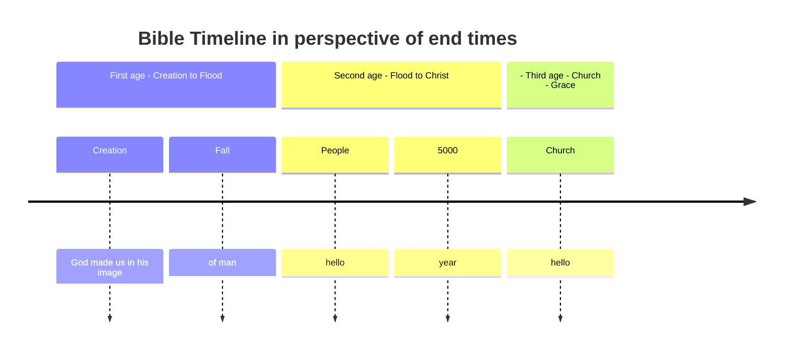
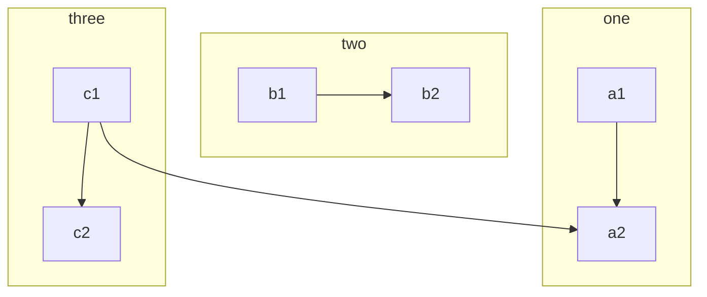
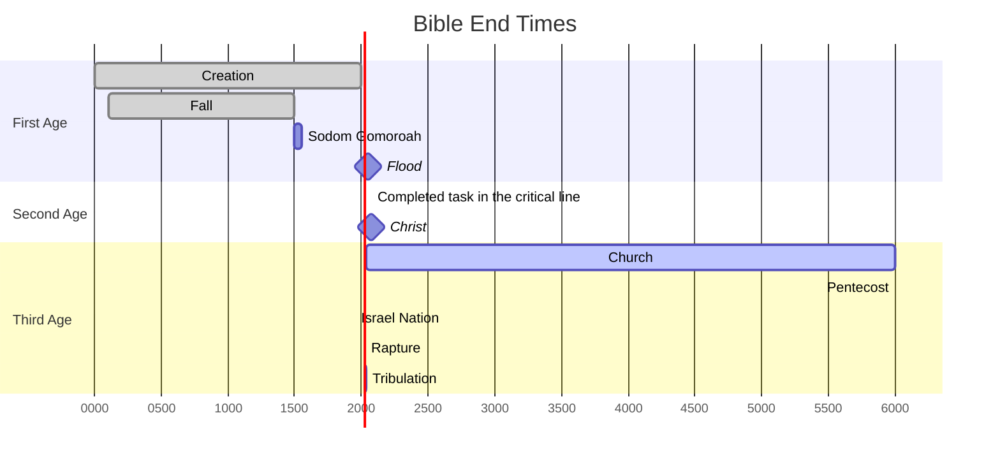

## About

These are personal bible study notes to help make sure I learn, and share that learning.
THese notes are title bible end times, becasue we are in the last days, 
and it is important to know where we stand wit God before terrible days come.

We have the bible, an integrated message to us of Gods work with humanity. 

All things are by him and th

Word is scripture

## A chart - visualise relative

Bible verses as basis
Title
Description 
linked to

Event - prophetic relationship

creation
fall
noah flood
lot
salvation
church
rapture
tribulation
millenial

## Be prepared to give account

> ✝️ [2Ti 4:2 (ESV)](https://www.blueletterbible.org/esv/2Ti/4/2)
>
> [2Ti 4:2 NIV] 2 Preach the word; be prepared in season and out of season; correct, rebuke and encourage--with great patience and careful instruction.

> ✝️ [1Pe 3:15 (ESV)](https://www.blueletterbible.org/esv/1Pe/3/15)
>
> [1Pe 3:15 NIV] 15 But in your hearts revere Christ as Lord. Always be prepared to give an answer to everyone who asks you to give the reason for the hope that you have. But do this with gentleness and respect,

## Created in th e iamge of God

## Fall

## Salvation

For god so loved

## Work of CHrist

## End times

