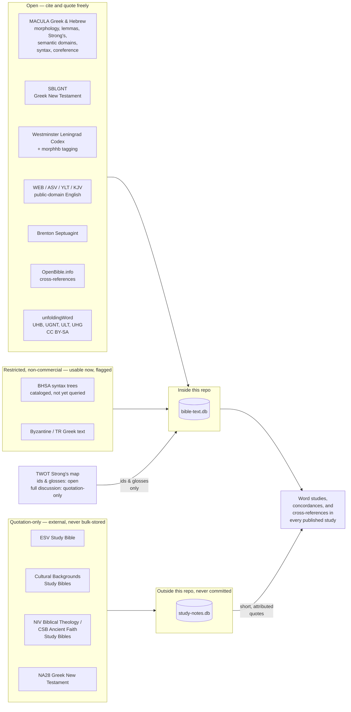

# Our Data Sources

[AI in These Studies](why-ai-assisted-study.md) says every language claim on this site has
to "resolve to a real entry in a real dataset." This page is the receipt: what those datasets are,
where each one comes from, and what it's licensed to let a study do with it.

**This is the authority page for the data this site relies on.** What we use, why, how it is used,
which scripts built and cleaned it, what the two databases contain, and what an agent can reach.
Where a fact about our data lives in more than one place it drifts, so it lives here.

Its companion is [Public Data Sources](../resources/public-data-sources.md), which is a different
job: a survey of the open Bible data that exists in this space — including sources looked at and
turned down — for a reader who wants the landscape rather than our plumbing. Anything there that we
actually use points back here.

Three other pages own questions this one deliberately does not: what a given text is *worth as a
witness* belongs to [Bible Translations & Source Texts](../scripture/translations.md); what the
data's own vocabulary means — lemma, parsing, semantic domain, and what MACULA actually is — to
[Reading the Original-Language Data](../scripture/original-language-data.md); and the church fathers
to [Patristic Sources](../resources/patristic-sources.md).

## Three tiers, one rule

Every source below falls into one of three license tiers, and the tier decides how it's used — not
convenience, not how useful the source would be to quote at length:

- **Open** — public domain, or a permissive license (CC BY, CC0). Cited and quoted freely.
- **Restricted, non-commercial** — usable now, since this site doesn't monetize, but flagged by name in
  case that ever changes.
- **Quotation-only** — commercially published, copyrighted text or commentary. Named and cited with a
  short, attributed quotation; never reproduced or bulk-stored at length.

## What each tier is for

**Open data does the heavy lifting.** Nearly everything a word study depends on — the Hebrew and Greek
text itself, morphology, lemmas, Strong's numbers, Louw-Nida/SDBH semantic domains, clause-level syntax
and coreference, cross-references, and four complete public-domain English translations — is open. This
is also the only tier committed into the repo (as `references/open-data/` submodules), so it's the tier
a reader could go pull and check themselves without asking anyone's permission. [Bible Translations &
Source Texts](../scripture/translations.md) is the deep dive on this slice specifically — translation
philosophy, textual-criticism tradeoffs, and a per-edition tracking table for every English translation,
Hebrew witness, and Greek New Testament text this site draws on, English translations included.

**Restricted data fills a specific gap, carefully.** The Byzantine/Textus Receptus Greek text is
usable now under its non-commercial terms. BHSA — a deeper Hebrew syntax resource than MACULA provides
— is cataloged and license-checked but not yet wired into any query tool; MACULA already covers subject,
role, construct state, and coreference for both testaments, so BHSA is reserved for an argument that
specifically needs full clause hierarchy MACULA doesn't give.

**Quotation-only data checks the work; it doesn't write it.** The develop-bible-study skill's own rule
is commentaries last, not first — used to check a reading already reached from the text, not to form
it. Because that tier carries no blanket redistribution right, its database (`study-notes.db`) is built
and stored entirely outside this repo's directory tree, on a separate volume, and never committed —
stronger isolation than a `.gitignore` line, on purpose.

## TWOT: one source, split across two tiers

The *Theological Wordbook of the Old Testament* doesn't fit neatly into one bucket. Its bare facts — a
Strong's number pointing to a TWOT root, lemma, and one-line gloss — are open enough to commit as a
plain JSON map and use freely. Its actual discussion prose, the paragraphs of argument behind each root,
is quotation-only like any other copyrighted reference work: citable by root number and gloss, quotable
a sentence at a time with attribution, never reproduced as a full entry.

## What sits outside both databases

Two kinds of source are used here but belong to neither pipeline, and a catalogue that did not say so
would read as more complete than it is.

**The early church fathers.** Held as plain text on the same external volume, not in either database,
because they are read rather than queried. Nine works: two 19th-century English translation sets for
finding a passage, and seven original-language critical editions — Greek and Latin — for anything
that turns on a father's actual words. Which of the two a citation rests on decides what it can
support, and [Patristic Sources](../resources/patristic-sources.md) sets out the difference along
with the case where this site got it wrong and had to retract.

**Raw teaching notes.** `references/biblefacts/` holds transcripts and worked summaries of
third-party teaching. It is deliberately outside every tier above: unvetted input, a lead to chase
down in a primary source, never a citable reference in a study.

## One gap in how our sources are held

Every source in `references/open-data/` is forked to `ding0t/*` before being submoduled, so the
project survives an upstream disappearing. The four unfoldingWord sources are the exception: they
live on Door43, which is Gitea rather than GitHub, and GitHub auth was not working on the machine
that added them. Their submodules point upstream directly.

Pinned commits already protect against upstream *changing*. The exposure is Door43 going away
entirely, and closing it is tracked as [backlog 8.1](backlog.md#81-mirror-the-unfoldingword-sources).

**Those four are also the only CC BY-SA sources here**, where everything else open is CC BY, CC0 or
public domain. That is fine for quoting and for a local gitignored database, and it
would need thinking about again before publishing any dataset derived from them.

## The two databases, and what is in them

Nothing here is hand-curated. `bible-text.db` is rebuilt from scratch by
[`references/build/build.py`](https://github.com/ding0t/bible_studies/blob/main/references/build/build.py),
which reads the submodules in `references/open-data/` and `references/restricted-data/`, so a re-run
produces the same rows and any claim resting on it can be re-derived rather than trusted.

| Table | Rows | What it holds |
|---|---|---|
| `works` | 320 | one row per ingested text, with its licence and tier — the thing every other table joins back to |
| `verses` | 1,216,519 | the text itself, every work, every verse |
| `morphology` | 1,819,286 | per-word lemma, Strong's, parsing, and Louw-Nida/SDBH semantic domains, from MACULA |
| `cross_references` | 831,290 | two inherited lists — openbible's crowd-voted set, and the WEB translators' own footnotes |
| `word_alignment` | 475,036 | which original word each English word renders, from unfoldingWord's ULT |
| `scripture_links` | 2,304 | **derived here, not ingested** — quotations and allusions this project detects itself |
| `dss_variants` | 1,874 | where a Dead Sea Scroll reads something the Masoretic text does not |
| `literary_units` | 1,181 | paragraph and pericope boundaries from the Masoretic markers, not modern chapter breaks |
| `grammar_articles` | 88 | what a Hebrew *form* does, as against what a word means |

`study-notes.db` is the second pipeline, built by `build_study_notes.py` from commercial study-Bible
EPUBs. It is quotation-only, so it is built and stored **entirely outside this repository**, on a
separate volume, and never committed — stronger isolation than a `.gitignore` line, on purpose.

### The scripts that clean and derive

| Script | What it does |
|---|---|
| `build.py` | Builds `bible-text.db` from the submodules. Also where the cleaning lives: collapsing upstream's duplicate verses, stripping formatting markers that polluted 47% of WEB verses, joining Hebrew morpheme separators that made a match rate 12% instead of 81% |
| `quotations.py` | Derives `scripture_links` — an n-gram index for recall, then Smith-Waterman local alignment for scoring. Every threshold here was set by measurement against the cross-reference lists, not chosen |
| `versification.py` | Moves a reference between the Masoretic, Septuagint and English schemes. Hebrew Joel 3:1 is English Joel 2:28, and getting that wrong is silent |
| `query.py` | The query layer over the finished database, and the CLI |
| `build_study_notes.py` | Builds the external `study-notes.db` |
| `study_gaps.py` | Reads a finished study and reports what connects to its passages that it never cites |
| `commentary_index.py`, `section_index.py` | Regenerate the auto-sections of committed pages from content frontmatter |

### How an agent reaches it

`mcp_server.py` exposes the same lookups as **18 MCP tools**, so an agent writing a study queries the
database rather than recalling: `bible_verse`, `bible_word`, `bible_concordance`, `bible_domain`,
`bible_syntax`, `bible_passage`, `bible_crossref`, `bible_parallel`, `bible_links`,
`bible_interlinear`, `bible_grammar`, `bible_variants`, `bible_trace`, `bible_align`, `bible_works`,
and `twot_root` / `twot_strongs` / `twot_lemma`. It is a thin wrapper over `query.py`, not a second
implementation, so the CLI and the agent see the same answers.

The one worth knowing by name is `bible_trace`: give it a verse and it returns everything the corpus
knows about it — what it quotes, what quotes it, the shared wording, and how each link was
established.

## The line that doesn't move

Whatever the tier, the same rule governs every study: a language or textual claim has to resolve to an
actual row in one of these two databases — not recollection, not a plausible-sounding paraphrase. That's
what "checkable" means on the [why AI](why-ai-assisted-study.md) page: the receipt is this page, and the
tools to go check it yourself are documented on
[How This Site Is Built](../resources/site-architecture.md).

## See also

- [Bible Translations & Source Texts](../scripture/translations.md) — the per-edition deep dive on every
  English translation, Hebrew witness, and Greek New Testament text, including which are queryable and
  which are cited from general knowledge
- [Copyright & Scripture Permissions](copyright.md) — the publishers' own required notices
- [How This Site Is Built](../resources/site-architecture.md) — the build pipeline and query tools
- [references/README.md](https://github.com/ding0t/bible_studies/blob/main/references/README.md) — the
  full developer-facing catalog, including exact query patterns for every source above
