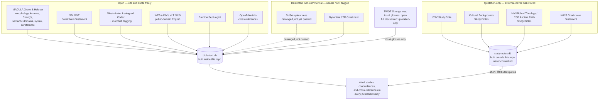

# Our Data Sources

[AI in These Studies](why-ai-assisted-study.md) says every language claim on this site has
to "resolve to a real entry in a real dataset." This page is the receipt: what those datasets are,
where each one comes from, and what it's licensed to let a study do with it.

For the exact copyright lines the publishers require, see
[Copyright & Scripture Permissions](copyright.md). For how the code technically pulls this together —
the build scripts, the query tools — see
[How This Site Is Built](../resources/site-architecture.md). This page sits between the two: what's
here, in plain terms, and why it can be checked rather than taken on faith.

## Three tiers, one rule

Every source below falls into one of three license tiers, and the tier decides how it's used — not
convenience, not how useful the source would be to quote at length:

- **Open** — public domain, or a permissive license (CC BY, CC0). Cited and quoted freely.
- **Restricted, non-commercial** — usable now, since this site doesn't monetize, but flagged by name in
  case that ever changes.
- **Quotation-only** — commercially published, copyrighted text or commentary. Named and cited with a
  short, attributed quotation; never reproduced or bulk-stored at length.

## What each tier is for

**Open data does the heavy lifting.** Nearly everything a word study depends on — the Hebrew and Greek
text itself, morphology, lemmas, Strong's numbers, Louw-Nida/SDBH semantic domains, clause-level syntax
and coreference, cross-references, and four complete public-domain English translations — is open. This
is also the only tier committed into the repo (as `references/open-data/` submodules), so it's the tier
a reader could go pull and check themselves without asking anyone's permission. [Bible Translations &
Source Texts](../scripture/translations.md) is the deep dive on this slice specifically — translation
philosophy, textual-criticism tradeoffs, and a per-edition tracking table for every English translation,
Hebrew witness, and Greek New Testament text this site draws on, English translations included.

**Restricted data fills a specific gap, carefully.** The Byzantine/Textus Receptus Greek text is
usable now under its non-commercial terms. BHSA — a deeper Hebrew syntax resource than MACULA provides
— is cataloged and license-checked but not yet wired into any query tool; MACULA already covers subject,
role, construct state, and coreference for both testaments, so BHSA is reserved for an argument that
specifically needs full clause hierarchy MACULA doesn't give.

**Quotation-only data checks the work; it doesn't write it.** The develop-bible-study skill's own rule
is commentaries last, not first — used to check a reading already reached from the text, not to form
it. Because that tier carries no blanket redistribution right, its database (`study-notes.db`) is built
and stored entirely outside this repo's directory tree, on a separate volume, and never committed —
stronger isolation than a `.gitignore` line, on purpose.

## TWOT: one source, split across two tiers

The *Theological Wordbook of the Old Testament* doesn't fit neatly into one bucket. Its bare facts — a
Strong's number pointing to a TWOT root, lemma, and one-line gloss — are open enough to commit as a
plain JSON map and use freely. Its actual discussion prose, the paragraphs of argument behind each root,
is quotation-only like any other copyrighted reference work: citable by root number and gloss, quotable
a sentence at a time with attribution, never reproduced as a full entry.

## The line that doesn't move

Whatever the tier, the same rule governs every study: a language or textual claim has to resolve to an
actual row in one of these two databases — not recollection, not a plausible-sounding paraphrase. That's
what "checkable" means on the [why AI](why-ai-assisted-study.md) page: the receipt is this page, and the
tools to go check it yourself are documented on
[How This Site Is Built](../resources/site-architecture.md).

## See also

- [Bible Translations & Source Texts](../scripture/translations.md) — the per-edition deep dive on every
  English translation, Hebrew witness, and Greek New Testament text, including which are queryable and
  which are cited from general knowledge
- [Copyright & Scripture Permissions](copyright.md) — the publishers' own required notices
- [How This Site Is Built](../resources/site-architecture.md) — the build pipeline and query tools
- [references/README.md](https://github.com/ding0t/bible_studies/blob/main/references/README.md) — the
  full developer-facing catalog, including exact query patterns for every source above
