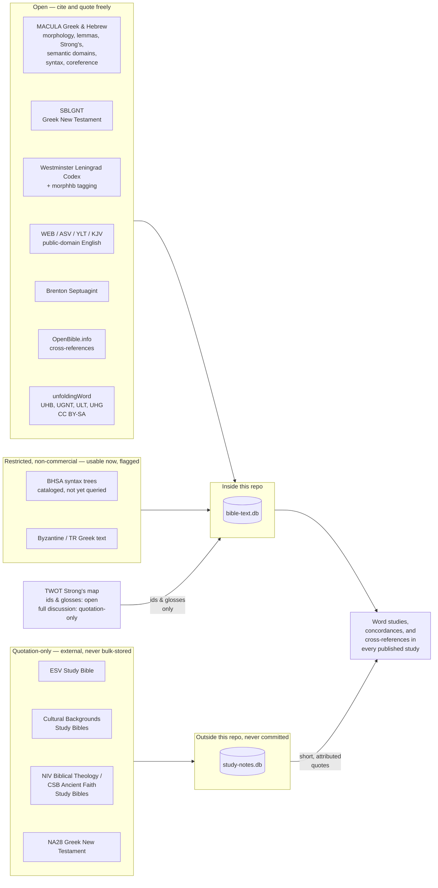

# Our Data Sources

[AI in These Studies](why-ai-assisted-study.md) says every language claim on this site has
to "resolve to a real entry in a real dataset." This page is the receipt: what those datasets are,
where each one comes from, and what it's licensed to let a study do with it.

**This is the authority page for the data this site relies on.** What we use, why, how it is used,
which scripts built and cleaned it, what the two databases contain, and what an agent can reach.
Where a fact about our data lives in more than one place it drifts, so it lives here.

Its companion is [Public Data Sources](../resources/public-data-sources.md), which is a different
job: a survey of the open Bible data that exists in this space — including sources looked at and
turned down — for a reader who wants the landscape rather than our plumbing. Anything there that we
actually use points back here.

Three other pages own questions this one deliberately does not: what a given text is *worth as a
witness* belongs to [Bible Translations & Source Texts](../scripture/translations.md); what the
data's own vocabulary means — lemma, parsing, semantic domain, and what MACULA actually is — to
[Reading the Original-Language Data](../scripture/original-language-data.md); and the church fathers
to [Patristic Sources](../resources/patristic-sources.md).

## Three tiers, one rule

Every source below falls into one of three license tiers, and the tier decides how it's used — not
convenience, not how useful the source would be to quote at length:

- **Open** — public domain, or a permissive license (CC BY, CC0). Cited and quoted freely.
- **Restricted, non-commercial** — usable now, since this site doesn't monetize, but flagged by name in
  case that ever changes.
- **Quotation-only** — commercially published, copyrighted text or commentary. Named and cited with a
  short, attributed quotation; never reproduced or bulk-stored at length.

## What each tier is for

**Open data does the heavy lifting.** Nearly everything a word study depends on — the Hebrew and Greek
text itself, morphology, lemmas, Strong's numbers, Louw-Nida/SDBH semantic domains, clause-level syntax
and coreference, cross-references, and four complete public-domain English translations — is open. This
is also the only tier published alongside this project, so it is the tier a reader can go and check
without asking anyone's permission. [Bible Translations &
Source Texts](../scripture/translations.md) is the deep dive on this slice specifically — translation
philosophy, textual-criticism tradeoffs, and a per-edition tracking table for every English translation,
Hebrew witness, and Greek New Testament text this site draws on, English translations included.

**Restricted data fills a specific gap, carefully.** The Byzantine/Textus Receptus Greek text is
usable now under its non-commercial terms. BHSA — a deeper Hebrew syntax resource than MACULA provides
— is cataloged and license-checked but not yet wired into any query tool; MACULA already covers subject,
role, construct state, and coreference for both testaments, so BHSA is reserved for an argument that
specifically needs full clause hierarchy MACULA doesn't give.

**Quotation-only data checks the work; it doesn't write it.** The rule these studies follow is
commentaries last, not first — used to test a reading already reached from the text, never to form
one. And because that tier carries no right to redistribute, it is kept on separate storage, outside
this project's public repository entirely, rather than relying on a rule that says not to publish
it.

## TWOT: one source, split across two tiers

The *Theological Wordbook of the Old Testament* doesn't fit neatly into one bucket. Its bare facts — a
Strong's number pointing to a TWOT root, lemma, and one-line gloss — are open enough to commit as a
plain JSON map and use freely. Its actual discussion prose, the paragraphs of argument behind each root,
is quotation-only like any other copyrighted reference work: citable by root number and gloss, quotable
a sentence at a time with attribution, never reproduced as a full entry.

## What sits outside both databases

Two kinds of source are used here but belong to neither pipeline, and a catalogue that did not say so
would read as more complete than it is.

**The early church fathers.** Held as plain text on the same external volume, not in either database,
because they are read rather than queried. Nine works: two 19th-century English translation sets for
finding a passage, and seven original-language critical editions — Greek and Latin — for anything
that turns on a father's actual words. Which of the two a citation rests on decides what it can
support, and [Patristic Sources](../resources/patristic-sources.md) sets out the difference along
with the case where this site got it wrong and had to retract.

**Raw teaching notes.** `references/biblefacts/` holds transcripts and worked summaries of
third-party teaching. It is deliberately outside every tier above: unvetted input, a lead to chase
down in a primary source, never a citable reference in a study.

## Keeping our own copies

A claim stays checkable only while the source under it is still reachable. So this project keeps its
own copy of each open source it uses, pinned to an exact version, rather than pointing at whatever a
publisher happens to be serving today. If a dataset changes upstream, the studies do not silently
change with it.

Four sources are so far an exception — unfoldingWord's Hebrew Bible, Greek New Testament, Literal
Text and Hebrew Grammar. Those are pinned to an exact version, but the copy is still the publisher's
own, so a study resting on them depends on that publisher staying online. Taking our own copies is
on the list.

Those four also carry a **share-alike** licence, where everything else open on this page is CC BY,
CC0 or public domain. That places no limit on quoting them. It would matter if this site ever
published a dataset built from them.

### What each of the four actually does here

They are working instruments rather than reading texts, and none of them is a source this site
quotes from — studies quote the ESV by default. Each earns its place by answering a question nothing
else here could:

| Source | What it answers | Where it shows up |
|---|---|---|
| **ULT** — Literal Text | *Which original word is this English word translating?* Every word carries an alignment frame naming the Hebrew or Greek behind it | the 475,036 rows in `word_alignment`, and 326 translator footnotes |
| **UHB** — Hebrew Bible | *What did the Masoretes say to read instead?* The text the ULT's Old Testament alignment resolves against | 949 footnotes, 930 of them **Qere** readings |
| **UGNT** — Greek New Testament | *Does a second Greek edition read this differently?* A Bunning Heuristic Prototype text rather than a committee edition | a fourth Greek witness in `verses`, and 22 notes on disputed passages |
| **UHG** — Hebrew Grammar | *What does this grammatical form do,* as against what the word means | the 88 rows in `grammar_articles` |

Two cautions travel with them, both of which unfoldingWord state themselves.

The UHB numbers verses the **English** way rather than the Hebrew way — it "uses the versification
scheme of the ULT", which they note "may make some resources that are keyed to the WLC more
difficult to use with the Hebrew text". So it and the Westminster Leningrad Codex disagree about
which verse a reference names across roughly 1,500 verses, mostly in Joel, 1 Chronicles, 1 Kings,
Numbers, Job, Ezekiel and Malachi. The UHB records its own Hebrew numbering verse by verse, and this
site keeps that as the `versification_map` table rather than guessing at the shift. See
[versification](../glossary.md#versification).

The UHB also prints a different reading where the Masoretes left two: "in order to avoid
subjectivity, the text of the UHB uses the Ketiv of the WLC", where the Westminster Leningrad Codex
prints the Qere. That one decision accounts for nearly all the ~1.5% of verses where the two Hebrew
texts differ, and the 930 Qere readings are kept as notes on the verses they belong to, so nothing
is lost either way. See [Ketiv and Qere](../glossary.md#ketiv-qere).

Separately, the UGNT differs from this project's default Greek text in about one verse in six by raw
count, though most of that is manuscript spelling rather than a different text.

## The two databases, and what is in them

Nothing here is hand-curated. `bible-text.db` is rebuilt from scratch by
[`references/build/build.py`](https://github.com/ding0t/bible_studies/blob/main/references/build/build.py),
which reads the source collections described above. A re-run produces the same rows, so any claim
resting on it can be re-derived rather than trusted.

| Table | Rows | What it holds |
|---|---|---|
| `works` | 320 | one row per ingested text, with its licence and tier — the thing every other table joins back to |
| `verses` | 1,216,519 | the text itself, every work, every verse |
| `morphology` | 1,819,286 | per-word lemma, Strong's, parsing, and Louw-Nida/SDBH semantic domains, from MACULA |
| `cross_references` | 831,290 | two inherited lists — openbible's crowd-voted set, and the WEB translators' own footnotes |
| `word_alignment` | 475,036 | which original word each English word renders, from unfoldingWord's ULT |
| `scripture_links` | 2,304 | **derived here, not ingested** — quotations and allusions this project detects itself |
| `dss_variants` | 1,874 | where a Dead Sea Scroll reads something the Masoretic text does not |
| `literary_units` | 1,181 | paragraph and pericope boundaries from the Masoretic markers, not modern chapter breaks |
| `versification_map` | 2,033 | the Hebrew verse number for each verse the unfoldingWord Hebrew Bible numbers the English way — stated by the source, not inferred |
| `notes` | 1,297 | the translators' own footnotes — where they judged the text ambiguous, and what the alternative was |
| `grammar_articles` | 88 | what a Hebrew *form* does, as against what a word means |

`study-notes.db` is the second collection, built by `build_study_notes.py` from commercial
study-Bible ebooks. Because that material is quotation-only, it is built and kept **entirely outside
this project's public repository**, on separate storage, so it cannot be redistributed by accident.

### The scripts that clean and derive

| Script | What it does |
|---|---|
| `build.py` | Builds `bible-text.db` from the sources. Also where the cleaning lives: collapsing upstream's duplicate verses, stripping formatting markers that polluted 47% of WEB verses, joining Hebrew morpheme separators that made a match rate 12% instead of 81% |
| `quotations.py` | Derives `scripture_links` — an n-gram index for recall, then Smith-Waterman local alignment for scoring. Every threshold here was set by measurement against the cross-reference lists, not chosen |
| `versification.py` | Moves a reference between the Masoretic, Septuagint and English schemes. Hebrew Joel 3:1 is English Joel 2:28, and getting that wrong is silent |
| `query.py` | The query layer over the finished database, and the CLI |
| `build_study_notes.py` | Builds the external `study-notes.db` |
| `study_gaps.py` | Reads a finished study and reports what connects to its passages that it never cites |
| `commentary_index.py`, `section_index.py` | Regenerate the auto-sections of committed pages from content frontmatter |

### How a study reaches it

Studies here are written against these tables rather than from memory, through the same queries
anyone else can run: ask for a verse and get its text, its per-word parsing and its
cross-references; ask for a word and get every occurrence of it; ask what an English word is
translating and get the original behind it.

The most useful is the trace. Give it a verse and it returns everything the collection knows about
that verse — what it quotes, what quotes it, the words the two share, and how each connection was
established. That last part is the point: a connection arrives with its evidence attached, so it can
be judged rather than believed.

## The line that doesn't move

Whatever the tier, the same rule governs every study: a language or textual claim has to resolve to an
actual row in one of these two databases — not recollection, not a plausible-sounding paraphrase. That's
what "checkable" means on the [why AI](why-ai-assisted-study.md) page: the receipt is this page, and the
tools to go check it yourself are documented on
[How This Site Is Built](../resources/site-architecture.md).

## See also

- [Bible Translations & Source Texts](../scripture/translations.md) — the per-edition deep dive on every
  English translation, Hebrew witness, and Greek New Testament text, including which are queryable and
  which are cited from general knowledge
- [Copyright & Scripture Permissions](copyright.md) — the publishers' own required notices
- [How This Site Is Built](../resources/site-architecture.md) — the build pipeline and query tools
- [references/README.md](https://github.com/ding0t/bible_studies/blob/main/references/README.md) — the
  full developer-facing catalog, including exact query patterns for every source above
