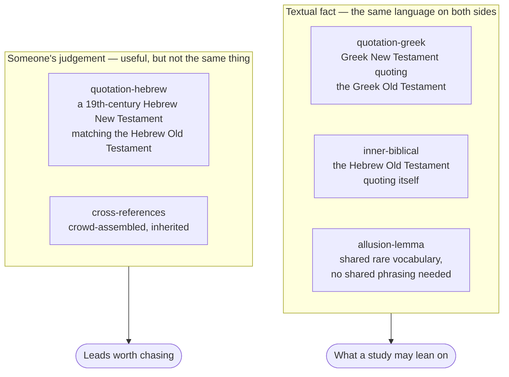
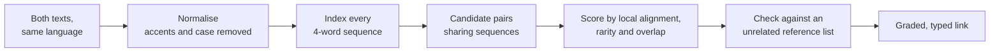

# How We Cross-Reference Scripture

Most cross-reference lists are inherited. A publisher's chain-reference column, the *Treasury of
Scripture Knowledge*, a crowd-voted dataset — each is a record of what previous readers found
connected. That is genuinely useful, and this site uses one. But it has two limits: it reflects the
theological interests of whoever compiled it, and it cannot show you anything nobody thought to
write down.

So the links here are also **derived** — computed from the biblical texts themselves, in their
original languages, by a method anyone can check. This page explains what that method is, what it
can and cannot establish, and why the distinction matters when you are studying a passage.

## The problem a reference list cannot solve

When Hebrews 10:5 says *"a body you have prepared for me"*, it is quoting Psalm 40. Open an English
Bible at Psalm 40:6 and you read *"you have opened my ears"* — a different sentence. Neither
translation is wrong. The New Testament author is quoting the **Septuagint**, the Greek Old
Testament, and the Septuagint reads differently from the Hebrew there.

A cross-reference list can tell you the two verses are connected. It cannot tell you *why* they look
different, and it cannot find the next case like it. For that you have to look at the texts.

## Four kinds of evidence, deliberately kept apart

The method produces four classes of link. They are stored separately and **never combined into a
single relevance score**, because they are not the same kind of evidence and a reader deserves to
know which one they are looking at.

**Quotation, in Greek.** The New Testament's authors wrote Greek and read their Old Testament in
Greek. When Paul quotes Isaiah, both sides are the same language, so the quotation is *literally the
same words*. That is a textual fact, not an interpretation.

**Inner-biblical quotation.** The Hebrew Old Testament quotes itself constantly. The Hezekiah
narrative appears in both 2 Kings and Isaiah; the Decalogue in both Exodus and Deuteronomy;
Chronicles retells Kings. Same language, no translation in between, so again — fact.

**Allusion by rare vocabulary.** Sometimes a passage evokes another without quoting it. Revelation
21:20 lists the jewels of the new Jerusalem; Ezekiel 28:13 lists the jewels of the king of Tyre.
They share no phrasing at all, so no quotation-matching method can see the connection. What they
share is *vocabulary that occurs almost nowhere else*.

**Hebrew New Testament matches.** Two 19th-century scholars independently translated the Greek New
Testament into Hebrew. Where their rendering of a quotation reaches for the Old Testament's own
Hebrew wording, that is a strong hint — but it is a Victorian Hebraist's judgement about what the
text is doing, not evidence from the text itself. Those are labelled as candidates throughout.

## How the correlation actually works

The technique comes from text-reuse detection — the field that also produces plagiarism checkers —
adapted for the fact that Scripture quotes itself openly and adapts as it goes.

Three choices in that pipeline are worth explaining, because each was made for a reason and each is
checkable.

**Normalising first.** Brenton's 1851 Septuagint and the modern SBL Greek New Testament place accents
differently. Compared as printed, identical words fail to match. Stripping accents before comparing
is what makes the method work at all.

**Scoring by local alignment rather than exact overlap.** Biblical quotation adapts. Peter adds *"in
the last days"* to his Joel quotation; Luke drops a clause from Isaiah 61. A measure that counts
only unbroken runs of identical words breaks at the first edit — and it missed **Matthew 1:23
quoting Isaiah 7:14**, one of the most consequential quotations in the New Testament, because
Matthew's longest verbatim stretch there is five words. Local alignment tolerates insertions and
omissions, and finds it.

**Checking against something unrelated.** Every derived link is compared against a crowd-assembled
cross-reference dataset with no connection to the method. Where both agree, two independent lines of
evidence point the same way. Where a strong textual match is *absent* from the reference list, that
is the interesting case — a connection the tradition did not record.

## Why you can trust the thresholds

Every cut-off here was set by measurement, not by taste. The independent reference data gives a way
to ask "how often is a link at this strength corroborated?", and the answer separates sharply:

| Alignment strength | Corroborated independently |
|---|---|
| Strong (20+) | **83%** |
| Borderline (15–19) | 54% |
| Weak (10–14) | 14% |

The threshold sits at the cliff. For allusions the same test gives an even starker picture: randomly
paired verses are corroborated **0.3%** of the time, and pairs above the rarity threshold **52%** —
a 173-fold enrichment.

None of that makes any individual link certain. It means the *grading* is honest, and a link
presented as strong has earned it.

## What this gives you in a study

**It finds what the lists missed.** Roughly one in five strong quotations carries no entry in the
crowd-assembled reference data. Those are not weak results — they are the point.

**It reaches the deuterocanon.** Because our Septuagint lemma data covers Wisdom, Sirach and the
Maccabees, the method surfaces connections no Protestant reference list carries: Paul at the
Areopagus (Acts 17:29) echoing Wisdom 13:10; Hebrews 11:5 on Enoch echoing Sirach 44:16. Whatever
one concludes about those books' authority, the New Testament's authors knew them, and seeing where
their language surfaces is ordinary exegesis.

**It shows the gaps in a study, not just the links.** Every study on this site declares the passages
it treats. The same data can be run in reverse to ask *what connects to these passages that this
study never mentions*. That check found [The Way](../jesus/the-way.md) citing Hebrews 3 without ever naming
Psalm 95 — which Hebrews 3 quotes three times, at its three strongest points.

**It tells you which testament's text you are standing on.** Hebrews 10:5 follows the Greek; Matthew
21:5 follows the Hebrew more closely. That is not a curiosity. It bears on how the New Testament's
authors read their Scriptures, and the links carry it.

## What it does not do

It does not interpret. A link says two passages share text or vocabulary; it does not say the second
fulfils the first, or that the connection is typological, or that the author intended it. Those are
questions for the study, and the tooling deliberately stops short of them.

It does not replace reading. The strongest use of these links is the one a concordance has always
had: they tell you where to look.

And it is bounded by what we can verify. Where the Septuagint's chapter numbering cannot be reliably
mapped to an English Bible's — parts of Jeremiah, most of Proverbs — the link is recorded as having
no English counterpart rather than given a reference that would be wrong. Silence is better than a
confident mistake.

## Where the data lives

The reference database is built from openly licensed sources and regenerated from scratch on every
build, so nothing here is hand-curated in a way that cannot be reproduced. The
[source catalogue](about-our-datasets.md) lists what backs it and under what licence; the
[translations page](../scripture/translations.md) covers the texts themselves and where their
numbering diverges.
