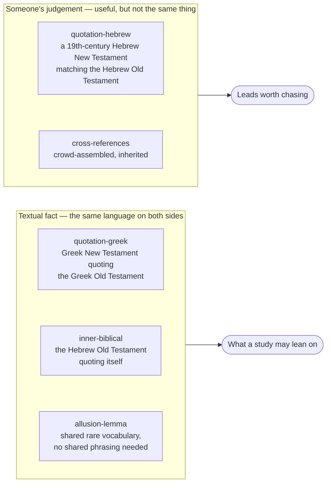
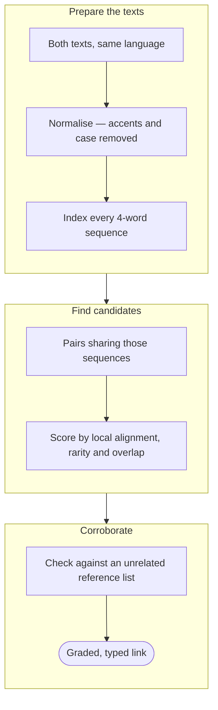

# How We Cross-Reference Scripture

Most cross-reference lists are inherited. A publisher's chain-reference column, the *Treasury of
Scripture Knowledge*, a crowd-voted dataset — each is a record of what previous readers found
connected. That is useful, and this site uses two of them. But they share two limits: each reflects
the theological interests of whoever compiled it, and none can show you anything nobody thought to
write down.

So the links here are also **derived** — computed from the biblical texts themselves, in their
original languages, by a method anyone can check. This page explains what that method is, what it
can and cannot establish, and why the distinction matters when you are studying a passage.

If you would rather see the output than the method, the links are searchable a verse at a time:

[Look up a verse in Scripture Links](../references.md){ .md-button }

## The problem a reference list cannot solve

When Hebrews 10:5 says *"a body you have prepared for me"*, it is quoting Psalm 40. Open an English
Bible at Psalm 40:6 and you read *"you have opened my ears"* — a different sentence. Neither
translation is wrong. The New Testament author is quoting the **Septuagint**, the Greek Old
Testament, and the Septuagint reads differently from the Hebrew there.

A cross-reference list can tell you the two verses are connected. It cannot tell you *why* they look
different, and it cannot find the next case like it. For that you have to look at the texts.

## Four kinds of evidence, deliberately kept apart

The method produces four classes of link. They are stored separately and **never combined into a
single relevance score**, because they are not the same kind of evidence, and which one a link
rests on changes what it can be used for.



**Quotation, in Greek.** The New Testament's authors wrote Greek and read their Old Testament in
Greek. When Paul quotes Isaiah, both sides are the same language, so the quotation is *literally the
same words*. That is a textual fact, not an interpretation.

**Inner-biblical quotation.** The Hebrew Old Testament quotes itself constantly. The Hezekiah
narrative appears in both 2 Kings and Isaiah; the Decalogue in both Exodus and Deuteronomy;
Chronicles retells Kings. Same language, no translation in between, so again — fact.

**Allusion by rare vocabulary.** Sometimes a passage evokes another without quoting it. Revelation
21:20 lists the jewels of the new Jerusalem; Ezekiel 28:13 lists the jewels of the king of Tyre.
They share no phrasing at all, so no quotation-matching method can see the connection. What they
share is *vocabulary that occurs almost nowhere else*.

**Hebrew New Testament matches.** Two 19th-century scholars independently translated the Greek New
Testament into Hebrew. Where their rendering of a quotation reaches for the Old Testament's own
Hebrew wording, that is a strong hint — but it is a Victorian Hebraist's judgement about what the
text is doing, not evidence from the text itself. Those are labelled as candidates throughout.

## How the correlation works

The technique comes from text-reuse detection — the field that also produces plagiarism checkers —
adapted for the fact that Scripture quotes itself openly and adapts as it goes.



Three choices in that pipeline decide what it finds, and each is checkable.

**Normalising first.** Brenton's 1851 Septuagint and the modern SBL Greek New Testament place accents
differently. Compared as printed, identical words fail to match. Stripping accents before comparing
is what makes the method work at all.

**Scoring by local alignment rather than exact overlap.** Biblical quotation adapts. Peter adds *"in
the last days"* to his Joel quotation; Luke drops a clause from Isaiah 61. A measure that counts
only unbroken runs of identical words breaks at the first edit — and it missed **Matthew 1:23
quoting Isaiah 7:14**, one of the most consequential quotations in the New Testament, because
Matthew's longest verbatim stretch there is five words. Local alignment tolerates insertions and
omissions, and finds it.

**Checking against something unrelated.** Every derived link is compared against two cross-reference
lists with no connection to the method or to each other: a modern crowd-voted set, and the World
English Bible translators' own footnotes. Where they agree, independent lines of evidence point the
same way. Where a strong textual match is *absent* from both, that is the interesting case — a
connection the tradition did not record. The second list is small, a few hundred notes against
830,000, but it is concentrated on New Testament quotations of the Old, which is exactly where these
links are scored: it caught three quotations the larger list had missed.

### The measurements, by name

Retrieval is an inverted index over every four-word sequence, and a verse pair has to share at least
two of them before it is scored at all. That step exists for a practical reason: 7,939 Greek New
Testament verses against 22,948 Septuagint verses is 182 million possible pairs, and aligning them
all is not a computation anyone runs. The index does cheap recall; the expensive scoring runs only
on what survives it.

What survives is measured four ways, and the four are stored side by side rather than summed:

| measure | what it says |
|---|---|
| `alignment` | **Smith-Waterman local alignment** — the primary measure. Borrowed from sequence biology, where the same problem appears: find the best-matching stretch *inside* two longer sequences, tolerating insertions and deletions |
| `longest_run` | the longest run of identical consecutive words. Kept because a reader can check it by hand — go and count the nine words — though it breaks at the first edit |
| `containment` | the share of the quoting verse's four-word sequences that are shared, which is how much of the verse *is* quotation |
| `idf_overlap` | shared sequences weighted by how rare they are, so a shared *"and it came to pass"* stops counting like a shared rare phrase |

Rare-vocabulary allusion is scored differently again, because it has no shared phrasing to measure:
a lemma appearing in at most 30 verses across the whole Greek corpus counts as distinctive, and two
passages are linked when the summed rarity of the distinctive vocabulary they share passes a
calibrated weight.

## Where the thresholds come from

The independent reference data answers "how often is a link at this strength corroborated?", and the
answer separates sharply:

| Alignment strength | Corroborated independently |
|---|---|
| Strong (20+) | **86%** |
| Borderline (15–19) | 55% |
| Weak (10–14) | 14% |

The threshold sits at the cliff. For allusions the same test gives an even starker picture: randomly
paired verses are corroborated **0.3%** of the time, and pairs above the rarity threshold **52%** —
a 173-fold enrichment.

None of that makes any individual link certain. It means a link presented as strong is one that
survived the same test as every other.

## What comes out, and where it comes from

Every link lives in one table, `scripture_links`, in the site's reference database, and is rebuilt
from scratch on each build — nothing is hand-curated, and a re-run produces the same rows. The four
classes, the texts on each side of them, and what each currently holds:

| class | from | to | links |
|---|---|---|---|
| `inner-biblical` | Westminster Leningrad Codex | itself | 822 |
| `quotation-greek` | SBL Greek New Testament | Brenton's 1851 Septuagint | 140 |
| `allusion-lemma` | MACULA Greek lemmas | Septuagint lemmas | 103 |
| `quotation-hebrew` | Delitzsch Hebrew New Testament | Westminster Leningrad Codex | 49 |

Those source texts are open-licensed, which is what makes the whole thing reproducible; the
[source catalogue](about-our-datasets.md) gives each one's licence and provenance. The
`inner-biblical` count is the largest because the Hebrew Bible quotes itself constantly, and the
method rediscovers the canonical parallels without being told they exist — 2 Kings 19 ↔ Isaiah 37,
Deuteronomy 5 ↔ Exodus 20, 2 Samuel 22 ↔ Psalm 18, Psalm 14 ↔ Psalm 53.

Asking for a verse returns the evidence rather than a list of references:

```bash
uv run python query.py trace Heb 10 5
```

That prints each connection with how it was established, how strongly, the linked verse in its
original language, an English rendering, and the words the two verses actually share. The same
lookups are exposed to the site's authoring tools directly, and a companion script runs the data
backwards — given a study, it reports what connects to that study's passages that the study never
cites.

## What this gives you in a study

**It finds what the lists missed.** Ten of the 140 strong Greek quotations — about one in fourteen —
are carried by neither list. That figure is deliberately conservative: 23 of the 140 are absent
*at that exact verse*, but 13 of those are cases where a list records the same quotation anchored a
verse or two earlier, which is bookkeeping rather than a discovery. Only the remaining ten are
unrecorded.

**Matthew 11:10** is the clearest of them. *"Behold, I send my messenger before your face"* is
normally referenced to Malachi 3:1, and it is — but the first nine Greek words are also, verbatim,
Exodus 23:20: *Ἰδοὺ ἐγὼ ἀποστέλλω τὸν ἄγγελόν μου πρὸ προσώπου σου*. Matthew has conflated two
passages, and both lists carry the Malachi half while neither carries the Exodus half. Two
independently compiled sets of cross-references, the same blind spot, and a nine-word verbatim
match sitting in plain sight. Luke 1:31 is the same shape — every list points it to Isaiah 7:14,
and none to Genesis 16:11, where the angel gives Hagar the identical formula for naming Ishmael.

**It reaches the deuterocanon.** Because our Septuagint lemma data covers Wisdom, Sirach and the
Maccabees, the method surfaces connections no Protestant reference list carries: Paul at the
Areopagus (Acts 17:29) echoing Wisdom 13:10; Hebrews 11:5 on Enoch echoing Sirach 44:16. Whatever
one concludes about those books' authority, the New Testament's authors knew them, and seeing where
their language surfaces is ordinary exegesis.

**It shows the gaps in a study, not just the links.** Every study on this site declares the passages
it treats. The same data can be run in reverse to ask *what connects to these passages that this
study never mentions*. That check found [The Way](../jesus/the-way.md) citing Hebrews 3 without ever naming
Psalm 95 — which Hebrews 3 quotes three times, at its three strongest points.

**It tells you which testament's text you are standing on.** Hebrews 10:5 follows the Greek; Matthew
21:5 follows the Hebrew more closely. That is not a curiosity. It bears on how the New Testament's
authors read their Scriptures, and the links carry it.

## Set against an inherited list

The *Treasury of Scripture Knowledge* (1836) is the reference point here — public domain, still the
most complete chain-reference set in English, and the thing this method is most often asked to
justify itself against. It is not in this database; the corroboration check above runs against a
modern crowd-voted set instead, with the World English Bible's own footnotes as a second, much
smaller witness.

Four differences are worth knowing, and they cut in both directions.

**An inherited list is better at meaning.** TSK's compilers linked passages that speak to the same
theme in different words — a mercy in Exodus to a mercy in Luke, with nothing textual in common.
No text-reuse method can find those, this one included. It matches words, and a passage that shares
an idea while sharing no vocabulary is invisible to it. For thematic work, the inherited list is the
better tool and this one is no substitute.

**A derived link is graded; a list entry is present or absent.** TSK gives no way to ask which of a
verse's forty references is the quotation and which is a distant echo. Here, `alignment 40` and
`alignment 18` are different claims, and the threshold between them was set by measurement.

**A list is keyed to an English Bible, so it cannot see which text an author was reading.** This is
the Hebrews 10:5 case at the top of this page. A chain reference points from Hebrews 10:5 to Psalm
40:6 and stops. It cannot tell you that the two sentences differ because the author was quoting the
Greek, because the list has no Greek in it. That distinction is the whole substance of the link.

**A list cannot be run backwards, or extended.** TSK covers the Protestant canon and was finished in
1836. It cannot reach Wisdom or Sirach, cannot be asked *what did this study fail to cite*, and
cannot be recomputed when a better text becomes available. All three fall out of deriving the links
instead of inheriting them.

## Tracing one verse

Ask *where does this verse come from* of Hebrews 10:5 and the answer is the evidence itself — the
Greek of both verses, the words they share, and what an English Old Testament makes of the same
place:

> **Hebrews 10:5** — "…but you prepared a body for me."
> **quotes Septuagint Psalm 39:7 = Psalm 40:6**, sharing
> *Θυσίαν καὶ προσφορὰν οὐκ ἠθέλησας, σῶμα δὲ κατηρτίσω μοι*
> **English Psalm 40:6** — "Sacrifice and offering you didn't desire. You have opened my ears."

Two texts, the same Greek words, and an English Old Testament saying something else entirely,
because it renders the Hebrew.

Two things follow from grouping connections by method rather than ranking them together. A verse
drawing on **two** sources shows both: Matthew 21:5 quotes Isaiah 62:11 and echoes Zechariah 9:9,
and the trace returns each half rather than picking a winner. And where a quoted Old Testament verse
is one the Dead Sea Scrolls also attest, any scroll reading the Masoretic lacks is attached to it —
so the question of whether the quoted verse is textually disputed answers itself.

## Reading against the scrolls

The same database carries the biblical Dead Sea Scrolls, and can say where a scroll reads something
the Masoretic Hebrew does not. Deuteronomy 32:8 is the standard case: 4Q37 reads *"sons of God"*
where the Masoretic has *"sons of Israel"*, and both the Septuagint and the New Testament follow the
scroll.

Two cautions are built into how that is reported, because the scrolls are fragmentary and it is easy
to overclaim. **Forty-six per cent of the letters in this corpus are a modern editor's
reconstruction** — only a third of words survive with every letter intact — so a reading only counts
when the differing word itself is whole. And every reading is reported with how much of its verse
survives, because that is the difference between a well-preserved variant and a legible word in a
torn line. Deuteronomy 32:8's reading is clear, but only two words of that verse remain, and a study
citing it should say so.

The comparison also runs one way only. A word the scroll has and the Masoretic lacks is a reading; a
word the Masoretic has and the scroll lacks is almost always damage, and counting it would invent
omissions out of holes.

## What it does not do

It does not interpret. A link says two passages share text or vocabulary; it does not say the second
fulfils the first, or that the connection is typological, or that the author intended it. Those are
questions for the study, and the tooling deliberately stops short of them.

It does not replace reading. The strongest use of these links is the one a concordance has always
had: they tell you where to look.

And it is bounded by what we can verify. Where the Septuagint's chapter numbering cannot be reliably
mapped to an English Bible's — parts of Jeremiah, most of Proverbs — the link is recorded as having
no English counterpart rather than given a reference that would be wrong.

## Where the data lives

The reference database is built from openly licensed sources and regenerated from scratch on every
build, so nothing here is hand-curated in a way that cannot be reproduced. The
[source catalogue](about-our-datasets.md) lists what backs it and under what licence; the
[translations page](../scripture/translations.md) covers the texts themselves and where their
numbering diverges.
