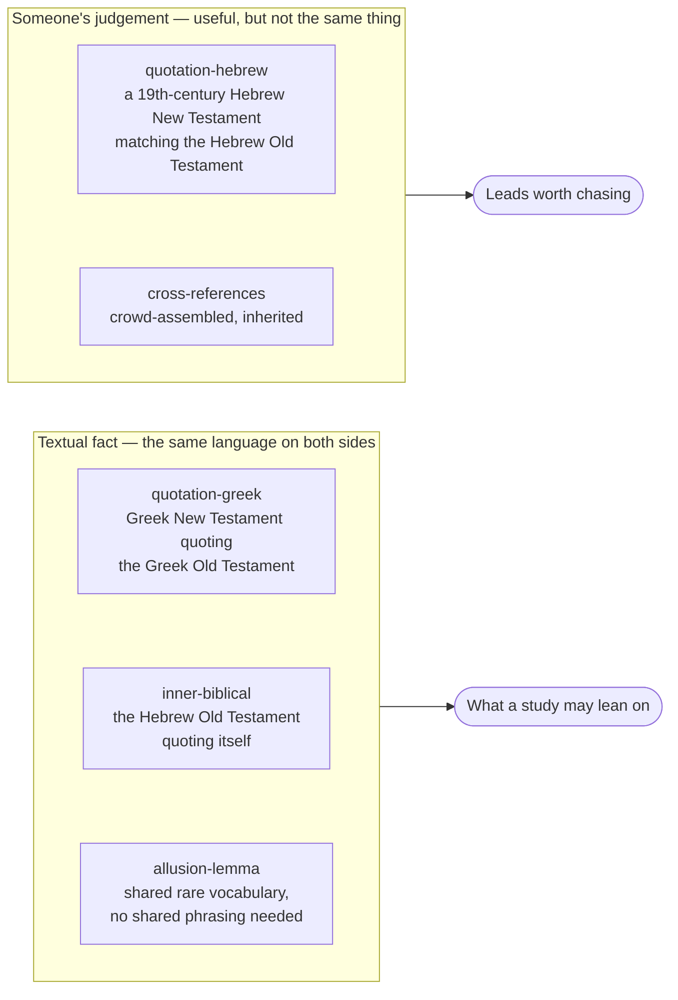
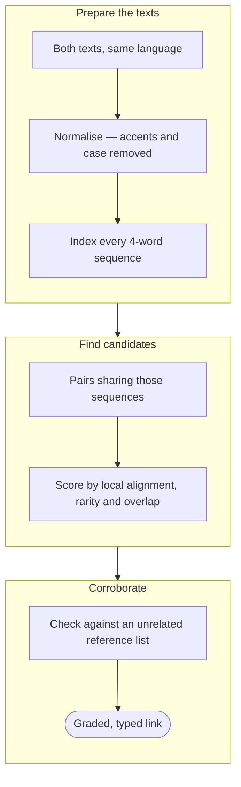

# How We Cross-Reference Scripture

Most cross-reference lists are inherited. A study Bible's centre column, the *Treasury of Scripture
Knowledge* and a crowd-voted dataset each record what earlier readers saw as connected. This site
uses two such lists. They have two limits: each reflects the interests of the people who compiled
it, and none can show a connection nobody wrote down.

So the links here are also **derived**: computed from the biblical texts in their original
languages, by a method anyone can check. This page explains how the method works, what it can and
cannot show, and why that matters when you study a passage.

To skip the method and look up a verse:

[Look up a verse in Scripture Links](../references.md){ .md-button }

## Why a list is not enough

Hebrews 10:5 says *"a body you have prepared for me"* and is quoting Psalm 40. Turn to Psalm 40:6
in an English Bible and it reads *"you have opened my ears"*. Both translations are correct. The
author of Hebrews is quoting the **Septuagint**, the Greek Old Testament, and at this verse the
Septuagint reads differently from the Hebrew.

A cross-reference list tells you the two verses are connected. It cannot explain why they read
differently, and it cannot find other cases like it. Only the texts themselves can.

## Four kinds of link, kept separate

The method produces four kinds of link. Each is stored on its own and they are **never added up
into one relevance score**. They rest on different evidence, and the kind of evidence decides what a
link can be used for.


```mermaid
flowchart LR
    subgraph textual["Textual fact — the same language on both sides"]
        direction TB
        QG["quotation-greek<br/>Greek New Testament quoting<br/>the Greek Old Testament"]
        IB["inner-biblical<br/>the Hebrew Old Testament<br/>quoting itself"]
        AL["allusion-lemma<br/>shared rare vocabulary,<br/>no shared phrasing needed"]
        QG ~~~ IB ~~~ AL
    end
    subgraph judged["Someone's judgement — useful, but not the same thing"]
        direction TB
        QH["quotation-hebrew<br/>a 19th-century Hebrew New Testament<br/>matching the Hebrew Old Testament"]
        XR["cross-references<br/>crowd-assembled, inherited"]
        QH ~~~ XR
    end
    textual --> USE(["What a study may lean on"])
    judged --> LEAD(["Leads worth chasing"])
```

**Greek quotation.** The New Testament writers wrote in Greek and read their Old Testament in Greek.
When Paul quotes Isaiah, both sides are in the same language, so a quotation shows up as the same
words on the page. Anyone can check it.

**Inner-biblical quotation.** The Hebrew Old Testament quotes itself often. The Hezekiah account
appears in both 2 Kings and Isaiah, the Ten Commandments in both Exodus and Deuteronomy, and
Chronicles retells Kings. Both sides are Hebrew, so these too are checkable on the page.

**Allusion by rare words.** Sometimes one passage points to another without quoting it. Revelation
21:20 lists the jewels of the new Jerusalem, and Ezekiel 28:13 lists the jewels of the king of Tyre.
They share no phrases, so a quotation search cannot connect them. They do share words that appear
almost nowhere else in Scripture, and that is what this kind of link measures.

**Hebrew New Testament matches.** Two 19th-century scholars each translated the Greek New Testament
into Hebrew. Where their Hebrew for a quotation uses the Old Testament's own wording, that is a
strong hint. It is still a translator's judgement about the text, so these links are labelled as
candidates everywhere they appear.

## How the matching works

The technique comes from text-reuse detection, the same field that produces plagiarism checkers. It
is adjusted for Scripture, which quotes itself openly and often changes the wording as it does.


```mermaid
flowchart TD
    subgraph prep["Prepare the texts"]
      direction TB
      A["Both texts, same language"] --> B["Normalise — accents and case removed"] --> C["Index every 4-word sequence"]
    end
    subgraph match["Find candidates"]
      direction TB
      D["Pairs sharing those sequences"] --> E["Score by local alignment, rarity and overlap"]
    end
    subgraph check["Corroborate"]
      direction TB
      F["Check against an unrelated reference list"] --> G(["Graded, typed link"])
    end
    prep --> match --> check
```

Three steps in that process decide what it finds.

**Accents are removed first.** Brenton's 1851 Septuagint and the modern SBL Greek New Testament
place accents differently, so identical words would fail to match as printed. Removing accents
before comparing lets them match.

**Matches allow for edits.** Biblical writers adjust what they quote. Peter adds *"in the last
days"* to his quotation of Joel, and Luke leaves a clause out of Isaiah 61. A measure that only
counts unbroken runs of identical words fails at the first change. Such a measure misses **Matthew
1:23 quoting Isaiah 7:14**, one of the most important quotations in the New Testament, because
Matthew's longest word-for-word stretch there is five words. Local alignment allows for added and
missing words, and finds it.

**Every link is checked against outside lists.** Each derived link is compared with two
cross-reference lists that have no connection to this method or to each other: a modern crowd-voted
set and the World English Bible translators' footnotes. When they agree, two independent sources
point the same way. When a strong textual match appears in neither, the method has found a
connection the tradition did not record. The footnote list is small, a few hundred notes against
830,000 crowd-voted links, but it concentrates on New Testament quotations of the Old, the same
ground these links cover. It caught three quotations the larger list had missed.

### The measurements, by name

The first pass is an index of every four-word sequence. A pair of verses must share at least two of
them before it is scored. This keeps the work manageable: 7,939 Greek New Testament verses against
22,948 Septuagint verses makes 182 million possible pairs, far too many to align one by one. The
index finds candidates cheaply, and the slower scoring runs only on those.

Each candidate is measured four ways. The four scores are stored side by side and never summed:

| measure | what it says |
|---|---|
| `alignment` | **Smith-Waterman local alignment**, the main measure. It comes from biology, where the same problem appears in comparing DNA: find the best-matching stretch *inside* two longer sequences, allowing for added and missing pieces |
| `longest_run` | the longest run of identical consecutive words. Kept because a reader can check it by hand (count the nine words), though it fails at the first edit |
| `containment` | the share of the quoting verse's four-word sequences that also appear in the source, which shows how much of the verse *is* quotation |
| `idf_overlap` | shared sequences weighted by how rare they are, so a common phrase like *"and it came to pass"* counts for little and a rare phrase counts for a lot |

Allusions by rare words are scored differently, because there is no shared phrasing to measure. A
word that appears in 30 verses or fewer across the whole Greek corpus counts as distinctive. Two
passages are linked when the distinctive words they share add up past a set weight.

## Where the thresholds come from

The outside lists show how often a link at each strength is confirmed by someone else. The answer
falls into clear bands:

| Alignment strength | Confirmed by an outside list |
|---|---|
| Strong (20+) | **86%** |
| Borderline (15–19) | 55% |
| Weak (10–14) | 14% |

The cut-off for "strong" sits where the rate drops. Allusions show an even sharper split: random
pairs of verses are confirmed **0.3%** of the time, and pairs above the rare-word threshold **52%**
of the time, 173 times as often.

No single link is certain because of this. A link marked strong has passed the same test as every
other link, and links of that strength are confirmed 86% of the time.

## What the method produces

Every link is stored in one table, `scripture_links`, in the site's reference database. The table is
rebuilt from scratch on each build. Nobody edits it by hand, and running the build again produces
the same rows. The four kinds of link, the texts compared, and the current counts:

| class | from | to | links |
|---|---|---|---|
| `inner-biblical` | Westminster Leningrad Codex | itself | 822 |
| `quotation-greek` | SBL Greek New Testament | Brenton's 1851 Septuagint | 140 |
| `allusion-lemma` | MACULA Greek lemmas | Septuagint lemmas | 103 |
| `quotation-hebrew` | Delitzsch Hebrew New Testament | Westminster Leningrad Codex | 49 |

All of these source texts are openly licensed, so anyone can rebuild the table. The
[source catalogue](about-our-datasets.md) gives each one's licence and origin. The `inner-biblical`
count is the largest because the Hebrew Bible quotes itself so often. The method finds the
well-known parallels without being told about them: 2 Kings 19 ↔ Isaiah 37, Deuteronomy 5 ↔ Exodus
20, 2 Samuel 22 ↔ Psalm 18, Psalm 14 ↔ Psalm 53.

Looking up a verse returns the evidence for each link:

```bash
uv run python query.py trace Heb 10 5
```

For each connection it prints how it was found, how strong it is, the linked verse in its original
language, an English translation, and the words the two verses share. The site's authoring tools
use the same lookups. A second script works the other way: given a study, it lists passages
connected to the study's verses that the study never cites.

## What this gives you in a study

**It finds connections the lists missed.** Of the 140 strong Greek quotations, ten (about one in
fourteen) appear in neither outside list. That count is cautious. Twenty-three of the 140 are
missing *at that exact verse*, but in 13 of those a list records the same quotation one or two
verses earlier, so only ten are true gaps.

**Matthew 11:10** is the clearest example. *"Behold, I send my messenger before your face"* is
usually linked to Malachi 3:1, correctly. Its first nine Greek words are also word for word Exodus
23:20: *Ἰδοὺ ἐγὼ ἀποστέλλω τὸν ἄγγελόν μου πρὸ προσώπου σου*. Matthew has combined two passages. Both
lists record the Malachi half and neither records the Exodus half, even though the nine-word match
is easy to see once you look. Luke 1:31 is similar. Every list links it to Isaiah 7:14, and none
links it to Genesis 16:11, where the angel uses the same words to Hagar about naming Ishmael.

**It reaches the deuterocanon.** Our Septuagint data covers Wisdom, Sirach and Maccabees, so the
method finds connections Protestant reference lists leave out: Paul at the Areopagus (Acts 17:29)
echoing Wisdom 13:10, and Hebrews 11:5 on Enoch echoing Sirach 44:16. Whatever their authority, the
New Testament writers knew these books, and seeing where their language appears is part of reading
the text carefully.

**It shows what a study left out.** Every study on this site lists the passages it covers. The same
data can be run the other way to ask *what connects to these passages that this study never
mentions?* That check found [The Way](../jesus/the-way.md) citing Hebrews 3 without naming Psalm 95,
which Hebrews 3 quotes three times at its three most important points.

**It shows which Old Testament text a writer was quoting.** Hebrews 10:5 follows the Greek; Matthew
21:5 is closer to the Hebrew. That tells you how the New Testament writers read their Scriptures,
and the links record it for each quotation.

## Compared with an inherited list

The usual comparison is the *Treasury of Scripture Knowledge* (TSK), published in 1836. It is in
the public domain and is still the most complete chain-reference set in English. It is not in our
database: the outside check described above uses a modern crowd-voted set, with the World English
Bible's footnotes as a second, much smaller source.

TSK and the derived links differ in four ways. TSK is better on one of them; the derived links are
better on the other three.

**TSK finds shared meaning.** Its compilers linked passages on the same theme in different words,
such as a mercy in Exodus and a mercy in Luke with no words in common. Our method matches words, so
it cannot see those links. For thematic study, use TSK.

**Derived links are graded.** TSK gives a verse forty references side by side, with no way to tell
the quotation from the faint echo. Here each link carries a score, so `alignment 40` and
`alignment 18` say different things, and the cut-off between them was set by measurement.

**Derived links show which text the author was reading.** TSK is keyed to an English Bible. It
points Hebrews 10:5 to Psalm 40:6 and stops. It cannot show that the two verses read differently
because Hebrews quotes the Greek, since the list contains no Greek. The derived link records it (see
the Hebrews 10:5 example at the top of this page).

**Derived links can be extended and run in reverse.** TSK covers the Protestant canon and was
finished in 1836. It cannot reach Wisdom or Sirach, cannot tell you what a study failed to cite, and
cannot be rebuilt when a better text becomes available. Links computed from the texts themselves can
do all three.

## Tracing one verse

Ask where Hebrews 10:5 comes from, and the answer shows the Greek of both verses, the words they
share, and how an English Old Testament renders the same verse:

> **Hebrews 10:5** — "…but you prepared a body for me."
> **quotes Septuagint Psalm 39:7 = Psalm 40:6**, sharing
> *Θυσίαν καὶ προσφορὰν οὐκ ἠθέλησας, σῶμα δὲ κατηρτίσω μοι*
> **English Psalm 40:6** — "Sacrifice and offering you didn't desire. You have opened my ears."

The two Greek texts share the same words. The English Psalm says something else because it is
translated from the Hebrew.

Because links are grouped by how they were found, two more things show up. When a verse draws on
**two** sources, both appear: Matthew 21:5 quotes Isaiah 62:11 and echoes Zechariah 9:9, and the
trace returns both. And when a quoted Old Testament verse is also found in the Dead Sea Scrolls, any
scroll reading that the Masoretic Hebrew lacks is attached to it, so you can see straight away
whether the quoted text is disputed.

## Checking against the Dead Sea Scrolls

The same database holds the biblical Dead Sea Scrolls and can show where a scroll reads differently
from the Masoretic Hebrew. Deuteronomy 32:8 is the standard example: 4Q37 reads *"sons of God"*
where the Masoretic has *"sons of Israel"*, and both the Septuagint and the New Testament follow the
scroll.

The scrolls are fragmentary, so two safeguards are built into the reports. **Forty-six per cent of
the letters in this corpus are a modern editor's reconstruction**, and only a third of words survive
with every letter intact. A reading therefore counts only when the differing word itself is whole.
Every reading also reports how much of its verse survives, so you can tell a well-preserved variant
from one legible word on a torn line. Deuteronomy 32:8's reading is clear, but only two words of
that verse survive, and a study citing it should say so.

The comparison runs in one direction. A word the scroll has and the Masoretic lacks is a variant
reading. A word the Masoretic has and the scroll lacks is almost always damage to the scroll, and
counting it would turn holes into omissions.

## Limits

The links do not interpret. A link says two passages share wording or rare vocabulary. Whether the
second fulfils the first, whether the connection is typological, and whether the author meant it are
questions for the study, and the tools leave them there.

The links do not replace reading the passage. Like a concordance, they tell you where to look.

The links only go as far as we can verify. Where the Septuagint's chapter numbers cannot be reliably
matched to an English Bible's (parts of Jeremiah, most of Proverbs), the link is recorded with no
English reference, so it never points you to the wrong verse.

## Where the data lives

The reference database is built from openly licensed sources and rebuilt from scratch on every
build, so anyone can reproduce it. The [source catalogue](about-our-datasets.md) lists those sources
and their licences. The [translations page](../scripture/translations.md) covers the texts
themselves and where their verse numbering differs.
