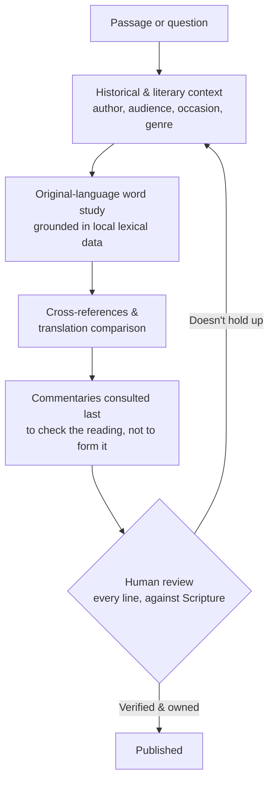

# AI in these studies

AI assists the research and drafting of the studies on this site. This page sets out the method: what
the tool does, the failure modes it brings with it, and where its usefulness ends.

!!! quote "The short version"

    AI is a **research assistant**, not an author and not an authority. It reads the languages I
    can't yet read, compares translations I can't hold in my head at once, and finds the case
    against an idea faster than I can. Every claim resolves to a source, and a human reads every
    line against Scripture before it is published.

---

## What it does

**The original languages come within reach.** I am not formally trained in Biblical Hebrew, Aramaic,
or Greek — I'm at the start of that road, not the end of it. Working through a passage's morphology,
lemmas, Strong's numbers, and semantic domains by hand would take days per chapter, if I could do it
reliably at all. Querying a structured dataset takes minutes, and the result is checkable: when a
study says a word is חֶסֶד (*chesed*) and gives its range of meaning, that
came from a lexical database with an entry anyone can look up.

**Many translations at once.** A single English translation is one committee's set of decisions.
Comparing the Masoretic Text and Septuagint against several English renderings surfaces the places
where translators disagree — which is where a study should slow down and say so.

**Thoughts get structured fast.** A half-formed idea becomes an outline, a set of questions, and a
list of passages to test it against, in an evening rather than over months. Speed here isn't about
producing more; it's about being able to *finish* the thought instead of abandoning it.

**Assumptions get disproved.** This is the benefit I did not expect and now value most. More than
once I've come to a passage sure of what it said, asked for the counter-evidence, and watched the
idea fall over. An assistant that can find the case *against* me quickly is worth far more than one
that agrees with me pleasantly.

**Depth I could not have reached alone.** Feast cycles, calendars, Ancient Near Eastern custom,
Second Temple background — tackling topics with real cultural and linguistic depth behind them has
been the best part of this. Connections I would never have found unaided are now traceable and cited.

---

## Failure modes and guardrails

| Risk | Why it matters | The guardrail |
|---|---|---|
| **Hallucination** — a fabricated lexical claim, a misquoted verse, a citation to a work that doesn't exist | This is the headline failure mode of language models, and in a Bible study it is not a small error — it is putting words in God's mouth | Research is **grounded in structured Bible databases held in this repo** — original-language text, morphology, Strong's, semantic domains, cross-references, drawn from open-licensed scholarly sources. A language claim has to resolve to a real entry in a real dataset. It is not permitted to come from recollection |
| **Fluent, confident, wrong** | Machine-generated prose *sounds* authoritative regardless of whether it is correct. Smoothness is not accuracy | Every substantive claim carries a citation, and translations are always named. An untraceable claim is a defect in the page |
| **Agreement bias** | These tools lean toward building the case you asked for. Ask leadingly and you'll get a confident yes | The study method runs exegesis *before* conclusions and requires the counter-case to be sought. "The one who states his case first seems right, until the other comes and examines him" ([Proverbs 18:17 (ESV)](https://www.blueletterbible.org/esv/Pro/18/17)) |
| **Doctrinal flattening** | A model's instincts reflect whatever is most common in its training data, which drifts toward a vague consensus and away from any defined position | Studies are written from a stated position, not a model's default. See the [Statement of Faith](statement-of-faith.md); interpretive commitments are declared up front rather than absorbed silently |
| **Mishandling others' work** | Scholarship is someone's labour, and lifting it wholesale is theft whoever does the typing | Sources are partitioned by licence. Open-licensed data is used and quoted freely; commercial reference works are cited by name with short, attributed quotations only, never reproduced at length |

A human reads every line against the text before it is published.

---

## How a study gets made

Exegesis first — what the text meant, then and there — and only afterwards what it means here and now.

The loop back to context matters more than the arrow forward. A conclusion that won't stand on the
passage in its own setting goes back for rework; it doesn't get published with softer wording.

---

## Where it stops

**It is not content generation.** A study with nothing to say doesn't get written up to fill a gap in
the navigation. Volume is not the goal.

**It does not replace prayerful, thoughtful study.** AI speeds up the research; it cannot do the part
that matters. "Open my eyes, that I may behold wondrous things out of your law"
([Psalm 119:18 (ESV)](https://www.blueletterbible.org/esv/Psa/119/18)) is not a database query. The
Spirit of truth is the one who guides into truth
([John 16:13 (ESV)](https://www.blueletterbible.org/esv/Joh/16/13)) — a machine retrieves, He teaches.

**It has no spiritual authority.** AI is not converted, not indwelt, not accountable to anyone, and
has no discernment — only pattern. It cannot pray, cannot be convicted of sin, and cannot be taught
by God. Nothing it produces carries weight because it produced it.

**The wrestling is not outsourced.** Sitting with a hard passage until it changes *you* is a large
part of why anyone should study Scripture at all. Hand that over to a tool and you end up with a
better page and a poorer soul. The tool does the fetching, the collating, and the checking; the
sitting with it stays mine, and so does the working out of what it demands.

**Errors here are mine.** If something on this site is wrong, I published it.

---

## Checking the work

The Bereans were commended for checking the Apostle Paul himself against the text
([Acts 17:11 (ESV)](https://www.blueletterbible.org/esv/Act/17/11) — "examining the Scriptures daily
to see if these things were so"). If Paul's teaching was fair game for verification, so is this.

**Test everything; hold fast what is good**
([1 Thessalonians 5:21 (ESV)](https://www.blueletterbible.org/esv/1Th/5/21)). The citations on these
studies are there to be followed. If something is wrong,
[tell me](https://github.com/ding0t/bible_studies/issues).

Scripture is the authority. This site is one person's working out of it, assisted by a tool that is
very good at retrieval and utterly incapable of faith.
