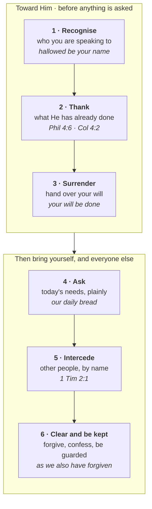

# Prayer: Communion and the Habit It Sustains

Prayer in the New Testament is a child speaking to a father. The cry it puts in a Christian's mouth
is "Abba! Father!", and Paul says the Spirit *produces* that cry (Romans 8:15).

What the relationship produces is a habit, and the New Testament has a word for that too:
**προσκαρτερέω** (*proskartereō*) — to stick at something, to keep at it stubbornly. It occurs ten
times, and five of them are about prayer: the upper room "devoting themselves to prayer" (Acts 1:14),
the first church devoted to "the breaking of bread and the prayers" (Acts 2:42), the apostles
refusing administration so they could "devote ourselves to prayer" (Acts 6:4), the Romans told to
"be constant in prayer" (12:12), and the Colossians to "continue steadfastly in prayer" (4:2).

**In one sentence:** God the Father has adopted you, opened the way to Himself through His Son Jesus, and given you His Holy Spirit to cry "Abba! Father!"; so prayer is a child's daily conversation with Him, kept up as a habit Jesus Himself kept at cost, in which He brings your will into line with His and acts.

## Key Takeaways

*(This section follows the [Key Takeaways](../about/key-takeaways.md) format this site is
prototyping — see that page for what each part is for and why.)*

### Lessons about Jesus

- **He prayed as a habit.** Luke 5:16 uses a *periphrastic imperfect*, the form Greek uses for
  repeated or customary action: "he *would* withdraw and pray." See
  [below](#why-that-second-row-says-would).
- **He deliberately prayed alone, at cost.** Before dawn and out of town, so that the disciples had
  to hunt him down (Mark 1:35-37); by himself on the mountain after feeding the five thousand
  (Matthew 14:23); apart even while the disciples were with him (Luke 9:18); and a stone's throw
  from his closest friends in Gethsemane (Luke 22:41).
- **He prayed before decisions.** All night on the mountain before naming the twelve (Luke 6:12).
- **He prayed the Father's will be done, even through the hardest thing asked of Him**, and the
  prayer includes a request that was not granted: "remove this cup from me. Nevertheless, not my
  will, but yours, be done"
  (Luke 22:42). Hebrews says He "was heard because of his reverence" (5:7) — heard, and the cup
  stayed.
- **He is praying for you now.** "He always lives to make intercession for them" (Hebrews 7:25), and
  He does it "at the right hand of God" (Romans 8:34).

### Memory verses

> ✝️ [Colossians 4:2 (ESV)](https://www.blueletterbible.org/esv/Col/4/2)
>
> 2 Continue steadfastly in prayer, being watchful in it with thanksgiving.

> ✝️ [Philippians 4:6-7 (ESV)](https://www.blueletterbible.org/esv/Php/4/6-7)
>
> 6 do not be anxious about anything, but in everything by prayer and supplication with thanksgiving
> let your requests be made known to God. 7 And the peace of God, which surpasses all understanding,
> will guard your hearts and your minds in Christ Jesus.

### Be Transformed

- **Think.** Prayer is a conversation with a Father who has already opened the way to Himself, at
  the cost of His Son. If you pray as though you must first get His attention, the problem is your
  picture of Him, and the picture comes first. The willingness to pray is given
  ("the Spirit of adoption as sons, by whom we cry, 'Abba! Father!'", Romans 8:15).
- **Attitude.** Approach prayer as a relationship: He is your personal Father. His will is always
  wiser and better than ours, and He offers His own strength for what it asks of us. "Your Father
  knows what you need before you ask him" (Matthew 6:8), and Jesus says that as a reason *to* pray.
- **Do.** Develop the habit: pray as you walk, and before a meeting. Thank God for who He is and
  what He has done. Pray for strength. Fix a time and a place. Daniel had a window and three set
  hours (Daniel 6:10); Jesus had a desolate place before dawn (Mark 1:35).

### Prayer

*(Prayed through the six movements this study arrives at — see
[A pattern to pray by](#a-pattern-to-pray-by).)*

Father, you are holy. Thank you for restoring my broken relationship with you through your Son Jesus.

Thank you that I can come to you freely, and commune with you in thanksgiving and in every
supplication.

Thank you that you always hear.

Have your way in me. Where my asking is really instruction, correct it; I would rather want what you
want than get what I came for.

Give me what today needs, and make me steady where I have been sporadic. For the people you have put
in front of me, and the ones whose names I keep meaning to bring: let them know you better.

Forgive me for treating prayer as the thing I do when the other options have run out, and make me
quick to forgive where I have been slow. Keep me tomorrow; I will not manage it on my own.

In Jesus' name. Amen.

## Study outline

1. **[Communion before discipline](#communion-before-discipline)** — the Spirit's cry, and the habit.
2. **[Who am I praying to?](#who-am-i-praying-to)** — the Father, through the Son, in the Spirit.
3. **[How Jesus prayed](#how-jesus-prayed)** — habitually, alone, at cost.
4. **[How the apostles prayed](#how-the-apostles-prayed-and-what-they-taught)** — and what Paul asked for.
5. **[Personal and corporate](#personal-and-corporate)**
6. **[What to pray about](#what-to-pray-about)** — 1 Timothy 2:1's four words.
7. **[What prayer permits God to do](#what-prayer-permits-god-to-do)** — a will aligned, then God acting.
8. **[A pattern to pray by](#a-pattern-to-pray-by)** — six steps.
9. **[Teaching a household to pray](#teaching-a-household-to-pray)**

## Communion before discipline

### A given willingness: the Spirit's own cry

The New Testament presents the willingness to pray as **given**.

> ✝️ Romans 8:15-16 (ESV)
>
> 15 For you did not receive the spirit of slavery to fall back into fear, but you have received the
> Spirit of adoption as sons, by whom we cry, "Abba! Father!" 16 The Spirit himself bears witness
> with our spirit that we are children of God,

The cry is produced: "by whom we cry." Galatians says the same and draws the
conclusion: "God has sent the Spirit of his Son into our hearts, crying, 'Abba! Father!' So you are
no longer a **slave**, but a **son**" (4:6-7). Slave and son is the difference between
prayer as a chore and prayer as a relationship. A slave prays because he must and stops when he can;
a son speaks to his father because that is what the relationship is for.

This is **adoption**, and it shows that God wants to be spoken to: He made you His child and sent
the Spirit of His Son Jesus to say "Father" in you. So you can come to Him as your Father on the
days you feel nothing.

**The Psalms record appetite.** Nobody writes this out of duty:

> ✝️ Psalm 42:1-2 (ESV)
>
> 1 As a deer pants for flowing streams, so pants my soul for you, O God. 2 My soul thirsts for God,
> for the living God. When shall I come and appear before God?

That is language about wanting, and it is the normal
register of prayer in the Psalter.

### The order, and why it runs both ways

**Jesus offers rest.** "Come to me, all who labor and are heavy laden, and I will give you rest… For
my yoke is easy, and my burden is light" (Matthew 11:28-30).

**Get the relationship right and the habit becomes sustainable**; try to build the habit on
obligation and it lasts as long as your willpower does. "In your presence there is fullness of joy"
(Psalm 16:11) is the motive the Bible actually supplies.

**The traffic runs both ways.** Appetite makes a habit sustainable; the habit is what carries you
across the stretches where appetite fails — and everyone has those. Jesus got up before dawn and
walked out of town to a desolate place. That is what a love does when it is inconvenient, which is
also the point at which love and discipline stop being distinguishable.

## Who am I praying to?

### The Father is the pattern Jesus gave

**The pattern Jesus gave is prayer to the Father.** "Pray then like this: *Our Father in heaven*"
(Matthew 6:9); "when you pray, say: *Father*" (Luke 11:2). And He gives the mechanism plainly:

> ✝️ John 16:23-24 (ESV)
>
> 23 In that day you will ask nothing of me. Truly, truly, I say to you, whatever you ask of the
> Father in my name, he will give it to you. 24 Until now you have asked nothing in my name. Ask,
> and you will receive, that your joy may be full.

**Paul states the same shape as a single sentence with all three persons in it**: "through him we
both have access in one Spirit to the Father" (Ephesians 2:18). To the Father, through the Son, in
the Spirit. That is the normal Christian posture in prayer, and it is the posture of Paul's own
recorded prayers, which are addressed to the Father (Ephesians 1:16-17; 3:14).

### The access has a basis, and what "access" actually means

**The access has a basis, and Hebrews states it.**

> ✝️ Hebrews 10:19-22 (ESV)
>
> 19 Therefore, brothers, since we have confidence to enter the holy places by the blood of Jesus,
> 20 by the new and living way that he opened for us through the curtain, that is, through his flesh,
> 21 and since we have a great priest over the house of God, 22 let us draw near with a true heart in
> full assurance of faith, with our hearts sprinkled clean from an evil conscience and our bodies
> washed with pure water.

The curtain is the temple veil, the blood is Jesus's, and the conclusion the writer draws
from it is an instruction to pray: **draw near**. Hebrews 4:16 gives the same instruction with the
promise attached — "let us then with confidence draw near to the throne of grace, that we may
receive mercy and find grace to help in time of need."

Paul's word at Ephesians 2:18 is **προσαγωγή** (*prosagōgē*), and Louw-Nida files it in the domain
of **communication**. It is the word for being brought in and presented to someone, the
way a stranger is introduced at court. And Hebrews' word for what you do next is
**προσέρχομαι**, "draw near", which at 11:6 carries the semantic domain of **association**: coming
close to a person.

So the blood and the curtain are the reason the conversation is possible. Prayer is talking to a
Father you were brought to at that cost. "Confidence" is the word both passages reach for —
"confidence to enter" (Hebrews 10:19), "with confidence draw near" (4:16) — and it is confidence
about a welcome.

That cost is the **atonement**: the Father opened the way to Himself through the blood of His Son
Jesus, who "always lives to make intercession" for you (Hebrews 7:25). So you may come to Him today
with confidence, as one already welcomed.

### Prayer to Jesus, the Spirit's part, and the practical answer

**Prayer addressed to Jesus is also in the New Testament, and is never corrected.** Stephen dies
praying to Him: "Lord Jesus, receive my spirit" (Acts 7:59), which is Psalm 31:5 redirected to
Christ. Paul "pleaded with the Lord" three times about his thorn and got an answer from Christ:
"my power is made perfect in weakness… the power of Christ" (2 Corinthians 12:8-9). Paul describes
Christians simply as "all those who in every place call upon the name of our Lord Jesus Christ"
(1 Corinthians 1:2). And the Bible's last prayer is addressed to Him: "Come, Lord Jesus!"
(Revelation 22:20).

**The Spirit's role is stated differently.** Romans 8:26-27 has the Spirit interceding *for* us
"with groanings too deep for words." No prayer
in the New Testament is addressed to Him. That is an argument from silence rather than a
prohibition, and it is why this study describes the Spirit's part as help given to the one praying.

So the practical answer: **make the Father your habit and your default, because that is what Jesus
taught; speak to the Son freely, because Scripture does.**

## How Jesus prayed

| | |
|---|---|
| **Early, and alone** | "Rising very early in the morning, while it was still dark, he departed and went out to a desolate place, and there he prayed" (Mark 1:35) |
| **Habitually** | "He *would* withdraw to desolate places and pray" (Luke 5:16) |
| **At length before decisions** | "All night he continued in prayer to God," then chose the twelve (Luke 6:12) |
| **After success, not only after failure** | He dismisses the crowd he has just fed and goes up the mountain alone (Matthew 14:23) |
| **With his voice, and in distress** | "loud cries and tears" (Hebrews 5:7) |
| **Submitting a real request** | "Remove this cup… nevertheless, not my will, but yours" (Luke 22:42) |

### Why that second row says "would"

Luke could have written a simple past: he withdrew, he prayed, and that would be a report of one
afternoon. Instead he writes **ἦν ὑποχωρῶν καὶ προσευχόμενος**: the verb "to be" followed by two
participles. Greek uses that construction — a **periphrastic imperfect** — to mark action as ongoing
or repeated. Literally "he was withdrawing and praying," which in natural
English becomes "he would withdraw."

The English versions split on whether they keep it, which is useful to know before building anything
on the verse:

| Keeps the customary sense | Loses it |
|---|---|
| **ESV** "he *would* withdraw"; **NIV** and **NKJV** "*often* withdrew"; **CSB** "he *often* withdrew"; **BSB** "*frequently* withdrew" | **KJV**, **ASV**, **WEB** "he withdrew himself… and prayed" — a simple past, and the habit is gone |

### He went to trouble to be alone

The narrators keep reporting the solitude, and it was deliberate enough to inconvenience people.

**He left before anyone was awake, and had to be hunted down.** After the whole town gathered at the
door in Capernaum, Mark has Him gone before dawn (1:35). The next verse says Simon and the others
**κατεδίωξεν** Him, a verb that
occurs nowhere else in the New Testament and means to track down or pursue closely; the ESV's
"searched for him" is mild for it. When they find Him, their reproach is the obvious one: "Everyone
is looking for you" (1:37).

**He did it after success as much as after pressure.** Having fed five thousand, He "dismissed the
crowds" and "went up on the mountain **by himself** to pray. When evening came, he was there
**alone**" (Matthew 14:23). John gives the motive at the
same moment: perceiving they meant "to take him by force to make him king, Jesus withdrew again to
the mountain by himself" (6:15). Solitude was a retreat from acclaim as well as from demand.

**He prayed apart even in company.** Luke 9:18: "as he was praying **alone** (κατὰ μόνας), the
disciples were with him."

**And at the worst moment he separated in stages.** At Gethsemane He leaves eight ("Sit here, while
I go over there and pray"), takes Peter, James and John further in, then goes "a little farther" and
falls on His face alone (Matthew 26:36-39). Luke measures the last stage: "about a stone's throw"
(22:41).

The place is usually **ἔρημος** (*erēmos*), a desolate or wilderness place — Mark 1:35, Luke 4:42,
Luke 5:16, somewhere He had to travel to. That is what makes
the solitude legible as a decision: it cost Him sleep, it cost Him distance, and it cost the people
around Him access to Him while it lasted.

### What He went for

He went to be with His Father, and John 17 is the one long record of what
that sounded like from the inside. The solitude is the arrangement of someone protecting the
relationship He most wanted, from the demands of everyone who wanted Him. That is the same order the
study opened with: communion first, and the habit built to serve it. **He made time**, and the
withdrawing always cost something He could otherwise have been doing.

The Son of God, who was not short of anything, got up in the dark and walked out of a town that
wanted Him, repeatedly, for years, in order to talk to His Father. Prayer is what the strongest man
who ever lived arranged His life around. If He wanted that much time with the Father, the Father is
worth yours.

## How the apostles prayed, and what they taught

### Prayer as work with a claim on their time

**They treated prayer as work with a claim on their time.** When administration threatened it, the
Twelve delegated the administration: "we will devote ourselves to prayer and
to the ministry of the word" (Acts 6:4). That is the same προσκαρτερέω as Colossians 4:2.

**Their crisis prayer opens with sovereignty and closes with a request for boldness.** Threatened by
the Sanhedrin, the church prays together:

> ✝️ Acts 4:24 (ESV)
>
> 24 And when they heard it, they lifted their voices together to God and said, "Sovereign Lord, who
> made the heaven and the earth and the sea and everything in them,

**And the address itself is Scripture**: Exodus 20:11 and Psalm 146:6, both of which
read "who made heaven and earth, the sea, and all that is in them." They then recite Psalm 2, name
what has already happened as what God's "hand and… plan had predestined to take place" (4:28), and
only then ask. They do not ask for the threat to be
removed; they ask to speak boldly through it (4:29).

### What Paul actually asks for: knowing God

**Paul's recorded prayers for churches ask for wisdom and knowledge**, and
his own vocabulary is the evidence. Across the three (Ephesians 1:16-19; Colossians 1:9-10;
Philippians 1:9) he asks four times for **ἐπίγνωσις** (*epignōsis*, knowledge), twice for
**σοφία** (*sophia*, wisdom), and once each for **σύνεσις** (understanding) and **ἀποκάλυψις**
(revelation).

ἐπίγνωσις is γνῶσις with **ἐπι-** on the front — knowledge *of* Him, the kind you have of a person.
So Ephesians 1:17-18 asks for "the Spirit of wisdom and of revelation in the knowledge of
him, having the eyes of your hearts enlightened", and Colossians 1:9 for "the knowledge of his will
in all spiritual wisdom and understanding". Set beside how most of us pray, he asks for changed
people more than changed situations — and specifically for people who **know God better**, which is
the one request no change of circumstances could grant.

This shows what God is most ready to give: Himself, known. So ask first that you, and the people you
name, would know Him better.

**Paul still prays about circumstances.** When he asks churches to pray for *him*, the requests are
almost entirely circumstantial: that he
would "be delivered from the unbelievers in Judea" and "come to you with joy" (Romans 15:31-32);
that "God may open to us a door for the word" while he is in prison (Colossians 4:3); that "words
may be given" him to speak boldly (Ephesians 6:19-20); that he be "delivered from wicked and evil
men" (2 Thessalonians 3:2). Deliverance, travel, open doors, courage.

**Paul says what he wants the circumstance for**: a door "*for the word*"; rescue so that "the word
of the Lord may speed ahead and be honored" (2 Thessalonians 3:1).
The request has a purpose attached, and the purpose is always larger than the relief. That is a
usable test for your own asking: name the thing you want, then say what you want it *for*, and see
whether the answer survives being said out loud.

## Personal and corporate

The New Testament requires both, and the two texts sit a few verses apart.

**The closet** is Matthew 6:6, "go into your room and shut the door", against the hypocrites who
pray "that they may be seen by others" (6:5); [The Lord's Prayer](lords-prayer.md) sets it in
context.

**The gathering.** Yet in the prayer Jesus then teaches, every first-person word is plural — *our*
Father, give *us*, forgive *us*, lead *us* not. Even prayed alone behind a shut door, it is a prayer
that puts you in a family. And Acts shows the church praying corporately as a matter of course: "with
one accord… devoting themselves to prayer" (1:14), "earnest prayer for him was made to God by the
church" (12:5), voices lifted "together" (4:24).

Corporate prayer without a
private life behind it becomes performance, the exact fault of Matthew 6:5. A private life with no
corporate expression loses the "our," and with it the reminder that you are one of many.

## What to pray about

### Four words, four domains

Paul gives four distinct words in one sentence, and Louw-Nida assigns each its own semantic domain.

> ✝️ 1 Timothy 2:1-2 (ESV)
>
> 1 First of all, then, I urge that supplications, prayers, intercessions, and thanksgivings be made
> for all people, 2 for kings and all who are in high positions, that we may lead a peaceful and
> quiet life, godly and dignified in every way.

| Greek | Sense | In practice |
|---|---|---|
| **δεήσεις** (*deēseis*) | asking out of need — begging | what you lack, and cannot fix |
| **προσευχάς** (*proseuchas*) | prayer, the general word | the ordinary talking |
| **ἐντεύξεις** (*enteuxeis*) | approaching someone on another's behalf | intercession — named people, and what you want for them |
| **εὐχαριστίας** (*eucharistias*) | thanksgiving | what he has already done |

### Proportion, scope, and the ground

Most prayer lives are heavy on the first and light on the last two. Paul's ordering puts
intercession and thanksgiving in the same breath as asking for yourself, and then names the least
likely subject: governing authorities, including the ones persecuting the church he wrote to.

Philippians 4:6 gives the scope in a word: "in everything." That is a permission granted on the
strength of the relationship — a child brings a father
whatever is in his hands, and the smallness of a thing is not a reason to leave it out.

Paul gives the ground four verses later, in the same paragraph: "there is one mediator between God
and men, the man Christ Jesus, who gave himself as a ransom for all" (1 Timothy 2:5-6). The list of
what to pray and the reason you may pray it are one piece of writing.

## What prayer permits God to do

### The condition and what follows, across the canon

The model prayer contains the answer in four words. Jesus puts
**"your will be done, on earth as it is in heaven"** (Matthew 6:10) third, before a single request
for bread, forgiveness or rescue. Prayer as He teaches it opens by handing the outcome over.

It is one of the most consistent structures in Scripture: **a will
brought into line with God's, and then God acting.** It holds across every part of the canon.

| | The condition | What follows |
|---|---|---|
| **2 Chronicles 7:14** | "humble themselves, and pray and **seek my face** and **turn** from their wicked ways" | "**then** I will hear from heaven… and heal their land" |
| **Psalm 37:4** | "**Delight yourself** in the LORD" | "and he will give you the desires of your heart" |
| **John 15:7** | "If you **abide in me, and my words abide in you**" | "ask whatever you wish, and it will be done for you" |
| **James 4:7-10** | "**Submit** yourselves therefore to God… **Draw near** to God… **Humble** yourselves" | "and he will draw near to you… and he will exalt you" |
| **1 John 3:22** | "**because** we keep his commandments and do what pleases him" | "whatever we ask we receive from him" |
| **1 John 5:14** | "if we ask anything **according to his will**" | "he hears us" |

Two more state it from the other side:

| | The condition | What follows |
|---|---|---|
| **Psalm 66:18** | "If I had cherished iniquity in my heart" | "the Lord would not have listened" — and the next verse: "But truly God has listened" |
| **Proverbs 28:9** | "If one turns away his ear from hearing the law" | "even his prayer is an abomination" |

Psalm 37:4 is the one most often quoted as a blank cheque and is the clearest example of the
pattern: delight in God *first* and He grants the heart's desires, because delighting in Him is
what reshapes the desires.

### Moses and Daniel: praying what God already said

**Moses and Daniel show what praying God's will actually looks like.** Moses, interceding after the
golden calf, argues from God's reputation among the
Egyptians and from the covenant God swore to Abraham — "*Remember* Abraham, Isaac, and Israel… to
whom you swore by your own self" (Exodus 32:13), and "the LORD relented from the disaster"
(32:14). He prays God's own stated commitments back to Him. Daniel does it more explicitly still:
he "perceived in the books" what God had declared through Jeremiah about the seventy years
(Daniel 9:2), and *then* prayed for it. When he asks, he disclaims leverage outright: "we do
not present our pleas before you because of our righteousness, but because of your great mercy"
(9:18).

That is the shape: finding out what God has said He wants, and asking Him for it. Samuel's answer
is the whole posture in five words: "Speak, for your servant hears" (1 Samuel 3:10).

### What prayer permits: your will, handed over

**So what does prayer permit God to do in your life?** Chiefly it permits Him to have it. The
seeking is the point at which my will is handed over, and Scripture presents that surrender as the
condition God acts through. Romans 12 has the order exactly: present your body as a living
sacrifice *first*, then "by testing you may discern what is the will of God" (12:1-2). Discernment
follows surrender. Which is why Paul's prayers ask for wisdom,
Epaphras labours in prayer "that you may stand mature and fully assured in **all the will of God**"
(Colossians 4:12), and the Spirit Himself intercedes "according to the will of God" (Romans 8:27).

Held that way, an unanswered request stops being evidence of a defective prayer life. Gethsemane was
prayed perfectly and the cup stayed. The measure of a prayer life is whose will
it is being conformed to.

Prayer changes circumstances often enough that Scripture tells you to ask. It changes the person
praying every time, and on the evidence above that is the mechanism.

This shows that God's purpose in your praying includes your **sanctification**: He conforms your will
to His and acts through the surrendered will. So you can bring Him every request and leave the
outcome with a Father whose will is always wiser than yours.

*How God answers prayer — heard at once, answered by varied routes and on His own timetable, and
kept — is being developed as a separate study.*

## A pattern to pray by

All of the above reduces to a shape small enough to hold in your head. It is the Lord's Prayer's own
order, with thanksgiving and intercession placed where the rest of the New Testament puts them. This
site has a full exegetical study of the petitions themselves at [The Lord's Prayer](lords-prayer.md).
Each step below has a suggested opening — words to start with — and someone in Scripture who prayed
that way.

### Toward Him, before anything is asked

These three have one job: to get your eyes onto God before you look at yourself. They are the
attitude the rest of it is prayed in — God named for who He
is, thanked for what He has already done, and His will put ahead of yours while you still have the
option of preferring your own.

**1. Recognise who you are speaking to.** *"Our Father in heaven, hallowed be your name."* Two
things at once, correcting opposite errors: He is a **Father**, so you come as a child; and His name
is **holy**, so you come as a creature. Say
something true about Him before you say anything about yourself.

> **Try:** *"Father, you are holy, and you are mine. You made everything there is, and you are not
> reluctant to hear me."*
>
> **Old Testament:** David, handing over the temple plans — "Yours, O LORD, is the greatness and the
> power and the glory and the victory and the majesty… Yours is the kingdom" (1 Chronicles 29:11).
> Nehemiah opens the same way: "O LORD God of heaven, the great and awesome God who keeps covenant"
> (1:5).
> **New Testament:** the church under threat — "Sovereign Lord, who made the heaven and the earth
> and the sea and everything in them" (Acts 4:24).

**2. Thank Him.** Name what He has already done. Paul attaches thanksgiving to requests ("by prayer
and supplication *with thanksgiving*", Philippians 4:6) and to persistence ("being watchful in it
with thanksgiving", Colossians 4:2). It is the practical guard against a prayer life that silts up
into a list of complaints.

> **Try:** *"Thank you for ______ — this week, and yesterday, and for what I have stopped noticing."*
>
> **Old Testament:** "Bless the LORD, O my soul… and forget not all his benefits" (Psalm 103:1-2) —
> a man telling himself to remember. "Enter his gates with thanksgiving" (Psalm 100:4).
> **New Testament:** Paul, of a church he is about to correct — "I do not cease to give thanks for
> you, remembering you in my prayers" (Ephesians 1:16).

**3. Hand over your will.** *"Your kingdom come, your will be done, on earth as it is in heaven."*
This is the hinge — alignment first, then God
acting ([the pattern](#what-prayer-permits-god-to-do)). Ask what He wants before telling Him what you want.

> **Try:** *"Your will here, not mine. Show me what you are doing, and make me willing before I ask
> for anything."*
>
> **Old Testament:** Samuel as a boy — "Speak, for your servant hears" (1 Samuel 3:10); and Daniel,
> who read what God had already said and then prayed for it (Daniel 9:2-3).
> **New Testament:** Gethsemane — "not as I will, but as you will" (Matthew 26:39). And the
> disciples, when they could not talk Paul out of Jerusalem: "Let the will of the Lord be done"
> (Acts 21:14).

### Then bring yourself, and everyone else

Having fixed your eyes on God in the first three, you bring your own needs and other people's into a
frame that has already been set. The needs are no smaller; they are being said to someone you have
just spent three movements remembering.

**4. Ask for today.** *"Give us this day our daily bread."* Real needs, plainly said, and today's
rather than the whole year's. This is **δέησις** ([What to pray about](#what-to-pray-about)).

> **Try:** *"Today I need ______. I am not managing ______."*
>
> **Old Testament:** Agur's prayer is the daily-bread petition in advance — "give me neither poverty
> nor riches; feed me with the food that is needful for me" (Proverbs 30:8), with his reason given
> in the next verse.
> **New Testament:** "do not be anxious about anything, but in everything by prayer and supplication
> with thanksgiving let your requests be made known to God" (Philippians 4:6).

**5. Name other people.** **ἔντευξις**, intercession, which is what Paul's recorded prayers for
churches consist of almost entirely (Ephesians 1:16-19; 3:14-19; Philippians 1:9-11;
Colossians 1:9-10). His first request for them is that they would **know God better**. Their
circumstances belong here too, and he attaches a purpose to each, and so should you.

> **Try:** *"For ______ by name: that they would know you better, and for ______ that they are
> carrying."*
>
> **Old Testament:** Samuel treats not praying for people as sin — "far be it from me that I should
> sin against the LORD by ceasing to pray for you" (1 Samuel 12:23). Job's own restoration comes
> "when he had prayed for his friends" (42:10) — the friends who had wronged him.
> **New Testament:** Epaphras, "always struggling on your behalf in his prayers, that you may stand
> mature and fully assured in all the will of God" (Colossians 4:12).

**6. Clear the accounts, and ask to be kept.** *"And forgive us our debts, as we also have forgiven
our debtors… And lead us not into temptation, but deliver us from evil."* Forgiveness runs in both
directions in that petition, and the prayer ends by admitting you cannot keep yourself.

> **Try:** *"Where have I gone wrong today? And who am I still holding something against? Keep me
> tomorrow — I will not manage it on my own."*
>
> **Old Testament:** "Search me, O God, and know my heart!… And see if there be any grievous way in
> me, and lead me in the way everlasting" (Psalm 139:23-24) — asking to be shown rather than
> reporting what he already knows about himself.
> **New Testament:** "If we confess our sins, he is faithful and just to forgive us our sins"
> (1 John 1:9).

### The shape scales

The whole thing takes twenty seconds if that is all you have, and will carry half
an hour if you stop and dwell at each step. It is a spine. Jesus said "pray *like
this*" (Matthew 6:9).

## Teaching a household to pray

The Old Testament's instruction on passing faith down is about ordinary time.

> ✝️ Deuteronomy 6:6-7 (ESV)
>
> 6 And these words that I command you today shall be on your heart. 7 You shall teach them
> diligently to your children, and shall talk of them when you sit in your house, and when you walk
> by the way, and when you lie down, and when you rise.

Sitting, walking, lying down, rising: the four are a merism for the whole day. The teaching happens
inside normal life, which suggests short and frequent over long and scheduled. Psalm 78:4-7 gives
the reason to bother: so "the next generation might know… and arise and tell them to their
children," which is a two-generation horizon.

- **Let them watch.** The disciples asked to be taught after seeing Jesus pray (Luke 11:1). A child
  who never sees a parent pray has been taught something already.
- **Pray the four kinds.** A child can do all of 1 Timothy 2:1: something I need, something I want
  to say, someone else by name, something to say thank you for. Naming the four stops family prayer
  collapsing into requests.
- **Use fixed times as scaffolding.** Daniel's three set hours (Daniel 6:10) and Jesus's before-dawn
  habit are both structure. Structure is what carries a practice through the stretches when nobody
  feels like it.
- **Let them hear you pray for them, by name.** Paul's letters show what praying for people sounds
  like, and it is mostly asking that they would know God better (Ephesians 1:17-18).
- **Do not correct the theology of a child's prayer in progress.** Ephesians 6:4 warns fathers
  specifically about provoking children; a prayer life is not built by having your first attempts
  marked.

## Discussion questions

1. **The language.** The New Testament's word for how the church prayed is προσκαρτερέω, to stick
   at something stubbornly. It also says the cry "Abba! Father!" is produced by the Spirit rather
   than worked up (Romans 8:15). How do a given affection and a stubborn habit belong in the same
   prayer life, and which one have you been trying to manufacture?
2. **The text in its context.** Jesus says "your Father knows what you need before you ask him," and
   then immediately teaches His disciples to ask. Why does knowing already not make the asking
   pointless?
3. **Lessons about Jesus.** He got up before dawn, walked out of town, and the disciples had to hunt
   Him down. He was not escaping people; He was going to His Father. What does that cost look like
   in a week of yours, and what would you have to give up to pay it?
4. **The hard part.** Jesus taught His disciples to pray to the Father; Stephen died praying to
   Jesus and was not corrected. How do you hold both, and does the way you pray reflect it?
5. **Be transformed.** Of 1 Timothy 2:1's four — supplication, prayer, intercession, thanksgiving —
   which is thinnest in your own praying, and what would it take this week to make it less thin?

## References & Recommended Reading

**Original-language sources** (queried in this project's own
[reference database](../scripture/original-language-data.md)):

- **SBL Greek New Testament** (SBLGNT), ed. Michael W. Holmes.
- **MACULA Greek Linguistic Datasets** (Clear Bible) — the ten occurrences of **προσκαρτερέω**, the
  periphrastic imperfect at Luke 5:16 (compared across ESV, NIV, NKJV, CSB, BSB, KJV, ASV, WEB and
  YLT), and the four distinct Louw-Nida domains behind
  1 Timothy 2:1's four nouns.

**Translations quoted.** ESV throughout. See
[Bible Translations & Source Texts](../scripture/translations.md) and
[copyright](../about/copyright.md).

**Related on this site.**

- [The Lord's Prayer](lords-prayer.md) — the full exegetical study of Matthew 6:9-13 and
  Luke 11:2-4, with the word studies behind each petition.
- [Fasting](fasting.md) — the discipline Jesus treats alongside prayer in the same sermon.
- [Statement of Faith](../about/statement-of-faith.md) — on the Father as "sovereign over all,"
  which is the position the section on what prayer permits God to do is measured against.
