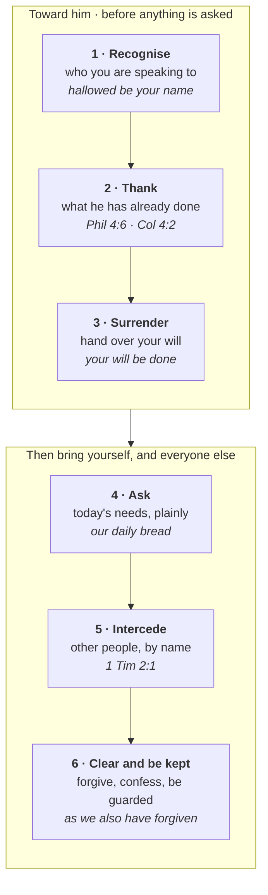

# Prayer: Communion and the Habit It Sustains

Prayer in the New Testament is a child speaking to a father. The cry it puts in a Christian's mouth
is "Abba! Father!", and Paul says the Spirit *produces* that cry rather than the believer working it
up (Romans 8:15). Everything practical below rests on that, which is why this study starts there.

What the relationship produces is a habit, and the New Testament has a word for that too:
**προσκαρτερέω** (*proskartereō*) — to stick at something, to keep at it stubbornly. It occurs ten
times, and five of them are about prayer: the upper room "devoting themselves to prayer" (Acts 1:14),
the first church devoted to "the breaking of bread and the prayers" (Acts 2:42), the apostles
refusing administration so they could "devote ourselves to prayer" (Acts 6:4), the Romans told to
"be constant in prayer" (12:12), and the Colossians to "continue steadfastly in prayer" (4:2).

That is the vocabulary of a healthy habit, not something done as a side thought or option. Communion
first, then the habit it sustains, then who prayer is addressed to, how Jesus and the apostles
actually prayed, what to bring, how God answers, a pattern to pray by, and how to hand it on to a
household.

## Key Takeaways

*(This section follows the [Key Takeaways](../about/key-takeaways.md) format this site is
prototyping — see that page for what each part is for and why.)*

### Lessons about Jesus

- **He prayed as a habit, not at crises only.** Luke 5:16 uses a *periphrastic imperfect* — the
  verb "to be" plus a participle (ἦν ὑποχωρῶν καὶ προσευχόμενος), the form Greek uses for repeated
  or customary action. Not "he withdrew and prayed" on some occasion, but "he *would* withdraw and
  pray." See [below](#why-that-second-row-says-would).
- **He deliberately prayed alone, at cost.** Before dawn and out of town, so that the disciples had
  to hunt him down (Mark 1:35-37); by himself on the mountain after feeding the five thousand
  (Matthew 14:23); apart even while the disciples were with him (Luke 9:18); and a stone's throw
  from his closest friends in Gethsemane (Luke 22:41).
- **He prayed before decisions, not after them.** All night on the mountain before naming the
  twelve (Luke 6:12).
- **He prayed the Father's will be done, even through the hardest thing asked of him**, and the
  prayer includes a request that was not granted: "remove this cup from me. Nevertheless, not my
  will, but yours, be done"
  (Luke 22:42). Hebrews says he "was heard because of his reverence" (5:7) — heard, and the cup
  stayed.
- **He is praying for you now.** Not an inference from John 17 but a stated fact: "he always lives
  to make intercession for them" (Hebrews 7:25), and he does it "at the right hand of God"
  (Romans 8:34). The access described below rests on a living high priest, not only on a finished
  transaction.

### Memory verses

> ✝️ Colossians 4:2 (ESV)
>
> 2 Continue steadfastly in prayer, being watchful in it with thanksgiving.

> ✝️ Philippians 4:6-7 (ESV)
>
> 6 do not be anxious about anything, but in everything by prayer and supplication with thanksgiving
> let your requests be made known to God. 7 And the peace of God, which surpasses all understanding,
> will guard your hearts and your minds in Christ Jesus.

### Be Transformed

- **Think.** Prayer is not the lever that makes an unwilling God act. It is the access a Father has
  already opened. If you pray as though you must first get his attention, the problem is not your
  technique but your picture of him, and the picture comes first. The willingness to pray is given
  ("the Spirit of adoption as sons, by whom we cry, 'Abba! Father!'", Romans 8:15).
- **Attitude.** Approach prayer as a relationship: He is your personal Father. His will is always
  wiser and better than ours, and He offers His own strength for what it asks of us. "Your Father
  knows what you need before you ask him" (Matthew 6:8), and Jesus says that as a reason *to* pray,
  not a reason to skip it. Prayer is not briefing God, and not a shopping list of needs.
- **Do.** Develop the habit: pray as you walk, and before a meeting. Thank God for who he is and
  what he has done. Pray for strength. Fix a time and a place rather than waiting to feel like it.
  Daniel had a window and three set hours (Daniel 6:10); Jesus had a desolate place before dawn
  (Mark 1:35). Neither was improvising.

### Prayer

*(Prayed through the six movements this study arrives at — see
[A pattern to pray by](#a-pattern-to-pray-by).)*

Father, you are holy. Thank you for restoring my broken relationship with you through your Son Jesus.

Thank you that I can come to you freely, and commune with you in thanksgiving and in every
supplication.

Thank you that you always hear, and that you treasure my prayers.

Thank you for the answers you have already given that I did not recognise, and for those you are
holding over in your wisdom.

Have your way in me. Where my asking is really instruction, correct it; I would rather want what you
want than get what I came for.

Give me what today needs, and make me steady where I have been sporadic. For the people you have put
in front of me, and the ones whose names I keep meaning to bring: let them know you better.

Forgive me for treating prayer as the thing I do when the other options have run out, and make me
quick to forgive where I have been slow. Keep me tomorrow; I will not manage it on my own.

In Jesus' name. Amen.

## Communion before discipline

A habit built on duty alone breaks, and prayer is the place most people discover that. So before any
of the practice below: the New Testament does not present prayer as an obligation you must generate
the willingness for. It presents the willingness as **given**.

> ✝️ Romans 8:15-16 (ESV)
>
> 15 For you did not receive the spirit of slavery to fall back into fear, but you have received the
> Spirit of adoption as sons, by whom we cry, "Abba! Father!" 16 The Spirit himself bears witness
> with our spirit that we are children of God,

The cry is not worked up; it is produced: "by whom we cry." Galatians says the same and draws the
conclusion: "God has sent the Spirit of his Son into our hearts, crying, 'Abba! Father!' So you are
no longer a **slave**, but a **son**" (4:6-7). Slave and son is precisely the difference between
prayer as a chore and prayer as a relationship. A slave prays because he must and stops when he can;
a son speaks to his father because that is what the relationship is for.

**The Psalms record appetite, not obligation.** Nobody writes this out of duty:

> ✝️ Psalm 42:1-2 (ESV)
>
> 1 As a deer pants for flowing streams, so pants my soul for you, O God. 2 My soul thirsts for God,
> for the living God. When shall I come and appear before God?

"My soul thirsts for you; my flesh faints for you" (63:1). "One thing have I asked of the LORD… to
gaze upon the beauty of the LORD" (27:4). "Whom have I in heaven but you? And there is nothing on
earth that I desire besides you" (73:25). That is language about wanting, and it is the normal
register of prayer in the Psalter.

**And Jesus offers rest rather than another load.** "Come to me, all who labor and are heavy laden,
and I will give you rest… For my yoke is easy, and my burden is light" (Matthew 11:28-30). Prayer
that feels like one more thing you are failing at has been misfiled under the wrong yoke. When Martha
is "anxious and troubled about many things," the correction is not to work harder at serving but that
"one thing is necessary", and Mary, sitting and listening, "has chosen the good portion"
(Luke 10:41-42).

**This is what "daily bread" is actually saying.** The petition is not a ration grudgingly issued. It
is a child asking a father for today's food, which is the most ordinary thing in a household and the
least remarkable request a son can make. Jesus put it in the model prayer because that is the
relationship prayer runs on: daily, unremarkable, and expected on both sides.

So the order matters, and it is the reverse of how prayer is usually taught. **Get the relationship
right and the habit becomes sustainable**; try to build the habit on obligation and it lasts as long
as your willpower does. "In your presence there is fullness of joy" (Psalm 16:11) is the motive the
Bible actually supplies.

**The traffic runs both ways, though, and the study would be dishonest to leave it there.** Appetite
makes a habit sustainable; the habit is what carries you across the stretches where appetite fails —
and everyone has those. Jesus got up before dawn and walked out of town to a desolate place. That is
not what a feeling does. It is what a love does when it is inconvenient, which is also the point at
which love and discipline stop being distinguishable.

## Who am I praying to?

This is the first practical question, and the New Testament answers it clearly enough to act on
without flattening the distinctions.

**The pattern Jesus gave is prayer to the Father.** "Pray then like this: *Our Father in heaven*"
(Matthew 6:9); "when you pray, say: *Father*" (Luke 11:2). And he gives the mechanism plainly:

> ✝️ John 16:23-24 (ESV)
>
> 23 In that day you will ask nothing of me. Truly, truly, I say to you, whatever you ask of the
> Father in my name, he will give it to you. 24 Until now you have asked nothing in my name. Ask,
> and you will receive, that your joy may be full.

**Paul states the same shape as a single sentence with all three persons in it**: "through him we
both have access in one Spirit to the Father" (Ephesians 2:18). To the Father, through the Son, in
the Spirit. That is the normal Christian posture in prayer, and it is the posture of Paul's own
recorded prayers, which are addressed to the Father (Ephesians 1:16-17; 3:14).

**The access has a basis, and Hebrews states it.**

> ✝️ Hebrews 10:19-22 (ESV)
>
> 19 Therefore, brothers, since we have confidence to enter the holy places by the blood of Jesus,
> 20 by the new and living way that he opened for us through the curtain, that is, through his flesh,
> 21 and since we have a great priest over the house of God, 22 let us draw near with a true heart in
> full assurance of faith, with our hearts sprinkled clean from an evil conscience and our bodies
> washed with pure water.

"The way is open" is Hebrews' own phrase for what the cross did to the barrier around God's
presence. The curtain is the temple veil, the blood is Jesus's, and the conclusion the writer draws
from it is an instruction to pray: **draw near**. Hebrews 4:16 gives the same instruction with the
promise attached — "let us then with confidence draw near to the throne of grace, that we may
receive mercy and find grace to help in time of need."

So when you pray you are not asking for a hearing. You are using one that was bought, and paid for
in blood. That is the difference between approaching God and approaching him *with confidence*,
which is the word both passages use.

**And the one who opened it is still at work.** "He always lives to make intercession for them"
(Hebrews 7:25); "Christ Jesus is the one who died — more than that, who was raised — who is at the
right hand of God, who indeed is interceding for us" (Romans 8:34). Paul names the office in the
same paragraph where he lists the four kinds of prayer: "there is one mediator between God and men,
the man Christ Jesus, who gave himself as a ransom for all" (1 Timothy 2:5-6), four verses after
2:1. The instruction to pray and the ground of praying sit together.

**But prayer addressed to Jesus is also in the New Testament, and is never corrected.** Stephen dies
praying to him: "Lord Jesus, receive my spirit" (Acts 7:59), which is Psalm 31:5 redirected to
Christ. Paul "pleaded with the Lord" three times about his thorn and got an answer from Christ:
"my power is made perfect in weakness… the power of Christ" (2 Corinthians 12:8-9). Paul describes
Christians simply as "all those who in every place call upon the name of our Lord Jesus Christ"
(1 Corinthians 1:2). And the Bible's last prayer is addressed to him: "Come, Lord Jesus!"
(Revelation 22:20).

**The Spirit's role is stated differently.** Romans 8:26-27 has the Spirit interceding *for* us
"with groanings too deep for words" — helping us pray rather than being the one addressed. No prayer
in the New Testament is addressed to him. That is an argument from silence rather than a
prohibition, and it is why this study describes the Spirit's part as help given to the one praying.

So the practical answer: **make the Father your habit and your default, because that is what Jesus
taught; speak to the Son freely, because Scripture does.**

## How Jesus prayed

The Gospels record the practice as well as the content.

| | |
|---|---|
| **Early, and alone** | "Rising very early in the morning, while it was still dark, he departed and went out to a desolate place, and there he prayed" (Mark 1:35) |
| **Habitually** | "He *would* withdraw to desolate places and pray" (Luke 5:16) |
| **At length before decisions** | "All night he continued in prayer to God," then chose the twelve (Luke 6:12) |
| **After success, not only after failure** | He dismisses the crowd he has just fed and goes up the mountain alone (Matthew 14:23) |
| **With his voice, and in distress** | "loud cries and tears" (Hebrews 5:7) |
| **Submitting a real request** | "Remove this cup… nevertheless, not my will, but yours" (Luke 22:42) |

### Why that second row says "would"

Luke could have written a simple past: he withdrew, he prayed, and that would be a report of one
afternoon. Instead he writes **ἦν ὑποχωρῶν καὶ προσευχόμενος**: the verb "to be" followed by two
participles. Greek uses that construction — a **periphrastic imperfect** — to mark action as ongoing
or repeated rather than finished. Literally "he was withdrawing and praying," which in natural
English becomes "he would withdraw." It is the difference between reporting an occasion and
describing a habit, and the habit is the point.

The English versions split on whether they keep it, which is useful to know before building anything
on the verse:

| Keeps the customary sense | Loses it |
|---|---|
| **ESV** "he *would* withdraw"; **NIV** and **NKJV** "*often* withdrew"; **CSB** "he *often* withdrew"; **BSB** "*frequently* withdrew" | **KJV**, **ASV**, **WEB** "he withdrew himself… and prayed" — a simple past, and the habit is gone |

Young's Literal Translation shows the underlying shape most plainly — "he was withdrawing… and was
praying", which is what a wooden-literal version is for, as a cross-check rather than a reading
text. The irony is that the older literal translations are the ones that lose the sense here, because
English simply does not carry a bare past tense the way Greek carries an imperfect.

### He went to trouble to be alone

The solitude is not incidental to the accounts; it is the thing the narrators keep reporting, and it
was deliberate enough to inconvenience people.

**He left before anyone was awake, and had to be hunted down.** After the whole town gathered at the
door in Capernaum, Mark has him gone before dawn: "he departed and went out to a desolate place, and
there he prayed" (1:35). The next verse says Simon and the others **κατεδίωξεν** him, a verb that
occurs nowhere else in the New Testament and means to track down or pursue closely; the ESV's
"searched for him" is mild for it. When they find him, their reproach is the obvious one: "Everyone
is looking for you" (1:37). Luke reports the same pattern after the same sort of day, with the crowds
"seeking him" and wanting to keep him from leaving (4:42).

**He did it after success as much as after pressure.** Having fed five thousand, he "dismissed the
crowds" and "went up on the mountain **by himself** to pray. When evening came, he was there
**alone**" (Matthew 14:23) — two words for solitude in one sentence. John gives the motive at the
same moment: perceiving they meant "to take him by force to make him king, Jesus withdrew again to
the mountain by himself" (6:15). Solitude was a retreat from acclaim, not only from demand.

**He prayed apart even in company.** Luke 9:18 puts it almost as a paradox: "as he was praying
**alone** (κατὰ μόνας), the disciples were with him." Being among people did not count as the
company being over.

**And at the worst moment he separated in stages.** At Gethsemane he leaves eight ("Sit here, while
I go over there and pray"), takes Peter, James and John further in, then goes "a little farther" and
falls on his face alone (Matthew 26:36-39). Luke measures the last stage: "about a stone's throw"
(22:41). Even with the three closest men he had, the praying itself was done by himself.

The place is usually **ἔρημος** (*erēmos*), a desolate or wilderness place — Mark 1:35, Luke 4:42,
Luke 5:16. Not a quiet corner of a busy house but somewhere he had to travel to. That is what makes
the solitude legible as a decision: it cost him sleep, it cost him distance, and it cost the people
around him access to him while it lasted.

**And what he went for is the point.** Nothing in these accounts suggests he withdrew because
he found people tiring. He went to be with his Father, and John 17 is the one long record of what
that sounded like from the inside. The solitude is not the discipline of a man making himself pray;
it is the arrangement of someone protecting the relationship he most wanted, from the demands of
everyone who wanted him. That is the same order the study opened with: communion first, and the
habit built to serve it.

Two things follow that bear directly on a struggling prayer life. **He made time rather than found
it** — the withdrawing is the deliberate part, and it always costs something he could otherwise have
been doing. And **his prayers were not uniformly answered as asked**, which means an unanswered
request is not evidence of a defective prayer life. It is the pattern of the one whose prayer life
was perfect.

The disciples' one recorded request for teaching came after watching him do it: "Now Jesus was
praying in a certain place, and when he finished, one of his disciples said to him, 'Lord, teach us
to pray'" (Luke 11:1).

**What that says about the Father is the part to take away.** The Son of God, who was not short of
anything, got up in the dark and walked out of a town that wanted him, repeatedly, for years, in
order to talk to his Father. Prayer is not a remedy for weakness that stronger people can do
without; it is what the strongest man who ever lived arranged his life around. If he wanted that
much time with the Father, the Father is worth yours.

## How the apostles prayed, and what they taught

**They treated prayer as work with a claim on their time.** When administration threatened it, the
Twelve delegated the administration rather than the prayer: "we will devote ourselves to prayer and
to the ministry of the word" (Acts 6:4). That is the same προσκαρτερέω as Colossians 4:2: the verb
of sticking at it.

**Their crisis prayer opens with sovereignty and closes with a request for boldness.** Threatened by
the Sanhedrin, the church prays together, and the first word is not the problem:

> ✝️ Acts 4:24 (ESV)
>
> 24 And when they heard it, they lifted their voices together to God and said, "Sovereign Lord, who
> made the heaven and the earth and the sea and everything in them,

**And the address itself is Scripture.** "Who made the heaven and the earth and the sea and
everything in them" is not their own phrasing: it is Exodus 20:11 and Psalm 146:6, both of which
read "who made heaven and earth, the sea, and all that is in them." They then recite Psalm 2, name
what has already happened as what God's "hand and… plan had predestined to take place" (4:28), and
only then ask. Notably they do not ask for the threat to be
removed; they ask to speak boldly through it (4:29).

**Paul's recorded prayers for churches ask for wisdom and knowledge, not for circumstances**, and
his own vocabulary is the evidence. Across the three (Ephesians 1:16-19; Colossians 1:9-10;
Philippians 1:9) he asks four times for **ἐπίγνωσις** (*epignōsis*, knowledge), twice for
**σοφία** (*sophia*, wisdom), and once each for **σύνεσις** (understanding) and **ἀποκάλυψις**
(revelation). Not one of those is a request about circumstances.

The prefix on the first is doing work. ἐπίγνωσις is γνῶσις with **ἐπι-** on the front — not
information about God but knowledge *of* him, the kind you have of a person rather than of a
subject. So Ephesians 1:17-18 asks for "the Spirit of wisdom and of revelation in the knowledge of
him, having the eyes of your hearts enlightened", and Colossians 1:9 for "the knowledge of his will
in all spiritual wisdom and understanding". Set beside how most of us pray, he asks for changed
people more than changed situations — and specifically for people who **know God better**, which is
the one request no change of circumstances could grant.

**Which could be read as a rule against praying for circumstances, and Paul rules that out himself.**
When he asks churches to pray for *him*, the requests are almost entirely circumstantial: that he
would "be delivered from the unbelievers in Judea" and "come to you with joy" (Romans 15:31-32);
that "God may open to us a door for the word" while he is in prison (Colossians 4:3); that "words
may be given" him to speak boldly (Ephesians 6:19-20); that he be "delivered from wicked and evil
men" (2 Thessalonians 3:2). Deliverance, travel, open doors, courage. He asks for all of it.

The pattern is not that circumstances are unspiritual to pray about. It is that **Paul says what he
wants the circumstance for.** Not "open a door" but "open a door *for the word*"; not "rescue me"
but rescue me so that "the word of the Lord may speed ahead and be honored" (2 Thessalonians 3:1).
The request has a purpose attached, and the purpose is always larger than the relief. That is a
usable test for your own asking: name the thing you want, then say what you want it *for*, and see
whether the answer survives being said out loud.

**James supplies the two blunt sentences.** "You do not have, because you do not ask" (4:2), and
immediately, "You ask and do not receive, because you ask wrongly, to spend it on your passions"
(4:3). Both are true at once, and holding only one produces either a prayerless fatalism or a
vending machine.

## Personal and corporate

The New Testament requires both, and the two texts sit a few verses apart.

**The closet.** "When you pray, go into your room and shut the door and pray to your Father who is
in secret" (Matthew 6:6). The point in context is the audience: the hypocrites pray "that they may
be seen by others" (6:5). What is forbidden is not public prayer but performed prayer.

**The gathering.** Yet in the prayer Jesus then teaches, every first-person word is plural — *our*
Father, give *us*, forgive *us*, lead *us* not. Even prayed alone behind a shut door, it is a prayer
that puts you in a family. And Acts shows the church praying corporately as a matter of course: "with
one accord… devoting themselves to prayer" (1:14), "earnest prayer for him was made to God by the
church" (12:5), voices lifted "together" (4:24).

So they are not alternatives, and neither substitutes for the other. Corporate prayer without a
private life behind it becomes performance, the exact fault of Matthew 6:5. A private life with no
corporate expression loses the "our," and with it the reminder that you are one of many.

## What to pray about

Paul gives four distinct words in one sentence, and they are not synonyms piled up for emphasis:
Louw-Nida assigns each its own semantic domain.

> ✝️ 1 Timothy 2:1-2 (ESV)
>
> 1 First of all, then, I urge that supplications, prayers, intercessions, and thanksgivings be made
> for all people, 2 for kings and all who are in high positions, that we may lead a peaceful and
> quiet life, godly and dignified in every way.

| Greek | Sense | In practice |
|---|---|---|
| **δεήσεις** (*deēseis*) | asking out of need — begging | what you lack, and cannot fix |
| **προσευχάς** (*proseuchas*) | prayer, the general word | the ordinary talking |
| **ἐντεύξεις** (*enteuxeis*) | approaching someone on another's behalf | intercession — named people, and what you want for them |
| **εὐχαριστίας** (*eucharistias*) | thanksgiving | what he has already done |

**"Supplication" is an accurate translation of the first and an unhelpful one**, because the English
word is now archaic enough to hide what it means. The sense is in the verb it comes from.
**δέομαι** (*deomai*) is not a religious word at all: of its twelve New Testament occurrences, most
are people begging other people. Paul implores the Corinthians (2 Corinthians 10:2) and the
Galatians (4:12); the Ethiopian eunuch asks it of Philip (Acts 8:34); Paul uses it on a Roman
tribune (Acts 21:39) and on Agrippa (26:3); the father of the demonised boy uses it on Jesus
(Luke 9:38); and the Macedonians use it on Paul, begging for the *privilege of giving*
(2 Corinthians 8:4).

So the root sense is urgent asking out of need — begging, pleading — and the noun is that word
pointed upward. All eighteen New Testament occurrences of **δέησις** are addressed to God, and each
clear case has a specific lack behind it: Zechariah childless (Luke 1:13), Paul for Israel's
salvation (Romans 10:1), the widow "left all alone" (1 Timothy 5:5), and Jesus in Gethsemane,
offering "prayers and supplications, with loud cries and tears" (Hebrews 5:7).

**Four times it stands beside προσευχή in the same verse** — here, and 1 Timothy 5:5,
Ephesians 6:18, Philippians 4:6 — which is not how anyone uses two words for one thing. Philippians
4:6 is the plainest: "by prayer and supplication." The general act, and the specific asking inside
it.

That matters practically, because δέησις is the step most people are best at and most embarrassed
about. Scripture is not embarrassed by it. Paul puts it first of the four, and it is the word chosen
for the Son of God on the night he was betrayed.

Most prayer lives are heavy on the first and light on the last two. Paul's ordering puts
intercession and thanksgiving in the same breath as asking for yourself, and then names the least
likely subject: governing authorities, including the ones persecuting the church he wrote to.

Philippians 4:6 gives the scope in a word: "in everything." That is a permission granted on the
strength of the relationship — a child brings a father
whatever is in his hands, and the smallness of a thing is not a reason to leave it out. And
Colossians 4:2 attaches the thanksgiving to the steadfastness — "being watchful in it with
thanksgiving", the practical guard against a prayer life that becomes a list of complaints.

Paul gives the ground four verses later, in the same paragraph: "there is one mediator between God
and men, the man Christ Jesus, who gave himself as a ransom for all" (1 Timothy 2:5-6). The list of
what to pray and the reason you may pray it are one piece of writing.

**Use the Lord's Prayer as the shape, not as the words.** "Pray then *like this*" (Matthew 6:9) is
an instruction about pattern. Its order is the useful part, and it is the reverse of most instinct:
God's name, God's kingdom, God's will — *then* bread, forgiveness, and rescue. Praying it in order
puts your requests in a frame before you make them. This site has a full exegetical study of the
petitions themselves at [The Lord's Prayer](lords-prayer.md); what matters here is that it was given
as a template to be used, and that it takes about twenty seconds, which makes it a usable spine for
a longer prayer.

## What prayer permits God to do

The model prayer contains the answer in four words, and they are not "my will be done." Jesus puts
**"your will be done, on earth as it is in heaven"** (Matthew 6:10) third, before a single request
for bread, forgiveness or rescue. Prayer as he teaches it opens by handing the outcome over.

That is not a stray emphasis. It is one of the most consistent structures in Scripture: **a will
brought into line with God's, and then God acting.** The order does not vary, and it holds across
every part of the canon.

| | The condition | What follows |
|---|---|---|
| **2 Chronicles 7:14** | "humble themselves, and pray and **seek my face** and **turn** from their wicked ways" | "**then** I will hear from heaven… and heal their land" |
| **Psalm 37:4** | "**Delight yourself** in the LORD" | "and he will give you the desires of your heart" |
| **John 15:7** | "If you **abide in me, and my words abide in you**" | "ask whatever you wish, and it will be done for you" |
| **James 4:7-10** | "**Submit** yourselves therefore to God… **Draw near** to God… **Humble** yourselves" | "and he will draw near to you… and he will exalt you" |
| **1 John 3:22** | "**because** we keep his commandments and do what pleases him" | "whatever we ask we receive from him" |
| **1 John 5:14** | "if we ask anything **according to his will**" | "he hears us" |

Two more state the same thing from the other side, which is the sharper way to hear it:

| | The condition | What follows |
|---|---|---|
| **Psalm 66:18** | "If I had cherished iniquity in my heart" | "the Lord would not have listened" — and the next verse: "But truly God has listened" |
| **Proverbs 28:9** | "If one turns away his ear from hearing the law" | "even his prayer is an abomination" |

Psalm 37:4 is the one most often quoted as a blank cheque and is the clearest example of the
pattern: delight in God *first* and he grants the heart's desires, because delighting in him is
what reshapes the desires. The verse is not about getting what you already want.

**James makes the point by diagnosis.** The sentence usually quoted on its own — "you do not have,
because you do not ask" (4:2) — is not on its own. It sits inside a paragraph about the will,
and James names the disorder before and after it: the quarrels come from "your passions… at war
within you" (4:1), and the failed asking is "because you ask wrongly, to spend it on your passions"
(4:3). His prescription is not better technique:

> ✝️ James 4:7-8, 10 (ESV)
>
> 7 Submit yourselves therefore to God. Resist the devil, and he will flee from you. 8 Draw near to
> God, and he will draw near to you. Cleanse your hands, you sinners, and purify your hearts, you
> double-minded… 10 Humble yourselves before the Lord, and he will exalt you.

So the very text that says God waits to be asked says in the same breath that the asking is
worthless while the will is elsewhere. The two verses are one argument, and quoting 4:2 without
4:1-10 turns a call to surrender into a technique for acquisition.

**Moses and Daniel show what praying God's will actually looks like.** Neither is imposing a
preference. Moses, interceding after the golden calf, argues from God's reputation among the
Egyptians and from the covenant God swore to Abraham — "*Remember* Abraham, Isaac, and Israel… to
whom you swore by your own self" (Exodus 32:13), and "the LORD relented from the disaster"
(32:14). He prays God's own stated commitments back to him. Daniel does it more explicitly still:
he "perceived in the books" what God had declared through Jeremiah about the seventy years
(Daniel 9:2), and *then* prayed for it. When he asks, he disclaims leverage outright: "we do
not present our pleas before you because of our righteousness, but because of your great mercy"
(9:18).

That is the shape: finding out what God has said he wants, and asking him for it. Samuel's answer
is the whole posture in five words: "Speak, for your servant hears" (1 Samuel 3:10).

**So what does prayer permit God to do in your life?** Chiefly it permits him to have it. The
seeking is the point at which my will is handed over, and Scripture presents that surrender as the
condition God acts through. Romans 12 has the order exactly: present your body as a living
sacrifice *first*, then "by testing you may discern what is the will of God" (12:1-2). Discernment
follows surrender rather than preceding it. Which is why Paul's prayers ask for wisdom,
Epaphras labours in prayer "that you may stand mature and fully assured in **all the will of God**"
(Colossians 4:12), and the Spirit himself intercedes "according to the will of God" (Romans 8:27).

Held that way, an unanswered request stops being evidence of a defective prayer life. Gethsemane was
prayed perfectly and the cup stayed. The measure of a prayer life is not its hit rate but whose will
it is being conformed to.

Prayer changes circumstances often enough that Scripture tells you to ask. It changes the person
praying every time, and on the evidence above that is not a consolation prize. It is the
mechanism.

## How God answers

Jesus prayed with a settled confidence about being heard, and said so out loud at Lazarus's tomb:

> ✝️ John 11:41-42 (ESV)
>
> 41 So they took away the stone. And Jesus lifted up his eyes and said, "Father, I thank you that
> you have heard me. 42 I knew that you always hear me, but I said this on account of the people
> standing around, that they may believe that you sent me."

"I knew that you **always** hear me", and he says it before Lazarus comes out, so it is not
confidence produced by the result. That assumption sits underneath every prayer recorded in
Scripture. What the texts show about how the answer arrives falls into four patterns.

**Often it is already on the way before the prayer ends.** Isaiah states it as a principle — "Before
they call I will answer; while they are yet speaking I will hear" (65:24), and the narratives show
it happening.

Abraham's servant, sent to find a wife for Isaac, prays for a specific sign at a well. Genesis
reports the timing twice, once by the narrator and once in the servant's own retelling to Laban:

> ✝️ Genesis 24:15 (ESV)
>
> 15 Before he had finished speaking, behold, Rebekah, who was born to Bethuel the son of Milcah,
> the wife of Nahor, Abraham's brother, came out with her water jar on her shoulder.

"Before I had finished speaking in my heart, behold, Rebekah came out" (24:45), and note *in my
heart*: it was silent, and it was already being answered. Daniel is told something sharper still.
Gabriel arrives while he is mid-sentence and explains the timing: "**At the beginning of your pleas
for mercy a word went out**, and I have come to tell it to you" (Daniel 9:23). Not at the end of the
prayer. At the beginning.

**But being heard and receiving the answer are two different things.** Daniel's other vision guards
the point against becoming a promise of speed:

> ✝️ Daniel 10:12-13 (ESV)
>
> 12 Then he said to me, "Fear not, Daniel, for from the first day that you set your heart to
> understand and humbled yourself before your God, your words have been heard, and I have come
> because of your words. 13 The prince of the kingdom of Persia withstood me twenty-one days…

Heard on day one; delivered on day twenty-one. Daniel spent three weeks with no evidence that
anything had happened, and something had happened immediately. Whatever else that passage is doing,
it forbids reading a delay as a refusal.

**The mode is rarely specified, and varies when it is.** Scripture narrates the outcome far more
often than the machinery, but where it does say, the answers arrive by very different routes: an
angel dispatched (Daniel 9:21); a person walking round the corner at the right moment
(Genesis 24:15); an audible voice (John 12:28); a plain refusal with a reason attached ("My grace
is sufficient for you", 2 Corinthians 12:9); a door closed in one direction and opened in another
(Acts 16:6-10). Jesus's own answer at Gethsemane was no, and Hebrews still says he "was
heard" (5:7).

**And the answer can be missed while it is happening.** Twice, memorably.

When Jesus prays "Father, glorify your name," God answers **audibly**: "Then a voice came from
heaven", and the bystanders disagree about what they just heard: "The crowd that stood there and
heard it said that it had thundered" (John 12:28-29). An answer given in words, taken for weather.

And the church, praying through the night for Peter in prison, does not believe the answer when it
knocks on the door:

> ✝️ Acts 12:14-16 (ESV)
>
> 14 Recognizing Peter's voice, in her joy she did not open the gate but ran in and reported that
> Peter was standing at the gate. 15 They said to her, "You are out of your mind." But she kept
> insisting that it was so, and they kept saying, "It is his angel!" 16 But Peter continued
> knocking, and when they opened, they saw him and were amazed.

They had been praying for exactly this (12:5). It arrived, stood outside, and kept knocking while
they argued that the girl was mad. The gap between an answered prayer and a recognised answer is
sometimes a locked door and a conversation.

### Your prayers are kept

The last thing Scripture says about prayer's fate is the least expected. David asks that his prayer
be "counted as incense before you" (Psalm 141:2), and Revelation shows it granted: the elders hold
"golden bowls full of incense, **which are the prayers of the saints**" (5:8). Prayers are not spent
on delivery; they are collected.

Then they are answered, and the image is startling:

> ✝️ Revelation 8:3-5 (ESV)
>
> 3 And another angel came and stood at the altar with a golden censer, and he was given much
> incense to offer with the prayers of all the saints on the golden altar before the throne, 4 and
> the smoke of the incense, with the prayers of the saints, rose before God from the hand of the
> angel. 5 Then the angel took the censer and filled it with fire from the altar and threw it on the
> earth, and there were peals of thunder, rumblings, flashes of lightning, and an earthquake.

The same censer that carried the prayers up is filled with fire and thrown down, and the trumpets
follow. The *ESV Study Bible* titles the passage "The Saints' Prayers, and Fire Flung to Earth" and
reads it the same way: "fiery devastation descends from God's altar **in response to his people's
pleas**." The martyrs' unanswered "how long?" of Revelation 6:10 is among the prayers in that bowl.

Which bears on the ordinary experience of praying and seeing nothing. On this picture no prayer is
lost, and some are being kept rather than declined: held, accumulated, and answered on a timetable
that runs past the end of the life that prayed them.

## A pattern to pray by

All of the above reduces to a shape small enough to hold in your head. It is the Lord's Prayer's own
order, with thanksgiving and intercession placed where the rest of the New Testament puts them. Each
step below has a suggested opening — words to start with, not words to keep — and someone in
Scripture who prayed that way.

### Toward him, before anything is asked

**1. Recognise who you are speaking to.** *"Our Father in heaven, hallowed be your name."* Two things
at once, correcting opposite errors: he is a **Father**, so you come as a child rather than as a
petitioner trying to get a hearing; and his name is **holy**, so you come as a creature. Say
something true about him before you say anything about yourself.

> **Try:** *"Father, you are holy, and you are mine. You made everything there is, and you are not
> reluctant to hear me."*
>
> **Old Testament:** David, handing over the temple plans — "Yours, O LORD, is the greatness and the
> power and the glory and the victory and the majesty… Yours is the kingdom" (1 Chronicles 29:11).
> Nehemiah opens the same way: "O LORD God of heaven, the great and awesome God who keeps covenant"
> (1:5).
> **New Testament:** the church under threat — "Sovereign Lord, who made the heaven and the earth
> and the sea and everything in them" (Acts 4:24).

**2. Thank him.** Name what he has already done. Paul attaches thanksgiving to requests ("by prayer
and supplication *with thanksgiving*", Philippians 4:6) and to persistence ("being watchful in it
with thanksgiving", Colossians 4:2). It is the practical guard against a prayer life that silts up
into a list of complaints.

> **Try:** *"Thank you for ______ — this week, and yesterday, and for what I have stopped noticing."*
>
> **Old Testament:** "Bless the LORD, O my soul… and forget not all his benefits" (Psalm 103:1-2) —
> a man telling himself to remember. "Enter his gates with thanksgiving" (Psalm 100:4).
> **New Testament:** Paul, of a church he is about to correct — "I do not cease to give thanks for
> you, remembering you in my prayers" (Ephesians 1:16).

**3. Hand over your will.** *"Your kingdom come, your will be done, on earth as it is in heaven."*
This is the hinge, and the pattern traced above runs straight through it: alignment first, then God
acting. Ask what he wants before telling him what you want.

> **Try:** *"Your will here, not mine. Show me what you are doing, and make me willing before I ask
> for anything."*
>
> **Old Testament:** Samuel as a boy — "Speak, for your servant hears" (1 Samuel 3:10); and Daniel,
> who read what God had already said and then prayed for it (Daniel 9:2-3).
> **New Testament:** Gethsemane — "not as I will, but as you will" (Matthew 26:39). And the
> disciples, when they could not talk Paul out of Jerusalem: "Let the will of the Lord be done"
> (Acts 21:14).

### Then bring yourself, and everyone else

**4. Ask for today.** *"Give us this day our daily bread."* Real needs, plainly said, and today's
rather than the whole year's. This is δέησις: asking out of need, the word used of Jesus in
   Gethsemane.

> **Try:** *"Today I need ______. I am not managing ______."*
>
> **Old Testament:** Agur's prayer is the daily-bread petition in advance — "give me neither poverty
> nor riches; feed me with the food that is needful for me" (Proverbs 30:8), with his reason given
> in the next verse.
> **New Testament:** "do not be anxious about anything, but in everything by prayer and supplication
> with thanksgiving let your requests be made known to God" (Philippians 4:6).

**5. Name other people.** ἔντευξις, intercession, which is what Paul's recorded prayers for
churches consist of almost entirely (Ephesians 1:16-19; 3:14-19; Philippians 1:9-11;
Colossians 1:9-10). His first request for them is that they would **know God better**. Their
circumstances belong here too — he asks for his own without embarrassment — but he attaches a
purpose to each, and so should you.

> **Try:** *"For ______ by name: that they would know you better, and for ______ that they are
> carrying."*
>
> **Old Testament:** Samuel treats not praying for people as sin — "far be it from me that I should
> sin against the LORD by ceasing to pray for you" (1 Samuel 12:23). Job's own restoration comes
> "when he had prayed for his friends" (42:10) — the friends who had wronged him.
> **New Testament:** Epaphras, "always struggling on your behalf in his prayers, that you may stand
> mature and fully assured in all the will of God" (Colossians 4:12).

**6. Clear the accounts, and ask to be kept.** *"And forgive us our debts, as we also have forgiven
our debtors… And lead us not into temptation, but deliver us from evil."* Forgiveness runs in both
directions in that petition, and the prayer ends by admitting you cannot keep yourself.

> **Try:** *"Where have I gone wrong today? And who am I still holding something against? Keep me
> tomorrow — I will not manage it on my own."*
>
> **Old Testament:** "Search me, O God, and know my heart!… And see if there be any grievous way in
> me, and lead me in the way everlasting" (Psalm 139:23-24) — asking to be shown rather than
> reporting what he already knows about himself.
> **New Testament:** "If we confess our sins, he is faithful and just to forgive us our sins"
> (1 John 1:9).

### Two things about the shape

**The order is itself the teaching.** Three movements God-ward before a single request, which is the
reverse of instinct, and is exactly why praying it in order does something to you.

**And it scales.** The whole thing takes twenty seconds if that is all you have, and will carry half
an hour if you stop and dwell at each step. It is a spine, not a script. Jesus said "pray *like
this*," not "pray this."

For teaching it to someone else, a child included, steps 1, 2, 4 and 5 are the four kinds of prayer
in 1 Timothy 2:1, and can be named that simply: *something true about God, something to say thank
you for, something I need, someone else by name.*

## Attitude

Four postures the texts above have already supplied, gathered here because they are what a prayer
life is made of.

- **As a child, not a suppliant.** "Our Father" is the whole basis, and it is settled before you
  open your mouth (see [Communion before discipline](#communion-before-discipline)). The practical
  test is whether you pray differently after a bad week — a suppliant would; a child would not.
- **Honest.** Gethsemane is a request the Father did not grant, prayed with "loud cries and tears."
  Prayer that only says the acceptable thing is not the prayer Scripture models.
- **Submitted.** "Nevertheless, not my will, but yours, be done" is the sentence that keeps honesty
  from becoming demand. Both halves belong.
- **Unhurried and unperformed.** Not "empty phrases… for they think that they will be heard for
  their many words" (Matthew 6:7). Length is not leverage.

## Teaching a household to pray

The Old Testament's instruction on passing faith down is about ordinary time rather than set-piece
occasions.

> ✝️ Deuteronomy 6:6-7 (ESV)
>
> 6 And these words that I command you today shall be on your heart. 7 You shall teach them
> diligently to your children, and shall talk of them when you sit in your house, and when you walk
> by the way, and when you lie down, and when you rise.

Sitting, walking, lying down, rising: the four are a merism for the whole day. The teaching happens
inside normal life, which suggests short and frequent over long and scheduled. Psalm 78:4-7 gives
the reason to bother: so "the next generation might know… and arise and tell them to their
children," which is a two-generation horizon.

What that looks like, drawn from what is above:

- **Let them watch.** The disciples asked to be taught after seeing Jesus pray (Luke 11:1). A child
  who never sees a parent pray has been taught something already.
- **Give them the pattern to build on.** The Lord's Prayer is short enough to learn and structured
  enough to build on. Walking through its order — God, then us — teaches a shape they can use when
  the words are their own.
- **Pray the four kinds.** A child can do all of 1 Timothy 2:1: something I need, something I want
  to say, someone else by name, something to say thank you for. Naming the four stops family prayer
  collapsing into requests.
- **Use fixed times as scaffolding.** Daniel's three set hours (Daniel 6:10) and Jesus's before-dawn
  habit are both structure. Structure is what carries a practice through the stretches when nobody
  feels like it, which is most of the point of a discipline.
- **Let them hear you pray for them, by name.** Paul's letters show what praying for people sounds
  like, and it is mostly asking that they would know God better (Ephesians 1:17-18).
- **Do not correct the theology of a child's prayer in progress.** Ephesians 6:4 warns fathers
  specifically about provoking children; a prayer life is not built by having your first attempts
  marked.

## Discussion questions

1. **The language.** The New Testament's word for how the church prayed is προσκαρτερέω, to stick
   at something stubbornly. It also says the cry "Abba! Father!" is produced by the Spirit rather
   than worked up (Romans 8:15). How do a given affection and a stubborn habit belong in the same
   prayer life, and which one have you been trying to manufacture?
2. **The text in its context.** Jesus says "your Father knows what you need before you ask him," and
   then immediately teaches his disciples to ask. Why does knowing already not make the asking
   pointless?
3. **Lessons about Jesus.** He got up before dawn, walked out of town, and the disciples had to hunt
   him down. He was not escaping people; he was going to his Father. What does that cost look like
   in a week of yours, and what would you have to give up to pay it?
4. **Deeper in Scripture.** Abraham's servant is answered before he finishes praying (Genesis 24:15)
   and Daniel is told his words were heard on day one but the messenger was delayed twenty-one days
   (Daniel 10:12-13). Both are true. How should either change the way you read a silence?
5. **The hard part.** Jesus taught his disciples to pray to the Father; Stephen died praying to
   Jesus and was not corrected. How do you hold both, and does the way you pray reflect it?
6. **Be transformed.** Of 1 Timothy 2:1's four — supplication, prayer, intercession, thanksgiving —
   which is thinnest in your own praying, and what would it take this week to make it less thin?

## References & Recommended Reading

**Original-language sources** (queried in this project's own
[reference database](../scripture/original-language-data.md)):

- **SBL Greek New Testament** (SBLGNT), ed. Michael W. Holmes.
- **MACULA Greek Linguistic Datasets** (Clear Bible) — the ten occurrences of **προσκαρτερέω**, the
  periphrastic imperfect at Luke 5:16 (compared across ESV, NIV, NKJV, CSB, BSB, KJV, ASV, WEB and
  YLT), and the four distinct Louw-Nida domains behind
  1 Timothy 2:1's four nouns.

**Translations quoted.** ESV throughout. See
[Bible Translations & Source Texts](../scripture/translations.md) and
[copyright](../about/copyright.md).

**Related on this site.**

- [The Lord's Prayer](lords-prayer.md) — the full exegetical study of Matthew 6:9-13 and
  Luke 11:2-4, with the word studies behind each petition.
- [Fasting](fasting.md) — the discipline Jesus treats alongside prayer in the same sermon.
- [Statement of Faith](../about/statement-of-faith.md) — on the Father as "sovereign over all,"
  which is the position the section on what prayer permits God to do is measured against.
