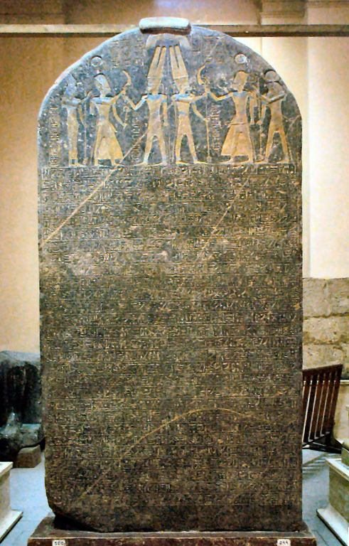
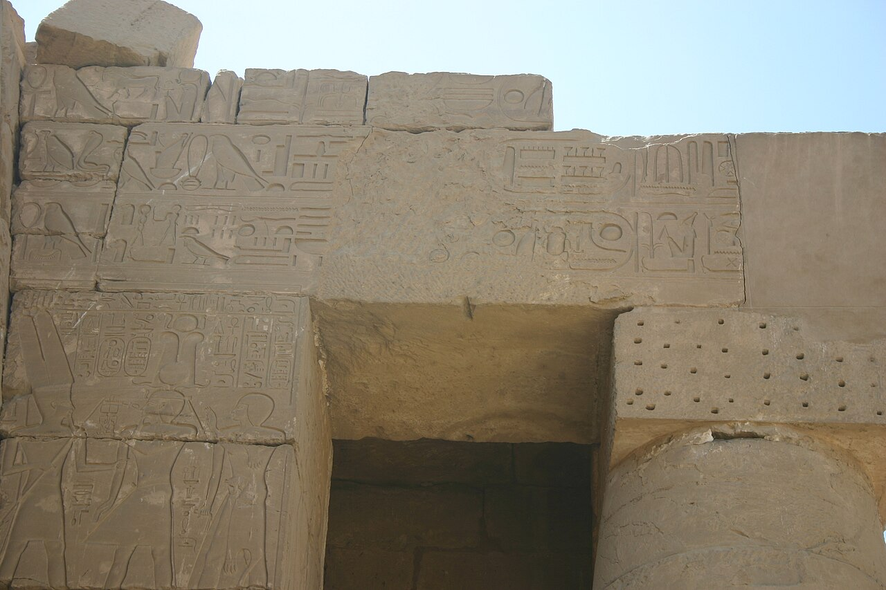
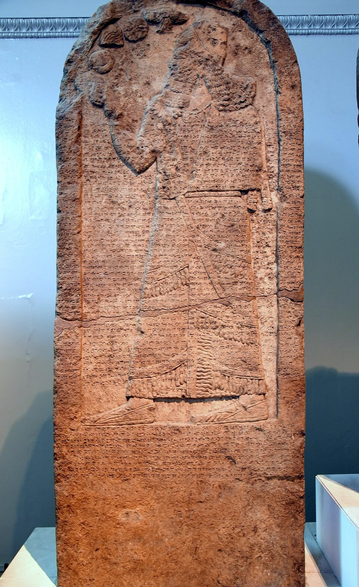
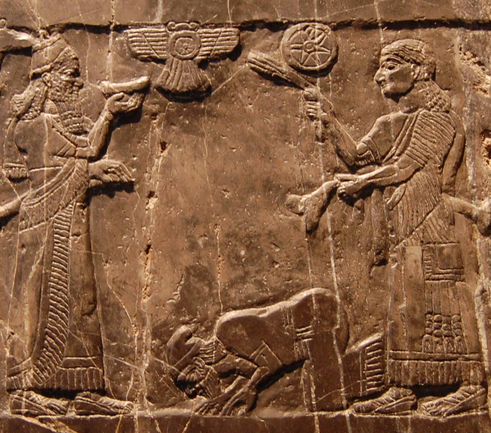
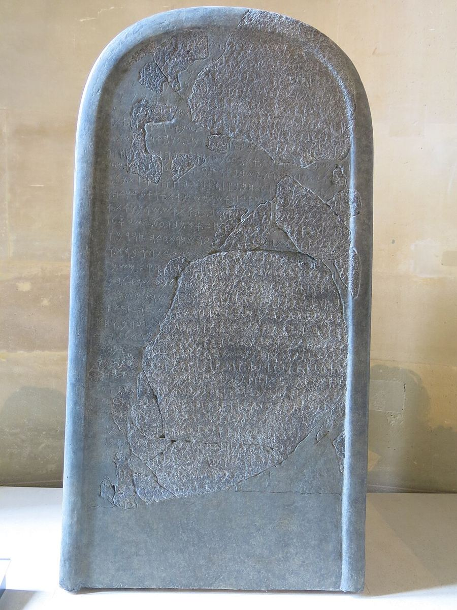
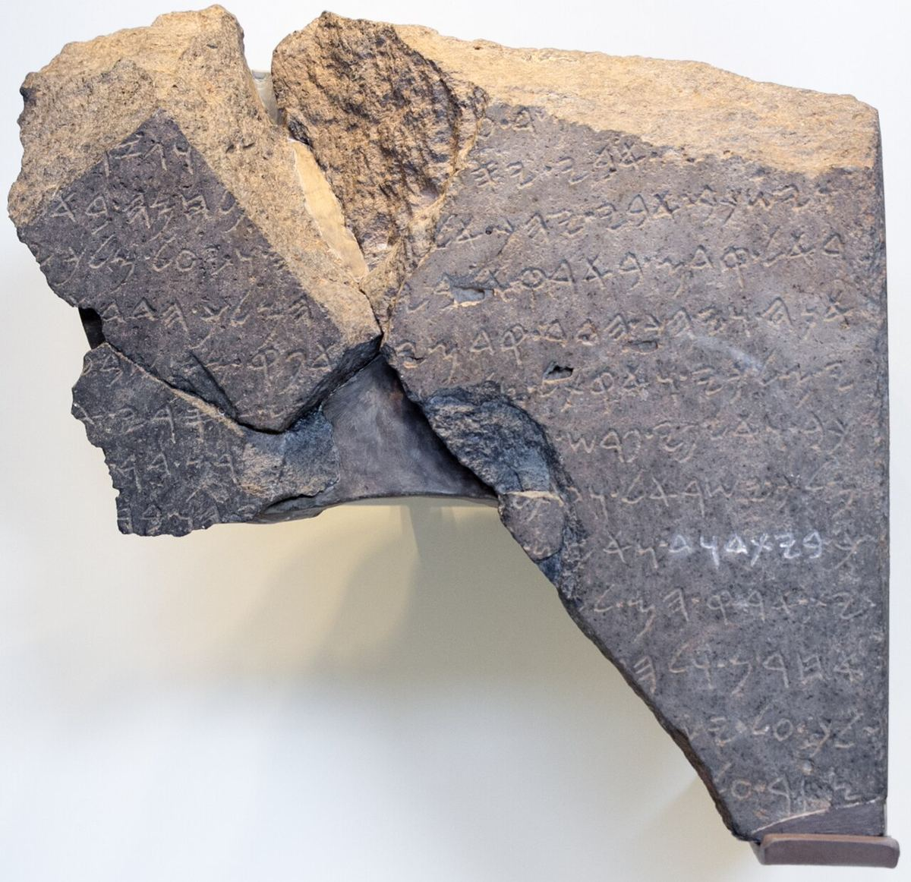
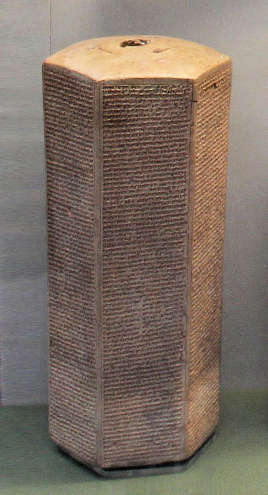
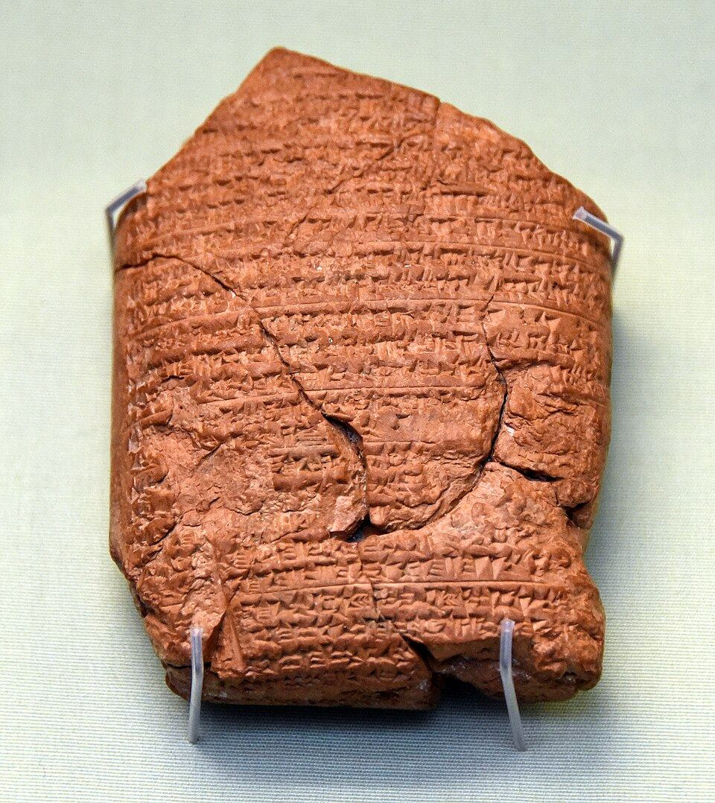

# Chronology Anchors: What Can Actually Be Dated, and How Tightly

**Forty-one events between Solomon's temple and the Resurrection can be placed on a Gregorian calendar, and thirty-one of them carry an error bar of a year or less.** That rail is the fixed part of biblical chronology. Everything upstream of Abraham — the genealogies of Genesis 5 and 11, the Flood, creation itself — is measured *backward* from it, which is why the anchors deserve their own page.

This is the reference table the genealogy work depends on. For the elastic stretch before Abraham, and for the manuscript variants that stretch it, see [Genealogy and Times](genealogy-times.md). For the calendar the Zadok years are counted in, see [The Zadok Calendar](../feasts/zadok-calendar.md).

**In one sentence:** Solomon's temple, an Assyrian eclipse, Daniel's own prophetic arithmetic, and Luke's Roman regnal dates lock forty-one events to a Gregorian calendar tightly enough to place the crucifixion on Friday, 3 April AD 33.

## Key Takeaways

*(This section follows the [Key Takeaways](../about/key-takeaways.md) format — see that page for what each part is for.)*

### Lessons about Jesus

Luke fixes the year of the cross, and Daniel's prophecy lands beside it. Luke 3:1 dates John's ministry to the fifteenth year of Tiberius (AD 28/29), and the Passovers John records carry Jesus' ministry to Friday, 3 April AD 33. Daniel's sixty-nine weeks, counted in prophetic years from the decree of Nehemiah 2:1, run 69 × 7 × 360 = 173,880 days, or 476 solar years: from Artaxerxes' twentieth year that reaches AD 32 on one reckoning of his reign and AD 33 on the other, and never AD 30. This page takes the decree at 444 BC to fit the Friday Luke fixes, so the agreement to the day follows from that choice, while the agreement to within a year holds on either reckoning. A prophecy given in Babylon and a Roman regnal date preserved by a physician converge on the same Passover.

### Prayer

Lord of the times and seasons, you set the eclipse in the sky that dates the reign of a king who never knew you, and you kept your word to the day. Thank you that the years are yours, that Cyrus signed his decree in your service, and that you were not late. Teach me to trust the God who keeps appointments I cannot see, and to wait as one who knows the calendar belongs to you. In Jesus' name. Amen.

## Study outline

- **[How the tiers work](#how-the-tiers-work)** and **[the anchor table](#the-anchor-table).**
  Forty-one events from Solomon's temple to the Resurrection, each marked Fixed, Anchored or
  Bracketed.
- **[The entries that carry the rest](#the-entries-that-carry-the-rest).** The Bur-Sagale eclipse,
  Jehoiachin's deportation, Ezekiel's vision, Jeremiah's seventy years, the 444 BC decree, and the
  Nativity and Passover brackets.
- **[Outside witnesses](#outside-witnesses).** The monuments and tablets behind the dates, with
  pictures: Merneptah, Gibeon, Tyre, Shishak, Qarqar and Jehu, the Moabite Stone and Tel Dan,
  Sennacherib, and Nebuchadnezzar.
- **[The four hundred silent years](#the-four-hundred-silent-years).** Daniel's kingdoms, the
  desecration and rededication, the 2,300 evenings and mornings, and the sabbatical cycle.
- **[Settling the crucifixion year](#settling-the-crucifixion-year).** AD 30 against AD 33, test by
  test, ending at Friday 3 April AD 33.

## How the tiers work

Every entry carries a tier rather than a bare year, because a date derived from an eclipse and a date derived from a regnal reconstruction are not the same kind of thing.

| Tier | Meaning | Typical error |
|---|---|---|
| **Fixed** | Astronomically computable, or dated by a contemporary document naming the event | 0 to 1 year |
| **Anchored** | Tied to a Fixed point by a stated biblical interval | 1 to 5 years |
| **Bracketed** | Constrained between two dated points, not fixed within them | range given |
| **Elastic** | A function of which manuscript tradition is followed | not on this page |

No entry below is Elastic. That tier begins at Abraham and runs backward, and it is handled in the genealogy study.

**Two units, never mixed.** Historical intervals — reign lengths, the 430 years, the 480 years — are ordinary solar years. Prophetic spans in Daniel and Revelation are 360-day years, since Genesis 7:11-8:4 counts 150 days as five months and Revelation 11:2-3 equates 42 months with 1,260 days. One prophetic year is 0.98565 solar years, so 490 of them are 483 solar years. Every interval on this page is solar unless it says otherwise.

## The anchor table

Zadok years count from creation at 3959 BC. That epoch is the Masoretic chain of Genesis 5 and 11
anchored on an Exodus of 1446 BC, which 1 Kings 6:1's 480 years give when counted back from
entry 1 (the `a_prime` scenario in `docs/data/genealogy/index.json`, this site's epoch since
2026-10-01). Until then the site counted from Ussher's 4004 BC. His Exodus of 1491 BC came from
his date of 1012 BC for entry 1, which he reached by adding the kings' reigns end to end; [Why Not
4004 BC?](why-not-4004-bc.md) traces where those forty-six years came from. The alternates, and the arguments each way,
are set out in [The Zadok Calendar](../feasts/zadok-calendar.md#where-year-0-sits).

| # | Event | Scripture | Date | Tier | ± | Zadok |
|---|---|---|---|---|---|---|
| 1 | Temple begun, Solomon's 4th year | 1 Kings 6:1 | 966 BC | Anchored | ±5 | 2993 |
| 2 | Temple completed, 11th year | 1 Kings 6:38 | 959 BC | Anchored | ±5 | 3000 |
| 3 | Solomon dies; kingdom divides | 1 Kings 11:42-43 | 931 BC | Anchored | ±5 | 3028 |
| 4 | Shishak invades, Rehoboam's 5th year | 1 Kings 14:25-26 | 925 BC | Anchored | ±3 | 3034 |
| 5 | Ahab at Qarqar | — | 853 BC | Fixed | ±1 | 3106 |
| 6 | Jehu pays tribute to Shalmaneser III | — | 841 BC | Fixed | ±1 | 3118 |
| 7 | **Bur-Sagale eclipse** | — | **763 BC** | **Fixed** | **0** | 3196 |
| 8 | Samaria falls, Hoshea's 9th year | 2 Kings 17:6 | 722 BC | Fixed | ±1 | 3237 |
| 9 | Sennacherib besieges Jerusalem | 2 Kings 18:13 | 701 BC | Fixed | ±1 | 3258 |
| 10 | Carchemish; Nebuchadnezzar accedes | Jeremiah 46:2; Daniel 1:1 | 605 BC | Fixed | ±1 | 3354 |
| 11 | Jehoiachin deported | 2 Kings 24:12 | 597 BC | Fixed | 0 | 3362 |
| 12 | Jerusalem falls; temple burned | 2 Kings 25:8-9 | 586 BC | Fixed | ±1 | 3373 |
| 13 | Ezekiel's temple vision | Ezekiel 40:1 | 573 BC | Anchored | ±1 | 3386 |
| 14 | Babylon falls to Cyrus | Daniel 5:30-31 | 539 BC | Fixed | 0 | 3420 |
| 15 | Cyrus's decree | Ezra 1:1; 2 Chronicles 36:22-23 | 538 BC | Fixed | ±1 | 3421 |
| 16 | Temple foundation laid | Ezra 3:8 | 536 BC | Anchored | ±2 | 3423 |
| 17 | Work resumes, Darius's 2nd year | Ezra 4:24; Haggai 1:1 | 520 BC | Fixed | 0 | 3439 |
| 18 | Second temple completed | Ezra 6:15 | 515 BC | Fixed | 0 | 3444 |
| 19 | Ezra returns, Artaxerxes' 7th year | Ezra 7:7-8 | 458 BC | Anchored | ±1 | 3501 |
| 20 | Decree to restore Jerusalem, 20th year | Nehemiah 2:1 | 444 BC | Anchored | ±1 | 3515 |
| 21 | Malachi, the last writing prophet | Malachi 1:1 | 430 BC | Bracketed | 460-400 BC | 3529 |
| 22 | Alexander breaks Persia at Gaugamela | Daniel 8:5-7, 20-21; 11:3 | 331 BC | Fixed | 0 | 3628 |
| 23 | Alexander dies; the horn is broken | Daniel 8:8, 22; 11:4 | 323 BC | Fixed | 0 | 3636 |
| 24 | Four kingdoms settled at Ipsus | Daniel 8:22; 11:4 | 301 BC | Fixed | ±1 | 3658 |
| 25 | Antiochus III takes Judea at Panium | Daniel 11:15-16 | 200 BC | Fixed | ±2 | 3759 |
| 26 | Antiochus IV Epiphanes accedes | Daniel 8:9, 23; 11:21 | 175 BC | Fixed | 0 | 3784 |
| 27 | Onias III deposed; priesthood sold | Daniel 11:22 | 171 BC | Anchored | ±1 | 3788 |
| 28 | **Temple desecrated; the abomination set up** | Daniel 11:31; 8:11-13 | **167 BC** | **Fixed** | **0** | 3792 |
| 29 | **Temple rededicated — Hanukkah** | Daniel 8:14; John 10:22 | **164 BC** | **Fixed** | **0** | 3795 |
| 30 | Sabbatical year — siege of Beth-zur | 1 Maccabees 6:49, 53 | 163 BC | Fixed | ±1 | 3796 |
| 31 | Hasmonean independence under Simon | — | 142 BC | Fixed | ±1 | 3817 |
| 32 | Sabbatical year — Antiochus VII's siege | Josephus, *Ant.* 13.234 | 135 BC | Fixed | ±1 | 3824 |
| 33 | Pompey takes Jerusalem; Rome rules Judea | — | 63 BC | Fixed | 0 | 3896 |
| 34 | Herod appointed king by Rome | — | 40 BC | Fixed | ±1 | 3919 |
| 35 | Sabbatical year — Herod takes Jerusalem | Josephus, *Ant.* 14.475 | 37 BC | Fixed | ±1 | 3922 |
| 36 | Herod begins the temple | Josephus, *Ant.* 15.380 | 20 BC | Bracketed | 20-16 BC | 3939 |
| 37 | Nativity | Matthew 2:1; Luke 2 | 5 BC | Bracketed | 6-4 BC | 3954 |
| 38 | Herod dies | Josephus | 4 BC | Anchored | ±1 | 3955 |
| 39 | Temple "forty-six years" Passover | John 2:20 | AD 28 | Bracketed | AD 27-30 | 3986 |
| 40 | John's ministry begins | Luke 3:1-2 | AD 29 | Anchored | ±1 | 3987 |
| 41 | **Crucifixion and Resurrection** | the Gospels | **AD 33** | **Anchored** | **0** | 3991 |

Twenty-five Fixed, twelve Anchored, four Bracketed. Tier and precision are not the same axis: thirty-one entries carry an error bar of a year or less, which includes seven Anchored entries at ±1 or better and excludes one Fixed entry at ±2.

**Where the date itself is disputed.** Six entries rest on a question scholars still argue, and the ± column is sized to hold it. Samaria (#8): 2 Kings 17:6 and the Babylonian Chronicle credit Shalmaneser V, and Sargon II claims the capture for himself. Jerusalem's fall (#12): 587 or 586 BC. No Babylonian chronicle survives for that year, so the date is argued from biblical synchronisms; this page follows Thiele's 586, and the *ESV Study Bible* uses 587. Nehemiah 2:1 (#20): 445 or 444 BC, taken up below. Herod's death (#38): 4 BC is the majority view, and a minority argues for 1 BC. The crucifixion (#41): AD 30 or AD 33, argued out below. Shishak (#4) depends on identifying him with Shoshenq I, which is widely held; its year comes from 1 Kings 14:25 counted from Thiele's 931 BC, since the Bubastite Portal lists the campaign's towns and carries no date.

## The entries that carry the rest

### The Bur-Sagale eclipse

**Bur-Sagale, 15 June 763 BC (#7).** A solar eclipse recorded in the Assyrian eponym list, computable to the day. It converts the entire eponym sequence from a relative list into an absolute one, and every synchronism between Assyria and Israel inherits its precision. Nothing else on this page is as load-bearing, and it comes from a document with no interest in biblical chronology whatever.

### Jehoiachin's deportation and the accession-year gap

**Jehoiachin's deportation, 16 March 597 BC (#11).** Babylonian Chronicle BM 21946 dates the capture of Jerusalem to 2 Adar of Nebuchadnezzar's seventh year. Second Kings 24:12 calls it his eighth. Scripture carries both counts: Jeremiah 52:28 dates the same deportation to Nebuchadnezzar's "seventh year" (ESV), in agreement with the chronicle. The usual explanation is accession-year reckoning — Babylonian scribes counted a king's partial first year as his "accession year" and began year one the following spring, and 2 Kings counts that partial year as year one. Some reconstructions attribute the gap to a year counted from Tishri instead. On either explanation the difference is one of convention, and it recurs wherever Scripture and a Mesopotamian record date the same event.

### Ezekiel's vision, dated to the beginning of the year

**Ezekiel's vision, 573 BC (#13).** Dated to the twenty-fifth year of the exile, "at the beginning of the year, on the tenth day of the month."

> ✝️ Ezekiel 40:1 (ESV)
>
> 1 In the twenty-fifth year of our exile, at the beginning of the year, on the tenth day of the month, in the fourteenth year after the city was struck down, on that very day, the hand of the LORD was upon me, and he brought me to the city.

The verse names no month, and "the beginning of the year" is read two ways. Taken as the first month, Nisan (Exodus 12:2), the date is 10 Nisan, April 573 BC, the day the Passover lamb was chosen (Exodus 12:3); the *ESV Study Bible* and the NLT date the vision that way. Taken as the start of the year in the seventh month, the tenth day is the Day of Atonement, which Leviticus 25:9 names as the day the jubilee trumpet sounds, and Ezekiel's temple vision would then be dated to a jubilee by the text itself. Which month is meant is contested, and this page does not settle it. If the second reading holds, the vision is an **attracted** date — Scripture attaching an event to a cycle — as distinct from a modern reader snapping an undated event to the nearest one.

### Jeremiah's seventy years, closed twice

**The seventy years (#12 to #16).** Jeremiah's seventy years (Jeremiah 25:11-12) close twice over: 605 BC to 536 BC from the first deportation to the return, counted inclusively, and again within a year from the temple's destruction in 586 BC (entry 12) to its completion in 515 BC (entry 18). Second Chronicles 36:21 supplies the reason — the land was repaying sabbaths it had not been given. Many interpreters read that as seventy missed sabbath years, 490 years of breach, which puts Daniel's seventy weeks (Daniel 9:24) on the same arithmetic.

### The 444 BC decree behind Daniel's sixty-nine weeks

**The decree, 444 BC (#20).** Artaxerxes I acceded in 465 BC, so his twentieth year is 445 BC on accession reckoning and 444 BC on a Tishri count. The *ESV Study Bible* dates Nehemiah 2:1 to Nisan 445 BC; Hoehner takes 444. The single year matters because Daniel 9:25's sixty-nine weeks are measured from it: 69 × 7 × 360 days is 173,880 days, or 476 solar years, which reaches AD 32 from 445 BC and AD 33 from 444 BC. The date here is chosen for consistency with entry 41 rather than on independent evidence, and that dependency is recorded rather than hidden.

### The Nativity bracket

**The Nativity bracket, 6-4 BC (#37).** Matthew 2:1 places the birth "in the days of Herod the king," and Matthew 2:16's order against boys "two years old or under" suggests a gap of up to two years before Herod's death. Luke 3:23's "about thirty years of age" at the start of the ministry pulls the other way, toward a later birth. The bracket holds both; a single year would not.

### The "forty-six years" Passover bracket

**"Forty-six years," AD 27-30 (#39).** Josephus puts Herod's start on the temple in his eighteenth year (*Antiquities* 15.380), which is 20/19 BC counting his reign from 37 BC; *Jewish War* 1.401 gives the fifteenth year instead. Adding the forty-six years of John 2:20 to that start gives a first Passover in AD 27 or 28. Counting instead from the sanctuary's completion in 18/17 BC gives AD 29/30 ([below](#john-220-neutral-between-both-years)). The bracket spans both readings, and its width of this bracket is what leaves the ministry's length open between roughly three and five years.

## Outside witnesses

The Fixed rows in the anchor table rest on records written by Israel's neighbours, who had no
interest in the Bible's dates. This section shows those records, and adds the ones that check a
date from another direction. Each does one of five jobs. It **fixes** a year on its own, **checks**
a date the table reaches some other way, **confirms** people and events without giving a year,
sets a **limit**, or offers a **rival** date. Fuller descriptions of most of these objects are in
[Ancient Texts, Manuscripts, and Inscriptions](../scripture/ancient-texts-manuscripts.md).

### Merneptah's stele: Israel in Canaan by about 1208 BC (limit)

{ loading=lazy }
*The Merneptah Stele, Egyptian Museum, Cairo. Image details and credit in [Ancient Texts](../scripture/ancient-texts-manuscripts.md#11-the-merneptah-stele-c-1208-bc).*

Pharaoh Merneptah's victory hymn, from his fifth year, lists "Israel" among the peoples he claims to
have crushed in Canaan, written with the sign for a people rather than a city. It is the earliest
mention of Israel outside the Bible. It gives no date for the Exodus or the conquest. It says only
that Israel was a people in the land by about 1208 BC, which both the early Exodus (1446 BC) and the
late one (the 1200s) allow.

### The eclipse at Gibeon: 30 October 1207 BC? (rival, contested)

Colin Humphreys and Graeme Waddington proposed in 2017 that Joshua's long day (Joshua 10:12-14) was
an annular eclipse visible from Gibeon on 30 October 1207 BC. If they are right, the conquest
belongs in the late 1200s and the Exodus about forty years before it, two centuries after this
site's 1446 BC. The proposal sits awkwardly with the passage, which describes a day made longer,
not darker; [Prophecy Events and
Times](../last-things/prophecy-events-times.md#joshuas-long-day-at-gibeon-reinterpreted-as-an-eclipse-contested)
weighs it. It is listed here because it is the one astronomical date anyone has offered before
Solomon, and it points away from this page's line.

### Tyre's king list: Solomon's temple from a second direction (check)

Josephus quotes the Tyrian annals, as Menander of Ephesus had translated them. Solomon's temple was
begun in the twelfth year of Hiram, Solomon's ally (1 Kings 5:1-12), and Carthage was founded 143
years and eight months later (*Against Apion* 1.17-18). This route to the temple runs through
Phoenicia and never touches Assyria or the kings of Judah. Its result depends on which ancient date
for Carthage is used. Pompeius Trogus's 825 BC puts the temple in 968 or 967 BC, a year or two from
the table's 966; Rodger Young sets out that case ("Solomon and the Kings of Tyre", *Bible and
Spade*, Summer 2017). Timaeus's 814 BC puts it eleven years later. Either way the answer is within
a dozen years of 966 BC and nowhere near Ussher's 1012.

### Shishak's campaign list (check)

{ loading=lazy }
*The Bubastite Portal at Karnak, with the cartouches of Shoshenq I. His list of conquered towns is
carved on the wall beside it. Photo: [Markh](https://commons.wikimedia.org/wiki/File:Bubastis_portal_at_Karnak.jpg), [CC BY-SA 3.0](https://creativecommons.org/licenses/by-sa/3.0/), via Wikimedia Commons.*

Shishak came up against Jerusalem "in the fifth year of King Rehoboam" (1 Kings 14:25, ESV; 2
Chronicles 12:2). Shoshenq I, the pharaoh behind the name, carved a list of the towns he took on
this portal at Karnak, and the list includes towns of Judah and Israel. The check runs partly in a
circle. Egypt's dates for this dynasty are uncertain by a decade or so, and Egyptologists use the
biblical synchronism at 925 BC to refine them. So the campaign confirms the event and its order,
and the table holds it at ±3 years.

### Qarqar and Jehu: the Assyrian synchronisms (fix)

{ loading=lazy }
*The Kurkh Monolith of Shalmaneser III, British Museum. Its account of the battle of Qarqar names
"Ahab the Israelite". Photo: [Osama Shukir Muhammed Amin](https://commons.wikimedia.org/wiki/File:Kurkh_stele_of_Shalmaneser_III._From_Diyarbak%C4%B1r,_southern_Turkey._British_Museum.jpg), [CC BY-SA 4.0](https://creativecommons.org/licenses/by-sa/4.0/), via Wikimedia Commons.*

{ loading=lazy }
*Jehu, or his envoy, bowing before Shalmaneser III on the Black Obelisk, British Museum. The caption
calls him "Jehu son of Omri". Photo: [Steven G. Johnson](https://commons.wikimedia.org/wiki/File:Jehu-on-Obelisk-of-Shalmaneser_(cropped).jpg), [CC BY-SA 3.0](https://creativecommons.org/licenses/by-sa/3.0/), via Wikimedia Commons.*

These two are rows 5 and 6 of the table. Shalmaneser III dates both by his own regnal years, and the
Bur-Sagale eclipse turns his years into BC dates. Ahab was alive at Qarqar in 853 BC, and Jehu was
king by 841. Scripture's twelve years between them, counted as Kings counts them, fit exactly; [Why
Not 4004 BC?](why-not-4004-bc.md#the-assyrian-check) works the arithmetic. Neither monument is
mentioned in the Bible, and between them they fix the divided monarchy to the year.

### The Moabite Stone and the Tel Dan Stele (confirm)

{ loading=lazy }
*The Mesha Stele (Moabite Stone), Louvre. Image details and credit in [Ancient
Texts](../scripture/ancient-texts-manuscripts.md#3-the-mesha-stele-moabite-stone-c-840-bc).*

King Mesha of Moab set up this stone about 840 BC. He says that "Omri was king of Israel" and
oppressed Moab many days, that his son did the same, and that Mesha threw Israel off. Second Kings
tells the same story from Israel's side: "after the death of Ahab, Moab rebelled against Israel"
(2 Kings 1:1, ESV; 3:4-5). Mesha also says Israel held the land of Medeba through Omri's days and
half his son's, "forty years". That figure is longer than Omri's twelve years and half of Ahab's
twenty-two, and it reads as a round number, or one that counts the dynasty down to Ahab's sons. The
stone confirms the dynasty and the order of events, and gives no year.

{ loading=lazy }
*The Tel Dan Stele, Israel Museum. Image details and credit in [Ancient
Texts](../scripture/ancient-texts-manuscripts.md#4-the-tel-dan-inscription-c-841-bc).*

The Tel Dan Stele, set up by an Aramean king, almost certainly Hazael, claims to have killed a king
of Israel and a king of "the house of David". The names are broken and partly restored, usually as
Joram and Ahaziah, the two kings Jehu killed in 841 BC (2 Kings 9:24-27). If that restoration is
right, the stele and the Black Obelisk both put the same upheaval in the same few years, from two
different foreign courts. It confirms the event and gives no year of its own.

### Sennacherib's prism (fix)

{ loading=lazy }
*The Taylor Prism of Sennacherib, British Museum. Image details and credit in [Ancient
Texts](../scripture/ancient-texts-manuscripts.md#8-the-taylor-prism-sennacheribs-prism-c-690-bc).*

Sennacherib's annals say he shut Hezekiah up in Jerusalem "like a bird in a cage" in his third
campaign, 701 BC on the eponym list. Second Kings puts the invasion in "the fourteenth year of King
Hezekiah" (2 Kings 18:13, ESV). This is row 9 of the table, and Hezekiah's reign is where Thiele's
system needed adjusting ([Why Not 4004 BC?](why-not-4004-bc.md#what-is-still-contested)).

### Nebuchadnezzar's years: the Chronicle and VAT 4956 (fix)

{ loading=lazy }
*The Babylonian Chronicle for Nebuchadnezzar's early years, British Museum. Image details and credit
in [Ancient Texts](../scripture/ancient-texts-manuscripts.md#6-the-babylonian-chronicles-various-dates-7th-6th-centuries-bc).*

The Babylonian Chronicle dates Jerusalem's surrender to the second day of Adar in Nebuchadnezzar's
seventh year, 16 March 597 BC (row 11). A second Babylonian tablet fixes his years by the sky.
VAT 4956, in the Vorderasiatisches Museum in Berlin, is an astronomical diary for his 37th year. It
records about thirty positions of the moon and planets that can still be computed, and they fit
568/567 BC and no other year. That puts his accession in 605 BC and his nineteenth year, when the
temple burned (2 Kings 25:8), in 587/586 BC. A minority has challenged the tablet's reading. The
challenge has not persuaded the scholars who edit these texts, and the Chronicle gives the same
years without it.

| Witness | Date | Job |
|---|---|---|
| Merneptah Stele | c. 1208 BC | Limit: Israel in Canaan |
| Gibeon eclipse (Humphreys) | 1207 BC? | Rival: a late conquest |
| Tyre's king list (Josephus) | temple 968-957 BC | Check on 966 BC |
| Bubastite Portal (Shoshenq I) | 925 BC | Check, partly circular |
| Kurkh Monolith; Black Obelisk | 853; 841 BC | Fix |
| Moabite Stone; Tel Dan Stele | c. 840 BC | Confirm |
| Taylor Prism (Sennacherib) | 701 BC | Fix |
| Babylonian Chronicle; VAT 4956 | 597; 568/567 BC | Fix |

Before Solomon there is no outside record that fixes a year. The Exodus, the patriarchs and the
genealogies are dated by Scripture's own intervals, counted back from the temple, and the records
above are why the temple itself can be trusted to within a few years.

## The four hundred silent years

Nothing in Scripture narrates the stretch from Malachi to Matthew, and the table above carries fifteen entries across it. They are there because Daniel does narrate it — in advance, and in enough detail that the fulfilments are datable.

### Daniel names the kingdoms himself

**Daniel supplies his own interpretation.** The Greek-period entries need no interpretive licence, because the angel names the kingdoms outright.

> ✝️ Daniel 8:20-22 (ESV)
>
> 20 As for the ram that you saw with the two horns, these are the kings of Media and Persia. 21 And the goat is the king of Greece. And the great horn between his eyes is the first king. 22 As for the horn that was broken, in place of which four others arose, four kingdoms shall arise from his nation, but not with his power.

The ram broken by the goat is Persia falling to Alexander at Gaugamela in 331 BC (entry 22). The great horn broken at the height of its strength is Alexander dead at thirty-two in 323 BC (entry 23). The four horns toward the four winds are the Diadochi, settled at Ipsus in 301 BC (entry 24). Daniel 11:3-4 runs the same sequence in plainer terms. Three entries, one prophecy, and the angel doing the identifying.

### Two dates fixed to the day: desecration and rededication

**The two entries Daniel dwells on are both datable to the day.** Antiochus IV Epiphanes took the throne in 175 BC (entry 26), and the "little horn" of Daniel 8:9-14 and the contemptible king of Daniel 11:21-35 are recognised as him across the interpretive spectrum. First Maccabees dates his desecration of the temple to 15 Kislev 167 BC and the sacrifice on the pagan altar to the 25th, then dates the rededication to 25 Kislev 164 BC — three years to the day. That rededication is the Feast of Dedication at which John places Jesus walking in Solomon's colonnade (John 10:22), so the New Testament names this event outright.

### Daniel 8:14's 2,300 evenings and mornings: two readings

**Daniel 8:14's number does not resolve cleanly, and this page does not force it.**

> ✝️ Daniel 8:14 (ESV)
>
> 14 And he said to me, "For 2,300 evenings and mornings. Then the sanctuary shall be restored to its rightful state."

Two readings are defensible and they land in different places. Taken as 2,300 evening-and-morning *sacrifices* — a pair per day — the span is 1,150 days, about 3.15 years, reaching back from the rededication to roughly October 167 BC, just before the desecration. Taken as 2,300 whole days, the span is 6.3 years, reaching back to about 171 BC and the deposition of Onias III, when the priesthood was sold and the "transgression" of verse 12 began. Entry 27 exists in the table to mark that second terminus. Neither reading lands on the desecration itself, and the three-years-to-the-day figure that 1 Maccabees gives is 1,095 days, matching neither exactly.

### The sabbatical cycle, anchored by three sieges

**The sabbatical cycle can be anchored, and three entries do it.** Josephus and 1 Maccabees each date a siege by noting that the defenders ran short of food because the land was lying fallow — a sabbatical year, named incidentally rather than for chronological effect. Three such years survive:

| Sabbatical year | Occasion | Source |
|---|---|---|
| 163/162 BC | Siege of Beth-zur | 1 Maccabees 6:49, 53 |
| 135/134 BC | Antiochus VII besieges Jerusalem | Josephus, *Ant.* 13.234 |
| 37/36 BC | Herod besieges Jerusalem | Josephus, *Ant.* 14.475 |

The intervals are 28 years and 98 years — both exact multiples of seven, as is the 126 years spanning the outer pair. Three independent incidental notices sit on one unbroken cycle. That is what makes sabbatical and jubilee reckoning usable for the historical era at all, and counting forward from 37 BC on the same cycle gives sabbatical years at 2 BC, AD 6, 13, 20, 27, 34.

One caution on those figures. Wacholder and Zuckermann's reconstructions of the cycle differ by a single year, so the absolute placement carries ±1 even though the internal spacing is exact. The cycle is anchored; which of two adjacent years each falls in is not quite settled.

## Settling the crucifixion year

Two dates satisfy the Gospels' own constraints, and only two. The crucifixion was on a Friday — "the day of Preparation, that is, the day before the Sabbath" (Mark 15:42, ESV; so also Luke 23:54, John 19:31) — at Passover, under Pilate, who was prefect from AD 26 to 36. Reconstructing the first-century Jewish calendar from the first visibility of the lunar crescent, Nisan 14 fell on a Friday in that window twice:

| Candidate | Date |
|---|---|
| **AD 30** | Friday 7 April |
| **AD 33** | Friday 3 April |

Both are Nisan 14, so the long-standing question of whether the Synoptics and John place the crucifixion on Nisan 14 or 15 does not decide between them. Four other lines do.

### The astronomical filter, and why AD 32 persists

**Why the other nine years drop out, and why AD 32 keeps coming back.** The filter is a single
astronomical fact, and it carries a stated assumption: on the Pharisaic-Rabbinic lunar-solar
calendar in common Jewish use at the time, Nisan 14 landed on a Friday only twice in Pilate's
eleven-year prefecture. The *ESV Study Bible*'s own article on the question puts it the same way —
"the only plausible years for such a Friday corresponding to Nisan 14 are A.D. 30 or 33."
Every other year in the window fails on the weekday alone, before any of the historical arguments
below are reached, which is why a candidate list is always short and never includes AD 31, AD 34, or
any of the rest.

**AD 32 is the one that keeps being proposed anyway.** It is a genuine candidate on *chronological*
grounds and not on astronomical ones. Sir Robert Anderson's
reckoning of Daniel's seventy weeks lands on 10 Nisan as 6 April AD 32, days before the Triumphal
Entry, and that calculation is the reason the year circulates. Harold Hoehner reworked it and moved
the terminus a year later for exactly this reason: on Anderson's own numbers an AD 32 crucifixion
falls on the wrong day of the week for a Friday Passover. A date that satisfies the arithmetic of
Daniel 9 but puts the crucifixion on a weekday the Gospels exclude is not a candidate; it is a
calculation needing correction, which is what Hoehner gave it. See
[Prophecy: Events and Times](../last-things/prophecy-events-times.md#the-arithmetic) for both versions of that sum
and the two-to-four-day slack in each.

### Luke 3:1 and the fifteenth year of Tiberius

**Luke 3:1 is the primary evidence, and it favours AD 33.** Tiberius succeeded Augustus on 19 August AD 14, so his fifteenth year runs from August AD 28 to August AD 29. The *ESV Study Bible* puts it at "probably A.D. 29 (plus or minus a year)" and the *NIV Biblical Theology Study Bible* at AD 28-29. John's ministry begins there, Jesus is baptised after it, and the Passovers John records carry the ministry across three and a half years to AD 33 — set out below. Reaching AD 30 instead requires counting Tiberius's fifteenth year from AD 13, when he gained authority alongside Augustus. The *Cultural Backgrounds* volumes report that scholars often date the fifteenth year that way, to AD 27-28, so the reckoning has real support; it sits awkwardly beside Luke's evident care in naming five officials with their exact titles.

### John 2:20: neutral between both years

**John 2:20 turns out to be neutral.** The Greek reads *Τεσσεράκοντα καὶ ἓξ ἔτεσιν οἰκοδομήθη ὁ ναὸς οὗτος* — an aorist, οἰκοδομήθη ("was built", G3618), and ναός (*naos*, G3485), the sanctuary proper rather than the whole ἱερόν (*hieron*, G2411) complex. Josephus has Herod building the naos in eighteen months from his eighteenth year, finishing around 18/17 BC, while the wider precinct was unfinished until the AD 60s. So the dative ἔτεσιν (*etesin*, G2094) carries two defensible senses, and each pairs with one candidate to give a ministry of about three years:

| Reading | Counts from | First Passover | Fits |
|---|---|---|---|
| "has taken forty-six years to build" | Herod's start, 20/19 BC | AD 27 | AD 30 |
| "was built forty-six years ago" | the naos completed, 18/17 BC | AD 29/30 | AD 33 |

The verse is compatible with either year and selects neither. The *ESV Study Bible* goes further and
calls the second reading "much more likely," on the same grammatical grounds set out
above. This page stops short of that: the grammar leans that way without settling it,
and the year does not need John 2:20 to carry weight it cannot.

### The Passovers in John

**The Passovers in John make AD 30 hard to hold.** John marks at least three Passovers across the
ministry (2:13; 6:4; 11:55), possibly four if the unnamed feast at 5:1 is one. Take the earliest
start Luke 3:1 allows, late AD 28: the first of those Passovers falls in AD 29, the second in AD 30,
the third no earlier than AD 31 — so the crucifixion cannot be at the second. Reaching AD 33 from a start in late AD 29 takes four Passovers (AD 30, 31, 32 and 33), so that date also needs the unnamed feast of 5:1 to be a Passover, or one Passover to pass unmentioned. The *ESV Study Bible*
runs the same count and reaches AD 33 by it, and treats it as the argument that makes AD 30
difficult rather than merely less likely.

The escape from that is to say John records only two Passovers, on the view that his temple cleansing
(2:13-22) is the Synoptics' one at the end of the ministry, moved forward for thematic reasons. That
is a real position, and it is the load-bearing assumption under most AD 30 reconstructions, so the crucifixion year and the number of temple cleansings are the same
question wearing two hats. John's own time markers resist it: "after this" He went to Capernaum "for
a few days," and *then* "the Passover of the Jews was at hand" (2:12-13).

### Sejanus's fall and the "friend of Caesar" charge

**Sejanus favours AD 33.** "If you release this man, you are not Caesar's friend" (John 19:12, ESV) uses the language of *amicus Caesaris*, and it lands on Pilate with real force only after his patron Sejanus fell in October AD 31 and association with him became dangerous. A Pilate who caves to that threat fits AD 33 better than AD 30.

### Daniel 9:25 and the two candidate decrees

**Daniel 9:25 excludes AD 30 outright** on the reckoning this site follows. Sixty-nine weeks of prophetic years is 69 × 7 × 360 = 173,880 days, or 476 solar years. From Artaxerxes' twentieth year that reaches AD 32 counting the decree at 445 BC, and AD 33 counting it at 444 BC. Neither route produces AD 30.

### Paul's chronology, which cuts both ways

**Paul's chronology cuts both ways.** The Gallio inscription puts his proconsulship of Achaia (Acts 18:12) at AD 51/52, and Galatians 1:18 and 2:1 give three years and then fourteen after Paul's conversion. Where that lands depends on which Jerusalem visit Galatians 2:1 describes, and on whether the two spans overlap. The *ESV Study Bible*'s chronology puts the Galatians 1:18 visit at AD 36/37 and the conversion about AD 33/34, which leaves little room after an AD 33 crucifixion for the events of Acts 1-8; advocates of AD 30 press exactly that point. Other reconstructions place the conversion a year or two later. This line is contested, and the verdict below does not lean on it.

### The Humphreys-Waddington eclipse argument

**This page does not use the eclipse argument.** Humphreys and Waddington proposed that the partial lunar eclipse rising over Jerusalem on 3 April AD 33 lies behind Peter's "the moon to blood" (Acts 2:20). It fails on two counts. Bradley Schaefer has argued the eclipsed portion would not have been detectable to the naked eye at moonrise, and Humphreys' reply has not settled it. More importantly, Peter is quoting Joel 2:31 about what *will* happen before the day of the LORD, so reading it as a report of the previous Friday's sky asks the sermon for something it is not doing. An argument that needs both a contested observation and a strained citation should not be load-bearing.

### Verdict: Friday, 3 April AD 33

**Verdict: Friday 3 April AD 33.** The date itself is astronomically exact once the year is chosen; the year rests on Luke 3:1 read naturally, supported by Sejanus and by Daniel 9, which excludes AD 30 on either reckoning of the decree. AD 30 stays defensible for anyone who takes Tiberius's fifteenth year from the co-regency, and this study records that rather than dismissing it. Entry 20's 444 BC decree follows from this choice rather than standing behind it.

### The ±5-year uncertainty and what it propagates to

Solomon's fourth year carries ±5 years, and every entry above it inherits that. The whole pre-Abrahamic chronology is measured back from this rail, so the ±5 propagates to creation unchanged — small beside the far larger uncertainties in the genealogies themselves, where a single decision about what Exodus 12:40's 430 years measure moves the answer by 215.

### Sabbatical and jubilee cycles: where this page uses them

Sabbatical and jubilee cycles are used on this page only where Scripture attaches an event to one. Counting cycles forward from creation is not possible: Leviticus 25:8-10 leaves the cycle ambiguous between 49 and 50 years, and across roughly 120 cycles the two readings diverge by about 120 years.

## References & Recommended Reading

- **ESV Bible** (Crossway) — all scripture verified against `study-notes.db`.
- ***ESV Study Bible*** (Crossway), "The Date of Jesus' Crucifixion" — the article this section was
  checked against. It runs the same two-candidate filter and reaches the same verdict by a partly
  different route: it rests more weight on John 2:20 than this page does, does not use Sejanus,
  Daniel 9 or Paul's chronology, and closes by noting that AD 30 "is held by a number of respected
  NT scholars," so both dates appear in its own chronologies.
- **Edwin R. Thiele, *The Mysterious Numbers of the Hebrew Kings*** — the regnal reconstruction behind entries 1-9, and the accession-year convention.
- **Babylonian Chronicle series**, principally BM 21946 — entries 10 and 11; the 2 Adar date for Jehoiachin's deportation. The chronicle runs 605-594 BC and does not reach the fall of Jerusalem (entry 12).
- **Nabonidus Chronicle** — the fall of Babylon, 16 Tishri (12 October) 539 BC.
- **Assyrian Eponym List** and the **Bur-Sagale** entry — the 763 BC eclipse.
- **Kurkh Monolith** and the **Black Obelisk of Shalmaneser III** — Ahab at Qarqar, and Jehu's tribute.
- **Sennacherib's Annals (Taylor Prism)** — the 701 BC campaign, naming Hezekiah.
- **Bubastite Portal, Karnak** — Shoshenq I's campaign list.
- **Josephus, *Against Apion*** 1.17-18, quoting Menander of Ephesus — the Tyrian king list,
  Solomon's temple in Hiram's twelfth year, 143 years and eight months before Carthage.
- **Rodger C. Young, "Solomon and the Kings of Tyre"**, *Bible and Spade* (Summer 2017) — the Tyrian
  list worked against 966/967 BC.
- **VAT 4956** (Vorderasiatisches Museum, Berlin), published in A. J. Sachs and H. Hunger,
  *Astronomical Diaries and Related Texts from Babylonia*, vol. 1 (1988), as no. -567 — Nebuchadnezzar's
  37th year, 568/567 BC.
- **Mesha Stele** (Louvre AO 5066) and **Tel Dan Stele** (Israel Museum) — the Omride dynasty and
  the events of 841 BC, from Moab and Aram.
- **Merneptah Stele** (Egyptian Museum, Cairo) — Israel in Canaan by about 1208 BC.
- **Colin J. Humphreys and W. Graeme Waddington, "Solar eclipse of 1207 BC helps to date
  pharaohs"**, *Astronomy & Geophysics* 58.5 (2017) — the Gibeon eclipse proposal.
- [Ancient Texts, Manuscripts, and Inscriptions](../scripture/ancient-texts-manuscripts.md) — fuller
  descriptions and credits for the inscriptions pictured here.
- **1 Maccabees** — 1:54, 1:59, 4:52-59 (the desecration and rededication dates) and 1 Maccabees 6:49, 53 (the sabbatical year at Beth-zur). Not in `bible-text.db`; every date cited here was checked against the KJV Apocrypha text in this repo's deuterocanonical source (`references/open-data/scrollmapper-bible-databases-deuterocanonical`).
- **Josephus, *Antiquities*** 13.234 and 14.475 — the two later attested sabbatical years; 15.380 for Herod's temple works.
- **Ben Zion Wacholder** and **Benedict Zuckermann** — the two competing reconstructions of the sabbatical cycle, differing by one year.
- [Genealogy and Times](genealogy-times.md) — the elastic zone before Abraham, and the manuscript variants.
- [The Zadok Calendar](../feasts/zadok-calendar.md) — the 364-day calendar these Zadok years are counted in.
