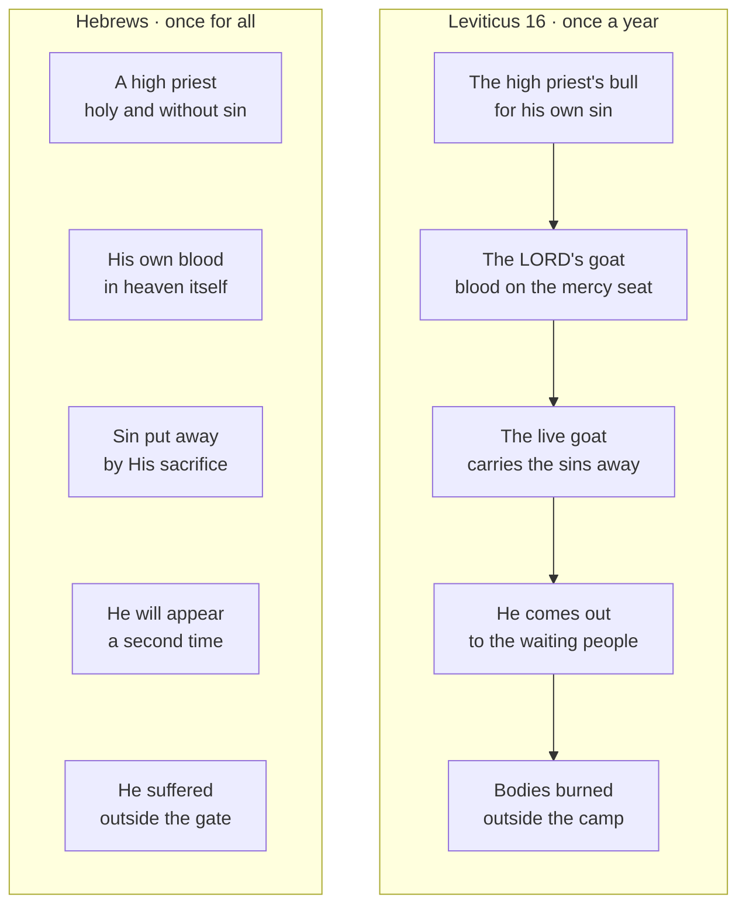

# The Day of Atonement: Once a Year, Once for All

{ align=right width="96" }
One day a year, one man went behind the veil. "Tell Aaron your brother not to come at any time into
the Holy Place inside the veil, before the mercy seat that is on the ark, so that he may not die"
(Leviticus 16:2, ESV). On the tenth day of the seventh month he went in with blood, and came out
having made atonement for the whole people.

**In one sentence:** Once a year the high priest carried blood to the mercy seat and sent Israel's
sins away on a goat, so that the holy God could keep dwelling among His people; Jesus has done this
once for all with His own blood in heaven itself, so you may draw near to God with confidence; and the
day of national mourning and cleansing the prophets foresee for Israel still waits for His return.

> ✝️ Leviticus 16:29-30 (ESV)
>
> 29 "And it shall be a statute to you forever that in the seventh month, on the tenth day of the
> month, you shall afflict yourselves and shall do no work, either the native or the stranger who
> sojourns among you. 30 For on this day shall atonement be made for you to cleanse you. You shall be
> clean before the LORD from all your sins.

## Key Takeaways

*(This section follows the [Key Takeaways](../about/key-takeaways.md) format — see that page for what each part is for.)*

### Types & Prophecy

- **Type, named by Hebrews.** The high priest went in "once a year, and not without taking blood";
  Christ "entered once for all into the holy places ... by means of his own blood, thus securing an
  eternal redemption" (Hebrews 9:7, 12, ESV).
- **The national day, inferred from prophecy.** Zechariah foresees Israel mourning when "they look on
  me, on him whom they have pierced", and "a fountain opened ... to cleanse them from sin and
  uncleanness" (Zechariah 12:10; 13:1, ESV). Reading that day as the fulfilment of Yom Kippur is an
  inference from shared themes; the events themselves are prophesied.

### Lessons about Jesus

- **He is the High Priest who needed no sacrifice for Himself.** He is "holy, innocent, unstained",
  and "has no need, like those high priests, to offer sacrifices daily, first for his own sins"
  (Hebrews 7:26-27, ESV).
- **He is the propitiation.** God "put forward" Jesus "as a propitiation by his blood" (Romans 3:25,
  ESV), and "he is the propitiation for our sins, and not for ours only but also for the sins of the
  whole world" (1 John 2:2, ESV).
- **He will come out again.** "Christ, having been offered once to bear the sins of many, will appear
  a second time, not to deal with sin but to save those who are eagerly waiting for him" (Hebrews
  9:28, ESV).

### Memory verses

> ✝️ Hebrews 9:12 (ESV)
>
> 12 he entered once for all into the holy places, not by means of the blood of goats and calves but
> by means of his own blood, thus securing an eternal redemption.

> ✝️ Hebrews 10:19-22 (ESV)
>
> 19 Therefore, brothers, since we have confidence to enter the holy places by the blood of Jesus,
> 20 by the new and living way that he opened for us through the curtain, that is, through his flesh,
> 21 and since we have a great priest over the house of God, 22 let us draw near with a true heart in
> full assurance of faith, with our hearts sprinkled clean from an evil conscience and our bodies
> washed with pure water.

### Be Transformed

- **Think.** Your sins are put away for good: "I will remember their sins and their lawless deeds no
  more" (Hebrews 10:17, ESV, quoting Jeremiah 31:34).
- **Attitude.** Israel humbled itself on this day. Come to God with the same honesty about sin, and
  with the confidence of one whose High Priest has already gone in: "Let us then with confidence draw
near to the throne of grace" (Hebrews 4:16, ESV).
- **Do.** This week, confess a specific sin to God by name, and thank Him by name for the blood of
  Jesus that has taken it away.

### Prayer

Father, you are holy, and no one could come into your presence and live. Thank you that you made a
way, first through the blood on the mercy seat once a year, and now through the blood of your Son
Jesus, offered once for all. He is our propitiation and our great High Priest. We draw near with
confidence because He has gone in for us. Remember our sins no more, as you have promised. And
pour out on Israel the spirit of grace, that they may look on Him whom they pierced and be cleansed.

In Jesus' name. Amen.

## Study outline

- [The day](#the-day). What Leviticus commanded, and why it began with two deaths.
- [Inside the veil](#inside-the-veil). The ritual of Leviticus 16 step by step, beside Hebrews.
- [The two goats](#the-two-goats). One for the LORD, one sent away, and what "Azazel" may mean.
- [Christ our High Priest](#christ-our-high-priest). How Hebrews reads the day, and the mercy seat's
  word in Romans 3:25.
- [The day still ahead for Israel](#the-day-still-ahead-for-israel). Zechariah's mourning and
  cleansing, and how sure the link is.
- [Discussion questions](#discussion-questions). Six, for a group or on your own.

## The day

The day was born out of judgment. Leviticus 16 opens "after the death of the two sons of Aaron, when
they drew near before the LORD and died" (Leviticus 16:1, ESV; Leviticus 10:1-2). The ESV Study Bible
notes that their sin seems to have been entering, or trying to enter, the Most Holy Place. God then
told Moses the only way in.

On the tenth day of the seventh month Israel was to "afflict yourselves and ... do no work" (Leviticus
16:29, ESV). "Afflict yourselves" is תְּעַנּוּ אֶת־נַפְשֹׁתֵיכֶם, literally
"humble your souls", the phrase this site's study of [Fasting](../christian-life/fasting.md) traces.
It was "a Sabbath of solemn rest", from evening to evening (Leviticus 23:32, ESV), and anyone who
would not humble himself that day "shall be cut off from his people" (Leviticus 23:29, ESV). By the
first century it was simply "the Fast" (Acts 27:9, ESV).

The verb for "make atonement", כִּפֶּר (*kipper*, H3722), occurs forty-nine
times in Leviticus and sixteen times in chapter 16 alone. The lid of the ark where the blood was
sprinkled is כַּפֹּרֶת (*kapporet*, H3727), from the same root, translated
"mercy seat". On this one day, atonement was made for everything: "for the holy sanctuary ... for
the tent of meeting and for the altar, ... for the priests and for all the people of the assembly"
(Leviticus 16:33, ESV).

**This shows that God, who is holy, chose to dwell among a sinful people and provided the way to
do it.** The tent of meeting stood "in the midst of their uncleannesses" (Leviticus 16:16, ESV), and
once a year God cleansed it.

## Inside the veil

The ritual moved inward and then out again:

1. **Washing and linen.** The high priest bathed and put on plain linen garments (Leviticus 16:4).
2. **A bull for himself.** He offered a bull "as a sin offering for himself" to "make atonement for
   himself and for his house" (Leviticus 16:6, ESV).
3. **Incense and blood behind the veil.** He took coals and incense inside the veil, "that the cloud
   of the incense may cover the mercy seat ... so that he does not die", and sprinkled the bull's
   blood on and before the mercy seat seven times (Leviticus 16:13-14, ESV).
4. **The LORD's goat.** He killed the goat chosen by lot for the LORD and did the same with its blood
   for the people (Leviticus 16:15).
5. **The altar.** He came out and cleansed the altar with the blood of both (Leviticus 16:18-19).
6. **The live goat.** He laid both hands on the second goat, confessed Israel's sins over it, and
   sent it into the wilderness (Leviticus 16:20-22).
7. **Outside the camp.** The bodies of the bull and goat were burned outside the camp (Leviticus
   16:27).

Hebrews reads the same day in Christ. The Leviticus column follows the order of the day; the
Hebrews column pairs each step with the verse that answers it (Hebrews 7:26; 9:12, 26, 28; 13:12):

## The two goats

Two goats were taken "for a sin offering" (Leviticus 16:5, ESV), and lots were cast, "one lot for the
LORD and the other lot for Azazel" (Leviticus 16:8, ESV). The first goat died, and its blood went to
the mercy seat. The second was not killed:

> ✝️ Leviticus 16:21-22 (ESV)
>
> 21 And Aaron shall lay both his hands on the head of the live goat, and confess over it all the
> iniquities of the people of Israel, and all their transgressions, all their sins. And he shall put
> them on the head of the goat and send it away into the wilderness by the hand of a man who is in
> readiness. 22 The goat shall bear all their iniquities on itself to a remote area, and he shall let
> the goat go free in the wilderness.

עֲזָאזֵל (*ʿazazel*, H5799) occurs four times, all in this chapter (Leviticus
16:8; twice in 16:10; 16:26). Its meaning is contested. The NIV Biblical Theology Study Bible gives three readings:
"the goat that departs", "rough ground", or the name of a wilderness demon, and the LSB's footnote
reads "goat of removal". On every reading the goat's work is the same: Israel's sins were carried
away and did not come back.

The two goats show one atonement from two sides. The first shows sin paid for by death; the second
shows sin removed. David sang the second: "as far as the east is from the west, so far does he remove
our transgressions from us" (Psalm 103:12, ESV). Isaiah joined both in the Servant: "the LORD has
laid on him the iniquity of us all" (Isaiah 53:6, ESV).

## Christ our High Priest

Hebrews reads Christ's work as the Day of Atonement fulfilled:

> ✝️ Hebrews 9:11-12 (ESV)
>
> 11 But when Christ appeared as a high priest of the good things that have come, then through the
> greater and more perfect tent (not made with hands, that is, not of this creation) 12 he entered
> once for all into the holy places, not by means of the blood of goats and calves but by means of
> his own blood, thus securing an eternal redemption.

Point by point:

- **The priest.** Aaron offered first for himself. Jesus "has no need ... to offer sacrifices daily,
  first for his own sins" (Hebrews 7:27, ESV).
- **The sanctuary.** "Christ has entered, not into holy places made with hands ... but into heaven
  itself, now to appear in the presence of God on our behalf" (Hebrews 9:24, ESV).
- **Once.** Aaron went in every year. Christ "has appeared once for all at the end of the ages to put
  away sin by the sacrifice of himself" (Hebrews 9:26, ESV).
- **The veil.** At His death "the curtain of the temple was torn in two, from top to bottom" (Matthew
  27:51, ESV), and believers now enter "by the new and living way that he opened for us through the
  curtain, that is, through his flesh" (Hebrews 10:20, ESV).
- **Outside the camp.** The bodies of the sin offerings were burned outside the camp, "So Jesus also
  suffered outside the gate in order to sanctify the people through his own blood" (Hebrews 13:12,
  ESV).

### The mercy seat's own word

The Greek Old Testament calls the mercy seat ἱλαστήριον (*hilastērion*, G2435). It does so through
Leviticus 16 (16:2, 13-15), including verse 14, where the blood is sprinkled. In the New Testament the word occurs twice: Hebrews 9:5
uses it for "the mercy seat", and Paul uses it of Jesus, "whom God put forward as a propitiation by
his blood" (Romans 3:25, ESV). The ESV Study Bible explains propitiation as Christ's blood satisfying
God's wrath against sin, so that God could forgive without compromising His holiness. That is the
doctrine this day pictured. **God Himself provided the sacrifice that turns away His own wrath, so
that He is "just and the justifier of the one who has faith in Jesus" (Romans 3:26, ESV).**
Whether Paul means the mercy seat itself or a propitiating sacrifice in general is debated, and
[The Ark of the Covenant](../jesus/the-heavenly-pattern/ark.md) weighs the case.

## The day still ahead for Israel

Hebrews ends its reading of the day with the High Priest's return, a promise to the believers it
writes to: Christ "will appear a second time,
not to deal with sin but to save those who are eagerly waiting for him" (Hebrews 9:28, ESV). On the
Day of Atonement the people waited outside while the high priest was in the sanctuary, until he came
out (Leviticus 16:17-18, 24). Hebrews does not draw that picture explicitly; it is the order of the
day it is reading.

For Israel as a nation, the prophets foresee a national day of mourning and cleansing for Israel:

> ✝️ Zechariah 12:10 (ESV)
>
> 10 "And I will pour out on the house of David and the inhabitants of Jerusalem a spirit of grace and
> pleas for mercy, so that, when they look on me, on him whom they have pierced, they shall mourn for
> him, as one mourns for an only child, and weep bitterly over him, as one weeps over a firstborn.

John applies the verse to Jesus at the cross: "They will look on him whom they have pierced" (John
19:37, ESV), and Revelation 1:7 places the looking at His coming: "every eye will see him, even
those who pierced him" (ESV).

"On that day there shall be a fountain opened for the house of David and the inhabitants of
Jerusalem, to cleanse them from sin and uncleanness" (Zechariah 13:1, ESV). Paul expects the same:
"all Israel will be saved ... when I take away their sins" (Romans 11:26-27, ESV).

**How sure is the link?** The events are prophesied. Reading them as the fulfilment of Yom Kippur is
an inference from the shared themes, the nation humbled and mourning, and sin cleansed, and no
New Testament text names the feast. It fits this site's [dispensational reading](../about/statement-of-faith.md#end-times) of Israel's
future. The atoning sacrifice itself is finished; what waits is Israel
looking on Him. See [Israel's Regathering and Refining](../israel-and-church/israels-regathering-and-refining.md).

The jubilee year was announced on this day. "On the Day of Atonement you shall sound
the trumpet throughout all your land" (Leviticus 25:9, ESV). Release began on the Day of Atonement.

For where this day sits among the feasts, see [The Appointed Times](feasts.md).

## Discussion questions

1. **The language.** The mercy seat (*kapporet*) and "make atonement" (*kipper*) share a root, and the
   Greek *hilastērion* names both the mercy seat and Christ (Romans 3:25). What does that add to your
   picture of the cross?
2. **The text in its context.** Leviticus 16 begins with the death of Aaron's sons (Leviticus 16:1).
   Why does God's instruction for the holiest day start there?
3. **Christ.** Hebrews says Christ entered "once for all" (Hebrews 9:12). What would it mean for your
   assurance if His sacrifice had to be repeated?
4. **The hard part.** The meaning of "Azazel" is uncertain (Leviticus 16:8). Does the goat's work
   depend on settling it?
5. **Israel.** Zechariah 12:10 has Jerusalem mourning for "him whom they have pierced". How should a
   Christian pray for Israel in the light of that promise?
6. **Be transformed.** Israel humbled itself on this day. What would it look like for you to come to
   God this week with that honesty, and with Hebrews 10:22's confidence?

## References & Recommended Reading

- **ESV Study Bible** (Crossway) — verse text throughout; notes on Leviticus 16:1-2, 16:1-34, 16:3-10
  and Romans 3:25.
- **NIV Biblical Theology Study Bible** (Zondervan) — note on Leviticus 16:8, 10, 26 (Azazel).
- **CSB Ancient Faith Study Bible** and **Legacy Standard Bible** — footnotes on Leviticus 16:8.
- **Septuagint** — ἱλαστήριον at Leviticus 16:14, via the LXX lemma data in this site's reference
  database.
- **Macula Hebrew (WLC)** and **Macula Greek (SBLGNT)** — occurrence data for כִּפֶּר, כַּפֹּרֶת,
  עֲזָאזֵל and ἱλαστήριον; unfoldingWord ULT interlinear for Leviticus 16:29.

### On this site

- [The Appointed Times](feasts.md) — the seven feasts of Leviticus 23.
- [The Ark of the Covenant](../jesus/the-heavenly-pattern/ark.md) — the mercy seat.
- [Fasting](../christian-life/fasting.md) — "afflict yourselves" and the one commanded fast.
- [Israel's Regathering and Refining](../israel-and-church/israels-regathering-and-refining.md) —
  Zechariah 12-13.
