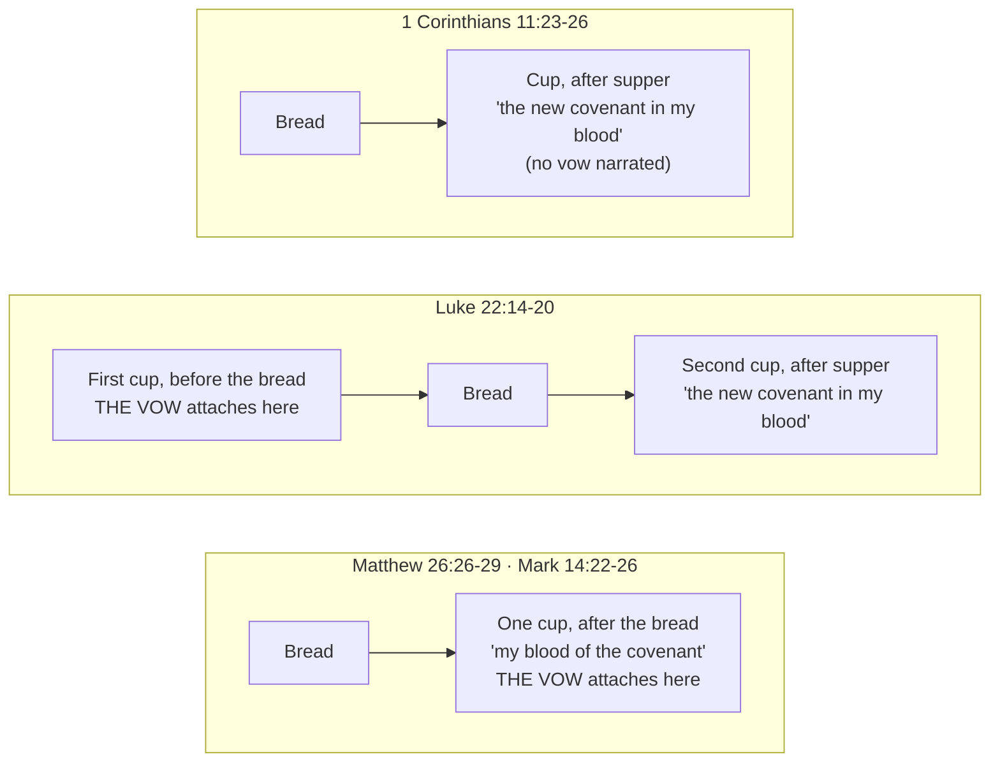
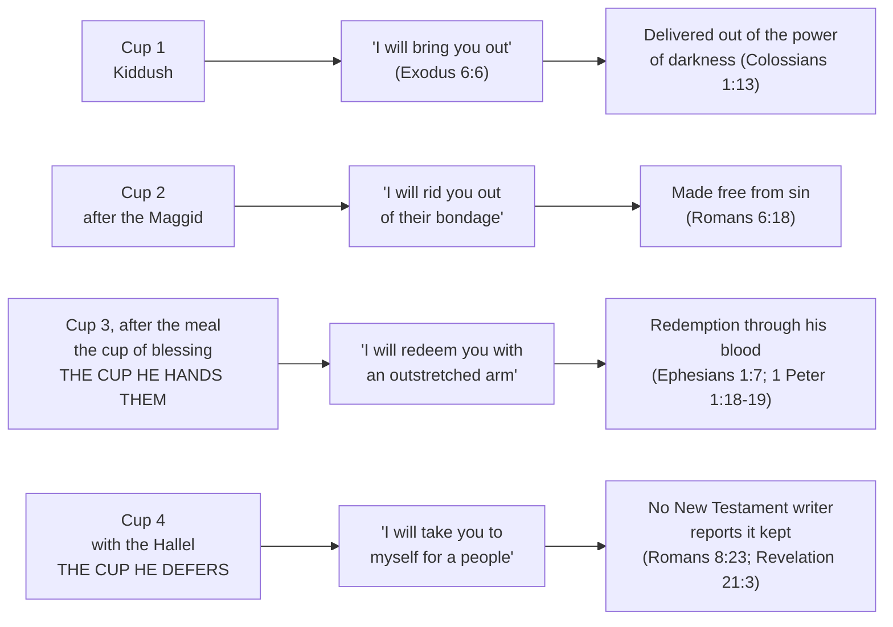

# "I Will Not Drink Again": The Last Supper and the Cups of Passover

Jesus's last meal was a Passover supper, but it was not only a Passover supper. Passover was the
pattern — the type — a meal God gave Israel to keep every year until the thing it pictured arrived,
and at that table it arrived. Jesus took the meal's own bread and wine, named them his body and his
blood, and called the cup "the new covenant in my blood" (Luke 22:20, WEB). Paul says it flatly:
*"For indeed Christ, our Passover, has been sacrificed in our place"* (1 Corinthians 5:7, WEB).

Passover also ran to a script: four cups of wine, drunk in a fixed order, each one standing for one
of the four promises God made when he brought Israel out of Egypt — I will bring you out, I will
free you, I will redeem you, and *I will take you to myself for a people* (Exodus 6:6-7). On the
night he was betrayed, partway through that meal, Jesus stopped drinking. Not just for that night —
until the kingdom of God comes.

**The cup he is waiting to drink again, new, with us in the kingdom is the fourth cup, and the
fourth cup carries God's last promise: he will take us to himself as his own people.** Three of
those four promises his blood secured that night — brought out, freed, redeemed. The fourth is the
one still waiting, and so is the cup that carries it. The meal he left unfinished finishes at the
wedding supper of the Lamb, and every communion since has proclaimed his death "until he comes."

Here is the vow, in Mark and in Luke:

> ✝️ Mark 14:24-25 (ASV)
>
> 24 And he said unto them, This is my blood of the covenant, which is poured out for many.
> 25 Verily I say unto you, I shall no more drink of the fruit of the vine, until that day when I
> drink it new in the kingdom of God.

> ✝️ Luke 22:17-18 (WEB)
>
> 17 He received a cup, and when he had given thanks, he said, "Take this and share it among
> yourselves, 18 for I tell you, I will not drink at all again from the fruit of the vine, until
> God's Kingdom comes."

Matthew, Mark and Luke all record the vow. None of them says which cup he was holding — the
numbering comes from the Passover order of service, and the two sections below weigh exactly how
much that can bear.

## Key Takeaways

*(This section follows the [Key Takeaways](../about/key-takeaways.md) format this site is
prototyping — see that page for what each part is for and why.)*

### Types & Prophecy

**Type — the feast.** Passover was never only a memorial of Egypt. Paul calls the festivals "a
shadow of the things to come; but the body is Christ's" (Colossians 2:17, WEB), and names the
substance that cast the shadow: "Christ, our Passover, has been sacrificed in our place"
(1 Corinthians 5:7, WEB). The lamb killed so that death would pass over Israel's houses (Exodus
12:13) is the picture; the one killed at that same feast is what it pictured. Jesus keeps the meal's
shape and puts himself where the lamb had been.

**Type — the covenant.** Moses ratified the Sinai covenant by sprinkling sacrificial blood over the people: "this
is the blood of the covenant, which Yahweh has made with you" (Exodus 24:8, WEB). Jesus takes that
sentence, applies it to a cup, and hands the cup to the twelve. Sinai's blood went onto the people
from outside and its terms were cut into stone; the covenant Jeremiah promised is put inside
— "I will put my law in their inward parts, and I will write it in their heart" (31:33, WEB) — and
its blood is handed over to be drunk. Blood was the one thing Israel could not consume, and Leviticus
gives the reason: "the life of the flesh is in the blood" (17:11, WEB). The cup offers what the
prohibition guarded — his life, taken in.

**Prophecy.** Jeremiah promises a covenant God has not yet made: *"Behold, the days come," says
Yahweh, "that I will make a new covenant with the house of Israel, and with the house of Judah"*
(Jeremiah 31:31, WEB) — both houses, named. Calling the cup "the new covenant in my blood" (Luke
22:20; 1 Corinthians 11:25) claims that promise is being enacted at that table.

**Still outstanding: the wedding.** The vow defers a drink to "that day" in the kingdom, and the
promise it holds back is Exodus 6:7's fourth — "I will take you to myself for a people." Scripture
turns that formula marital. Hosea uses the same words as betrothal: *"I will betroth you to me
forever... I will tell those who were not my people, 'You are my people'"* (Hosea 2:19, 23, WEB).
Jesus teaches the kingdom as a wedding feast twice in the chapters just before this meal — a king
"who made a wedding feast for his son" (Matthew 22:2, WEB), and the ready who "went in with him to
the wedding feast" while the door shut behind them (Matthew 25:10, WEB). Revelation names the meal
that ends the wait, "the wedding supper of the Lamb" (19:9), and closes the formula the fourth
promise opened: "they will be his people, and God himself will be with them as their God" (21:3,
WEB). The banquet also swallows death (Isaiah 25:6-8).

### Lessons about Jesus

- He ties the covenant to a cup of the Passover. The cups of the *Seder* (Hebrew for "order" — the
  name for the way the Passover meal is run) carry Exodus's promises in sequence: brought out,
  freed, redeemed, taken (Exodus 6:6-7). The cup he calls "the new covenant in my blood" (Luke
  22:20, WEB) falls at the third, redemption. The fourth is the one he holds back.
- Passover remembered a deliverance God had already worked. He gives the same meal a new object —
  "Do this in memory of me" (Luke 22:19, WEB) — and his blood is what the memorial now names:
  brought out of darkness, freed from sin, redeemed, and not yet taken.
- He binds himself by a vow. Abstaining from a named food or drink until a stated condition was met
  was a recognized formal act in first-century Judaism.
- He leaves the meal unfinished on purpose — the Supper he institutes has a missing last course.
- He expects to drink it again, with named company and in a named place: "with you in my Father's
  Kingdom" (Matthew 26:29, WEB). The vow promises a reunion.

### Memory verses

> ✝️ Mark 14:25 (ASV)
>
> 25 Verily I say unto you, I shall no more drink of the fruit of the vine, until that day when I
> drink it new in the kingdom of God.

**1 Corinthians 11:26 (WEB)** — "For as often as you eat this bread and drink this cup, you proclaim
the Lord's death **until he comes**."

### Be Transformed

- **Think.** Communion is not only a memorial. The bread and cup proclaim a death *until he comes*,
  which makes every observance a standing announcement that he will.
- **Attitude.** Expectancy at the table. The meal Jesus instituted is one course short by his own
  choice, and he named the company he intends to finish it with.
- **Do.** At the next communion, name what you are waiting for, not only what you are remembering.

### Prayer

Father, you ratified a covenant at Sinai with blood sprinkled over your people, and you kept it. At the
table your Son named a better one in his own blood, and left a cup undrunk until you bring him back
to it. You do not leave promises half-kept. Teach us to eat and drink as people waiting for someone,
and keep us at the table until the day he drinks it new with us. Amen.

## Historical context: the four cups of Passover

The Mishnah — the earliest written codification of Jewish oral law, redacted around 200 AD but
preserving considerably earlier practice — devotes a chapter,
[*Pesachim* 10](https://www.sefaria.org/Mishnah_Pesachim.10.1?lang=bi), to the Seder. It opens:
*"Even the poorest person in Israel may not eat [on the eve of Pesach] until he reclines [at the
night's Seder]. And [the communal officers] must give him no fewer than four cups of wine"* (10:1,
Sefaria Community Translation, CC0). Four cups, at four fixed points:

1. **First cup** — with the opening Kiddush (sanctification of the day)
2. **Second cup** — after the *Maggid*, the telling of the Exodus story
3. **Third cup** — after *Birkat Hamazon*, the grace recited after the meal — commonly called the
   "cup of blessing" or "cup of redemption"
4. **Fourth cup** — with the *Hallel* (Psalms 113-118, sung in two halves, one before the meal and
   one after; *Pesachim* 10:6 preserves a Shammai/Hillel dispute over where the first half ends)

The structure has a ruled-on pause built into it, at exactly the point where a vow like Jesus's
would land if tied to the third cup:

*"A third cup would be mixed for [the Seder leader]... Between these [first three] cups, if he wants
to drink, he may drink. Between the third and the fourth [cups], he may not drink."*
([Mishnah Pesachim 10:7](https://www.sefaria.org/Mishnah_Pesachim.10.7?lang=bi), Sefaria Community
Translation, CC0)

One cup per promise, in the order Exodus gives them. Scripture itself uses cup-language for
redemption in words the Seder sings: *"I will take the cup of salvation, and call on Yahweh's
name"* (Psalm 116:13, WEB), part of the Hallel.

**The caveat that governs everything built on this.** The Mishnah records the four-cup structure
about 170 years after the meal in question. No surviving Second Temple-period source enumerates the
four cups, so applying the structure to a c. 33 AD Passover rests on the mainstream scholarly
assumption that the practice was already fixed by then.

## Literary context: what each Gospel actually narrates

Three of the four accounts are Gospel narrative and one (Paul's) is an epistle, which sets the
reading order: each account gets read on its own terms before any of them are harmonized, because a
detail present in one and absent from another is evidence about that writer's account, not a gap to
be filled from a neighbour. The dating runs the other way from the usual assumption. Paul writes in
the mid-50s AD, in a tradition he says he "received from the Lord"; the Gospels reach final form
later, Mark commonly placed in the 60s and Matthew and Luke anywhere from the 60s to the 80s
depending on the scholar. The earliest written witness to this meal is the epistle.

The four accounts do not narrate the same number of cups.

**Matthew (26:26-29) and Mark (14:22-26)** each narrate **one** cup, given after the bread, and
attach the vow to that same cup — the one Jesus has just identified with his blood. Matthew differs
from Mark twice over: he adds **μεθ' ὑμῶν** (*meth' hymōn*, "with you"), and where Mark has "the
kingdom of God" Matthew has "my Father's kingdom." Both differences point the vow at a named
company and a named place.

**Luke (22:14-20)** narrates **two**. The first (22:17-18, quoted above) comes before the bread, and
carries the vow. The second comes after:

> ✝️ Luke 22:20 (WEB)
>
> 20 Likewise, he took the cup after supper, saying, "This cup is the new covenant in my blood,
> which is poured out for you."

So Luke's vow attaches to the *first* cup, not to the covenant-cup after supper.

**Paul** (1 Corinthians 11:23-26) confirms Luke's timing for the covenant-cup independently: "in the
same way he also took the cup after supper" (1 Cor 11:25, WEB). The Greek is identical in both:
**μετὰ τὸ δειπνῆσαι** (*meta to deipnēsai*). That is precisely where the Seder's third cup falls,
after the grace following the meal.

**A textual note.** Luke 22:19b-20 is missing from Codex Bezae and a handful of Old Latin
manuscripts — one of the readings Westcott and Hort called the "Western non-interpolations." The
earlier and more broadly attested manuscripts carry the fuller text with both cups, which is what
modern translations follow. Luke's two-cup structure was already unsettled enough in the earliest
copying tradition for a whole clause to drop out of one line of transmission.

**So which cup is Jesus declining?** In Matthew and Mark the vow attaches directly to the
covenant-cup, and on timing alone — "after supper" in Luke and Paul — that cup corresponds to the
Seder's third, the cup of blessing. Paul keeps that cup's name: what the Corinthians share is
**τὸ ποτήριον τῆς εὐλογίας** (*to potērion tēs eulogias*), "the cup of blessing which we bless"
(1 Corinthians 10:16, WEB), which is the name the Seder's third cup carries in the list above. If
the third cup is the one in his hand, the next cup in the order of service is the fourth, and it is
the one that goes undrunk.

The popular further step — that Jesus *skipped* the fourth cup — is built from a silence. Matthew
and Mark both record "having sung a hymn" (probably the Hallel's second half, which accompanies the
fourth cup) immediately before leaving for the Mount of Olives (Matthew 26:30; Mark 14:26), without
narrating a fourth cup being poured or drunk. None of the four accounts numbers the cups at all; the
numbering comes from reading them against the Mishnah. The argument below does not rest on that
silence — it rests on which *promise* the fourth cup carries, which is stated in Exodus and traced
through the rest of Scripture.

The third-cup reading has independent support. The *NIV Cultural Backgrounds Study Bible*
(Zondervan, ed. Walton & Keener), reasoning from the closing hymn in the next verse (Matthew 26:30),
concludes "the present cup is probably the third one." It works cleanly for Matthew and Mark's
single cup. Luke, where the vow sits on the first cup, does not fold into it. The same commentary
supplies the cultural category for the vow: a vow of abstinence, of the recognized first-century
Jewish kind, with "until the kingdom of God comes" as its stated condition.

## Word study: "fruit of the vine," "new," and "covenant"

- **"Fruit of the vine"** (γένημα τῆς ἀμπέλου, *genēma tēs ampelou*, G1081/G288) echoes the Kiddush
  blessing itself — *borei pri hagafen*, "who creates the fruit of the vine." Jesus phrases the vow
  in the meal's own liturgical vocabulary.
- **"New"** (καινός, *kainos*, G2537). The claim usually made here is that καινός means new *in
  kind* while νέος means new *in time*. The corpus does not support the split that cleanly. MACULA's Louw-Nida tagging in this project's `bible-text.db` puts Matthew
  26:29 and 1 Corinthians 11:25 in domain **58.71** (class and character — "new in kind"), but
  Mark 14:25 and Luke 22:20 in domain **67.115**, a *time* domain. Across the corpus the two words
  overlap in both directions: νέος appears in the 58.71 "kind" domain, καινός appears five times in
  the 67.115 "time" domain, and Mark 2:22 carries both codes at once. What the word does carry
  consistently is the tie between the cup and the covenant — the same adjective gives "new covenant"
  (*kainē diathēkē*, καινὴ διαθήκη, Luke 22:20; 1 Corinthians 11:25) and the "new" drinking in the
  kingdom (Matthew 26:29; Mark 14:25). The cup he defers and the covenant he institutes share a word.
- **"Covenant"** (διαθήκη, *diathēkē*, G1242) reaches back to two Old Testament texts at once.

**Jeremiah** supplies the promise (31:31, quoted above). **Sinai supplies the words.** "Blood of the
covenant" (Matthew 26:28; Mark 14:24) is Moses's phrase at the ratification: *"Look, this is the
blood of the covenant, which Yahweh has made with you concerning all these words"* (Exodus 24:8,
WEB). The echo depends on the shorter reading — SBLGNT has both Matthew 26:28 and Mark 14:24 as τὸ αἷμά μου τῆς διαθήκης, "my blood of the
covenant," where the later manuscript tradition behind the KJV and WEB inserts "new" and blurs the
link back to Moses.

## The cup he hands them: the blood of the new covenant

Passover remembers a rescue already accomplished: *"This day shall be a memorial for you. You shall
keep it as a feast to Yahweh"* (Exodus 12:14, WEB). The four cups walk the congregation back through
what was accomplished, in the order Exodus gives it — brought out, freed, redeemed, taken
(Exodus 6:6-7). Jesus keeps the memorial form and changes what is being remembered: *"This is my
body which is given for you. Do this in memory of me"* (Luke 22:19, WEB), and over the cup, *"This
cup is the new covenant in my blood, which is poured out for you"* (Luke 22:20, WEB).

**The blood changes hands as the covenant changes location.** Moses threw the blood at the people —
the verb at Exodus 24:8 is זָרַק (*zāraq*, H2236), "toss, throw," which WEB
renders "sprinkled." Jesus puts the blood in their hands and tells them to drink. Blood is the one
substance Israel was barred from consuming, and the ban carries its own reason: *"For the life of the
flesh is in the blood. I have given it to you on the altar to make atonement for your souls; for it
is the blood that makes atonement by reason of the life"* (Leviticus 17:11, WEB), with being "cut off
from among his people" as the penalty for eating it (17:10, WEB). So a cup identified as covenant
blood and handed over to be drunk offers the life that atones, on the inside. Paul's word for what
happens at that cup is **κοινωνία** (*koinōnia*) — the cup of blessing is "a sharing of the blood of
Christ" (1 Corinthians 10:16, WEB). The mode matches the covenant's own terms: Sinai's law was cut
in stone, and Jeremiah's is written "in their inward parts" (31:33, WEB).

Jesus had said as much at the Passover season before this one, in the Capernaum synagogue (John 6:4,
59): *"He who eats my flesh and drinks my blood lives in me, and I in him"* (John 6:56, WEB) — a saying
his own disciples called hard (6:60). From 6:54 the verb is **τρώγω** (*trōgō*), "chew, gnaw," held
to the end of the discourse; [Bread of Life](../jesus/bread-of-life-feeding-the-multitudes.md) works
through that shift. John never narrates the Supper, and many readers take John 6 of faith in Christ
rather than of the sacrament. Either reading describes the same thing: a life received by taking
Christ in, where Sinai's blood stayed on the outside.

The promises the Seder's cups carry are then the promises the New Testament says that blood
secures:

1. **"I will bring you out from under the burdens of the Egyptians"** — "who delivered us out of the
   power of darkness, and translated us into the Kingdom of the Son of his love" (Colossians 1:13,
   WEB).
2. **"I will rid you out of their bondage"** — "Being made free from sin, you became bondservants of
   righteousness" (Romans 6:18, WEB).
3. **"I will redeem you with an outstretched arm"** — "In him we have our redemption through his
   blood" (Ephesians 1:7, WEB); "you were redeemed... with precious blood, as of a lamb without
   blemish or spot, the blood of Christ" (1 Peter 1:18-19, WEB). This is the cup he hands them.
4. **"I will take you to myself for a people"** — the promise no New Testament writer reports as
   kept. Its counterpart in Paul's chain of what God has done is the last verb, "whom he justified,
   those he also glorified" (Romans 8:30, WEB), and the same letters have believers still "waiting
   for adoption, the redemption of our body" (Romans 8:23, WEB), glory arriving when "Christ, our
   life, is revealed" (Colossians 3:4, WEB).

The cup he hands over and the cup he defers divide the promises the same way. Three are secured by
the blood he names at the table; the fourth waits, and so does the cup that carries it.

**Two limits on that alignment.** The four-cup-to-four-promise correspondence is Jewish tradition
(see the sources listed at the end), and setting Colossians, Romans, Ephesians and 1 Peter beside
those promises is a step this study takes — no New Testament writer lines them up. And Jeremiah's
new covenant is made "with the house of Israel, and with the house of Judah" (31:31, WEB); its
national terms are not exhausted by the church's communion cup, though Hebrews already calls Christ
"the mediator of a new covenant" whose death redeems "the transgressions that were under the first
covenant" (Hebrews 9:15, WEB).

## The fourth promise: "I will take you to me for a people"

The four cups answer to four promises, and the fourth is the one the vow leaves hanging:

> ✝️ Exodus 6:7 (WEB)
>
> 7 I will take you to myself for a people. I will be your God; and you shall know that I am Yahweh
> your God, who brings you out from under the burdens of the Egyptians.

**The verb is one of acquisition.** Hebrew לָקַח (*lāqaḥ*, H3947), "take,"
with לִי (*lî*) — "to *myself*." Not
merely rescue from Egypt, which the first three promises already cover, but acquisition: God takes
Israel to himself as his own.

**That promise's formula is the one Jeremiah reuses** for the new covenant Jesus names at the cup:
"I will be their God, and they shall be my people" (Jeremiah 31:33, WEB). The covenant instituted at
the third cup is described in the language of the fourth.

**And Jesus says the fourth promise back, in that room, that night.** A few verses into the same
evening's discourse:

> ✝️ John 14:3 (WEB)
>
> 3 If I go and prepare a place for you, I will come again and will receive you to myself; that
> where I am, you may be there also.

The Greek is **παραλήμψομαι ὑμᾶς πρὸς ἐμαυτόν** (*paralēmpsomai hymas pros emauton*). The Septuagint
renders Exodus 6:7's fourth promise **λήψομαι ἐμαυτῷ ὑμᾶς λαὸν ἐμοὶ** — "I will take you to myself
for a people." Both are a future of λαμβάνω, both take ὑμᾶς as object, and both carry the reflexive
ἐμαυτ-, "to myself."

The echo is easier to see in Greek than in English, because translations split on παραλαμβάνω: ESV
has "take you to myself," while WEB, ASV and KJV have "receive." The verb covers both, and it is the
same verb whichever English word a translator picks.

παραλαμβάνω is a compound of λαμβάνω rather than the identical verb, and John gives no citation
formula, so this is an echo rather than a quotation. But the shared reflexive
makes it more than a generic overlap — of all the ways to say "I will come back for you," Jesus uses
the construction the fourth promise uses, on the night of the meal built around it.

**Where that leads depends on how you read John 14:3.** On the dispensational reading this site
generally takes, John 14:3 is the promise of the rapture: Christ returns for his own and takes them
to himself, before the events that follow. On that reading the fourth cup answers directly to it —
the promise drunk last in the Seder is the promise kept last in redemption's order, and the meal
Jesus interrupted resumes when he comes for his people. Others read John 14:3 of the second coming
generally, or of the believer's reception at death. The verse does not settle between them, and this
study does not need it to: on any of those readings, "I will take you to myself" is still future,
still unfulfilled, and still the fourth promise's own language.

**The move from covenant formula to marriage is Scripture's own.** Hosea takes the fourth promise's
wording and makes it betrothal, then closes with the formula itself:

> ✝️ Hosea 2:19-20 (WEB)
>
> 19 I will betroth you to me forever. Yes, I will betroth you to me in righteousness, in justice,
> in loving kindness, and in compassion. 20 I will even betroth you to me in faithfulness; and you
> shall know Yahweh.

Four verses later: *"I will tell those who were not my people, 'You are my people;' and they will
say, 'You are My God!'"* (Hosea 2:23, WEB). The same acquisition Exodus 6:7 promises, said as a
marriage. Jesus then teaches the kingdom as a wedding feast twice in the chapters immediately
preceding this meal (Matthew 22:2; 25:10), so the image is his own before it is Revelation's.

Scripture's last picture of that taking is a wedding:

> ✝️ Revelation 19:9 (WEB)
>
> 9 He said to me, "Write, 'Blessed are those who are invited to the wedding supper of the Lamb.'"
> He said to me, "These are true words of God."

A wedding supper is a meal, and it completes the covenant formula the fourth promise began — "they
will be his people, and God himself will be with them as their God" (Revelation 21:3, WEB). The cup
Jesus declined is a cup of acquisition, and the day he named for drinking it is the day he collects
what the cup promised.

## Theological principle

Jesus leaves the meal's final movement unfinished, vowing to abstain until "the kingdom of God
comes" (Luke) — "until that day when I drink it new" (Mark, Matthew). The Supper looks both ways:
back to a covenant ratified and a redemption paid in his blood, and past itself to a future shared
table, where the promise it holds in reserve is God's last one — a people taken to himself.

That table is taught across both Testaments, not inferred from this vow alone. God prepares "a feast
of choice meat... of well refined choice wines" for all peoples on his mountain (Isaiah 25:6, WEB);
"many will come from the east and the west, and will sit down with Abraham, Isaac, and Jacob in the
Kingdom of Heaven" (Matthew 8:11, WEB); Revelation calls it "the wedding supper of the Lamb"
(Revelation 19:9, WEB).

A popular devotional reading has the vow completed when Jesus receives sour wine on the cross (John
19:28-30) just before "It is finished." It rests on devotional rather than scholarly sources, and
the text draws no such conclusion — the vow's stated condition is the kingdom's arrival, which the
cross does not meet.

## Application

- **Culturally bound:** the number and liturgical placement of the Seder's cups is Jewish festal
  custom. The New Testament legislates none of it for believers observing the Lord's Supper.
- **Transcultural:** Jesus's meal points forward, deliberately, to something not yet arrived. That
  already/not-yet shape runs through the New Testament's whole picture of the kingdom and is taught
  directly elsewhere (Isaiah 25, Matthew 8:11, Luke 14:15-24, Revelation 19).
- Every observance since carries the same forward tilt: "as often as you eat this bread and drink
  this cup, you proclaim the Lord's death **until he comes**" (1 Corinthians 11:26, WEB, emphasis
  added).

## Discussion questions

1. Matthew and Mark attach "I will not drink again" to the covenant-cup; Luke attaches it to an
   earlier cup. What changes about the statement depending on which Gospel you are in, and what
   holds across all of them?
2. The Mishnah's four-cup structure is a checkable source from about 200 AD, describing a meal from
   about 33 AD. How much weight should later-attested liturgical practice carry when reading an
   earlier scene, and how would you decide?
3. Read Exodus 6:6-7, Jeremiah 31:33, and Revelation 21:3 in sequence. What does the recurring
   formula — "my people," "their God" — trace across the whole of Scripture, and where does the
   Last Supper sit on that line?
4. Jesus says "I will take you to myself" (John 14:3) on the night of a meal whose fourth cup
   carries "I will take you to me for a people." How much weight will that echo bear, and what
   would change your mind about it?
5. Where do you see the Supper's forward-looking dimension — "until he comes" — reflected, or
   missing, in how communion is practiced and talked about today?

## References & Recommended Reading

- **Mishnah, *Pesachim* 10** — the primary source for the Seder's four-cup structure and the rule
  against drinking between the third and fourth cups. Quoted above from the **Sefaria Community
  Translation (CC0)**, via [sefaria.org](https://www.sefaria.org/Mishnah_Pesachim.10.1?lang=bi) /
  the [Sefaria-Export](https://github.com/Sefaria/Sefaria-Export) data.

    On licensing: the Hebrew (Torat Emet edition) is Public Domain, and several English translations
    are open — this one CC0, Kulp's *Mishnah Yomit* CC-BY — though Sefaria's default English display
    (William Davidson Edition) is CC-BY-NC.
- The Exodus 6:6-7 four-promises correspondence was cross-checked against several independent Jewish
  and Messianic background sources (Chabad.org, TorahResource, Jewish Awareness Ministries) for
  convergence.
- *NIV Cultural Backgrounds Study Bible* (Zondervan, ed. John H. Walton & Craig S. Keener), notes at
  Matthew 26:27-30 and Mark 14:22-26 — reaches the "probably the third cup" reading independently,
  and is the source for the Exodus 24:8 echo and the vow-of-abstinence category used above.
  Recommended for the fuller verse-by-verse background.
- Original-language data (γένημα τῆς ἀμπέλου, καινός, διαθήκη, ποτήριον, εὐχαριστήσας, παραλαμβάνω,
  κοινωνία, τρώγω, לָקַח, זָרַק) and the Louw-Nida domain codes cited in the word study come from this project's own
  `bible-text.db` — MACULA Greek (SBLGNT) and MACULA Hebrew (WLC). The Exodus 6:7 Septuagint text is
  Brenton's edition (`ebible-grcbrent`), public domain.
- On the Luke 22:19b-20 variant: consult a critical apparatus (UBS5/NA28) directly for the
  manuscript evidence; the standard treatments of the "Western non-interpolations" cover this
  passage specifically.
- **Translations used.** Scripture is quoted from the **WEB** (World English Bible, public domain)
  throughout, with one exception: **Mark 14:24-25 is quoted from the ASV**. WEB follows the later
  manuscript tradition at Mark 14:24 and reads "my blood of the *new* covenant," which obscures the
  Exodus 24:8 echo the word study above depends on; ASV follows the shorter reading that SBLGNT
  carries. Every quotation on this page was checked verbatim against this project's own
  `bible-text.db` rather than quoted from memory.
