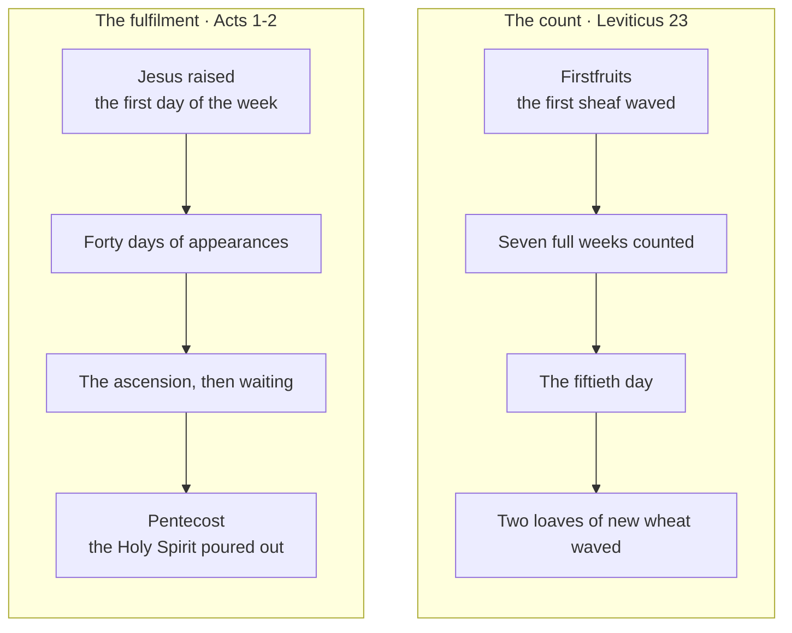

# Weeks: Fifty Days to Pentecost

{ align=right width="96" }
The Feast of Weeks began with counting. "You shall count seven full weeks from the day after the
Sabbath, from the day that you brought the sheaf of the wave offering. You shall count fifty days"
(Leviticus 23:15-16, ESV). On the fiftieth day, counted from the Sunday Jesus rose, His disciples
were gathered in Jerusalem for that feast, and God poured out the Holy Spirit.

**In one sentence:** The Feast of Weeks counted fifty days from the first sheaf to the first loaves
of the wheat harvest, a day of joy shared with the poor and the stranger; on the fiftieth day from
the Sunday Jesus rose, the exalted Christ poured out the Holy Spirit and the harvest of the church began;
so the Holy Spirit in you is God's firstfruits of everything He will finish.

> ✝️ Leviticus 23:15-17 (ESV)
>
> 15 "You shall count seven full weeks from the day after the Sabbath, from the day that you brought
> the sheaf of the wave offering. 16 You shall count fifty days to the day after the seventh Sabbath.
> Then you shall present a grain offering of new grain to the LORD. 17 You shall bring from your
> dwelling places two loaves of bread to be waved, made of two tenths of an ephah. They shall be of
> fine flour, and they shall be baked with leaven, as firstfruits to the LORD.

## Key Takeaways

*(This section follows the [Key Takeaways](../about/key-takeaways.md) format — see that page for what each part is for.)*

### Types & Prophecy

- **Fulfilment, named and dated.** "When the day of Pentecost arrived, they were all together in one
  place" (Acts 2:1, ESV), and the Holy Spirit came. Peter called it what Joel had foretold: "I will
  pour out my Spirit on all flesh" (Acts 2:17, ESV).
- **The covenant on the heart.** Jeremiah promised a covenant in which God would "write it on their
  hearts" (Jeremiah 31:33, ESV), and Ezekiel, "I will put my Spirit within you" (Ezekiel 36:27, ESV).
  Paul calls believers a letter written "with the Spirit of the living God, not on tablets of stone
  but on tablets of human hearts" (2 Corinthians 3:3, ESV).

### Lessons about Jesus

- **He sent the Spirit He promised.** "If I go, I will send him to you" (John 16:7, ESV).
- **He poured Him out from the throne.** "Being therefore exalted at the right hand of God, and
  having received from the Father the promise of the Holy Spirit, he has poured out this that you
  yourselves are seeing and hearing" (Acts 2:33, ESV).
- **He kept the count.** He appeared to His disciples "during forty days" and told them to wait in
  Jerusalem (Acts 1:3-4, ESV).

### Memory verses

> ✝️ Acts 2:33 (ESV)
>
> 33 Being therefore exalted at the right hand of God, and having received from the Father the
> promise of the Holy Spirit, he has poured out this that you yourselves are seeing and hearing.

> ✝️ Romans 8:23 (ESV)
>
> 23 And not only the creation, but we ourselves, who have the firstfruits of the Spirit, groan
> inwardly as we wait eagerly for adoption as sons, the redemption of our bodies.

### Be Transformed

- **Think.** The Holy Spirit living in you is God's own pledge, "the guarantee of our inheritance"
  (Ephesians 1:14, ESV). What He has begun, He will finish.
- **Attitude.** Weeks was a day of joy that reached the servant, the stranger, the fatherless and the
  widow (Deuteronomy 16:11). Let your thanks for the harvest make room for others.
- **Do.** This week, leave the edge of your field: give some of what you have earned to someone who
  cannot repay it (Leviticus 23:22).

### Prayer

Father, you counted the days to the harvest and kept your promise to the day. Thank you that your Son Jesus, raised from the dead and exalted at your right hand, poured out the
Holy Spirit at Pentecost. Thank you that the same Spirit lives in us, the firstfruits of all you will
finish. Write your word on our hearts, make us glad in your harvest, and make us generous to the poor
and the stranger, as you have been generous to us.

In Jesus' name. Amen.

## Study outline

- [The feast](#the-feast). The count, the two loaves, the offerings and the joy.
- [Leavened loaves](#leavened-loaves). Why this offering, alone of the feasts, was baked with leaven.
- [Weeks and Sinai](#weeks-and-sinai). The Jewish tradition that tied the feast to the giving of the
  law, and how far it can be pressed.
- [The day of Pentecost](#the-day-of-pentecost). Acts 2, the fifty days, and the beginning of the
  church.
- [Firstfruits of the Spirit](#firstfruits-of-the-spirit). What the Holy Spirit's coming guarantees.
- [Discussion questions](#discussion-questions). Six, for a group or on your own.

## The feast

### Its names

Scripture calls it by four names. It is "the Feast of Weeks, the firstfruits of wheat harvest"
(Exodus 34:22, ESV). It is "the Feast of Harvest" (Exodus 23:16, ESV) and "the day of the firstfruits"
(Numbers 28:26, ESV). The New Testament calls it πεντηκοστή (*pentēkostē*, G4005), "fiftieth". The
word occurs three times (Acts 2:1; 20:16; 1 Corinthians 16:8). The Hebrew שָׁבֻעוֹת
(*shavuʿot*, H7620) means "weeks".

### What it commanded

Weeks was the only one of Israel's feasts fixed by counting: seven weeks from the sheaf of
Firstfruits, and on the fiftieth day "a grain offering of new grain" (Leviticus 23:16, ESV). Two
loaves of fine flour were waved before the LORD with lambs, a bull, rams, a sin offering and peace
offerings (Leviticus 23:17-20). It was a holy convocation with no ordinary work (Leviticus 23:21), and
one of the three feasts at which every male appeared before the LORD (Deuteronomy 16:16).

Deuteronomy adds the spirit of the day:

> ✝️ Deuteronomy 16:10-12 (ESV)
>
> 10 Then you shall keep the Feast of Weeks to the LORD your God with the tribute of a freewill
> offering from your hand, which you shall give as the LORD your God blesses you. 11 And you shall
> rejoice before the LORD your God, you and your son and your daughter, your male servant and your
> female servant, the Levite who is within your towns, the sojourner, the fatherless, and the widow
> who are among you, at the place that the LORD your God will choose, to make his name dwell there.
> 12 You shall remember that you were a slave in Egypt; and you shall be careful to observe these
> statutes.

Leviticus sets one more law straight after the feast: "you shall not reap your field right up to its
edge, nor shall you gather the gleanings after your harvest. You shall leave them for the poor and
for the sojourner" (Leviticus 23:22, ESV). Ruth the Moabite lived by that law, "gleaning until the end
of the barley and wheat harvests" (Ruth 2:23, ESV). **This shows that God's harvest joy was meant to
reach the outsider.** The stranger ate from Israel's field because God commanded it.

## Leavened loaves

Leaven was forbidden on the altar: "No grain offering that you bring to the
LORD shall be made with leaven" (Leviticus 2:11, ESV). The two loaves of Weeks were "baked with
leaven" (Leviticus 23:17, ESV). The law itself explains how both can stand: leavened firstfruits may
be brought to the LORD, "but they shall not be offered on the altar for a pleasing aroma" (Leviticus
2:12, ESV). The loaves were waved before God and given to the priest (Leviticus 23:20); they were not
burned.

Christian teachers have often read the two leavened loaves as Jew and Gentile, made "one new man in
place of the two" (Ephesians 2:15, ESV). They read the leaven as the church's remaining sin. Both readings
fit the pattern, and neither is stated anywhere in Scripture. Hold them as illustrations. What the
text does say is that this offering was the firstfruits of the wheat, presented to God and given to
His priests. See [Unleavened Bread](unleavened-bread.md) for what leaven pictures elsewhere.

## Weeks and Sinai

Israel reached Sinai "on the third new moon after the people of Israel had gone out of the land of
Egypt" (Exodus 19:1, ESV). So the law was given in the season of Weeks. Jewish tradition made the
connection explicit:

- **Jubilees**, a second-century BC retelling of Genesis, says the feast was ordained "to renew the
  covenant every year" (Jubilees 6:17), and that Israel "celebrated it anew on this mountain", Sinai
  (Jubilees 6:19; R. H. Charles' 1913 translation, public domain).
- **The Babylonian Talmud**, compiled around AD 500, calls the feast "the day on which the Torah was
  given" (Pesachim 68b, William Davidson translation, via Sefaria).

The NIV Cultural Backgrounds Study Bible notes the same covenant-renewal association at Acts 2:1.
Luke never mentions Sinai. Readers have still noticed what Acts 2 shares with Exodus 19: the sound
from heaven and the fire (Acts 2:2-3; Exodus 19:16-18). There is also the law written on hearts in
place of stone (Jeremiah 31:33; 2 Corinthians 3:3). Some add the numbers. About three thousand died at
Sinai after the golden calf (Exodus 32:28), and about three thousand were added at Pentecost (Acts
2:41). The letter "kills", and the Spirit "gives life" (2 Corinthians 3:6, ESV). These are echoes. The tradition
is real and early, Paul's contrast of letter and Spirit is real, and Luke leaves the Sinai link to
the reader.

## The day of Pentecost

Jesus rose on the first day of the week (Matthew 28:1) and appeared to His disciples "during forty days" (Acts 1:3,
ESV). He told them "not to depart from Jerusalem, but to wait for the promise of the Father ... you
will be baptized with the Holy Spirit not many days from now" (Acts 1:4-5, ESV). Then He ascended (Acts 1:9), and
they waited until the feast:

> ✝️ Acts 2:1-4 (ESV)
>
> 1 When the day of Pentecost arrived, they were all together in one place. 2 And suddenly there
> came from heaven a sound like a mighty rushing wind, and it filled the entire house where they were
> sitting. 3 And divided tongues as of fire appeared to them and rested on each one of them. 4 And they
> were all filled with the Holy Spirit and began to speak in other tongues as the Spirit gave them
> utterance.

The feast had filled Jerusalem with "devout men from every nation under heaven" (Acts 2:5, ESV). Each
heard "the mighty works of God" in his own language (Acts 2:11, ESV). Peter explained it from
Joel (Acts 2:16-18) and from the risen Christ: "Being therefore exalted at the right hand of God ...
he has poured out this" (Acts 2:33, ESV), and he grounds the "right hand" in Psalm 110:1 (Acts
2:34-35). That day "there were added ... about three thousand souls"
(Acts 2:41, ESV), the first harvest of the church. Peter later called it "the beginning" (Acts 11:15,
ESV), when the Holy Spirit fell on the Gentiles at Cornelius' house as He had on the Jewish believers at
Pentecost. This site reads Pentecost as the birth of the church, the one body Jew and Gentile now share
(see the [Prophecy Chart](../last-things/prophecy-chart.md)). The early church still marked the feast:
Paul hurried "to be at Jerusalem, if possible, on the day of Pentecost" (Acts 20:16, ESV; 1
Corinthians 16:8).

The [Prophetic Timeline](../../timeline/#pentecost) shows the fifty days of AD 33, from Passover to
Pentecost. Acts dates the outpouring to the feast; that the count began on the morning Jesus rose
holds on this site's [AD 33 dating](../chronology/chronology-anchors.md#settling-the-crucifixion-year),
where the sheaf was waved on the Sunday of the resurrection (see [Firstfruits](firstfruits.md)).

**This shows that God keeps His calendar to the day.** The Lamb died at Passover, and at Weeks the
exalted Christ sent the Holy Spirit to gather His harvest.

## Firstfruits of the Spirit

Paul gives the Holy Spirit the harvest's own name: "we ourselves, who have the firstfruits of the
Spirit, groan inwardly as we wait eagerly for adoption as sons, the redemption of our bodies" (Romans
8:23, ESV). His word is ἀπαρχή (*aparchē*, G536), the Septuagint's word for the first sheaf
(Leviticus 23:10). The two loaves were the first of the wheat, and the promise of the rest. The Holy Spirit in you is the first of your inheritance. He is the promise of the rest: you were "sealed with the promised Holy
Spirit, who is the guarantee of our inheritance until we acquire possession of it" (Ephesians
1:13-14, ESV). **So you may live now in the Spirit's power. You can wait with confidence for the resurrection of
your body, because God has already given you the first of His harvest.**

For where Weeks sits among the feasts, see [The Appointed Times](feasts.md). The count begins at
[Firstfruits](firstfruits.md).

## Discussion questions

1. **The language.** *Pentēkostē* means "fiftieth", a name taken from counting. What does it add
   that God fixed this feast by counting from the first sheaf?
2. **The text in its context.** Leviticus 23:22, the gleaning law, follows straight after the Feast
   of Weeks. Why put it there?
3. **Christ.** Peter says the exalted Jesus "poured out" the Holy Spirit (Acts 2:33). What does that
   say about who Jesus is?
4. **The hard part.** Luke never mentions Sinai, yet Jewish tradition tied the feast to the giving of
   the law. How much weight should the parallels in Acts 2 carry?
5. **The church.** The feast brought "devout men from every nation" to Jerusalem (Acts 2:5). What does
   the timing say about the gospel's reach?
6. **Be transformed.** Romans 8:23 calls the Holy Spirit "firstfruits". How does that change the way
   you wait for what is still to come?

## References & Recommended Reading

- **ESV Study Bible** (Crossway) — verse text throughout; notes on Leviticus 23:15-22 and Acts 2:1-13.
- **NIV Biblical Theology Study Bible** (Zondervan) — note on Acts 2:1-47.
- **NIV Cultural Backgrounds Study Bible** (Zondervan) — note on Acts 2:1 (Pentecost and covenant
  renewal).
- **Jubilees 6:17-21**, R. H. Charles' translation (1913, public domain), via the Scrollmapper
  deuterocanonical collection.
- **Babylonian Talmud, Pesachim 68b**, William Davidson Edition (CC-BY-NC), via Sefaria.
- **Macula Hebrew (WLC)** and **Macula Greek (SBLGNT)** — occurrence data for שָׁבֻעוֹת and
  πεντηκοστή.

### On this site

- [The Appointed Times](feasts.md) — the seven feasts of Leviticus 23.
- [Firstfruits: The Sheaf Waved on the Third Day](firstfruits.md) — where the count begins.
- [Unleavened Bread](unleavened-bread.md) — what leaven pictures.
- [Prophecy Chart](../last-things/prophecy-chart.md) — Pentecost and the church.
