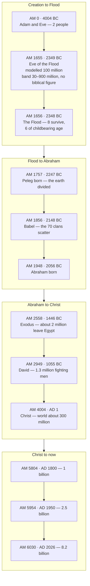
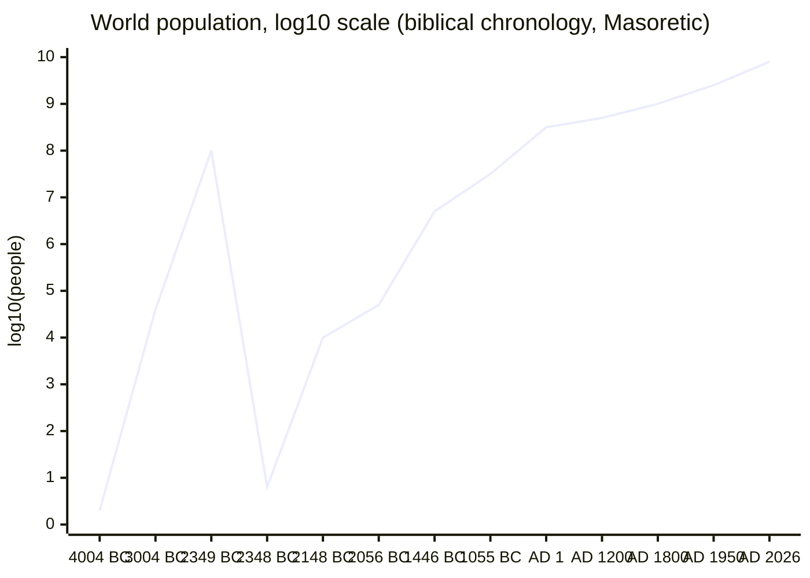
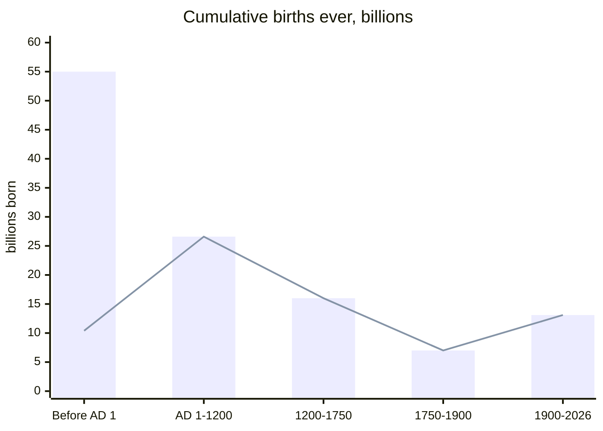

# What World Population Declares: Biblical Chronology and the Arithmetic of Growth

Eight people walked off the ark. Today there are 8.2 billion of us. Between those two numbers sits a
question with an arithmetic answer: what average growth rate gets you from one to the other in the
time the Bible's own genealogies allow, and is that rate anything a human population has ever
achieved?

**It is 0.481% per year — a doubling every 144 years.** Israel in Egypt, by Scripture's own figures,
grew five times faster. The world in the 1960s grew four times faster.

**In one sentence:** God blessed the human race with a command to fill the earth, re-issued it to
the eight who survived the Flood, and kept His word to Abraham in a people too many to count, and the
Bible's own chronology reaches today's 8.2 billion at a growth rate humanity has repeatedly exceeded.

It is a companion to [What Creation Declares](creation-reveals-the-creator.md), which argues from
design. This one argues from headcount.

## Key Takeaways

### Lessons about Jesus

God promised Abraham offspring "as the stars of heaven and as the sand that is on the seashore"
(Genesis 22:17, ESV). Paul reads the singular noun and finds one person in it: "It does not say,
'And to offsprings,' referring to many, but referring to one, 'And to your offspring,' who is
Christ" (Galatians 3:16, ESV). Then he reopens it — "if you are Christ's, then you are Abraham's
offspring, heirs according to promise" (Galatians 3:29, ESV). The promise narrows to one man, Jesus, and
widens through Him to everyone in Him. So you enter the promise to Abraham by belonging to Jesus
Christ: if you are His, you are Abraham's offspring and an heir. Scripture's last word on the census is John's sight of "a
great multitude that no one could number, from every nation, from all tribes and peoples and
languages" (Revelation 7:9, ESV) — the innumerability the dust-and-stars similes had been claiming
since Genesis 13, finally shown.

### Memory verses

> ✝️ [Genesis 9:1 (ESV)](https://www.blueletterbible.org/esv/Gen/9/1)
>
> 1 And God blessed Noah and his sons and said to them, "Be fruitful and multiply and fill the
> earth."

> ✝️ [Genesis 15:5 (ESV)](https://www.blueletterbible.org/esv/Gen/15/5)
>
> 5 And he brought him outside and said, "Look toward heaven, and number the stars, if you are able
> to number them." Then he said to him, "So shall your offspring be."

> ✝️ [Revelation 7:9 (ESV)](https://www.blueletterbible.org/esv/Rev/7/9)
>
> 9 After this I looked, and behold, a great multitude that no one could number, from every nation,
> from all tribes and peoples and languages, standing before the throne and before the Lamb,
> clothed in white robes, with palm branches in their hands,

### Be Transformed

- **Think.** Your existence is downstream of a command. Genesis 9:1 is an imperative, and every
  person now alive is part of its execution — you included, and the strangers whose numbers get
  discussed as a problem included. In Scripture, population is a blessing God pronounced and then
  commanded.
- **Attitude.** Babel's builders said "let us make a name for ourselves, lest we be dispersed over
  the face of the whole earth" (Genesis 11:4, ESV) — refusing the fill-the-earth command in order to
  concentrate and be famous. The instinct is still available: staying where it is safe and known,
  under a name we made, when God has said to go.
- **Do.** Read Genesis 5 and 11 out loud, whole, names and ages together. They are the least-read
  chapters in Genesis and the load-bearing ones for everything below — a chronology of real people,
  each of whom lived and fathered and died on a date.

### Prayer

Father, you spoke to two people in a garden and told them to fill the earth, and here we are —
8.2 billion of us, and every one made in your image. Thank you that you counted us a blessing. Forgive us for the Babel instinct, for building a name where you told us to go. You
promised Abraham descendants no one could count, and you kept it in a way he never saw: a multitude
out of every nation standing before your Son Jesus. Number me among them, and make me one who goes.
In Jesus' name. Amen.

## Study outline

- **Part one — what Scripture says.** The command to fill the earth from Genesis 1:28 to Noah, its
  vocabulary, Babel's refusal, the uncountable similes, and Israel in Egypt as the command reported
  fulfilled.
- **Part two — what the arithmetic says.** Two formulas, the chronology from creation to now, the
  shape of the growth curve, and whether the post-Flood span has room.
- **Part three — what follows.** How many people have ever lived, the same rate run over 200,000
  years, where the argument is weak, and what the headcount shows about God.

## Part one — what Scripture says

### Who wrote this, and to whom

Genesis and Exodus have been ascribed to Moses since antiquity, and the *ESV Study Bible*'s
introductions treat the Pentateuch as a single composition whose first audience was "Israel in the
wilderness (either the generation that left Egypt or their children)."

That detail matters more here than it usually does. The generation first hearing "be fruitful and
multiply and fill the earth" read back to them out of Genesis 9 was the generation counted at
603,550 fighting men in Numbers 1 — a nation that four centuries earlier had been an extended family
of seventy. The command's first readers were themselves the evidence that it worked. Exodus opens by
telling them so (Exodus 1:7), and Moses says it to their faces at Deuteronomy 10:22.

### The mandate, issued and re-issued

One formula carries the population theme through the Pentateuch, at three hinge points.

> ✝️ Genesis 1:28 (ESV)
>
> 28 And God blessed them. And God said to them, "Be fruitful and multiply and fill the earth and
> subdue it, and have dominion over the fish of the sea and over the birds of the heavens and over
> every living thing that moves on the earth."

That is the mandate to Adam and Eve, on day six, before any fall. It is re-issued to the eight
survivors of the Flood:

> ✝️ Genesis 9:1-7 (ESV)
>
> 1 And God blessed Noah and his sons and said to them, "Be fruitful and multiply and fill the
> earth. 2 The fear of you and the dread of you shall be upon every beast of the earth and upon
> every bird of the heavens, upon everything that creeps on the ground and all the fish of the sea.
> Into your hand they are delivered. 3 Every moving thing that lives shall be food for you. And as I
> gave you the green plants, I give you everything. 4 But you shall not eat flesh with its life,
> that is, its blood. 5 And for your lifeblood I will require a reckoning: from every beast I will
> require it and from man. From his fellow man I will require a reckoning for the life of man. 6
> "Whoever sheds the blood of man, by man shall his blood be shed, for God made man in his own
> image. 7 And you, be fruitful and multiply, increase greatly on the earth and multiply in it."

Genesis 9:1-7 is the covenant charter of the post-Flood world, spoken to the only humans alive. It
reissues Eden's food and dominion terms with two changes (meat is now permitted, blood withheld),
adds capital sanction for murder on the ground of the image of God, and brackets the whole block
with the multiply command, verse 1 opening it and verse 7 closing it. Then the narrator states the
demographic consequence:

> ✝️ Genesis 9:18-19 (ESV)
>
> 18 The sons of Noah who went forth from the ark were Shem, Ham, and Japheth. (Ham was the father
> of Canaan.) 19 These three were the sons of Noah, and from these the people of the whole earth
> were dispersed.

Every human being now alive descends from three men and their wives. Noah lived 350 years after the
Flood (Genesis 9:28) with no further children recorded, which puts the founding *reproducing*
population at six rather than eight — the figure every calculation in part two starts from.

This shows that God renewed His creation blessing after the judgment of the Flood, in the words He
first spoke in Eden, to the only people left alive. Every person you meet lives downstream of that
renewed blessing, and so do you.

### The vocabulary of the mandate

Four Hebrew verbs carry the command, and one of them does something the English translations cannot
show.

**Be fruitful.** <span dir="rtl">פָּרָה</span> (*parah*, H6509, TWOT root 1809) — "bear fruit, be
fruitful." Used of trees and vines as readily as of people; the metaphor is agricultural yield.

**Multiply.** <span dir="rtl">רָבָה</span> (*ravah*, H7235, TWOT root 2103) — "become many, become
great." The general Hebrew verb for increase in number.

**Fill.** <span dir="rtl">מָלֵא</span> (*male'*, H4390) — Genesis 1:28's "fill the earth," with
<span dir="rtl">אֶרֶץ</span> (*erets*, "land/earth") as its object.

**Swarm.** <span dir="rtl">שָׁרַץ</span> (*sharats*, H8317, TWOT root 2467) — "swarm, teem."
Genesis 9:7's third imperative, which the ESV renders "increase greatly on the earth." The verb
occurs fourteen times in the Hebrew Bible, and twelve describe animals: sea creatures teeming on day
five (Genesis 1:20, 1:21), the swarming creatures that die in the Flood (Genesis 7:21), the animals
released from the ark (Genesis 8:17), the frogs of the second plague (Exodus 8:3 [Hebrew 7:28];
Psalm 105:30), the swarming things ruled unclean (Leviticus 11:29, 41, 42, 43, 46), and the fish
that will fill the healed Dead Sea (Ezekiel 47:9).

The two exceptions are Genesis 9:7 and Exodus 1:7. God tells human beings to swarm exactly once, and
Scripture reports human beings swarming exactly once — the command and its fulfilment, in a word
otherwise reserved for locust-scale animal abundance.

This shows that God wants His image-bearers in abundance. He commands it with the verb of teeming
life, and He records Himself answered in the same word. You are part of that abundance.

### Babel: declining the command

Genesis 11:1-9 has humanity refusing the third verb. "Come, let us build ourselves a city and a
tower with its top in the heavens, and let us make a name for ourselves, lest we be dispersed over
the face of the whole earth" (Genesis 11:4, ESV) — the stated motive is to avoid dispersal. God
disperses them anyway (11:8-9).

Genesis 10, placed before it, lists the resulting nations out of sequence; the *NIV Biblical Theology
Study Bible* notes at 10:32 that the spreading out "does not happen until after the tower of Babel
incident (11:1-9), so this verse does not follow chronological order." Those seventy names, and the
sixteen grandsons behind them, become the demographic evidence in part two.

### "As numerous as": what the similes claim

From Abraham onward the promise gets three standard comparisons, and none of them is a number.

> ✝️ Genesis 13:16 (ESV)
>
> 16 I will make your offspring as the dust of the earth, so that if one can count the dust of the
> earth, your offspring also can be counted.

> ✝️ Genesis 15:5 (ESV)
>
> 5 And he brought him outside and said, "Look toward heaven, and number the stars, if you are able
> to number them." Then he said to him, "So shall your offspring be."

> ✝️ Genesis 22:17 (ESV)
>
> 17 I will surely bless you, and I will surely multiply your offspring as the stars of heaven and
> as the sand that is on the seashore. And your offspring shall possess the gate of his enemies,

Genesis 13:16 and 15:5 both state the point as an impossibility of counting rather than a quantity —
*if* you can count the dust, *if* you are able to number the stars. Jeremiah makes the logic explicit
and applies it to David's line: "As the host of heaven cannot be numbered and the sands of the sea
cannot be measured, so I will multiply the offspring of David my servant" (Jeremiah 33:22, ESV).
Read as a target figure — 10<sup>22</sup> stars, therefore 10<sup>22</sup> descendants — the similes
are being asked for something they withhold. Their claim is that the count will exceed counting.

Hebrews 11:12 (ESV) makes it a statement about one dead man's
faith: "from one man, and him as good as dead, were born descendants as many as the stars of heaven
and as many as the innumerable grains of sand by the seashore."

### Egypt: the command reported fulfilled

The Bible gives a starting population, an ending population, and an elapsed time in one place only.

> ✝️ Genesis 46:26-27 (ESV)
>
> 26 All the persons belonging to Jacob who came into Egypt, who were his own descendants, not
> including Jacob's sons' wives, were sixty-six persons in all. 27 And the sons of Joseph, who were
> born to him in Egypt, were two. All the persons of the house of Jacob who came into Egypt were
> seventy.

#### Exodus 1:7: the mandate quoted back

Four centuries later, Exodus opens by reporting the mandate discharged, in a single verse that
stacks the vocabulary of both earlier commands:

> ✝️ Exodus 1:7 (ESV)
>
> 7 But the people of Israel were fruitful and increased greatly; they multiplied and grew
> exceedingly strong, so that the land was filled with them.

Five Hebrew verbs in one sentence: *parah*, *sharats*, *ravah*, then
<span dir="rtl">עָצֹם</span> (*atsom*, H6105, "be mighty, be numerous" — MACULA glosses the form
"they.became.mighty"), then *male'* with *erets*. Four of the five come straight out of Genesis 1:28
and 9:1-7. The narrator is quoting the mandate and ticking it off.

The fifth verb is the one that turns numbers into politics. The next verse has a new king who "did
not know Joseph," and by verse 12, "the more they were oppressed, the more they multiplied and the
more they spread abroad" (Exodus 1:12, ESV).

The *ESV Study Bible*'s note on Exodus 1:7 identifies the parallel independently: the growth
vocabulary here "parallels that of God's command to mankind at creation (Gen. 1:28)." The *NIV
Biblical Theology Study Bible* supplies the middle link, reading the verse as the point at which the
creation mandate, "reiterated to Noah after the flood (Gen 9:1, 7)," is being realized.

#### The census: seventy in, two million out

> ✝️ Exodus 12:37-41 (ESV)
>
> 37 And the people of Israel journeyed from Rameses to Succoth, about six hundred thousand men on
> foot, besides women and children. 38 A mixed multitude also went up with them, and very much
> livestock, both flocks and herds. 39 And they baked unleavened cakes of the dough that they had
> brought out of Egypt, for it was not leavened, because they were thrust out of Egypt and could not
> wait, nor had they prepared any provisions for themselves. 40 The time that the people of Israel
> lived in Egypt was 430 years. 41 At the end of 430 years, on that very day, all the hosts of the
> LORD went out from the land of Egypt.

Seventy in, roughly two million out, 430 years between. The two-million figure is the standard
inference from the 603,550 men aged twenty and up counted at the first wilderness census (Numbers
1:46); the *ESV Study Bible* draws it at Exodus 12:37 and again at Numbers 1:20-46, and states the
census's purpose as demonstrating "the fulfillment of the promise to Abraham that his descendants
would be as numerous as the sand on the seashore (Gen. 22:17)." Moses preaches the same arithmetic:
"Your fathers went down to Egypt seventy persons, and now the LORD your God has made you as numerous
as the stars of heaven" (Deuteronomy 10:22, ESV).

This shows that God keeps His covenant promises inside dated, countable history. He swore to
Abraham, and four centuries later Moses could point at the crowd in front of him. So you can trust a
promise of His whose fulfilment you have not yet seen.

#### The rate the census implies

**The rate.** Continuous exponential growth solves for *r*, the annual rate:

```text
    r = ln(N / N₀) / t

      = ln(2,000,000 / 70) / 430
      = ln(28,571) / 430
      = 10.260 / 430
      = 0.0239  →  2.39% per year

    doubling time = ln 2 / r = 0.693 / 0.0239 = 29 years
```

| Reading | Start | End | Years | Rate | Doubling |
|---|---|---|---|---|---|
| Masoretic Exodus 12:40, face-value census | 70 | 2,000,000 | 430 | **2.39%/yr** | 29 yrs |
| LXX/Samaritan sojourn, face-value census | 70 | 2,000,000 | 215 | **4.77%/yr** | 15 yrs |
| Masoretic sojourn, low census reading | 70 | 20,000 | 430 | **1.32%/yr** | 53 yrs |

#### Three caveats to the rate

**The sojourn length is textually disputed.** The Masoretic Text of Exodus 12:40 reads 430 years in
Egypt. The Septuagint and the Samaritan Pentateuch add "and in Canaan," halving the Egyptian stay to
about 215 years — the *CSB Ancient Faith Study Bible* and the NLT's textual notes both carry the
variant. Paul appears to follow the shorter reckoning: the law came "430 years afterward" from the
promise to Abraham, not from the descent into Egypt (Galatians 3:17, ESV). The shorter reading
doubles the required rate.

**The head-count is disputed too.** The *ESV Study Bible*'s Introduction to Numbers devotes a
section to "The Large Numbers in the Pentateuch," listing three objections — wilderness logistics,
archaeological population estimates for Canaan, and internal ratios such as 27 adult males per
firstborn male — and four proposed solutions: face value, a later date, scribal misreading of
<span dir="rtl">אֶלֶף</span> (*'elep*, which can mean "thousand," "group," or "clan"), and symbolic
numbers. Its summary: since these claim to be census figures, "the natural presupposition is that
they are to be taken at face value," while conceding "there is no obvious solution to the problems
posed by these census figures." The *NIV Biblical Theology Study Bible* is blunter at Exodus 12:37 —
600,000 "seems excessively large," with no consensus. The *'elep* proposals yield totals around
20,000, 72,000 or 140,000; the low row above uses the smallest.

**Seventy or seventy-five.** Genesis 46:27 and Exodus 1:5 read seventy; Stephen, following the
Septuagint, says seventy-five (Acts 7:14). Because the starting population sits inside a logarithm,
a 7% difference there moves the computed rate by 0.016 percentage points.

Every reading in that table clears 1.3%/yr, and the whole post-Flood span needs less than half of it.

### What carries over

The mandate and the census sit on opposite sides of the then-and-now line, and the study leans on
each differently.

**Genesis 9:1 reaches everyone.** It is addressed to the only human beings alive, grounded in the
image of God rather than in a covenant with one nation (9:6), issued before Israel exists, and never
rescinded.

**Numbers 1 does not.** That census musters men "from twenty years old and upward, all in Israel who
are able to go to war" (Numbers 1:3, ESV), for a specific nation, under a land promise, ahead of a
particular conquest. It is covenant bookkeeping. A
modern reader inherits Genesis 9:1 directly; Numbers 1 he inherits as evidence that God keeps
promises, which is exactly the use the ESV Study Bible's own note makes of it.

## Part two — what the arithmetic says

### Two formulas, once

```text
  GROWTH        N(t) = N₀ · e^(r·t)          population after t years
                r    = ln(N / N₀) / t        the rate a known span requires
                T₂   = ln 2 / r              doubling time

  BIRTHS        B    = b · (N₁ − N₀) / r     cumulative births over a span,
                                              b = crude birth rate per person per year
```

The births formula is the integral of *b·N(t)* across the span, the method the Population Reference
Bureau uses for its "how many people have ever lived" estimates, so part three's comparison against
their figure is like-for-like.

The headline number falls straight out of the first:

```text
    r = ln(8,200,000,000 / 6) / 4,374        6 survivors, Flood 2348 BC → AD 2026
      = ln(1,366,666,667) / 4,374
      = 21.036 / 4,374
      = 0.004809  →  0.481% per year

    T₂ = 0.693 / 0.004809 = 144 years
```

### The chronology

Dates use this site's Zadok-year convention — year 0 is Adam's creation, and
`zadok_year = gregorian_year + 4004`, so the Flood at Zadok 1656 is 2348 BC. See
[The Zadok Calendar](../feasts/zadok-calendar.md) for the calendar and
[Genealogy and Times](../last-things/genealogy-times.md) for how the Genesis 5 and 11 figures were
read out of the Masoretic Text, Septuagint and Samaritan Pentateuch and turned into these years.

Population anchors, each given as a Zadok year (AM, from creation) beside its Gregorian date.



David's figure comes from Joab's census: "in Israel there were 800,000 valiant men who drew the
sword, and the men of Judah were 500,000" (2 Samuel 24:9, ESV). The parallel at 1 Chronicles 21:5
gives 1,100,000 and 470,000 — the two texts disagree by about 20%, which is a caution against
leaning on either, and the timeline uses the smaller.

Three date questions are open. None of them changes the argument.

**The Flood's date is not settled even inside this repo.**
[Genealogy and Times](../last-things/genealogy-times.md) compares four reconstructions. Running
`r = ln(8.2×10⁹ / 6) / t` against each:

| Reconstruction | Flood | Years to AD 2026 | Required rate | Doubling |
|---|---|---|---|---|
| Masoretic (Ussher) — this site's `zadok_year` base | 2348 BC | 4,374 | 0.481%/yr | 144 yrs |
| `harmonized_v1` (MT with one Samaritan reading) | 2288 BC | 4,314 | 0.488%/yr | 142 yrs |
| Samaritan Pentateuch | 2998 BC | 5,024 | 0.419%/yr | 166 yrs |
| Septuagint | 3228 BC | 5,254 | 0.400%/yr | 173 yrs |

An 880-year spread between the extreme readings moves the required rate by eight hundredths of a
percentage point. The manuscript dispute is chronologically large and demographically negligible.

**Peleg's birth carries two years of slack.** Genesis 11:10 puts Arpachshad's birth "two years after
the flood," while Genesis 5:32 has Noah at 500 when his sons are born; this repo's generated
chronology chains from the 500, so Peleg's birth falls 99 or 101 years post-Flood.

**Babel is a range.** Genesis 10:25 says only that the earth was divided "in his days," and Peleg
lived 239 years — so anywhere from 2247 to 2008 BC. The *ESV Study Bible*'s map caption dates the
Table of Nations to c. 2200 BC. The model below places the dispersion at roughly 200 years
post-Flood (c. 2148 BC), inside that window.

### The shape of the curve

The 0.481% average constrains the curve; it does not describe it. A *constant* 0.481% from six
people gives:

```text
    N = 6 · e^(0.004809 × 2,348)     2348 BC → AD 1
      = 6 · e^11.29
      = 480,000 people worldwide at the birth of Christ
```

The Han census of AD 2 registered 57,671,400 people in China alone — 120 times that, in one country.
A single smooth exponential from the ark to the present is off by two orders of magnitude at the
midpoint.

The real curve is steep at the front, nearly flat through the middle, steep again at the end.
Plotted on a log scale, because a linear axis showing 8 billion cannot also show six — the x-axis is
by event, not to scale:



#### Before the Flood: a modeled 100 million

**Before the Flood.** Scripture gives no antediluvian population, so this stretch is a model output.
At 1.07%/yr over the 1,656 years from Adam to Noah's six hundredth year:

```text
    N = 2 · e^(0.0107 × 1,656) = 2 · e^17.72 = 99 million
```

The band is wide — 1.0%/yr gives 31 million, 1.2%/yr gives 854 million. What the text supplies is
direction rather than magnitude: "man began to multiply on the face of the land" (Genesis 6:1, ESV),
and an earth filled with violence, which fits a populous world.

#### The front end: Genesis 10's grandsons imply a 5.6%/yr rate

**The front end, and why it must be fast.** Genesis supplies its own evidence here. Genesis 10 names
sixteen grandsons of Noah across three couples: seven from Japheth (10:2), four from Ham (10:6),
five from Shem (10:22).

```text
    16 grandsons / 3 couples = 5.3 sons per couple
    assuming daughters in comparable numbers ≈ 10.7 children per couple
    r = ln(10.7 / 2) / 30 = 1.674 / 30 = 0.0558  →  5.6% per year at a 30-year generation
```

That is twelve times the long-run average the whole post-Flood span needs. The seventy names check
out as well: Japheth's line yields 14 (7 sons, 3 sons of Gomer, 4 sons of Javan), Ham's 30 (4 sons,
5 sons of Cush, 2 sons of Raamah, Nimrod, 7 sons of Mizraim, 11 of Canaan), Shem's 26 (5 sons, 4
sons of Aram, Shelah, Eber, 2 sons of Eber, 13 sons of Joktan) — the traditional seventy, recoverable
straight from the text.

Seventy clans also have to be viable when they scatter:

| Years post-Flood | At 4%/yr | At 5%/yr | People per clan (70 clans, 5%) |
|---|---|---|---|
| 100 | 328 | 890 | 13 |
| 150 | 2,421 | 10,848 | 155 |
| 200 | 17,886 | 132,159 | 1,888 |
| 250 | 132,159 | 1,610,024 | 23,000 |

At 100 years post-Flood, around Peleg's birth, seventy independent groups would average a dozen
people each — below what an isolated founding population sustains. The defensible floor for the
dispersion is 150 to 200 years after the Flood, where the ESV Study Bible's c. 2200 BC placement also
lands. The model uses 200 years and 10,000 people, requiring `ln(10,000/6) / 200 = 3.71%/yr` — under
what Genesis 10's own family sizes imply.

#### The flat middle: a 2,240-year doubling time

**The flat middle.** From Christ to the eve of the industrial era the curve nearly stops:

```text
    r = ln(500,000,000 / 300,000,000) / 1,650      AD 1 → AD 1650
      = 0.511 / 1,650
      = 0.00031  →  0.031% per year

    T₂ = 0.693 / 0.00031 = 2,240 years
```

A doubling time of twenty-two centuries is what the Justinianic plague, the Black Death and the
Thirty Years' War actually produced. The model needs those centuries rather than having to explain
them away.

### Does the chronology have room?

Post-Flood benchmarks, each rate computed over the span since the previous row:

| Anchor | Zadok / Gregorian | Population | Rate over preceding span |
|---|---|---|---|
| Flood | 1656 / 2348 BC | 6 | — |
| Babel | ~1856 / ~2148 BC | 10,000 | 3.71%/yr |
| Abraham born | 1948 / 2056 BC | 50,000 | 1.75%/yr |
| Exodus | 2558 / 1446 BC | 5,000,000 | 0.75%/yr |
| David | 2949 / 1055 BC | 30,000,000 | 0.46%/yr |
| Christ | 4004 / AD 1 | 300,000,000 | 0.22%/yr |
| — | 5204 / AD 1200 | 450,000,000 | 0.034%/yr |
| — | 5654 / AD 1650 | 500,000,000 | 0.023%/yr |
| — | 5854 / AD 1850 | 1,265,000,000 | 0.46%/yr |
| — | 5954 / AD 1950 | 2,499,000,000 | 0.68%/yr |
| Now | 6030 / AD 2026 | 8,200,000,000 | 1.56%/yr |

From Abraham forward these are the standard historical estimates, not outputs of the model: the
Population Reference Bureau's benchmark series, cross-checked against the ranges in the
historical-estimates literature. The model's claim on that stretch is only that the biblical chronology has room
to reach them. Measured from six people at the Flood in each case:

| Target | Span from 2348 BC | Required rate | Working |
|---|---|---|---|
| 5 million by the Exodus (1446 BC) | 902 years | 1.51%/yr | ln(5,000,000/6) / 902 = 13.63 / 902 |
| 30 million by David (1055 BC) | 1,293 years | 1.19%/yr | ln(30,000,000/6) / 1,293 = 15.42 / 1,293 |
| 300 million by Christ (AD 1) | 2,349 years | 0.75%/yr | ln(300,000,000/6) / 2,349 = 17.73 / 2,349 |
| 8.2 billion by AD 2026 | 4,374 years | 0.481%/yr | ln(8,200,000,000/6) / 4,374 = 21.04 / 4,374 |

Every one of those sits below the 2.39%/yr Scripture's own Egyptian episode records, and below the
world's observed peak of roughly 2.1% in the 1960s. At the Egyptian rate, six people reach 8.2
billion in `ln(1,366,666,667) / 0.0239 = 880 years` — the biblical chronology has more than four
times the span it needs.

## Part three — what follows

### How many people have ever lived

Cumulative births are the larger question, and the births formula from part two answers it. The Population Reference Bureau has run that calculation since 1995; the 2022 update by
Carl Haub and Toshiko Kaneda gives **117 billion people ever born**, of whom the 8 billion then alive
were 6.8%.

Their assumptions are stated: modern *Homo sapiens* from 190,000 BCE, and a birth rate of 80 per
1,000 held constant through AD 1.

Run the identical arithmetic on a biblical chronology, keeping the same formula, the same birth
rates, and from AD 1 onward PRB's own benchmark figures unchanged. Both columns below are carried to
AD 2026, which is why the total differs slightly from PRB's published 2022 figure:

| Era | PRB (190,000 years) | Biblical model (6,030 years) |
|---|---|---|
| Before AD 1 | 55.0 billion | 10.4 billion |
| AD 1 to present | 62.6 billion | 62.6 billion |
| **Total ever born** | **~118 billion** | **~73 billion** |
| Share alive today (8.2 bn) | 7.0% | 11.2% |



(Bars: PRB's deep-time model. Line: the biblical chronology. The two coincide from AD 1 onward by
construction — only the pre-Christian block differs, and it differs by 45 billion.)

The antediluvian world is the one term Scripture leaves open. Applying the births formula across the
same 1.0-1.2%/yr band:

```text
    B = 0.025 · (N₁ − N₀) / r

    at 1.0%/yr:   0.025 × 31,113,337 / 0.010  =    78 million births
    at 1.2%/yr:   0.025 × 853,748,471 / 0.012 = 1,780 million births
```

Somewhere between 78 million and 1.8 billion people lived and died before the Flood — enough to
matter morally, and not enough to move a 73-billion total by more than a few percent.

**Compressing human history from 190,000 years to 6,030 removes 184,000 years and about 45 billion
births** — a third of the total, where the ratio of timespans would suggest 99%. Deep time is
demographically cheap. Births are generated by *population*, not by *duration*, and a world of five
million hunter-gatherers produces very few of them however long it runs. PRB's own table says so:
their entire 190,000 BCE to 8000 BCE block, 96% of assumed human existence, contributes 7.7% of all
births ever.

### Running the clock backwards

The demographic argument is strongest in reverse. Take the rate the biblical chronology needs,
0.481%/yr, a doubling every century and a half, and run it over the timespan conventional prehistory
assumes:

```text
    log₁₀ N = log₁₀ 2 + (r · t) / ln 10
            = 0.301 + (0.004809 × 200,000) / 2.303
            = 0.301 + 417.7
            = 418        →  10^418 people
```

For scale: the observable universe contains roughly 10<sup>80</sup> atoms, and packed at the density
of human bodies it would hold about 10<sup>82</sup> people. The population figure exceeds that by 336
orders of magnitude. Extend the same rate over a million years and the exponent passes 2,000.

Conventional demography has an answer to this reductio.

**The mainstream reply.** Population growth was near zero for most of human history, held there by a
Malthusian ceiling — hunter-gatherer subsistence supports perhaps five to ten million people
worldwide, and any surplus is removed by famine, disease and infant mortality. On that model:

```text
    r = ln(8,200,000,000 / 2) / 200,000 = 22.13 / 200,000
      = 0.000111  →  0.011% per year,  doubling every 6,263 years
```

So the comparison is between two shapes:

| | Biblical chronology | Deep-time chronology |
|---|---|---|
| Span from 2 (or 6) people to 8.2 billion | ~4,400 years | ~200,000 years |
| Required average rate | 0.481%/yr | 0.011%/yr |
| Doubling time | 144 years | 6,263 years |
| Against rates humans are observed to achieve | 1/5 of Israel's in Egypt; 1/4 of the 1960s peak | 1/200 of either |
| What has to be explained | Why growth was near-zero for 1,600 of the 4,400 years | Why growth was near-zero for 97% of the span and then was not |

The biblical model needs no rate humanity has not demonstrably achieved, and its flat stretch
(AD 1-1650) is documented history. The deep-time model needs 190,000 years of near-perfect stasis
followed by a two-order-of-magnitude change, and locates that change at the agricultural revolution
roughly 10,000 years ago — a real mechanism, carrying a considerable amount of the model's weight on
a single unobserved event.

Which shape you find simpler is a judgement, not a calculation.

### Where this argument is weak

Three things to hold against everything above.

#### The benchmarks' only claim: headroom

**The benchmarks from Abraham onward are fitted.** The model is told that the world held 300 million
people at AD 1 because the historical estimates say so; it derives nothing. Its claim is *headroom*, and headroom only:
that the biblical chronology can reach known benchmarks at rates humans have achieved.

#### Archaeology and the king lists

**Archaeology and king lists are the real friction.** Egyptian dynastic records, Mesopotamian king
lists, dendrochronology and varve sequences show continuous occupation through the window a global
Flood at 2348 BC and a dispersion at 2148 BC would need. Population arithmetic leaves those objections
untouched. They are weighed, with the archaeology of Babel, in a separate study in preparation, *The
Flood and the King Lists*.

#### Consistency is the argument's ceiling

**The argument does not prove a young earth.** It shows that a 6,000-year chronology requires no
demographic special pleading — no rate humanity has not achieved, no unexplained gap. Consistency is
weaker than proof, and the deep-time model is internally consistent too, at a different cost.

### What population declares

Romans 1:20 says creation makes God's eternal power perceptible through what has been made. The usual
exhibits are the cell and the night sky. Genesis offers another: the crowd.

The first thing God said to human beings was a blessing in the form of a command — be fruitful,
multiply, fill. Scripture then reports it happening, in the vocabulary of swarming abundance
otherwise reserved for shoals of fish and plagues of frogs, and treats the resulting headcount as
evidence that God keeps promises: seventy went down to Egypt, and "now the LORD your God has made you
as numerous as the stars of heaven" (Deuteronomy 10:22, ESV). Paul tells the Athenians the same about
everyone else — God "made from one man every nation of mankind to live on all the face of the earth,
having determined allotted periods and the boundaries of their dwelling place" (Acts 17:26, ESV).

Eight point two billion people are alive as this is written, and roughly seventy-three billion have
lived. Every one of them descends from three brothers who walked off a boat, and behind them from one
man and one woman who were told to fill the earth. The arithmetic that gets from six people to eight
billion in four and a half thousand years is unremarkable — half a percent a year, which the world
has exceeded in every decade since 1900. To account for the population of the earth, the Bible's
chronology needs a command and a few thousand ordinary years.

This shows that God is the Creator who spoke the first blessing over humanity and has kept it in
every generation since. The arithmetic establishes consistency, which is weaker than proof, and the
deep-time model is consistent too; what the headcount displays plainly is His faithfulness to His
word. So when you look at the crowd, you are looking at a promise kept, and you stand inside it.

## Discussion questions

1. Genesis 9:7 commands human beings to *swarm* — a word Scripture otherwise uses of fish, frogs and
   creeping things. What does it say about God's view of human abundance that He chose that verb, and
   how does it sit against the way population is usually discussed now?
2. Babel's builders wanted a name and a single location; God wanted the earth filled. Where does that
   tension show up in a church, a family, or a career?
3. Genesis 13:16 and 15:5 state the promise as an inability to count rather than a quantity. What is
   lost if those similes are read as a number instead?
4. The ESV Study Bible concludes there is "no obvious solution" to the census figures in Numbers.
   How should a reader hold a biblical number that careful scholars cannot agree how to read?
5. Roughly 11% of everyone ever born (on the model above) is alive right now. Does that change
   anything about how you think of the present moment in the history God is running?

## References & Recommended Reading

- **ESV Bible** (Crossway) — primary translation quoted throughout; every quotation verified against
  `study-notes.db`.
- ***ESV Study Bible*** (Crossway) — introductions to Genesis and Exodus (authorship, and the
  Pentateuch's first audience as Israel in the wilderness); notes on Exodus 1:7 (the Genesis 1:28
  vocabulary parallel), Exodus 12:37, Numbers 1:1-46 and 1:20-46 (the census as fulfilment of Genesis
  22:17; the ~2 million total), Genesis 9:18-19, Genesis 10:1-32 and 10:21-32 (Peleg and "divided"),
  Genesis 11:1-9 (the Table of Nations dated c. 2200 BC; the ziggurat background), and "The Large
  Numbers in the Pentateuch" in the Introduction to Numbers.
- ***NIV Biblical Theology Study Bible*** (Zondervan) — notes on Exodus 1:7 (the Genesis 1:28 →
  9:1,7 → Exodus 1:7 chain and the Abrahamic promise links), Exodus 12:37 and 12:40, Genesis 10:25
  and 10:32.
- ***CSB Ancient Faith Study Bible*** (Holman) and the ***NLT Life Application Study Bible***
  (Tyndale) — textual notes at Exodus 12:40 recording the Septuagint and Samaritan Pentateuch's
  "and in Canaan."
- **MACULA Hebrew Linguistic Datasets** (WLC, Clear Bible, CC BY 4.0) — morphology for Genesis 9:7
  and Exodus 1:7, and the exhaustive occurrence list for *sharats* (H8317) behind the
  fourteen-occurrences finding.
- ***Theological Wordbook of the Old Testament*** (Harris, Archer & Waltke, Moody) — root numbers and
  glosses for *parah* (H6509, root 1809), *ravah* (H7235, root 2103) and *sharats* (H8317, root 2467).
- **Westminster Leningrad Codex**, **Brenton Septuagint** and the **Samaritan Pentateuch**, via this
  repo's `references/build/bible-text.db` — the Genesis 5 and 11 chronological figures and the
  three-way manuscript comparison.
- **Carl Haub & Toshiko Kaneda, "How Many People Have Ever Lived on Earth?"** (Population Reference
  Bureau, 2022 update) — benchmark populations, crude birth rates per 1,000, and cumulative births by
  period; the 117-billion total and its 190,000 BCE starting assumption. The births formula used
  throughout part three is theirs.
- **"Estimates of historical world population"** (Wikipedia, compiling McEvedy & Jones, the UN
  *World Population Prospects*, and the US Census Bureau series) — used to bound the benchmark
  populations against the published ranges.
- **Han dynasty census of AD 2** — 57,671,400 individuals across 12,366,470 households, the earliest
  nationwide census on record and the check that breaks the constant-rate model.
- [Genealogy and Times](../last-things/genealogy-times.md) and
  [The Zadok Calendar](../feasts/zadok-calendar.md) on this site — the chronology and calendar
  conventions these dates depend on, including the four Flood-date reconstructions.
- [What Creation Declares](creation-reveals-the-creator.md) — the companion study, arguing the same
  conclusion from design rather than demography.
