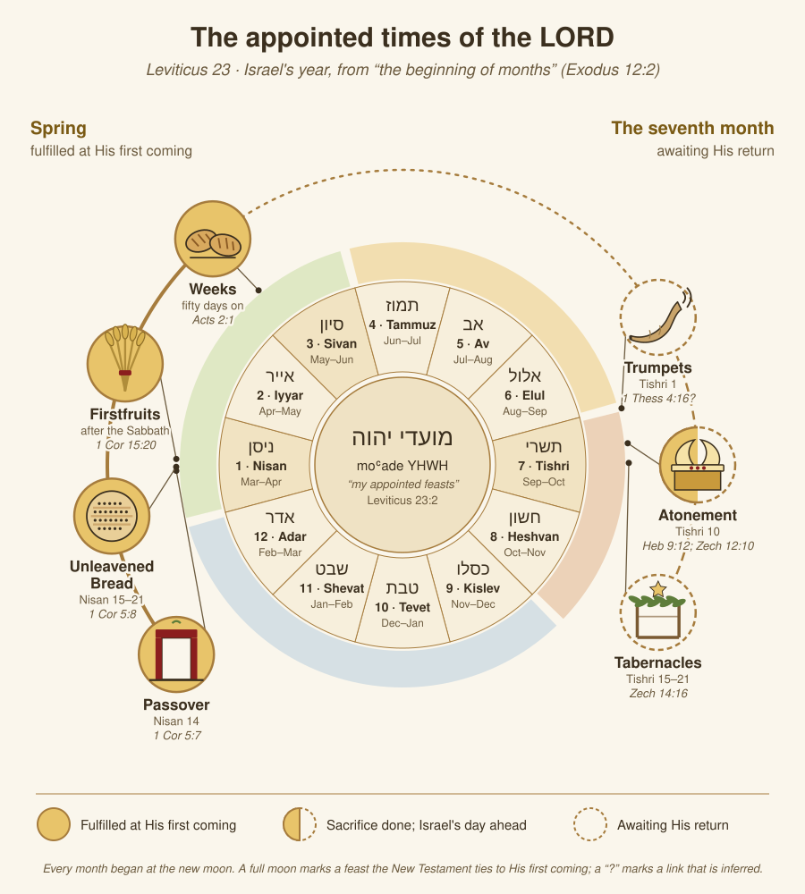
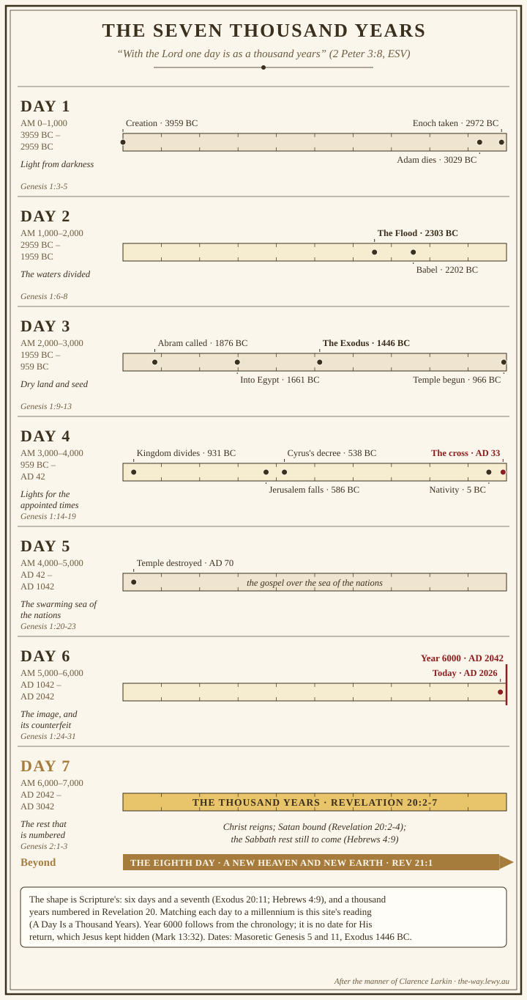
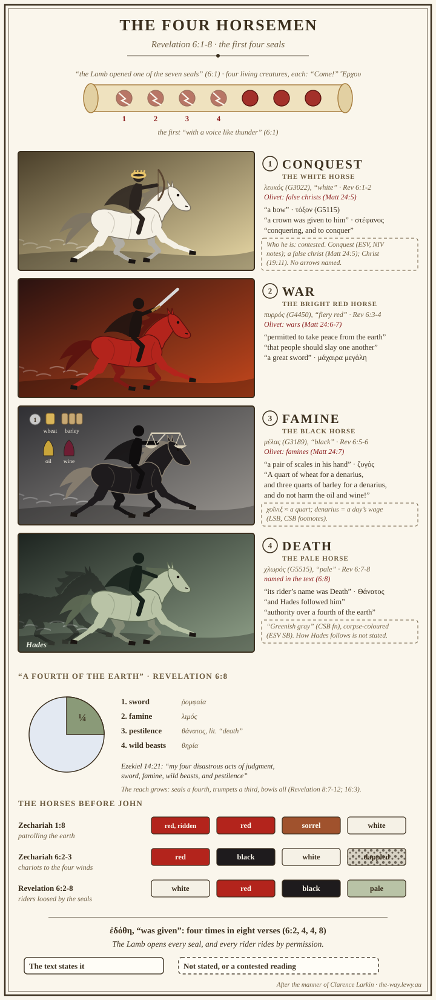
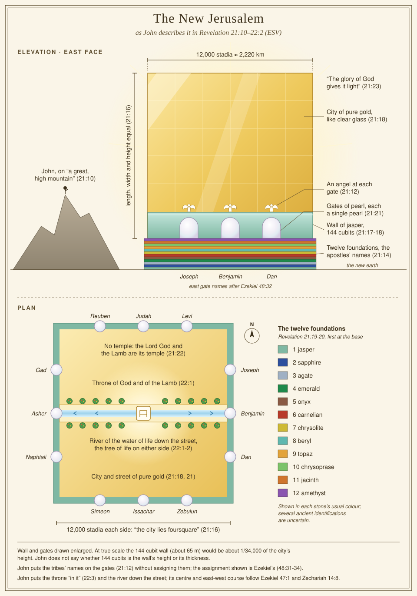
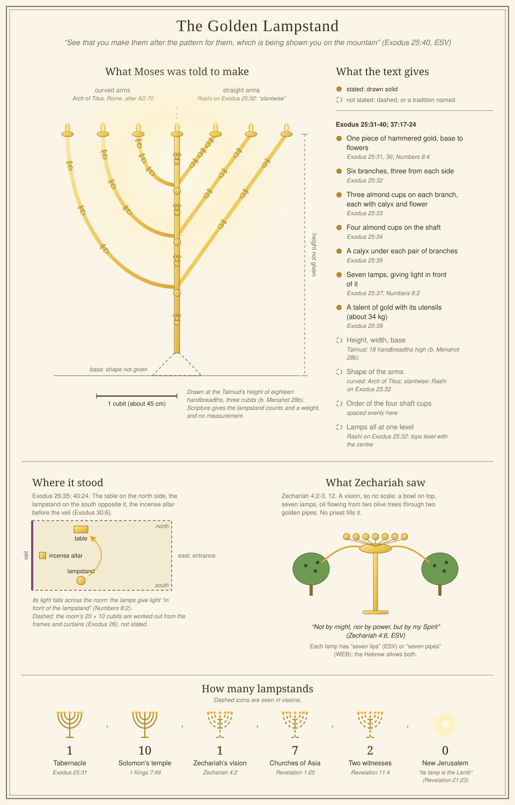
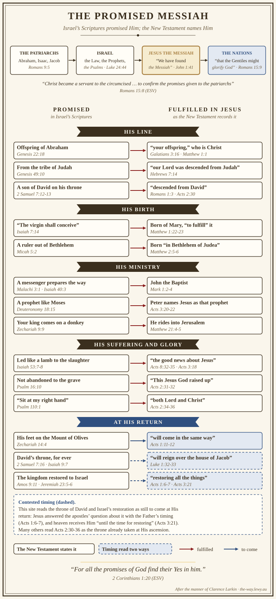

<link rel="stylesheet" href="assets/stylesheets/hero-verses.css" />

# The Way

{ .way-banner }

> ✝️ Isaiah 30:21 (ESV)
>
> And your ears shall hear a word behind you, saying, "This is the way, walk in it."

<!-- -->

> ✝️ John 14:6 (ESV)
>
> I am the way, and the truth, and the life. No one comes to the Father except through me.

Isaiah told Israel to walk in the way seven centuries before Bethlehem. When Jesus claimed to *be*
that way, He was fulfilling what the Old Testament had foreshadowed of the Messiah.

Jesus' earliest followers heard it that way too: before anyone called them Christians,
they called themselves the Way — Greek **ὁδός** (*hodos*, G3598), the
ordinary word for a road (Acts 9:2). That's this site's name, and its subject.

See the [full word study](jesus/the-way.md) for how it traces from Isaiah's "way of the LORD"
through John 14:6 and into the book of Acts.

## What these studies cover

<!-- subject-wheel -->

These are personal Bible study notes — written to make sure I learn, and shared in case they help
someone else. The Bible is one integrated message about God's dealings with humanity, and it repays
close study. I hope that study moves me from milk to solid food (Hebrews 5:12-14).

They are personal study notes, so test them. Question and check what you read here, as the Bereans
did (Acts 17:11).

The studies have a focus on:

- Building practical knowledge and wisdom of God. Each study asks first [what it teaches about Jesus](about/key-takeaways.md), then how that changes the way I think, my attitude and what I do.
- Understanding faith in God as described in the Old and New Testaments of the Bible, in order to be prepared to explain the truth in love.
- Exegetical and expository [original-language studies](about/about-our-datasets.md). That is using source texts to elicit meaning sometimes lost in just one or more English translations.
- Bible end times. Scripture says we are in the last days, and it matters to know where we stand with God before hard days arrive.
- Starting the journey of [learning biblical Hebrew](resources/hebrew-learning-resources.md).
- Answering little [side quests](god/world-population-declares-gods-creation-and-biblical-truth.md) that come up.
- Keeping a [tidy house](about/our-taxonomy.md).

??? note "On using AI in these studies"

    One of the tools I use in the development of these studies is AI. That may well put you off: how
    can AI be of use when it is trained on all the wisdom of man? True. Its biggest gift to me is the
    original languages. I am not trained in Hebrew, Aramaic or Greek, yet with AI I can work through a
    passage word by word: its grammar, its root, where else the word is used, and how the Septuagint
    and the English translations render it. That depth of
    [original-language study](about/why-ai-assisted-study.md#what-it-does) would otherwise be out of my
    reach. The models also question some of the positions I take, and that sends me back to Scripture
    to test them, the same Berean check I ask of you, "examining the Scriptures daily to see if these
    things were so" (Acts 17:11, ESV). A challenge shows where a case is weak, and Scripture tells me
    to test what I hold (Proverbs 18:17; 1 Thessalonians 5:21). In doing that, I learn, and train my
    mind and heart to defend the truth of Christ.

    AI also makes mistakes. It can invent a word's meaning, misquote a verse, or cite a book that does
    not exist (see [failure modes and guardrails](about/why-ai-assisted-study.md#failure-modes-and-guardrails)).
    So the AI works inside [deterministic tooling](about/why-ai-assisted-study.md#how-it-works-under-the-hood):
    databases of the Hebrew and Greek text, lexicons and cross-references that give the same answer
    every time they are asked. A word study has to resolve to an entry in that data, and a quotation is
    checked against the translation's own text, never recalled from memory. Some AI terminology does
    slip through, and it annoys me too. By publishing, I am accountable to review these studies
    (2 Timothy 2:15), remember what I learned, fix errors I did not pick up earlier, and refine a
    position left with an itch.

## The gospel

All of these studies point to the one core truth of Jesus and the way.

You are made by God, and He loves you. But every one of us has sinned and fallen short of who He made
us to be (Romans 3:23), and that sin separates
us from Him and earns us death (Romans 6:23).

God did not leave it there. He sent His own Son, Jesus Christ, to live the sinless life none of us
could live, to die on the cross carrying the punishment for our sin, and to rise bodily from the
grave three days later, defeating death itself
(1 Corinthians 15:3-4).

You do not earn this by being good enough. It is a gift, received by grace through faith in Christ
alone (Ephesians 2:8-9). Whoever calls on the
name of the Lord will be saved (Romans 10:13). That includes you, today.

See my full [Statement of Faith](about/statement-of-faith.md) for how this fits together.

## Why I believe

Faith in Christ rests on evidence that can be examined. Here is what convinces me.

-   :material-earth:{ .lg .middle } __Creation testifies__

    ---

    The order, fine-tuning, and existence of the universe point to a Creator: "the heavens declare the glory of God" (Psalm 19:1, ESV), and what can be known of God is plain from what He made (Romans 1:20). See how I understand the [creation account itself](about/statement-of-faith.md#creation).

-   :material-shovel:{ .lg .middle } __Archaeology testifies__

    ---

    Discoveries in the ground keep confirming the biblical record. See [Ancient Texts, Manuscripts, and Inscriptions Validating Scripture](scripture/ancient-texts-manuscripts.md) for specific examples, the Dead Sea Scrolls among them.

-   :material-script-text-outline:{ .lg .middle } __The documents themselves testify__

    ---

    The Bible is the best-attested document to survive from the ancient world, with more manuscripts, closer to the original writing, than any other ancient text we treat as reliable history. The same [manuscript evidence study](scripture/ancient-texts-manuscripts.md) sets out the case.

-   :material-book-clock-outline:{ .lg .middle } __Prophecy testifies__

    ---

    Scripture named the Messiah's birthplace
    (Micah 5:2), described a death by piercing of
    hands and feet (Psalm 22:16-18), and said
    He would suffer and die in the place of others
    (Isaiah 53:5). All of it was written centuries before
    Jesus was born, in documents datable well before His lifetime.

    Daniel pins down the era itself, counting out the years to the Messiah's coming and being "cut off"
    (Daniel 9:25-26, ESV); see
    [Prophecy Events and Times](last-things/prophecy-events-times.md) for how that count lands on
    Christ's own ministry. Many such prophecies converge on one person, written centuries ahead of the
    fact.

    ??? note "A textual question in Psalm 22:16"

        Psalm 22:16 carries a textual question. The Masoretic Text reads כָּאֲרִי (*ka'ari*), "like a lion," while the
        Septuagint has ὤρυξαν, "they pierced." The ESV follows the Septuagint reading. See
        [Bible Prophecy Essentials](last-things/prophecy-essentials.md) for the evidence on both sides.

-   :material-gift-outline:{ .lg .middle } __Salvation rests on God's grace__

    ---

    No one is good enough to earn it, and I am saved by the grace of God in Christ (Ephesians 2:8-9). See [Salvation](about/statement-of-faith.md#salvation) for the fuller statement.

-   :material-account-heart-outline:{ .lg .middle } __I have seen it myself__

    ---

    I know the work of Christ and the Holy Spirit because I have seen lives transformed by it, my own among them. Anyone who is in Christ is a new creation; the old has gone, the new has come (2 Corinthians 5:17).

## Interactive tools

Three of these studies are charts you can explore.

-   :material-link-variant:{ .lg .middle } __Scripture Links__

    ---

    Look up a verse and see what it quotes, what quotes it, and what it echoes, with the shared
    wording highlighted in the original Greek or Hebrew. Every link is derived from the wording of
    the texts themselves, so you can see why it was made.

    [:octicons-arrow-right-24: Look up a verse](references/)

-   :material-chart-timeline-variant:{ .lg .middle } __Prophetic Timeline__

    ---

    The millennial week, charted: creation to the millennial reign across seven thousand-year
    "days", with the dated anchors of history, and zoomable down to AD 33 hour by hour against
    the feasts it fell on.

    [:octicons-arrow-right-24: Open the timeline](timeline/)

-   :material-family-tree:{ .lg .middle } __Genealogy__

    ---

    Adam to Jesus, a row per person on the same timeline: Hebrew name studies, lifespans in both
    calendars, family, the events each took part in, and who was alive at the same time as whom.

    [:octicons-arrow-right-24: Open the family tree](timeline/#view=family)

## Drawn from the studies

Charts and plates drawn to what the text states, in the tradition of Clarence Larkin's
dispensational charts. Each one opens the study it belongs to.

-   

    __The appointed times__ · the seven feasts of Leviticus 23 around Israel's year, the spring
    feasts fulfilled and the autumn feasts ahead.

-   

    __Seven thousand years__ · creation to the thousand-year reign, on this site's chronology.

-   

    __The four horsemen__ · Revelation 6:1-8, every detail numbered against its verse.

-   

    __The New Jerusalem__ · the city of Revelation 21, drawn to its measures.

-   

    __The lampstand__ · Exodus 25 drawn to the pattern shown to Moses on the mountain.

-   

    __The promised Messiah__ · the line the promises travel, from the patriarchs to Jesus.

## Explore

-   :material-map-marker-path:{ .lg .middle } __The Way__

    ---

    The word study behind this site's name: *hodos* from its Old Testament roots to Jesus's claim
    in John 14:6 and the name believers wore in Acts.

    [:octicons-arrow-right-24: Read](jesus/the-way.md)

-   :material-book-open-page-variant:{ .lg .middle } __How to Read the Bible__

    ---

    The method behind every study here: genre, context, and original audience before application.

    [:octicons-arrow-right-24: Read](scripture/how-to-read-the-bible.md)

-   :material-book-cross:{ .lg .middle } __Statement of Faith__

    ---

    What I believe, and why, built out one doctrine at a time with Scripture behind each.

    [:octicons-arrow-right-24: Read](about/statement-of-faith.md)

-   :material-bookshelf:{ .lg .middle } __Commentaries__

    ---

    Chapter-by-chapter notes, book by book, from Genesis through Revelation.

    [:octicons-arrow-right-24: Browse](commentaries/index.md)

-   :material-frequently-asked-questions:{ .lg .middle } __FAQ__

    ---

    Who writes this, how AI is used, what I believe, which translation and why, and how to check
    any claim here for yourself.

    [:octicons-arrow-right-24: Read](faq.md)

-   :material-book-alphabet:{ .lg .middle } __Glossary__

    ---

    Lemma, MACULA, pericope, Septuagint: short definitions of the terms these studies use, each
    linked to the page that explains it in full.

    [:octicons-arrow-right-24: Look up a term](glossary.md)

-   :material-bookmark-multiple:{ .lg .middle } __Recommended resources__

    ---

    The sites, tools and channels I use alongside these studies, from Got Questions and Blue
    Letter Bible to Joel Kramer's biblical archaeology on location.

    [:octicons-arrow-right-24: Browse](resources/recommended.md)

## New this month

<!-- new-pages-teaser:auto-start -->

-   __Faith__

    ---

    Faith is leaning your whole weight on God and on what He has finished in Jesus. Pride is the same trust pointed at yourself, and it has two faces: refusing God's promise, and trying to earn it. A study of Habakkuk 2:4 and the one other place its word for pride appears.

    :material-new-box: Published 29 September 2026 · [:octicons-arrow-right-24: Read](salvation/faith.md)

-   __The Ark of the Covenant__

    ---

    Exodus 25:10-22 to Revelation 11:19: the gold chest that held God's covenant under the mercy seat where blood was sprinkled once a year, the ark Israel carried, lost and never remade, the mercy seat Paul names in Jesus, and the ark John sees in the temple in heaven.

    :material-new-box: Published 29 September 2026 · [:octicons-arrow-right-24: Read](jesus/the-heavenly-pattern/ark.md)

-   __The Golden Altar of Incense__

    ---

    Exodus 30:1-10 to Revelation 8: the small gold altar before the veil where incense rose to God every morning and evening, the fire only God could supply, and the altar before His throne where the prayers of the saints rise and are answered.

    :material-new-box: Published 29 September 2026 · [:octicons-arrow-right-24: Read](jesus/the-heavenly-pattern/incense-altar.md)

-   __The Two Witnesses__

    ---

    Revelation 11:1-14: two prophets who testify in Jerusalem for 1,260 days, drawn from Zechariah's olive trees and clothed in the powers of Moses and Elijah, killed where their Lord was crucified, raised and taken up. Who they are, when they come, and what their story shows about God.

    :material-new-box: Published 29 September 2026 · [:octicons-arrow-right-24: Read](last-things/two-witnesses.md)

-   __A New Heaven and a New Earth__

    ---

    Revelation 20:7-21:8 after the thousand years and the great white throne: what Isaiah promised, what John saw, the eighth day of the Law as a type of the new creation, and where the New Testament's 'age to come' fits.

    :material-new-box: Published 28 September 2026 · [:octicons-arrow-right-24: Read](last-things/new-heaven-and-new-earth.md)

-   __Before Aaron: Who Offered Sacrifice?__

    ---

    Before Sinai the heads of families offered sacrifice for their households, yet Scripture calls none of them a priest. God then appointed Aaron's sons and gave the Levites in place of Israel's firstborn, because priesthood is always His appointment, and He appointed His Son Jesus, who holds His priesthood permanently.

    :material-new-box: Published 28 September 2026 · [:octicons-arrow-right-24: Read](jesus/priesthood-before-sinai.md)

<!-- new-pages-teaser:auto-end -->

## Recently updated

<!-- recent-updates-teaser:auto-start -->
- **[A Day Is a Thousand Years](last-things/day-is-a-thousand-years.md)** — :material-update: Updated 30 September 2026
- **[Backlog](about/backlog.md)** — :material-update: Updated 30 September 2026
- **[Chronology Anchors: What Can Actually Be Dated, and How Tightly](chronology/chronology-anchors.md)** — :material-update: Updated 30 September 2026
- **[Prophetic Timeline](timeline.md)** — :material-update: Updated 30 September 2026
- **[The Combined Timeline: One Line, Two Zones](chronology/combined-timeline.md)** — :material-update: Updated 30 September 2026
<!-- recent-updates-teaser:auto-end -->

See the full [Recently Updated](about/recent-updates.md) page for more.
