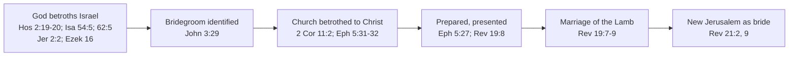
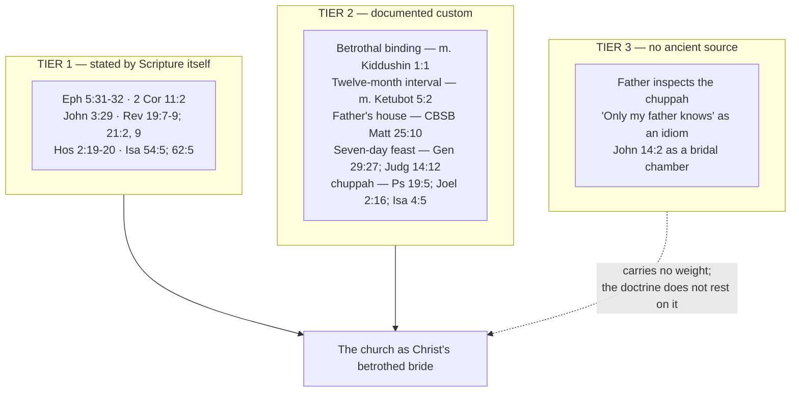

# The Bride of Christ

Paul quotes Genesis on a man leaving his father and mother to hold fast to his wife, and then says
something about what he has just quoted that is easy to read past: "This mystery is profound, and I am saying that it
refers to Christ and the church" (Ephesians 5:32, ESV). He is not reaching for an illustration. He is
telling his readers that marriage was carrying this meaning all along.

That gives the bride imagery a footing most typology does not have. **Where the New Testament itself
makes the identification — Paul, John the Baptist, the book of Revelation — the type is stated, not
inferred; where the argument depends instead on reconstructing first-century wedding practice, the
ground is softer, and some of the most confidently repeated details have no ancient source behind
them at all.** This study sorts the material into those tiers and says which is which, because the
strongest form of the doctrine does not need the weakest evidence for it.

## Key Takeaways

### Types & Prophecy

God took marriage as the picture of his covenant long before Paul: "I will betroth you to me forever"
(Hosea 2:19), "your Maker is your husband" (Isaiah 54:5), "as the bridegroom rejoices over the bride,
so shall your God rejoice over you" (Isaiah 62:5). The New Testament does not invent the image; it
identifies the bridegroom. The bride stands in both of Scripture's closing chapters — the new
Jerusalem "prepared as a bride adorned for her husband" (21:2), "the Bride, the wife of the Lamb"
(21:9) — and the Bible's final invitation is hers to give: "The Spirit and the Bride say, 'Come'"
(22:17, ESV).

### Lessons about Jesus

At the Last Supper Jesus tells his disciples he is going to his Father's house to prepare a place,
and will come again and "take you to myself" (John 14:3). The verb is the one used of a man receiving
his bride. He then refuses the cup until the kingdom (Matthew 26:29) — a groom leaving a covenant
meal unfinished, with a promise to complete it.

### Memory verses

"This mystery is profound, and I am saying that it refers to Christ and the church" (Ephesians 5:32,
ESV). "Let us rejoice and exult and give him the glory, for the marriage of the Lamb has come, and
his Bride has made herself ready" (Revelation 19:7, ESV).

### Be Transformed

Revelation says the Bride "has made herself ready," then immediately says how: "it was granted her to
clothe herself with fine linen, bright and pure" (19:8). Granted. The preparation is real and it is
given, which rules out both passivity and self-congratulation. Paul puts the same two halves
together: Christ acts "so that he might present the church to himself in splendor" (Ephesians 5:27),
and the church lives now as one already spoken for.

### Prayer

Lord Jesus, you called us yours before we were fit to be called anything. Keep us from wandering
while we wait, and from dressing ourselves in what you have not given. Make us ready for the day you
come, and bring us to the table you have not yet finished. Amen.

## Where Scripture Says It Itself

Two of this study's primary passages are worth placing before they are quoted. **Ephesians** is
written by a prisoner — "I, Paul, a prisoner of Christ Jesus on behalf of you Gentiles" (3:1), "an
ambassador in chains" (6:20) — and the marriage passage sits inside a long section on Spirit-filled
conduct that begins "be filled with the Spirit" (5:18), so the husband-and-wife material arrives as
an application of that, not as a standalone treatise on marriage. **Revelation** is written to seven
named congregations in Asia (1:4) by a man in exile on Patmos "on account of the word of God and the
testimony of Jesus" (1:9). Its wedding is announced to churches under pressure, which is why the
Bride's readiness is described as something granted rather than achieved.

The firmest ground is the places where a biblical author states the identification rather than
leaving a reader to notice a resemblance. There are more of them than is often realised.

**Paul, twice, explicitly.** Ephesians 5:31-32 quotes Genesis 2:24 and then applies it: the mystery
"refers to Christ and the church." Two letters earlier in the canon he uses the betrothal itself:
"I feel a divine jealousy for you, since I betrothed you to one husband, to present you as a pure
virgin to Christ" (2 Corinthians 11:2, ESV). Paul casts himself in the father's role — the *NIV
Cultural Backgrounds Study Bible* notes that fathers were responsible for their daughters' virginity
and for arranging their marriages (note on 2 Corinthians 11:2).

**John the Baptist, of himself and Jesus.** "The one who has the bride is the bridegroom. The friend
of the bridegroom, who stands and hears him, rejoices greatly at the bridegroom's voice" (John 3:29,
ESV). The friend of the bridegroom — the *shoshbin* — was a real office, not a figure of speech: he
"would offer a congratulatory speech and in various other ways support the groom," and "would be best
honored for honoring the groom, not for seeking his own honor" (*NIV Cultural Backgrounds Study
Bible*, note on John 3:29). John is describing his own job.

**Revelation, at the end.** "The marriage of the Lamb has come, and his Bride has made herself
ready" (19:7); "Blessed are those who are invited to the marriage supper of the Lamb" (19:9); the new
Jerusalem "prepared as a bride adorned for her husband" (21:2); "Come, I will show you the Bride, the
wife of the Lamb" (21:9).

**The Old Testament spine underneath.** God as husband to his people runs through the prophets —
Hosea 2:19-20, Isaiah 54:5, 62:5, Jeremiah 2:2 and 31:32, Ezekiel 16. The *Cultural Backgrounds* note
on 2 Corinthians 11:2 gathers much of the same material as the background Paul is drawing on, citing
Isaiah 54:5 and 62:4-5, Jeremiah 2:32 and 3:1-2 and 31:32, Ezekiel 16:32 and Hosea 2:19-20. Jeremiah
2:2 is this study's own addition to that list, on the strength of the verse itself. The imagery
also runs the other way: Israel's unfaithfulness is adultery, which is why the prophets can be so
harsh with it.

## What the Sources Actually Document

Below the stated typology sits the wedding culture itself. Some of it is well attested in primary
texts, and that portion is more useful than the embellished version usually offered.

### Betrothal was marriage in law

The Mishnah's opening tractate on the subject is blunt about mechanism: "A woman is acquired in three
ways and acquires herself in two: She is acquired by money, by document, or by intercourse...
And she acquires herself by divorce or by her husband's death" (*m. Kiddushin* 1:1, trans. Kulp).
Betrothal was not an engagement. It was the marriage, minus cohabitation, and only a writ of divorce
or a death ended it.

The New Testament assumes exactly this without explaining it. Joseph is *betrothed* to Mary, and when
he believes she has been unfaithful he "resolved to divorce her quietly" (Matthew 1:19, ESV) — an
incoherent sentence unless betrothal already carried the legal weight the Mishnah describes. The *NIV
Cultural Backgrounds Study Bible* states it in the same terms: "More binding than modern Western
engagements, betrothal could be ended only by divorce or by the death of one of the partners" (note
on Matthew 1:19).

Two independent witnesses, rabbinic law and a Gospel narrative that presupposes it, agreeing on the
same point. That is the evidentiary shape worth building on.

### There was a real interval, and it had a purpose

"A virgin is given twelve months from the [time her intended] husband claimed her, [in which] to
prepare herself for marriage. Just as [such a period] is given to the woman, so is it given to the
man to prepare himself. A widow is given thirty days" (*m. Ketubot* 5:2, trans. Kulp). A defined,
purposeful gap between betrothal and consummation, spent preparing — and the groom prepares through
the same interval as the bride, which is not how the popular version tells it.

That is the attested version of the interval the popular teaching gestures at, and it maps onto
Revelation 19:7-8 without any strain: the Bride "has made herself ready," clothed in linen that "was
granted her."

### The couple lived at the groom's father's house

For the wedding itself "the group would go to the groom's home (normally his parents' home)," and
"the new couple would normally stay at the home of the groom's parents, sometimes in a room on top of
the roof, until the groom could secure a home of his own" (*NIV Cultural Backgrounds Study Bible*,
note on Matthew 25:10). The bride joining the groom at his father's house is documented practice.

The timing of the groom's arrival really was unpredictable, though the reason given is prosaic: "the
many preparations (and the bride's relatives haggling over the value of the gifts given them)," with
the groom normally coming after dark (note on Matthew 25:1). Families negotiating, running late.

### The feast, and the canopy

A wedding feast running seven days is biblical and pre-rabbinic: Jacob is told "complete the week of
this one" (Genesis 29:27), and Samson's feast runs "the seven days of the feast" (Judges 14:12).

The canopy has its own small word study. Hebrew חֻפָּה (*chuppah*, Strong's
H2646) occurs three times in the Old Testament, and the third is the interesting one:

- Psalm 19:6 in the Hebrew (19:5 in English versions) — the sun "comes out like a bridegroom leaving
  his chamber"
- Joel 2:16 — "let the bridegroom leave his room, and the bride her chamber"
- **Isaiah 4:5** — over restored Zion, "over all the glory there will be a canopy"

The wedding-canopy word, applied to God's own covering over Zion in an eschatological oracle. The
image travels from the bridal chamber to the day of the LORD inside the Hebrew Bible's own vocabulary,
across only three occurrences.

### A wedding narrative from the period

The book of Tobit contains an extended wedding scene, and being a story rather than a legal ruling it
shows the customs performed rather than codified. Tobit
is not canonical in the Protestant canon this site works from, and it is used here as a historical
witness to Jewish practice, not as Scripture.

Raguel gives his daughter Sara to Tobias, and four details land on points already made above:

> ✝️ Tobit 7:13-16 (KJV Apocrypha)
> 13 Then he called his daughter Sara, and she came to her father, and he took her by the hand, and
> gave her to be wife to Tobias, saying, Behold, take her after the law of Moses, and lead her away
> to thy father. And he blessed them; 14 And called Edna his wife, and took paper, and did write an
> instrument of covenants, and sealed it. 15 Then they began to eat. 16 After Raguel called his wife
> Edna, and said unto her, Sister, prepare another chamber, and bring her in thither.

- **A written, sealed marriage covenant** (7:14) — the *shtar*, the second of the three means of
  betrothal in *m. Kiddushin* 1:1, shown in use rather than merely listed.
- **The bride is led to the groom's father** (7:13) — "lead her away to thy father," which is the
  same arrangement the *NIV Cultural Backgrounds Study Bible* describes at Matthew 25:10, from a
  source centuries older than the Mishnah.
- **A chamber is prepared for the couple** (7:16), by the bride's household in this case.
- **An extended feast** — "he kept the wedding feast fourteen days," and Raguel binds Tobias by oath
  not to leave "till the fourteen days of the marriage were expired" (8:19-20).

Tobit gives **fourteen** days, double the seven of Genesis 29:27 and Judges 14:12.
The multi-day feast is the constant; its length is not.
Tobit also has the couple pray together before consummation (8:4-8), which no legal source would
record.

Two limits on the evidence. Tobit's exiles are in Nineveh, deported from Naphtali "in the time of
Enemessar king of the Assyrians" (1:2); Ecbatana in Media, where the wedding happens, is Raguel's
home (3:7). The book was composed some centuries
before Christ, so it witnesses to Diaspora practice of its own period rather than to first-century
Judea. And the scrollmapper dataset this repo carries it in supplies no per-book translation label;
the wording is the KJV Apocrypha, which is public domain by age regardless of how the dataset itself
is licensed.

### The wedding feast was already a picture of the age to come

This matters because it means Revelation's marriage supper was not a fresh metaphor to its first
readers. "The wedding banquet was a frequent Jewish figure for the coming Messianic era, based on a
promised future banquet (Isa 25:6) when God would destroy death and remove the tears and shame of his
people (Isa 25:8)" (*NIV Cultural Backgrounds Study Bible*, note on Revelation 19:7). Revelation
19:8's fine linen "may recall the bridal array of righteousness in Isa 61:10" (note on 19:8).

## "I Go to Prepare a Place for You"

> ✝️ John 14:1-3 (ESV)
> 1 "Let not your hearts be troubled. Believe in God; believe also in me. 2 In my Father's house are
> many rooms. If it were not so, would I have told you that I go to prepare a place for you? 3 And if
> I go and prepare a place for you, I will come again and will take you to myself, that where I am
> you may be also."

Father's house, a departure, a place prepared, a return, and a taking. The shape is the betrothal
sequence, and one word makes the case better than the shape does.

### The verb is the one used for taking a wife

"Take you to myself" is παραλαμβάνω (*paralambanō*, G3880), and the semantic-domain annotation places
this occurrence at Louw-Nida **34.53** — domain 34 is *Association*, and 34.53 is the receive-or-
welcome-into-one's-company sense it shares with δέχομαι, προσδέχομαι and προσλαμβάνομαι.

Where else that domain appears is the point:

| Reference | Form | Domain | Sense |
|---|---|---|---|
| Matthew 1:20 | παραλαβεῖν | **34.53** | "do not fear **to take** Mary as your wife" |
| Matthew 1:24 | παρέλαβεν | **34.53** | "**took** his wife" |
| **John 14:3** | παραλήμψομαι | **34.53** | "will **take** you to myself" |
| Matthew 24:40-41 | παραλαμβάνεται | 15.168 | "one **is taken**" — physical removal |

The same lemma carries two senses, and the lexicographers separate them. The sense Jesus uses at
John 14:3 is the one Matthew uses of Joseph receiving Mary as his wife. The sense in the Olivet
Discourse's "one taken, one left" is a different one — carrying off — which is worked out in [The
Olivet Discourse](../last-things/olivet-discourse.md#one-taken-one-left).

### Two cautions on the same passage

**"Many rooms" is not, by itself, a bridal chamber.** μονή (*monē*, G3438) occurs exactly twice in
the New Testament: here, and twenty-one verses later — "If anyone loves me, he will keep my word, and
my Father will love him, and we will come to him and make our **home** with him" (John 14:23, ESV).
Same word, same discourse. John is doing something deliberate with the pair: the place Christ
prepares for us, and the home the Father and Son make in us, are named identically. That is richer
than a construction project, and it is why the *ESV Study Bible* reads "my Father's house" as heaven
(note on John 14:2-3), which is a claim about where the place is, not about what it is built of.

**There is an exodus current here too.** "Prepare a place" has Old Testament precedent that is not
nuptial at all: God sends an angel "to bring you to the place that I have prepared" (Exodus 23:20),
goes before Israel "to seek you out a place to pitch your tents" (Deuteronomy 1:33), and brings them
to "the place, O LORD, which you have made for your abode" (Exodus 15:17).

Those two readings are not rivals, because the prophets read the exodus itself as a bridal journey:
"I remember the devotion of your youth, your love as a bride, how you followed me in the wilderness,
in a land not sown" (Jeremiah 2:2, ESV). A God who goes ahead to prepare a place for the people he
brought out is already, in Jeremiah's telling, a bridegroom.

From the same evening, having given the cup, Jesus says: "I will not drink again of
this fruit of the vine until that day when I drink it new with you in my Father's kingdom" (Matthew
26:29, ESV). A covenant meal deliberately left unfinished, with the promise to finish it.

## How Much Weight the Song of Songs Can Carry

The Song is the obvious place to look for this material, and it needs handling with more care than it
usually gets.

### It was read this way very early

Rabbi Akiva's defence of the book is famous and it is preserved in the Mishnah: "the whole world is
not as worthy as the day on which the Song of Songs was given to Israel; for all the writings are
holy but the Song of Songs is the holy of holies" (*m. Yadayim* 3:5). He was arguing that no one had
ever seriously disputed its canonicity. Jewish tradition read the book of God and Israel; Christian
tradition read it of Christ and the church, and did so early — Eusebius records that Origen "commenced
his Commentaries on the Song of Songs" while in Athens and "completed these also, ten books in number"
after returning to Caesarea (*Ecclesiastical History* 6.32).

### Modern reading, and why it is a check rather than a loss

Contemporary evangelical scholarship generally reads the Song as what it appears to be — love poetry
celebrating marriage between a man and a woman, with the couple "apparently betrothed" (*ESV Study
Bible*, note on Song 1:2-2:17). The *NIV Cultural Backgrounds Study Bible* compares its imagery to
Egyptian love poetry, where lovemaking is likened to pomegranate wine (note on Song 1:2).

That reading is a discipline rather than a demotion. The same volume warns, on the foxes of 2:15,
that the image "has given rise to an enormous number of speculative interpretations" and "is not
meant to be grist for imaginative interpreters" (note on Song 2:15). A book read allegorically
line-by-line will yield whatever the reader brought to it, which is precisely why the identification
in Ephesians 5:32 carries weight the Song cannot supply on its own.

### The one place God is named

The Song never mentions God — with a single, disputed exception, at the book's theological climax:

> ✝️ Song of Songs 8:6 (ESV)
> 6 Set me as a seal upon your heart, as a seal upon your arm, for love is strong as death, jealousy
> is fierce as the grave. Its flashes are flashes of fire, the very flame of the LORD.

The Hebrew behind "the very flame of the LORD" is שַׁלְהֶבֶתְיָה
(*shalhevetyah*) — שַׁלְהֶבֶת (*shalhevet*, "flame," H7957) with
יָה (*Yah*, H3050) attached, the short form of the divine name. Translations
divide on it: the ESV takes it as the name ("the very flame of the LORD"), while others read the
ending as an intensifier and render it "a mighty flame." Both are defensible, and the disagreement is
about Hebrew idiom rather than theology.

If the name is there, then the one time God is named in the Song, it is to identify the fire in human
love as his own. That is a stronger warrant for reading the book theologically than any allegory of
its individual images, and it does not require decoding a single fox.

### One resonance worth noticing, and not overstating

> ✝️ Song of Songs 2:10-13 (ESV)
> 10 My beloved speaks and says to me: "Arise, my love, my beautiful one, and come away, 11 for
> behold, the winter is past; the rain is over and gone. 12 The flowers appear on the earth, the time
> of singing has come... 13 The fig tree ripens its figs, and the vines are in blossom; they give
> forth fragrance. Arise, my love, my beautiful one, and come away."

Winter past, the fig tree budding, and on that evidence: *arise and come away*. The inference runs
the same way as the Olivet Discourse's fig tree — read the season off the tree, and know he is near
(Matthew 24:32-33) — and Jesus's flight instructions in the same discourse turn on winter too
(24:20). The OpenBible cross-reference dataset registers Song 2:13 against Matthew 24:32
independently, so the resonance is a recognised one rather than a private construction.

It is still a resonance. Matthew does not quote the Song, and συκῆ is simply the ordinary word for a
fig tree, so shared vocabulary proves nothing on its own. What the two passages share is a structure
of inference — the season tells you the time — and that is worth seeing without being turned into a
citation.

## What Popular Teaching Adds, and Why It Is Not Needed

Three claims circulate widely and are usually presented as documented custom. They are not.

- **The father inspects and approves the addition.** In the popular telling the groom builds a room
  onto his father's house, and only when the father judges it finished may the son go for his bride.
  No Mishnah, Talmud or Josephus passage is produced for this. The sources for it are modern
  devotional and Messianic teaching materials citing one another.
- **"Only my father knows the day."** The claimed stock answer of a groom asked when the wedding will
  be — usually quoted as *"I don't know, the angels don't know, only my father knows."* That
  reproduces the structure of Matthew 24:36 itself, which suggests the saying was shaped by the verse
  rather than the verse by the saying.
- **A bridal chamber behind John 14:2.** Addressed above: John's own second use of *monē* is of God
  making his home in the believer.

None of this costs the doctrine anything. That the timing belongs to the Father is stated outright by
Jesus in his own words — "it is not for you to know times or seasons that the Father has fixed by his
own authority" (Acts 1:7, ESV) — which is firmer than any reconstructed custom, and is worked out in
[The Olivet Discourse](../last-things/olivet-discourse.md#the-day-no-one-knows). That the couple
belongs at the father's house is documented. That the bride prepares during a defined interval is
documented. The type stands on the attested material and on Scripture's own statements; the invented
details add colour and cost credibility.

## Discussion Questions

1. Paul says marriage "refers to Christ and the church" (Ephesians 5:32). If the picture came first
   and the marriage second, what does that change about how you read Genesis 2:24 — and about
   marriage now?
2. Betrothal could be dissolved only by divorce or death (*m. Kiddushin* 1:1; Matthew 1:19). What
   does that legal weight add to Paul's "I betrothed you to one husband" (2 Corinthians 11:2)?
3. Revelation says the Bride "has made herself ready" and then that her clothing "was granted her"
   (19:7-8). How do those two statements fit together, and what would go wrong holding only one?
4. Some of the most memorable details in popular teaching on this theme turn out to have no ancient
   source. Does that change what you think the church should be able to say about the ones that do?
5. If שַׁלְהֶבֶתְיָה in Song of Songs 8:6 does name God, what does it mean
   that the book's only mention of him identifies the fire in human love as his?

## References & Recommended Reading

- *Mishnah Kiddushin* 1:1 (the three means of betrothal; dissolution only by divorce or death),
  *Mishnah Ketubot* 5:2 (the twelve-month preparation period, for both parties), and *Mishnah
  Yadayim* 3:5 (Rabbi Akiva on the Song of Songs as "the holy of holies") — all quoted from
  **"Mishnah Yomit" translated by Dr. Joshua Kulp, licensed CC-BY**, retrieved through
  `references/build/sefaria.py` from the Sefaria-Export dataset. The CC0 Sefaria Community
  Translation was preferred but does not cover these passages, and Sefaria's default English for the
  Mishnah is the CC-BY-NC William Davidson Edition, which this site avoids quoting.
- Tobit 7:13-16 and 8:19-20 (the sealed marriage covenant, the bride led to the groom's father, the
  prepared chamber, the fourteen-day feast) — KJV Apocrypha wording, public domain, from this repo's
  `references/open-data/scrollmapper-bible-databases-deuterocanonical` source set. Cited as an
  extra-biblical historical witness to Jewish wedding practice, not as Scripture.
- NIV Cultural Backgrounds Study Bible / NKJV Cultural Backgrounds Study Bible (Zondervan) — notes on
  Matthew 1:19, Matthew 25:1 and 25:10, John 3:29, 2 Corinthians 11:2, Revelation 19:7-8, and Song of
  Songs 1:2 and 2:15, quoted briefly with attribution.
- ESV Study Bible (Crossway) — verse text (ESV) and notes on John 14:2-3 and Song of Songs
  1:2-2:17, quoted briefly with attribution.
- MACULA Greek/Hebrew morphology and Louw-Nida semantic domains (open license) — domain and
  occurrence data for παραλαμβάνω, μονή, and חֻפָּה.
- OpenBible.info cross-reference dataset (CC-BY) — the registered cross-reference from Song of Songs
  2:13 to Matthew 24:32.
- [The Olivet Discourse](../last-things/olivet-discourse.md) — the Father's authority over the date,
  and the "one taken, one left" saying this study's word data bears on.
- [The Rapture of the Church](../last-things/rapture.md) — the wedding-pattern sequence, and the
  pretribulational argument.
- [Israel and the Church](israel-and-the-church.md) — who the bride is, and how the church stands in
  relation to Israel.
