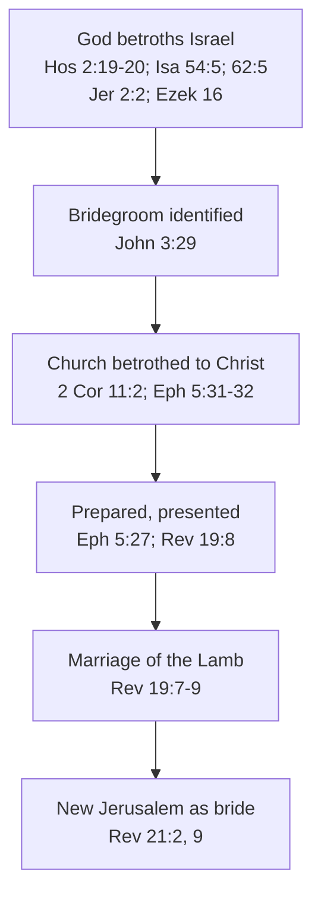
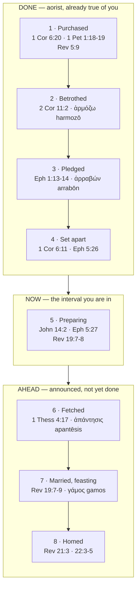
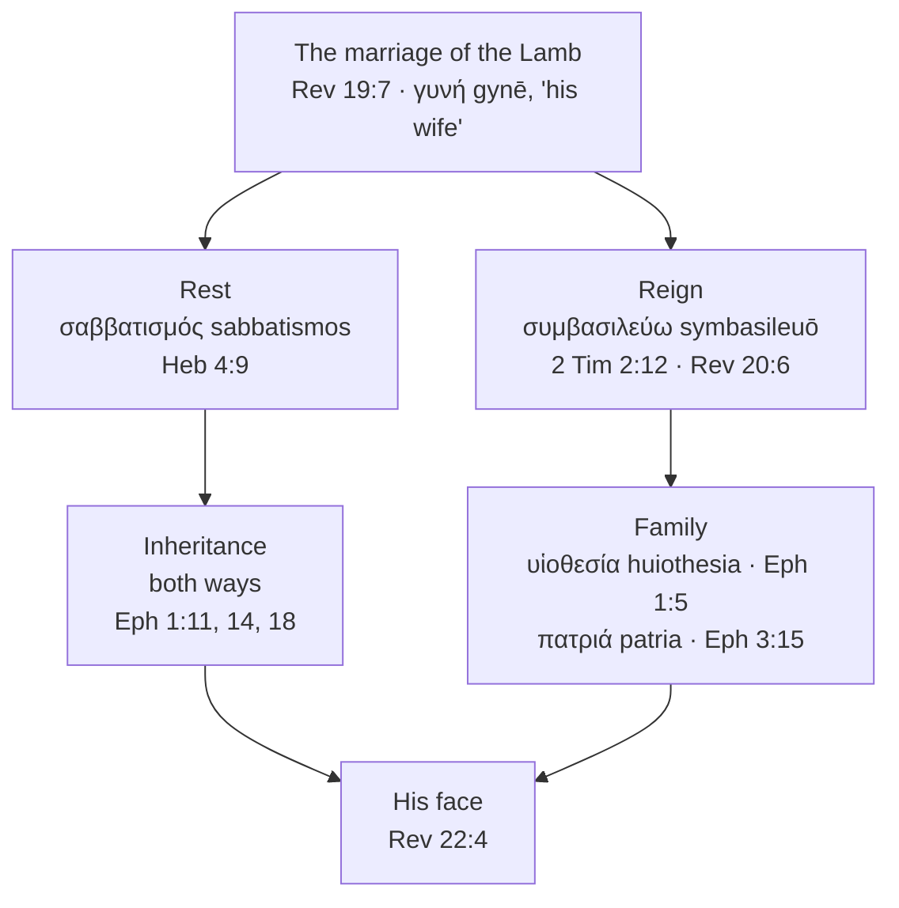
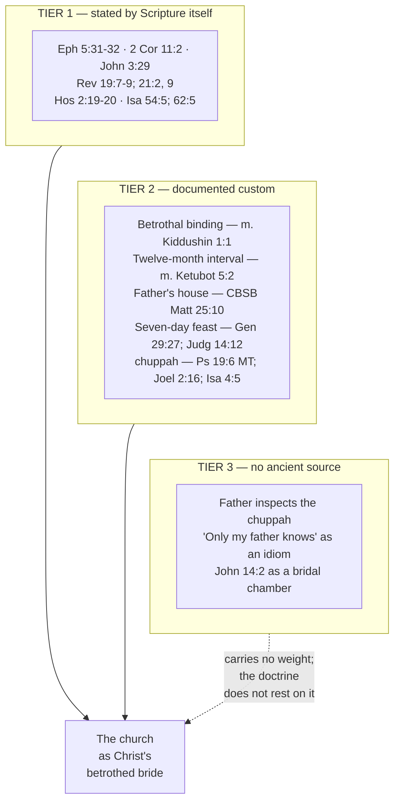

# The Bride of Christ

Paul quotes Genesis: a man leaves his father and mother and holds fast to his wife. Then he clearly links
the pattern of marriage with Christ and the church
 **"This mystery is profound, and I am saying that it refers to Christ and the church"** (Ephesians 5:32, ESV).

He is not using marriage as an illustration. He is telling the Ephesians that marriage had been carrying
this meaning the whole time.

This is an undeniable type throughout Scripture. Paul states it outright. John the Baptist
states it. Revelation states it twice in its closing chapters.

But not everything taught about the bride comes from Scripture. It also comes from
reconstructions of the first-century Jewish wedding — the father inspecting the chamber, the groom's
"only my father knows the day," the bridal chamber prepared in the father's house. Some of that is
documented. Some of it has no ancient source at all.

**In one sentence:** Scripture calls the church Christ's betrothed bride, and four parts of
that betrothal are already complete — purchased, betrothed, pledged, set apart — which is what makes
the waiting a confident one. And the remaining four — a place being prepared, a groom who comes for
her, the marriage supper, the Father's house — set the church in an attitude of joyous hope.

## Key Takeaways

### Types & Prophecy

God used marriage as the picture of His covenant in the Old Testament: "I will betroth you to me forever"
(Hosea 2:19), "your Maker is your husband" (Isaiah 54:5), "as the bridegroom rejoices over the bride,
so shall your God rejoice over you" (Isaiah 62:5). The New Testament does not invent the image; it
identifies clearly who the bridegroom is. It also gives her a second title at the wedding: at Revelation 19:7 the word the
ESV prints as "Bride" is γυνή (*gynē*), *wife*, and at 21:9 the angel says both — "the Bride, the wife of the
Lamb". The bride stands in both of Scripture's closing chapters — the new
Jerusalem "prepared as a bride adorned for her husband" (21:2), "the Bride, the wife of the Lamb"
(21:9) — and the Bible's final invitation is hers to give: "The Spirit and the Bride say, 'Come'"
(22:17, ESV).

### Lessons about Jesus

**Husband is a title God kept for Himself, and Jesus takes it.** "Your Maker is your husband, the
LORD of hosts is his name" (Isaiah 54:5, ESV); "I was their husband, declares the LORD" (Jeremiah
31:32, ESV); "you will call me 'My Husband'" (Hosea 2:16, ESV). Then John the Baptist points at a man
from Nazareth and says "the one who has the bride is the bridegroom" (John 3:29), and Jesus calls
Himself the bridegroom to His face (Matthew 9:15) and again in a parable of the kingdom (Matthew
25:1). **This shows that God the Son holds the place the God of Israel holds**.
See [The title He takes](#the-title-he-takes).

At the Last Supper Jesus tells His disciples He is going to His Father's house to prepare a place,
and will come again and "take you to myself" (John 14:3). The verb is the one used of a man receiving
his bride. He then refuses the cup until the kingdom (Matthew 26:29) — a groom leaving a covenant
meal unfinished, with a promise to complete it.

### Memory verses

> ✝️ [Ephesians 5:32 (ESV)](https://www.blueletterbible.org/esv/Eph/5/32)
>
> 32 This mystery is profound, and I am saying that it refers to Christ and the church.

> ✝️ [Revelation 19:7 (ESV)](https://www.blueletterbible.org/esv/Rev/19/7)
>
> 7 Let us rejoice and exult and give him the glory, for the marriage of the Lamb has come, and his
> Bride has made herself ready;

### Be Transformed

- **Think.** The Bride "made herself ready" only because "it was granted her" (Revelation 19:8,
  ESV) — the preparation is real and it is given, not self-generated. Rule out both errors at once:
  you are not waiting passively for Christ to do all the work, and you are not producing your own
  splendor for Him to inspect.
- **Attitude.** Live now the way someone already spoken for lives — Christ has already acted "so
  that he might present the church to himself in splendor" (Ephesians 5:27). That is your identity
  while you wait, not a status you are still working to earn.
- **Do.** Name one place you are dressing yourself in something Christ has not granted you —
  effort, performance, a righteousness you manufactured instead of received — and put it down in
  favor of what has actually been given you.

### Prayer

Lord Jesus, you called us yours before we were fit to be called anything. Keep us from wandering
while we wait, and from dressing ourselves in what you have not given. Make us ready for the day you
come, and bring us to the table you have not yet finished. 

In Jesus' name. Amen.

## Study outline

This is quite a big study. Feel free to jump around.

- [The bride of Christ in Scripture](#where-scripture-says-it-itself). Discussion on how extensive
  the pattern is in Scripture.
- [The pattern of the wedding](#the-pattern-component-by-component). This is the main takeaway of
  the study, and most enjoyable.
- **The eight components, a section each** — [1 Purchased](#1-purchased-already-yours)
  · [2 Betrothed](#2-betrothed-already-yours) · [3 Pledged](#3-pledged-already-yours)
  · [4 Set apart](#4-set-apart-already-yours) · [5 Preparing](#5-preparing-where-you-are-now) · [6 Fetched](#6-fetched-still-ahead)
  · [7 Married](#7-married-and-feasting-still-ahead) · [8 Homed](#8-homed-still-ahead). The first four are already done to
  you; the fifth is where you are standing now.
- [What the marriage produces](#what-the-marriage-produces). Rest, reigning, inheritance and family
  — what the wedding leads to, and what the study argues are not steps in the sequence.
- [Discussion questions](#discussion-questions). Eleven, for a group or on your own.
- [Annex: sources, word studies and cautions](#annex-sources-word-studies-and-cautions). Useful
  material that helped build the body.

## Where Scripture Says It Itself

### Two letters, and the circumstances they were written in

Two of this study's primary passages need placing before they are quoted.

**Paul wrote Ephesians from prison.** "I, Paul, a prisoner of Christ Jesus on behalf of you
Gentiles" (3:1). "An ambassador in chains" (6:20). And the marriage passage sits inside a long
section on Spirit-filled conduct, which opens "be filled with the Spirit" (5:18). So the
husband-and-wife material is an application of that. It is not a treatise on marriage.

**Revelation** is written to seven
named congregations in Asia (1:4) by a man in exile on Patmos "on account of the word of God and the
testimony of Jesus" (1:9). Its wedding is announced to churches under pressure, which is why the
Bride's readiness is described as something granted rather than achieved.

### Where an author states it outright

The firmest ground is the places where a biblical author states the identification rather than
leaving a reader to notice a resemblance. There are more of them than is often realised.

**Paul, twice, explicitly.** Ephesians 5:31-32 quotes Genesis 2:24 and then applies it: the mystery
"refers to Christ and the church." Two letters earlier in the canon he uses the betrothal itself:
"I feel a divine jealousy for you, since I betrothed you to one husband, to present you as a pure
virgin to Christ" (2 Corinthians 11:2, ESV). Paul casts himself in the father's role — the *NIV
Cultural Backgrounds Study Bible* notes that fathers were responsible for their daughters' virginity
and for arranging their marriages (note on 2 Corinthians 11:2).

**John the Baptist, of himself and Jesus.** "The one who has the bride is the bridegroom. The friend
of the bridegroom, who stands and hears him, rejoices greatly at the bridegroom's voice" (John 3:29,
ESV). The friend of the bridegroom — the *shoshbin* — was a real office, not a figure of speech: he
"would offer a congratulatory speech and in various other ways support the groom," and "would be best
honored for honoring the groom, not for seeking his own honor" (*NIV Cultural Backgrounds Study
Bible*, note on John 3:29). John is describing his own job.

**Revelation, the end times.** "The marriage of the Lamb has come, and his Bride has made herself
ready" (19:7); "Blessed are those who are invited to the marriage supper of the Lamb" (19:9); the new
Jerusalem "prepared as a bride adorned for her husband" (21:2); "Come, I will show you the Bride, the
wife of the Lamb" (21:9).

**The Old Testament spine underneath.** God as husband to His people runs through the prophets —
Hosea 2:19-20, Isaiah 54:5, 62:5, Jeremiah 2:2 and 31:32, Ezekiel 16. The *Cultural Backgrounds* note
on 2 Corinthians 11:2 gathers much of the same material as the background Paul is drawing on, citing
Isaiah 54:5 and 62:4-5, Jeremiah 2:32 and 3:1-2 and 31:32, Ezekiel 16:32 and Hosea 2:19-20. Jeremiah
2:2 is this study's own addition to that list, on the strength of the verse itself. The imagery
also runs the other way: Israel's unfaithfulness is adultery, which is why the prophets can be so
harsh with it.

### The title He takes

The first arrow in that diagram carries the weight of everything after it. God betroths Israel; the
bridegroom is then identified as Jesus. Put the two halves side by side and the image stops being
decoration and starts making a claim about who Jesus is.

In the Old Testament the husband is God. "For your Maker is your husband, the LORD of hosts is his name; and the
Holy One of Israel is your Redeemer, the God of the whole earth he is called" (Isaiah 54:5, ESV).
Jeremiah makes it the relationship grievance behind the broken covenant — "my covenant that they broke, though I
was their husband, declares the LORD" (Jeremiah 31:32, ESV). Hosea makes it the promise of what
Israel will one day call Him: "you will call me 'My Husband'" (Hosea 2:16, ESV).

Two of those three run on one Hebrew verb, בָּעַל (*baʿal*, H1166) — Isaiah's
בֹעֲלַיִךְ (*boʿalayik*, "your husband," a participle) and Jeremiah's
בָּעַלְתִּי (*baʿalti*, "I was a husband"). Hosea's line is a play on the same
root, trading בַּעְלִי (*baʿli*) for אִישִׁי (*ishi*),
which is worked through at [The name she calls Him](#the-name-she-calls-him-hosea-216) below.

**A fourth occurrence is easy to miss, because the English versions disagree about it.** Jeremiah
3:14 has God saying אָנֹכִי בָּעַלְתִּי בָכֶם — the same verb, the same
speaker. The ESV, NASB and CSB render it "I am your master"; the WEB has "I am a husband to you."
Both are defensible, since the verb carries ownership and marriage together, and that ambiguity is
exactly what Hosea 2:16 promises to resolve. So the Old Testament witness is four verses rather than
three, and one of them only shows itself in the Hebrew.

Now set the New Testament beside it. John the Baptist says of Jesus, "the one who has the bride is
the bridegroom" (John 3:29, ESV). Jesus applies the word to Himself when asked why His disciples do
not fast: "Can the wedding guests mourn as long as the bridegroom is with them?" (Matthew 9:15, ESV).
He does it again in a parable about the kingdom of heaven, where ten virgins go out to meet
ὁ νυμφίος, the bridegroom (Matthew 25:1).

**This shows that God the Son is God.** Isaiah's husband is the LORD of hosts, the God of the whole
earth. Jesus takes that place and never pauses to justify taking it, and no one in the Gospels
records an objection to it — the same move He makes with the roles of judge and shepherd, worked
through in [The Parables of the Olivet Discourse](../last-things/olivet-discourse-parables.md#lessons-about-jesus).
So when Paul writes "I betrothed you to one husband, to present you as a pure virgin to Christ"
(2 Corinthians 11:2, ESV), he is not borrowing a poetic figure from the prophets. He is saying that
the covenant God made with Israel as her husband has its answer in Christ, and that the church now
stands where Isaiah's bride stood.

And that is what the image is for. A doctrine of the deity of Christ argued from titles can stay in
the head. This one arrives as a marriage: **the God who called Himself your husband is the Christ who
bought you, and you are betrothed to Him.**

### Why this belongs to the church, and why now

Ephesians uses μυστήριον (*mystērion*, G3466) six times — 1:9, 3:3, 3:4, 3:9, 5:32 and 6:19 — and
defines the word in the middle of them. The mystery "was not made known to the sons of men in other
generations as it has now been revealed to his holy apostles and prophets by the Spirit" (3:5, ESV).
Kept back, then announced. [Israel and the
Church](israel-and-the-church.md#what-scripture-means-by-a-mystery) traces that sense to Daniel's
רָז (*raz*).

Paul then lays that same word on the marriage: "This mystery is profound, and I am saying that it
refers to Christ and the church" (5:32, ESV). The bridal relation therefore stands on the disclosed
side of Ephesians' own then-and-now line — a relation announced in this age, to the body Ephesians
3:6 describes as Jew and Gentile made joint-heirs in one. The word choice establishes the period,
and that is all it establishes: Paul does not say at 5:32 that this is the same mystery as 3:6, and
the word alone leaves the question of the church's distinctness from Israel open.

Israel's betrothal is not cancelled by it. "I will betroth you to me forever" is still future when
Hosea writes it (2:19), and the prophets keep God's marriage to Israel in view to the end of the
canon. The dispensational reading holds both at once: Israel remains the wife of the LORD, restored
on His oath, and the church is the bride of Christ, betrothed in this present age. [Israel and the
Church](israel-and-the-church.md) argues that case at length, the covenant-theology alternative
included.

## The Pattern, Component by Component

The documented custom has parts. Each part has an Old Testament antecedent, and each has a
New Testament sentence that puts the church in that position. Set out end to end, the pattern
turns out to be **mostly behind you**: four of its eight components are stated in the aorist, as
things already done to the church.

| # | Component | The custom | Old Testament | The church |
|---|---|---|---|---|
| 1 | **[Purchased](#1-purchased-already-yours)** | [Betrothal "by money"](#betrothal-was-marriage-in-law) (*m. Kiddushin* 1:1) | The גֹּאֵל (*goel*) who redeems his kin; "your Redeemer" (Isaiah 54:5) | "you were bought with a price" (1 Corinthians 6:20); "ransomed… with the precious blood of Christ" (1 Peter 1:18-19); "by your blood you ransomed people for God" (Revelation 5:9) |
| 2 | **[Betrothed](#2-betrothed-already-yours)** | [Betrothal "by document"](#a-wedding-narrative-from-the-period) — the sealed *shtar* (*m. Kiddushin* 1:1; Tobit 7:14) | "I made my vow to you and entered into a covenant with you… and you became mine" (Ezekiel 16:8); "[I will betroth you to me forever](#1-purchased-already-yours)" (Hosea 2:19) | "I betrothed you to one husband" (2 Corinthians 11:2) |
| 3 | **[Pledged](#3-pledged-already-yours)** | A deposit against the rest of the payment | Judah's עֵרָבוֹן (*erabon*), ἀρραβών (*arrabōn*) in the Greek (Genesis 38:17-20) | "his Spirit in our hearts as a guarantee" (2 Corinthians 1:22); "the guarantee of our inheritance" (Ephesians 1:14) |
| 4 | **[Set apart](#4-set-apart-already-yours)** | Betrothal as "the sanctification of the bride" (*NIV Cultural Backgrounds Study Bible*, note on Ephesians 5:26) | "Then I bathed you with water… and anointed you with oil" (Ezekiel 16:9) | "you were washed, you were sanctified" (1 Corinthians 6:11); "having cleansed her by the washing of water with the word" (Ephesians 5:26) |
| 5 | **[Preparing](#5-preparing-where-you-are-now)** | [Twelve months, and the groom prepares through the same twelve](#the-after-betrothal-interval-is-a-time-of-preparation) (*m. Ketubot* 5:2) | — | "I go to prepare a place for you" (John 14:2); "that he might [present the church to himself in splendor](#he-presents-her-holy-and-he-is-the-one-who-makes-her-so)" (Ephesians 5:27); "his Bride has made herself ready" (Revelation 19:7) |
| 6 | **[Fetched](#6-fetched-still-ahead)** | The groom comes, usually after dark, at a time his family's preparations decide (CBSB, note on Matthew 25:1) | — | "Come out to meet him" (Matthew 25:6); "caught up… to meet the Lord in the air" (1 Thessalonians 4:17) |
| 7 | **[Married, and feasting](#7-married-and-feasting-still-ahead)** | [Seven days](#the-feast-and-the-canopy) (Genesis 29:27; Judges 14:12), fourteen in Tobit (8:19-20) | "a feast of rich food… for all peoples" (Isaiah 25:6) | "the marriage of the Lamb has come" (Revelation 19:7); "the marriage supper of the Lamb" (19:9) |
| 8 | **[Homed](#8-homed-still-ahead)** | [The couple live at the groom's father's house](#the-couple-lived-at-the-grooms-fathers-house) (CBSB, note on Matthew 25:10; Tobit 7:13) | "the place, O LORD, which you have made for your abode" (Exodus 15:17) | "In my Father's house are many rooms" (John 14:2); "the dwelling place of God is with man" (Revelation 21:3) |

All quotations ESV. Components 1-4 are complete for every believer; 5 is the one you are standing
in; 6-8 are announced and not yet done.

Below the stated typology sits the wedding culture itself. Some of it is well attested in primary
texts, and that portion is more useful than the embellished version usually offered.

A betrothed woman in first-century Judea held a set of facts about her position, and she held them
before the wedding. She was married in law already. Her husband had already paid. The interval had a
purpose and an end date. **Scripture gives the church those same facts about Christ, and gives them
as grounds for confidence while she waits.**

### Three places the wrong verse gets cited

Each of these is a near miss, and each has a better verse a line or two away.

- **The purchase is 1 Peter 1:18-19, not 1:17.** Verse 17 tells you to "conduct yourselves with
  fear throughout the time of your exile" (ESV). The ransom language starts in the next sentence.
- **Ephesians 1:5 is adoption, and adoption is a different picture.** "He predestined us for
  adoption to himself as sons" (ESV) is υἱοθεσία (*huiothesia*), the legal placing of a son. It is
  true of you and it is not the betrothal; the betrothal verb in Paul is at 2 Corinthians 11:2.
  Both images run at once, and [the last section below](#family-as-well-as-marriage-and-the-two-do-not-compete)
  takes up why Scripture uses more than one.
- **Ephesians 1:6 is praise, not the feast.** "To the praise of his glorious grace" is what the
  passage is for. The wedding feast is γάμος (*gamos*), and in Revelation it is at 19:7 and 19:9.

### Always with the Lord, and the inheritance: what the marriage produces

Two items commonly listed as stages are better read as what the marriage produces: being always with
the Lord, and the inheritance. Neither is a step in the sequence. Both are treated below.

## 1 · Purchased — already yours

### The price, and what it was paid in

Scripture states the price three times, and twice with a marketplace verb. "You were bought with a
price" (1 Corinthians 6:20, ESV) is ἠγοράσθητε, from ἀγοράζω (*agorazō*, G59), the ordinary word
for buying in a market. Heaven sings it back to the Lamb in that same verb: "by your blood you
ransomed people for God from every tribe and language and people and nation" (Revelation 5:9, ESV).
Peter reaches for the ransom word instead — ἐλυτρώθητε, from λυτρόω (*lytroō*, G3084) — and names
the currency outright: you were ransomed "not with perishable things such as silver or gold, but
with the precious blood of Christ, like that of a lamb without blemish or spot" (1 Peter 1:18-19,
ESV).

### The Redeemer behind the transaction

Behind the transaction the Old Testament puts a person. The גֹּאֵל (*goel*,
H1350) is the kinsman who holds both the right and the obligation to buy back what his relative has
lost, and Isaiah gives God the title: "your Redeemer the Holy One of Israel" (Isaiah 54:5, ESV).
Ruth asks Boaz for it in as many words, and asks for the wedding gesture in the same breath:
"Therefore spread the corner of your garment over your servant; for you are a near kinsman"
(Ruth 3:9, WEB). **This shows that God did not delegate the purchase — He is the kinsman, and the
price He paid was His own Son's blood.**

### The covenant, and the cup it was sealed in

The Mishnah supplies the setting. "A woman is acquired in three ways" (*m. Kiddushin* 1:1) — the
acquiring verbs all belong to the groom, and the bride's consent is assumed rather than transacted.
Christ's side of this is stated in three places: the price above, then the covenant — "This cup
that is poured out for you is the new covenant in my blood" (Luke 22:20, ESV) — and the pledge to
return, from the same evening: "I will not drink again of this fruit of the vine until that day
when I drink it new with you in my Father's kingdom" (Matthew 26:29, ESV).

Both cups sit at named points in the Passover order, and the first of them lands on this component.
The cup He hands them falls at the Seder's third, which carries the third of God's four exodus
promises — "I will redeem you with an outstretched arm" (Exodus 6:6, ESV) — and which the order of
service calls the cup of redemption. **So the cup Christ names the new covenant is, in the meal's
own sequence, the cup of the purchase.** The cup He then refuses is the fourth.
[The Last Supper and the Cups of Passover](../feasts/last-supper-four-cups.md) works the
identification through, and [The cup He promised to finish](#the-cup-he-promised-to-finish) takes up
the fourth under component 7, where the wedding supper is in view.

### The two ways out, and why neither is open

Betrothal had two exits, and the Mishnah names them: "she acquires herself by divorce or by her
husband's death" (*m. Kiddushin* 1:1). Christ has issued no writ of divorce against His church, and
He has already passed through the other door and come back out: "Christ, being raised from the dead,
will never die again; death no longer has dominion over him" (Romans 6:9, ESV). Hold that as what it
is — a rabbinic legal fact set beside two New Testament statements, which is an inference this study
draws rather than a sentence Scripture writes.

The doctrine underneath it is stated without any inference at all, and Hosea is where God says it.
He betroths His people "in righteousness and in justice, in steadfast love and in mercy... in
faithfulness" (Hosea 2:19-20, ESV). Five qualities, every one of them His, in a book whose whole
occasion is the bride's unfaithfulness. **This shows that God keeps covenant on the strength of His
own character**, which is the only ground on which a covenant with you could ever have held. So the
thing that secures your marriage to Christ is the same thing that secured Israel's betrothal to the
LORD: His faithfulness, pledged in advance, at His own cost.

## 2 · Betrothed — already yours

### The betrothal is a finished legal act

Paul's word for it occurs once in the New Testament. "I betrothed you to one husband" (2 Corinthians
11:2, ESV) is ἡρμοσάμην (*hērmosamēn*), from ἁρμόζω (*harmozō*, G718), and the form is aorist — an
act done and over. Louw-Nida files this occurrence at 34.74, in the domain of Association. The one
time the New Testament uses the betrothal verb, its object is the church.

### The covenant God swore to a foundling (Ezekiel 16:8)

Ezekiel puts the betrothal in God's own mouth, as something He did rather than something Israel
achieved.

> ✝️ Ezekiel 16:8 (WEB)
>
> 8 "'"Now when I passed by you, and looked at you, behold, your time was the time of love; and I
> spread my garment over you and covered your nakedness. Yes, I pledged myself to you and entered
> into a covenant with you," says the Lord Yahweh, "and you became mine.

The gesture is legal, not affectionate. "I spread my garment over you" is
וָאֶפְרֹשׂ כְּנָפִי (*va'efros kenafi*) — פָּרַשׂ
(*paras*, H6566), to spread, over כָּנָף (*kanaph*, H3671), the wing or
corner of a garment. It is the same verb and the same noun Ruth uses of Boaz, in the same sentence
where she calls him a near kinsman (Ruth 3:9) — so the act that redeems and the act that betroths
are one gesture in the Hebrew. The *ESV Study Bible* reads it the same way, noting that spreading
the garment "signals intent to marry" and the covenant "signifies the formal commitment" (note on
Ezekiel 16:8).

Then וָאֶשָּׁבַע (*va'eshava*, from שָׁבַע, *shava*,
H7650), "I swore," and בְּרִית (*berit*, H1285), covenant — an oath and a
covenant, in that order, closing on "you became mine."

**This shows that God binds Himself by oath before His bride has anything to commend her.** Note
where the verse falls: the same commentary observes that "the bonds are formed before the cleansing
of Ezek. 16:9" (note on Ezekiel 16:8). The covenant comes first and the washing follows — which is
the order this pattern runs in, betrothed at 2 and set apart at 4.

### Betrothal was marriage in law

The Mishnah's opening tractate on the subject is blunt about mechanism: "A woman is acquired in three
ways and acquires herself in two: She is acquired by money, by document, or by intercourse...
And she acquires herself by divorce or by her husband's death" (*m. Kiddushin* 1:1, trans. Kulp).
Betrothal was not an engagement. It was the marriage, minus cohabitation, and only a writ of divorce
or a death ended it.

The New Testament assumes exactly this without explaining it. Joseph is *betrothed* to Mary, and when
he believes she has been unfaithful he "resolved to divorce her quietly" (Matthew 1:19, ESV) — an
incoherent sentence unless betrothal already carried the legal weight the Mishnah describes. The *NIV
Cultural Backgrounds Study Bible* states it in the same terms: "More binding than modern Western
engagements, betrothal could be ended only by divorce or by the death of one of the partners" (note
on Matthew 1:19).

Two independent witnesses, rabbinic law and a Gospel narrative that presupposes it, agreeing on the
same point. That is the evidentiary shape worth building on.

## 3 · Pledged — already yours

### The Spirit as deposit: ἀρραβών (*arrabōn*)

Ten chapters earlier in the same letter Paul names what secures the interval. God "has also put his
seal on us and given us his Spirit in our hearts as a guarantee" (2 Corinthians 1:22, ESV).
"Guarantee" is ἀρραβών (*arrabōn*, G728). It occurs three times in the New Testament — 2 Corinthians
1:22, 2 Corinthians 5:5, Ephesians 1:14 — and in all three the deposit is the Holy Spirit. It occurs
three times in the Greek Old Testament as well, all in one scene: the pledge Judah hands over
against a payment he has promised to send (Genesis 38:17, 18, 20). The *NIV Cultural Backgrounds
Study Bible* gives the commercial sense directly: "Business documents used this Greek term to
designate a down payment or first installment" (note on Ephesians 1:14).

A first instalment is part of the sum, handed over early, and it obliges the payer for the rest.
**This shows that God has bound Himself to finish what He began in you, and has put something of His
own into your hands as the bond.** The Spirit you have is the first portion of the inheritance
itself, which is why Paul calls Him "the guarantee of our inheritance until we acquire possession of
it" (Ephesians 1:14, ESV) and tells you that you "were sealed for the day of redemption" (Ephesians
4:30, ESV).

### The pledge Judah handed over was a seal

The Genesis scene behind ἀρραβών holds a detail Paul's own sentence repeats. Tamar asks Judah what
he will leave with her, and she names the three things that identify him:

> ✝️ Genesis 38:18 (WEB)
>
> 18 He said, "What pledge will I give you?" She said, "Your signet and your cord, and your staff
> that is in your hand." He gave them to her, and came in to her, and she conceived by him.

"Your signet" is חוֹתָם (*chotam*, H2368), a seal — the stamp a man pressed
into clay to mark a document as his own. So the pledge, in the one Old Testament passage that uses
the word, is the man's own identifying mark, handed over and held against him. Tamar produces it
later for exactly that purpose: "Please discern whose these are — the signet, and the cords, and the
staff" (Genesis 38:25, WEB).

Paul puts those same two things in a single clause. God "has also put his seal on us and given us
his Spirit in our hearts as a guarantee" (2 Corinthians 1:22, ESV) — sealed and deposited, the pair
the Judah scene already holds. Ephesians says it again: you "were sealed with the promised Holy
Spirit" (1:13, ESV), who is then "the guarantee of our inheritance" (1:14, ESV).

**This shows that God pledged His own identity, and left it with you until He comes for what He has
bought.**

The Song's bride reaches for the same noun and runs it the other way: "Set me as a seal upon your
heart, as a seal upon your arm" (Song of Songs 8:6, ESV) is חוֹתָם again.
She asks to be the seal on Him; Paul says the church has been sealed by Him. The direction is
reversed and the longing is the same, which is as much as the shared vocabulary will carry — see
[The one place God is named](#the-one-place-god-is-named) for what else that verse holds.

### How far the betrothal reading carries

Paul nowhere calls the Spirit a betrothal gift. The betrothal
and the deposit stand in one letter, in one man's vocabulary, describing one arrangement, and that
is the weight the point carries — enough to rest on. Your assurance turns on a completed act
of His and a deposit already made in you. [Assurance of
Salvation](../salvation/assurance-of-salvation.md) works that through on its own terms.

## 4 · Set apart — already yours

### The washing God performed (Ezekiel 16:9)

The next verse is the one the table's fourth component rests on, and it follows the covenant by a
single line.

> ✝️ Ezekiel 16:9 (WEB)
>
> 9 "'"Then I washed you with water. Yes, I thoroughly washed away your blood from you, and I
> anointed you with oil.

Washed, then anointed, then clothed — Ezekiel goes on to "fine linen" and "silk" (16:10, WEB), the
wardrobe Revelation hands back to the Bride at 19:8. Every verb in the sequence has God as its
subject; the foundling does nothing to herself.

Paul says the same of the church in three aorists stacked together: "you were washed, you were
sanctified, you were justified in the name of the Lord Jesus Christ and by the Spirit of our God"
(1 Corinthians 6:11, ESV). **This shows that God cleaned you up Himself, and did it before you
could offer Him anything worth having.**

### He presents her holy, and He is the One who makes her so

> ✝️ Ephesians 5:25-27 (ESV)
>
> 25 Husbands, love your wives, as Christ loved the church and gave himself up for her, 26 that he
> might sanctify her, having cleansed her by the washing of water with the word, 27 so that he might
> present the church to himself in splendor, without spot or wrinkle or any such thing, that she
> might be holy and without blemish.

Five verbs, one subject. Christ loved, gave Himself up, sanctifies, cleansed, presents. The bride
appears in every clause as the one acted upon.

"Present" is παραστήσῃ, from παρίστημι (*paristēmi*, G3936) — the verb Paul used of his own work at
2 Corinthians 11:2, "to present you as a pure virgin to Christ," and again at Colossians 1:22, "to
present you holy and blameless and above reproach before him" (ESV). Paul presents the bride to
Christ; Christ presents her to Himself.

"Without blemish" is ἄμωμος (*amōmos*, G299), and it has eight New Testament occurrences. Six
describe people made morally blameless — Ephesians 1:4 and 5:27, Colossians 1:22, Philippians 2:15,
Jude 24, Revelation 14:5. The other two describe Christ: His blood, "like that of a lamb without
blemish or spot" (1 Peter 1:19, ESV), and Hebrews has Him offering Himself ἄμωμον to God (Hebrews
9:14). **The word for the spotless sacrifice is the word for the spotless bride.** Her blamelessness
is produced by His, which is the atonement doing the work; the *ESV Study Bible* states the same
dependence at this verse, that the church's holiness "is derived from the consecrating sacrifice of
Christ on the cross" (note on Ephesians 5:26-27).

### The washing, and why her two clauses agree

"Washing" is λουτρόν (*loutron*, G3067), twice in the New Testament: here, and "the washing of
regeneration and renewal of the Holy Spirit" (Titus 3:5, ESV). The *NIV Cultural Backgrounds Study
Bible* reports that some relate it to the bride's washing before she is perfumed and dressed, and
adds a detail worth having: "later Jewish teachers spoke of betrothal as 'the sanctification of the
bride,' meaning setting her apart for her husband" (note on Ephesians 5:26). Setting apart is what
sanctification is. On that usage the betrothal is itself the sanctifying act, which is why the church
can be addressed as holy now and still be told to become so.

Revelation's two clauses then sit together without strain. The Bride "has made herself ready," and
"it was granted her to clothe herself with fine linen, bright and pure" (19:7-8, ESV). The readiness
is hers; the cloth is issued to her. **This shows that God completes what He undertakes**, and Paul
says the same thing with the wedding image nowhere in sight: "he who began a good work in you will
bring it to completion at the day of Jesus Christ" (Philippians 1:6, ESV).

So the holiness being asked of you is holiness Christ has undertaken to produce in you, at His own
expense, and He has already paid it. Pursue it as someone who is going to be given it.

## 5 · Preparing — where you are now

> ✝️ John 14:1-3 (ESV)
> 1 "Let not your hearts be troubled. Believe in God; believe also in me. 2 In my Father's house are
> many rooms. If it were not so, would I have told you that I go to prepare a place for you? 3 And if
> I go and prepare a place for you, I will come again and will take you to myself, that where I am
> you may be also."

### The after betrothal interval is a time of preparation

"A virgin is given twelve months from the [time her intended] husband claimed her, [in which] to
prepare herself for marriage. Just as [such a period] is given to the woman, so is it given to the
man to prepare himself. A widow is given thirty days" (*m. Ketubot* 5:2, trans. Kulp). A defined,
purposeful gap between betrothal and consummation, spent preparing — and the groom prepares through
the same interval as the bride, which is not how the popular version tells it.

That is the attested version of the interval the popular teaching gestures at, and it maps onto
Revelation 19:7-8 without any strain: the Bride "has made herself ready," clothed in linen that "was
granted her."

### He is preparing a place, and He is preparing it for you

John 14:2-3 is worked through as a word study in the annex. Read now for what it says about Christ's
absence: that absence has content, and the content is you. "I go to prepare a place for you" names
the actor, the work and the beneficiary in eight words.

The two uses of μονή (*monē*) hold the two halves together. The place Christ prepares for you is a μονή
(14:2). The home He and the Father make in you is a μονή (14:23). John writes one word over both,
and the second is present tense for every believer: "we will come to him and make our home with him"
(14:23, ESV). **This shows that God means to live with you** — and He has started, which is the
answer to whether He will finish.

So the waiting is not empty on His side. He is occupied with your arrival. What a first-century
bride could say about the twelve months of her betrothal — that the groom was working through them
too, exactly as long as she was (*m. Ketubot* 5:2) — the church can say about this interval on far
better authority, because Christ said it Himself the night before He died.

## 6 · Fetched — still ahead

Father's house, a departure, a place prepared, a return, and a taking. The shape is the betrothal
sequence, and one word makes the case better than the shape does.

### The verb is the one used for taking a wife

"Take you to myself" is παραλαμβάνω (*paralambanō*, G3880), and the semantic-domain annotation places
this occurrence at Louw-Nida **34.53** — domain 34 is *Association*, and 34.53 is the receive-or-
welcome-into-one's-company sense it shares with δέχομαι (*dechomai*), προσδέχομαι
(*prosdechomai*) and προσλαμβάνομαι (*proslambanomai*).

Where else that domain appears is the point:

| Reference | Form | Domain | Sense |
|---|---|---|---|
| Matthew 1:20 | παραλαβεῖν (*paralabein*) | **34.53** | "do not fear **to take** Mary as your wife" |
| Matthew 1:24 | παρέλαβεν (*parelaben*) | **34.53** | "**took** his wife" |
| **John 14:3** | παραλήμψομαι (*paralēmpsomai*) | **34.53** | "will **take** you to myself" |
| Matthew 24:40-41 | παραλαμβάνεται (*paralambanetai*) | 15.168 | "one **is taken**" — physical removal |

The same lemma carries two senses, and the lexicographers separate them. The sense Jesus uses at
John 14:3 is the one Matthew uses of Joseph receiving Mary as his wife. The sense in the Olivet
Discourse's "one taken, one left" is a different one — carrying off — which is worked out in [The
Olivet Discourse](../last-things/olivet-discourse.md#one-taken-one-left).

### "And so we will always be with the Lord"

> ✝️ 1 Thessalonians 4:16-18 (ESV)
>
> 16 For the Lord himself will descend from heaven with a cry of command, with the voice of an
> archangel, and with the sound of the trumpet of God. And the dead in Christ will rise first. 17
> Then we who are alive, who are left, will be caught up together with them in the clouds to meet the
> Lord in the air, and so we will always be with the Lord. 18 Therefore encourage one another with
> these words.

Paul spends a verse and a half on sequence — the command, the archangel's voice, the trumpet, the
dead first, then the living — and lands the sentence on a Person and an adverb: πάντοτε σὺν κυρίῳ
ἐσόμεθα (*pantote syn kyriō esometha*), "we will always be with the Lord." πάντοτε (*pantote*) is *always*. The destination of the
whole arrangement is His company, permanently.

"To meet" is εἰς ἀπάντησιν (*eis apantēsin*, G529). ἀπάντησις occurs three times in the New
Testament, all at Louw-Nida 15.78: the virgins roused at midnight and told "Come out to meet him"
(Matthew 25:6, ESV); the believers who "came as far as the Forum of Appius and Three Taverns to meet
us" as Paul approached Rome (Acts 28:15, ESV); and this verse. One of the three is a wedding.

Commentators read the term against a civic welcome, where a delegation goes out to escort an
arriving dignitary in, and the *NIV Biblical Theology Study Bible* concludes from it that the church
escorts Christ down to earth (note on 1 Thessalonians 4:17). That conclusion is contested, and the
case against it runs through the Septuagint's twenty uses of the phrase: [The Rapture of the
Church](../last-things/rapture.md) sets it out under the *apantēsis* objection. The direction of
travel is argued there; the permanence is settled here, and the permanence is Paul's point.

Then comes his instruction: "Therefore encourage one another with these words" (4:18). The occasion
was grief — the Thessalonians had buried believers and did not know what had become of them (*ESV
Study Bible*, note on 4:13-18). **This shows that God intends His plan for the end to work as
comfort now**, because He says so in the paragraph where He reveals it. So when you sit with someone
who has just buried a Christian, this is the passage you were given for it, and "always" is the word
in it to say out loud.

## 7 · Married, and feasting — still ahead

### The feast, and the canopy

A wedding feast running seven days is biblical and pre-rabbinic: Jacob is told "complete the week of
this one" (Genesis 29:27), and Samson's feast runs "the seven days of the feast" (Judges 14:12).

The word Genesis uses there is שָׁבוּעַ (*shabua*, H7620) — the same noun
Daniel uses for the seventieth week (Daniel 9:27), and one whose twenty Old Testament occurrences
are mostly the Feast of Weeks formula, leaving the bare "bounded seven-period" sense concentrated in
Genesis 29 and Daniel 9-10. The unit differs, days against years, so this is a resemblance in the
vocabulary rather than a stated correspondence — but it is a resemblance in the text rather than in
a reconstructed custom, which is more than the three claims below can offer. [The Rapture of the
Church](../last-things/rapture.md#the-jewish-wedding-pattern) takes it up where the seven-year
tribulation is in view.

The canopy has its own small word study. Hebrew חֻפָּה (*chuppah*, Strong's
H2646) occurs three times in the Old Testament, and the third is the interesting one:

- Psalm 19:6 in the Hebrew (19:5 in English versions) — the sun "comes out like a bridegroom leaving
  his chamber"
- Joel 2:16 — "let the bridegroom leave his room, and the bride her chamber"
- **Isaiah 4:5** — over restored Zion, "over all the glory there will be a canopy"

The wedding-canopy word, applied to God's own covering over Zion in an eschatological oracle. The
image travels from the bridal chamber to the day of the LORD inside the Hebrew Bible's own vocabulary,
across only three occurrences.

### The wedding feast was already a picture of the age to come

This matters because it means Revelation's marriage supper was not a fresh metaphor to its first
readers. "The wedding banquet was a frequent Jewish figure for the coming Messianic era, based on a
promised future banquet (Isa 25:6) when God would destroy death and remove the tears and shame of his
people (Isa 25:8)" (*NIV Cultural Backgrounds Study Bible*, note on Revelation 19:7). Revelation
19:8's fine linen "may recall the bridal array of righteousness in Isa 61:10" (note on 19:8).

### The cup He promised to finish

From the same evening, having given the cup, Jesus says: "I will not drink again of
this fruit of the vine until that day when I drink it new with you in my Father's kingdom" (Matthew
26:29, ESV). A covenant meal deliberately left unfinished, with the promise to finish it.

Which cup He set down bears on the marriage. Read against the Passover Seder's four cups, the cup in
His hand is the third, the one Paul still calls "the cup of blessing that we bless"
(1 Corinthians 10:16, ESV), which leaves the fourth as the cup deferred. The fourth carries the last
of God's four exodus promises: "I will take you to be my people" (Exodus 6:7, ESV). Hosea says that
same acquisition as a betrothal — "I will betroth you to me forever... I will betroth you to me in
faithfulness" (Hosea 2:19-20, ESV) — and four verses later gives the formula itself: "I will say to
Not My People, 'You are my people'" (Hosea 2:23, ESV). **This shows that God has set the day He takes
a people to Himself as a wedding day**, and has put a cup aside to drink on it. [The Last Supper and
the Cups of Passover](../feasts/last-supper-four-cups.md) works the four-cup case through in full,
and marks its own limits: the Gospels number no cups, so the identification rests on the promise
Exodus attaches to the fourth.

### The bride is called a wife, and Revelation says so twice

Greek has two nouns here and John uses both. νύμφη (*nymphē*, G3565) is the bride; γυνή (*gynē*,
G1135) is the woman or wife.

νύμφη occurs eight times in the New Testament, and the lexicon splits them. Three carry Louw-Nida
10.60, *daughter-in-law* — Matthew 10:35 and Luke 12:53 twice, all of them Jesus quoting Micah 7:6
on a divided household. The other five are 10.57, *bride*: John 3:29, and then **four of the five in
Revelation** — 18:23, 21:2, 21:9, 22:17. Paul never uses the noun of the church at all.

Set Revelation's four side by side, because one of them is a funeral:

- **18:23** — over Babylon: "the voice of bridegroom and bride will be heard in you no more" (ESV).
- **21:2** — the new Jerusalem, "prepared as a bride adorned for her husband."
- **21:9** — "Come, I will show you the Bride, the wife of the Lamb."
- **22:17** — "The Spirit and the Bride say, 'Come.'"

### Revelation 19:7 prints "Bride" for a word that means wife

At Revelation 19:7 the ESV prints "his Bride has made
herself ready," and the Greek behind "Bride" is **ἡ γυνὴ αὐτοῦ** (*hē gynē autou*) — *his wife*. There is no νύμφη in
that verse. Two chapters later the angel says "the Bride, the wife of the Lamb," and there the Greek
has both nouns in one phrase: τὴν νύμφην τὴν γυναῖκα τοῦ Ἀρνίου (*tēn nymphēn tēn gynaika tou
Arniou*, 21:9). The *Legacy Standard Bible* footnotes the word at 19:7 in two words: "Lit wife."

**So Scripture gives her a second title, and gives it at the point the marriage comes.**
Revelation 19:7 announces that the γάμος (*gamos*) has come and calls her His wife in the same
sentence. From there both names are hers — νύμφη at 21:2 and 22:17, γυνή at 19:7, and 21:9 setting
the two side by side in one phrase. She keeps the bridal name the way a bridegroom keeps it, with a
wife's standing under it.

### The guests at the marriage supper, a contested identification

One further distinction is commonly drawn here, and it is contested. "Blessed are those who are
invited to the marriage supper of the Lamb" (Revelation 19:9, ESV): dispensational writers usually
read those guests as a company distinct from the bride, with Old Testament and tribulation saints
among them, while the *ESV Study Bible* reads the invited as believers who belong to the bride
herself (note on 19:9-10). Revelation says which blessing they receive and never says which company
they are. The text carries either reading, so this study states both and rests nothing on the
choice.

## 8 · Homed — still ahead

### The couple lived at the groom's father's house

For the wedding itself "the group would go to the groom's home (normally his parents' home)," and
"the new couple would normally stay at the home of the groom's parents, sometimes in a room on top of
the roof, until the groom could secure a home of his own" (*NIV Cultural Backgrounds Study Bible*,
note on Matthew 25:10). The bride joining the groom at his father's house is documented practice.

The timing of the groom's arrival really was unpredictable, though the reason given is prosaic: "the
many preparations (and the bride's relatives haggling over the value of the gifts given them)," with
the groom normally coming after dark (note on Matthew 25:1). Families negotiating, running late.

### The bridal chamber, and the exodus underneath

**"Many rooms" is not, by itself, a bridal chamber.** μονή (*monē*, G3438) occurs exactly twice in
the New Testament: here, and twenty-one verses later — "If anyone loves me, he will keep my word, and
my Father will love him, and we will come to him and make our **home** with him" (John 14:23, ESV).
Same word, same discourse. John is doing something deliberate with the pair: the place Christ
prepares for us, and the home the Father and Son make in us, are named identically. That is richer
than a construction project, and it is why the *ESV Study Bible* reads "my Father's house" as heaven
(note on John 14:2-3), which is a claim about where the place is, not about what it is built of.

**There is an exodus current here too.** "Prepare a place" has Old Testament precedent that is not
nuptial at all: God sends an angel "to bring you to the place that I have prepared" (Exodus 23:20),
goes before Israel "to seek you out a place to pitch your tents" (Deuteronomy 1:33), and brings them
to "the place, O LORD, which you have made for your abode" (Exodus 15:17).

Those two readings are not rivals, because the prophets read the exodus itself as a bridal journey:
"I remember the devotion of your youth, your love as a bride, how you followed me in the wilderness,
in a land not sown" (Jeremiah 2:2, ESV). A God who goes ahead to prepare a place for the people He
brought out is already, in Jeremiah's telling, a bridegroom.

### The Father's house, and the God who moves in

The custom's last step is its plainest: the couple went to live at the groom's father's house. Jesus
uses that arrangement as the shape of the promise — "In my Father's house are many rooms... I go to
prepare a place for you" (John 14:2, ESV).

Israel sang about that place before they had arrived anywhere. At the sea, with Egypt behind them
and the wilderness in front, Moses' song runs forward to a destination:

> ✝️ Exodus 15:17 (WEB)
>
> 17 You will bring them in, and plant them in the mountain of your inheritance, the place, Yahweh,
> which you have made for yourself to dwell in: the sanctuary, Lord, which your hands have
> established.

Two words carry it. The place is מָכוֹן (*makon*, H4349), a fixed place, and
it is what God's hands כּוֹנְנוּ (*konenu*) established, from
כּוּן (*kun*, H3559, "be firm"). *Makon* is a derivative of that same root —
TWOT files it at 964c, under *kun* at 964 — so the noun and the verb close the line on one root: a
fixed place, fixed by Him. And the purpose is stated: God made it **for His own dwelling**. Israel
is planted in the house He built for Himself.

Revelation ends there, and says it with a noun and its cognate verb in a single breath:

> ✝️ Revelation 21:3 (WEB)
>
> 3 Behold, God's dwelling is with people; and he will dwell with them, and they will be his people,
> and God himself will be with them as their God.

"Dwelling" is σκηνή (*skēnē*, G4633), a tent or tabernacle; "he will dwell" is σκηνώσει, from
σκηνόω (*skēnoō*, G4637). That verb occurs five times in the New Testament — John 1:14, and four
times in Revelation (7:15; 12:12; 13:6; 21:3). John 1:14 is the one to hold beside this verse: "the
Word became flesh and dwelt among us" (ESV) is ἐσκήνωσεν, the same verb. God has pitched His tent
among people once already, for the length of a life. Revelation 21:3 is Him doing it permanently.

The verse's closing clause is textually contested. The ESV prints "as their God"; the unfoldingWord
ULT notes that the best manuscripts lack it, and the CSB footnotes the same variant. The covenant
formula stands either way on "they will be his people," which is where Exodus 6:7 began.

**This shows that God's settled intention is to live where you live, and to do it Himself.** The
house at the end of the sequence is the one He built for His own dwelling, and He brings the bride
into it. That is what every step before it was for — bought, betrothed, pledged, set apart, prepared
for, fetched, married — so that you may dwell with Him, and He with you.

## What the Marriage Produces

Every wedding image in Scripture runs out at the wedding. What follows is a marriage, and the
question of what the church *is* once the feast is over has a textual answer that is easy to miss
in English.

### The name she calls Him (Hosea 2:16)

Hosea already knew what changes with the name. "In that day, declares the LORD, you will call me
'My Husband,' and no longer will you call me 'My Baal'" (Hosea 2:16, ESV). The two Hebrew words are
אִישִׁי (*ishi*, "my man," H376) and בַּעְלִי
(*baʿli*, H1180), and בַּעַל (*baʿal*) is the ownership word — master, possessor, and
the name of the Canaanite storm god she had been chasing. Isaiah uses the same root affirmingly,
calling the LORD בֹּעֲלַיִךְ (*boʿalayik*), "your husband" (Isaiah 54:5), so the root
itself is not the problem. What Hosea promises is a change of address from the title of a proprietor
to the name of a person. **This shows that God's aim in redeeming you was never possession alone**,
and He says so in the book where He has most right to speak as an owner.

### The rest that is left over

Hebrews 4 argues through a chapter on rest using κατάπαυσις (*katapausis*), and switches once. "So then, there
remains a Sabbath rest for the people of God" (4:9, ESV) is **σαββατισμός** (*sabbatismos*, G4520),
a word that occurs nowhere else in the New Testament and nowhere in the Greek Old Testament. One
occurrence, in the whole Bible, and the author spends a chapter getting to it. [A Day Is as a
Thousand Years](../last-things/day-is-a-thousand-years.md) works the word and its Sabbath-millennium
reading through in full.

Read it alongside the wedding and it lands where the feast does. A bride's twelve months were
occupied (*m. Ketubot* 5:2); the marriage is where the preparing stops. Hebrews says the same of
you: "whoever has entered God's rest has also rested from his works as God did from his" (4:10,
ESV).

And then the instruction, which sounds backwards until you notice what it is guarding: "Let us
therefore strive to enter that rest" (4:11, ESV). The striving is to get in, and what you get in to
is the end of striving. **This shows that God's gift to you is Himself at leisure with you**, which
is the one thing a religion of effort can never issue.

### Reigning with Him

συμβασιλεύω (*symbasileuō*, G4821), "to reign together with," occurs twice in the New Testament and
nowhere in the Septuagint. The promise is at 2 Timothy 2:12: "if we endure, we will also reign with
him" (ESV). The other occurrence is Paul being sarcastic with Corinth — "would that you did reign,
so that we might share the rule with you!" (1 Corinthians 4:8, ESV) — aimed at a church that thought
the reigning had already started.

Two occurrences, one of them a rebuke, is a useful proportion to keep. Revelation puts the reign
where Paul does, after the wedding: "they will be priests of God and of Christ, and they will reign
with him for a thousand years" (20:6, ESV), and past that, "they will reign forever and ever"
(22:5, ESV). The song in heaven has it in the future too — "they shall reign on the earth" (5:10,
ESV).

The wedding supplies the logic. A wife shares her husband's house, his name and his standing; that
is what a marriage was for in the culture the image comes from, and Revelation 21:9 hands the church
His name. **This shows that God's plan for you is not ornamental.** The Lamb's wife is given the
Lamb's throne to sit beside, and the qualification named in 2 Timothy 2:12 is endurance — which is
what the interval you are in is made of.

### The inheritance, and whose it is

Ephesians 1 says it three times and turns it round once. "In him we have obtained an inheritance"
(1:11). The Spirit is "the guarantee of our inheritance until we acquire possession of it" (1:14).
And then: "what are the riches of his glorious inheritance **in the saints**" (1:18, ESV) — where
the inheritance is His, and you are it.

Ephesians 1:14's "possession" is περιποίησις (*peripoiēsis*, G4047), five New Testament
occurrences, and Peter uses it of you: "a people for his own possession" (1 Peter 2:9, ESV). The
Greek Old Testament has it three times, and one of them is Malachi: "They shall be mine, says the
LORD of hosts, in the day when I make up my treasured possession" (3:17, ESV).

So the inheritance runs both directions, and the marriage image is why that is coherent rather than
confused. She receives his estate; he receives her. Peter states your side plainly — "an inheritance
that is imperishable, undefiled, and unfading, kept in heaven for you" (1 Peter 1:4, ESV) — and Paul
states the terms: "heirs of God and fellow heirs with Christ, provided we suffer with him in order
that we may also be glorified with him" (Romans 8:17, ESV). **This shows that God has made Himself
your estate and made you His**, and the deposit already in you is the part of it He has paid in
advance.

### Family as well as marriage, and the two do not compete

Scripture calls the church a bride, a body, a building, a flock, a priesthood and a household, and
the images are not rivals for one slot. Two of them sit right beside the bridal language in
Ephesians.

**Adoption.** υἱοθεσία (*huiothesia*) occurs five times, all in Paul, all at Louw-Nida 35.53:
Romans 8:15, 8:23, 9:4, Galatians 4:5, Ephesians 1:5. Two details matter here. Romans 9:4 gives
adoption to *Israel*, so the word is not a church-only term. And Romans 8:23 has it still future —
"we wait eagerly for adoption as sons, the redemption of our bodies" (ESV) — which is the same
already-and-not-yet shape the betrothal has. You are adopted; you are waiting for your adoption.
You are betrothed; you are waiting for your wedding.

**Household and family.** "You are fellow citizens with the saints and members of the household of
God" (Ephesians 2:19, ESV), and God is the one "from whom every family in heaven and on earth is
named" (3:15, ESV). "Family" there is πατριά (*patria*, G3965), built on πατήρ (*patēr*) — a word the Greek
Old Testament uses 174 times of a clan traced to its father, and which appears only three times in
the New Testament.

Hold the images together and none of them has to carry everything. The bride language answers what
you are *to Christ*: chosen, bought, covenanted, coming. The family language answers what you are
*in the house*: named, placed, heir. Ephesians 5:31 gives the end of the first one by quoting
Genesis — "the two shall become one flesh" — and Paul says that sentence has always been about
Christ and the church. Paul writes the same union without the wedding at 1 Corinthians 6:17: "he who
is joined to the Lord becomes one spirit with him" (ESV).

### Bought, betrothed, married, homed — and looking at His face

**This shows that God's purpose is to have you near Him permanently, and He has said so in every
relationship a person can be in.** Revelation ends by naming all of it at once: the throne of God
and of the Lamb is there, "his servants will worship him. They will see his face, and his name will
be on their foreheads" (22:3-4, ESV). Bought, betrothed, married, homed, resting, reigning,
inheriting, and looking at His face — and the last invitation in the Bible is hers to give: "The
Spirit and the Bride say, 'Come'" (22:17, ESV).

## Discussion Questions

1. Paul says marriage "refers to Christ and the church" (Ephesians 5:32). If the picture came first
   and the marriage second, what does that change about how you read Genesis 2:24 — and about
   marriage now?
2. Betrothal could be dissolved only by divorce or death (*m. Kiddushin* 1:1; Matthew 1:19). What
   does that legal weight add to Paul's "I betrothed you to one husband" (2 Corinthians 11:2)?
3. Revelation says the Bride "has made herself ready" and then that her clothing "was granted her"
   (19:7-8). How do those two statements fit together, and what would go wrong holding only one?
4. Some of the most memorable details in popular teaching on this theme turn out to have no ancient
   source, while others are documented. Does that change what you think the church should be able
   to say — and how would you tell someone the difference without deflating them?
5. If שַׁלְהֶבֶתְיָה (*shalhevetyah*) in Song of Songs 8:6 does name God, what does it mean
   that the book's only mention of Him identifies the fire in human love as His?
6. The Holy Spirit is called ἀρραβών (*arrabōn*), a first instalment that obliges the payer for the rest
   (2 Corinthians 1:22; Ephesians 1:14). What would change this week if you held your assurance
   there instead of in how you have been feeling about Christ?
7. Paul ends the resurrection sequence with "and so we will always be with the Lord" and then says
   "encourage one another with these words" (1 Thessalonians 4:17-18). Who in your church has a
   grave to visit, and what would it take for you to say that verse to them?
8. The word for the spotless lamb (1 Peter 1:19) is the word for the spotless bride (Ephesians
   5:27). If your holiness is Christ's undertaking and not your production, what does that change
   about how you pursue it — and what does it not change?
9. Four of the pattern's eight components are already done to you, in the aorist — purchased,
   betrothed, pledged, set apart. Which of the four do you find hardest to believe about yourself,
   and what have you been putting in its place?
10. At Revelation 19:7 the word the ESV prints as "Bride" is γυνή (*gynē*), *wife*, and Hosea has God asking
    to be called "My Husband" rather than "My Master" (2:16). What does God appear to want from you
    that mere ownership would not give Him?
11. Hebrews tells you to "strive to enter that rest" (4:11) and names it with a word used nowhere
    else in the Bible (σαββατισμός, *sabbatismos*, 4:9). What in your week is effort that will end at the wedding,
    and what is effort that will not?

## Annex: Sources, Word Studies and Cautions

Three things this study leans on sit here rather than in the sequence above: a source that
witnesses to several of its steps at once, the book most often reached for on this subject,
and the claims that have no ancient source behind them at all.

### A wedding narrative from the period

Everything documented above comes from the Mishnah, codified around 200 AD, or from a modern
commentary's reading of it. The book of Tobit shows three of the same customs in use centuries
before Christ, in a story rather than a legal ruling — the customs performed instead of codified.
Tobit is not canonical in the Protestant canon, and it is used here as a historical witness to
Jewish practice, not as Scripture.

Raguel gives his daughter Sara to Tobias, and four details bear on points already made above —
three of them confirming, the fourth qualifying:

> ✝️ Tobit 7:13-16 (KJV Apocrypha)
> 13 Then he called his daughter Sara, and she came to her father, and he took her by the hand, and
> gave her to be wife to Tobias, saying, Behold, take her after the law of Moses, and lead her away
> to thy father. And he blessed them; 14 And called Edna his wife, and took paper, and did write an
> instrument of covenants, and sealed it. 15 Then they began to eat. 16 After Raguel called his wife
> Edna, and said unto her, Sister, prepare another chamber, and bring her in thither.

- **A written, sealed marriage covenant** (7:14) — the *shtar*, the second of *m. Kiddushin* 1:1's
  three means of betrothal, here in use.
- **The bride is led to the groom's father** (7:13) — "lead her away to thy father," the arrangement
  the *NIV Cultural Backgrounds Study Bible* describes at Matthew 25:10.
- **A chamber is prepared for the couple** (7:16), by the bride's household in this case.
- **An extended feast** of **fourteen** days (8:19-20), double the seven of Genesis 29:27 and Judges
  14:12. A multi-day feast is the constant; its length varies, which is as much as the seven-day
  resonance above can bear.

One limit. Tobit's exiles are in Nineveh (1:2) and the wedding is at Ecbatana in Media (3:7), so the
book witnesses to Diaspora practice some centuries before Christ. That distance is what makes the
agreement useful: two traditions, separated by geography and by several hundred years, describing
the same customs.

## How Much Weight the Song of Songs Can Carry

The Song is the obvious place to look for this material, and it needs handling with more care than it
usually gets.

### Read this way early, and read as poetry now

The bridal reading is ancient. Rabbi Akiva's defence of the book is preserved in the Mishnah: "the
whole world is not as worthy as the day on which the Song of Songs was given to Israel; for all the
writings are holy but the Song of Songs is the holy of holies" (*m. Yadayim* 3:5). Jewish tradition
read the book of God and Israel; Christian tradition read it of Christ and the church, and did so
early — Eusebius records that Origen "commenced his Commentaries on the Song of Songs" while in
Athens and "completed these also, ten books in number" after returning to Caesarea (*Ecclesiastical
History* 6.32).

Contemporary evangelical scholarship reads the Song as what it appears to be — love poetry
celebrating marriage between a man and a woman, with the couple "apparently betrothed" (*ESV Study
Bible*, note on Song 1:2-2:17), its imagery comparable to Egyptian love poetry (*NIV Cultural
Backgrounds Study Bible*, note on Song 1:2). That reading is a discipline. The same volume warns, on
the foxes of 2:15, that the image "has given rise to an enormous number of speculative
interpretations" and "is not meant to be grist for imaginative interpreters." A book read
allegorically line-by-line will yield whatever the reader brought to it, which is why the
identification in Ephesians 5:32 carries weight the Song cannot supply on its own.

### The one place God is named

The Song never mentions God — with a single, disputed exception, at the book's theological climax:

> ✝️ Song of Songs 8:6 (ESV)
> 6 Set me as a seal upon your heart, as a seal upon your arm, for love is strong as death, jealousy
> is fierce as the grave. Its flashes are flashes of fire, the very flame of the LORD.

The Hebrew behind "the very flame of the LORD" is שַׁלְהֶבֶתְיָה
(*shalhevetyah*) — שַׁלְהֶבֶת (*shalhevet*, "flame," H7957) with
יָה (*Yah*, H3050) attached, the short form of the divine name. Translations
divide on it: the ESV takes it as the name ("the very flame of the LORD"), while others read the
ending as an intensifier and render it "a mighty flame." Both are defensible, and the disagreement is
about Hebrew idiom rather than theology.

If the name is there, then the one time God is named in the Song, it is to identify the fire in human
love as His own. That is a stronger warrant for reading the book theologically than any allegory of
its individual images, and it does not require decoding a single fox.

### One resonance worth noticing, and not overstating

> ✝️ Song of Songs 2:10-13 (ESV)
> 10 My beloved speaks and says to me: "Arise, my love, my beautiful one, and come away, 11 for
> behold, the winter is past; the rain is over and gone. 12 The flowers appear on the earth, the time
> of singing has come... 13 The fig tree ripens its figs, and the vines are in blossom; they give
> forth fragrance. Arise, my love, my beautiful one, and come away."

Winter past, the fig tree budding, and on that evidence: *arise and come away*. The inference runs
the same way as the Olivet Discourse's fig tree — read the season off the tree, and know He is near
(Matthew 24:32-33) — and Jesus's flight instructions in the same discourse turn on winter too
(24:20). The OpenBible cross-reference dataset registers Song 2:13 against Matthew 24:32
independently, so the resonance is a recognised one rather than a private construction.

It is still a resonance. Matthew does not quote the Song, and συκῆ (*sykē*) is simply the ordinary word for a
fig tree, so shared vocabulary proves nothing on its own. What the two passages share is a structure
of inference — the season tells you the time — and it repays seeing without being turned into a
citation.

## What Popular Teaching Adds, and Why It Is Not Needed

Three claims circulate widely and are usually presented as documented custom. They are not.

- **The father inspects and approves the addition.** In the popular telling the groom builds a room
  onto his father's house, and only when the father judges it finished may the son go for his bride.
  No Mishnah, Talmud or Josephus passage is produced for this. The sources for it are modern
  devotional and Messianic teaching materials citing one another.
- **"Only my father knows the day."** The claimed stock answer of a groom asked when the wedding will
  be — usually quoted as *"I don't know, the angels don't know, only my father knows."* That
  reproduces the structure of Matthew 24:36 itself, which suggests the saying was shaped by the verse
  rather than the verse by the saying.
- **A bridal chamber behind John 14:2.** Addressed above: John's own second use of *monē* is of God
  making His home in the believer.

None of this costs the doctrine anything. That the timing belongs to the Father is stated outright by
Jesus in His own words — "it is not for you to know times or seasons that the Father has fixed by his
own authority" (Acts 1:7, ESV) — which is firmer than any reconstructed custom, and is worked out in
[The Olivet Discourse](../last-things/olivet-discourse.md#the-day-no-one-knows). That the couple
belongs at the father's house is documented. That the bride prepares during a defined interval is
documented. The type stands on the attested material and on Scripture's own statements; the invented
details add colour and cost credibility.

## References & Recommended Reading

### Ancient and Second Temple sources

- *Mishnah Kiddushin* 1:1 (the three means of betrothal; dissolution only by divorce or death),
  *Mishnah Ketubot* 5:2 (the twelve-month preparation period, for both parties), and *Mishnah
  Yadayim* 3:5 (Rabbi Akiva on the Song of Songs as "the holy of holies") — all quoted from
  **"Mishnah Yomit" translated by Dr. Joshua Kulp, licensed CC-BY**, retrieved through
  `references/build/sefaria.py` from the Sefaria-Export dataset. The CC0 Sefaria Community
  Translation was preferred but does not cover these passages, and Sefaria's default English for the
  Mishnah is the CC-BY-NC William Davidson Edition, which this site avoids quoting.
- Tobit 7:13-16 and 8:19-20 (the sealed marriage covenant, the bride led to the groom's father, the
  prepared chamber, the fourteen-day feast) — KJV Apocrypha wording, public domain, from this repo's
  `references/open-data/scrollmapper-bible-databases-deuterocanonical` source set. Cited as an
  extra-biblical historical witness to Jewish wedding practice, not as Scripture. The scrollmapper
  dataset supplies no per-book translation label; the wording is the KJV Apocrypha, which is public
  domain by age regardless of how the dataset itself is licensed.
- Eusebius, *Ecclesiastical History* 6.32 (Origen begins his commentary on the Song of Songs in
  Athens and completes it, in ten books, at Caesarea) — Nicene and Post-Nicene Fathers, series 2,
  public domain, from this repo's `references/open-data/scrollmapper-bible-databases-deuterocanonical`
  church-history set.
### Study Bibles, translations and text data

- NIV Cultural Backgrounds Study Bible / NKJV Cultural Backgrounds Study Bible (Zondervan) — notes on
  Matthew 1:19, Matthew 25:1 and 25:10, John 3:29, 2 Corinthians 11:2, Revelation 19:7-8, and Song of
  Songs 1:2 and 2:15, quoted briefly with attribution.
- ESV Study Bible (Crossway) — verse text (ESV) and notes on John 14:2-3, Ephesians 5:26-27,
  1 Thessalonians 4:13-18 and Revelation 19:9-10, and on Song of Songs 1:2-2:17, quoted briefly
  with attribution.
- MACULA Greek/Hebrew morphology and Louw-Nida semantic domains (open license) — domain and
  occurrence data for παραλαμβάνω (*paralambanō*), μονή (*monē*), ἁρμόζω (*harmozō*), ἀρραβών
  (*arrabōn*), ἀπάντησις (*apantēsis*), παρίστημι (*paristēmi*), ἄμωμος (*amōmos*), λουτρόν
  (*loutron*), μυστήριον (*mystērion*), νύμφη (*nymphē*), γυνή (*gynē*), γάμος (*gamos*),
  σαββατισμός (*sabbatismos*), συμβασιλεύω (*symbasileuō*), υἱοθεσία (*huiothesia*), περιποίησις
  (*peripoiēsis*), πατριά (*patria*), and חֻפָּה (*chuppah*). Septuagint
  lemma data for ἀρραβών at Genesis 38, περιποίησις at Malachi 3:17, and the absence of
  σαββατισμός and συμβασιλεύω from the Septuagint altogether.
- unfoldingWord ULT interlinear alignment (open license) — used to establish that Revelation 19:7
  reads ἡ γυνὴ αὐτοῦ (*hē gynē autou*) where English versions print "Bride", that Revelation 21:9
  carries νύμφη and γυνή together, and the Hebrew of Hosea 2:16 (אִישִׁי,
  *ishi*, against בַּעְלִי, *baʿli*) and Isaiah 54:5
  (בֹּעֲלַיִךְ, *boʿalayik*).
- Legacy Standard Bible (The Lockman Foundation / Three Sixteen Publishing) — its translators'
  footnote at Revelation 19:7, "Lit wife," quoted with attribution as independent corroboration of
  the γυνή reading above.
- NIV Biblical Theology Study Bible (Zondervan) — notes on Ephesians 1:14, Ephesians 5:26,
  1 Thessalonians 4:17 and Revelation 19:9, quoted briefly with attribution. Its reading of
  *apantēsis* at 1 Thessalonians 4:17, which has the church escorting Christ to earth, is cited
  here as the contested alternative it is.
- OpenBible.info cross-reference dataset (CC-BY) — the registered cross-reference from Song of Songs
  2:13 to Matthew 24:32.
### On this site

- [The Olivet Discourse](../last-things/olivet-discourse.md) — the Father's authority over the date,
  and the "one taken, one left" saying this study's word data bears on.
- [The Parables of the Olivet Discourse](../last-things/olivet-discourse-parables.md) — the
  bridegroom of Matthew 25:1 in context, and the same deity argument run across three of God's
  reserved roles: husband, judge of the nations, and shepherd of Israel.
- [The Rapture of the Church](../last-things/rapture.md) — the wedding-pattern sequence, the
  pretribulational argument, the *apantēsis* objection at 1 Thessalonians 4:17, and where the
  marriage supper sits relative to the judgment seat of Christ.
- [Assurance of Salvation](../salvation/assurance-of-salvation.md) — the doctrine this study's
  betrothal material feeds into, argued there without the wedding image.
- [A Day Is as a Thousand Years](../last-things/day-is-a-thousand-years.md) — σαββατισμός (*sabbatismos*) at
  Hebrews 4:9 worked through in full, with the Sabbath-millennium reading this study only points at.
- [Israel and the Church](israel-and-the-church.md) — how the church stands in relation to Israel:
  Romans 11's olive tree, what remains ahead for Israel, and the two companies of Revelation 7. It
  does not treat the bridal imagery; that is this study's own subject.
