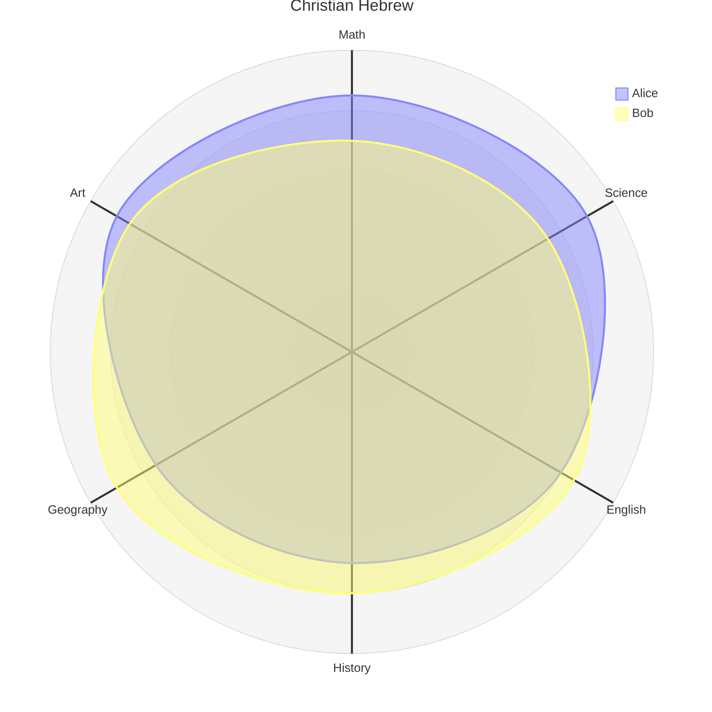

# Hebrew roots of Christianity

<!-- todo: unpublished 2026-08-12 — needs writing properly. Outstanding: the Diagram section still holds an unedited template mermaid radar chart (Alice/Bob, Math/Science/English); the Festivals section ends mid-word ("The festivals alone are t"); no scripture quote blocks, no Key Takeaways, no primary_passage. -->

Christianity recognises Jesus Christ as the Messiah, fulfillment of Old Testament prophecy, Lord and saviour. This same Old Testament is the foundation of Judaism, and was treated by Jesus as scripture when he walked on earth as a man.

How important is it to understand the Hebrew roots of Christianity. Our Lord and his apostles did. 
So we should invest time in the study of key Hebrew perspectives of scripture.

## Cautions

1. The lost tribes of Israel. Whilst it sounds attractive, it has more issues than benefits as a theology
    - It does recognise Israel as a current people, but somewhat tries to reconcile gentile Christians as the lost Jewish tribes. THis is counter to scripture which recognises the gospel for the nations

## Key features

- Shadows and types
- Torah
- Festivals
- Creation
- Prophecy

## Festivals

The festivals alone are t 

## Diagram

## Resources

- [Seven festivals by Eddie Chumney](https://www.friendsofsabbath.org/Further_Research/Holy%20Days/The-Seven-Festivals-of-the-Messiah.pdf)
- [Hebrew Roots - Eddie Chumney](https://hebroots.org/)
- [Hebrew For Christians - John Parsons](https://hebrew4christians.com/#loaded)