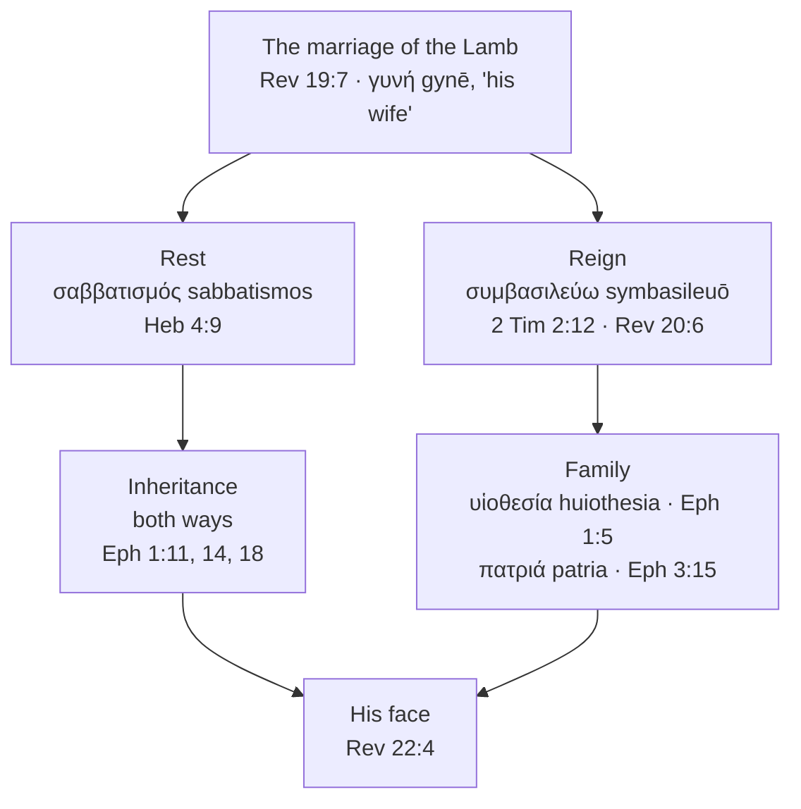

# The Wife of the Lamb

<!-- Forked verbatim from israel-and-church/bride-of-christ.md by simplify-bible-study on 2026-09-25.
Needs develop-bible-study for its own opening, In one sentence, Key Takeaways and prayer. -->

### The bride is called a wife, and Revelation says so twice

Greek has two nouns here and John uses both. νύμφη (*nymphē*, G3565) is the bride; γυνή (*gynē*,
G1135) is the woman or wife.

νύμφη occurs eight times in the New Testament, and the lexicon splits them. Three carry Louw-Nida
10.60, *daughter-in-law* — Matthew 10:35 and Luke 12:53 twice, all of them Jesus quoting Micah 7:6
on a divided household. The other five are 10.57, *bride*: John 3:29, and then **four of the five in
Revelation** — 18:23, 21:2, 21:9, 22:17. Paul never uses the noun of the church at all.

Set Revelation's four side by side, because one of them is a funeral:

- **18:23** — over Babylon: "the voice of bridegroom and bride will be heard in you no more" (ESV).
- **21:2** — the new Jerusalem, "prepared as a bride adorned for her husband."
- **21:9** — "Come, I will show you the Bride, the wife of the Lamb."
- **22:17** — "The Spirit and the Bride say, 'Come.'"

### Revelation 19:7 prints "Bride" for a word that means wife

At Revelation 19:7 the ESV prints "his Bride has made
herself ready," and the Greek behind "Bride" is **ἡ γυνὴ αὐτοῦ** (*hē gynē autou*) — *his wife*. There is no νύμφη in
that verse. Two chapters later the angel says "the Bride, the wife of the Lamb," and there the Greek
has both nouns in one phrase: τὴν νύμφην τὴν γυναῖκα τοῦ Ἀρνίου (*tēn nymphēn tēn gynaika tou
Arniou*, 21:9). The *Legacy Standard Bible* footnotes the word at 19:7 in two words: "Lit wife."

**So Scripture gives her a second title, and gives it at the point the marriage comes.**
Revelation 19:7 announces that the γάμος (*gamos*) has come and calls her His wife in the same
sentence. From there both names are hers — νύμφη at 21:2 and 22:17, γυνή at 19:7, and 21:9 setting
the two side by side in one phrase. She keeps the bridal name the way a bridegroom keeps it, with a
wife's standing under it.

So the gap between being married and being homed is the longest interval in the pattern by a wide
margin — and the bride spends it reigning. "They will be priests of God and of Christ, and they will
reign with him for a thousand years" (Revelation 20:6, ESV) is the wife's share of her husband's
standing, worked out over an age, before the new creation arrives. That reign is taken up at
[Reigning with Him](#reigning-with-him), which sits with the rest of what the marriage produces.

## What the Marriage Produces

Every wedding image in Scripture runs out at the wedding. What follows is a marriage, and the
question of what the church *is* once the feast is over has a textual answer that is easy to miss
in English.

### The name she calls Him (Hosea 2:16)

Hosea already knew what changes with the name. "In that day, declares the LORD, you will call me
'My Husband,' and no longer will you call me 'My Baal'" (Hosea 2:16, ESV). The two Hebrew words are
אִישִׁי (*ishi*, "my man," H376) and בַּעְלִי
(*baʿli*, H1180), and בַּעַל (*baʿal*) is the ownership word — master, possessor, and
the name of the Canaanite storm god she had been chasing. Isaiah uses the same root affirmingly,
calling the LORD בֹּעֲלַיִךְ (*boʿalayik*), "your husband" (Isaiah 54:5), so the root
itself is not the problem. Hosea promises a change from the title of a proprietor to the name of a
person: Israel will call God "My Husband." He seeks faithful communion with His people.

### The rest that is left over

Hebrews 4 argues through a chapter on rest using κατάπαυσις (*katapausis*), and switches once. "So then, there
remains a Sabbath rest for the people of God" (4:9, ESV) is **σαββατισμός** (*sabbatismos*, G4520),
a word that occurs nowhere else in the New Testament and nowhere in the Greek Old Testament. One
occurrence, in the whole Bible, and the author spends a chapter getting to it. [A Day Is as a
Thousand Years](../last-things/day-is-a-thousand-years.md) works the word and its Sabbath-millennium
reading through in full.

Read it alongside the wedding and it lands where the feast does. A bride's twelve months were
occupied (*m. Ketubot* 5:2); the marriage is where the preparing stops. Hebrews says the same of
you: "whoever has entered God's rest has also rested from his works as God did from his" (4:10,
ESV).

And then the instruction, which sounds backwards until you notice what it is guarding: "Let us
therefore strive to enter that rest" (4:11, ESV). The striving is to get in, and what you get in to
is the end of striving. God calls you to enter His rest and live with Him free from striving.

### Reigning with Him

συμβασιλεύω (*symbasileuō*, G4821), "to reign together with," occurs twice in the New Testament and
nowhere in the Septuagint. The promise is at 2 Timothy 2:12: "if we endure, we will also reign with
him" (ESV). The other occurrence is Paul being sarcastic with Corinth — "would that you did reign,
so that we might share the rule with you!" (1 Corinthians 4:8, ESV) — aimed at a church that thought
the reigning had already started.

Two occurrences, one of them a rebuke, is a useful proportion to keep. Revelation puts the reign
where Paul does, after the wedding: "they will be priests of God and of Christ, and they will reign
with him for a thousand years" (20:6, ESV), and past that, "they will reign forever and ever"
(22:5, ESV). The song in heaven has it in the future too — "they shall reign on the earth" (5:10,
ESV).

The wedding supplies the logic. A wife shares her husband's house, his name and his standing; that
is what a marriage was for in the culture the image comes from, and Revelation 21:9 hands the church
His name. God intends His bride to share His kingdom. Second Timothy 2:12 calls believers to endure
until that reign.

### The inheritance, and whose it is

Ephesians 1 says it three times and turns it round once. "In him we have obtained an inheritance"
(1:11). The Spirit is "the guarantee of our inheritance until we acquire possession of it" (1:14).
And then: "what are the riches of his glorious inheritance **in the saints**" (1:18, ESV) — where
the inheritance is His, and you are it.

Ephesians 1:14's "possession" is περιποίησις (*peripoiēsis*, G4047), five New Testament
occurrences, and Peter uses it of you: "a people for his own possession" (1 Peter 2:9, ESV). The
Greek Old Testament has it three times, and one of them is Malachi: "They shall be mine, says the
LORD of hosts, in the day when I make up my treasured possession" (3:17, ESV).

So the inheritance runs both directions, and the marriage image is why that is coherent rather than
confused. She receives his estate; he receives her. Peter states your side plainly — "an inheritance
that is imperishable, undefiled, and unfading, kept in heaven for you" (1 Peter 1:4, ESV) — and Paul
states the terms: "heirs of God and fellow heirs with Christ, provided we suffer with him in order
that we may also be glorified with him" (Romans 8:17, ESV). You receive God's promised inheritance
and become His people; the Spirit is your pledge of what is to come.

### Family as well as marriage, and the two do not compete

Scripture calls the church a bride, a body, a building, a flock, a priesthood and a household, and
the images are not rivals for one slot. Two of them sit right beside the bridal language in
Ephesians.

**Adoption.** υἱοθεσία (*huiothesia*) occurs five times, all in Paul, all at Louw-Nida 35.53:
Romans 8:15, 8:23, 9:4, Galatians 4:5, Ephesians 1:5. Two details matter here. Romans 9:4 gives
adoption to *Israel*, so the word is not a church-only term. And Romans 8:23 has it still future —
"we wait eagerly for adoption as sons, the redemption of our bodies" (ESV) — which is the same
already-and-not-yet shape the betrothal has. You are adopted; you are waiting for your adoption.
You are betrothed; you are waiting for your wedding.

**Household and family.** "You are fellow citizens with the saints and members of the household of
God" (Ephesians 2:19, ESV), and God is the one "from whom every family in heaven and on earth is
named" (3:15, ESV). "Family" there is πατριά (*patria*, G3965), built on πατήρ (*patēr*) — a word the Greek
Old Testament uses 174 times of a clan traced to its father, and which appears only three times in
the New Testament.

Hold the images together and none of them has to carry everything. The bride language answers what
you are *to Christ*: chosen, bought, covenanted, coming. The family language answers what you are
*in the house*: named, placed, heir. Ephesians 5:31 gives the end of the first one by quoting
Genesis — "the two shall become one flesh" — and Paul says that sentence has always been about
Christ and the church. Paul writes the same union without the wedding at 1 Corinthians 6:17: "he who
is joined to the Lord becomes one spirit with him" (ESV).

### Bought, betrothed, married, homed — and looking at His face

Revelation ends by naming all of it at once: the throne of God and of the Lamb is there, "his
servants will worship him. They will see his face, and his name will
be on their foreheads" (22:3-4, ESV). Bought, betrothed, married, homed, resting, reigning,
inheriting, and looking at His face — and the last invitation in the Bible is hers to give: "The
Spirit and the Bride say, 'Come'" (22:17, ESV).

## Discussion Questions

1. At Revelation 19:7 the word the ESV prints as "Bride" is γυνή (*gynē*), *wife*, and Hosea has God asking
   to be called "My Husband" rather than "My Master" (2:16). What does God appear to want from you
   that mere ownership would not give Him?
2. Hebrews tells you to "strive to enter that rest" (4:11) and names it with a word used nowhere
   else in the Bible (σαββατισμός, *sabbatismos*, 4:9). What in your week is effort that will end at the wedding,
   and what is effort that will not?

## References & Recommended Reading

- MACULA Greek/Hebrew morphology and Louw-Nida semantic domains (open license) — domain and
  occurrence data for παραλαμβάνω (*paralambanō*), μονή (*monē*), ἁρμόζω (*harmozō*), ἀρραβών
  (*arrabōn*), ἀπάντησις (*apantēsis*), παρίστημι (*paristēmi*), ἄμωμος (*amōmos*), λουτρόν
  (*loutron*), μυστήριον (*mystērion*), νύμφη (*nymphē*), γυνή (*gynē*), γάμος (*gamos*),
  σαββατισμός (*sabbatismos*), συμβασιλεύω (*symbasileuō*), υἱοθεσία (*huiothesia*), περιποίησις
  (*peripoiēsis*), πατριά (*patria*), and חֻפָּה (*chuppah*). Septuagint
  lemma data for ἀρραβών at Genesis 38, περιποίησις at Malachi 3:17, and the absence of
  σαββατισμός and συμβασιλεύω from the Septuagint altogether.
- unfoldingWord ULT interlinear alignment (open license) — used to establish that Revelation 19:7
  reads ἡ γυνὴ αὐτοῦ (*hē gynē autou*) where English versions print "Bride", that Revelation 21:9
  carries νύμφη and γυνή together, and the Hebrew of Hosea 2:16 (אִישִׁי,
  *ishi*, against בַּעְלִי, *baʿli*) and Isaiah 54:5
  (בֹּעֲלַיִךְ, *boʿalayik*).
- Legacy Standard Bible (The Lockman Foundation / Three Sixteen Publishing) — its translators'
  footnote at Revelation 19:7, "Lit wife," quoted with attribution as independent corroboration of
  the γυνή reading above.
- [A Day Is as a Thousand Years](../last-things/day-is-a-thousand-years.md) — σαββατισμός (*sabbatismos*) at
  Hebrews 4:9 worked through in full, with the Sabbath-millennium reading this study only points at.
