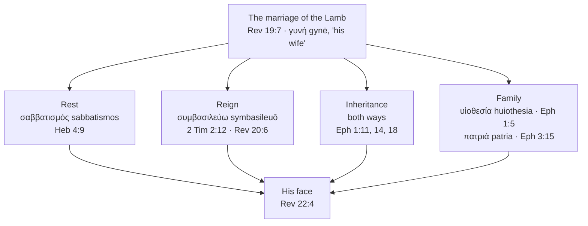

# The Wife of the Lamb

[The Bride of Christ](bride-of-christ.md) follows the wedding pattern as far as the Father's house.
Revelation keeps going. At the moment the marriage comes, John gives her a new name: the Lamb's
*wife*. A bride is promised. A wife belongs, and everything that is her husband's is hers.

**In one sentence:** When the marriage of the Lamb comes, Scripture begins calling the bride His
wife, and a wife shares what is her husband's: His rest, His reign, His inheritance, His family and,
at the last, His face.

## Key Takeaways

### Types & Prophecy

Hosea prophesies a day when Israel will call the LORD "My Husband" (Hosea 2:16, ESV), and Isaiah
promises her land a new name, "Married" (Isaiah 62:4, ESV). Those promises are Israel's, and they
are still ahead of her: "in this way all Israel will be saved" (Romans 11:26, ESV). The church's
marriage is announced first, in heaven: "the marriage of the Lamb has come, and his Bride has made
herself ready" (Revelation 19:7, ESV). Both peoples end in one city, and the angel calls that city
"the Bride, the wife of the Lamb" (Revelation 21:9, ESV).

### Lessons about Jesus

- **Jesus is the husband the prophets named.** The LORD called Himself Israel's husband (Isaiah
  54:5), and the Lamb has a wife (Revelation 19:7). Scripture gives Jesus the title God kept for
  Himself.
- **Jesus shares what is His.** His reign — "if we endure, we will also reign with him" (2 Timothy
  2:12, ESV) — and His name, written on your forehead (Revelation 22:4).
- **Jesus is the one you will see.** "They will see his face" (Revelation 22:4, ESV).

### Memory verses

> ✝️ [Revelation 19:7 (ESV)](https://www.blueletterbible.org/esv/Rev/19/7)
>
> 7 Let us rejoice and exult and give him the glory, for the marriage of the Lamb has come, and his
> Bride has made herself ready;

> ✝️ [Revelation 22:4 (ESV)](https://www.blueletterbible.org/esv/Rev/22/4)
>
> 4 They will see his face, and his name will be on their foreheads.

### Be Transformed

- **Think.** At the wedding you become His wife, and what is His is shared with you: His rest, His
  reign, His inheritance and His name (Revelation 22:4).
- **Attitude.** Hold Israel with gratitude. The God who is winning back His wife Israel (Hosea
  2:14-16) is the same God who keeps you.
- **Do.** Name one thing you are straining after that the wedding will end, and rest from it this
  week. "Whoever has entered God's rest has also rested from his works" (Hebrews 4:10, ESV).

### Prayer

Lord Jesus, Lamb of God, you bought us and you are coming for us. Thank you that your Father keeps
every promise He made to Israel, and every promise He made to us. Teach us to rest in you now, to
endure until we reign with you, and to long for the day we see your face. Let your Spirit and your
bride say, "Come."

In Jesus' name. Amen.

## Study outline

- [Bride, then wife](#bride-then-wife). The two Greek nouns, and the verse where the new one arrives.
- [One city, and every people in it](#one-city-and-every-people-in-it). Israel as the LORD's wife and the name she will call Him,
  the church as the Lamb's bride, the olive tree, and the city that carries both names.
- [What a wife shares](#what-a-wife-shares). Rest, reign, inheritance and family.
- [Looking at His face](#looking-at-his-face). Where Revelation ends.
- [Discussion questions](#discussion-questions). Five, for a group or on your own.

## Bride, then wife

### Two nouns, and where John uses them

Greek has two nouns here and John uses both. νύμφη (*nymphē*, G3565) is the bride; γυνή (*gynē*,
G1135) is the woman or wife.

νύμφη occurs eight times in the New Testament, and the lexicon splits them. Three carry Louw-Nida
10.60, *daughter-in-law* — Matthew 10:35 and Luke 12:53 twice, all of them Jesus quoting Micah 7:6
on a divided household. The other five are 10.57, *bride*: John 3:29, and then **four of the five in
Revelation** — 18:23, 21:2, 21:9, 22:17. Paul never uses the noun of the church at all.

Set Revelation's four side by side:

- **18:23** — over Babylon: "the voice of bridegroom and bride will be heard in you no more" (ESV).
- **21:2** — the new Jerusalem, "prepared as a bride adorned for her husband."
- **21:9** — "Come, I will show you the Bride, the wife of the Lamb."
- **22:17** — "The Spirit and the Bride say, 'Come.'"

### Revelation 19:7 prints "Bride" for a word that means wife

At Revelation 19:7 the ESV prints "his Bride has made
herself ready," and the Greek behind "Bride" is **ἡ γυνὴ αὐτοῦ** (*hē gynē autou*) — *his wife*. There is no νύμφη in
that verse. Two chapters later the angel says "the Bride, the wife of the Lamb," and there the Greek
has both nouns in one phrase: τὴν νύμφην τὴν γυναῖκα τοῦ Ἀρνίου (*tēn nymphēn tēn gynaika tou
Arniou*, 21:9). The *Legacy Standard Bible* footnotes the word at 19:7 in two words: "Lit wife."

**So Scripture gives her a second title, and gives it at the point the marriage comes.**
Revelation 19:7 announces that the γάμος (*gamos*) has come and calls her His wife in the same
sentence. From there both names are hers — νύμφη at 21:2 and 22:17, γυνή at 19:7, and 21:9 setting
the two side by side in one phrase. She keeps the bridal name the way a bridegroom keeps it, with a
wife's standing under it. **This shows that God means His people to belong to Him the way a wife
belongs to her husband: by covenant, in love, for good.**

## One city, and every people in it

Revelation's last vision puts Israel and the church in one city with God, and each keeps its own
name there.

### Israel is the LORD's wife, and He is bringing her home

Israel was God's wife long before the church existed. "Your Maker is your husband" (Isaiah 54:5,
ESV). She was unfaithful, and the prophets call that adultery. God's answer is to court her again:
"I will allure her, and bring her into the wilderness, and speak tenderly to her" (Hosea 2:14, ESV).
He makes "the Valley of Achor a door of hope" (2:15, ESV). Isaiah promises the same: "For a brief
moment I deserted you, but with great compassion I will gather you" (Isaiah 54:7, ESV). Her land
gets a new name: "Married" (Isaiah 62:4, ESV).

### The name she calls Him (Hosea 2:16)

Hosea says what changes when she comes back. "In that day, declares the LORD, you will call me
'My Husband,' and no longer will you call me 'My Baal'" (Hosea 2:16, ESV). The two Hebrew words are
אִישִׁי (*ishi*, "my man," H376) and בַּעְלִי
(*baʿli*, H1180), and בַּעַל (*baʿal*) is the ownership word — master, possessor, and
the name of the Canaanite storm god she had been chasing. Isaiah uses the same root affirmingly,
calling the LORD בֹּעֲלַיִךְ (*boʿalayik*), "your husband" (Isaiah 54:5), so the root
itself is not the problem. The next verse gives the reason: "I will remove the names of the Baals from her mouth"
(Hosea 2:17, ESV). The *ESV Study Bible* reads the change as separating the LORD's name from Baal's,
since Israel had fused the two (note on Hosea 2:16-17). The CSB footnotes "My Master" and the LSB
"Lit my master, my Baal", so many also hear a move from the title of a proprietor to the name of a
person. On both readings Israel will call God "My Husband," and He seeks faithful communion with
His people.

Hosea sets this "in that day" (2:16), beside a covenant in which God will "abolish the bow, the
sword, and war from the land" (2:18, ESV). A dispensational reading puts that day at Israel's
national turning, when Christ returns and "all Israel will be saved" (Romans 11:26, ESV). The *ESV
Study Bible* takes "in that day" as describing what Israel's return will be like, with no time fixed
(note on Hosea 2:16-17). On either reading the one addressed is Israel, and the promise is hers.
[Israel and the Church](israel-and-the-church.md#what-romans-11-says-is-still-ahead-for-israel) sets
out what is still ahead for her.

**This shows that God keeps a marriage covenant after His wife has broken it.** Paul borrows Hosea's
words for the Gentiles: "Those who were not my people I will call 'my people'" (Romans 9:25, ESV).
He applies Hosea's pattern to you and leaves Hosea's promise with Israel.

### The church is the Lamb's bride

The church is a second company, betrothed in this age: "I betrothed you to one husband, to present
you as a pure virgin to Christ" (2 Corinthians 11:2, ESV). Her marriage is announced in heaven at
Revelation 19:7. Only after that does heaven open for the rider on the white horse (19:11). On the
pretribulational reading this site holds, the church is already with Christ when the marriage is
announced. Israel's turning comes when He rides out, when "they look on me, on him whom they have
pierced" (Zechariah 12:10, ESV). Two events, in that order, each with its own people.

That is one Husband with two covenanted peoples. The Son is the LORD who married Israel, so the
distinction lies in the two peoples and their two relationships to Him: Israel restored as the
LORD's wife, the church married as the Lamb's bride. Readers who hold one people of God read
Revelation 21:9-14 as a single bride instead.

### The city carries both names

The angel promises "the Bride, the wife of the Lamb" and shows John a city (Revelation 21:9-10).
Three companies appear on it and around it:

- **On the gates**, "the names of the twelve tribes of the sons of Israel" (21:12, ESV).
- **On the foundations**, "the twelve names of the twelve apostles of the Lamb" (21:14, ESV) — the
  apostles the church is "built on" (Ephesians 2:20, ESV).
- **Around it**, the nations: "By its light will the nations walk" (21:24, ESV).

Israel, the church and the nations carry the same three names Paul uses in 1 Corinthians 10:32:
"Give no offense to Jews or to Greeks or to the church of God" (ESV). In Paul's verse the Jews and
Greeks still stand outside the church; in John's city all three are redeemed. Israel and the
apostles are named on it, and the nations walk in its light.

The voice from the throne quotes the covenant promise, "you shall be my people" (Leviticus 26:12;
Ezekiel 37:27, ESV), and changes one word. The Greek of Revelation 21:3 in the SBL Greek New
Testament reads λαοὶ αὐτοῦ (*laoi autou*), "his peoples", plural. The CSB prints "his peoples"; the
ESV prints "his people", and the CSB footnotes that other manuscripts have the singular. On the
plural reading, the nations of 21:24 belong to God as fully as Israel does, and every people in the
city is His.

Hebrews names who lives in "the city of the living God, the heavenly Jerusalem" (Hebrews 12:22,
ESV): "the assembly of the firstborn who are enrolled in heaven" and "the spirits of the righteous
made perfect" (12:23, ESV). Many dispensational readers take those as two companies, the church and the
Old Testament saints. The *NIV Biblical Theology Study Bible* takes them as one group (note on
12:23), so this is contested. Abraham is in the city on either reading. He "was looking forward to
the city that has foundations, whose designer and builder is God" (Hebrews 11:10, ESV).

### Grafted in, and the Jerusalem above

Paul draws the same picture as a tree. Gentile believers are "a wild olive shoot ... grafted in among
the others" who "now share in the nourishing root of the olive tree" (Romans 11:17, ESV), and the
natural branches will be "grafted back into their own olive tree" (11:24, ESV). One tree, two kinds
of branch, each kept distinct: the same shape as the city whose gates carry Israel's names and whose
foundations carry the apostles'. Paul says where the tree is heading: "all Israel will be saved"
(11:26, ESV). [Israel and the Church](israel-and-the-church.md#the-olive-tree-of-romans-11) works
through the olive tree in full.

Paul also names the city. "The Jerusalem above is free, and she is our mother" (Galatians 4:26, ESV).
Then he quotes Isaiah 54:1: "Rejoice, O barren one who does not bear ... For the children of the
desolate one will be more than those of the one who has a husband" (Galatians 4:27, ESV). That is the
chapter in which the LORD tells Israel, "your Maker is your husband" (Isaiah 54:5). Paul applies
Isaiah's pattern, God giving children to the barren, to the children born through the gospel, the way
he applies Hosea at Romans 9:25. Israel keeps her own promise in the same chapter: "with great
compassion I will gather you" (Isaiah 54:7, ESV).

Read Galatians 4 on its own terms. Of Hagar and Sarah Paul says, "these women are two covenants. One
is from Mount Sinai, bearing children for slavery" (4:24, ESV). The contrast is law and promise, and
it runs through both peoples: Paul, a Jew, writes "we are not children of the slave but of the free
woman" (4:31, ESV), and "you, brothers, like Isaac, are children of promise" (4:28, ESV). The *ESV
Study Bible* reads 4:26-27 as making all believers "the true Israel" (note on 4:26-27). That is the
reading of those who hold one people of God. This site reads Israel in Romans 11 as the nation, as
[Israel and the Church](israel-and-the-church.md#the-case-for-reading-the-church-as-israel) argues.

**This shows that God builds one household without erasing a name.** Every child of promise has the
Jerusalem above for a mother, and Israel's own branches are waiting to be grafted back in.

### Why the whole city is called the bride

Revelation 21:2 answers with a simile: it comes down
"prepared as a bride adorned for her husband" (ESV). On the dispensational reading the church is the
bride, the city is her home, and she shares it with Israel and the nations. The *ESV Study Bible*
reads the tribes and apostles as "the unity of OT and NT believers" (note on 21:12-14). Both readings
put every redeemed person in one city, with one God and one Lamb. They differ over whether the names
on the gates still mark distinct peoples, and the plural of 21:3 fits the reading that says they do.

One verb runs through the preparations. Jesus said, "I go to prepare a place for you" (John 14:2,
ESV). Hebrews says God "has prepared for them a city" (11:16, ESV), of Abraham and the patriarchs.
The city comes down "prepared as a bride" (Revelation 21:2). The bride "has made herself ready"
(19:7). All four use ἑτοιμάζω (*hetoimazō*, G2090). Three of them prepare the home, and the fourth
prepares the bride who will live in it. Reading John 14:2's "place" as this city is the dispensational
reading, and an inference. The same verb gives Israel her own refuge in the tribulation, "a place
prepared by God" for the woman in the wilderness (12:6, ESV). It is a common verb, forty times in the
New Testament, so the link is in what God prepares: a place for each people He has promised to keep.

**This shows that God keeps every promise He made, to every people He made it to.** Israel gets back
the Husband she left. The church gets the Husband who bought her. You will live in a city whose
gates carry Israel's names, and you will be glad of every one of them.

## What a wife shares

Once she is His wife, what is His is hers. Much of it she shares with every people in the city —
the reign, the service, the sight of His face. What is hers is to receive it as His wife.

### The rest that is left over

Hebrews 4 argues through a chapter on rest using κατάπαυσις (*katapausis*), and switches once. "So then, there
remains a Sabbath rest for the people of God" (4:9, ESV) is **σαββατισμός** (*sabbatismos*, G4520),
a word that occurs nowhere else in the New Testament and nowhere in the Greek Old Testament. One
occurrence, in the whole Bible, and the author spends a chapter getting to it. [A Day Is as a
Thousand Years](../last-things/day-is-a-thousand-years.md) works the word and its Sabbath-millennium
reading through in full.

A bride's twelve months were
occupied (*m. Ketubot* 5:2); the marriage is where the preparing stops. Hebrews says the same of
you: "whoever has entered God's rest has also rested from his works as God did from his" (4:10,
ESV).

And then the instruction: "Let us
therefore strive to enter that rest" (4:11, ESV). The striving is to get in, and what you get in to
is the end of striving. God calls you to enter His rest and live with Him free from striving.

### Reigning with Him

συμβασιλεύω (*symbasileuō*, G4821), "to reign together with," occurs twice in the New Testament and
nowhere in the Septuagint. The promise is at 2 Timothy 2:12: "if we endure, we will also reign with
him" (ESV). The other occurrence is Paul being sarcastic with Corinth — "would that you did reign,
so that we might share the rule with you!" (1 Corinthians 4:8, ESV) — aimed at a church that thought
the reigning had already started.

Revelation puts the reign
where Paul does, in the future: "they will be priests of God and of Christ, and they will reign
with him for a thousand years" (20:6, ESV), and past that, "they will reign forever and ever"
(22:5, ESV). The song in heaven has it in the future too — "they shall reign on the earth" (5:10,
ESV), in the Greek text the ESV follows; the SBL Greek New Testament reads the present, "they reign".

A wife shares her husband's house, his name and his standing; that
is what a marriage was for in the culture the image comes from, and Revelation 22:4 puts His name on
their foreheads. God intends His bride to share His kingdom. Second Timothy 2:12 calls believers to endure
until that reign.

### The inheritance, and whose it is

Ephesians 1 says it three times and turns it round once. "In him we have obtained an inheritance"
(1:11). The Spirit is "the guarantee of our inheritance until we acquire possession of it" (1:14).
And then: "what are the riches of his glorious inheritance **in the saints**" (1:18, ESV) — where
the inheritance is His, and you are it.

Ephesians 1:14's "possession" is περιποίησις (*peripoiēsis*, G4047), five New Testament
occurrences, and Peter uses it of you: "a people for his own possession" (1 Peter 2:9, ESV). The
Greek Old Testament has it three times, and one of them is Malachi: "They shall be mine, says the
LORD of hosts, in the day when I make up my treasured possession" (3:17, ESV).

So the inheritance runs both directions. She receives his estate; he receives her. Peter states your side plainly — "an inheritance
that is imperishable, undefiled, and unfading, kept in heaven for you" (1 Peter 1:4, ESV) — and Paul
states the terms: "heirs of God and fellow heirs with Christ, provided we suffer with him in order
that we may also be glorified with him" (Romans 8:17, ESV). You receive God's promised inheritance
and become His people; the Spirit is your pledge of what is to come.

### Family as well as marriage

Scripture calls the church a bride, a body, a building, a flock, a priesthood and a household. Two of them sit right beside the bridal language in
Ephesians.

**Adoption.** υἱοθεσία (*huiothesia*) occurs five times, all in Paul, all at Louw-Nida 35.53:
Romans 8:15, 8:23, 9:4, Galatians 4:5, Ephesians 1:5. Romans 9:4 gives
adoption to *Israel*, so the word is not a church-only term. And Romans 8:23 has it still future —
"we wait eagerly for adoption as sons, the redemption of our bodies" (ESV) — which is the same
already-and-not-yet shape the betrothal has. You are adopted; you are waiting for your adoption.
You are betrothed; you are waiting for your wedding.

**Household and family.** "You are fellow citizens with the saints and members of the household of
God" (Ephesians 2:19, ESV), and God is the one "from whom every family in heaven and on earth is
named" (3:15, ESV). "Family" there is πατριά (*patria*, G3965), built on πατήρ (*patēr*) — a word the Greek
Old Testament uses 174 times of a clan traced to its father, and which appears only three times in
the New Testament.

The bride language answers what
you are *to Christ*: chosen, bought, covenanted, coming. The family language answers what you are
*in the house*: named, placed, heir. Ephesians 5:31 gives the end of the first one by quoting
Genesis 2:24 — "the two shall become one flesh" — and Paul says that sentence has always been about
Christ and the church. Paul writes the same union without the wedding at 1 Corinthians 6:17: "he who
is joined to the Lord becomes one spirit with him" (ESV). **This shows that God wants you both ways:
loved as a bride, and placed in His house as a child and an heir.**

## Looking at His face

Revelation ends by naming all of it at once: the throne of God and of the Lamb is there, "his
servants will worship him. They will see his face, and his name will
be on their foreheads" (22:3-4, ESV). Bought, betrothed, married, homed, resting, reigning,
inheriting, and looking at His face — and the last invitation in the Bible is hers to give: "The
Spirit and the Bride say, 'Come'" (22:17, ESV).

That face is where the whole story ends, and you will see it.

## Discussion Questions

1. God promises that Israel will call Him "My Husband" in place of "My Baal" (Hosea 2:16-17). What
   does that show about what God wants from His people, and how does Paul carry the pattern to you
   (Romans 9:25)?
2. The city's gates carry the names of Israel's tribes and its foundations the names of the apostles
   (Revelation 21:12-14). Why would God keep both sets of names on one city, and what does that say
   about the way He keeps promises?
3. Paul says you are adopted, and also that you "wait eagerly for adoption as sons" (Romans 8:23,
   ESV). How does being a child in God's house sit alongside being the Lamb's bride?
4. Hebrews 12:23 names "the assembly of the firstborn" and "the spirits of the righteous made
   perfect." Read them as one company and then as two. What changes, and what stays the same?
5. Hebrews tells you to "strive to enter that rest" (4:11) and names it with a word used nowhere else
   in the Bible (σαββατισμός, *sabbatismos*, 4:9). What in your week is effort that will end at the
   wedding, and what is effort that will not?

## References & Recommended Reading

### Ancient sources

- *Mishnah Ketubot* 5:2 (the twelve-month preparation period, for both parties), quoted from
  **"Mishnah Yomit" translated by Dr. Joshua Kulp, licensed CC-BY**, retrieved through
  `references/build/sefaria.py` from the Sefaria-Export dataset.

### Study Bibles, translations and text data

- MACULA Greek/Hebrew morphology and Louw-Nida semantic domains (open license) — domain and
  occurrence data for νύμφη (*nymphē*), γυνή (*gynē*), γάμος (*gamos*), σαββατισμός
  (*sabbatismos*), συμβασιλεύω (*symbasileuō*), υἱοθεσία (*huiothesia*), περιποίησις
  (*peripoiēsis*), πατριά (*patria*) and ἑτοιμάζω (*hetoimazō*); the SBL Greek New Testament text of
  Revelation 21:3 (λαοὶ αὐτοῦ). Septuagint lemma data for περιποίησις at Malachi 3:17, and the
  absence of σαββατισμός and συμβασιλεύω from the Septuagint altogether.
- unfoldingWord ULT interlinear alignment (open license) — used to establish that Revelation 19:7
  reads ἡ γυνὴ αὐτοῦ (*hē gynē autou*) where English versions print "Bride", that Revelation 21:9
  carries νύμφη and γυνή together, and the Hebrew of Hosea 2:16 (אִישִׁי,
  *ishi*, against בַּעְלִי, *baʿli*) and Isaiah 54:5
  (בֹּעֲלַיִךְ, *boʿalayik*).
- Legacy Standard Bible (The Lockman Foundation / Three Sixteen Publishing) — its translators'
  footnote at Revelation 19:7, "Lit wife," quoted with attribution as independent corroboration of
  the γυνή reading above.
- ESV Study Bible (Crossway) — verse text (ESV) and notes on Hosea 2:16-17 and Revelation 21:12-14,
  quoted briefly with attribution.
- CSB Ancient Faith Study Bible (Holman) — its CSB text of Revelation 21:3, "his peoples", and the
  translators' footnote that other manuscripts read "people".
- NIV Biblical Theology Study Bible (Zondervan) — note on Hebrews 12:23, cited for the one-company
  reading.

### On this site

- [The Bride of Christ](bride-of-christ.md) — the betrothal pattern this study continues from.
- [Israel and the Church](israel-and-the-church.md) — the three-group reading of 1 Corinthians
  10:32, and what Romans 11 says is still ahead for Israel.
- [A Day Is as a Thousand Years](../last-things/day-is-a-thousand-years.md) — σαββατισμός (*sabbatismos*) at
  Hebrews 4:9 worked through in full, with the Sabbath-millennium reading this study only points at.
