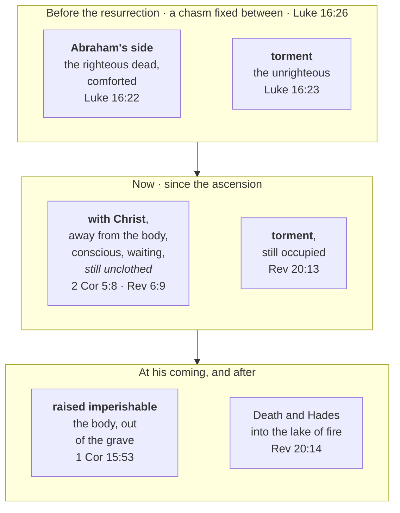
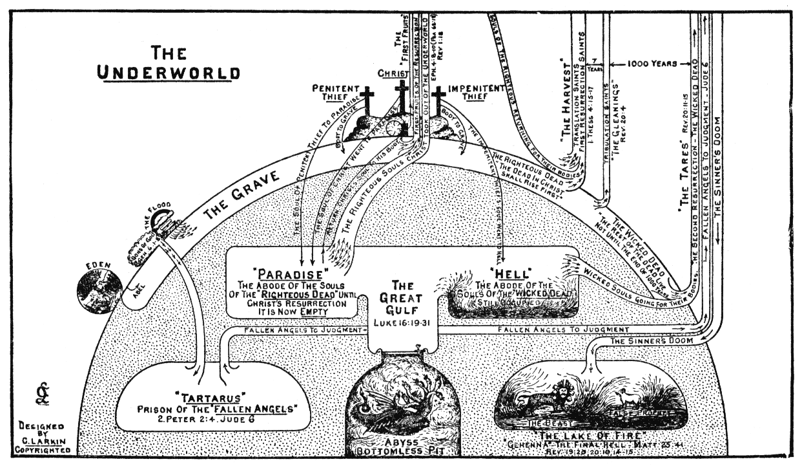
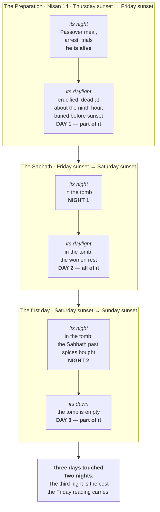

# Three Days and Three Nights

Asked for a sign that he was the Messiah, Jesus refused the request and answered it in the same
breath: no sign except Jonah. "Three days and three nights in the heart of the earth" is a
quotation, and Jonah's own account of those days calls the place Sheol and the pit. The sentence is
about where he was going and who would bring him back.

This study follows it in that order — what the sign is, where the New Testament says he was, and
what those days achieved. Then, whether the crucifixion and resurrection can be dated.

## Key Takeaways

*(This section follows the [Key Takeaways](../about/key-takeaways.md) format this site is
prototyping — see that page for what each part is for and why.)*

### Types & Prophecy

**Type.** Jonah in the fish is the pattern Jesus names for himself, and he names it outright
(Matthew 12:40, quoting Jonah 2:1 word for word as the Greek Old Testament has it). What the type
carries is burial and emergence. Jonah's own prayer says so: the fish's belly is "the belly of
Sheol," the place is "the pit," and God does not release him but *brings him up* (Jonah 2:2-6).
Jesus even takes the noun — Jonah is "in the heart of the seas," he will be "in the heart of the
earth."

A second type runs underneath the dates. The three days fall across three consecutive appointed
times in Leviticus 23, and Paul names Christ as the fulfilment of the outer two: "Christ, our
Passover lamb, has been sacrificed" (1 Corinthians 5:7), and "Christ has been raised… the
firstfruits" (1 Corinthians 15:20) — the sheaf Leviticus 23:11 commands to be waved "on the day
after the Sabbath."

**Prophecy.** Psalm 16:10 is a stated prediction rather than a resemblance, and Peter says so in the
first Christian sermon: David "foresaw and spoke about the resurrection of the Christ, that he was
not abandoned to Hades, nor did his flesh see corruption" (Acts 2:31).

### Lessons about Jesus

- He answered a demand for proof by pointing at his own burial. The sign he gave was the one thing
  his questioners could not have asked for.
- He named the place he was going before he went there, and he named it from Scripture rather than
  from himself.
- He came back holding what had held him: "I have the keys of Death and Hades" (Revelation 1:18).

### Memory verses

> ✝️ Matthew 12:40 (ESV)
>
> 40 For just as Jonah was three days and three nights in the belly of the great fish, so will the
> Son of Man be three days and three nights in the heart of the earth.

> ✝️ Revelation 1:18 (ESV)
>
> 18 and the living one. I died, and behold I am alive forevermore, and I have the keys of Death
> and Hades.

### Be Transformed

- **Think.** The scribes had the sign of Jonah in their own Scriptures and asked for a different
  one. The request "show me something" is rarely about evidence; it is usually about wanting
  evidence of a kind that costs nothing to accept.
- **Attitude.** Where the pieces do not sit flat — and in this study they do not, at two points —
  the honest move is to say which reading you hold and what it costs you, not to hold it because
  the costs were never totalled.
- **Do.** Name one thing you are waiting on more evidence for before you act on what you already
  know. That is the demand for a sign, and it has already been answered.

### Prayer

Lord Jesus, you have already given more than enough testimony of who you are and of your
redemption plan. Help me to understand the signs and wonders already given in Scripture. Forgive me
when I doubt and ask for more evidence.

You were dead and now you are alive forevermore. I trust you as my Saviour and my God — the one who
conquered death itself.

Amen.

## The sign, and what Jonah said it was

Jesus is not making a general comparison. He is quoting, and the quotation is exact: Matthew 12:40
reproduces the Septuagint of Jonah 2:1 word for word — *ἦν Ἰωνᾶς ἐν τῇ κοιλίᾳ τοῦ κήτους τρεῖς
ἡμέρας καὶ τρεῖς νύκτας*, "Jonah was in the belly of the sea creature three days and three nights."
This project's own quotation detection scores that link at 24, its highest tier, corroborated by the
inherited cross-reference lists as well. (The verse is Jonah 1:17 in English Bibles and 2:1 in the
Hebrew and the Greek — a numbering difference the NLT, the Legacy Standard Bible and others footnote
at that verse. References here follow whichever text is being cited.)

Jonah interprets his own three days, in the prayer that follows immediately — and he does not
describe a fish. He describes death.

> ✝️ Jonah 2:2-6 (ESV)
>
> 2 saying, "I called out to the LORD, out of my distress, and he answered me; out of the belly of
> Sheol I cried, and you heard my voice. 3 For you cast me into the deep, into the heart of the
> seas, and the flood surrounded me; all your waves and your billows passed over me… 6 at the roots
> of the mountains. I went down to the land whose bars closed upon me forever; yet you brought up my
> life from the pit, O LORD my God."

**The belly of the fish is "the belly of Sheol."** The place is "the pit," a land with bars that
close. And what God does is not *release* him but *bring him up* — וַתַּעַל,
from עָלָה (*ʿalah*), the ordinary verb for going or bringing up. Nothing in
the word itself carries resurrection; the burial is carried by everything around it. Jonah's three
days are a death and a raising, described as such by the man they happened to.

**And one word travels from Jonah's prayer into Jesus's sentence.** Jonah 2:3 in English (2:4 in the
Hebrew) puts him "in the heart of the seas" — בִּלְבַב יַמִּים, which the
Septuagint renders **καρδίας θαλάσσης**. Jesus says he will be in the **καρδίᾳ τῆς γῆς**, "the heart
of the earth." He has taken the noun out of the passage he is quoting and moved it from the sea to
the ground.

The sign of Jonah is about where Jesus is going and who brings him back — and Jesus says as much in
the same breath, calling it the *only* sign this generation will get (Matthew 12:39) and adding that
"something greater than Jonah is here" (12:41).

## Three days, three appointed times

The span is not an arbitrary interval. It lands on three consecutive festivals in Leviticus 23, and
the New Testament names Christ as the fulfilment of the first and the third by name.

| Appointed time | Leviticus 23 | That week | Named of Christ |
|---|---|---|---|
| **Passover** | 23:5, Nisan 14 | the crucifixion | "Christ, our Passover lamb, has been sacrificed" (1 Corinthians 5:7) |
| **Unleavened Bread** | 23:6, from Nisan 15 | the body in the tomb, on the Sabbath | — |
| **Firstfruits** | 23:10-11 | the resurrection | "Christ has been raised from the dead, the firstfruits of those who have fallen asleep" (1 Corinthians 15:20; cf. 15:23) |

The third row carries a date instruction that decides the day of the week:

> ✝️ Leviticus 23:11 (ESV)
>
> 11 and he shall wave the sheaf before the LORD, so that you may be accepted. On the day after the
> Sabbath the priest shall wave it.

**"On the day after the Sabbath"** — the first day of the week. The sheaf of the first-cut harvest
was lifted before the LORD on the morning the tomb was found empty, and Paul calls Christ *the
firstfruits* using that feast's own noun. So the resurrection does not merely happen to fall on a
Sunday; on this reckoning it falls on the appointed day for the offering it fulfils.

That is a better answer to "why three days" than any arithmetic, and it is the reason the interval
is fixed rather than approximate: it is bounded by two feasts, with the Sabbath sitting between
them. This site has no study on Firstfruits yet — it is an open item — so the point is made here
rather than cross-referenced.

## Sheol and Hades: one place, two languages

English hands the reader four words here — Sheol, Hades, hell, the grave — where the Bible is
largely using one idea, so the vocabulary has to be fixed before the question can be asked.

**The New Testament settles the equation itself, by quoting.** Peter quotes Psalm 16:10 at Acts
2:27, and the ESV renders each in its own language:

> ✝️ Psalm 16:10 (ESV)
>
> 10 For you will not abandon my soul to Sheol, or let your holy one see corruption.

> ✝️ Acts 2:27 (ESV)
>
> 27 For you will not abandon my soul to Hades, or let your Holy One see corruption.

One sentence, quoted once. Where the Hebrew has שְׁאוֹל (*sheol*), the Greek
has **ᾅδης** (*hadēs*) — and that is not Peter's innovation but the Septuagint's standing practice,
which the Greek Old Testament follows from Genesis onward.

**Sheol is not the wicked's destination alone.** This is the point most likely to be missed by a
reader carrying a modern "hell" into the word. Jacob, mourning Joseph, expects to go there:

> ✝️ Genesis 37:35 (ESV)
>
> 35 All his sons and all his daughters rose up to comfort him, but he refused to be comforted and
> said, "No, I shall go down to Sheol to my son, mourning." Thus his father wept for him.

The Hebrew is שְׁאֹלָה and the Septuagint renders it εἰς ᾅδης. A patriarch
expects Sheol; so does his righteous son. Whatever Sheol is in the Old Testament, it is where the
dead are, not where the damned alone are.

**And one narrative shows the arrangement from the inside.** When Saul has the medium at En-dor
call up Samuel, the account is unusually specific about the state of the dead, and the details all
point one way.

> ✝️ 1 Samuel 28:13-15 (ESV)
>
> 13 The king said to her, "Do not be afraid. What do you see?" And the woman said to Saul, "I see a
> god coming up out of the earth." 14 He said to her, "What is his appearance?" And she said, "An old
> man is coming up, and he is wrapped in a robe." And Saul knew that it was Samuel, and he bowed with
> his face to the ground and paid homage. 15 Then Samuel said to Saul, "Why have you disturbed me by
> bringing me up?"

Four things. **The direction is up, out of the earth.** עָלָה (*ʿalah*,
H5927), the ordinary verb for going or bringing up, runs five times through these eight verses
(28:8, 11 twice, 13, 14, 15) — Samuel's own word for what has been done to him is
לְהַעֲלוֹת, its hiphil. It is the same verb Jonah uses when God "brought up
my life from the pit," and neither text leans on it to carry theology; both simply assume the dead
are *down*. **Samuel is
recognisably himself**, an old man in the robe that was his characteristic garment (1 Samuel 15:27)
— identity and appearance persist. **He was at rest and resents the interruption**: "why have you
*disturbed* me," רָגַז (*ragaz*), to be agitated. And the woman calls what
she sees אֱלֹהִים — the *ESV Study Bible* notes the plural form here and that
the term "is used of the spirits of the dead in ancient Near Eastern texts."

**Then the line that bears on this study.** Samuel tells Saul: "tomorrow you and your sons shall be
**with me**" (28:19). Saul is a king under judgment, about to die on Mount Gilboa by his own hand.
Samuel is a prophet who died in honour. And they are going to the same place.

That sentence is hard to fit into a straight heaven-and-hell reading of the afterlife, which would
have to put Saul in heaven with Samuel. It sits naturally in the picture Luke 16 will later draw:
one realm of the dead holding both, in conditions that are not the same. The minimal reading — "you
will be dead as I am dead" — is available and should be granted, but even that concedes a common
place and state for the righteous and the unrighteous dead, which is the point at issue.

(Whether it was truly Samuel has been debated since antiquity. This study follows the narrator, who
simply calls him Samuel throughout and reports a prophecy that came true. The *ESV Study Bible*
concludes the same — "it is hard to think that the narrator thought this was a deceptive illusion" —
as do the *NIV Biblical Theology* and *Cultural Backgrounds* volumes.)

**And Hades is temporary.** It occurs ten times in the New Testament (Matthew 11:23; 16:18;
Luke 10:15; 16:23; Acts 2:27, 31; Revelation 1:18; 6:8; 20:13, 14), and the last two are its end:
Hades "gave up the dead who were in them," and then "Death and Hades were thrown into the lake of
fire" (Revelation 20:13-14). A place that is emptied and then destroyed is a holding place, not a
final one — which is the frame the rest of this section needs.

## Abraham's side, paradise, and the great chasm

Jesus describes the far side of death once at length, in Luke 16, and the description is the reason
this question has a traditional answer at all.

> ✝️ Luke 16:22-23, 26 (ESV)
>
> 22 The poor man died and was carried by the angels to Abraham's side. The rich man also died and
> was buried, 23 and in Hades, being in torment, he lifted up his eyes and saw Abraham far off and
> Lazarus at his side… 26 And besides all this, between us and you a great chasm has been fixed, in
> order that those who would pass from here to you may not be able, and none may cross from there to
> us.

**"Abraham's side" is κόλπος — literally his bosom or lap.** The familiar
phrase "Abraham's bosom" comes from the KJV and survives in the WEB; the ESV has "side," and the CSB
footnotes the idiom precisely: "lit *to the fold of Abraham's robe*." It is the posture of the
guest reclining nearest the host at a feast, which is the same word John uses of the beloved disciple
at the last supper (John 13:23) and of the Son "at the Father's side" (John 1:18).

**The lexicographers treat it as a place-name, and that is the load-bearing observation here.**
Louw-Nida's semantic domain 1 is *geographical objects and features*, and three entries sit in it
almost adjacently:

| Domain | Word | Where |
|---|---|---|
| **1.14** | παράδεισος, *paradise* | Luke 23:43; 2 Corinthians 12:4; Revelation 2:7 |
| **1.16** | κόλπος Ἀβραάμ, *Abraham's side* | Luke 16:22, 23 |
| **1.19** | ᾅδης, *Hades* | ten times |

At Luke 16:22 the annotation tags **both** words — κόλπος and Ἀβραάμ — with the same code, 1.16,
which is a lexicographer's way of saying the two words are functioning as one name for one location
rather than as a description of a patriarch's chest. Whatever else Luke 16 is doing, its own
vocabulary is spatial: two conditions, a fixed chasm between them, and each visible from the other.

**The traditional reading takes those as two compartments of one Hades**, the righteous dead held in
comfort at Abraham's side and the unrighteous in torment, separated but within sight. It is the
historic dispensational position, and this study holds it, for three reasons: Sheol in the Old
Testament genuinely receives the righteous (Genesis 37:35), Luke 16 places the whole scene in
ᾅδης with a chasm *inside* it rather than between earth and heaven, and Hades is a place Revelation
later empties and destroys.

**It should be said plainly that the commentaries on this site's shelf mostly read it otherwise.**
The *ESV Study Bible* takes Abraham's side as "the fellowship of other believers already in heaven"
and the chasm as "the unbridgeable gulf between heaven and hell"; the *NIV Biblical Theology Study
Bible* has it as "the prominent place next to Abraham, reclining at the heavenly feast." Both also
note the caution that Luke 16 is a parable and its details should not be pressed too far. The
*Cultural Backgrounds Study Bible* supplies what supports the older reading: Second Temple Jewish
stories and artwork did depict angels escorting the righteous to paradise, so the two-compartment
picture is the furniture Jesus's hearers brought with them rather than a later Christian
construction. That is the honest state of it — a position held, with the disagreement named.

## Which paradise did Jesus and the thief go to?

To the dying thief Jesus names a destination and a time:

> ✝️ Luke 23:43 (ESV)
>
> 43 And he said to him, "Truly, I say to you, today you will be with me in paradise."

*Today* — on the day of the crucifixion, not after three days. So wherever paradise is, Christ was
there on the Friday.

**παράδεισος occurs three times in the New Testament, and the other two locate it in heaven.** Paul
is "caught up to the third heaven" and "caught up into paradise" (2 Corinthians 12:2-4), and John's
tree of life stands "in the paradise of God" (Revelation 2:7). Both were written after the
ascension. Luke 23:43 was spoken before it. That gap is the whole question.

**And John sharpens it three days later:**

> ✝️ John 20:17 (ESV)
>
> 17 Jesus said to her, "Do not cling to me, for I have not yet ascended to the Father; but go to my
> brothers and say to them, 'I am ascending to my Father and your Father, to my God and your God.'"

Two things in the Greek before the readings. **Μή μου ἅπτου** is *mē* with a present imperative,
which forbids a continuing action rather than starting one — "stop clinging," as the ESV's "do not
cling" and the *NIV Biblical Theology Study Bible*'s "Stop clinging to me" both render it. It is not
a rule about contact: minutes later the other women "took hold of his feet" (Matthew 28:9), and a
week after that Thomas is invited to put his hand in Jesus's side (John 20:27). Matthew's verb there
is κρατέω, and Louw-Nida files it in the same domain as John's ἅπτω here — Mary was holding on, and
was told to let go. **ἀναβέβηκα** is a perfect: the ascension had not happened.

Two readings follow, and they are the two answers to this question.

- **Paradise was in Hades, and moved.** On the two-compartment reading, Christ went on the Friday to
  where the righteous dead were held, which is what Luke 23:43 promises the thief; the ascension then
  relocated paradise upward, which is why Paul and John find it in the third heaven. John 20:17 is
  straightforwardly true on this reading: he had been to paradise and had not yet been to the Father.
- **Paradise is the Father's presence, and did not move.** The *ESV Study Bible* takes this line, and
  reads John 20:17 as denying only the *bodily* ascension: Christ's spirit went to the Father at the
  moment of death, while his body rose on the Sunday and ascended forty days later. On this reading
  Luke 23:43 and Revelation 2:7 name the same place throughout.

This study holds the first, on the strength of the section above — but the second is not a
harmonisation invented to escape a problem, and the honest note is that John 20:17 fits both. What
neither reading permits is the popular third one, that Jesus was somehow untouchable until he had
been to heaven. Matthew 28:9 rules it out in the same twenty-four hours.

## What those days achieved

Three claims, each stated plainly somewhere rather than inferred from the span.

**Death's holder was destroyed, and its hostages freed.** "That through death he might destroy the
one who has the power of death, that is, the devil, and deliver all those who through fear of death
were subject to lifelong slavery" (Hebrews 2:14-15). The mechanism is *through death* — not around
it.

**The authority changed hands.** "I died, and behold I am alive forevermore, and I have the keys of
Death and Hades" (Revelation 1:18). Keys are held by whoever opens and shuts; the sentence reports a
transfer. And the transfer has a terminus: the Hades whose keys he holds is the Hades that
Revelation 20:14 destroys.

**And the resurrection is the first of a harvest, not a solitary marvel.** That is the force of the
firstfruits language above: a sheaf is waved because a field is coming. "Christ the firstfruits,
then at his coming those who belong to Christ" (1 Corinthians 15:23).

### Did the descent empty Abraham's side?

This is the question the two-compartment reading raises and the one where its evidence is thinnest,
so it gets its own answer rather than an assumption.

> ✝️ Ephesians 4:8-10 (ESV)
>
> 8 Therefore it says, "When he ascended on high he led a host of captives, and he gave gifts to
> men." 9 (In saying, "He ascended," what does it mean but that he had also descended into the lower
> regions, the earth? 10 He who descended is the one who also ascended far above all the heavens,
> that he might fill all things.)

Read as a descent into Hades that returns leading the Old Testament saints upward, this is the
proof-text for the emptying of Abraham's side. **Both halves of that reading are contested, and the
contesting is not fringe.** The CSB footnotes verse 9's genitive as "Or *the lower parts, namely, the
earth*" — which makes the descent the incarnation, not a journey below the ground, and the *ESV
Study Bible* takes it exactly that way. On the captives, the *ESV Study Bible* judges them "most
likely demons" and the *NIV Biblical Theology Study Bible* "the spiritual powers Christ conquered by
the cross," pointing at Colossians 2:15; the latter states outright that the passage "probably does
not refer to Christ's descent into Hades."

So the answer this study gives is a qualified one. That the righteous dead are now with Christ rather
than waiting below is taught clearly enough elsewhere — "away from the body and at home with the
Lord" (2 Corinthians 5:8) — and the two-compartment reading has a natural moment for that change.
But Ephesians 4:8 is a weaker witness to it than it is usually made to carry, and a reader should
know that the verse most often quoted for the emptying of Abraham's side is one its own commentators
mostly read another way.

### What is still owed: the body

Whatever changed for the righteous dead at the ascension, it was a change of *address*, not of
condition — and the distinction matters, because it is easy to read "the descent emptied Abraham's
side" as though the resurrection of believers had therefore already happened. It has not. The body
is still owed.

**Paul is explicit that the state he expects at death is a disembodied one, and that he does not
much like it.**

> ✝️ 2 Corinthians 5:3-4, 8 (ESV)
>
> 3 if indeed by putting it on we may not be found naked. 4 For while we are still in this tent, we
> groan, being burdened—not that we would be unclothed, but that we would be further clothed, so
> that what is mortal may be swallowed up by life… 8 Yes, we are of good courage, and we would
> rather be away from the body and at home with the Lord.

"Away from the body and at home with the Lord" is the gain, and "far better" than staying
(Philippians 1:23). But verse 4 says what he actually wants, and it is not to be *unclothed* — it is
to be *further clothed*. Being with Christ without a body is better than here; it is not the end.

**Revelation shows that state still running, long after the ascension.** The martyrs under the fifth
seal are conscious, vocal, and explicitly *waiting*: "they were each given a white robe and told to
rest a little longer, until the number of their fellow servants and their brothers should be
complete" (Revelation 6:9-11). They are with God and they are not yet raised.

**The raising is a separate, future, bodily event.** "The dead in Christ will rise first. Then we who
are alive… will be caught up together with them in the clouds" (1 Thessalonians 4:16-17) — and what
rises is a body: "this perishable body must put on the imperishable, and this mortal body must put
on immortality" (1 Corinthians 15:53). Notice the sequence in 1 Thessalonians 4:14: God will "bring
*with* him those who have fallen asleep," and *then* their dead rise. The person comes with Christ;
the body comes out of the ground.

So there are three states in view, not two:

| | The body | Where the person is |
|---|---|---|
| **Alive now** | mortal — "this tent" | "at home in the body… away from the Lord" (2 Corinthians 5:6) |
| **Died, before his coming** | in the grave | "away from the body and at home with the Lord" (2 Corinthians 5:8) |
| **At his coming** | raised imperishable (1 Corinthians 15:52-53) | "so we will always be with the Lord" (1 Thessalonians 4:17) |

**Christ's own case is the exception that establishes the rule.** His tomb was empty; the tombs of
those who belong to him are not, yet. That is exactly what "firstfruits" claims — "Christ the
firstfruits, then at his coming those who belong to Christ" (1 Corinthians 15:23). He has already
passed through the third row of that table. Nobody else has. The three days settled where the dead
go and who holds the keys; they did not empty the graves, and the New Testament never says they did.
See [The Rapture](../last-things/rapture.md#the-whole-sequence-in-one-view) for the sequence this
study stops at the front edge of.

**Peter's statement is the other contested one.** "He went and proclaimed to the spirits in prison"
(1 Peter 3:19) has been read as Christ preaching in Hades between death and resurrection, as the
pre-incarnate Christ preaching through Noah to that generation, and as a proclamation of victory to
fallen angels. This study does not settle it; it is named because any account of the three days that
quietly leaves it out is trimming the evidence.

What the New Testament does not do is narrate the interval. There is no description of it anywhere —
only these statements about its boundaries and its outcome, made afterwards.

## The whole arrangement in one view

Three sections of prose, laid out at once. The two tracks run side by side because that is the
study's actual claim: **one realm holding two conditions**, of which only one was emptied.

Two things the picture settles that the prose above has to keep restating. **The change was on one
side only** — the right-hand column runs unbroken from Luke 16 to Revelation 20, which is why "the
descent emptied Hades" is too strong a sentence for what the texts say. And **the middle row is
where the reader is now**: with Christ is not the last row, and the body is still in the third one.

### Larkin's own chart

Clarence Larkin drew this arrangement in *Dispensational Truth* (1918; expanded 1920), and his chart
is the reason many readers picture it at all. It is reproduced here because it states the classic
dispensational position more completely than any summary of it can.

Larkin's labels carry the whole reading. **"Paradise"** is "the abode of the souls of the
'righteous dead' until Christ's resurrection — **it is now empty**"; **"Hell"** is "the abode of the
souls of the 'wicked dead' — **still occupied**"; between them "**The Great Gulf**, Luke 16:19-31."
Below both sit *Tartarus*, "the prison of the fallen angels" (2 Peter 2:4; Jude 6), and the abyss,
distinct from the lake of fire at the far right — so Larkin, like this study, keeps Hades and the
final judgment apart rather than collapsing them into one "hell." He also labels the ascending
arrow off the cross **"the first fruits"**, which is the same 1 Corinthians 15:20-23 argument the
prose reaches by a different route.

**Where it goes beyond what this study will claim.** Larkin draws as settled two things named above
as contested. The arrow taking the righteous souls out of the underworld is captioned with
Ephesians 4:8-10 — the passage whose "captives" the *ESV Study Bible* judges "most likely demons"
and whose descent the *NIV Biblical Theology Study Bible* says "probably does not refer to Christ's
descent into Hades." And the right-hand third of the chart runs the resurrections and judgments out
through the tribulation and the thousand years, which is a further argument this study does not make.
So the chart is best read as **the position drawn**, not as evidence for it: a clear picture of the
conclusion, by someone who held it without the reservations recorded here.

---

## Can the crucifixion be dated?

Everything above holds whichever day of the week the cross fell on. What follows does not, and it is
the question the phrase "three days and three nights" is usually raised to ask.

> ✝️ Matthew 12:40 (ESV)
>
> 40 For just as Jonah was three days and three nights in the belly of the great fish, so will the
> Son of Man be three days and three nights in the heart of the earth.

Read as a measurement, that requires roughly seventy-two hours. A crucifixion on Friday afternoon
and an empty tomb at dawn on Sunday spans two periods of darkness and parts of three days. The gap
is one night, and it is the whole of the case for moving the crucifixion to a Wednesday or a
Thursday. Scripture states the span thirteen times and explains it none, which is the proportion
this section tries to keep.

### The phrase is quoted once; the interval is stated twelve other times

"Three days and three nights" appears in exactly one New Testament verse, and there Jesus is quoting
Jonah rather than stating a duration. Counted from the Greek text:

| Phrasing | Occurrences | Where |
|---|---|---|
| "on the third day" | **9** | Matthew 16:21; 17:23; 20:19; Luke 9:22; 18:33; 24:7; 24:46; Acts 10:40; 1 Corinthians 15:4 |
| "after three days" | **3** | Mark 8:31; 9:31; 10:34 |
| "three days and three nights" | **1** | Matthew 12:40 |

**The two phrasings are used of the same prediction.** Mark 8:31 has "after three days rise again"
where Matthew 16:21 has "on the third day be raised" — one occasion, both following Peter's
confession. That is only possible if part of a day counts as a day, since "after three days" read
strictly would put the resurrection on the fourth. The convention has a name and is not invented for
this problem: the *ESV Study Bible* states it at Matthew 12:40 as "inclusive" reckoning, "the
combination of any part of three separate days."

**The chief priests use both phrasings one sentence apart** (Matthew 27:63-64), quoting Jesus as
saying "after three days I will rise" and then asking for a guard "until the third day." If "after
three days" meant seventy-two hours, a guard expiring on the third day would lapse before the moment
they were guarding against. That is the sharpest form of the argument, because it sits inside one
paragraph by one author, from hostile witnesses with no stake in the convention.

**And the Old Testament demonstrates the idiom in the exact words.** 1 Samuel 30:12 — an
uncorroborated quotation link this project's own detection turns up over Matthew 12:40 — has a
collapsed Egyptian who had not eaten "three days and three nights," and one verse later he says "I
fell sick three days ago." Same speaker, same episode, adjacent verses, one span.

### Two statements about which day

**Mark names it.** "The day of Preparation, that is, the day before the Sabbath" (Mark 15:42)
translates **προσάββατον** (*prosabbaton*, "fore-sabbath"), which occurs once in the New Testament,
defining the day Jesus died. It anchors the *first* of the three days — the day of the crucifixion
and burial, not the day in the tomb or the day of the resurrection. Luke says the same without the
term (23:54), and **παρασκευή** (*paraskeuē*, "Preparation") is used of that day six times across
the four Gospels.

**Luke counts from the other end.** On the road to Emmaus, on the Sunday itself, two disciples call
that day "the third day since these things happened" (Luke 24:21). Counting inclusively from a
Friday: Friday one, Saturday two, Sunday three. From a Wednesday, that Sunday is the fifth day. The
value of the verse is that it is not a prediction being interpreted — it is two ordinary people
counting, in passing, on the day in question.

### The week as the Hebrew calendar counts it

The Hebrew day runs evening to evening — "there was evening and there was morning, the first day"
(Genesis 1:5), and "from evening to evening shall you keep your Sabbath" (Leviticus 23:32). Each day
carries its night at the front. Laid out that way, the whole question becomes visible at once.

Two things the picture settles that prose labours at. The night of the Preparation is the one he was
*alive* for, so it never counts, whichever day the crucifixion is placed on. And the Sabbath is the
only complete day in the tomb, which is why every reckoning of this has to lean on the two partial
days at either end.

**Sunset reckoning does not add a night to the Friday view** — it relocates which day each night
belongs to. What it does do is strengthen the other side, which should be said: on sunset reckoning a
Wednesday crucifixion with the resurrection at the end of the Sabbath gives a literal three nights
and three days, and since the Gospels never narrate the moment of the resurrection — only the
discovery of an empty tomb at dawn — that placement is not excluded by the texts. This is the
Wednesday case at its most coherent. What it does not escape is Luke 24:21.

### The counter-case, at its strongest

John 19:31 calls that Sabbath "a high day," **μεγάλη**. If that names a *festival* Sabbath distinct
from the weekly one, two Sabbaths fell in that week and the extra night becomes available. The
phrase is genuinely open between that and "the weekly Sabbath, made great by a feast falling on it."

**The spices are the better version of the argument.** Luke has the women *prepare* spices and then
rest on the Sabbath (23:56); Mark has them *buy* spices "when the Sabbath was past" (16:1). On a
single Sabbath those sit awkwardly — why buy on Saturday evening what was prepared on Friday evening,
in a burial window measured in minutes? Two Sabbaths dissolve it: a Wednesday crucifixion gives a
festival Sabbath on Thursday, an ordinary Friday on which the women could both buy and prepare, and
the weekly Sabbath to rest. The single-Sabbath answer is that Greek aorists do not order these
events as sharply as an English reader hears them. That is a real reading, and it is also a
harmonisation, and should be called one.

### Does this fix the year?

No, and the two constraints are separable. The three-days reckoning settles nothing about the year
on its own; the *weekday* does. A Friday crucifixion at Passover under
Pilate, who was prefect from AD 26 to 36, requires Nisan 14 to fall on a Friday, and on the
Pharisaic-Rabbinic lunar-solar calendar in common Jewish use at the time — reconstructed from the
first visibility of the lunar crescent — that happened twice in his eleven years: **Friday 7 April
AD 30** and **Friday 3 April AD 33**. Every other year fails on the weekday alone.

Choosing between the two takes evidence from outside this study, principally Luke 3:1 and the
Passovers John records. [Chronology Anchors](../last-things/chronology-anchors.md#settling-the-crucifixion-year)
works that through and reaches AD 33; the reasoning is not repeated here.

## Where that leaves it

The sign Jesus gave was his burial and his return from it, and the New Testament spends its words on
where he went and what he brought back — Sheol emptied of its hold on him, the keys of Death and
Hades in the hands of someone who died, a firstfruits sheaf waved because a harvest is coming. That
is what the three days are for, and none of it depends on the arithmetic.

The arithmetic still has an answer, and the weight is with a Friday. Two things point at it
independently — προσάββατον, a word meaning the day before the weekly Sabbath, and two disciples
counting to three on the Sunday — and the nine-to-one ratio of "on the third day" over "three days
and three nights" points the same way. But the Friday reading buys Matthew 12:40 on credit: it needs
inclusive reckoning to absorb the missing night. What keeps that from being special pleading is that
the convention is visible independently, in Matthew 27:63-64, used by people with no stake in
defending it.

| | Takes at face value | Has to absorb |
|---|---|---|
| **Wednesday** | Matthew 12:40 — and on sunset reckoning it does deliver three nights; the Luke/Mark spice sequence, without harmonising | Mark's **προσάββατον**; the nine "on the third day" statements; a Sunday its own count makes the fifth day (Luke 24:21) |
| **Friday** | προσάββατον; Luke 24:21; the chief priests using both phrasings a sentence apart | one missing night; a harmonisation of Luke's "prepared" against Mark's "bought" |

This study holds Friday, because προσάββατον and Luke 24:21 are explicit statements about *which
day* while both costs on the Friday side are about *how to count*. Anyone holding the date should be
able to name both entries in their own column.

## Discussion questions

1. **The language.** Jonah says God *brought him up* — עָלָה, an ordinary
   verb used of mist rising and of men walking uphill, with nothing of resurrection in it. Samuel
   uses the same verb of being called back. What does it change to notice that Scripture describes
   coming back from the dead with a plain word for "upward," rather than with a special one?
2. **The text in its context.** Jonah interprets his own three days, and never mentions a fish — he
   says "the belly of Sheol," "the pit," and "you brought up my life." If that is the sign Jesus
   chose, what is it a sign *of*, and what would be lost if it were only a statement about how long?
3. **The type, and Christ.** Asked for proof, Jesus offered one sign: a man swallowed and brought
   back up. Of everything he could have pointed to, why his own burial? What is he claiming about
   himself by making that the credential?
4. **Deeper in Scripture.** Samuel tells Saul, "tomorrow you and your sons shall be with me" — a
   prophet who died in honour and a king dying under judgment, going to the same place. What does
   that sentence do to the picture of death you brought to this study?
5. **The hard part.** Jesus tells the dying thief "today you will be with me in paradise," and tells
   Mary three days later "I have not yet ascended to the Father." Both are true. How do you hold
   them together, and what does your answer commit you to about where he spent those days?
6. **Be transformed.** Paul says being with Christ is "far better" than staying here, and in the
   same letter says he does not want to be found "unclothed." Both at once. Why might he refuse to
   treat being with Christ as the finish line — and does the way Christians usually speak at a
   funeral keep that distinction or lose it?

## References & Recommended Reading

**Original-language sources** (queried in this project's own
[reference database](../scripture/original-language-data.md)):

- **SBL Greek New Testament** (SBLGNT), ed. Michael W. Holmes — the text behind every count above.
- **MACULA Greek Linguistic Datasets** (Clear Bible) — lemma and morphology for **προσάββατον**,
  **παρασκευή**, **ᾅδης**, **παράδεισος** and **κόλπος**, the occurrence lists for the three
  phrasings, and the Louw-Nida semantic-domain codes in the table above.
- **Westminster Leningrad Codex** with MACULA Hebrew morphology — שְׁאוֹל at
  Genesis 37:35 and Psalm 16:10.
- **Septuagint** — the Jonah 2:1 quotation, καρδίας θαλάσσης, and the standing rendering of
  *sheol* by ᾅδης.

**Translations quoted.** ESV throughout, except where another version is named inline. See
[Bible Translations & Source Texts](../scripture/translations.md) and
[copyright](../about/copyright.md).

**Derived cross-references.** The Matthew 12:40 → Jonah 2:1 quotation and the Matthew 12:40 →
1 Samuel 30:12 link were both surfaced by this project's own quotation detection over the Greek
texts, described at [How we cross-reference](../about/how-we-cross-reference.md). The first is
corroborated by the inherited reference lists; the second is not carried by any of them.

**Commentary.** Consulted for the intermediate-state sections, and cited above where they disagree
with this study's conclusion as well as where they support it.

- **ESV Study Bible** (Crossway) — notes on Matthew 12:40 (inclusive reckoning), Luke 16:22-23,
  John 20:17, Ephesians 4:8-9, and 2 Corinthians 12:2-3.
- **NIV Biblical Theology Study Bible** (Zondervan) — notes on Luke 16:22, John 20:17,
  Ephesians 4:8-9, and 2 Corinthians 12:2.
- **NIV / NKJV Cultural Backgrounds Study Bible** (Zondervan / Thomas Nelson) — Second Temple
  depictions of angels escorting the righteous, and Hades as the realm of the dead.
- **CSB Ancient Faith Study Bible** (Holman) — translator footnotes at Luke 16:22 and Ephesians 4:9.

**Charts.**

- **Clarence Larkin**, "The Underworld," from *Dispensational Truth, or God's Plan and Purpose in
  the Ages* (1918; expanded 1920). Public domain — see [copyright](../about/copyright.md#public-domain-charts).
  Reproduced above as a statement of the classic dispensational position, with the points this study
  does not follow named alongside it.

**Related on this site.**

- [Chronology Anchors](../last-things/chronology-anchors.md#settling-the-crucifixion-year) — where
  the year is settled, and where the same Mark 15:42 argument for a Friday is made independently of
  this study.
- [Prophecy: Events and Times](../last-things/prophecy-events-times.md) — Daniel's seventy weeks
  worked through to the same week.
- [The Day No One Knows](the-day-no-one-knows.md) — the other place a single sentence of Jesus about
  time is read more precisely than it was meant.
