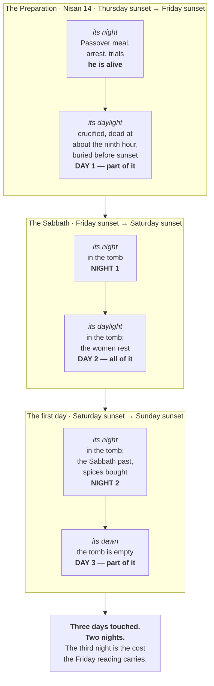

# Three Days and Three Nights

Asked for a sign, Jesus gave one, and only one: Jonah. "Three days and three nights in the heart of
the earth" is a quotation, and Jonah's own account of those days calls the place Sheol and the pit.
The sentence is about where he was going and who would bring him back — and it has become known
instead for an arithmetic problem, because a Friday afternoon death and a Sunday dawn resurrection
give two nights, not three. Both are treated here, in that order.

## Key Takeaways

*(This section follows the [Key Takeaways](../about/key-takeaways.md) format this site is
prototyping — see that page for what each part is for and why.)*

### Types & Prophecy

**Type.** Jonah in the fish is the pattern Jesus names for himself, and he names it — the reader is
not left to spot it (Matthew 12:40, quoting Jonah 2:1 word for word as the Greek Old Testament has it). What the
type carries is burial and emergence, not a stopwatch. Jonah's own prayer says so: the fish's belly
is "the belly of Sheol," the place is "the pit," and God does not release him but *brings him up*
(Jonah 2:2-6). Jesus even takes the noun — Jonah is "in the heart of the seas," he will be "in the
heart of the earth."

A second type runs underneath the dates. The three days fall across three consecutive appointed
times in Leviticus 23, and Paul names Christ as the fulfilment of the outer two: "Christ, our
Passover lamb, has been sacrificed" (1 Corinthians 5:7), and "Christ has been raised… the
firstfruits" (1 Corinthians 15:20) — the sheaf Leviticus 23:11 commands to be waved "on the day
after the Sabbath."

**Prophecy.** Psalm 16:10 is a stated prediction rather than a resemblance, and Peter says so in the
first Christian sermon: David "foresaw and spoke about the resurrection of the Christ, that he was
not abandoned to Hades, nor did his flesh see corruption" (Acts 2:31). Two negatives — where he was,
and how long.

### Lessons about Jesus

- He answered a demand for a sign by pointing at his own burial, before anyone had asked about a
  timetable.
- He spoke of the interval far more often as "the third day" than as three days and three nights —
  eight times against one.
- The two disciples on the Emmaus road, on the day it happened, called that Sunday "the third day
  since these things happened" (Luke 24:21). Whatever reckoning they were using, it is the one the
  New Testament uses.

### Memory verses

> ✝️ Matthew 12:40 (ESV)
>
> 40 For just as Jonah was three days and three nights in the belly of the great fish, so will the
> Son of Man be three days and three nights in the heart of the earth.

> ✝️ Luke 24:21 (ESV)
>
> 21 But we had hoped that he was the one to redeem Israel. Yes, and besides all this, it is now the
> third day since these things happened.

### Be Transformed

This is a question about arithmetic, and the Friday reading depends on a counting convention rather
than on a statement. It is the stronger reading, and it still spends Matthew 12:40 on credit. Holding a well-supported
position while naming what it costs is a different discipline from holding it because the costs were
never totalled.

### Prayer

Lord Jesus, you gave a sign and men asked for a schedule. Keep me from doing the same — measuring
what you said instead of trusting what you did. You were dead and you are not; the tomb was closed
and it is open. Where I cannot make the pieces sit flat, let me say so honestly and rest in the
thing itself rather than in my account of it. Amen.

## The counting problem, stated plainly

> ✝️ Matthew 12:40 (ESV)
>
> 40 For just as Jonah was three days and three nights in the belly of the great fish, so will the
> Son of Man be three days and three nights in the heart of the earth.

Read as a measurement, that requires roughly seventy-two hours. A crucifixion on Friday afternoon
and an empty tomb at dawn on Sunday spans two periods of darkness and parts of three days. The gap
is one night, and it is the whole of the case for moving the crucifixion to a Wednesday or a
Thursday.

Four lines bear on it, each counted from the Greek text rather than recalled. They occupy most of
what follows, which is a matter of the question's difficulty rather than its importance: Scripture
states the span twelve times and explains it none, while it says a great deal about what the days
accomplished.

## The sign, and what Jonah said it was

Jesus is not making a general comparison. He is quoting, and the quotation is exact: Matthew 12:40
reproduces the Septuagint of Jonah 2:1 word for word — *ἦν Ἰωνᾶς ἐν τῇ κοιλίᾳ τοῦ κήτους τρεῖς
ἡμέρας καὶ τρεῖς νύκτας*, "Jonah was in the belly of the sea creature three days and three nights."
This project's own quotation detection scores that link at 24, its highest tier, and finds it
corroborated by the inherited cross-reference lists as well.

That matters because Jonah interprets his own three days, in the prayer that follows immediately —
and he does not describe a fish. He describes death.

> ✝️ Jonah 2:2-6 (ESV)
>
> 2 saying, "I called out to the LORD, out of my distress, and he answered me; out of the belly of
> Sheol I cried, and you heard my voice. 3 For you cast me into the deep, into the heart of the
> seas, and the flood surrounded me; all your waves and your billows passed over me… 6 at the roots
> of the mountains. I went down to the land whose bars closed upon me forever; yet you brought up my
> life from the pit, O LORD my God."

**The belly of the fish is "the belly of Sheol."** The place is "the pit," a land with bars that
close. And what God does is not *release* him but *bring him up* — וַתַּעַל,
the verb used of raising from death. Jonah's three days are a burial.

**And one word travels from Jonah's prayer into Jesus's sentence.** Jonah 2:3 in English (2:4 in the
Hebrew) puts him "in the heart of the seas" — בִּלְבַב יַמִּים, which the
Septuagint renders **καρδίας θαλάσσης**. Jesus says he will be in the **καρδίᾳ τῆς γῆς**, "the heart
of the earth." He has taken the noun out of the passage he is quoting and moved it from the sea to
the ground.

So the sign of Jonah is not an invitation to count hours. It is a claim about where he is going and
who brings him back — and Jesus says as much in the same breath, calling it the *only* sign this
generation will get (Matthew 12:39) and adding that "something greater than Jonah is here" (12:41).

## Three days, three appointed times

The span is not an arbitrary interval either. It lands on three consecutive festivals in Leviticus
23, and the New Testament names Christ as the fulfilment of the first and the third by name.

| Appointed time | Leviticus 23 | That week | Named of Christ |
|---|---|---|---|
| **Passover** | 23:5, Nisan 14 | the crucifixion | "Christ, our Passover lamb, has been sacrificed" (1 Corinthians 5:7) |
| **Unleavened Bread** | 23:6, from Nisan 15 | the body in the tomb, on the Sabbath | — |
| **Firstfruits** | 23:10-11 | the resurrection | "Christ has been raised from the dead, the firstfruits of those who have fallen asleep" (1 Corinthians 15:20; cf. 15:23) |

The third row carries a date instruction that decides the day of the week:

> ✝️ Leviticus 23:11 (ESV)
>
> 11 and he shall wave the sheaf before the LORD, so that you may be accepted. On the day after the
> Sabbath the priest shall wave it.

**"On the day after the Sabbath"** — the first day of the week. The sheaf of the first-cut harvest
was lifted before the LORD on the morning the tomb was found empty, and Paul calls Christ *the
firstfruits* using that feast's own noun. So the resurrection does not merely happen to fall on a
Sunday; on this reckoning it falls on the appointed day for the offering it fulfils.

That is a considerably better answer to "why three days" than any arithmetic, and it is the reason
the interval is fixed rather than approximate: it is bounded by two feasts, with the Sabbath sitting
between them. This site has no study on Firstfruits yet — it is an open item — so the point is made
here rather than cross-referenced.

## The phrase occurs once

"Three days and three nights" appears in exactly one New Testament verse, and there Jesus is
quoting the wording of Jonah rather than stating a duration. Set against that single occurrence,
the New Testament describes the same interval two other ways, and far more often:

| Phrasing | Occurrences | Where |
|---|---|---|
| "on the third day" | **8** | Matthew 16:21; 17:23; 20:19; Luke 9:22; 24:7; 24:46; Acts 10:40; 1 Corinthians 15:4 |
| "after three days" | **3** | Mark 8:31; 9:31; 10:34 |
| "three days and three nights" | **1** | Matthew 12:40 |

A reading that makes the one occurrence the measurement and the eleven others approximations has
the ratio upside down.

**And the Old Testament glosses the phrase itself, once.** Running this project's quotation
detection over Matthew 12:40 turns up a second link nothing else carries — 1 Samuel 30:12, sharing
*τρεῖς ἡμέρας καὶ τρεῖς νύκτας* with it, and uncorroborated by any inherited cross-reference list.
David's men find a collapsed Egyptian slave who "had not eaten bread or drunk water for **three days
and three nights**" (30:12). One verse later the man explains himself: "my master left me behind
because I fell sick **three days ago**" (30:13). Same speaker, same episode, adjacent verses — the
phrase and the plain count describe one span. That is the idiom being demonstrated in the Old
Testament, in the exact words Jesus uses, by someone with no interest in the question.

## Mark and Matthew report the same prediction, in both forms

This is the load-bearing observation, because it settles how the Gospels themselves understood the
two phrasings.

> ✝️ Mark 8:31 (ESV)
>
> 31 And he began to teach them that the Son of Man must suffer many things and be rejected by the
> elders and the chief priests and the scribes and be killed, and after three days rise again.

> ✝️ Matthew 16:21 (ESV)
>
> 21 From that time Jesus began to show his disciples that he must go to Jerusalem and suffer many
> things from the elders and chief priests and scribes, and be killed, and on the third day be
> raised.

One prediction, one occasion, two Evangelists — and "after three days" in Mark where Matthew has
"on the third day." The Gospels treat the two as saying the same thing. That is only possible if
part of a day is being counted as a day, since "after three days" read strictly would put the
resurrection on the fourth.

The convention has a name and is not invented for this problem. The *ESV Study Bible* states it at
Matthew 12:40: Jewish reckoning here is "inclusive, meaning… the combination of any part of three
separate days" — part of Friday as day one, all of Saturday as day two, part of Sunday as day
three.

## Luke counts it from the other end

> ✝️ Luke 24:21 (ESV)
>
> 21 But we had hoped that he was the one to redeem Israel. Yes, and besides all this, it is now the
> third day since these things happened.

This is spoken on the road to Emmaus, on resurrection Sunday itself. Counting inclusively from a
Friday crucifixion: Friday one, Saturday two, Sunday three — and the sentence works. From a
Wednesday crucifixion, that same Sunday is the fifth day, and it does not.

The value of this verse is that it is not a prediction being interpreted. It is two ordinary people
counting, in passing, on the day in question.

## Mark names the day

> ✝️ Mark 15:42 (ESV)
>
> 42 And when evening had come, since it was the day of Preparation, that is, the day before the
> Sabbath,

"The day before the Sabbath" translates a single Greek word, **προσάββατον** (*prosabbaton*,
"fore-sabbath"), and it occurs exactly once in the New Testament — here, defining the day Jesus
died. Luke says the same without the term: "It was the day of Preparation, and the Sabbath was
beginning" (23:54). **παρασκευή** (*paraskeuē*, "Preparation") is used of that day six times across
the four Gospels (Matthew 27:62; Mark 15:42; Luke 23:54; John 19:14, 31, 42).

## Does a sunset-to-sunset day change the count?

It is the first thing to check, because the Hebrew day does not run midnight to midnight. It runs
evening to evening — "there was evening and there was morning, the first day" (Genesis 1:5), and
for the Day of Atonement explicitly, "from evening to evening shall you keep your Sabbath"
(Leviticus 23:32). Each day carries its night at the *front*, not the back.

Laid out that way, a Friday crucifixion looks like this:

| Hebrew day | Runs | In the tomb for its night? | For its daylight? |
|---|---|---|---|
| Friday (Preparation) | Thursday sunset → Friday sunset | No — he was alive | Only the last hours, from about the ninth hour |
| The Sabbath | Friday sunset → Saturday sunset | **Yes** | **Yes** — the one complete day |
| The first day | Saturday sunset → Sunday sunset | **Yes** | Risen at or before dawn |

**Three days touched, two nights — the same answer.** Sunset reckoning relocates which day each
night belongs to, and it does not add one. The two nights in the tomb are the Sabbath's night and
the first day's night; calling them "Friday night" and "Saturday night," as a modern reader
naturally would, attaches each to the wrong day without changing the total.

What it does do is make the inclusive count read less like special pleading. On this reckoning the
burial touches three named days and fills the middle one completely, which is a more natural thing
for "the third day" to mean than a modern midnight-to-midnight count would allow. It also explains
the Gospels' own movements without strain: the women could not buy spices until "the Sabbath was
past" (Mark 16:1), which is Saturday *evening*, and they came to the tomb "very early on the first
day of the week" (16:2) — the same Hebrew day, some hours later.

**And it strengthens the other side, which should be said.** On sunset reckoning a Wednesday
crucifixion produces a literal three days and three nights, provided the resurrection is placed at
the end of the Sabbath rather than on Sunday morning: Thursday, Friday and the Sabbath each
contribute a full night and a full day. The Gospels never narrate the moment of the resurrection —
only the discovery of an empty tomb at dawn — so that placement is not excluded by the texts. This
is the Wednesday case at its most coherent, and sunset reckoning is what makes it work.

What sunset reckoning does not do is rescue it from Luke 24:21. Counting from a Wednesday, that
Sunday is the fifth day, whatever hour the days are held to begin.

## The week as the Hebrew calendar counts it

Laid out on sunset-to-sunset days, with each day carrying its night at the front, the whole question
becomes visible at once. This is the AD 33 reconstruction — Nisan 14 running Thursday sunset to
Friday sunset, which is the reckoning that puts Passover on a Friday in that year and is why AD 33
is a candidate at all.

Two things the picture settles that prose labours at. The night of the Preparation is the one he was
*alive* for — so it never counts, whichever day the crucifixion is placed on. And the Sabbath is the
only complete day in the tomb, which is why every reckoning of this, ancient or modern, has to lean
on the two partial days at either end.

## What the burial sequence adds

The burial is the most tightly timed passage in the Gospels, and it constrains the question from two
directions.

**It ran against a deadline, and all four writers say so.** Jesus died around the ninth hour, and
between that and sunset Joseph had to reach Pilate, wait while Pilate summoned the centurion to
confirm the death (Mark 15:44), buy a linen shroud, take the body down, wrap it and lay it in a tomb.
Mark frames the whole thing with "when evening had come, since it was the day of Preparation, that
is, the day before the Sabbath" (15:42). Luke: "the Sabbath was beginning" (23:54). John gives the
reason for the tomb they chose: "because of the Jewish day of Preparation, since the tomb was close
at hand, they laid Jesus there" (19:42) — a *nearby* tomb, because there was no time for a better
one.

That does not by itself pick a day. What it establishes is that the crucifixion fell immediately
before a Sabbath, with the burial pressed into the last hours of daylight — which is common ground
between the Friday and the Wednesday readings, though it is often argued as though only one of them
accounts for it.

**The chief priests use both phrasings, one sentence apart.** This is the sharpest single piece of
evidence in the whole question, and it comes from hostile witnesses:

> ✝️ Matthew 27:63-64 (ESV)
>
> 63 and said, "Sir, we remember how that impostor said, while he was still alive, 'After three days
> I will rise.' 64 Therefore order the tomb to be made secure until the third day, lest his
> disciples go and steal him away and tell the people, 'He has risen from the dead,' and the last
> fraud will be worse than the first."

They quote Jesus as saying **μετὰ τρεῖς ἡμέρας**, "after three days" — and then, in the next breath,
ask for a guard **ἕως τῆς τρίτης ἡμέρας**, "until the third day." If "after three days" meant a full
seventy-two hours, a guard posted only until the third day would expire before the moment they were
trying to protect against, and the request makes no sense. One speaker, one occasion, one author,
both phrasings, treated as the same span.

That is a tighter demonstration than the Mark 8:31 / Matthew 16:21 pairing above, because it does not
require comparing two Gospels. It is inside one paragraph.

## The counter-case, at its strongest

> ✝️ John 19:31 (ESV)
>
> 31 Since it was the day of Preparation, and so that the bodies would not remain on the cross on
> the Sabbath (for that Sabbath was a high day), the Jews asked Pilate that their legs might be
> broken and that they might be taken away.

"A high day" is **μεγάλη** — great. If that names a *festival* Sabbath distinct from the weekly one,
then two Sabbaths fell in that week, and the extra day the literal reading of Matthew 12:40 needs
becomes available. That is the real plank under the Wednesday and Thursday positions, and it is not
a foolish one: the phrase is genuinely open between "a festival Sabbath" and "the weekly Sabbath,
made great by a feast falling on it."

**The spices are the better version of that argument.** Luke has the women return from the burial and
*prepare* spices and ointments, and then "on the Sabbath they rested according to the commandment"
(23:56) — preparation before the Sabbath. Mark has them *buy* spices "when the Sabbath was past"
(16:1) — purchase after it. On a single Sabbath those two sit awkwardly: why buy on Saturday evening
what you had already prepared on Friday evening, in a burial window measured in minutes?

Two Sabbaths dissolve it completely. A Wednesday crucifixion gives a festival Sabbath on Thursday,
an ordinary Friday on which the women could both buy and prepare, and the weekly Sabbath on Saturday
to rest — Mark's purchase and Luke's preparation both land on the Friday, in that order, and neither
Gospel has to be harmonised against the other. This is the strongest form of the two-Sabbath case
and it is a good deal stronger than the "high day" phrase carrying it alone.

The single-Sabbath answer is that Greek aorists do not order these events as sharply as an English
reader hears them, and that Mark's purchase may be supplementary to a preparation Luke compresses
into the evening. That is a real reading. It is also a harmonisation, and should be called one.

What both forms of the argument must still absorb is Mark's **προσάββατον** and Luke's "the third
day since." Neither moves easily.

## Where he was, in the words the New Testament actually uses

Jonah says Sheol. What does the New Testament say?

**The prophecy the apostles reach for is Psalm 16:10**, and it is a stated prediction rather than a
resemblance. Peter quotes it in the first Christian sermon and says outright what it is for:

> ✝️ Acts 2:31 (ESV)
>
> 31 he foresaw and spoke about the resurrection of the Christ, that he was not abandoned to Hades,
> nor did his flesh see corruption.

Two negatives, and they are the load-bearing content: **not abandoned** to Hades, and **no
corruption**. The first assumes he was there; the second bounds how long. Peter's argument in
Acts 2:29-31 turns on David's tomb still being in Jerusalem — David saw corruption, so the psalm was
not about him.

**To the thief, Jesus names the destination himself**: "today you will be with me in paradise"
(Luke 23:43) — *today*, on the day of the crucifixion, not after three days.

**Paul reads a descent into Psalm 68**: "he had also descended into the lower regions, the earth"
(Ephesians 4:9), and what he brings back up with him is "a host of captives" (4:8).

**Peter's other statement is the contested one.** "He went and proclaimed to the spirits in prison"
(1 Peter 3:19) has been read as Christ preaching in Hades between death and resurrection, as the
pre-incarnate Christ preaching through Noah to that generation, and as a proclamation of victory to
fallen angels. The passage is genuinely difficult and this study does not settle it; it is noted
because any account of the three days that quietly leaves it out is trimming the evidence.

What the New Testament does not do is describe the interval. There is no narration of it anywhere —
only these statements about its boundaries and its outcome, made afterwards.

## What it achieved

Three claims, each stated plainly somewhere rather than inferred from the span.

**Death's holder was destroyed, and its hostages freed.** "That through death he might destroy the
one who has the power of death, that is, the devil, and deliver all those who through fear of death
were subject to lifelong slavery" (Hebrews 2:14-15). The mechanism is *through death* — not around
it.

**The authority changed hands.** "I died, and behold I am alive forevermore, and I have the keys of
Death and Hades" (Revelation 1:18). Keys are held by whoever opens and shuts; the sentence reports a
transfer.

**And the resurrection is the first of a harvest, not a solitary marvel.** That is the whole force of
the firstfruits language above: a sheaf is waved because a field is coming. "Christ the firstfruits,
then at his coming those who belong to Christ" (1 Corinthians 15:23).

Set beside those, the question of whether the interval ran two nights or three is a small one — which
is roughly the proportion Scripture itself gives it, since the span is stated twelve times and
explained none.

## Where that leaves it

The weight is with a Friday crucifixion. Two independent things point at it — a word that means the
day before the weekly Sabbath, and two disciples counting to three on the Sunday — and the eight-to-one
ratio of "on the third day" over "three days and three nights" points the same way.

But the Friday reading buys Matthew 12:40 on credit. It needs inclusive reckoning to absorb the
missing night, and inclusive reckoning is a real convention invoked at exactly the point where it is
convenient. That is a cost rather than a refutation, and this study does not retire it. What keeps
it from being special pleading is that the convention is visible independently: Mark and Matthew use
both phrasings of the same sentence, which they could not do if a part-day did not count as a day.

The two positions are best stated as a trade, with both bills itemised.

| | Takes at face value | Has to absorb |
|---|---|---|
| **Wednesday** | Matthew 12:40 — and on sunset reckoning it genuinely delivers three nights; the Luke/Mark spice sequence, without harmonising | Mark's **προσάββατον**; the eight "on the third day" statements; a Sunday its own count makes the fifth day (Luke 24:21) |
| **Friday** | προσάββατον; Luke 24:21; the chief priests using both phrasings a sentence apart | one missing night; a harmonisation of Luke's "prepared" against Mark's "bought" |

This study holds the Friday reading, because Luke 24:21 and προσάββατον are explicit statements
about *which day* while the two costs on the Friday side are both about *how to count* — and because
Matthew 27:63-64 shows the counting convention being used by people with no stake in defending it.
But the Friday column is not empty, and it grew by one line while this study was being written. That
is the honest state of it, and anyone holding the date should be able to name both entries.

## Discussion questions

1. Matthew reports "on the third day" and Mark "after three days" for the same prediction. What does
   that tell you about how precisely the Gospel writers intended time language to be read?
2. The two on the Emmaus road were counting without arguing a case. Why might an incidental count
   carry more evidential weight than a deliberate one?
3. Jesus called it "the sign of Jonah." What is a sign for, and does a sign have to be a
   measurement to be true?
4. This study reaches a conclusion and then names what that conclusion costs. Where else do you hold
   a position whose price you have not totalled?

## References & Recommended Reading

**Original-language sources** (queried in this project's own
[reference database](../scripture/original-language-data.md)):

- **SBL Greek New Testament** (SBLGNT), ed. Michael W. Holmes — the text behind every count above.
- **MACULA Greek Linguistic Datasets** (Clear Bible) — lemma and morphology for **προσάββατον** and
  **παρασκευή**, and the occurrence lists for the three phrasings.

**Translations quoted.** ESV throughout. See
[Bible Translations & Source Texts](../scripture/translations.md) and
[copyright](../about/copyright.md).

**Derived cross-references.** The Matthew 12:40 → Jonah 2:1 quotation and the Matthew 12:40 →
1 Samuel 30:12 link were both surfaced by this project's own quotation detection over the Greek
texts, described at [How we cross-reference](../about/how-we-cross-reference.md). The first is
corroborated by the inherited reference lists; the second is not carried by any of them.

**Commentary.**

- **ESV Study Bible** (Crossway) — note on Matthew 12:40, for the statement of inclusive reckoning.

**Related on this site.**

- [Chronology Anchors](../last-things/chronology-anchors.md#settling-the-crucifixion-year) — where
  the year is settled, and where the same Mark 15:42 argument for a Friday is made independently of
  this study.
- [Prophecy: Events and Times](../last-things/prophecy-events-times.md) — Daniel's seventy weeks
  worked through to the same week.
- [The Day No One Knows](the-day-no-one-knows.md) — the other place a single sentence of Jesus about
  time is read more precisely than it was meant.
