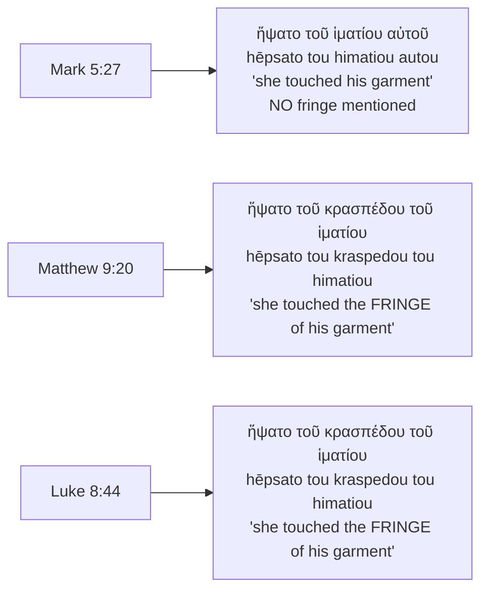

# The Woman Who Touched the Fringe: Uncleanness Running Backwards

For twelve years this woman had been bleeding, and under the law of Moses that made her unclean —
not as an insult but as a legal status with consequences. Anything she sat on became unclean.
Anyone who touched what she had touched became unclean, and had to wash and wait until evening.
Twelve years of that meant no temple, no ordinary family life, and no touching anyone without
passing the condition on. Then Jesus came through her town in a crowd, and she reached out from
behind and took hold of his clothes.

**Under that law, uncleanness travelled one way: out from her, onto whatever she touched. At that
moment it ran backwards. Nothing unclean passed from her to Jesus; power passed from Jesus to her,
and the bleeding stopped.** Mark tells it as a reversal of the purity rules. Matthew and Luke add one
detail Mark leaves out, and it changes what her reach means: what she grabbed was the *fringe* —
the tassel God had commanded every Israelite man to wear on the corners of his garment as a
reminder to keep the whole law.

## Key Takeaways

*(This section follows the [Key Takeaways](../about/key-takeaways.md) format this site is
prototyping — see that page for what each part is for and why.)*

### Types & Prophecy

**Type.** Israel wore tassels "that you may see it, and remember all Yahweh's commandments, and do
them" (Numbers 15:39, WEB). The woman, disqualified by the law from touching anyone, takes hold of
the law's own emblem on the one man who fulfilled the law perfectly. The woman's healing, and ours,
comes by holding onto the only way we meet the righteous requirements of the law — true fulfilment
of the law, Jesus Christ. "For the law of the Spirit of life has set you free in Christ Jesus from
the law of sin and death" (Romans 8:2, ESV).

**Prophecy.** Matthew states the prophetic frame for Jesus's healings himself, one chapter before
this scene, with his standard fulfilment formula: the healings happened "that it might be fulfilled
which was spoken through Isaiah the prophet, saying, 'He took our infirmities and bore our diseases'"
(Matthew 8:17, WEB, citing Isaiah 53:4).

**Not prophecy, though it is often taught as such: Malachi 4:2.** See
[the Malachi question](#the-malachi-question-a-real-pun-and-an-overreach) below. The Hebrew wordplay
is real; the fulfilment claim built on it is not one Scripture makes.

### Lessons about Jesus

- He is not defiled by contact with what the law calls unclean; he cleanses it. Under Leviticus
  15:27 the traffic runs one direction, from the unclean person outward. Here it runs the other way,
  and the narrative never says Jesus became unclean.
- He gives healing before he gives approval. The flow stopped at her touch (Mark 5:29), before he
  turned, before he spoke, before she confessed. Her theology of how to approach him was arguably
  wrong — she came secretly, from behind — and it was met anyway.
- He refuses to let it stay anonymous. He stops a crowd, and an urgent errand to a dying child, to
  find one woman and speak to her (Mark 5:30-32). The healing was complete without that; the
  restoration was not.
- He calls her "Daughter" (Mark 5:34) — the only time in any Gospel Jesus addresses a woman that
  way. After twelve years in which touch made her a legal hazard, the word he gives her is a
  family word.

### Memory verses

> ✝️ Mark 5:34 (WEB)
>
> 34 He said to her, "Daughter, your faith has made you well. Go in peace, and be cured of your
> disease."

**Leviticus 15:27 (WEB)** — "Whoever touches these things shall be unclean" — the rule this scene
runs backwards.

### Be Transformed

- **Think.** She reached out believing something true about Jesus while believing something false
  about herself — that she had to stay hidden. He corrected the second without withholding the
  first. Faith does not have to be well-formed before it is answered.
- **Attitude.** Notice what her secrecy cost her: she nearly went home healed and unknown. The
  public naming was the better half of the gift.
- **Do.** Name one thing you have assumed disqualifies you from asking God directly, and ask
  directly instead.

### Prayer

Father, you gave a law that told your people what defilement is and how far it spreads, and you were
right about all of it. Then your Son let an unclean woman take hold of his clothes, and what came
back down her arm was healing. Nothing in us is too far gone to touch you, and nothing in us is
strong enough to make you unclean. Teach us to stop hiding, and to come out and tell you the whole
truth as she did. Amen.

## Historical and cultural context: what twelve years cost her

Her condition falls under Leviticus 15:19-30, the law covering discharges of blood outside the normal
menstrual period:

> ✝️ Leviticus 15:25-27 (WEB)
>
> 25 "'If a woman has a discharge of her blood many days not in the time of her period, or if she
> has a discharge beyond the time of her period, all the days of the discharge of her uncleanness
> shall be as in the days of her period. She is unclean. 26 Every bed she lies on all the days of
> her discharge shall be to her as the bed of her period. Everything she sits on shall be unclean,
> as the uncleanness of her period. 27 Whoever touches these things shall be unclean, and shall wash
> his clothes and bathe himself in water, and be unclean until the evening.

The mechanism matters for reading the scene. The Hebrew verb is נָגַע
(*nāgaʿ*, H5060), "touch," and what it produces is טָמֵא (*ṭāmēʾ*, H2930),
"unclean." Contact carries impurity outward, from the unclean person to whoever or whatever touches
them. Ritual uncleanness is contagious in the law; ritual holiness is not (Haggai 2:11-13 puts the
asymmetry as a formal question to the priests, and the answer is that holy things do not make
ordinary things holy by contact, but a corpse-defiled person defiles everything he touches). That
asymmetry is precisely what this story overturns.

The cost was not only ceremonial. Mark says she "had suffered many things by many physicians, and
had spent all that she had, and was no better, but rather grew worse" (5:26, WEB) — twelve years of
chronic illness and medical expense in an economy with no safety net. Background commentary adds
that because such long-term bleeding barred marital relations, she was likely divorced or never
married, and correspondingly isolated and destitute (*NIV Cultural Backgrounds Study Bible*,
Zondervan, ed. Walton & Keener, note at Matthew 9:20). The same source notes that pressing through a
crowd would have transmitted her uncleanness to many people without their knowledge — which is
exactly why she does not announce herself.

## Literary context: the interruption is the point

Mark does not tell this as a standalone miracle. It sits inside a larger unit, Mark 5:21-43, built
in his characteristic sandwich pattern — a story opened, interrupted by a second story, then closed:

1. **5:21-24** — Jairus, a synagogue ruler, begs Jesus to come and heal his dying twelve-year-old
   daughter.
2. **5:25-34** — *The interruption*: the woman with the twelve-year discharge.
3. **5:35-43** — The frame closes: the girl has died, and Jesus raises her.

Mark uses this structure so the two halves comment on each other, and here the pairing is deliberate.
Twelve years of illness meets a girl twelve years old. Both are hopeless by ordinary means. Both
involve the two great sources of ritual defilement in the Torah — chronic discharge (Leviticus 15)
and contact with a corpse (Numbers 19:11-13) — and in both, Jesus makes contact and is not defiled.
And the two people could hardly be further apart socially: a named official's daughter with a father
who can petition Jesus publicly, and an unnamed, bankrupt, ceremonially untouchable woman who cannot
ask at all.

The interruption makes the argument without stating it. Access to Jesus does not run through
standing.

## What each Gospel actually says

Read on their own terms before harmonizing, the three accounts differ in what they report her
touching — and the difference is load-bearing for everything the next section builds:

Mark, the fullest account of the scene by a wide margin, is the one that does **not** mention the
fringe. Matthew and Luke, both of whom compress the story, both keep it. The claim that "all three
Gospels emphasise the fringe" circulates widely — it was the central claim of one of the two earlier
studies on this site that this study replaces — and it is not true of the text.

The honest version is more interesting anyway. The detail is not Mark's interest. Mark is telling a
story about contagion running backwards, and "his clothes" is all that story needs. Matthew and Luke
preserve a specific Jewish detail that a reader of the Greek Old Testament would catch immediately.

## The fringe: what she actually grabbed

> ✝️ Numbers 15:38-39 (WEB)
>
> 38 "Speak to the children of Israel, and tell them that they should make themselves fringes on the
> borders of their garments throughout their generations, and that they put on the fringe of each
> border a cord of blue. 39 It shall be to you for a fringe, that you may see it, and remember all
> Yahweh's commandments, and do them; and that you don't follow your own heart and your own eyes,
> after which you used to play the prostitute;

Two Hebrew words carry this. The tassel itself is צִיצִת (*tsitsit*, H6734).
The place it hangs is the כָּנָף (*kānāp̄*, H3671) — a word that means both
"wing" and "corner/edge of a garment," and which is about to do a great deal of work.

**The Greek link is exact, and checkable.** When the Septuagint — the pre-Christian Greek translation
of the Old Testament — renders Numbers 15:38, it translates *tsitsit* with **κράσπεδα** (*kraspeda*)
and *kānāp̄* with **πτερύγια** (*pterygia*, "little wings"), keeping the wing/corner double sense in
Greek:

> λάλησον τοῖς υἱοῖς Ἰσραὴλ... καὶ ποιησάτωσαν ἑαυτοῖς **κράσπεδα** ἐπὶ τὰ **πτερύγια** τῶν ἱματίων
> αὐτῶν
> — Numbers 15:38 (Brenton Septuagint, public domain)

κράσπεδον is precisely the word Matthew 9:20 and Luke 8:44 use. So when those two Gospels say she
touched the κράσπεδον of his ἱμάτιον, they are using the Greek Old Testament's own term for the
commanded tassel, not a general word for a hem. The *NIV Cultural Backgrounds Study Bible* reaches
the same conclusion independently, and with an appropriate hedge — the phrase "may refer to Jesus'
Jewish tassels," pointing the reader to the Septuagint of Numbers 15:38-39 and Deuteronomy 22:12.

Jesus wore them, as an observant Jewish man would; he criticised only the practice of lengthening
them for display (Matthew 23:5). So the woman, whom the law had shut out, reached for the part of
his clothing that existed to say *this man is bound to keep every commandment* — and what came back
was healing rather than defilement.

## The Malachi question: a real pun, and an overreach

Here is the claim that circulates, and that the study this one replaces asserted flatly: Malachi
prophesied "healing in his wings," *kānāp̄* means both wing and garment-corner, and therefore the
woman touching the tassel is the literal fulfilment of Malachi 4:2.

The pieces are half right. The wordplay is there:

> ✝️ Malachi 4:2 (WEB)
>
> 2 But to you who fear my name shall the sun of righteousness arise with healing in its wings. You
> will go out and leap like calves of the stall.

The Hebrew is וּמַרְפֵּא בִּכְנָפֶיהָ (*ū-marpēʾ bi-ḵnāp̄ehā*), "and healing
in her wings" — the same *kānāp̄*, H3671, as Numbers 15:38 (in Hebrew Bibles this verse is numbered
Malachi 3:20). And the word is used unambiguously of a garment corner elsewhere in a messianic-era
promise: "ten men from the nations of every tongue shall take hold of the *kānāp̄* of a Jew, saying,
'Let us go with you, for we have heard that God is with you'" (Zechariah 8:23, my rendering of the
Hebrew term; ESV has "robe," WEB "skirt"). Zechariah has Gentiles gripping the garment-corner of a
Jew because God is with him — which is a striking near-picture of what this woman does.

**But the fulfilment claim does not stand, for three reasons.**

1. **In Malachi the wings are the sun's, not a garment's.** The subject is "the sun of
   righteousness," and *kānāp̄* there is the standard image of the sun's spreading rays. Commentators
   read it that way with near-unanimity: the *NIV* and *NKJV Cultural Backgrounds Study Bibles* both
   suggest the image derives from the winged sun disk common in ancient Near Eastern art, and the
   *ESV Study Bible* reads it as sunrise dispelling gloom, pointing to Luke 1:78-79 for the New
   Testament's own use of the sunrise image. None of the commentaries consulted connects Malachi 4:2
   to this healing at all.
2. **No Gospel writer makes the link.** This is the strongest objection. Matthew is the evangelist
   most given to saying "this happened to fulfil what the prophet spoke" — he does it at 1:22, 2:15,
   2:17, 2:23, 4:14, 8:17, 12:17, 13:35, 21:4 and 27:9. He records the fringe detail at 9:20 and
   attaches no formula to it. The writer who would have said so, and who had the vocabulary ready,
   did not.
3. **Matthew supplies a different prophecy for the same subject.** At 8:17 he does exactly what the
   popular reading wants him to do here — quotes Isaiah, by name, with a fulfilment formula, about
   Jesus's healings: "He took our infirmities and bore our diseases" (Isaiah 53:4). If you want
   Matthew's prophetic reading of Jesus's healing ministry, he has already given it, one chapter
   earlier, and it is Isaiah 53:4 rather than Malachi 4:2.

What survives is worth keeping, stated at its true strength: *kānāp̄* carries both senses; the
Septuagint's κράσπεδον/πτερύγια rendering keeps both available in Greek; Matthew and Luke use that
exact word; and a reader steeped in the Greek Old Testament could hear the resonance. That is an
echo a first-century reader might catch. It is not a prediction being ticked off, and presenting it
as one trades a checkable observation for an unsupportable claim.

## Word study

- **κράσπεδον** (*kraspedon*, G2899, Louw-Nida domain 6.180) — "tassel, fringe." In Matthew 9:20 and
  Luke 8:44; absent from Mark 5:27. Its Septuagint use at Numbers 15:38 for *tsitsit* is what ties
  the Gospel detail to the commandment.
- **ἅπτω** (*haptō*, G680) — "touch." She touches (5:27), plans to touch (5:28), and Jesus asks who
  touched him (5:30-31). Every *other* occurrence in Mark has Jesus doing the touching, or the sick
  being brought to him to be touched (1:41 the leper; 3:10; 6:56; 7:33; 8:22; 10:13). This is the one
  place in Mark where someone touches Jesus first — and she does it from behind, unseen, because
  Leviticus 15:27 makes that contact defiling in the wrong direction.
- **δύναμις** (*dynamis*, G1411) — "power." Jesus "perceiv[ed] in himself that the power had gone out
  from him" (5:30, WEB). The healing registers as an outward transfer, and it happens at her touch,
  before he has said or done anything toward her.
- **σῴζω** (*sōzō*, G4982) — "save, heal, make whole." She says "I will be made well" (σωθήσομαι,
  5:28); Jesus says "your faith has made you well" (σέσωκέν, 5:34). This is the ordinary New
  Testament verb for salvation, which invites over-reading. MACULA's
  Louw-Nida tagging in this project's `bible-text.db` puts both occurrences in domain **23.136**,
  physical healing — the same domain as ἰάομαι (*iaomai*), the unambiguously physical healing verb
  Mark uses two verses earlier at 5:29. Physical healing is the controlling sense here. That said,
  the exact phrase "your faith has made you well" (ἡ πίστις σου σέσωκέν σε) recurs word for word at
  Mark 10:52 to blind Bartimaeus, so Mark is at least linking his faith-and-healing scenes
  deliberately, and the word's wider currency in the same Gospel (8:35; 10:26; 13:13) stays audible
  without the text making the larger claim outright.
- **θυγάτηρ** (*thygatēr*, G2364) — "daughter." Mark 5:34 is the only place in any Gospel where Jesus
  addresses a woman with this word.

## Theological principle

Under the law, holiness could not be transmitted by contact but uncleanness could. Jesus reverses the
direction of travel: what flows at the point of contact is not her defilement onto him but his power
into her. This is not an isolated moment — Mark shows the same pattern when Jesus touches a leper
(1:40-42) rather than keeping the prescribed distance. The law's diagnosis of uncleanness is never
denied; what changes is which party is stronger at the point of contact.

## Application

- **Culturally bound.** The specific machinery of Levitical purity — what transmits uncleanness, for
  how long, which washing is required — was ceremonial law given to Israel under the old covenant,
  and is not binding on believers now. So is the tassel itself, commanded to Israel (Numbers 15:38)
  and nowhere laid on the church.
- **Transcultural.** That a person's disqualification — by sin, shame, status or condition — does
  not block access to Christ, and that he is not diminished by contact with what is unclean, is
  taught across the Gospels rather than resting on this scene alone.
- **A caution for reading.** This study replaces two earlier ones, one of which built a prophecy
  claim on a Hebrew pun that no biblical writer makes. The wordplay was real, which is what made the
  claim persuasive. A true observation about a word is not yet an argument about a text.

## Discussion questions

1. Mark tells the fullest version of this story and omits the fringe; Matthew and Luke compress the
   story and keep it. What does each writer's choice suggest about what he thought the scene was
   mainly about?
2. Leviticus is not repealed in this passage — nobody says the purity law was wrong. What exactly
   *has* changed, then, at the moment of contact?
3. The woman was healed the instant she touched him, before Jesus knew who she was, and before she
   said a word. Why does he then stop everything to find her? What would she have lost if he had let
   her slip away healed?
4. The *kānāp̄* wordplay between Malachi 4:2, Zechariah 8:23 and Numbers 15:38 is real, but no New
   Testament writer uses it. How would you decide, in general, when a genuine verbal link is a
   deliberate echo and when it is a coincidence of vocabulary?
5. Jesus calls her "Daughter" — the only woman he addresses that way. Read that against the twelve
   years of untouchability behind her. What is he giving her that the healing by itself did not?

## References & Recommended Reading

- **Translations.** Scripture is quoted from the **WEB** (World English Bible, public domain)
  throughout, and every quotation was checked verbatim against this project's `bible-text.db` rather
  than quoted from memory. ESV readings are named inline where they differ usefully. The Septuagint
  text of Numbers 15:38 is **Brenton's edition** (`ebible-grcbrent`, public domain).
- **Original-language data** — κράσπεδον, ἅπτω, δύναμις, σῴζω, ἰάομαι, θυγάτηρ, and
  צִיצִת / כָּנָף / נָגַע /
  טָמֵא — from MACULA Greek (SBLGNT) and MACULA Hebrew (WLC) via this
  project's own `bible-text.db`, including the Louw-Nida domain codes cited in the word study.
- **TWOT** (*Theological Wordbook of the Old Testament*, R. Laird Harris, Gleason L. Archer Jr. &
  Bruce K. Waltke, eds., Moody Publishers) — the roots behind *nāgaʿ* (#1293) and *ṭāmēʾ* (#809),
  which the Levitical mechanism turns on.
- ***NIV Cultural Backgrounds Study Bible*** (Zondervan, ed. John H. Walton & Craig S. Keener) —
  notes at Matthew 9:20, Mark 5:27 and Luke 8:44. Source for the marriage/isolation background and
  the crowd-contamination observation, and it independently identifies the κράσπεδον as the Jewish
  tassel with reference to the Septuagint. Its companion *NKJV* edition and the *ESV Study Bible*
  and *NIV Biblical Theology Study Bible* were consulted at Malachi 4:2; all read the "wings" as
  solar imagery, and none links the verse to this healing.
- **On the passage's structure**: Mark's intercalations are a well-documented feature of his
  narrative technique; compare the fig tree and temple cleansing at Mark 11:12-25 for the same
  pattern.
- This study **replaces** two earlier ones on this site, now retired: *The Woman with the Issue of
  Blood: Faith, Uncleanness, and Access to Jesus* (the exegetical half) and *Woman with the Issue of
  Blood* (the prophecy half, whose central "all three Gospels" claim is corrected above).
