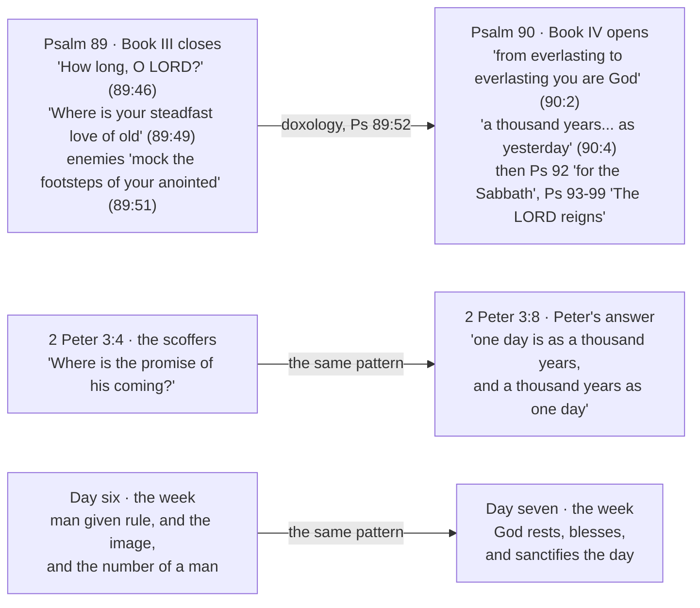

# A thousand years in your sight

*(Forked verbatim from [A Day Is a Thousand Years](day-is-a-thousand-years.md) during the
2026-09-26 simplify pass. Needs its own opening and Key Takeaways via develop-bible-study.)*

> ✝️ Psalm 90:4 (ESV)
>
> 4 For a thousand years in your sight are but as yesterday when it is past, or as a watch in
> the night.

### Psalm 90's own vocabulary

Psalm 90 is titled "A Prayer of Moses, the man of God," which puts the thousand-year day in the
mouth of the man who wrote Genesis 5. A thousand is not a round number picked at random: it is the
ceiling of a human life in Hebrew reckoning, and Moses is the one who recorded that nobody ever
reached it — Adam 930, Seth 912, Jared 962, Methuselah 969, and the list stops there. Ecclesiastes
uses the figure the same way: "even though he should live a thousand years twice over" (6:6) is
Qohelet reaching for the largest span a hearer could picture. Setting a thousand years against a
single day sets the outer limit of human time against the smallest unit Genesis 1 counts in. And the
psalm names the other end of the same scale eight verses later: "The years of our life are seventy,
or even by reason of strength eighty" (90:10).

Moses also picks a *day*. Scripture has other ways of saying human time is nothing to God — "all the
nations are as nothing before him, they are accounted by him as less than nothing and emptiness"
(Isaiah 40:17) — and Psalm 90 does not use them. It names a unit, and the unit it names is the one
the creation week is counted in.

The psalm's second comparison is smaller than its first: not only "as yesterday when it is past" but
"as a watch in the night" (אַשְׁמוּרָה, *ashmurah*, H821 — one of the three
watches Israel divided the night into, so roughly four hours). Two comparisons of unequal size make
verse 4 a statement of scale rather than a conversion table.

### The psalm's own word for eternity

The psalm is not, however, about God standing outside time. That category is a later one, and Psalm
90's own vocabulary points the other way. The psalm's own word for God's eternity is עוֹלָם (*olam*,
H5769), used twice in verse 2 — מֵעוֹלָם עַד־עוֹלָם (*me'olam ad-olam*), which the MACULA gloss renders "from
antiquity to perpetuity" and TWOT defines as "long duration" (root 1631a). It is a word for the
*extent* of time, not the absence of it. And the psalm keeps addressing God inside time after verse
4: "Return, O LORD! **How long?**" (90:13); "for as many days as you have afflicted us, and for as
many years as we have seen evil" (90:15). Nobody asks a timeless being how long. Even the commentary
usually enlisted here is milder than the slogan it gets used for — the *NIV Biblical Theology Study
Bible* says verse 4 marks "the difference between the Lord's and humankind's existence **in** time,"
and that God "does not account for time in the same way that humans do." That is a claim about
reckoning, not about atemporality.

### The historical chain

Treat the modern gloss as one witness, then, and weigh it against the others. The terms Moses chose
are the terms everything downstream is built from, and every builder used the first comparison. The
rabbis quote this verse as the warrant for the thousand-year day (b. *Sanhedrin* 97a). Lactantius
quotes this verse. Peter reaches for this verse. The psalm's own vocabulary, the Judaism that
carried it, and the church that inherited it all take the units at face value. The psalm supplies
them; what was done with them is the subject of this study.

### The Psalter's sequence and Peter's answer

Where it sits in the Psalter points the same way. Psalm 90 opens Book IV, immediately after Book III
closes on the bleakest note in the Psalter — "How long, O LORD? Will you hide yourself forever?"
(89:46), "Lord, where is your steadfast love of old, which by your faithfulness you swore to David?"
(89:49), and enemies who "mock the footsteps of your anointed" (89:51). The *NIV Biblical Theology
Study Bible* treats that placement as deliberate, "significant, especially in the light of the
downbeat ending of Book III," and names "an eternal hope grounded in an eternal God (90:1-2, 4)"
among Book IV's governing themes. The canonical sequence is therefore: mockery that a sworn promise
has not arrived, answered by the eternal God and the thousand-year day.

That is Peter's sequence exactly. The scoffers ask "Where is the promise of his coming?" (3:4); the
answer is the thousand-year day (3:8). He is not only quoting the psalm, he is repeating its move.

The same shape turns up in three places, and the Psalter is the one that shows it structurally. Each
of the Psalter's five books closes with a doxology ending in "Amen" (Psalms 41:13; 72:19; 89:52;
106:48) — so the seam between Book III and Book IV is marked in the text, not imposed on it. What
sits either side of that seam is a complaint that a sworn promise has failed, answered by God's own
duration.

The Psalter and 2 Peter are the same argument: the promise looks dead, and the reply is that God's
reckoning is not the complainant's. The top arrow is a textual seam — Psalm 89's doxology actually
closes Book III, and Psalm 90 actually opens Book IV. The lower two are resemblances. And the third
row is this study's reading rather than anything the first two state: the week is where that reply
lands once the thousand-year day is taken as a measure. Read the first two rows as evidence and the
third as inference.

## The psalm for the seventh day

There is a second psalm in this argument, and it is the only one in the Psalter assigned to a day of
the week.

> ✝️ Psalm 92:1 (ESV)
>
> 1 A Psalm. A Song for the Sabbath. It is good to give thanks to the LORD, to sing praises to your
> name, O Most High;

The Hebrew title is מִזְמוֹר שִׁיר לְיוֹם הַשַׁבָּת (*mizmor shir l’yom
hashabbat*) — "a psalm, a song, for **the day of** the Sabbath," carrying the same definite
construction Genesis 2:2-3 uses for the seventh day. The *NIV Cultural Backgrounds Study Bible* notes
that this is the only psalm so designated.

A psalm written for the day of rest turns out to be about the final sorting of the world:

> ✝️ Psalm 92:7-9 (ESV)
>
> 7 that though the wicked sprout like grass and all evildoers flourish, they are doomed to
> destruction forever; 8 but you, O LORD, are on high forever. 9 For behold, your enemies, O LORD,
> for behold, your enemies shall perish; all evildoers shall be scattered.

Then the other half: "The righteous flourish like the palm tree… They still bear fruit in old age;
they are ever full of sap and green" (92:12, 14). Judgment on the wicked, permanence for the
righteous, and God exalted forever at the centre — that is the seventh day's own song, and it is not
a song about a quiet afternoon. The *NIV Biblical Theology Study Bible* draws the same conclusion
from the title: the Sabbath rest "signified a spiritual and final rest that was to come."

Two later readings pick this up, and both appear below. The Levites sang this psalm in the Temple
every seventh day (b. *Rosh HaShanah* 31a), and the rabbis read its title as naming not a weekday but
an age — "a day, i.e., one thousand years, that is entirely Shabbat" (b. *Sanhedrin* 97a). Neither
reading has to import an eschatology into Psalm 92. The psalm brought its own.
