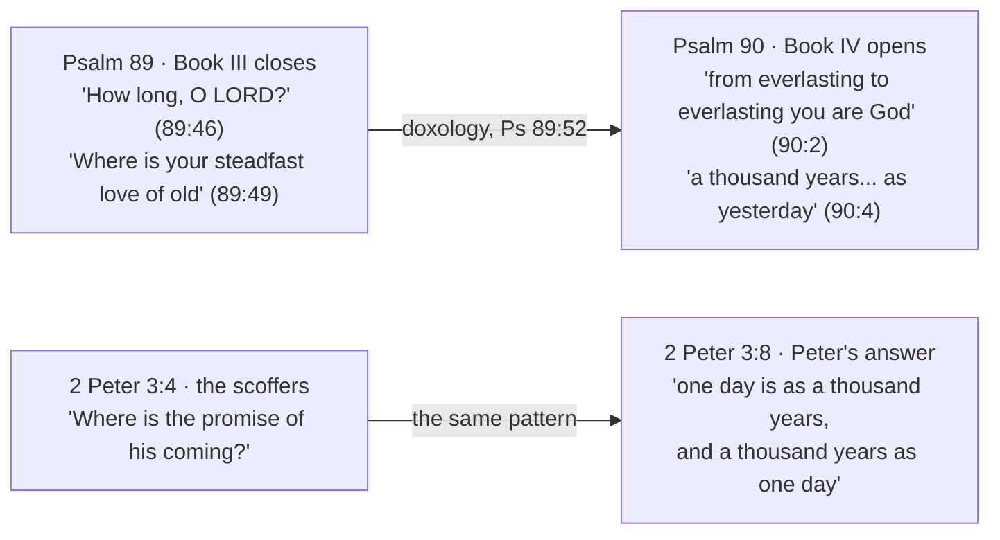

# A thousand years in your sight

Moses led a generation out of Egypt and then watched it die. God had sworn that everyone twenty
years old and upward who grumbled at the edge of the land would fall in the wilderness, "a year for
each day" of the spying, forty years (Numbers 14:29, 34, ESV). Psalm 90 is the prayer of the man who
buried them. It begins with God before the mountains and ends asking Him to make one short life
count.

> ✝️ Psalm 90:1-2 (ESV)
>
> 1 A Prayer of Moses, the man of God. Lord, you have been our dwelling place in all generations.
> 2 Before the mountains were brought forth, or ever you had formed the earth and the world, from
> everlasting to everlasting you are God.

**In one sentence:** The God who is from everlasting to everlasting has been His people's home in
every generation, and because a thousand years are as yesterday to Him, mortal and sinful people can
ask Him to return, to satisfy them with His steadfast love, and to establish the work of their few
days.

## Key Takeaways

*(This section follows the [Key Takeaways](../about/key-takeaways.md) format — see that page for what each part is for.)*

### Lessons about Jesus

- **The eternal God of Psalm 90 is the God the Son.** Hebrews takes the Psalter's "you are the same,
  and your years have no end" (Psalm 102:27, ESV) and says it "of the Son" (Hebrews 1:8, 10-12,
  ESV). "Jesus Christ is the same yesterday and today and forever" (Hebrews 13:8, ESV).
- **God answered "Return, O LORD!" by coming.** The Lord who had been Israel's dwelling place "became
  flesh and dwelt among us" (John 1:14, ESV).
- **Jesus undoes the sentence of verse 3.** Moses prays under the curse that returns man to dust.
  Christ Jesus "abolished death and brought life and immortality to light through the gospel" (2
  Timothy 1:10, ESV).

### Memory verses

> ✝️ Psalm 90:2 (ESV)
>
> 2 Before the mountains were brought forth, or ever you had formed the earth and the world, from
> everlasting to everlasting you are God.

> ✝️ Psalm 90:12 (ESV)
>
> 12 So teach us to number our days that we may get a heart of wisdom.

### Be Transformed

- **Think.** Your life is seventy or eighty years; God is from everlasting to everlasting. His
  eternity is the home your short life lives in.
- **Attitude.** Pray "How long?" out loud when it is how you feel. Moses did, and the psalm he wrote
  is Scripture.
- **Do.** Number your days this week. Each morning, ask God to satisfy you with His steadfast love,
  and name one piece of work you are asking Him to establish.

### Prayer

Lord, you have been our dwelling place in all generations. Before the mountains, you were God, and a
thousand years are yesterday to you. We are grass, and our days pass quickly. Return to us, have
pity on us, and satisfy us in the morning with your steadfast love through your Son Jesus, who
abolished death. Teach us to number our days, and establish the work of our hands.

In Jesus' name. Amen.

## Study outline

- [A prayer of Moses](#a-prayer-of-moses). Who prayed it, over which generation, and how the
  psalm moves.
- [The eternal God and the thousand-year day](#the-eternal-god-and-the-thousand-year-day). Verses
  1-4: the dwelling place, *olam*, and the scale of verse 4.
- [Our days under His wrath](#our-days-under-his-wrath). Verses 5-12: grass, seventy years, and
  numbering the days.
- [Return, O LORD](#return-o-lord). Verses 13-17: Moses' golden-calf prayer, steadfast love, and the
  work of our hands.
- [Where the psalm stands in the Psalter](#where-the-psalm-stands-in-the-psalter). The seam after
  Psalm 89, the answer in Psalm 106, and the verse Peter reached for.
- [The psalm for the seventh day](#the-psalm-for-the-seventh-day). Psalm 92 sings back what Psalm 90
  asked for.

## A prayer of Moses

The title names Moses, and no other psalm title does: of eight times Moses is named in the Psalter,
Psalm 90:1 is the only one in a superscription. "The man of God" is what Deuteronomy calls him in
the blessing he gave "before his death" (Deuteronomy 33:1, ESV), so the title sets the psalm near
the end of his life. The *ESV Study Bible* reads it that way: the title invites the singers "to
picture Israel around the time of Deuteronomy," a generation after their parents rebelled and God
swore they would not enter the land (note on Psalm 90).

The *ESV Study Bible* calls Psalm 90 a community lament and notes how thick it is with time words:
"days" at verses 4, 9, 12, 14 and 15, and "years" at 4, 9, 10 and 15. It moves in four steps:

- **Verses 1-2.** God is eternal, and He has been His people's home.
- **Verses 3-6.** Human life is brief, and God sets its end.
- **Verses 7-11.** Our life is brief because of sin and God's wrath.
- **Verses 12-17.** So teach us, return to us, and establish our work.

Verse 4, the verse Peter quotes, sits inside the second step. It is one half of a comparison, and
the psalm is about both halves.

## The eternal God and the thousand-year day

### The dwelling place

Moses opens with a word for a home: מָעוֹן (*ma'on*, H4583, TWOT 1581a,
"dwelling"). The *Legacy Standard Bible* footnotes it "hiding place, help," and the *ESV Study Bible*
glosses it "the home and refuge" of God's people (note on 90:1-2). The Israelites Moses prayed for
had no home for forty years. He tells them they always had one. **This shows that God Himself is the
permanent address of a people with no fixed place: the generations change, and He does not.**

### The psalm's own vocabulary

Psalm 90:4 then puts the thousand-year day in the mouth of the man who wrote Genesis 5. A thousand
is the ceiling of a human life in Hebrew reckoning, and Moses is the one who recorded that nobody
ever reached it — Adam 930, Seth 912, Jared 962, Methuselah 969, and the list stops there.
Ecclesiastes uses the figure the same way: "even though he should live a thousand years twice over"
(6:6) is Qohelet reaching for the largest span a hearer could picture. Setting a thousand years
against a single day sets the outer limit of human time against the smallest unit Genesis 1 counts
in. And the psalm names the other end of the same scale six verses later: "The years of our life are
seventy, or even by reason of strength eighty" (90:10).

> ✝️ Psalm 90:4 (ESV)
>
> 4 For a thousand years in your sight are but as yesterday when it is past, or as a watch in the
> night.

Moses also picks a *day*. Scripture has other ways of saying human time is nothing to God — "all the
nations are as nothing before him, they are accounted by him as less than nothing and emptiness"
(Isaiah 40:17) — and Psalm 90 does not use them. It names a unit, and the unit it names is the one
the creation week is counted in.

The psalm's second comparison is smaller than its first: "as yesterday when it is past," and then
"as a watch in the night" (אַשְׁמוּרָה, *ashmurah*, H821 — one of the three
watches Israel divided the night into, so roughly four hours). Two comparisons of unequal size make
verse 4 a statement of scale.

### The psalm's own word for eternity

The psalm's own word for God's eternity is עוֹלָם (*olam*, H5769), used twice
in verse 2 — מֵעוֹלָם עַד־עוֹלָם (*me'olam ad-olam*), which the MACULA gloss
renders "from antiquity to perpetuity" and TWOT defines as "long duration" (root 1631a). It is a
word for the *extent* of time. And the psalm keeps addressing God inside time after verse 4: "Return,
O LORD! **How long?**" (90:13); "for as many days as you have afflicted us, and for as many years as
we have seen evil" (90:15). The *NIV Biblical Theology Study Bible* reads verse 4 the same way, as
marking "the difference between the Lord's and humankind's existence **in** time," and says God
"does not account for time in the same way that humans do."

**Whether God is outside time altogether is contested, and Psalm 90 does not settle it.** The
classical Christian answer (Augustine, *Confessions* book 11; Boethius, *Consolation of Philosophy*
book 5) is that God is timeless and every moment
is present to Him at once; it reads verse 4 as a window onto that. Others hold that God is
everlasting through time, and they point to exactly what this psalm does: it measures God's life in
*olam* and asks Him "how long?" Both sides agree on what the psalm itself says. God was God before
the mountains, He will be God when the last generation has passed, and He hears a prayer prayed
inside time and answers it there. **So the God you pray to is never late, never new to your
situation, and never gone when your generation is.**

## Our days under His wrath

The second half of the comparison is us. God "return[s] man to dust" (90:3), and we are "like grass
that is renewed in the morning … in the evening it fades and withers" (90:5-6, ESV). The verb in
verse 3 is שׁוּב (*shuv*, H7725, TWOT 2340, "turn back"), the verb of God's
sentence on Adam: "to dust you shall return" (Genesis 3:19, ESV). The *ESV Study Bible* notes that
Moses' word for dust differs from Genesis but that "return" joined to loose soil makes the allusion
clear (note on 90:3).

Moses says why the grass withers:

> ✝️ Psalm 90:7-9 (ESV)
>
> 7 For we are brought to an end by your anger; by your wrath we are dismayed. 8 You have set our
> iniquities before you, our secret sins in the light of your presence. 9 For all our days pass away
> under your wrath; we bring our years to an end like a sigh.

This is the wilderness generation's story told from inside it. Their short lives were God's just
sentence on real sin (Numbers 14:29, 34). **This shows that God is holy, and that death is His
judgment on sin**: human frailty is the curse of Genesis 3 at work, and Psalm 90 names it without
softening. Your mortality is the same sentence.

Then the first request of the psalm:

> ✝️ Psalm 90:12 (ESV)
>
> 12 So teach us to number our days that we may get a heart of wisdom.

"To number" is מָנָה (*manah*, H4487, TWOT 1213, "count"). The *Legacy
Standard Bible* gives it literally, "Cause us to know how to number our days." A thousand years are
a watch in the night to God; Moses asks Him to teach a mortal to count seventy years one day at a
time. Wisdom begins with counting what God has already counted.

## Return, O LORD

> ✝️ Psalm 90:13-15 (ESV)
>
> 13 Return, O LORD! How long? Have pity on your servants! 14 Satisfy us in the morning with your
> steadfast love, that we may rejoice and be glad all our days. 15 Make us glad for as many days as
> you have afflicted us, and for as many years as we have seen evil.

### The same verb, turned back to God

"Return" in verse 13 is *shuv* again. God returns man to dust and says "Return, O children of man!"
(90:3); Moses answers "Return, O LORD!" The *NIV Biblical Theology Study Bible* notes the link and
reads verse 13 as a prayer that the Lord would reverse the curse of death (note on 90:13).

### Moses has prayed this before

The two verbs of verse 13 are the two verbs of Moses' prayer at the golden calf. "Turn from your
burning anger and relent from this disaster against your people" (Exodus 32:12, ESV) is
שׁוּב and then וְהִנָּחֵם (*v'hinnachem*, from
*nacham*, H5162); Psalm 90:13 is שׁוּבָה and the same
וְהִנָּחֵם. The *Legacy Standard Bible* footnotes it "repent in regard to."
At Sinai the answer came at once: "the LORD relented from the disaster that he had spoken of bringing
on his people" (Exodus 32:14, ESV). Moses prays Psalm 90 as a man who has seen God relent.

### Steadfast love, and the work of our hands

What Moses asks for is חֶסֶד (*chesed*, H2617, TWOT 698a), "your steadfast
love" (90:14). Moses had heard the Lord proclaim His own name with that word after the golden
calf: "a God merciful and gracious, slow to anger, and abounding in steadfast love and faithfulness"
(Exodus 34:6, ESV). He asks for it "in the morning," for gladness equal to the years of trouble,
and then twice for one thing:

> ✝️ Psalm 90:16-17 (ESV)
>
> 16 Let your work be shown to your servants, and your glorious power to their children. 17 Let the
> favor of the Lord our God be upon us, and establish the work of our hands upon us; yes, establish
> the work of our hands!

"Establish" is כּוּן (*kun*, H3559), to make firm. The grass withers by
evening; Moses asks the everlasting God to make something of a seventy-year life stand. **This shows
that God is merciful as well as holy: the same Lord whose wrath ends our days is asked, on the
strength of His own covenant love, to return, to relent and to make our work last.** That is grace,
and the gospel gives it to you in Jesus. His steadfast love meets you in the morning, and "in the
Lord your labor is not in vain" (1 Corinthians 15:58, ESV).

## Where the psalm stands in the Psalter

### The seam after Psalm 89

Psalm 90 opens Book IV, immediately after Book III closes on the bleakest note in the Psalter — "How
long, O LORD? Will you hide yourself forever?" (89:46), "Lord, where is your steadfast love of old,
which by your faithfulness you swore to David?" (89:49), and enemies who "mock the footsteps of your
anointed" (89:51). Each of the Psalter's five books closes with a doxology ending in "Amen" (Psalms
41:13; 72:19; 89:52; 106:48), so the seam between Book III and Book IV is marked in the text. The
*NIV Biblical Theology Study Bible* treats that placement as deliberate, "significant, especially in
the light of the downbeat ending of Book III," and names "an eternal hope grounded in an eternal God
(90:1-2, 4)" among Book IV's governing themes.

Psalm 89 asks where God's steadfast love has gone. Psalm 90 answers with the God who is from
everlasting, and asks for that same steadfast love (90:14). And Book IV closes on the answer to
Moses' prayer, in his own verb: "For their sake he remembered his covenant, and relented according
to the abundance of his steadfast love" (Psalm 106:45, ESV). The *NIV Biblical Theology Study Bible*
draws that line from 90:13 to 106:45 (note on 90:13).

### The verse Peter reached for

Peter's scoffers ask the question of Psalm 89 — "Where is the promise of his coming?" (2 Peter 3:4)
— and he answers with Psalm 90:4: "with the Lord one day is as a thousand years, and a thousand
years as one day" (3:8, ESV). He is repeating the Psalter's move.

```mermaid
flowchart LR
    A["Psalm 89 · Book III closes<br/>'How long, O LORD?' (89:46)<br/>'Where is your steadfast love of old' (89:49)"]
    B["Psalm 90 · Book IV opens<br/>'from everlasting to everlasting you are God' (90:2)<br/>'a thousand years... as yesterday' (90:4)"]
    C["2 Peter 3:4 · the scoffers<br/>'Where is the promise of his coming?'"]
    D["2 Peter 3:8 · Peter's answer<br/>'one day is as a thousand years,<br/>and a thousand years as one day'"]
    A -->|"doxology, Ps 89:52"| B
    C -->|"the same pattern"| D
```

The top arrow is a textual seam: Psalm 89's doxology closes Book III, and Psalm 90 opens Book IV.
The lower arrow is a resemblance. Peter's next sentence gives the reason for the wait: the Lord "is
patient toward you, not wishing that any should perish, but that all should reach repentance" (2
Peter 3:9, ESV).

The rabbis quote this verse as the warrant for a thousand-year day (b. *Sanhedrin* 97a), Lactantius
quotes it, and Peter reaches for it. What they built from it — the week of millennia — is traced in
[A Day Is a Thousand Years](day-is-a-thousand-years.md), which argues that reading on its own
evidence.

## The psalm for the seventh day

Two psalms after Moses' prayer comes the only psalm in the Psalter assigned to a day of the week.

> ✝️ Psalm 92:1 (ESV)
>
> 1 A Psalm. A Song for the Sabbath. It is good to give thanks to the LORD, to sing praises to your
> name, O Most High;

The Hebrew title is מִזְמוֹר שִׁיר לְיוֹם הַשַׁבָּת (*mizmor shir l'yom
hashabbat*) — "a psalm, a song, for **the day of** the Sabbath," carrying the same definite
construction Genesis 2:2-3 uses for the seventh day. The *NIV Cultural Backgrounds Study Bible* notes
that this is the only psalm so designated.

### It sings back what Psalm 90 asked for

Moses asked, "Satisfy us in the morning with your steadfast love … make us glad … let your work be
shown … establish the work of our hands" (90:14-17). The Sabbath psalm answers in the same words:
"to declare your steadfast love in the morning, and your faithfulness by night," and "you, O LORD,
have made me glad by your work; at the works of your hands I sing for joy" (92:2, 4, ESV). *Chesed*,
*boqer* ("morning"), *samach* ("glad"), *po'al* ("work"), *ranan* ("sing for joy") and *ma'aseh
yadayim* ("work of hands") all reappear. Moses asked God to establish the work of *our* hands; the
Sabbath singer rejoices in the works of *His*.

### A song of final sorting

A psalm written for the day of rest turns out to be about the final sorting of the world:

> ✝️ Psalm 92:7-9 (ESV)
>
> 7 that though the wicked sprout like grass and all evildoers flourish, they are doomed to
> destruction forever; 8 but you, O LORD, are on high forever. 9 For behold, your enemies, O LORD,
> for behold, your enemies shall perish; all evildoers shall be scattered.

Then the other half: "The righteous flourish like the palm tree… They still bear fruit in old age;
they are ever full of sap and green" (92:12, 14). Psalm 90's people were grass that withers by
evening. Psalm 92's wicked are the grass now, and the righteous are palm trees that bear fruit in old
age. Judgment on the wicked, permanence for the righteous, and God exalted forever at the centre —
that is the seventh day's own song. The *NIV Biblical Theology Study Bible* draws the same
conclusion from the title: the Sabbath rest "signified a spiritual and final rest that was to come."

The Levites sang this psalm in the Temple every seventh day (b. *Rosh HaShanah* 31a), and the rabbis
read its title as naming an age — "a day, i.e., one thousand years, that is entirely Shabbat"
(b. *Sanhedrin* 97a). [A Day Is a Thousand Years](day-is-a-thousand-years.md#what-peters-readers-already-believed)
follows that reading into the millennium. Psalm 92's own verses already look to the end: the God of
Psalm 90 who is from everlasting is "on high forever" (92:8), and the prayer of a dying generation
becomes the song of people who flourish in His house.

## Discussion Questions

1. The verb *shuv* appears in verse 3 ("You return man to dust … Return, O children of man!") and in
   verse 13 ("Return, O LORD!"). What does Moses do by turning God's own word back to Him?
2. Moses buried a generation in the wilderness (Numbers 14:29, 34). How does that setting change the
   way you hear "The years of our life are seventy" (90:10)?
3. Hebrews 1:10-12 says "of the Son" that "you are the same, and your years will have no end." What
   does it mean for you that the eternal God of Psalm 90:2 is Jesus?
4. Psalm 90 calls God eternal and also asks Him "How long?" (90:13). How do you hold those two
   sentences together?
5. At the golden calf Moses prayed "turn" and "relent," and God relented (Exodus 32:12, 14). Where
   are you praying "How long?" now, and what would it look like to pray it as Moses did?
6. "Teach us to number our days" (90:12). What would change this week if you counted your days the
   way Moses asks?

## References & Recommended Reading

- **ESV Study Bible** (Crossway) — introduction and notes on Psalm 90 (the Deuteronomy setting,
  the time words, the Genesis 3 allusion at 90:3). ESV verse text throughout. Quoted briefly with
  attribution.
- **NIV Biblical Theology Study Bible** (Zondervan) — notes on Psalm 90:4 and 90:13 (existence "in
  time"; *shuv* in 90:3 and 90:13; the answer at 106:45), on the Book IV placement, and on the title
  of Psalm 92.
- **NIV Cultural Backgrounds Study Bible** (Zondervan) — note on the title of Psalm 92.
- **Legacy Standard Bible** (Lockman Foundation / Three Sixteen) and **CSB Ancient Faith Study
  Bible** (Holman) — footnotes on Psalm 90:1, 12 and 13.
- **Theological Wordbook of the Old Testament** (Harris, Archer, Waltke, eds.) — roots 1581a
  (*ma'on*), 1631a (*olam*), 2340 (*shuv*), 1213 (*manah*), 1344 (*nacham*), 698a (*chesed*).
- Original-language data from this project's `bible-text.db` — MACULA Hebrew (WLC) glosses and the
  unfoldingWord interlinear for Psalm 90:1-17, Psalm 92:2, 4, Psalm 106:45, Exodus 32:12 and Genesis
  3:19.
- Babylonian Talmud, *Sanhedrin* 97a and *Rosh HaShanah* 31a.
- Augustine, *Confessions*, book 11, and Boethius, *The Consolation of Philosophy*, book 5 — the
  classical case for divine timelessness.

### On this site

- [A Day Is a Thousand Years](day-is-a-thousand-years.md) — what Peter did with Psalm 90:4, and the
  week of millennia.
