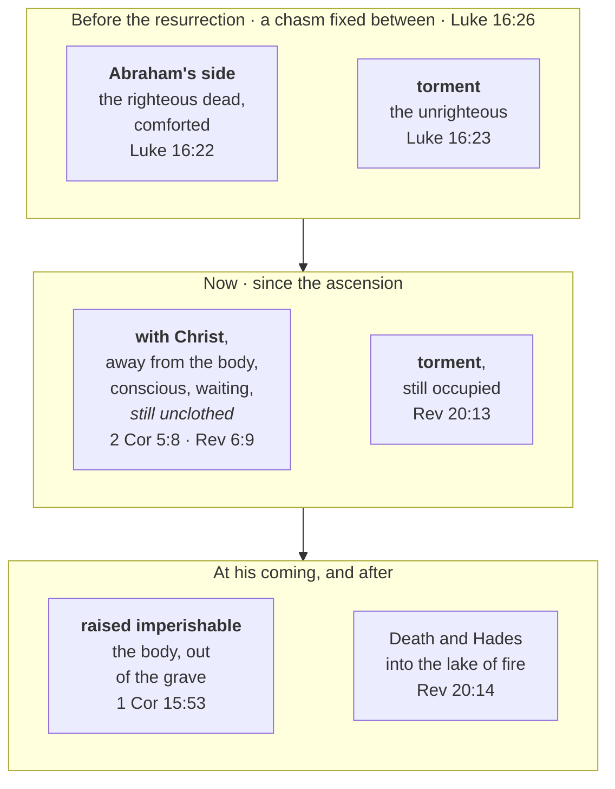

# At Home with the Lord

*(Forked verbatim from [Three Days and Three Nights](../jesus/three-days-and-three-nights.md) on
2026-09-26 by the simplify-bible-study pass. Needs its own opening, thesis and Key Takeaways from
develop-bible-study before publishing.)*

## Did the descent empty Abraham's side?

This is the question the two-compartment reading raises and the one where its evidence is thinnest,
so it gets its own answer rather than an assumption.

> ✝️ Ephesians 4:8-10 (ESV)
>
> 8 Therefore it says, "When he ascended on high he led a host of captives, and he gave gifts to
> men." 9 (In saying, "He ascended," what does it mean but that he had also descended into the lower
> regions, the earth? 10 He who descended is the one who also ascended far above all the heavens,
> that he might fill all things.)

Read as a descent into Hades that returns leading the Old Testament saints upward, this is the
proof-text for the emptying of Abraham's side. **Both halves of that reading are contested, and the
contesting is not fringe.** The CSB footnotes verse 9's genitive as "Or *the lower parts, namely, the
earth*" — which makes the descent the incarnation, not a journey below the ground, and the *ESV
Study Bible* takes it exactly that way. On the captives, the *ESV Study Bible* judges them "most
likely demons" and the *NIV Biblical Theology Study Bible* "the spiritual powers Christ conquered by
the cross," pointing at Colossians 2:15; the latter states outright that the passage "probably does
not refer to Christ's descent into Hades."

So the answer this study gives is a qualified one. That the righteous dead are now with Christ rather
than waiting below is taught clearly enough elsewhere — "away from the body and at home with the
Lord" (2 Corinthians 5:8) — and the two-compartment reading has a natural moment for that change.
But Ephesians 4:8 is a weaker witness to it than it is usually made to carry, and a reader should
know that the verse most often quoted for the emptying of Abraham's side is one its own commentators
mostly read another way.

## Away from the body, at home with the Lord

Whatever changed for the righteous dead at the ascension, it was a change of *address*, not of
condition — and the distinction matters, because it is easy to read "the descent emptied Abraham's
side" as though the resurrection of believers had therefore already happened. It has not. The body
is still owed.

**Paul is explicit that the state he expects at death is a disembodied one, and that he does not
much like it.**

> ✝️ 2 Corinthians 5:3-4, 8 (ESV)
>
> 3 if indeed by putting it on we may not be found naked. 4 For while we are still in this tent, we
> groan, being burdened—not that we would be unclothed, but that we would be further clothed, so
> that what is mortal may be swallowed up by life… 8 Yes, we are of good courage, and we would
> rather be away from the body and at home with the Lord.

"Away from the body and at home with the Lord" is the gain, and "far better" than staying
(Philippians 1:23). But verse 4 says what he actually wants, and it is not to be *unclothed* — it is
to be *further clothed*. Being with Christ without a body is better than here; it is not the end.

**Revelation shows that state still running, long after the ascension.** The martyrs under the fifth
seal are conscious, vocal, and explicitly *waiting*: "they were each given a white robe and told to
rest a little longer, until the number of their fellow servants and their brothers should be
complete" (Revelation 6:9-11). They are with God and they are not yet raised.

## The body, still owed

**The raising is a separate, future, bodily event.** "The dead in Christ will rise first. Then we who
are alive… will be caught up together with them in the clouds" (1 Thessalonians 4:16-17) — and what
rises is a body: "this perishable body must put on the imperishable, and this mortal body must put
on immortality" (1 Corinthians 15:53). Notice the sequence in 1 Thessalonians 4:14: God will "bring
*with* him those who have fallen asleep," and *then* their dead rise. The person comes with Christ;
the body comes out of the ground.

So there are three states in view, not two:

| | The body | Where the person is |
|---|---|---|
| **Alive now** | mortal — "this tent" | "at home in the body… away from the Lord" (2 Corinthians 5:6) |
| **Died, before his coming** | in the grave | "away from the body and at home with the Lord" (2 Corinthians 5:8) |
| **At his coming** | raised imperishable (1 Corinthians 15:52-53) | "so we will always be with the Lord" (1 Thessalonians 4:17) |

**Christ's own case is the exception that establishes the rule.** His tomb was empty; the tombs of
those who belong to him are not, yet. That is exactly what "firstfruits" claims — "Christ the
firstfruits, then at his coming those who belong to Christ" (1 Corinthians 15:23). He has already
passed through the third row of that table. Nobody else has. The three days settled where the dead
go and who holds the keys; they did not empty the graves, and the New Testament never says they did.

## The whole arrangement in one view

Three sections of prose, laid out at once. The two tracks run side by side because that is the
study's actual claim: **one realm holding two conditions**, of which only one was emptied.

Two things the picture settles that the prose above has to keep restating. **The change was on one
side only** — the right-hand column runs unbroken from Luke 16 to Revelation 20, which is why "the
descent emptied Hades" is too strong a sentence for what the texts say. And **the middle row is
where the reader is now**: with Christ is not the last row, and the body is still in the third one.

## Larkin's own chart

Clarence Larkin drew this arrangement in *Dispensational Truth* (1918; expanded 1920), and his chart
is the reason many readers picture it at all. It is reproduced here because it states the classic
dispensational position more completely than any summary of it can.

Larkin's labels carry the whole reading. **"Paradise"** is "the abode of the souls of the
'righteous dead' until Christ's resurrection — **it is now empty**"; **"Hell"** is "the abode of the
souls of the 'wicked dead' — **still occupied**"; between them "**The Great Gulf**, Luke 16:19-31."
Below both sit *Tartarus*, "the prison of the fallen angels" (2 Peter 2:4; Jude 6), and the abyss,
distinct from the lake of fire at the far right — so Larkin, like this study, keeps Hades and the
final judgment apart rather than collapsing them into one "hell." He also labels the ascending
arrow off the cross **"the first fruits"**, which is the same 1 Corinthians 15:20-23 argument the
prose reaches by a different route.

**Where it goes beyond what this study will claim.** Larkin draws as settled two things named above
as contested. The arrow taking the righteous souls out of the underworld is captioned with
Ephesians 4:8-10 — the passage whose "captives" the *ESV Study Bible* judges "most likely demons"
and whose descent the *NIV Biblical Theology Study Bible* says "probably does not refer to Christ's
descent into Hades." And the right-hand third of the chart runs the resurrections and judgments out
through the tribulation and the thousand years, which is a further argument this study does not make.
So the chart is best read as **the position drawn**, not as evidence for it: a clear picture of the
conclusion, by someone who held it without the reservations recorded here.

## Discussion questions

1. **Be transformed.** Paul says being with Christ is "far better" than staying here, and in the
   same letter says he does not want to be found "unclothed." Both at once. Why might he refuse to
   treat being with Christ as the finish line — and does the way Christians usually speak at a
   funeral keep that distinction or lose it?

## References & Recommended Reading

- **ESV Study Bible** (Crossway) — notes on Ephesians 4:8-9.
- **NIV Biblical Theology Study Bible** (Zondervan) — notes on Ephesians 4:8-9.
- **CSB Ancient Faith Study Bible** (Holman) — translator footnote at Ephesians 4:9.
- **Clarence Larkin**, "The Underworld," from *Dispensational Truth, or God's Plan and Purpose in
  the Ages* (1918; expanded 1920). Public domain — see [copyright](../about/copyright.md#public-domain-charts).
  Reproduced above as a statement of the classic dispensational position, with the points this study
  does not follow named alongside it.
