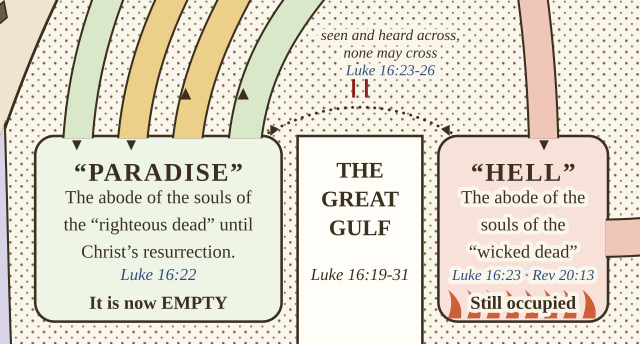
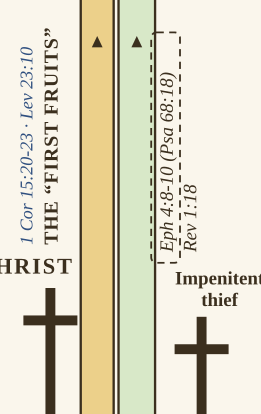
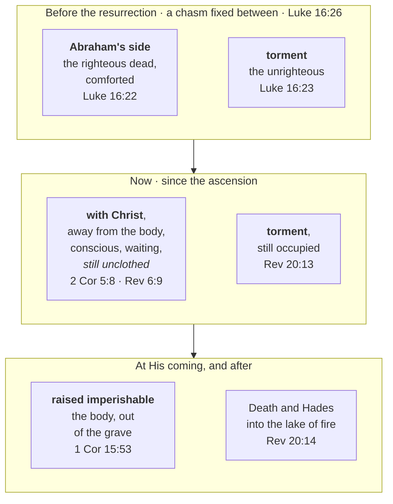

# At Home with the Lord

Paul wrote this passage soon after he expected to die. In Asia, he told the Corinthians, "we were so
utterly burdened beyond our strength that we despaired of life itself" (2 Corinthians 1:8, ESV). So
when he writes about the tent coming down, he is writing about his own death, and he writes it with
courage.

**In one sentence:** A believer who dies goes at once to be at home with the Lord Jesus, conscious
and without the body, and waits there for the resurrection of the body at His coming; God keeps the
whole person, the soul with His Son now and the body for the day He raises it. Paul states the
destination plainly. That the arrangement began at the ascension is the historic dispensational
reading, and it is contested (see [Where were they before?](#where-were-they-before)).

Clarence Larkin's chart of the underworld (1920) draws the whole arrangement this study weighs. The
redrawn version keeps his labels in black and adds, in blue, the verses this study rests each point
on. Details from it stand beside the sections they picture, and
[Larkin's own chart](#larkins-own-chart) says where the study follows him and where it parts from
him.

=== "Redrawn"

    [![Larkin's The Underworld, redrawn: Paradise and Hell as compartments of Hades either side of the Great Gulf, a dotted line over it marking that each side is seen and heard across and never crossed (Luke 16:23-26), Tartarus and the Abyss below them and the lake of fire apart, holding the Beast with seven lion-mouthed heads and ten crowned horns and the two-horned lamb of a False Prophet (Revelation 13:1-2, 11); from the three crosses the souls of the penitent thief and of Christ go down to Paradise and the impenitent thief's soul to Hell, and the righteous souls rise with Christ as the first fruits; on the right the Harvest, the Gleanings seven years later and the Tares a thousand years after that. Blue references added from this study: Luke 16:22 and 23:43 for Paradise, Luke 16:23 and Revelation 20:13 for Hell, 2 Corinthians 5:8, Philippians 1:23, 2 Corinthians 12:2-4 and Revelation 2:7 for the righteous now with Christ, 1 Corinthians 15:20-23 and Leviticus 23:10 for the first fruits, 1 Thessalonians 4:14 for the souls returning, 1 Corinthians 15:51-53 for the harvest, and Revelation 20:5 for the rest of the dead; Larkin's Ephesians 4:8-10 caption is boxed with a dashed line](../assets/img/last-things/larkin-underworld.svg)](../assets/img/last-things/larkin-underworld.svg)

=== "Larkin's original (1920)"

    

## Key Takeaways

*(This section follows the [Key Takeaways](../about/key-takeaways.md) format — see that page for what each part is for.)*

### Types & Prophecy

- **Firstfruits.** Jesus rose as "the firstfruits, then at his coming those who belong to Christ"
  (1 Corinthians 15:23, ESV). Israel brought "the sheaf of the firstfruits" of the harvest to the
  priest (Leviticus 23:10, ESV). That first sheaf is a type: His risen body is the pledge that the
  rest of the field will be raised.
- **The prophecy still ahead.** "The dead in Christ will rise first" (1 Thessalonians 4:16, ESV).
  The raising of the believing dead is a future event, at the Lord's coming for His church.

### Lessons about Jesus

- **Jesus is where His people go.** Paul's hope at death is a Person: "at home with the Lord"
  (2 Corinthians 5:8, ESV), "to depart and be with Christ" (Philippians 1:23, ESV).
- **Jesus promised His company on the cross.** To a dying thief: "today you will be with me in
  paradise" (Luke 23:43, ESV).
- **Jesus will raise the body.** He "will transform our lowly body to be like his glorious body"
  (Philippians 3:21, ESV).

### Memory verses

> ✝️ 2 Corinthians 5:8 (ESV)
>
> 8 Yes, we are of good courage, and we would rather be away from the body and at home with the Lord.

> ✝️ Philippians 1:21 (ESV)
>
> 21 For to me to live is Christ, and to die is gain.

### Be Transformed

- **Think.** A Christian who dies is with Jesus at once. The body in the grave is kept by God
  and will be raised.
- **Attitude.** Grieve with hope. Paul wrote so that "you may not grieve as others do who have no
  hope" (1 Thessalonians 4:13, ESV).
- **Do.** Make it your aim to please the Lord this week, "whether we are at home or away"
  (2 Corinthians 5:9, ESV). Then "encourage one another with these words" (1 Thessalonians 4:18,
  ESV): tell one grieving believer where their loved one is.

### Prayer

Father, You have prepared us for this very thing, and You have given us Your Holy Spirit as Your
pledge. Thank You that those who have died in Your Son Jesus are at home with Him now, and that not
one of their bodies is lost to You. Give us good courage in this tent. Make it our aim to please
You, here or there, until Jesus comes and raises the dead and we are always with Him.

In Jesus' name. Amen.

## Study outline

- [The passage in its letter](#the-passage-in-its-letter). Why Paul wrote about dying, and where the
  paragraph sits in 2 Corinthians 4-5.
- [Two verbs for home](#two-verbs-for-home). ἐνδημέω and ἐκδημέω, and the Spirit as God's pledge.
- [Away from the body, at home with the Lord](#away-from-the-body-at-home-with-the-lord). The
  believer at death: with Christ, conscious, waiting. Includes the contested "naked" of verse 3.
- [The body God has promised](#the-body-god-has-promised). The resurrection as a separate, future, bodily
  event, and three states side by side.
- [Where were they before?](#where-were-they-before) The two-compartment reading of Hades, and
  Ephesians 4:8-10, which is contested.
- [The whole arrangement in one view](#the-whole-arrangement-in-one-view). A diagram.
- [Larkin's own chart](#larkins-own-chart). The classic dispensational picture, as historical
  witness, and Tartarus, Peter's word for the prison of the angels.
- [Discussion questions](#discussion-questions). Five, for a group or on your own.

## The passage in its letter

> ✝️ 2 Corinthians 5:1-8 (ESV)
>
> 1 For we know that if the tent that is our earthly home is destroyed, we have a building from God,
> a house not made with hands, eternal in the heavens. 2 For in this tent we groan, longing to put on
> our heavenly dwelling, 3 if indeed by putting it on we may not be found naked. 4 For while we are
> still in this tent, we groan, being burdened—not that we would be unclothed, but that we would be
> further clothed, so that what is mortal may be swallowed up by life. 5 He who has prepared us for
> this very thing is God, who has given us the Spirit as a guarantee. 6 So we are always of good
> courage. We know that while we are at home in the body we are away from the Lord, 7 for we walk by
> faith, not by sight. 8 Yes, we are of good courage, and we would rather be away from the body and
> at home with the Lord.

### The occasion

Paul wrote 2 Corinthians from Macedonia around AD 55/56 (*ESV Study Bible*, introduction). It was
his fourth letter to a church he had planted. Opponents there said he suffered too much to be a
Spirit-filled apostle. He answers that his weakness is where God's power shows. He had just come
close to death: "we felt that we had received the sentence of death. But that was to make us rely
not on ourselves but on God who raises the dead" (1:9, ESV).

Paul made tents at Corinth (Acts 18:3), and a Corinthian reader knew what it was to strike one.

### The paragraph

The unit runs from 4:16 to 5:10. It opens, "So we do not lose heart. Though our outer self is
wasting away, our inner self is being renewed day by day" (4:16, ESV). It closes at "the judgment
seat of Christ" (5:10). Between them Paul answers one question: how can a body that is wasting away
face death with courage? His answer has three parts. God has a building ready (5:1). God has given
the Spirit as His pledge (5:5). And death takes the believer home to the Lord (5:8).

## Two verbs for home

Paul builds verses 6-9 on a pair of verbs. **ἐνδημέω** (*endēmeō*, en-day-MEH-oh, G1736) is to be at home
among your own people. **ἐκδημέω** (*ekdēmeō*, ek-day-MEH-oh, G1553) is to be away from home, abroad. Both
are built on δῆμος, a people. Each occurs three times in the New Testament, and all six sit in
2 Corinthians 5:6, 8 and 9.

The pair turns over between verse 6 and verse 8:

| | at home (ἐνδημέω) | away (ἐκδημέω) |
|---|---|---|
| **5:6, now** | "in the body" | "from the Lord" |
| **5:8, at death** | "with the Lord" | "from the body" |

Death swaps the two. The believer leaves one home and arrives at the other. The preposition in
verse 8 is πρὸς τὸν κύριον, "with the Lord": the language of a person in someone's company. Verse 9
then uses the pair once more, "whether we are at home or away," and draws the duty from both: "we
make it our aim to please him" (5:9, ESV).

**The Holy Spirit is the pledge that it will happen.** "He who has prepared us for this very thing is
God, who has given us the Spirit as a guarantee" (5:5, ESV). The word is **ἀρραβών** (*arrabōn*,
ar-rah-BONE, G728), a pledge or down payment. It occurs three times in the New Testament, and in every one
the pledge is the Spirit (2 Corinthians 1:22; 5:5; Ephesians 1:14). The Greek Old Testament uses it
for the pledge Judah left with Tamar, his signet, cord and staff, held until the payment came
(Genesis 38:17-20). The *NIV Biblical Theology Study Bible* gives the word's two senses: a pledge
that makes the final payment obligatory, and a first instalment of the payment itself. Either way
God has bound Himself. The Spirit living in you now is His guarantee that He will finish what He
began.

This shows that God Himself prepares His people for death. He has "prepared us for this very
thing" (5:5), and He has put His own Spirit down as security.

## Away from the body, at home with the Lord

Whatever changed for the righteous dead at the ascension, it changed their *address*. Their bodies
still wait for the resurrection of believers, which has not happened yet. God has promised the
body, and He will give it.

**Paul expects to be without the body at death, and he wants more than that state.**
"Away from the body and at home with the Lord" is the gain. To the Philippians he calls it "far
better":

> ✝️ Philippians 1:21-24 (ESV)
>
> 21 For to me to live is Christ, and to die is gain. 22 If I am to live in the flesh, that means
> fruitful labor for me. Yet which I shall choose I cannot tell. 23 I am hard pressed between the
> two. My desire is to depart and be with Christ, for that is far better. 24 But to remain in the
> flesh is more necessary on your account.

Yet 2 Corinthians 5:4 says what he wants most: to be "further clothed, so that what is mortal may be
swallowed up by life." Being with Christ without a body is better than here. The resurrection is
better still.

*From the chart: the thief goes with Christ to Paradise (Luke 23:43), and the righteous rise to be with Christ (2 Corinthians 5:8; Philippians 1:23).*

### "Naked" in verse 3: a contested word

**What Paul means by being "found naked" (5:3) and "unclothed" (5:4) is disputed.**

- **The intermediate state.** The *ESV Study Bible* reads nakedness as the state "in which
  believers' spirits are with God but they do not yet enjoy their resurrected bodies." Paul shrinks
  from it and longs to pass straight to the resurrection body.
- **A Corinthian error.** The *NIV Biblical Theology Study Bible* suggests some Corinthians wanted
  to be disembodied for ever, and that Paul is rejecting that view. It records the first reading as
  the one "some commentators" hold.

This study takes the first reading, because verse 8 goes on to describe exactly that state, "away
from the body." The thesis rests on verse 8. On both readings Paul's hope is a body,
and on both readings verse 8 puts the believer with the Lord at death.

### The martyrs under the altar

**Revelation shows that state still running long after the ascension.** The martyrs under the fifth
seal are conscious, vocal and *waiting*: "they were each given a white robe and told to rest a
little longer, until the number of their fellow servants and their brothers should be complete"
(Revelation 6:11, ESV). They are with God and they are not yet raised.

The ESV Study Bible's note on 2 Corinthians 5:8 draws the same line: at death Paul expects to go
"immediately into the presence of Christ" and to remain there until the day of resurrection. Jesus
promised the thief His company the same day: "today you will be with me in paradise" (Luke 23:43,
ESV). Where that Paradise was then, and where it is now, is taken up in
[The thief and Paradise](#the-thief-and-paradise).

This shows that God receives a believer at death into the company of His Son Jesus, at once. No
believer waits alone.

## The body God has promised

**The raising is a separate, future, bodily event.** "The dead in Christ will rise first. Then we who
are alive… will be caught up together with them in the clouds" (1 Thessalonians 4:16-17, ESV). What rises
is a body: "this perishable body must put on the imperishable, and this mortal body must put on
immortality" (1 Corinthians 15:53, ESV).

Notice the order in 1 Thessalonians 4:14. God will "bring *with* him those who have fallen asleep"
(ESV), and then, in 4:16, the dead rise. The person comes with Christ. The body comes out of the
ground. Some read "bring with him" as the raising itself; this study reads it with the sequence
that 4:16 then spells out.

*From the chart: Christ the firstfruits first, then the souls come with Him and the bodies rise out of the grave (1 Thessalonians 4:14-16).*

So Scripture names three states:

| | The body | Where the person is |
|---|---|---|
| **Alive now** | mortal — "this tent" | "at home in the body… away from the Lord" (2 Corinthians 5:6) |
| **Died, before His coming** | in the grave | "away from the body and at home with the Lord" (2 Corinthians 5:8) |
| **At His coming** | raised imperishable (1 Corinthians 15:52-53) | "so we will always be with the Lord" (1 Thessalonians 4:17) |

**Christ's own case is the exception that establishes the rule.** His tomb was empty. The tombs of
those who belong to Him are still full. That is what "firstfruits" claims: "Christ the firstfruits,
then at his coming those who belong to Christ" (1 Corinthians 15:23). He has already passed into the
third row of that table. Nobody else has. His body also shows where the ascension falls. Before it,
the risen Lord offered the marks: "See my hands and my feet... a spirit does not have flesh and
bones" (Luke 24:39, ESV), and to Thomas, "see my hands; and put out your hand, and place it in my
side" (John 20:27, ESV). After it, John sees One whose "face was like the sun shining in full
strength" (Revelation 1:16, ESV) and, in the same book, "a Lamb standing, as though it had been
slain" (Revelation 5:6, ESV). The glory had been shown once in advance, at the transfiguration
(Matthew 17:2), and it is His in the book of Revelation. This is an inference, and a modest one: it
makes the ascension a threshold in Christ's own state, and Paul calls the body we will receive "like
his glorious body" (Philippians 3:21, ESV). It does not by itself move the dead from one place to
another. His three days in death settled where the dead go and who
holds the keys (see [what those days achieved](../jesus/three-days-and-three-nights.md#what-those-days-achieved)).
The graves are emptied at His coming.

This is the doctrine of the resurrection of the body, and it shows that God counts the body as part
of the person He redeemed. He leaves nothing of you in the ground for good. What that raised body
will be is the subject of [We Shall All Be Changed](we-shall-all-be-changed.md).

## Where were they before?

Before the cross the righteous dead were held somewhere. Jesus describes the far side of death in
Luke 16: Lazarus "carried by the angels to Abraham's side," the rich man "in Hades, being in
torment," and "a great chasm" fixed between them (Luke 16:22-23, 26, ESV).
[Three Days and Three Nights](../jesus/three-days-and-three-nights.md#abrahams-side-paradise-and-the-great-chasm)
works through that passage. It holds the historic dispensational reading: one Hades with two
compartments, comfort at Abraham's side and torment across the chasm. The commentaries on this
site's shelf mostly take Abraham's side as heaven already. The question is contested.

*From the chart: the two-compartment reading as Larkin drew it, each side in sight of the other and the chasm fixed between (Luke 16:23-26).*

On the two-compartment reading, something changed at the ascension. Before it, the righteous dead
were comforted at Abraham's side. After it, they are "at home with the Lord." When did Abraham's
side empty?

### Did the descent empty Abraham's side?

This is the place where the two-compartment reading's evidence is thinnest.

> ✝️ Ephesians 4:8-10 (ESV)
>
> 8 Therefore it says, "When he ascended on high he led a host of captives, and he gave gifts to
> men." 9 (In saying, "He ascended," what does it mean but that he had also descended into the lower
> regions, the earth? 10 He who descended is the one who also ascended far above all the heavens,
> that he might fill all things.)

*From the chart: Larkin's caption for the first fruits, boxed dashed as the proof-text weighed here.*

Read as a descent into Hades that returns leading the Old Testament saints upward, this is the
proof-text for the emptying of Abraham's side. **Both halves of that reading are contested, and
serious commentators contest them.**

- **The descent.** The CSB footnotes verse 9's genitive as "Or *the lower parts, namely, the
  earth*." That makes the descent the incarnation, Christ coming down to earth, and the *ESV Study
  Bible* takes it that way.
- **The captives.** The *ESV Study Bible* judges them "most likely demons." The *NIV Biblical
  Theology Study Bible* has "the spiritual powers Christ conquered by the cross," pointing at
  Colossians 2:15, and says the passage "probably does not refer to Christ's descent into Hades."
- **Open on the descent.** The *NIV Cultural Backgrounds Study Bible* allows that "lower, earthly
  regions" could mean "the place of the dead" or the incarnation, and the *NLT Life Application Study
  Bible* lists the earth, the grave or Hades. Two notes read the descent as the incarnation and two
  leave it open.

So the answer here is a qualified one. That the righteous dead are now with Christ is taught plainly
in 2 Corinthians 5:8 and Philippians 1:23. The two-compartment reading has a natural moment for the
change. But Ephesians 4:8 is a weaker witness to it than it is usually made to carry. The verse most
often quoted for the emptying of Abraham's side is one that two of the four notes read as the
incarnation, and the other two do not settle.

### The thief and Paradise

**On the two-compartment reading Luke 23:43 and the present state are both true, because they fall
at different times.** Jesus told the thief, "today you will be with me in paradise" (Luke 23:43,
ESV). On that reading Paradise on the Friday was Abraham's side, and the thief was with Christ there.
The word παράδεισος occurs twice more in the New Testament, both after the ascension and both in
heaven: Paul was "caught up into paradise," which he also calls "the third heaven" (2 Corinthians
12:2-3, ESV, written about AD 55), and the tree of life stands "in the paradise of God" (Revelation
2:7, ESV). One before the ascension, two after, in different places: Paradise moved. The text does
not say how or when, and this is the evidence for the move that does not lean on Ephesians 4:8.

**The other reading has nothing to move.** The *ESV Study Bible* takes Paradise at Luke 23:43 as
"another name for heaven," so the thief went where Paul went. Both readings end with the believer
who dies with Christ. They differ on whether anything changed at the ascension, which is why the
thesis marks that timing as contested. The same question, at greater length, is in
[Three Days and Three Nights](../jesus/three-days-and-three-nights.md#which-paradise-did-jesus-and-the-thief-go-to).

## The whole arrangement in one view

The sections above, laid out at once. The two tracks run side by side because that is the claim:
**one realm holding two conditions**, of which only one was emptied.

```mermaid
flowchart TD
    subgraph BEF["Before the resurrection · a chasm fixed between · Luke 16:26"]
      direction LR
      B1["<b>Abraham's side</b><br/>the righteous dead,<br/>comforted<br/>Luke 16:22"]
      B2["<b>torment</b><br/>the unrighteous<br/>Luke 16:23"]
      B1 ~~~ B2
    end
    subgraph NOW["Now · since the ascension"]
      direction LR
      N1["<b>with Christ</b>,<br/>away from the body,<br/>conscious, waiting,<br/><i>still unclothed</i><br/>2 Cor 5:8 · Rev 6:9"]
      N2["<b>torment</b>,<br/>still occupied<br/>Rev 20:13"]
      N1 ~~~ N2
    end
    subgraph FIN["At His coming, and after"]
      direction LR
      F1["<b>raised imperishable</b><br/>the body, out<br/>of the grave<br/>1 Cor 15:53"]
      F2["Death and Hades<br/>into the lake of fire<br/>Rev 20:14"]
      F1 ~~~ F2
    end
    BEF --> NOW
    NOW --> FIN
```

The picture settles two things. **The change was on one side only.** The right-hand column runs
unbroken from Luke 16 to Revelation 20, which is why "the descent emptied Hades" says more than the
texts do. And **the middle row is where the believing dead are now.** It is the second of three rows.
The body still waits for the third.

## Larkin's own chart

Clarence Larkin drew this arrangement in *Dispensational Truth* (1918; expanded 1920), and his chart
is the reason many readers picture it at all. It stands at the top of this study, redrawn and in the
original, as historical witness: it states the classic dispensational position more completely than
a summary can.

### What his labels say

Larkin's labels carry the whole reading. **"Paradise"** is "the abode of the souls of the
'righteous dead' until Christ's resurrection — **it is now empty**"; **"Hell"** is "the abode of the
souls of the 'wicked dead' — **still occupied**"; between them "**The Great Gulf**, Luke 16:19-31."
Below both sit *Tartarus*, "the prison of the fallen angels" (2 Peter 2:4; Jude 6), and the abyss.
The lake of fire stands apart at the bottom right. So Larkin, like this study, keeps Hades and the
final judgment as two separate things. He also labels the ascending arrow off the cross **"the first
fruits"**, the same 1 Corinthians 15:20-23 argument made above.

### Tartarus, the prison of the angels

**Tartarus is Peter's word, and this study takes his distinction as given.** Where the ESV has
"cast them into hell" (2 Peter 2:4), Peter wrote one verb, **ταρταρόω** (*tartaroō*, tar-tar-OH-oh,
G5020), "consign to Tartarus." Jude describes the same place without naming it: angels "kept in
eternal chains under gloomy darkness until the judgment of the great day" (Jude 6, ESV). So
Scripture sets these angels apart from the dead in Hades: a prison of their own, for a sin of their
own, held for a judgment still to come. The Hebrew Bible has no name for that prison. Its nearest
picture is Isaiah 24:21-22, where the LORD punishes "the host of heaven" and they are "shut up in a
prison, and after many days they will be punished" (ESV). Larkin's line into Tartarus from Genesis
6:1-4 takes the "sons of God" there as angels, a contested reading that Jude 6-7 is usually cited
for. 1 Enoch, which Jude quotes (Jude 14-15), names Tartarus and binds the rebel angels in darkness
until the judgment (1 Enoch 10:4-6, 12-13; 20:2; 21:10). It shows what Peter's and Jude's first
readers already pictured. It is background and carries no doctrinal weight.

The word itself is older than Peter. Greek poets put a pit below Hades where defeated rebel powers
lay chained in darkness (Hesiod, *Theogony* 713-735). The memory is likely older than the poets. A
story of heavenly rebels bound beneath the earth fits Genesis 6 and Isaiah 24 well enough that the
Greek telling may preserve a distorted memory of what God did, much as the bronze serpent Moses
lifted up (Numbers 21:8-9) became an object of worship until Hezekiah broke it in pieces (2 Kings
18:4). That connection cannot be proved, and it is held here as a likelihood. What is certain is
Peter's use: he took the one word his readers knew for that prison and told them God put the angels
there.

### Where the study follows him, and where it stops

**The arrow's conclusion is sound.** Before the cross the righteous dead were comforted at
Abraham's side (Luke 16:22); Christ rose as "the firstfruits" (1 Corinthians 15:23); and since then
the believer who dies is "at home with the Lord" (2 Corinthians 5:8) and "with Christ"
(Philippians 1:23). Those texts carry Larkin's reading properly, and this study holds it with him.

**Where it goes beyond what this study will claim.** The caption is the weak point. Larkin labels
the arrow with Ephesians 4:8-10, and the *ESV Study Bible* and *NIV Biblical Theology Study Bible* read its
descent as the incarnation and its captives as the powers Christ conquered, while two others leave
the descent open (see
[Did the descent empty Abraham's side?](#did-the-descent-empty-abrahams-side)). The picture is right;
the verse written beside it is probably the wrong one to prove it. And the right-hand third of the
chart runs the resurrections and judgments out through the tribulation and the thousand years, a
further argument this study does not make. So read the chart as **the position drawn**: a clear
picture of the conclusion, by someone who held it without the reservations recorded here.

## Discussion questions

1. **The language.** Paul uses the same two verbs in 2 Corinthians 5:6 and 5:8, with "the body" and
   "the Lord" swapped. What does that swap say about which of the two is really home?
2. **The text in its context.** Paul had "despaired of life itself" in Asia (2 Corinthians 1:8).
   How might that experience shape the way he writes about the tent coming down in 5:1-8?
3. **Christ.** Jesus rose as "the firstfruits" (1 Corinthians 15:23). What does His empty tomb
   promise about the graves of believers you have known?
4. **The hard part.** Paul calls being with Christ "far better" (Philippians 1:23), and in the same
   season says he longs not to be "unclothed" (2 Corinthians 5:4). How do you hold those two
   sentences together?
5. **Be transformed.** Christians at a funeral often say the one who died is "in a better place."
   Measured against 1 Thessalonians 4:13-18, what would you add to that sentence?

## References & Recommended Reading

- **ESV Study Bible** (Crossway) — introduction to 2 Corinthians; notes on 2 Corinthians 5:1-10 and
  5:8, and on Ephesians 4:8-9.
- **NIV Biblical Theology Study Bible** (Zondervan) — notes on 2 Corinthians 5:1-10 (including
  ἀρραβών at 5:5 and "naked" at 5:3-4) and on Ephesians 4:8-9.
- **CSB Ancient Faith Study Bible** (Holman) — translator footnote at Ephesians 4:9.
- **Macula Greek (SBLGNT)** — lemma, gloss and occurrence data for ἐνδημέω, ἐκδημέω and ἀρραβών.
- **Clarence Larkin**, "The Underworld," from *Dispensational Truth, or God's Plan and Purpose in
  the Ages* (1918; expanded 1920). Public domain — see [copyright](../about/copyright.md#public-domain-charts).
  Reproduced above as a statement of the classic dispensational position, with the points this study
  does not follow named alongside it.
- **1 Enoch** 10:4-6, 12-13; 20:2; 21:10 — English text in this repo's open deuterocanonical
  collection (R. H. Charles's wording). Second Temple background, cited for what Jude's and Peter's
  readers knew.
- **Hesiod**, *Theogony* 713-735 — the Greek poets' Tartarus, cited for the word Peter used.

### On this site

- [Three Days and Three Nights](../jesus/three-days-and-three-nights.md) — where Christ was between
  the cross and the empty tomb, Sheol and Hades, and Luke 16's two conditions.
- [We Shall All Be Changed](we-shall-all-be-changed.md) — the resurrection body itself, from
  1 Corinthians 15:35-58: what is raised, what it is like, and when.
