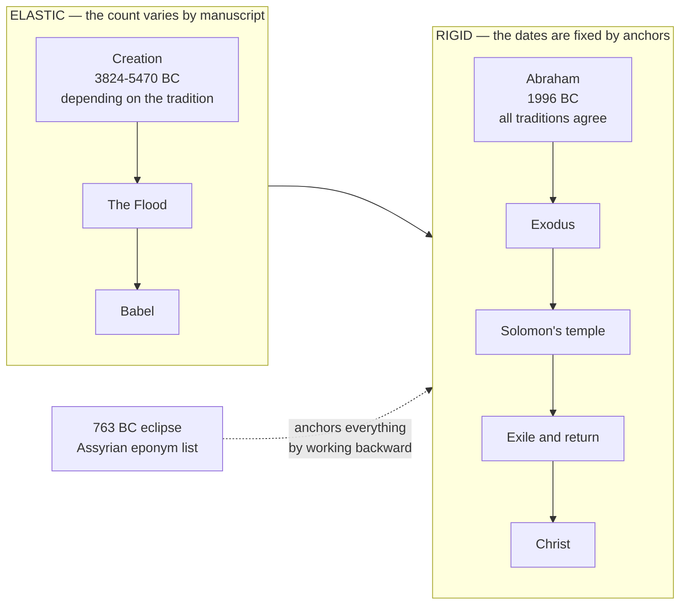
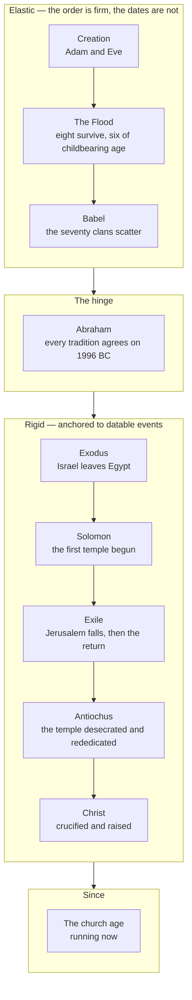
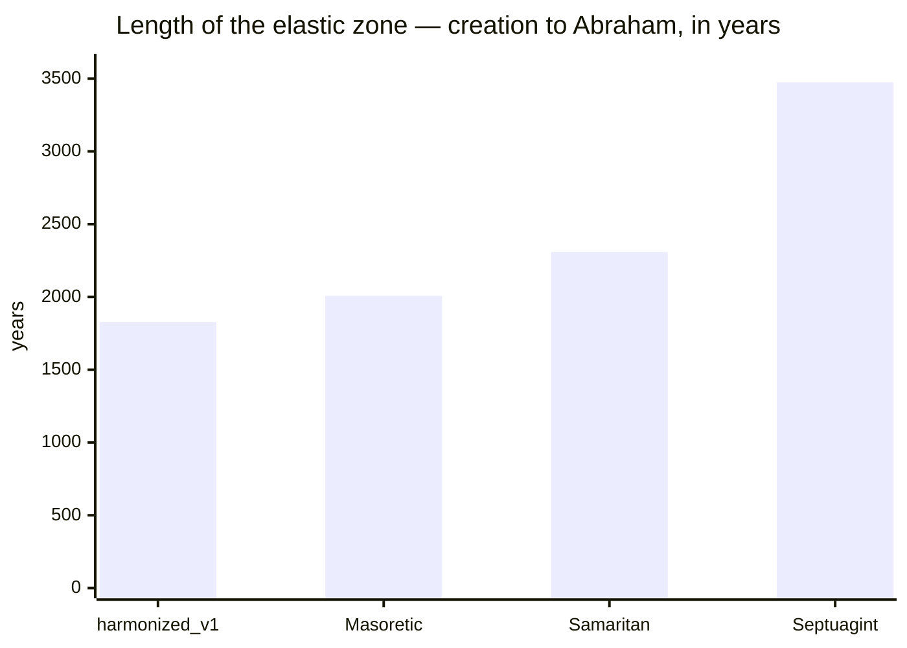

# The Combined Timeline: One Line, Two Zones

**The four manuscript traditions disagree about creation by 1,646 years and agree about Abraham to the year.** That single fact is the shape of biblical chronology. Everything above Abraham stretches; everything below him is fixed.

Two other pages hold the detail. [Genealogy and Times](genealogy-times.md) works through the manuscript evidence for the stretch above Abraham. [Chronology Anchors](chronology-anchors.md) lists the forty-one datable events below him. This page puts them on one line.

## Key Takeaways

### Lessons about Jesus

The timeline converges twice, and both convergences point the same way. Every manuscript tradition, however far apart it places creation, agrees on when Abraham was born — because all of them are measured back from the Exodus, and the Exodus is measured back from a temple whose builder is dated by an eclipse. Then the whole rail runs forward to a Friday in AD 33 that two independent chains reach on their own: Daniel's seventy weeks counted in prophetic years from a Persian decree, and Luke's note of the fifteenth year of a Roman emperor. A promise made to one childless man in Ur and a prophecy given in Babylon both terminate in the same week.

### Prayer

Father, you did not give us a timeline; you gave us a genealogy, a set of intervals and a Son who came in the fullness of time. Thank you that the parts we can count check out, and that the parts we cannot are still yours. Keep me from mistaking a number I have worked out for a certainty you have promised, and let the study of when you acted deepen my trust that you did. Amen.

## Why the timeline has two zones

Every dated event in Scripture ultimately hangs on one extra-biblical peg: a solar eclipse recorded by Assyrian scribes on 15 June 763 BC, which converts their eponym list from a relative sequence into an absolute one. From there, synchronisms fix Solomon's fourth year, 1 Kings 6:1's 480 years fix the Exodus, and Scripture's own intervals — Abram 75 at the call (Genesis 12:4), the 430 years of Galatians 3:17, Terah's age at Abram's birth from Acts 7:4 — carry the count back to Terah.

Above Terah the method changes completely. Genesis 5 and 11 give a father's age at his heir's birth for nineteen consecutive generations, ten from Adam to Noah and nine from Shem to Terah, and nowhere else does Scripture supply that. But those are exactly the figures the manuscript traditions disagree about, so the count above Abraham is only as firm as the text you read it from.

## The spine

The order of events is certain even where their dates are not. No manuscript tradition disputes any of this sequence.

The spine — order first, dates second.

## The elastic zone: creation to Abraham

Anno Mundi year and Gregorian date both move here, and they move together. Figures are from this repo's own generator under the active epoch scenario.

| Event | Masoretic | Septuagint | Samaritan | harmonized_v1 |
|---|---|---|---|---|
| Creation | AM 0 · 4004 BC | AM 0 · 5470 BC | AM 0 · 4305 BC | AM 0 · 3824 BC |
| Enoch born | AM 622 · 3382 BC | AM 1122 · 4348 BC | AM 522 · 3783 BC | AM 622 · 3202 BC |
| Noah born | AM 1056 · 2948 BC | AM 1642 · 3828 BC | AM 707 · 3598 BC | AM 936 · 2888 BC |
| The Flood (Genesis 7:11) | AM 1656 · 2348 BC | AM 2242 · 3228 BC | AM 1307 · 2998 BC | AM 1536 · 2288 BC |
| Peleg born | AM 1757 · 2247 BC | AM 2773 · 2697 BC | AM 1708 · 2597 BC | AM 1637 · 2187 BC |
| Terah born | AM 1878 · 2126 BC | AM 3344 · 2126 BC | AM 2179 · 2126 BC | AM 1758 · 2066 BC |
| **Abram born** | **AM 2008 · 1996 BC** | **AM 3474 · 1996 BC** | **AM 2309 · 1996 BC** | **AM 1828 · 1996 BC** |

The stretch itself is what varies. Measured in years from creation to Abraham's birth:

The Septuagint's chain is half as long again as the Samaritan's, and nearly twice `harmonized_v1`'s. Which of them preserves the older figures is a text-critical question, not an arithmetical one, and [Genealogy and Times](genealogy-times.md) works through the evidence — including the finding that the Samaritan Pentateuch sides with the Masoretic Text six times to nil in Genesis 5 and with the Septuagint six times to nil in Genesis 11, which is why the two chapters cannot be decided as one block.

## The hinge: why they all agree about Abraham

Every tradition puts Abram's birth at 1996 BC, to the year. That is not a coincidence and it is not evidence that the traditions agree — it is the anchoring working as designed. The chain from Abraham forward to the Exodus uses figures none of the traditions dispute: Abram 75 at the call (Genesis 12:4), 430 years to the Exodus (Exodus 12:40-41; Galatians 3:17), and Terah's age at Abram's birth derived from Acts 7:4. So fixing the Exodus fixes Abraham, and every variant inherits that date whatever it does above him.

Terah is the last person for whom Genesis supplies an age at his heir's birth, so he is where the two methods meet. Three of the four traditions even converge on his birth year as well; `harmonized_v1` differs only because it reads Genesis 11:26's seventy plainly, which the Samaritan Terah's 145-year total allows.

## The rigid zone: Abraham to now

Below the hinge the Gregorian dates stop moving. The manuscript question has no purchase here, because these dates come from contemporary documents and astronomy rather than from genealogy. Only the Anno Mundi *label* varies, and only by which epoch scenario is active — a 45-year shift applied uniformly, not a stretch.

| Event | Date | AM (`active`) | AM (`a_prime`) |
|---|---|---|---|
| Exodus | 1446 BC | 2558 | 2513 |
| Solomon's temple begun | 966 BC | 3038 | 2993 |
| Jerusalem falls | 586 BC | 3418 | 3373 |
| Cyrus's decree | 538 BC | 3466 | 3421 |
| Second temple completed | 515 BC | 3489 | 3444 |
| Temple rededicated | 164 BC | 3840 | 3795 |
| Crucifixion and Resurrection | AD 33 | 4036 | 3991 |
| Today | AD 2026 | 6029 | 5984 |

Forty-one events with their evidence, tiers and error bars are in [Chronology Anchors](chronology-anchors.md). Thirty-one of them carry an error bar of a year or less.

## What is settled and what is open

**Settled.** The order of events, throughout. The Gregorian dates below Abraham, to within a year for most of them. The crucifixion at Friday 3 April AD 33. The sabbatical cycle, anchored on three attested sabbatical years whose intervals are exact multiples of seven.

**Open, and tracked rather than guessed.** Which manuscript tradition preserves the older figures in Genesis 5 and 11 — the evidence splits by chapter. And which epoch scenario the site should use, which shifts every Anno Mundi label without moving a single Gregorian date below Abraham. Four scenarios are recorded in `docs/data/genealogy/index.json` with the arguments each way, and [The Zadok Calendar](../feasts/zadok-calendar.md#where-year-0-sits) sets them out.

The two open questions are independent. Nothing about choosing a manuscript tradition settles the epoch, and nothing about the epoch touches the manuscript evidence.

## Discussion questions

1. The traditions disagree about creation by more than sixteen centuries and agree about Abraham to the year. Does that make you more or less confident in the parts of the chronology that can be checked?
2. Genesis gives a father's age at his heir's birth for nineteen generations and then stops at Terah. Why might the text supply that much detail for the early period and none afterward?
3. Everything datable in Scripture ultimately hangs on an eclipse recorded by scribes who had no interest in the Bible. What do you make of God's providence running through a record like that?
4. The order of events is certain throughout while the dates are not. Which of the two does the biblical narrative actually depend on?

## References & Recommended Reading

- [Genealogy and Times](genealogy-times.md) — the manuscript evidence for the elastic zone, and the four timeline variants.
- [Chronology Anchors](chronology-anchors.md) — the forty-one datable events below Abraham, with tiers and error bars.
- [The Zadok Calendar](../feasts/zadok-calendar.md) — the calendar these Anno Mundi years are counted in, and the four epoch scenarios.
- [A Day Is a Thousand Years](day-is-a-thousand-years.md) — the millennial-week reading, and why the epoch question bears on it.
- `docs/data/genealogy/` — the source data. Per-tradition textual facts in `antediluvian.json` and `patriarchal.json`, anchoring decisions in `index.json`, and derived years in `generated/`, all produced by `references/build/genealogy_chronology.py`.
- **ESV Bible** (Crossway) — all scripture verified against `study-notes.db`.
