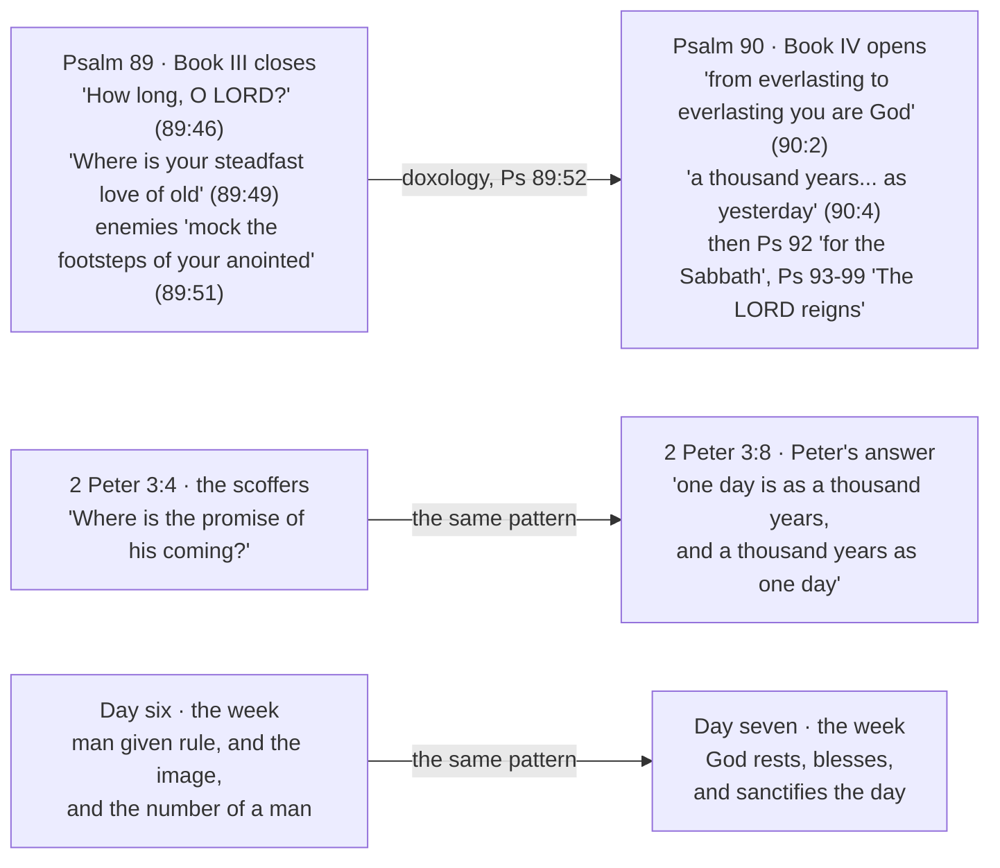

# A day is a thousand years

Peter wrote one sentence about time that his readers would have recognised instantly and that
most readers since have found puzzling. The puzzle is not in the sentence. It is that we have
lost the frame he was writing into — a frame in which the six days of Genesis 1 were already
understood as six thousand years of human history, and the seventh day as the reign still to
come.

!!! warning "Extra-biblical sources: useful, and not Scripture"

    This study quotes the book of Jubilees, 1 and 2 Enoch, the Babylonian Talmud, and a line of
    early church writers from Barnabas to Lactantius. None of them is Scripture. "All Scripture is
    breathed out by God" (2 Timothy 3:16) is said of the canon and of nothing else — not of the
    apocryphal and pseudepigraphal books, not of the rabbinic material, not of the church fathers,
    however early or however many of them agree.

    What these sources establish is what people believed, and when. That Jubilees read Genesis
    2:17 through a thousand-year day two centuries before Peter wrote is a fact about
    second-century-BC Judaism, and it bears on how a first-century reader would have heard
    2 Peter 3:8. It is not evidence that the reading is true.

    So treat them as you would any human commentary: useful, capable of being wrong, and always
    answerable to Scripture rather than the reverse. Where they agree with the text they
    corroborate; where they conflict with it, the text governs and they are simply mistaken. The
    arguments in this study that carry weight are the ones built from Scripture — the rest is
    context.

## Key Takeaways

*(This section follows the [Key Takeaways](../about/key-takeaways.md) format this site is
prototyping — see that page for what each part is for and why.)*

### Types & Prophecy

**Type.** The creation week is the pattern history runs on. God worked six days and rested on
the seventh (Genesis 2:1-3; Exodus 20:11), and Paul says the Sabbath built on that rest is "a
shadow of the things to come" (Colossians 2:17, ESV). The type is not the weekly ritual only —
it is the *shape*: labour under a curse for a fixed span, then rest, with the length of the
week fixed in advance by the one who made it.

**Prophecy.** Revelation numbers the rest. Six times in six verses (Revelation 20:2-7) John gives
the coming reign of Christ a duration — χίλια ἔτη, *chilia etē*, a thousand years. It is the only
place in Scripture where the length of that reign is stated.

### Lessons about Jesus

- He arrived at the hinge of the week. Hebrews says that "in these last days he has spoken to us
  by his Son" (1:2) — the incarnation is what marks the beginning of the last days, not a sign
  appearing within them.
- He is the one whose day it is. The Sabbath type resolves in a person: "the Son of Man is lord
  even of the Sabbath" (Mark 2:28), and the rest that remains is entered by faith in him
  (Hebrews 4:3, 10).
- He kept the day and hour to himself deliberately (Mark 13:32; Acts 1:7). The framework below
  gives history a shape; it never yields a date, and the reason is that he withheld one.

### Memory verses

Three verses in the order the argument runs — the week, the ratio, the rest.

> ✝️ Genesis 2:3 (ESV)
>
> 3 So God blessed the seventh day and made it holy, because on it God rested from all his work
> that he had done in creation.

> ✝️ 2 Peter 3:8 (ESV)
>
> 8 But do not overlook this one fact, beloved, that with the Lord one day is as a thousand years,
> and a thousand years as one day.

> ✝️ Hebrews 4:9 (ESV)
>
> 9 So then, there remains a Sabbath rest for the people of God,

### Be Transformed

- **Think.** God published the shape of history, and then spent the rest of Scripture calling his
  people to attention because of it — "the night is far gone; the day is at hand" (Romans 13:12),
  "all the more as you see the Day drawing near" (Hebrews 10:25), "you also must be ready, for the
  Son of Man is coming at an hour you do not expect" (Matthew 24:44). The pattern was given to
  make you ready. Its question is not when he comes, but how he finds you.
- **Attitude.** A long wait does not only test patience; it erodes expectation. Israel had a
  proverb for it — "The days grow long, and every vision comes to nothing" (Ezekiel 12:22) — and
  God answered by promising to abolish the proverb: "The days are near, and the fulfillment of
  every vision" (12:23). Jesus put the same sentence in a servant's mouth, "My master is delayed"
  (Matthew 24:48), and Peter's scoffers say it outright (3:4). Six thousand years is long enough
  to make that thought feel reasonable. Watch for it in yourself.
- **Do.** Readiness in Scripture means being found at your post. "Blessed is that servant whom his
  master will find so doing when he comes" (Matthew 24:46), and Peter's own instruction is the
  same — "be diligent to be found by him without spot or blemish" (2 Peter 3:14). And keep a
  Sabbath: one day a week of stopping, the seventh day practised in miniature, so the rest you are
  waiting for is not unfamiliar when it arrives.

### Prayer

Father, you made the week and you made time, and you set an end to it before you set it running.
You are not slow, and you are not absent. Teach me to read the days the way you wrote them — six
of labour and a seventh of rest — and to want your rest more than I want to know its date. Keep
me from the arrogance of calculating what your Son declined to know, and from the dullness of
living as though the seventh day were not coming. Amen.

## The verse, in its own argument

2 Peter is a letter, and it should be read the way a letter is read — as one side of an argument
with people whose position we only see through the author's reply. It names its writer in the
first line, "Simeon Peter, a servant and apostle of Jesus Christ" (1:1), addresses a general
readership rather than one congregation, and is written by a man who expects to die shortly
(1:14) and has sent these readers one letter already (3:1). The *ESV Study Bible* places it
around AD 64-67, from Rome, and identifies the likeliest recipients as the churches of Asia
Minor that received 1 Peter — while noting that neither the recipients nor the identity of the
false teachers behind chapter 2 can be established with certainty.

That opposition is what sets the terms of chapter 3.

> ✝️ 2 Peter 3:3-9 (ESV)
>
> 3 knowing this first of all, that scoffers will come in the last days with scoffing, following
> their own sinful desires. 4 They will say, "Where is the promise of his coming? For ever since
> the fathers fell asleep, all things are continuing as they were from the beginning of
> creation." 5 For they deliberately overlook this fact, that the heavens existed long ago, and
> the earth was formed out of water and through water by the word of God, 6 and that by means of
> these the world that then existed was deluged with water and perished. 7 But by the same word
> the heavens and earth that now exist are stored up for fire, being kept until the day of
> judgment and destruction of the ungodly. 8 But do not overlook this one fact, beloved, that
> with the Lord one day is as a thousand years, and a thousand years as one day. 9 The Lord is
> not slow to fulfill his promise as some count slowness, but is patient toward you, not wishing
> that any should perish, but that all should reach repentance.

Peter is answering an argument, and he builds his answer as a matched pair. Verse 5 opens
**λανθάνει γὰρ αὐτοὺς τοῦτο θέλοντας** (*lanthanei gar autous touto thelontas*) — "for this
escapes their notice, willingly." Verse 8 opens **Ἓν δὲ τοῦτο μὴ λανθανέτω ὑμᾶς** (*hen de touto
mē lanthanetō hymas*) — "but let this one thing not escape your notice." Same verb
(**λανθάνω**, *lanthanō*, G2990), same demonstrative, opposite polarity. There is one fact the
scoffers refuse to see and one fact the beloved must not miss, and Peter deliberately sets them
side by side.

The fact the scoffers refuse is that the world has already been destroyed once (3:5-6). Their
premise — "all things are continuing as they were from the beginning of creation" — is not an
observation, it is an assumption, and the Flood falsifies it. The fact the beloved must not miss
is the ratio.

Verse 8 is a chiasm in Greek: **μία ἡμέρα παρὰ κυρίῳ ὡς χίλια ἔτη καὶ χίλια ἔτη ὡς ἡμέρα μία** (*mia
hēmera para kyriō hōs chilia etē kai chilia etē hōs hēmera mia*) — one day … a thousand years / a
thousand years … one day. The clause runs both directions. Peter's source does not.

can we 

> ✝️ Psalm 90:4 (ESV)
>
> 4 For a thousand years in your sight are but as yesterday when it is past, or as a watch in
> the night.

Psalm 90 is titled "A Prayer of Moses, the man of God," which puts the thousand-year day in the
mouth of the man who wrote Genesis 5. A thousand is not a round number picked at random: it is the
ceiling of a human life in Hebrew reckoning, and Moses is the one who recorded that nobody ever
reached it — Adam 930, Seth 912, Jared 962, Methuselah 969, and the list stops there. Ecclesiastes
uses the figure the same way: "even though he should live a thousand years twice over" (6:6) is
Qohelet reaching for the largest span a hearer could picture. Setting a thousand years against a
single day sets the outer limit of human time against the smallest unit Genesis 1 counts in. And the
psalm names the other end of the same scale eight verses later: "The years of our life are seventy,
or even by reason of strength eighty" (90:10).

Moses also picks a *day*. Scripture has other ways of saying human time is nothing to God — "all the
nations are as nothing before him, they are accounted by him as less than nothing and emptiness"
(Isaiah 40:17) — and Psalm 90 does not use them. It names a unit, and the unit it names is the one
the creation week is counted in.

The psalm's second comparison is smaller than its first: not only "as yesterday when it is past" but
"as a watch in the night" (אַשְׁמוּרָה, *ashmurah*, H821 — one of the three
watches Israel divided the night into, so roughly four hours). Two comparisons of unequal size make
verse 4 a statement of scale rather than a conversion table.

The psalm is not, however, about God standing outside time. That category is a later one, and Psalm
90's own vocabulary points the other way. The psalm's own word for God's eternity is עוֹלָם (*olam*,
H5769), used twice in verse 2 — מֵעוֹלָם עַד־עוֹלָם (*me'olam ad-olam*), which the MACULA gloss renders "from
antiquity to perpetuity" and TWOT defines as "long duration" (root 1631a). It is a word for the
*extent* of time, not the absence of it. And the psalm keeps addressing God inside time after verse
4: "Return, O LORD! **How long?**" (90:13); "for as many days as you have afflicted us, and for as
many years as we have seen evil" (90:15). Nobody asks a timeless being how long. Even the commentary
usually enlisted here is milder than the slogan it gets used for — the *NIV Biblical Theology Study
Bible* says verse 4 marks "the difference between the Lord's and humankind's existence **in** time,"
and that God "does not account for time in the same way that humans do." That is a claim about
reckoning, not about atemporality.

Treat the modern gloss as one witness, then, and weigh it against the others. The terms Moses chose
are the terms everything downstream is built from, and every builder used the first comparison. The
rabbis quote this verse as the warrant for the thousand-year day (b. *Sanhedrin* 97a). Lactantius
quotes this verse. Peter reaches for this verse. The psalm's own vocabulary, the Judaism that
carried it, and the church that inherited it all take the units at face value. The psalm supplies
them; what was done with them is the subject of this study.

Where it sits in the Psalter points the same way. Psalm 90 opens Book IV, immediately after Book III
closes on the bleakest note in the Psalter — "How long, O LORD? Will you hide yourself forever?"
(89:46), "Lord, where is your steadfast love of old, which by your faithfulness you swore to David?"
(89:49), and enemies who "mock the footsteps of your anointed" (89:51). The *NIV Biblical Theology
Study Bible* treats that placement as deliberate, "significant, especially in the light of the
downbeat ending of Book III," and names "an eternal hope grounded in an eternal God (90:1-2, 4)"
among Book IV's governing themes. The canonical sequence is therefore: mockery that a sworn promise
has not arrived, answered by the eternal God and the thousand-year day.

That is Peter's sequence exactly. The scoffers ask "Where is the promise of his coming?" (3:4); the
answer is the thousand-year day (3:8). He is not only quoting the psalm, he is repeating its move.

The same shape turns up in three places, and the Psalter is the one that shows it structurally. Each
of the Psalter's five books closes with a doxology ending in "Amen" (Psalms 41:13; 72:19; 89:52;
106:48) — so the seam between Book III and Book IV is marked in the text, not imposed on it. What
sits either side of that seam is a complaint that a sworn promise has failed, answered by God's own
duration.

The Psalter and 2 Peter are the same argument: the promise looks dead, and the reply is that God's
reckoning is not the complainant's. The top arrow is a textual seam — Psalm 89's doxology actually
closes Book III, and Psalm 90 actually opens Book IV. The lower two are resemblances. And the third
row is this study's reading rather than anything the first two state: the week is where that reply
lands once the thousand-year day is taken as a measure. Read the first two rows as evidence and the
third as inference.

The Septuagint renders the opening clause Ὅτι χίλια ἔτη ἐν ὀφθαλμοῖς σου — *chilia etē*, the exact
phrase Peter uses and the exact phrase John uses six times in Revelation 20. Peter changes it in two
ways, and both point the same direction: he drops the watch in the night, and he adds the converse.
Moses said a long time looks short to God. Peter says that, and then says a short time can be a long
one — which is no longer a statement about God's patience. It is a statement about a correspondence
between two units.

Read as consolation alone, "one day is as a thousand years" answers nothing the scoffers asked. They
asked *where is the promise* — a complaint about elapsed time. "God experiences time differently" is
true and does not touch the question. What does touch the question is a frame in which the elapsed
time is measurable and the reader can be told where in it he stands. Peter's readers had exactly such
a frame, and they did not get it from him.

## The psalm for the seventh day

There is a second psalm in this argument, and it is the only one in the Psalter assigned to a day of
the week.

> ✝️ Psalm 92:1 (ESV)
>
> 1 A Psalm. A Song for the Sabbath. It is good to give thanks to the LORD, to sing praises to your
> name, O Most High;

The Hebrew title is מִזְמוֹר שִׁיר לְיוֹם הַשַׁבָּת (*mizmor shir l’yom
hashabbat*) — "a psalm, a song, for **the day of** the Sabbath," carrying the same definite
construction Genesis 2:2-3 uses for the seventh day. The *NIV Cultural Backgrounds Study Bible* notes
that this is the only psalm so designated.

A psalm written for the day of rest turns out to be about the final sorting of the world:

> ✝️ Psalm 92:7-9 (ESV)
>
> 7 that though the wicked sprout like grass and all evildoers flourish, they are doomed to
> destruction forever; 8 but you, O LORD, are on high forever. 9 For behold, your enemies, O LORD,
> for behold, your enemies shall perish; all evildoers shall be scattered.

Then the other half: "The righteous flourish like the palm tree… They still bear fruit in old age;
they are ever full of sap and green" (92:12, 14). Judgment on the wicked, permanence for the
righteous, and God exalted forever at the centre — that is the seventh day's own song, and it is not
a song about a quiet afternoon. The *NIV Biblical Theology Study Bible* draws the same conclusion
from the title: the Sabbath rest "signified a spiritual and final rest that was to come."

Two later readings pick this up, and both appear below. The Levites sang this psalm in the Temple
every seventh day (b. *Rosh HaShanah* 31a), and the rabbis read its title as naming not a weekday but
an age — "a day, i.e., one thousand years, that is entirely Shabbat" (b. *Sanhedrin* 97a). Neither
reading has to import an eschatology into Psalm 92. The psalm brought its own.

## What Peter's readers already believed

The reading of Genesis 1 as six thousand years is older than Christianity. It is attested in
Jewish literature roughly two centuries before Peter wrote, in the rabbinic material afterwards,
and in the liturgy of the Temple itself.

### Jubilees: Adam died inside the day

The book of Jubilees, a second-century BC retelling of Genesis, hits the problem of Genesis 2:17
head-on.

> ✝️ Genesis 2:17 (ESV)
>
> 17 but of the tree of the knowledge of good and evil you shall not eat, for in the day that you
> eat of it you shall surely die."

Adam ate and then lived 930 years (Genesis 5:5). Jubilees explains the gap with the ratio:

> And at the close of the nineteenth jubilee, in the seventh week in the sixth year thereof, Adam
> died… And he lacked seventy years of one thousand years; for one thousand years are as one day
> in the testimony of the heavens and therefore was it written concerning the tree of knowledge:
> "On the day that ye eat thereof ye shall die." For this reason he did not complete the years of
> this day; for he died during it.
> — *Jubilees* 4:29-30, trans. R. H. Charles

Jubilees is doing exegesis here. It has a problem in Genesis 2:17 — a sentence saying Adam will die
in a day, and a narrative in which he lives 930 years — and it solves the problem by taking the
thousand-year day as the text's plain sense. That is a Jewish writer two centuries before the New
Testament resting an argument on the ratio, and describing it as something "written in the testimony
of the heavens."

### The Talmud: the world runs on a Sabbatical cycle

The Babylonian Talmud preserves the same reckoning in three separate places, and in one of them
it shows its working.

> § Rav Ketina says: Six thousand years is the duration of the world, and it is in ruins for one
> thousand years… and the day of God lasts one thousand years.
> — b. *Sanhedrin* 97a, William Davidson Edition

The baraita that follows derives the arithmetic explicitly. Just as the Sabbatical year
(*shemittah*) releases debts once in seven, "so too, the world abrogates its typical existence for
one thousand years in every seven thousand years" — proved from Psalm 92:1, "A psalm, a song for
the Shabbat day," read as naming "a day, i.e., one thousand years, that is entirely Shabbat," and
then from Psalm 90:4, quoted in full as the warrant for equating one day with a thousand years
(b. *Sanhedrin* 97a). The same page records the school of Elijah's division of the six thousand
into two thousand years of chaos, two thousand of Torah, and two thousand of the days of Messiah
— a baraita repeated at b. *Avodah Zarah* 9a, where the Gemara notes that whoever taught it would
insert the years elapsed in his own day.

The chain is the one the church later used:
seven-day week → seven-year Sabbatical cycle → seven-millennium world-week, with Psalm 90:4
supplying the conversion factor and the Sabbath psalm supplying the character of the seventh.

### The Temple: the creation week sung every week

The Temple ran on it. The Levites sang a fixed psalm each day, and the Mishnah's list (Tamid 7:4) is
expounded in the Talmud by mapping each psalm onto the corresponding day of creation:

> On the first day of the week, Sunday, what psalm would the Levites recite? The psalm beginning
> with the phrase: "The earth is the Lord's, and its fullness" (Psalms 24:1), in commemoration of
> the first day of Creation… On the second day… because on the second day of Creation He separated
> His works, dividing between the upper waters and the lower waters… On the third day… because on
> the third day of Creation He revealed the land in His wisdom… On the fourth day… because on the
> fourth day of Creation He created the sun and the moon, and in the future He will punish and take
> vengeance upon those who worship them… On the fifth day… because on the fifth day of Creation He
> created birds and fish… On the sixth day… because on that day He completed His labor and ruled
> over all of creation in full glory. On the seventh day of the week, Shabbat, they would recite
> the psalm beginning: "A psalm, a song for the day of Shabbat" (Psalms 92:1), as the future world
> will be a day that is all Shabbat.
> — b. *Rosh HaShanah* 31a, William Davidson Edition (abridged)

Six days pointing backwards to creation and the seventh pointing forwards to the age to come. The
same passage records Rabbi Neḥemya objecting that all seven should be read as past. The
forward-looking reading of the seventh was the majority position, held against a stated alternative.

### 2 Enoch: and then an eighth

> And I appointed the eighth day also, that the eighth day should be the first-created after my
> work, and that (the first seven) revolve in the form of the seventh thousand, and that at the
> beginning of the eighth thousand there should be a time of not-counting, endless, with neither
> years nor months nor weeks nor days nor hours.
> — *2 Enoch* 33:1

The seven millennia are treated as a closed system; what follows is not an eighth millennium but
the end of counting. The same instinct produces circumcision on the eighth day (Genesis 17:12),
the eighth day of Tabernacles (Leviticus 23:36), and the resurrection on the day after the
Sabbath.

The wider Enochic scheme — 1 Enoch 91-93's "Apocalypse of Weeks," ten weeks of seven hundred years
toward a seven-thousand-year total — is treated in [The Zadok Calendar](../feasts/zadok-calendar.md)
and not repeated here.

Standard commentary says the same. The *NIV Cultural Backgrounds Study Bible*, commenting on 2 Peter
3:8, states that Peter appeals to Psalm 90:4 "as did many other Jewish writers of his day (who
sometimes took 'the day as a thousand years' literally and applied it to the days of creation)."

## The week's own grammar

Genesis 1-2 is narrative, and it is narrative built out of repetition — the same formulas
recurring day after day. With prose that patterned, the places the pattern *breaks* are where the
author is pointing, and three of them shape how the week is meant to be read. All three are
visible in Hebrew and mostly invisible in English.

**The last two days are marked; the first five are not.** Every day closes with the same formula —
"and there was evening and there was morning" — followed by a numeral. The numerals do not behave
the same way:

| Verse | Hebrew | Literally |
|---|---|---|
| Genesis 1:5 | י֥וֹם אֶחָֽד | day one *(cardinal)* |
| Genesis 1:8 | י֥וֹם שֵׁנִֽי | a second day |
| Genesis 1:13 | י֥וֹם שְׁלִישִֽׁי | a third day |
| Genesis 1:19 | י֥וֹם רְבִיעִֽי | a fourth day |
| Genesis 1:23 | י֥וֹם חֲמִישִֽׁי | a fifth day |
| Genesis 1:31 | י֥וֹם הַשִּׁשִּֽׁי | **the** sixth day |
| Genesis 2:2-3 | הַיּ֣וֹם הַשְּׁבִיעִ֔י | **the** seventh day |

Day one is a cardinal, not an ordinal — "day one," the day by which the rest will be counted.
Days two through five carry bare ordinals with no article. The definite article arrives at day six
and stays for day seven. The Hebrew singles out the last two days of the week as *the* sixth and
*the* seventh, and does not do this for any day before them.

**The seventh day never closes.** Genesis 2:1-3 has no "and there was evening and there was
morning." Every other day in the week is bounded at both ends; the seventh is left open.

**The seventh day is the only one God sanctifies.**

> ✝️ Genesis 2:1-3 (ESV)
>
> 1 Thus the heavens and the earth were finished, and all the host of them. 2 And on the seventh
> day God finished his work that he had done, and he rested on the seventh day from all his work
> that he had done. 3 So God blessed the seventh day and made it holy, because on it God rested
> from all his work that he had done in creation.

Three verbs carry it: וַיְכַל (*vaykhal*, "he completed," H3615),
וַיִּשְׁבֹּת (*vayyishbot*, "he ceased," from
שָׁבַת *shavat*, H7673, TWOT root 2323 — the root behind
שַׁבָּת *shabbat*), and וַיְקַדֵּשׁ (*vayqaddesh*,
"he set apart as holy," H6942). God blesses creatures on day five and man on day six; he sanctifies
only the seventh day. A day, not a place and not a person, is the first holy thing in Scripture.

*(A textual note: the Masoretic Text reads "on the seventh day God finished," which the Septuagint
smooths to ἐν τῇ ἡμέρᾳ τῇ ἕκτῃ, "on the sixth day," apparently to avoid the suggestion that God
worked on the Sabbath. The Epistle of Barnabas, quoting this verse in the passage cited below,
follows the Hebrew.)*

## What most English translations don't show you

Neither marked feature above survives into most English Bibles, and the site's default translation
loses both. Checked directly against the Hebrew:

| Version | Genesis 1:5 | Genesis 1:23 | Genesis 1:31 |
|---|---|---|---|
| Hebrew (WLC) | day one | a fifth day | **the** sixth day |
| ESV | the first day | the fifth day | the sixth day |
| BSB | the first day | the fifth day | the sixth day |
| WEB | the first day | a fifth day | a sixth day |
| ASV | one day | a fifth day | **the** sixth day |
| NASB 2020 | one day | a fifth day | **the** sixth day |
| Rotherham | one day | a fifth day | **the** sixth day |

ESV and BSB supply "the" throughout and erase the distinction entirely. WEB keeps the indefinite
ordinals but loses the article exactly where it matters. ASV, NASB and Rotherham preserve both.
For anyone reading Genesis 1 with this framework in view, that is a reason to keep a second,
more literal version open at this chapter specifically — the shift the Hebrew makes at day six is
the textual hinge of the whole argument, and the most widely-read translations do not show it.

## The church took it up immediately

Within a generation or two of Peter, Christian writers are using the same frame, citing the same two
verses, and reaching the same conclusion. The *Epistle of Barnabas*, which cannot be later than the
early second century, is the earliest:

> Attend, my children, to the meaning of this expression, "He finished in six days." This implieth
> that the Lord will finish all things in six thousand years, for a day is with Him a thousand
> years… Therefore, my children, in six days, that is, in six thousand years, all things will be
> finished. "And He rested on the seventh day." This meaneth: when His Son, coming again, shall
> destroy the time of the wicked man, and judge the ungodly… then shall He truly rest on the
> seventh day.
> — *Epistle of Barnabas* 15 (ANF vol. 1)

Barnabas goes on to the eighth: "when, giving rest to all things, I shall make a beginning of the
eighth day, that is, a beginning of another world. Wherefore, also, we keep the eighth day with
joyfulness, the day also on which Jesus rose again from the dead."

The others follow the same line:

- **Justin Martyr** (mid-second century) argues from Adam exactly as Jubilees does — "as Adam was
  told that in the day he ate of the tree he would die, we know that he did not complete a
  thousand years" — and ties it to "the day of the Lord is as a thousand years" and to John's
  thousand years in Jerusalem, in one continuous argument (*Dialogue with Trypho* 81).
- **Irenaeus** (late second century) states it as a rule of reading: "For in as many days as this
  world was made, in so many thousand years shall it be concluded… For the day of the Lord is as a
  thousand years; and in six days created things were completed: it is evident, therefore, that
  they will come to an end at the sixth thousand year" (*Against Heresies* 5.28.3). He calls
  Genesis 2:1-2 "an account of the things formerly created, as also… a prophecy of what is to
  come."
- **Hippolytus** (early third century) uses the same frame to read Revelation 17:10's "five have
  fallen, one is" as the sixth millennium currently running (*On Daniel*, fragment II, ANF's
  "interpretation… of the visions of Daniel and Nebuchadnezzar, taken in conjunction").
- **Cyprian** (mid-third century) mentions in passing, without argument, that "six thousand years
  are now nearly completed since the devil first attacked man" (*Exhortation to Martyrdom*,
  preface) — a writer citing something as common knowledge is better evidence of how widespread it
  was than another advocate would be.
- **Lactantius** (early fourth century) gives the fullest statement: "since all the works of God
  were completed in six days, the world must continue in its present state through six ages, that
  is, six thousand years… at the end of the six thousandth year all wickedness must be abolished
  from the earth, and righteousness reign for a thousand years" (*Divine Institutes* 7.14), citing
  Psalm 90:4 as his warrant.
- A fragment attributed to **Methodius**, arguing *against* Origen, reports the scheme as what
  "they say" — six thousand years from Adam, judgment in the seventh thousand — which places it as
  the widely-held position his opponent was departing from.

## Six days of history

Exegesis ends and typology begins here. That the creation week runs six-then-seven, that Scripture
ties the Sabbath to a rest still to come, and that Revelation numbers that rest at a thousand years
— all of that is in the text. Matching each individual creation day to the corresponding millennium
of history is a further step. The day-by-day scheme itself has ancient precedent (the Temple's psalm
cycle above assigns each day a theme, and the seventh an eschatological one); mapping those themes
onto specific millennia is this site's construction, built on lexical links that can be checked and
dates that can be computed.

The anchors below use the site's working convention — creation at 4004 BC, Adam at year 0 of the
world (AM), consistent with [Bible Chronology & Genealogical Time](genealogy-times.md) — and the
dates inside the first two millennia come straight from the age-data in Genesis 5 and 11.

| Day | Genesis | Millennium | What runs in it |
|---|---|---|---|
| 1 | Light divided from darkness (1:3-5) | AM 0-1000 | Adam; the fall; the two lines; Adam dies AM 930, Enoch taken AM 987 |
| 2 | Waters divided above and below (1:6-8) | AM 1000-2000 | The Flood at AM 1656 — that division undone and remade; Babel |
| 3 | Dry land; seed and fruit (1:9-13) | AM 2000-3000 | Abraham, the land, the *seed*; Israel through the sea onto dry ground |
| 4 | Sun, moon, stars for appointed times (1:14-19) | AM 3000-4000 | Temple, throne, feasts, prophets; closes with the Sun of Righteousness |
| 5 | Waters swarm; birds fly (1:20-23) | AM 4000-5000 | The gospel over the sea of the nations; the church multiplying |
| 6 | Beasts; man in God's image, given dominion (1:24-31) | AM 5000-6000 | Man's dominion at full stretch — and its counterfeit image |
| 7 | God rests, blesses, sanctifies (2:1-3) | AM 6000-7000 | Revelation 20's thousand years |

### Day one — light out of darkness

The first day divides light from darkness, and the first millennium divides the human race the
same way: Cain's line and Seth's, running in parallel through Genesis 4-5. Genesis 4:26 marks the
turn — "at that time people began to call upon the name of the LORD" — placed at the birth of
Seth's son Enosh rather than anywhere in Cain's line. The verse does not say that *only* Seth's line
called on the LORD, and the *NKJV Cultural Backgrounds Study Bible* is right to warn against
reading it that way. What Genesis gives is two genealogies on two trajectories, not a clean
partition of the righteous from the rest. The day closes
with two deaths that are not the same kind of death. Adam dies at AM 930 (Genesis 5:5) — inside
the thousand-year day, which is Jubilees' whole point. Enoch, seventh from Adam, is taken at
AM 987 without dying at all (Genesis 5:23-24). The first day of history ends with the first man
under the sentence and one man exempted from it, both inside the same thousand years.

### Day two — the waters divided

Day two is the only day of the week God does not call good. Genesis 1:8 has no
כִּי־טוֹב (*ki tov*, "that it was good"); day three has it twice (1:10,
1:12). What day two makes is a separation — an expanse holding waters above apart from waters
below.

That separation is undone in the second millennium. "On that day all the fountains of the great
deep burst forth, and the windows of the heavens were opened" (Genesis 7:11, ESV) — the waters
below and the waters above rejoin, and the world of day two is uncreated. Then it is remade:
"the fountains of the deep and the windows of the heavens were closed" (Genesis 8:2). The Flood
falls at AM 1656 on the Masoretic figures. The millennium ends with a second division, of tongues
and nations, at Babel.

### Day three — dry land and seed

Two words from day three carry the third millennium. The land appears —
יַבָּשָׁה (*yabbashah*, H3004, "dry land," Genesis 1:9-10) — and the earth
brings forth vegetation "yielding seed," זֶרַע (*zera*, H2233, Genesis
1:11-12).

Both reappear as the substance of the promise to Abraham. "To your **offspring** I will give this
land" (Genesis 12:7) is *zera*; "I will surely multiply your **offspring**… and in your
**offspring** shall all the nations of the earth be blessed" (Genesis 22:17-18) is *zera* twice
more. And when God brings that seed out of Egypt, "the people of Israel went into the midst of the
sea on **dry ground**" (Exodus 14:22) — *yabbashah*, the same word as Genesis 1:9, land emerging
from divided waters so that life can stand on it.

### Day four — lights for the appointed times

> ✝️ Genesis 1:14 (ESV)
>
> 14 And God said, "Let there be lights in the expanse of the heavens to separate the day from the
> night. And let them be for signs and for seasons, and for days and years,

"Seasons" is מוֹעֲדִים (*mo'adim*, H4150) — not weather but *appointed
times*, the word Leviticus 23 uses six times across four verses for the feasts of the LORD
(23:2, 4, 37, 44). Day
four is when God installs the machinery the festival calendar runs on.

The fourth millennium is when Israel starts running on it. The Temple is founded in its opening
decades (Solomon's fourth year, c. 967 BC, AM ~3037), and with the Temple come the *mo'adim* kept in
their appointed order. The throne established in the same period is described in exactly day four's
terms — sun, moon and stars together. Of David's line: "His offspring shall endure forever, his
throne as long as the sun before me… Like the moon it shall be established forever, a faithful
witness in the skies" (Psalm 89:36-37). Abraham's offspring had already been numbered against the
stars: "Look toward heaven, and number the stars… So shall your offspring be" (Genesis 15:5). And
the millennium closes with the greater light: "the sun of righteousness shall rise with healing in
its wings" (Malachi 4:2) — in the closing chapter of Malachi, the last book of the Christian Old
Testament, at the end of the fourth day.

On the 4004 BC epoch, AM 4000 falls at 4 BC. That is the traditional date of the Nativity, and it
is one of the reasons the framework has held people's attention for so long: Christ arrives at the
exact hinge of the week, the midpoint of the six working days. The fit is real, and it is also
partly an artifact — Ussher fixed his epoch partly by working backwards from Herod's death in
4 BC, so the roundness is not independent confirmation. On a different epoch it moves.

### Day five — the swarming sea

Day five fills the waters and the sky, and it is the first day God blesses anything: "And God
blessed them, saying, 'Be fruitful and multiply and fill the waters in the seas…'" (Genesis
1:22).

In Revelation's own vocabulary, "the waters that you saw… are peoples and multitudes and nations
and languages" (17:15). The fifth millennium is the gospel going out over that sea — men called to
be "fishers of men" (Matthew 4:19), a kingdom "like a net that was thrown into the sea and gathered
fish of every kind" (Matthew 13:47), a commission whose verbs are day five's verbs. The church is
the one thing in this scheme that begins with a blessing and a command to multiply.

### Day six — the image, and the counterfeit

Day six makes man in God's image and gives him dominion over everything already made.

> ✝️ Genesis 1:26-27 (ESV)
>
> 26 Then God said, "Let us make man in our image, after our likeness. And let them have dominion
> over the fish of the sea and over the birds of the heavens and over the livestock and over all
> the earth and over every creeping thing that creeps on the earth." 27 So God created man in his
> own image, in the image of God he created him; male and female he created them.

The sixth millennium is man's dominion pressed to its limit — and Revelation's account of the end
of that dominion reads like day six run backwards. The second beast tells the earth "to make an
**image** for the beast" and is "allowed to give breath to the image of the beast, so that the
image of the beast might even speak" (Revelation 13:14-15). The word is **εἰκών** (*eikōn*, G1504)
— the same word the Septuagint uses at Genesis 1:26-27, κατ' εἰκόνα. On the day whose own act was
God making man in his image and breathing life into him, man makes an image and gives it breath,
and demands worship for it. (The breath words differ — Genesis 2:7 LXX has πνοή, Revelation 13:15
has πνεῦμα — so the parallel is in the act and in *eikōn*, not across the whole phrase.)

Then the number: "let the one who has understanding calculate the number of the beast, for it is
the number of a man, and his number is 666" (Revelation 13:18). Irenaeus already read this as
belonging to the sixth day — "six times a hundred, six times ten, and six units… as a summing up
of the whole of that apostasy which has taken place during six thousand years" (*Against Heresies*
5.28.2). A number of a man, made of sixes, on the day man was made.

Day six also holds the counter-move. Irenaeus notes that Christ "underwent His sufferings upon the
day preceding the Sabbath, that is, the sixth day of the creation, on which day man was created;
thus granting him a second creation by means of His passion" (*Against Heresies* 5.23.2). The
last Adam dies on the day the first Adam was made.

### Day seven — the rest that is numbered

> ✝️ Hebrews 4:9-10 (ESV)
>
> 9 So then, there remains a Sabbath rest for the people of God, 10 for whoever has entered God's
> rest has also rested from his works as God did from his.

Hebrews 4 uses **κατάπαυσις** (*katapausis*, G2663, "rest") throughout — verses 1, 3, 5, 10, 11 —
and switches once, at verse 9, to **σαββατισμός** (*sabbatismos*, G4520), "Sabbath-keeping," a word
that appears nowhere else in the New Testament. The switch names the rest specifically as a
*Sabbath* rest and ties the argument back to Genesis 2:2, which the author quotes at 4:4. The *NIV
Biblical Theology Study Bible* notes that the word carries celebration rather than mere cessation,
and that the association of "rest" with God's renewal of all things is standard in both Second
Temple Judaism and the early church, listing 1 Enoch, Jubilees 1:29 and 4:26, 4 Ezra and Barnabas 15
among the parallels. The word study in [The Day Is
Near](day-is-near.md#the-pattern-of-six-days-and-a-seventh) works this through in more detail.

Hebrews leaves the rest open and does not number it. Revelation numbers it.

Revelation is apocalyptic, and the discipline that genre asks for is to look for the Old Testament
imagery before reaching for a modern referent — which is why the thrones of 20:4 are read here
against Daniel 7:9 and the bound dragon against Genesis 3's serpent, named as "that ancient
serpent" in the verse itself. The passage also has a position in John's own sequence. Chapter 19
has just described Christ returning on a white horse (19:11) with the beast and the false prophet
thrown into the lake of fire (19:20); chapter 20 opens with the dragon — the third of them —
seized and confined rather than destroyed, and closes with him joining the other two there (20:10)
before the great white throne (20:11-15). The thousand years sit inside that sequence, after the
return and before the final judgment.

> ✝️ Revelation 20:2-7 (ESV)
>
> 2 And he seized the dragon, that ancient serpent, who is the devil and Satan, and bound him for
> a thousand years, 3 and threw him into the pit, and shut it and sealed it over him, so that he
> might not deceive the nations any longer, until the thousand years were ended. After that he must
> be released for a little while. 4 Then I saw thrones, and seated on them were those to whom the
> authority to judge was committed. Also I saw the souls of those who had been beheaded for the
> testimony of Jesus and for the word of God, and those who had not worshiped the beast or its
> image and had not received its mark on their foreheads or their hands. They came to life and
> reigned with Christ for a thousand years. 5 The rest of the dead did not come to life until the
> thousand years were ended. This is the first resurrection. 6 Blessed and holy is the one who
> shares in the first resurrection! Over such the second death has no power, but they will be
> priests of God and of Christ, and they will reign with him for a thousand years. 7 And when the
> thousand years are ended, Satan will be released from his prison

**χίλια ἔτη** appears six times in these six verses. Read plainly, this is a bounded period with a
start and an end, containing a binding that is later reversed (20:3, 20:7), a resurrection described
as "the first" and therefore implying a second (20:5-6), and named individuals reigning. A symbol
for the present church age does not need a stated duration, does not need Satan released at its
close, and does not distinguish two resurrections. The seventh day of the week is the one rest
Scripture counts, and it is counted in thousands of years.

### And the eighth

The seventh day of Genesis has no evening. Revelation's account of what follows the thousand years
is a new heaven and a new earth (21:1) in a city with no night at all (21:25; 22:5). 2 Enoch called
that "a time of not-counting"; Barnabas called it "a beginning of another world" and connected it
to the day Christ rose. The pattern of eighth days in the Law points the same way — circumcision on
the eighth day (Genesis 17:12), the closing assembly on the eighth day of Tabernacles (Leviticus
23:36) — a day that is both after the seven and the start of something that is not counted in
sevens at all.

## The last days are the last of the days

The phrase the New Testament uses for the present age is not a vague gesture at the future. It is
a position in a sequence.

The Hebrew idiom is אַחֲרִית הַיָּמִים (*acharit hayamim*) —
אַחֲרִית (*acharit*, H319) is the after-part, the remainder, the tail end of
something, and הַיָּמִים (*hayamim*) is "the days," definite and plural. Its
first appearance is Jacob gathering his sons to tell them "what shall happen to you in
*acharit hayamim*" (Genesis 49:1), and it runs through the prophets from there (Isaiah 2:2; Hosea
3:5; Micah 4:1; Daniel 10:14).

The Septuagint renders Genesis 49:1 **ἐπ' ἐσχάτων τῶν ἡμερῶν** (*ep' eschatōn tōn hēmerōn*) — "at
the last of the days." That is, word for word, the phrase Peter uses at 2 Peter 3:3 for when the
scoffers come, and all but a demonstrative from the phrase Hebrews uses:

> ✝️ Hebrews 1:1-2 (ESV)
>
> 1 Long ago, at many times and in many ways, God spoke to our fathers by the prophets, 2 but in
> these last days he has spoken to us by his Son, whom he appointed the heir of all things, through
> whom also he created the world.

**ἐπ' ἐσχάτου τῶν ἡμερῶν τούτων** — "at the last of these days." Not *before* the last days, not
*approaching* them. The incarnation happens in them. Peter says the same at Pentecost, quoting
Joel: "in the last days it shall be, God declares, that I will pour out my Spirit" (Acts 2:17),
about an event happening as he speaks. And of Christ: "he was foreknown before the foundation of
the world but was made manifest in the last times for the sake of you" (1 Peter 1:20).

Put that next to the week. If history runs six thousand-year days and Christ came at the hinge,
then "the last days" names the last two of the six — day five and day six — which is why the
apostles could say without exaggeration that they were living in them and why the phrase has
stayed accurate for two thousand years without ever becoming false. The last days are long
because they are days.

The Hebrew of Genesis 1 marks the end of the week too, though at a different seam. Days one
through five are anonymous; the article arrives at *the* sixth day and stays for *the* seventh.
So the grammar sets apart the last working day and the rest that follows it, while the apostles'
"last days" opens one day earlier, at the hinge where Christ appeared. The two do not begin
together; they end together. And the day the article does single out is the one Revelation fills
with a man given rule, an image that speaks, and a number made of sixes.

### Two days, then the third

> ✝️ Hosea 6:1-3 (ESV)
>
> 1 "Come, let us return to the LORD; for he has torn us, that he may heal us; he has struck us
> down, and he will bind us up. 2 After two days he will revive us; on the third day he will raise
> us up, that we may live before him. 3 Let us know; let us press on to know the LORD; his going
> out is sure as the dawn; he will come to us as the showers, as the spring rains that water the
> earth."

"After two days" is מִיֹּמָיִם (*miyyomayim*) — the dual of
יוֹם, a specific two-day span rather than "a couple of days." Abaye, in the
same Talmudic passage as Rav Ketina, took the two days as two thousand years and used this verse
to argue that the world lies in ruins for two millennia rather than one (b. *Sanhedrin* 97a).

Hosea's own subject is Israel, not directly the Messiah, and the two days belong to Israel's death
and restoration under judgment. The *ESV Study Bible* is right about that, and right that the New
Testament's "on the third day… in accordance with the Scriptures" (1 Corinthians 15:4) works through
Christ representing Israel rather than through a direct prediction. Abaye's reading is rabbinic
application, not Hosea's plain sense. It is still evidence of the pattern: a Jewish reader in late
antiquity, reaching for a chronological scheme, reaches for *yom* = a thousand years without needing
to argue for it.

## Why nobody has got the date right

Everyone who has run this arithmetic has landed on a year in his own near future or recent past,
and every one of those years has passed.

| Who | Epoch | Year 6000 lands at |
|---|---|---|
| Hippolytus (early third century) | Nativity at AM 5500, on a Septuagint chronology | c. AD 500 |
| Ussher / this site's convention | Creation at 4004 BC | AD 1997 |
| [The Day Is Near](day-is-near.md#when-is-the-year-6000) | Creation at ~3925 BC | AD 2075 |
| Seder Olam / the Hebrew calendar | Creation at 3761 BC | AD 2240 |

Hippolytus's derivation shows how the method fails. Asked how he knows the Saviour was born in
AM 5500, he answers from the dimensions of the ark of the covenant: two and a half cubits by one
and a half by one and a half, "which measures, when summed up together, make five cubits and a
half, so that the 5500 years might be signified thereby" (*On Daniel*, fragment II). He then
reckons five hundred years remaining. The frame was widely held; the number
came from adding cubits.

The modern spread is not much better founded, because it depends on a creation epoch that the
manuscript evidence does not settle. The Masoretic, Septuagint and Samaritan genealogies in
Genesis 5 and 11 differ by centuries — the Masoretic and Septuagint Flood dates alone are 586
years apart — and [Bible Chronology & Genealogical Time](genealogy-times.md) works through why.
A framework whose start date has a six-hundred-year uncertainty cannot produce an end date good to
the year, and there is a further problem underneath that: nothing in Scripture says the six days
began at Adam's creation rather than at some other point, or that the transitions are sharp.

Scripture anticipates all of this. Jesus put the day and hour outside even his own stated knowledge
during his earthly ministry (Mark 13:32) and told the disciples directly that "it is not for you to
know times or seasons that the Father has fixed by his own authority" (Acts 1:7). The rabbis
reached the same conclusion from the other side: "May those who calculate the end of days be
cursed, as they would say once the end of days that they calculated arrived and the Messiah did not
come, that he will no longer come at all" (b. *Sanhedrin* 97b) — and a page earlier, Rabbi Zeira
asking Sages who were calculating not to delay the Messiah's coming by doing so.

The two things fit together rather than cancelling. The week tells you the shape of history and
that it has an end; it withholds the date. That is the same combination Jesus gives in the Olivet
Discourse — signs enough to know the season, and a stated refusal to give the day — and it is the
combination Peter gives here, moving from the ratio in verse 8 straight to patience in verse 9 and
holiness in verse 11.

## What is bound to Israel, and what isn't

The Sabbath arrives in Scripture wearing two layers, and they do not carry over together.

One layer is covenant-specific. "You are to speak to the people of Israel," God tells Moses, "for
this is a sign between me and you throughout your generations" (Exodus 31:13), repeated at 31:17
as "a sign forever between me and the people of Israel." Ezekiel says the same: "I gave them my
Sabbaths, as a sign between me and them" (20:12). A sign between two named parties is not a
general ordinance, and the New Testament treats it accordingly — "let no one pass judgment on you
… with regard to a festival or a new moon or a Sabbath" (Colossians 2:16), and "one person esteems
one day as better than another, while another esteems all days alike. Each one should be fully
convinced in his own mind" (Romans 14:5). The seventh-day observance, with its calendar and its
penalties, belongs to Israel under that covenant.

The other layer predates Israel by the whole of Genesis. God rested, blessed and sanctified the
seventh day at creation (Genesis 2:1-3), long before there was a Sinai or a nation to sign a
covenant with, and Exodus 20:11 grounds the commandment in that fact rather than the other way
round. What carries over is the pattern and its destination — six of labour, then rest, with the
rest still open (Hebrews 4:9).

The same line runs through this study's two halves. The shape is transcultural: history is
week-shaped and ends in God's rest. The arithmetic is not — it depends on a manuscript tradition,
a creation epoch, and a set of assumptions about where the days begin, none of which Scripture
settles. Hold the first tightly and the second loosely, and the framework does what it was given
for.

## Discussion questions

1. Genesis marks the seventh day as holy before anything else in Scripture is called holy — before
   a place, a person, or an object. What does it change about the Sabbath to notice that the first
   sanctified thing God makes is a stretch of time?
2. Jubilees, the Talmud and the early church all read "a day is a thousand years" and applied it to
   the same seven days. What weight should the agreement of Jewish and Christian sources that
   disagreed about almost everything else carry when reading 2 Peter 3:8?
3. If "the last days" began at the incarnation rather than in some still-future crisis, what does
   that do to the way "the last days" is normally used in preaching about current events?
4. Hosea's "after two days… on the third day" is about Israel, and the New Testament applies it to
   Christ's resurrection. How should a reader hold together a text's plain sense and a later
   inspired application of it that goes further?
5. Every calculated year 6000 so far has passed. Does that discredit the framework, refine it, or
   only discredit the calculating?

## References & Recommended Reading

**Scripture and original-language data**

- ESV Bible (Crossway) — primary translation quoted throughout, per this repo's conventions.
- World English Bible, American Standard Version, Berean Standard Bible, Rotherham's *Emphasised
  Bible*, NASB 2020, and Young's Literal Translation — compared at Genesis 1 for the day-formula
  table. YLT is used here only as a wooden-literal cross-check, never as a source of meaning.
- Westminster Leningrad Codex and Brenton's Septuagint, via this repo's
  `references/build/bible-text.db` — source of the Hebrew day formulas, the Genesis 2:2 MT/LXX
  divergence, and the ἐπ' ἐσχάτων τῶν ἡμερῶν rendering of Genesis 49:1.
- MACULA Greek (SBLGNT) and MACULA Hebrew (WLC) Linguistic Datasets — all Strong's numbers,
  morphology and word counts cited above.
- *Theological Wordbook of the Old Testament* (Archer, Harris & Waltke, Moody) — root 2323 for
  שָׁבַת, root 1631a for עוֹלָם.

**Second Temple and rabbinic sources**

- *The Book of Jubilees* 4:29-30, trans. R. H. Charles (1913), public domain.
- *2 Enoch* 32:4-33:1.
- Babylonian Talmud, *Sanhedrin* 97a-b, *Avodah Zarah* 9a, *Rosh HaShanah* 31a, and *Tamid* 33b
  (Mishnah Tamid 7:4) — William Davidson Edition, Koren Publishers, via Sefaria, CC BY-NC.
- 1 Enoch 91-93, the "Apocalypse of Weeks" — treated in
  [The Zadok Calendar](../feasts/zadok-calendar.md).

**Patristic sources** (all *Ante-Nicene Fathers*, Roberts & Donaldson, public domain; see
[Patristic Sources](../resources/patristic-sources.md) for how this site grades them)

- *Epistle of Barnabas* 15 (ANF 1).
- Justin Martyr, *Dialogue with Trypho* 81 (ANF 1).
- Irenaeus, *Against Heresies* 5.23.2 and 5.28.2-3 (ANF 1).
- Hippolytus, *On Daniel*, fragment II — "the visions of Daniel and Nebuchadnezzar, taken in
  conjunction" (ANF 5).
- Cyprian, *Exhortation to Martyrdom*, preface (ANF 5).
- Methodius (attrib.), fragment against Origen on the resurrection (ANF 6).
- Lactantius, *Divine Institutes* 7.14 and *Epitome* 70 (ANF 7).

**Commentaries consulted**

- *ESV Study Bible* (Crossway, 2016) — notes on 2 Peter 3:8-10, Hebrews 4:1-13, Psalm 90, Hosea 6:2
  and Revelation 20:1-6. Its note on Hosea 6:2 corrected this study's handling of Abaye's use of
  that verse.
- *NIV Cultural Backgrounds Study Bible* (Zondervan, ed. Walton & Keener) — note on 2 Peter 3:8,
  the independent confirmation that Jewish writers of Peter's day applied the thousand-year day to
  the days of creation.
- *NIV Biblical Theology Study Bible* (Zondervan) — note on Hebrews 4:9 on σαββατισμός and the
  Second Temple parallels.
- *NKJV Cultural Backgrounds Study Bible* (Zondervan, ed. Walton & Keener) — note on Genesis 4:26,
  the caution against reading that verse as restricting the calling on the LORD's name to Seth's
  line. Its note on 2 Peter 3:8 is the same text as the NIV edition's, the two sharing editors, so
  the two are one witness rather than two.

**Related studies on this site**

- [The Day Is Near](day-is-near.md) — the companion question: why the timing is hidden and what to
  do while it is.
- [Charting End Times](prophecy-chart.md) — Clarence Larkin's "Seven Thousand Years of Human
  History" chart, the same framework in diagram form.
- [Bible Chronology & Genealogical Time](genealogy-times.md) — the manuscript variants behind the
  creation-epoch problem.
- [The Zadok Calendar](../feasts/zadok-calendar.md) — the Enochic seven-thousand-year scheme and
  the sabbatical calendar it runs on.
- [Bible Prophecy Essentials](prophecy-essentials.md) — where the millennium sits in the wider
  dispensational order of events.
