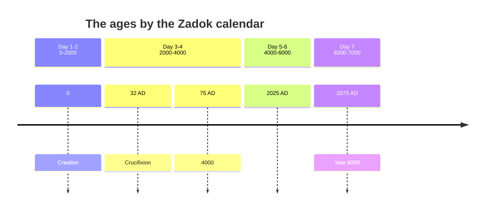

# The day is near

> ✝️ Revelation 1:3 (ESV)
>
> 3 Blessed is the one who reads aloud the words of this prophecy, and blessed are those who hear, and who keep what is written in it, for the time is near.

John opens Revelation by pronouncing a blessing on the reader before a single seal is broken -- the nearness itself is treated as good news, not a countdown to dread. What follows asks what that nearness means: how near, in what sense, and what a reader is supposed to do while it stays hidden.

## Key Takeaways

*(This section follows the [Key Takeaways](../about/key-takeaways.md) format this site is prototyping -- see that page for what each part is for and why.)*

### Types & Prophecy

**Type.** The seventh-day Sabbath is a **τύπος**-shaped pattern of a future rest, not merely a weekly ritual. Paul says as much directly: Sabbath observance is "a shadow of the things to come, but the substance belongs to Christ" (Colossians 2:16-17, ESV). Hebrews 4 builds on the same pattern -- God's own rest on the seventh day of creation (Genesis 2:2-3; Exodus 20:11) still stands open as something "the people of God" enter (Hebrews 4:9). What the type shows: history itself may follow the same six-then-seventh shape the creation week already set, with a final, Sabbath-like rest waiting at its far end.

**Prophecy.** Distinct from that pattern is a direct verbal promise: "This Jesus, who was taken up from you into heaven, will come in the same way as you saw him go into heaven" (Acts 1:11, ESV). This is not a resemblance later readers noticed -- it is two angels stating in plain words, at the moment of the ascension itself, that Christ's return is coming and will be visible and bodily like his departure was.

### Lessons about Jesus

- He set a real limit on his own knowledge during his earthly life: "concerning that day or that hour, no one knows... nor the Son, but only the Father" (Mark 13:32). The Son did not know the timing -- a fact about the incarnation, not a rhetorical figure.
- His return will match his ascension in kind: bodily, visible, "in the same way" (Acts 1:11) -- not merely spiritual or figurative.
- He delays not from weakness but from patience: 2 Peter's letter calls him "our Lord and Savior Jesus Christ" throughout (1:11; 3:18), and it is that same Lord who "is patient... not wishing that any should perish, but that all should reach repentance" (2 Peter 3:9).

### Memory verses

- 2 Peter 3:8 -- "with the Lord one day is as a thousand years, and a thousand years as one day."
- Mark 13:32 -- "concerning that day or that hour, no one knows... but only the Father."
- James 5:7 -- "Be patient, therefore, brothers, until the coming of the Lord."

### Be Transformed

- **Think.** Notice any pull toward fixing an exact date for Christ's return. Mark 13:32 puts that knowledge outside even the Son's stated awareness during his earthly life -- treating a calculated date as settled fact claims more certainty than Jesus himself claimed.
- **Attitude.** James wrote "be patient" to believers being economically exploited by the wealthy (James 5:1-6) -- his patience is endurance under real pressure, not passive resignation to whatever happens.
- **Do.** "Stay awake" (Mark 13:35, 37) as Jesus frames it: a servant given work to do while the master is away (Mark 13:34), not idle watching. Concretely, that looks like the labor Matthew 24:14 names -- the gospel proclaimed -- carried out while the timing stays God's alone to know.

### Prayer

Father, you set a limit on what even the Son knew of the day and hour, and you are patient with a world you could justly judge today -- not wanting anyone to perish, but all to come to repentance. Thank you that the delay itself is mercy, not neglect. Give me the same patience you show: endurance under real pressure rather than passive waiting, and work to do -- watching, praying, telling others -- rather than idle watching of the sky. Amen.

## Be patient while the time is hidden

> ✝️ James 5:7 (ESV)
>
> 7 Be patient, therefore, brothers, until the coming of the Lord. See how the farmer waits for the precious fruit of the earth, being patient about it, until it receives the early and the late rains.

James writes this to believers under real economic pressure -- the paragraph immediately before it (5:1-6) condemns wealthy landowners who have cheated their laborers of wages, and 5:7 opens with "therefore," tying patience directly to that injustice rather than to abstract waiting. **Be patient** translates **μακροθυμήσατε** (*makrothymēsate*, from **μακροθυμέω**, *makrothymeō*, G3114) -- literally "long-tempered," a patience aimed at people and circumstances rather than at pain itself (Greek keeps a separate word, *hypomonē*, for endurance under suffering; James uses both in this same passage, at 5:8 and 5:11). The farmer's image sharpens the point: he cannot make rain fall or grain ripen faster by wanting it -- disciplined, active waiting for something whose timing he does not control, not resignation.

That same verb reappears where the study turns next: 2 Peter 3:9 says the Lord himself "is patient" (**μακροθυμεῖ**, *makrothymei*) toward those he is waiting on. James commands of believers the identical quality Peter says God is already exercising -- the patience asked of the reader is modeled on God's own, not a demand God exempts himself from.

> ✝️ Mark 13:32-37 (ESV)
>
> 32 "But concerning that day or that hour, no one knows, not even the angels in heaven, nor the Son, but only the Father. 33 Be on guard, keep awake. For you do not know when the time will come. 34 It is like a man going on a journey, when he leaves home and puts his servants in charge, each with his work, and commands the doorkeeper to stay awake. 35 Therefore stay awake--for you do not know when the master of the house will come, in the evening, or at midnight, or when the rooster crows, or in the morning-- 36 lest he come suddenly and find you asleep. 37 And what I say to you I say to all: Stay awake."

This closes the Olivet Discourse (see [Signs of the end of the age](#signs-of-the-end-of-the-age) below for the section that opens it), and it answers the disciples' "when" question by declining to answer it. **No one knows** (**οὐδεὶς οἶδεν**) is stated in a chain that runs from angels, to the Son himself, stopping only at the Father -- Jesus is not being coy; the text states the Son did not know the day or hour during his earthly ministry, a real limitation of the incarnation rather than a rhetorical device. The parable that follows reframes not-knowing as a job description, not a problem: a servant left in charge doesn't need the master's arrival time to do the work assigned; "stay awake" has to mean something more than watching the horizon.

## A day like a thousand years

> ✝️ 2 Peter 3:2-8 (ESV)
>
> 2 that you should remember the predictions of the holy prophets and the commandment of the Lord and Savior through your apostles, 3 knowing this first of all, that scoffers will come in the last days with scoffing, following their own sinful desires. 4 They will say, "Where is the promise of his coming? For ever since the fathers fell asleep, all things are continuing as they were from the beginning of creation." 5 For they deliberately overlook this fact, that the heavens existed long ago, and the earth was formed out of water and through water by the word of God, 6 and that by means of these the world that then existed was deluged with water and perished. 7 But by the same word the heavens and earth that now exist are stored up for fire, being kept until the day of judgment and destruction of the ungodly. 8 But do not overlook this one fact, beloved, that with the Lord one day is as a thousand years, and a thousand years as one day.

Peter is answering a specific objection, not writing in the abstract: **scoffers** (**ἐμπαῖκται**, *empaiktai*, G1703, from **ἐμπαιγμονή**, *empaigmonē*, "scoffing," G1701) argue from apparent delay to disbelief -- if the fathers died and "all things are continuing as they were" (3:4), the promise must be empty. Peter's rebuttal in 3:5-7 is that this ignores precedent: the created order has already been catastrophically remade once, by water, and Scripture says it will be again, by fire -- continuity is not a law of nature, it's an assumption the scoffers haven't earned.

Verse 8's answer to the delay itself -- **one day is as a thousand years** (**ἡμέρα... ὡς χίλια ἔτη**) -- is introduced with **ὡς** (*hōs*, "like/as," G5613), a comparison rather than an equation. **παρὰ κυρίῳ** ("with the Lord," G3844) is **παρά** with the dative: beside, in the presence of, in the judgment of someone; MACULA glosses it here simply "with [the] Lord." That places the statement in the Lord's own reckoning of time, which is not the same claim as God standing outside time altogether. Psalm 90 -- the psalm Peter is drawing on -- rules the stronger claim out from its own side: eight verses after "a thousand years in your sight are but as yesterday," it asks God "Return, O LORD! How long?" (90:13). [Where Peter got it](day-is-a-thousand-years.md#where-peter-got-it) works that through against the psalm's vocabulary.

Peter also does not stop where Moses did. Psalm 90:4 runs one direction -- a long span looks short to God -- and Peter adds the converse: "and a thousand years as one day." A long time seeming short is consolation for a delay. A short time being a thousand years is not; the second half of the clause does no work at all if patience is the whole point. Peter's pastoral application follows immediately in 3:9 ("the Lord is not slow... but is patient"), and it is real -- but the fact he tells the beloved not to overlook in verse 8 is the correspondence itself, stated both ways.

That correspondence is what the wider six-then-seventh pattern is built on -- traced below in [The pattern of six days and a seventh](#the-pattern-of-six-days-and-a-seventh), and at length in [A Day Is a Thousand Years](day-is-a-thousand-years.md). It is worth being exact about what there is a later addition and what isn't. Reading Genesis 1's six days as six thousand years is not something this site inferred from 2 Peter 3:8: it is in *Jubilees* 4:29-30 two centuries before Peter wrote, in the Talmud (b. *Sanhedrin* 97a), and across the early church from Barnabas to Lactantius, and the *NIV Cultural Backgrounds Study Bible* notes on this verse that Jewish writers of Peter's day already applied the thousand-year day to the days of creation. Peter is writing into that frame, not being retrofitted with it.

What *is* inference, and held loosely, is the arithmetic -- which manuscript tradition, which creation epoch, which year the sixth day closes in. The shape carries; the date does not. Peter himself moves from the ratio in verse 8 to patience in verse 9 and holy conduct in verse 11, and never to a calculation.

## The pattern of six days and a seventh

> ✝️ Exodus 20:11 (ESV)
>
> 11 For in six days the LORD made heaven and earth, the sea, and all that is in them, and rested on the seventh day. Therefore the LORD blessed the Sabbath day and made it holy.

The verse uses two different Hebrew roots for God's rest: וַיָּנַח (*vayyanach*, "he rested," from נוּחַ, *nuach*, H5117) describes the act, and שַׁבָּת (*shabbat*, "Sabbath," H7676) names the day set apart because of it. Both trace to the same underlying idea of cessation -- TWOT roots the noun *shabbat* in the verb שָׁבַת (*shabat*, "cease," H7673, TWOT root 2323) -- so the day isn't merely associated with rest, its name *is* the word for stopping.

> ✝️ Hebrews 4:1-13 (ESV)
>
> 1 Therefore, while the promise of entering his rest still stands, let us fear lest any of you should seem to have failed to reach it. 2 For good news came to us just as to them, but the message they heard did not benefit them, because they were not united by faith with those who listened. 3 For we who have believed enter that rest, as he has said, "As I swore in my wrath, 'They shall not enter my rest,'" although his works were finished from the foundation of the world. 4 For he has somewhere spoken of the seventh day in this way: "And God rested on the seventh day from all his works." 5 And again in this passage he said, "They shall not enter my rest." 6 Since therefore it remains for some to enter it, and those who formerly received the good news failed to enter because of disobedience, 7 again he appoints a certain day, "Today," saying through David so long afterward, in the words already quoted, "Today, if you hear his voice, do not harden your hearts." 8 For if Joshua had given them rest, God would not have spoken of another day later on. 9 So then, there remains a Sabbath rest for the people of God, 10 for whoever has entered God's rest has also rested from his works as God did from his. 11 Let us therefore strive to enter that rest, so that no one may fall by the same sort of disobedience. 12 For the word of God is living and active, sharper than any two-edged sword, piercing to the division of soul and of spirit, of joints and of marrow, and discerning the thoughts and intentions of the heart. 13 And no creature is hidden from his sight, but all are naked and exposed to the eyes of him to whom we must give account.

This continues the author's exposition of Psalm 95 (already quoted at Hebrews 3:7-11, and again here at 4:3 and 4:7) -- "rest" isn't a theme imported into the chapter, it's the word Psalm 95 itself uses for what the wilderness generation forfeited by unbelief. Through the chapter, **rest** translates **κατάπαυσις** (*katapausis*, G2663, at 4:1, 3, 5, 10, 11) -- but at verse 9 the author switches, once, to a different and much rarer word: **σαββατισμός** (*sabbatismos*, G4520), literally "Sabbath-observance." The switch is deliberate, not stylistic variation -- it names the "rest" the whole chapter has been building toward as specifically a *Sabbath* rest, tying the argument back to Exodus 20:11's seventh day rather than leaving "rest" generic.

What Hebrews 4 itself is arguing, on its own terms: this rest is available to believers *now* -- "we who have believed enter that rest" (4:3) -- entered by faith rather than by further works (4:2-3, 10), and still requiring present diligence ("strive to enter," 4:11) because the possibility of failing to reach it, through the same kind of disobedience Israel showed, remains real. Hebrews doesn't itself connect this Sabbath rest to a future millennial reign; the connection this study draws in the next two sections is an inference from the shared vocabulary and pattern -- six days, then a seventh, echoed in the millennium's own "thousand years" -- not a claim Hebrews 4 makes explicitly, the same distinction the previous section drew for 2 Peter 3:8.

## The millennial reign

Can the coming millennial reign be tied to this same Sabbath-rest pattern? Both are described in terms of "resting" from labor and struggle, and both sit at the far edge of Scripture's account of history.

> ✝️ Revelation 20:2-7 (ESV)
>
> 2 And he seized the dragon, that ancient serpent, who is the devil and Satan, and bound him for a thousand years, 3 and threw him into the pit, and shut it and sealed it over him, so that he might not deceive the nations any longer, until the thousand years were ended. After that he must be released for a little while. 4 Then I saw thrones, and seated on them were those to whom the authority to judge was committed. Also I saw the souls of those who had been beheaded for the testimony of Jesus and for the word of God, and those who had not worshiped the beast or its image and had not received its mark on their foreheads or their hands. They came to life and reigned with Christ for a thousand years. 5 The rest of the dead did not come to life until the thousand years were ended. This is the first resurrection. 6 Blessed and holy is the one who shares in the first resurrection! Over such the second death has no power, but they will be priests of God and of Christ, and they will reign with him for a thousand years. 7 And when the thousand years are ended, Satan will be released from his prison

**χίλια ἔτη** (*chilia etē*, "a thousand years") is repeated six times across these six verses -- Revelation itself is the only place in Scripture that names a specific duration for this reign, which is why a literal, future, bounded thousand-year kingdom (rather than a symbol for the whole church age) is the reading this site takes, consistent with reading prophecy literally first. Satan bound, not destroyed (20:2-3); the martyrs specifically raised and reigning (20:4); a "first resurrection" implying a second, later one (20:5-6) -- taken plainly, this describes an actual reign following actual history, not a present spiritual state. If the Sabbath is a type of a coming rest (Hebrews 4, Colossians 2:16-17), and this millennium is the one specific "rest" Scripture actually numbers, the typological line runs Sabbath → the church's present rest by faith → this future, literal thousand-year reign as its consummation.

## When is the year 6000?

The pattern assembled so far:

1. God created in six days and rested on the seventh (Exodus 20:11).
2. The seventh day was set apart as holy -- the Sabbath (Exodus 20:11).
3. The Sabbath is called "a shadow of the things to come" (Colossians 2:16-17) -- a type, not merely a ritual.
4. A "Sabbath rest... remains for the people of God" (Hebrews 4:9), entered now by faith but not yet exhausted.
5. Revelation numbers a specific future reign of Christ at exactly a thousand years (Revelation 20:2-7).
6. With the Lord, "one day is as a thousand years" -- and, in the half Peter adds to Psalm 90:4, "a thousand years as one day" (2 Peter 3:8). See [A day like a thousand years](#a-day-like-a-thousand-years) above for why the two-way form is the load-bearing part.

Taking all six together as one shape: six days of ordinary history, each a "thousand years" by 2 Peter 3:8's ratio, followed by a seventh, Sabbath-like millennium matching Revelation 20's numbered reign. On that reading, a literal 6,000 years of human history precede the millennium. This is the same shape [The Zadok Calendar](../feasts/zadok-calendar.md) traces further back, in 1 Enoch's "Apocalypse of Weeks" (1 Enoch 91-93) dividing all of history into ten 700-year "weeks" toward a 7,000-year total -- an older, independent witness to the same six-then-seventh arithmetic.

**A flagged inconsistency, not smoothed over.** This timeline's own arithmetic (year 6000 = 2075 AD) implies a creation epoch of roughly 3925 BC -- a different number from the 4004 BC epoch [The Zadok Calendar](../feasts/zadok-calendar.md) and `references/build/genealogy_chronology.py` use elsewhere on this site, and different again from the Masoretic, Septuagint, and Samaritan Pentateuch genealogical totals compared in [Bible Chronology & Genealogical Time](genealogy-times.md). That page and [Prophecy: Events and Times](prophecy-events-times.md) already flag this specific study's date as the outlier; this section is the matching flag from this study's own side, not a resolution -- reconciling it is tracked as open, unfinished work, not settled by picking whichever number reads best here.

## Signs of the end of the age

> ✝️ Matthew 24:3 (ESV)
>
> 3 As he sat on the Mount of Olives, the disciples came to him privately, saying, "Tell us, when will these things be, and what will be the sign of your coming and of the end of the age?"

The disciples ask two questions, not one: *when*, and *what sign*. Jesus never directly answers "when" (see [Be patient while the time is hidden](#be-patient-while-the-time-is-hidden) above) -- what follows is his answer to the second question instead, spoken privately (**κατ᾽ ἰδίαν**) on the Mount of Olives, which is why this whole discourse (Matthew 24-25; the Mark 13 passage already studied above is its parallel) is usually called the Olivet Discourse.

> ✝️ Matthew 24:4-8 (ESV)
>
> 4 And Jesus answered them, "See that no one leads you astray. 5 For many will come in my name, saying, 'I am the Christ,' and they will lead many astray. 6 And you will hear of wars and rumors of wars. See that you are not alarmed, for this must take place, but the end is not yet. 7 For nation will rise against nation, and kingdom against kingdom, and there will be famines and earthquakes in various places. 8 All these are but the beginning of the birth pains.

Jesus's own label for this list -- **birth pains** (**ὠδίνων**, *ōdinōn*) -- matters more than the list itself. Old Testament prophets already used labor pains as a stock image for intense, unavoidable suffering that precedes deliverance (Isaiah 13:8; 26:17-19; Jeremiah 22:23; Micah 4:9-10), and the image carries its own built-in warning against premature alarm: contractions that come and go are not yet the birth. False messiahs, wars, famines, and earthquakes are named as the *beginning*, explicitly not the sign itself (v. 8) -- Jesus is drawing the disciples' urgency down, not up, at exactly the point a reader is tempted to treat any war or earthquake as the sign itself.

> ✝️ Matthew 24:9-14 (ESV)
>
> 9 "Then they will deliver you up to tribulation and put you to death, and you will be hated by all nations for my name's sake. 10 And then many will fall away and betray one another and hate one another. 11 And many false prophets will arise and lead many astray. 12 And because lawlessness will be increased, the love of many will grow cold. 13 But the one who endures to the end will be saved. 14 And this gospel of the kingdom will be proclaimed throughout the whole world as a testimony to all nations, and then the end will come.

The escalation moves from the world's suffering (vv. 4-8) to the disciples' own (vv. 9-13) -- persecution, betrayal from within, false prophets, and love growing cold under lawlessness, each intensifying rather than merely repeating the last. The chapter's own stated terminus arrives only at verse 14: **the gospel of the kingdom** proclaimed to all nations, and *then* the end -- not political collapse, not natural disaster, but a finished evangelistic task as the last named condition before "the end will come." A reader looking for "the sign" in wars and earthquakes has stopped one verse short of the one Jesus named.

## In the same way

> ✝️ Acts 1:11 (ESV)
>
> 11 and said, "Men of Galilee, why do you stand looking into heaven? This Jesus, who was taken up from you into heaven, will come in the same way as you saw him go into heaven."

**In the same way** translates **ὃν τρόπον** (*hon tropon*) -- **τρόπος** (*tropos*, G5158) means manner, fashion, way of doing something, not a span of time. Grammatically, the angels' promise is a claim about *how* Christ returns (visibly, bodily, matching how he departed) rather than *when* -- exactly what the parallel Mark 13:32 passage above says stays hidden. Reading "same way" as implying "same timing" reaches past what the Greek word itself claims; **τρόπος** is not a time-word, and treating it as one bends the text to answer a question it doesn't address.

That said, this site's own working chronology ([Charting End Times](prophecy-chart.md), still under construction) has floated 2032 as a possible near-term milestone, built from the six-then-seventh framework above rather than from Acts 1:11 itself. 2032 is not a conclusion this passage supports, or a settled conclusion elsewhere on this site -- a number to watch, held with real uncertainty, not a date to set a calendar by.

## Discussion questions

1. James commands believers to have the same patience (*makrothymeō*) 2 Peter says God himself already has (3:9). Does it change how "be patient" lands, to know it's not a standard God holds you to without holding it himself?
2. Mark 13:32 states plainly that the incarnate Son did not know the day or hour. How do you hold that together with everything else Scripture says about who Jesus is?
3. This study is explicit about which parts are exegesis (what a text says) and which parts are typological extension or open speculation (the 6,000-year date, 2032). Did that distinction change how persuasive any particular section felt to you?
4. Matthew 24:14 names the gospel reaching all nations, not a political or natural sign, as the stated condition before "the end will come." Does that redirect where you'd look for evidence the end is near?

## References & Recommended Reading

- ESV Bible (Crossway) -- primary translation quoted throughout, per this repo's translation conventions.
- World English Bible (WEB) -- used for translation comparison; no meaningful divergence found on any passage in this study.
- MACULA Greek Linguistic Datasets (SBLGNT) and MACULA Hebrew Linguistic Datasets (WLC), queried via this repo's `references/build/bible-text.db` -- source of all Greek/Hebrew morphology and Strong's numbers cited above.
- *Theological Wordbook of the Old Testament* (Archer, Harris & Waltke, Moody Publishers) -- TWOT root 2323 for שָׁבַת (*shabat*, "cease").
- *ESV Study Bible* (Crossway, 2016) -- notes on Hebrews 4:1-13 and 4:8-10, 2 Peter 3:1-13 and 3:8-10, Acts 1:6-11 and 1:11, and Matthew 24:1-14, consulted to check this study's own reading of "rest" and "in the same way" against a standard evangelical commentary.
- *NIV Cultural Backgrounds Study Bible* (Zondervan, ed. Walton & Keener) -- note on 2 Peter 3:8, that Jewish writers of Peter's day already applied the thousand-year day to the days of creation.
- Dr. Ken Johnson, Th.D., [dsscalendar.org](https://dsscalendar.org) -- primary source for 1 Enoch's "Apocalypse of Weeks" six-then-seventh chronology referenced above; see [The Zadok Calendar](../feasts/zadok-calendar.md) for the fuller treatment.
- [A Day Is a Thousand Years](day-is-a-thousand-years.md) -- the companion study, and the full treatment of 2 Peter 3:8, Psalm 90:4, and the Second Temple, rabbinic and patristic witnesses to the thousand-year day summarised above.
- [The Zadok Calendar](../feasts/zadok-calendar.md), [Bible Chronology & Genealogical Time](genealogy-times.md), and [Prophecy: Events and Times](prophecy-events-times.md) -- this site's related chronology studies; see especially the creation-epoch discrepancy both flag against this study's own timeline.
- [Charting End Times](prophecy-chart.md) -- this site's still-under-construction working timeline, source of the 2032 date referenced above.
