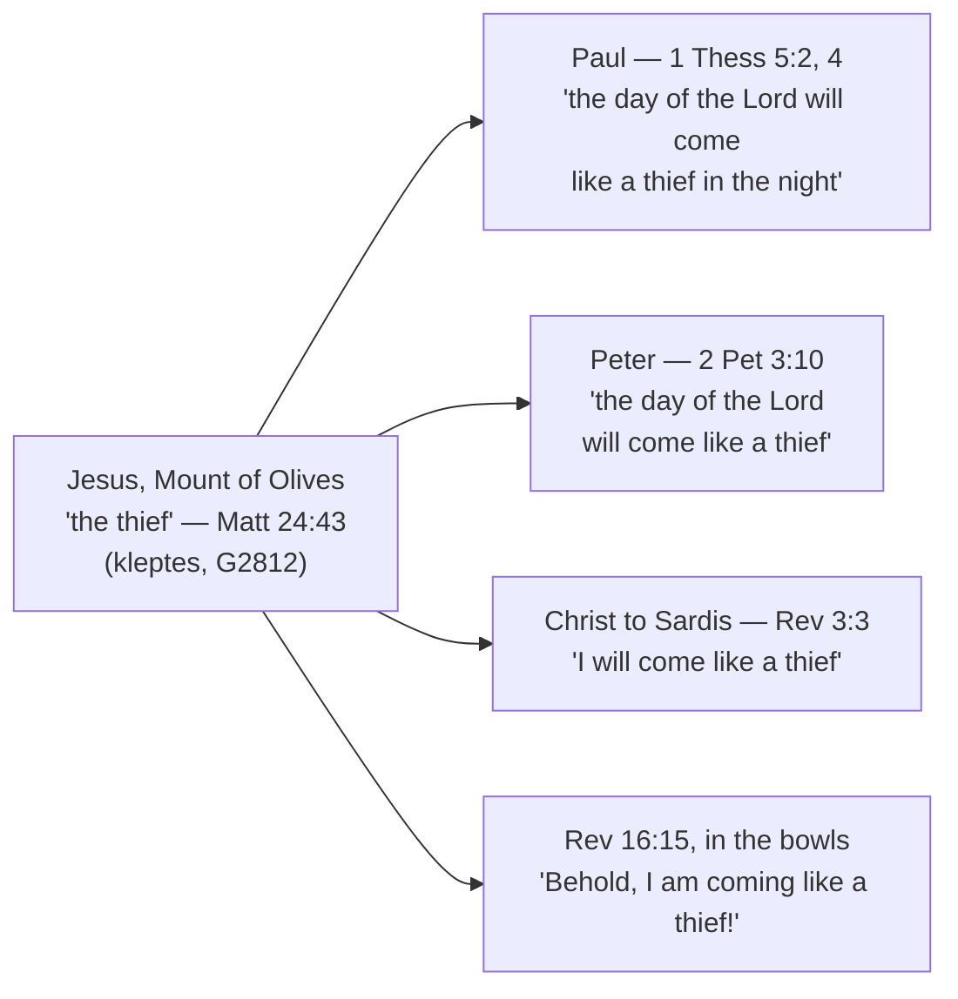

# Heaven and Earth Will Pass Away

*(Forked verbatim from [The Olivet Discourse](olivet-discourse.md) during the
2026-09-26 simplify pass. Needs its own opening and Key Takeaways via develop-bible-study.)*

## "Heaven and Earth Will Pass Away"

### One verb, two senses

The discourse's own last word reaches past the return, past the kingdom, to the end of the physical
creation. It sits in the verse immediately after the one ["This Generation"](fig-tree-and-this-generation.md#this-generation-whose-and-of-what)
just worked through — and the two are a single sentence, which is why neither is finished alone.

Jesus puts one verb in two senses in consecutive sentences:

> ✝️ Matthew 24:34-35 (ESV)
> 34 Truly, I say to you, this generation will not pass away until all these things take place.
> 35 Heaven and earth will pass away, but my words will not pass away.

All three are παρέρχομαι (*parerchomai*, G3928). At verse 34, of the generation, Louw-Nida reads it as
time elapsing (67.85). At verse 35, of heaven and earth and of his own words, the sense shifts to
ceasing to exist (13.93). A generation that will not run out before these things happen; a cosmos
that will one day cease; words that will not. The study of "this generation" that stops at verse 34
has cut a sentence in half.

### Peter's echo

Peter was sitting there when Jesus said it. Decades later, writing to churches mocked for still
expecting a return that had not come, he wrote the discourse's sequel — and reached for its
vocabulary:

> ✝️ 2 Peter 3:10, 13 (ESV)
> 10 But the day of the Lord will come like a thief, and then the heavens will pass away with a roar,
> and the heavenly bodies will be burned up and dissolved, and the earth and the works that are done
> on it will be exposed... 13 But according to his promise we are waiting for new heavens and a new
> earth in which righteousness dwells.

παρέρχομαι occurs exactly once in the whole of 2 Peter, at 3:10, of the heavens passing away — the
same verb and the same Louw-Nida sense (13.93) as Matthew 24:35. That is not the only borrowing.
2 Peter 3 works through the discourse point by point:

| 2 Peter 3 | The Olivet Discourse |
|---|---|
| 3:4 the scoffers' taunt: "Where is the promise of his **coming**?" | *parousia* — Matthew 24:3, 27, 37, 39 |
| 3:5-6 the flood, the world that "perished" | the days of Noah — Matthew 24:37-39 |
| 3:10 "the day of the Lord will come like a **thief**" | "if the master of the house had known in what part of the night the **thief** was coming" — Matthew 24:43 |
| 3:10 "the heavens will **pass away**" (παρελεύσονται) | "heaven and earth will **pass away**" (παρελεύσεται) — Matthew 24:35 |
| 3:11 "what sort of people ought you to be" | "stay awake... you also must be ready" — Matthew 24:42, 44 |
| 3:7, 10, 12 fire; 3:13 new heavens and new earth | *the step past the return the discourse does not take* |

Peter also answers the objection the discourse raises and leaves open. If nobody knows the day, and it
has been a long time, has the promise failed? "The Lord is not slow to fulfill his promise as some
count slowness, but is patient toward you, not wishing that any should perish" (3:9, ESV). The delay
the scoffers read as failure is mercy, deliberately extended.

### The thief image, traced

Paul draws on the same discourse for the same purpose in 1 Thessalonians 5, and takes two images from
it in two consecutive verses: "the day of the Lord will come like a thief in the night" (5:2), and
"sudden destruction will come upon them as labor pains come upon a pregnant woman" (5:3) — κλέπτης
and ὠδίν, Matthew 24:43 and 24:8. He then applies it exactly as Jesus did: "So then let us not sleep,
as others do, but let us keep awake and be sober" (5:6, ESV).

The image Jesus used of himself travels further than any other in the discourse:

Five occurrences across three writers and the risen Christ's own letters, all of the same event, all
traceable to a sentence spoken on a hillside to four men. And the last word of the whole chain is the
one Jesus attached to it in the first place: "Blessed is the one who stays awake" (Revelation 16:15,
ESV).
