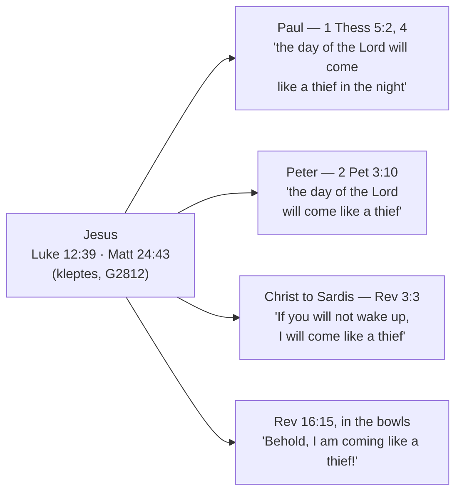

# Heaven and Earth Will Pass Away

In the week He was crucified, sitting on the Mount of Olives with Peter, James, John and
Andrew (Mark 13:3), Jesus set His own words against the whole created order: "Heaven and earth will
pass away, but my words will not pass away" (Matthew 24:35, ESV). Peter heard it and wrote a letter
that leans on it. Paul was not there, but he received the same teaching "by a word from the Lord"
(1 Thessalonians 4:15, ESV) and wrote another. Peter took its verb. Paul took its images. Both took
its command.

**In one sentence:** Jesus staked His words against heaven and earth, and Peter and Paul built their
teaching on the day of the Lord out of those words, so God's promise that His Son is coming is the
most certain thing in creation, and you are to meet it awake.

## Key Takeaways

*(This section follows the [Key Takeaways](../about/key-takeaways.md) format — see that page for what each part is for.)*

### Types & Prophecy

**Prophecy.** Matthew 24:35 predicts the end of the present heaven and earth. Isaiah had already
promised what follows it: "For behold, I create new heavens and a new earth" (Isaiah 65:17, ESV).
Peter names that promise as the thing believers wait for (2 Peter 3:13), and John sees it done: "the
first heaven and the first earth had passed away" (Revelation 21:1, ESV).

**The flood as pattern.** Jesus compared His coming to "the days of Noah" (Matthew 24:37), and Peter
uses the same flood as proof that the world has been judged once already by God's word and will be
again (2 Peter 3:5-7).

### Lessons about Jesus

- **His words carry God's own permanence.** Isaiah said "the word of our God will stand forever"
  (Isaiah 40:8, ESV). Jesus says it of His own words, and sets them above the creation that God made.
  Only God can say that and be telling the truth.
- **He is the thief who comes unannounced.** The image is His own (Matthew 24:43), and the risen
  Jesus uses it of Himself twice more in Revelation (3:3; 16:15).
- **He died so that you will live with Him.** Paul grounds the believer's safety on the day of the
  Lord in the cross: "our Lord Jesus Christ, who died for us so that whether we are awake or asleep
  we might live with him" (1 Thessalonians 5:9-10, ESV).

### Memory verses

> ✝️ Matthew 24:35 (ESV)
>
> 35 Heaven and earth will pass away, but my words will not pass away.

> ✝️ 2 Peter 3:13 (ESV)
>
> 13 But according to his promise we are waiting for new heavens and a new earth in which
> righteousness dwells.

### Be Transformed

- **Think.** The most permanent thing you own is a promise Jesus made. The ground under you and the
  sky over you are both temporary; His word is the fixed point you can measure them against.
- **Attitude.** Wait with patience of your own, because God is patient toward you: "not wishing that
  any should perish, but that all should reach repentance" (2 Peter 3:9, ESV). The years of waiting
  are His mercy at work.
- **Do.** Live awake this week. Peter's question is "what sort of people ought you to be" (3:11), and
  his answer is holiness, godliness and peace (3:11, 14). Name one thing you would put right if you
  knew Jesus came tomorrow, and put it right today.

### Prayer

Father, heaven and earth are Yours, and You will fold them up like a garment when You have finished
with them. Your word stands. Thank You that Your Son Jesus has promised to come, and that His words
will outlast everything I can see. Thank You that You have not destined me for wrath but for
salvation through Him, who died for me. Keep me awake and sober, patient while You are patient, and
ready to be found by Him at peace. Come, Lord Jesus.

In Jesus' name. Amen.

## Study outline

- [One sentence on the Mount of Olives](#one-sentence-on-the-mount-of-olives). Matthew 24:34-35 as
  one saying, and the verb Jesus uses three times.
- [Words that outlast creation](#words-that-outlast-creation). What Jesus claims for His words, read
  against Isaiah 51:6 and Matthew 5:18.
- [Peter's echo](#peters-echo). 2 Peter 3 laid beside the discourse, point by point; the world
  judged once by water and once by fire, and what 1 Enoch and Josephus expected.
- [What passes, and what comes](#what-passes-and-what-comes). The passing of the heavens, the reading
  "will be found," and where it falls in God's sequence.
- [Paul's thief](#pauls-thief). 1 Thessalonians 5:1-11: the thief, the labour pains, and the
  children of the day.
- [The thief image, traced](#the-thief-image-traced). Seven occurrences, whom the thief surprises,
  and the one day of the Lord they describe in stages.
- [Discussion Questions](#discussion-questions). Five, for a group or on your own.

## One sentence on the Mount of Olives

### Where the verse sits

Matthew 24:35 closes the paragraph Jesus opens with the fig tree (24:32-35). The next verse turns to
the timing: "But concerning that day and hour no one knows, not even the angels of heaven, nor the
Son, but the Father only" (24:36, ESV). Verse 35 is the hinge. It guarantees everything Jesus has
just predicted (24:4-31) before He tells the disciples they will not be given its date. The saying
stands in all three Synoptic Gospels (Mark 13:31; Luke 21:33). Mark and Luke have the plural verb,
παρελεύσονται (*pareleusontai*), the form 2 Peter 3:10 uses.

The discourse reaches past the return and the kingdom, to the end of the physical creation. Verse 35
sits immediately after the one ["This Generation"](fig-tree-and-this-generation.md#this-generation-whose-and-of-what)
works through, and the two are one saying, spoken together, so neither is finished alone.

### One verb, two senses

Jesus uses one verb in two senses in consecutive sentences:

> ✝️ Matthew 24:34-35 (ESV)
>
> 34 Truly, I say to you, this generation will not pass away until all these things take place.
> 35 Heaven and earth will pass away, but my words will not pass away.

All three are παρέρχομαι (*parerchomai*, par-ER-kho-my, G3928). At verse 34, of the generation,
Louw-Nida reads it as time elapsing (67.85). At verse 35, of heaven and earth and of His own words,
the sense shifts to ceasing to exist (13.93). A generation that will not run out before these things
happen; a cosmos that will one day cease; words that will not. A reading of "this generation" that
stops at verse 34 has cut the saying in half.

Both denials use οὐ μή (*ou mē*, oo MAY) with the aorist subjunctive, Greek's emphatic form of denial: the generation will *certainly not* pass away until all these things happen, and His words will
*certainly not* pass away at all.

## Words that outlast creation

The *ESV Study Bible* puts the claim in a sentence: Jesus here "attributes divine authority and
permanence to his own teaching" (note on 24:35). Two earlier texts show how large it is.

**Isaiah 51:6.** God tells Israel to look up and down: "the heavens vanish like smoke, the earth will
wear out like a garment ... but my salvation will be forever, and my righteousness will never be
dismayed" (ESV). The shape is Jesus' shape — heaven and earth set against something of God's that
lasts — and in Isaiah the thing that lasts is God's own salvation. Isaiah 40:8 says the same of "the
word of our God" (ESV); the sibling study on
["this generation"](fig-tree-and-this-generation.md#words-that-outlast-creation) works through that
verse.

**Matthew 5:18.** Matthew records the phrase once before, of the Law (compare Luke 16:17): "until heaven and earth pass
away, not an iota, not a dot, will pass from the Law until all is accomplished" (ESV). The Greek has
παρέρχομαι twice there as well. In the Sermon on the Mount, heaven and earth are the outer limit of
the Law's standing. On the Mount of Olives, Jesus names something that stands beyond that limit: His
own words.

**Hebrews 1:10-12.** Hebrews quotes Psalm 102:25-27 and applies it to the Son: "the heavens are the
work of your hands; they will perish, but you remain; they will all wear out like a garment, like a
robe you will roll them up, like a garment they will be changed. But you are the same, and your years
will have no end" (Hebrews 1:10-12, ESV). The New Testament itself sets the Son on the far side of
the passing of heaven and earth, which is where Matthew 24:35 puts His words.

**This shows that God has spoken in His Son with His own authority.** The deity of Jesus is written
into the grammar of verse 35. A prophet says "the word of the LORD"; Jesus says "my words," and
promises them the permanence Isaiah gave to God alone. So the return Jesus promised is as sure as
God Himself. When you read what He said about His coming, you are reading the one part of the
universe that will still be standing at the end of it.

## Peter's echo

### The letter and its readers

Peter was sitting there when Jesus said it (Mark 13:3). Decades later, writing "the second letter"
to the same readers (2 Peter 3:1), he answered teachers who mocked the return as a myth; his reply
is that the apostles "were eyewitnesses of his majesty" (1:16, ESV). The scoffers' taunt, the
flood, and God's patience in 3:3-9 are worked through in
[A Day Is a Thousand Years](day-is-a-thousand-years.md#the-verse-in-its-own-argument). What matters
here is where Peter's vocabulary came from. He tells his readers to "remember ... the commandment of
the Lord and Savior through your apostles" (3:2, ESV). His first letter had already quoted Isaiah
40:8 and named the gospel as the word that lasts: "the word of the Lord remains forever. And this
word is the good news that was preached to you" (1 Peter 1:25, ESV). Now he reaches for the
discourse:

> ✝️ 2 Peter 3:10, 13 (ESV)
>
> 10 But the day of the Lord will come like a thief, and then the heavens will pass away with a roar,
> and the heavenly bodies will be burned up and dissolved, and the earth and the works that are done
> on it will be exposed... 13 But according to his promise we are waiting for new heavens and a new
> earth in which righteousness dwells.

παρέρχομαι occurs exactly once in the whole of 2 Peter, at 3:10, of the heavens passing away — the
same verb and the same Louw-Nida sense (13.93) as Matthew 24:35.

### Point by point

The verb is one borrowing among several. 2 Peter 3 works through the discourse point by point:

| 2 Peter 3 | The Olivet Discourse |
|---|---|
| 3:4 the scoffers' taunt: "Where is the promise of his **coming**?" | *parousia* — Matthew 24:3, 27, 37, 39 |
| 3:5-6 the flood, the world that "perished" | the days of Noah — Matthew 24:37-39 |
| 3:10 "the day of the Lord will come like a **thief**" | "if the master of the house had known in what part of the night the **thief** was coming" — Matthew 24:43 |
| 3:10 "the heavens will **pass away**" (παρελεύσονται) | "heaven and earth will **pass away**" (παρελεύσεται) — Matthew 24:35 |
| 3:11 "what sort of people ought you to be" | "stay awake... you also must be ready" — Matthew 24:42, 44 |
| 3:7, 10, 12 fire; 3:13 new heavens and new earth | the step past the return that the discourse leaves untaken |

Peter also answers the objection the discourse leaves open. If nobody knows the day, and it has been
a long time, has the promise failed? "The Lord is not slow to fulfill his promise as some count
slowness, but is patient toward you, not wishing that any should perish, but that all should reach
repentance" (3:9, ESV). The delay the scoffers read as failure is mercy, deliberately extended.

### Water, then fire

Peter sets the two judgments side by side. "The world that then existed was deluged with water and
perished. But by the same word the heavens and earth that now exist are stored up for fire" (2 Peter
3:6-7, ESV). The word that formed the earth "out of water and through water" (2 Peter 3:5, ESV)
judged it once by water and will judge it once by fire.

God closed the first way Himself. "Never again shall there be a flood to destroy the earth" (Genesis
9:11, ESV), and He bound the seasons to that promise "while the earth remains" (Genesis 8:22, ESV).
Isaiah uses the oath as the measure of God's faithfulness: "as I swore that the waters of Noah should
no more go over the earth, so I have sworn that I will not be angry with you" (Isaiah 54:9, ESV). The
promise holds for as long as this earth remains. Peter's fire falls on the day it stops remaining.

The prophets name fire as the instrument of the last judgment. "By fire will the LORD enter into
judgment, and by his sword, with all flesh" (Isaiah 66:16, ESV). "In the fire of my jealousy all the
earth shall be consumed" (Zephaniah 3:8, ESV). Jesus sets the two judgments beside His coming: the
flood of Noah's day, and Lot's day, when "fire and sulfur rained from heaven and destroyed them all"
(Luke 17:26-30, ESV). Peter lines up those two and adds a third: angels held for judgment, the
flood, and Sodom turned "to ashes" (2 Peter 2:4-6, ESV).

### What 1 Enoch and Josephus expected

!!! warning "Extra-biblical sources: useful, and not Scripture"

    1 Enoch and Josephus are not Scripture. Jude quotes one prophecy from 1 Enoch, "Behold, the Lord
    comes with ten thousands of his holy ones" (Jude 14, ESV; 1 Enoch 1:9), and that makes the
    prophecy Jude quotes true. It does not make the rest of the book inspired. What these works
    show is what Jews in and before Peter's century expected, so they tell you how his first
    readers heard 2 Peter 3. Where they agree with Scripture they corroborate it; where they go
    beyond it, Scripture governs. [A Day Is a Thousand
    Years](day-is-a-thousand-years.md) sets out the same caution at length.

1 Enoch's "Apocalypse of Weeks" divides history into ten weeks. In the second, "there shall be the
first end. And in it a man shall be saved" (*1 Enoch* 93:4). That is the flood and Noah, and "first"
expects another. The tenth week holds it: "the great eternal judgement," and then "the first heaven
shall depart and pass away, And a new heaven shall appear … And after that there will be many weeks
without number for ever" (*1 Enoch* 91:15-17). The pattern is the one Revelation 21:1 gives, and
"weeks without number" is the eighth day's end of counting.

The same book names both elements. Uriel is sent to tell Noah that "a deluge is about to come upon
the whole earth" (*1 Enoch* 10:2). Later, when "unrighteousness shall again be consummated on the
earth," the wicked "shall be cast into the judgement of fire" (*1 Enoch* 91:6, 9). The fallen angels are bound "till the day of their judgement," then "led off
to the abyss of fire" (*1 Enoch* 10:12-13), which Jude echoes: "kept in eternal chains under gloomy
darkness until the judgment of the great day" (Jude 6, ESV).

#### Josephus and Seth's pillars

Josephus, writing in AD 93 or 94, records the same expectation as far back as Adam. Seth's
descendants carved their learning on two pillars, "upon Adam's prediction that the world was to be
destroyed at one time by the force of fire, and at another time by the violence and quantity of
water" (*Antiquities* 1.2.3). Josephus reports a tradition; Peter writes as an apostle, and ties the
fire to God's promise of "new heavens and a new earth" (2 Peter 3:13, ESV). So Peter's readers likely
already knew the world had been judged once by water and would be judged by fire. Peter tells them what comes
after the fire.

### What Peter asks of you

Peter draws the same conclusion Jesus did, and draws it in the second person: "Since all these
things are thus to be dissolved, what sort of people ought you to be in lives of holiness and
godliness, waiting for and hastening the coming of the day of God" (3:11-12, ESV). "Coming" is
*parousia* again. Then: "since you are waiting for these, be diligent to be found by him without
spot or blemish, and at peace" (3:14, ESV). The certainty of the end is the ground of a holy life
now.

## What passes, and what comes

### "Will be found"

The last clause of 2 Peter 3:10 is one of the harder textual problems in the New Testament, and
English versions differ because the manuscripts do. The Greek of the SBL edition reads
εὑρεθήσεται (*heurethēsetai*, hyoo-reh-THAY-seh-tai, G2147), "will be found," which the ESV renders "will
be exposed." Other manuscripts read "will be burned up" (the LSB and CSB footnote it), and a few
Syriac and Coptic manuscripts read "will not be found" (CSB footnote), which is the reading the
NA28 prints. The *ESV Study Bible* takes "will be found" as a divine passive — the earth and every
work on it laid open before God's judgment (note on 3:10).

### Renewal or replacement

Scripture describes the end of this creation in two sets of words, and interpreters divide over
which set governs.

#### Words of ending

The heavens "will pass away," the heavenly bodies "will be burned up and
dissolved" (2 Peter 3:10, ESV), and at the throne "earth and sky fled away, and no place was found
for them" (Revelation 20:11, ESV). Then "the first heaven and the first earth had passed away"
(Revelation 21:1, ESV), and God says "I create new heavens" (Isaiah 65:17, ESV), with the verb that
begins Genesis. John Walvoord reads these as "a totally new heaven and a new earth, and not the
present heaven and earth renovated" (*Bible Knowledge Commentary*, on Revelation 21:1).

#### Words of change

Paul says "the creation itself will be set free from its bondage to corruption"
(Romans 8:21, ESV): the same creation that groans is the one set free. Hebrews, quoting Psalm 102,
says the heavens "will all wear out like a garment, like a robe you will roll them up, like a garment
they will be changed" (Hebrews 1:11-12, ESV). The verb is ἀλλάσσω (*allassō*, G236), "change," the word
Paul uses of the resurrection: "we shall all be changed" (1 Corinthians 15:51, ESV). Peter compares
the fire to the flood, when "the world that then existed was deluged with water and perished" (2 Peter
3:6, ESV), and that world perished without ceasing to be the earth. Jesus calls the age to come "the
new world," παλιγγενεσία (*palingenesia*, G3824), a "regeneration" (Matthew 19:28, ESV); Peter calls
it "the time for restoring all the things" (Acts 3:21, ESV). And the One on the throne says, "I am
making all things new" (Revelation 21:5, ESV): πάντα (*panta*), "all things," is what He makes new.

The textual problem at 2 Peter 3:10 bears on this. The *ESV Study Bible* argues for renewal partly from
"will be found" (note on 3:10), but the NA28 prints "will *not* be found," so the verse cannot carry
the argument either way. The *NIV Biblical Theology Study Bible* holds both: "Rev 21 seems to suggest
both replacement (Rev 21:1) and transformation (Rev 21:5)," and the change "involves both continuity
and discontinuity" (note on 2 Peter 3:10). Irenaeus, writing about AD 180,
held that "neither is the substance nor the essence of the creation annihilated," only "the fashion of
the world passeth away" (*Against Heresies* 5.36.1, quoting 1 Corinthians 7:31).

#### Where the weight falls

Read together, the words of ending describe what happens to this
creation's present form, and the words of change describe what happens to the creation itself. The
closest analogy Scripture gives is the resurrection body: "What is sown is perishable; what is raised
is imperishable" (1 Corinthians 15:42, ESV). It is the same body, through death, raised new. On that
reading the new earth is this earth judged by fire and made new, as a believer's body is raised, and
that is where this study leans. It is a judgment weighed across texts, and the replacement reading
has serious dispensational defenders. Both agree on what the text puts in the foreground: the present
heaven and earth end, God judges every work done on the earth, and a new heaven and new earth follow
in which righteousness is at home.

### Where it falls

Revelation places the passing of heaven and earth after the thousand-year reign of Jesus, at the
great white throne: "earth and sky fled away" (Revelation 20:11; 21:1). A dispensational reading, which this site holds (see
the [statement of faith](../about/statement-of-faith.md#end-times)), therefore takes Peter's "day of
the Lord" as a period that opens with the sudden, thief-like coming of judgment and closes with the
dissolution of the heavens a thousand years later. [A Day Is a Thousand
Years](day-is-a-thousand-years.md#day-seven-the-rest-that-is-numbered) makes the case for the
literal thousand years and traces [what follows them](day-is-a-thousand-years.md#and-the-eighth).
Readers who expect no intervening millennium put
the return, the judgment and the new creation together in one event. Peter's own sentence makes
the point on which both agree: the day that comes like a thief is the same day in which the heavens
pass away.

**This shows that God finishes what He starts.** The creation He called good, He will judge and make
new, and His Son's words will stand through the whole of it. So you may hold everything you can see
loosely and hold His promise hard.

## Paul's thief

### The setting

Paul wrote 1 Thessalonians around AD 49-51 from Corinth, to a young church (*ESV Study Bible*,
introduction). He had just told them what would happen to believers who had died, and told
them "by a word from the Lord" (4:15, ESV): Jesus will come, the dead in Christ will rise, and the
living will be caught up with them. Then he turns to the timing:

> ✝️ 1 Thessalonians 5:1-6 (ESV)
>
> 1 Now concerning the times and the seasons, brothers, you have no need to have anything written to
> you. 2 For you yourselves are fully aware that the day of the Lord will come like a thief in the
> night. 3 While people are saying, "There is peace and security," then sudden destruction will come
> upon them as labor pains come upon a pregnant woman, and they will not escape. 4 But you are not in
> darkness, brothers, for that day to surprise you like a thief. 5 For you are all children of
> light, children of the day. We are not of the night or of the darkness. 6 So then let us not
> sleep, as others do, but let us keep awake and be sober.

"The times and the seasons" (χρόνων καὶ καιρῶν, *chronōn kai kairōn*) are the same pair of words
Jesus used at His ascension: "It is not for you to know times or seasons that the Father has fixed
by his own authority" (Acts 1:7, ESV). The Thessalonians may already have known the answer Jesus had given.

### Two images from one discourse

Paul draws on the same discourse for the same purpose, and takes two images in two consecutive
verses: "the day of the Lord will come like a thief in the night" (1 Thessalonians 5:2), and "sudden
destruction will come upon them as labor pains come upon a pregnant woman" (5:3). The thief,
κλέπτης (*kleptēs*, G2812), is Jesus' own image (Matthew 24:43). Labour pain, ὠδίν (*ōdin*, G5604),
was already a prophet's image for the day of the LORD, "like a woman in labor" (Isaiah 13:8, ESV);
Jesus used it of the troubles that are "but the beginning of the birth pains" (Matthew 24:8, ESV),
and Paul uses it of the day's arrival.

The closest wording is in Luke's account of the discourse. "Watch yourselves lest ... that day come
upon you suddenly like a trap ... that you may have strength to escape" (Luke 21:34, 36, ESV).
"Suddenly" there is αἰφνίδιος (*aiphnidios*, G160), a word the New Testament uses only twice: at
Luke 21:34 and at 1 Thessalonians 5:3, "sudden destruction." Both verses also use ἐφίστημι
(*ephistēmi*), "come upon," and both speak of escape, ἐκφεύγω (*ekpheugō*): "strength to escape"
(Luke 21:36) and "they will not escape" (1 Thessalonians 5:3). Paul applies it exactly as Jesus did:
"let us keep awake and be sober" (1 Thessalonians 5:6).

### Children of the day

Paul adds what the discourse leaves implicit: who the thief surprises. "Sudden destruction will come
upon *them*" (5:3); "*you* are not in darkness, brothers, for that day to surprise you like a thief"
(5:4). Believers belong to the day already (5:5, 8). And the reason is the cross: "God has not
destined us for wrath, but to obtain salvation through our Lord Jesus Christ, who died for us so
that whether we are awake or asleep we might live with him" (5:9-10, ESV).

A pretribulational reading, the one this site holds, takes 5:9 with 4:13-18: the church is caught up
to meet Jesus before the day of the Lord's wrath begins (see [The Restrainer](the-restrainer.md) and
[The Rapture of the Church](rapture.md)). Other readers take "wrath" as final judgment and the whole of 4:13-5:11
as one event at the end of the tribulation. The point of 5:9-10 stands on either reading: God's
purpose for you in Jesus is salvation, secured by His death.

**This shows that God has already decided where you stand on that day.** Paul's instruction is
therefore encouragement: "encourage one another and build one another up" (5:11, ESV). You watch as
a child of the day who is expected home.

## The thief image, traced

The image Jesus used of Himself travels further than any other in the discourse:

```mermaid
flowchart LR
    J["Jesus<br/>Luke 12:39 · Matt 24:43<br/>(kleptes, G2812)"]
    J --> P["Paul — 1 Thess 5:2, 4<br/>'the day of the Lord will come<br/>like a thief in the night'"]
    J --> PE["Peter — 2 Pet 3:10<br/>'the day of the Lord<br/>will come like a thief'"]
    J --> R1["Christ to Sardis — Rev 3:3<br/>'If you will not wake up,<br/>I will come like a thief'"]
    J --> R2["Rev 16:15, in the bowls<br/>'Behold, I am coming like a thief!'"]
```

Seven times the New Testament uses the thief for the Lord's coming or His day: Luke 12:39 and
Matthew 24:43 from Jesus, 1 Thessalonians 5:2 and 5:4 from Paul, 2 Peter 3:10, and Revelation 3:3
and 16:15. Every one makes the same point: the thief catches the unready. "You are not in darkness,
brothers, for that day to surprise you like a thief" (1 Thessalonians 5:4, ESV). Revelation 3:3 is
conditional, a warning to one church in John's own day: "If you will not wake up, I will come like a
thief" (ESV).

The rest describe one day of the Lord in stages. The *Bible Knowledge Commentary* defines it as "end-time
events that begin after the Rapture and culminate with the commencement of eternity" (Kenneth O.
Gangel, on 2 Peter 3:10). It breaks on a world saying "peace and security" (1 Thessalonians 5:3), after
the church has been caught up (4:17; 5:9). Its climax is the visible return, and the thief warning
sounds again in the bowls, just before Armageddon (Revelation 16:15; Matthew 24:43-44). It ends when
the heavens pass away (2 Peter 3:10). And the word attached to the image, from the first saying to
the last, is the one Jesus gave it: "Blessed is the one who stays awake" (Revelation 16:15, ESV).

The wider discourse, and the parables of servants ready and unready that follow this saying, are in
[The Olivet Discourse](olivet-discourse.md) and
[The Parables of the Olivet Discourse](olivet-discourse-parables.md).

## Discussion Questions

1. Matthew 24:34-35 uses παρέρχομαι three times — of a generation, of heaven and earth, and of
   Jesus' words. What does reading the two verses as one saying change about how you read "this
   generation"?
2. In Matthew 5:18 heaven and earth are the limit of the Law's standing; in Matthew 24:35 Jesus'
   words outlast them. What is Jesus claiming about Himself in the second saying?
3. Peter was one of the four on the Mount of Olives (Mark 13:3). Which of the borrowings in 2 Peter 3
   would his readers have recognised, and what would that recognition have done to the scoffers'
   taunt in 3:4?
4. 2 Peter 3:10 is read as renewal of this creation or as its replacement. Holding Isaiah 65:17
   beside Romans 8:18-25, which way do you lean, and what does the promise of 3:13 look like on that
   reading?
5. Paul says the day will not surprise believers "like a thief" (1 Thessalonians 5:4), yet Jesus
   tells Sardis He will come on them like one (Revelation 3:3). What does it look like in your own
   week to be awake and sober?

## References & Recommended Reading

- John F. Walvoord ("Revelation") and Kenneth O. Gangel ("2 Peter"), in *The Bible Knowledge
  Commentary*, ed. John F. Walvoord and Roy B. Zuck (Victor Books) — on Revelation 21:1 and 2 Peter
  3:10. Quoted briefly with attribution.
- *NIV Biblical Theology Study Bible* (Zondervan) — note on 2 Peter 3:10 (continuity and
  discontinuity).
- Irenaeus, *Against Heresies* 5.36.1, *Ante-Nicene Fathers* vol. 1 (public domain).
- *ESV Study Bible* (Crossway) — introduction to 1 Thessalonians (date and setting); notes on
  Matthew 24:35 and 2 Peter 3:10 (the "will be found" reading and the renewal view).
- *CSB Ancient Faith Study Bible* and *Legacy Standard Bible* (Lockman Foundation) — textual
  footnotes on 2 Peter 3:10.
- *Novum Testamentum Graece*, 28th edition (NA28), and the *SBL Greek New Testament* — the Greek of
  Matthew 24:34-35, 2 Peter 3:10 and 1 Thessalonians 5:1-3.
- Louw, J. P., and E. A. Nida, *Greek-English Lexicon of the New Testament Based on Semantic
  Domains* — domains 13.93 and 67.85 for παρέρχομαι, via the MACULA Greek data.
- *1 Enoch* 10:2, 12-13; 91:6, 9, 15-17; 93:4, in R. H. Charles, *The Book of Enoch* (1917, public
  domain), from the scrollmapper deuterocanonical dataset
  (`references/open-data/scrollmapper-bible-databases-deuterocanonical`).
- Flavius Josephus, *Antiquities of the Jews* 1.2.3, trans. William Whiston (public domain) —
  Adam's prediction of destruction by fire and by water.
- Scripture quotations are from the ESV unless noted.

### On this site

- [The Olivet Discourse](olivet-discourse.md) — the discourse this study follows out of.
- ["This Generation"](fig-tree-and-this-generation.md) — Matthew 24:32-34 and Isaiah 40:8.
- [A Day Is a Thousand Years](day-is-a-thousand-years.md) — 2 Peter 3:3-9 and the delay.
- [Taken Before Judgment](taken-before-judgment.md) — Enoch, Noah and Lot, rescued before judgment.
- [A New Heaven and a New Earth](new-heaven-and-new-earth.md) — which fire falls when, and what follows it.
- [The Parables of the Olivet Discourse](olivet-discourse-parables.md) — the servants who were and
  were not ready.
- [The Restrainer](the-restrainer.md) and [The Rapture of the Church](rapture.md) — the order of events in
  1 and 2 Thessalonians.
