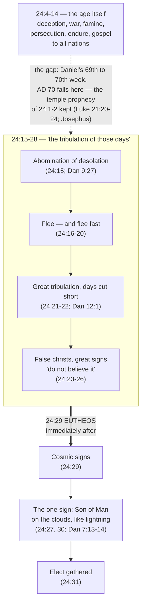
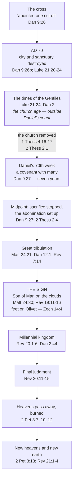

# Immediately After: Daniel's Seventieth Week and the Olivet Discourse

*(Forked verbatim from [The Olivet Discourse](olivet-discourse.md) during the
2026-09-26 simplify pass. Needs its own opening and Key Takeaways via develop-bible-study.)*

Where this sits on the discourse's own timeline matters, and it is not inside the distress described
from verse 15. It falls in the interval between the age of verses 4-14 and that distress — the gap
Daniel's count leaves between the sixty-ninth week and the seventieth. The temple prophecy was kept
in full, on a dated calendar, by an eyewitness record. What it was not is the great tribulation, for
the reason verse 29 gives.

## "Immediately After": Where the Gap Actually Sits

### What "immediately" means for the timeline

"Immediately after the tribulation of those days the sun will be darkened" (24:29, ESV). εὐθέως —
*immediately*. It is the hardest word in the chapter for anyone building a timeline, and it is the
word most schemes quietly walk past.

It rules out putting a long gap **here**, between the distress of verses 15-28 and the coming of
verses 29-31. Whatever that distress is, the Son of Man follows it at once.

That is not an argument against AD 70 having any place in these verses. This study already gave it
one at verse 15, following the *ESV Study Bible*'s reading that the abomination finds its complete
fulfilment in both the Roman destruction and the last days. The argument is against AD 70 being *all*
they refer to. If the distress verse 29 follows had been exhausted in 70, the sun should have darkened
and the Son of Man appeared while that generation was still alive; instead the "immediately" would be
carrying nineteen centuries and still counting, with no stated end.

The *NIV Biblical Theology Study Bible* names the two ways out: either "the distress of those days...
in some sense continues all the way until Jesus' second coming", or the abomination "will be reenacted
on a more awful scale just before Christ's return" (note on 24:29-51). This study takes the second. It
costs nothing at verse 29 — the distress that verse follows is the future one, and the coming does
follow it at once — while AD 70 stands behind it as the foreshadowing verse 15 allows, not as the
thing itself.

### The gap's real location

The long interval is real, but it sits **earlier** — between the age Jesus describes in verses 4-14
and the distress that begins at verse 15. That is where Daniel's own count leaves a gap, between the
sixty-ninth week and the seventieth, as [Where the Discourse Sits in God's Whole
Programme](#where-the-discourse-sits-in-gods-whole-programme) works out below and as Larkin's chart
draws it. Placing the gap at verse 29 instead puts it inside a word that means the opposite.

### Two mountain peaks

Jesus telescopes near and far into one description without marking the join, and he had done it
before. In the Nazareth synagogue he read Isaiah 61:1-2 aloud and stopped mid-sentence, before "the
day of vengeance of our God," then said "today this Scripture has been fulfilled in your hearing"
(Luke 4:21). Isaiah's own sentence runs the near and far together. Jesus read as far as the part then
being fulfilled and closed the scroll.

Clarence Larkin drew the effect as a landscape: a prophet looking forward sees two mountain peaks
lined up one behind the other, with the valley between them hidden entirely from that angle. "We see
the 'mountain peaks' and 'valleys' from the side, and so can separate the first and second coming
prophecies" — a vantage the prophets themselves did not have.

## Where the Discourse Sits in God's Whole Programme

### The gap Daniel's sequence leaves

The abomination of desolation left one piece of Daniel unaccounted for, and it is the piece that
organises everything still ahead.

Daniel's sequence, read in its own order, generates the gap. Sixty-nine weeks — sevens of years — run
"from the going out of the word to restore and build Jerusalem to the coming of an anointed one"
(9:25). "After the sixty-two weeks," that is, after all sixty-nine, "an anointed one shall be cut off
and shall have nothing" (9:26): the crucifixion. *Then* the text turns to "the people of the prince
who is to come," who "destroy the city and the sanctuary" (9:26): AD 70, the Roman armies under Titus.
Only after all of that does the seventieth week appear, and it is tied to neither event but to a
third, still future: "he shall make a strong covenant with many for one week, and for half of the week
he shall put an end to sacrifice and offering. And on the wing of abominations shall come one who
makes desolate" (9:27, ESV).

Nothing in Daniel's sentence requires that covenant to follow AD 70 immediately. Three events, in
sequence, separately timed; two have happened. Larkin charted exactly this, and labelled the space
between them:

*Clarence Larkin, "Daniel's 'Seventy Weeks'" (1919), public domain. Larkin marks the 7 weeks (49
years) to the rebuilding of Jerusalem, the 62 weeks (434 years) to "Messiah the Prince," the cross at
AD 30, the destruction of Jerusalem at AD 70, and then the "Gap Between the 69th and 70th Week,"
noting across it that "the present dispensation of 'the Church' was not revealed to Daniel." Daniel
2's image runs the length of the chart as "the times of the Gentiles" (Luke 21:24), and the seventieth
week closes at Zechariah 14:4 — the Mount of Olives. From
[clarencelarkincharts.com](http://clarencelarkincharts.com/).*

### The church age, and the ruler to come

The church age sits in that gap: real, but outside Daniel's count, which is a count of weeks
"decreed about your people and your holy city" (9:24, ESV) — Israel and Jerusalem, not the church.
This is the structural reason a dispensational reading keeps Israel and the church distinct rather
than merging them; see [Israel and the Church](../israel-and-church/israel-and-the-church.md).

The ruler of the seventieth week is "the prince who is to come," drawn from the people who destroyed
Jerusalem. Paul names the same figure without Daniel's title, and
opens the passage with the discourse's own warning: "Let no one deceive you in any way" (2
Thessalonians 2:3, ESV), before describing "the man of lawlessness... who opposes and exalts himself
against every so-called god or object of worship, so that he takes his seat in the temple of God,
proclaiming himself to be God" (2:3-4, ESV). That is Daniel's abomination, personal and future, at the
covenant's midpoint where 9:27 puts it.

### The times of the Gentiles

Luke's phrase covers the whole span in between. "Jerusalem will be trampled underfoot by the Gentiles,
until the times of the Gentiles are fulfilled" (21:24, ESV) names a period with a stated end
condition, and Daniel supplies the frame: the four Gentile empires of Daniel 2 and 7, ending when "the
God of heaven will set up a kingdom that shall never be destroyed... It shall break in pieces all these
kingdoms and bring them to an end, and it shall stand forever" (Daniel 2:44, ESV). Jerusalem's
political history since AD 70 fits inside that frame without closing it. A Jewish state in 1948 and
the city reunified in 1967 are real markers and are the textually appropriate place to weigh those
dates — this is a passage about Gentile political control of Jerusalem, which is what those dates
concern — but the text names the *kingdom's* arrival as the closing condition, not a state's founding.

### The rapture's place on this diagram

The rapture's position on that diagram is dashed because this discourse does not put it there. Jesus
is answering four Jewish disciples about Jerusalem, the temple, and his return in glory; the removal
of the church is revealed later, to Paul, as something previously undisclosed (1 Corinthians 15:51).
That the discourse does not teach it is not an argument against it, any more than Daniel's silence
about the church age is an argument that there isn't one — Larkin's chart makes exactly that point in
its caption. The full argument is in [The Rapture of the Church](rapture.md).
