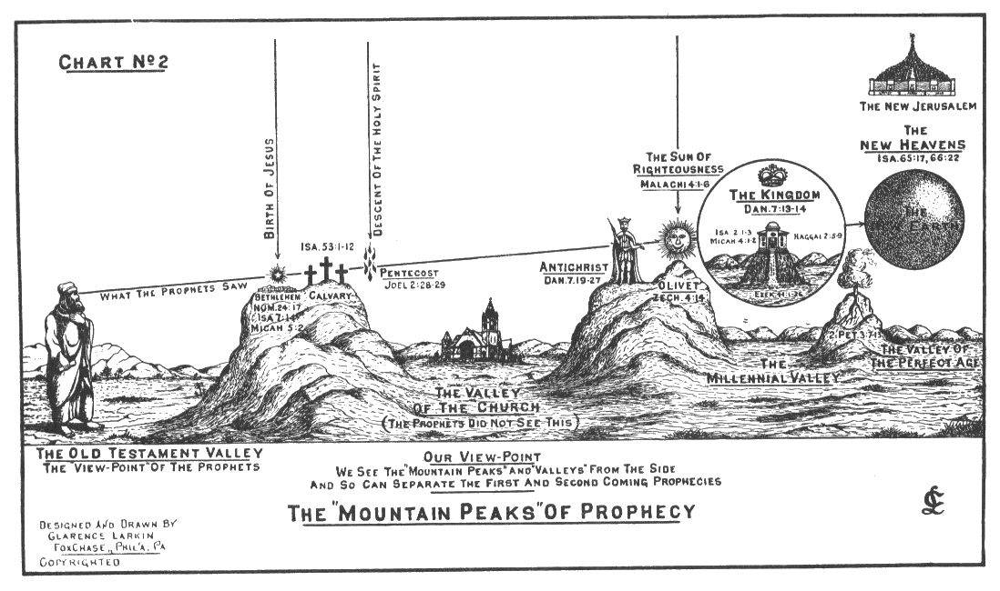
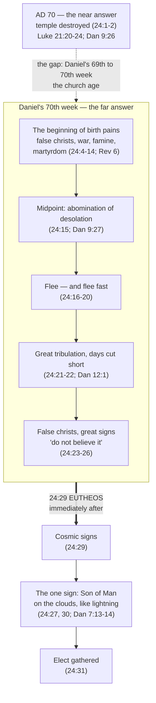
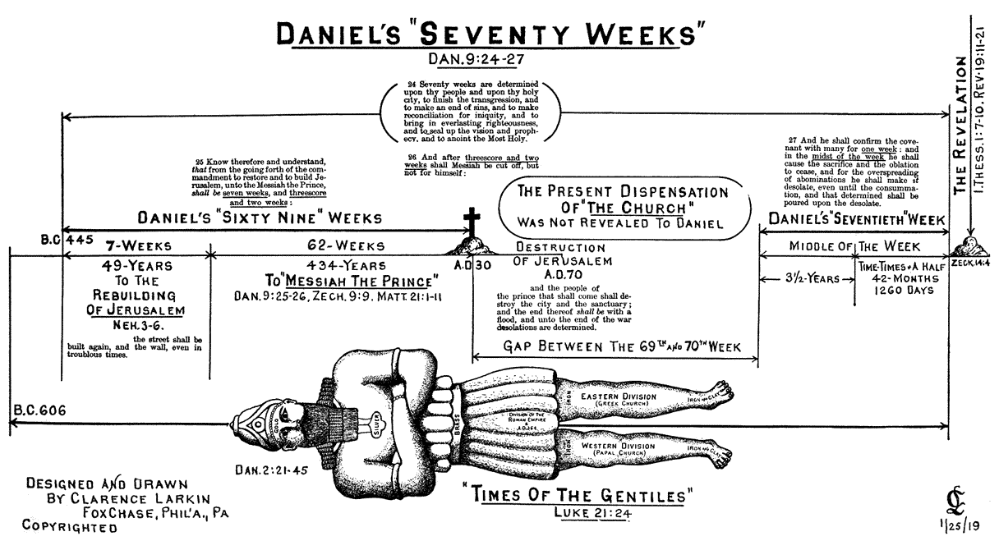
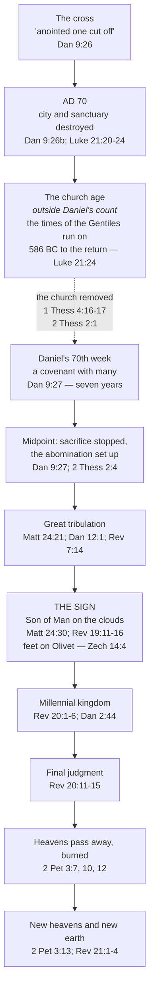

# Immediately After: Daniel's Seventieth Week and the Olivet Discourse

In 539 BC Daniel was reading Jeremiah and counting. He "perceived in the books the number of years
that... must pass before the end of the desolations of Jerusalem, namely, seventy years" (Daniel 9:2,
ESV), and he prayed for his city: "O Lord, hear; O Lord, forgive... Delay not" (9:19, ESV). God
answered with a longer count, seventy sevens. Nearly six centuries later His disciples sat with Jesus
on the Mount of Olives and asked the same kind of question: "Tell us, when will these things be, and
what will be the sign of your coming and of the end of the age?" (Matthew 24:3, ESV). Jesus answered
them out of Daniel, and one word in His answer settles where the long wait falls.

> ✝️ Matthew 24:29-30 (ESV)
>
> 29 "Immediately after the tribulation of those days the sun will be darkened, and the moon will not
> give its light, and the stars will fall from heaven, and the powers of the heavens will be shaken.
> 30 Then will appear in heaven the sign of the Son of Man, and then all the tribes of the earth will
> mourn, and they will see the Son of Man coming on the clouds of heaven with power and great glory.

**In one sentence:** God has fixed Israel's calendar in seventy sevens; sixty-nine ran to the cross,
the church age runs in the gap Daniel's own sequence leaves before the seventieth, and Matthew 24:29's
"immediately" joins the return of Jesus to the end of that last week's distress, so the God who kept
sixty-nine weeks to the letter will keep the seventieth and send His Son at once.

## Key Takeaways

*(This section follows the [Key Takeaways](../about/key-takeaways.md) format — see that page for what each part is for.)*

### Types & Prophecy

Daniel 9:24-27 is direct prophecy. Sixty-nine sevens run "to the coming of an anointed one" (9:25),
who is then "cut off" (9:26), fulfilled at the cross. The city and sanctuary fall to "the people of
the prince who is to come" (9:26), fulfilled in AD 70. The seventieth week (9:27) is still ahead: Jesus
describes it from its first birth pains (Matthew 24:4-8) through the abomination at its midpoint
(24:15), and places the end of that distress immediately before His own coming (24:29-30).

### Lessons about Jesus

- **Jesus is the anointed one Daniel counted to.** The sixty-nine weeks end at the Messiah, and the
  Messiah is "cut off and shall have nothing" (Daniel 9:26, ESV). The atonement Daniel 9:24 promised
  was made at the cross.
- **Jesus reads prophecy with the gap in view.** At Nazareth He read Isaiah 61 and stopped before
  "the day of vengeance" (Luke 4:16-21), because that half was still future.
- **Jesus comes the moment the distress ends.** "Immediately after the tribulation of those days"
  (Matthew 24:29, ESV), the Son of Man appears on the clouds and gathers His elect.

### Memory verses

> ✝️ Daniel 9:24 (ESV)
>
> 24 "Seventy weeks are decreed about your people and your holy city, to finish the transgression, to
> put an end to sin, and to atone for iniquity, to bring in everlasting righteousness, to seal both
> vision and prophet, and to anoint a most holy place.

> ✝️ Matthew 24:30 (ESV)
>
> 30 Then will appear in heaven the sign of the Son of Man, and then all the tribes of the earth will
> mourn, and they will see the Son of Man coming on the clouds of heaven with power and great glory.

### Be Transformed

- **Think.** God keeps time. Sixty-nine of Daniel's weeks ran out exactly as Gabriel said, so the
  seventieth will too, and the wait you live in has an end God has already fixed.
- **Attitude.** Wait for Jesus with settled hope. The church age sits inside God's plan: Israel's
  hardening lasts "until the fullness of the Gentiles has come in" (Romans 11:25, ESV).
- **Do.** Read Daniel 9 alongside Matthew 24 this week, and pray Daniel's prayer for Jerusalem and
  for the people God has not forgotten.

### Prayer

Father, You set the times for Your people and Your holy city, and You have never missed an appointed
day. Thank You for sending Your Son Jesus, the anointed one, to be cut off for us and to atone for our
iniquity. Keep us faithful in the time You have given the church, and keep our eyes on the clouds He
will come on. Hasten the day when He gathers His elect and reigns.

In Jesus' name. Amen.

## Study outline

- [Two passages in their setting](#two-passages-in-their-setting). Daniel's prayer and Gabriel's
  answer; the question on the Mount of Olives.
- [Where the gap cannot sit](#where-the-gap-cannot-sit). What εὐθέως means, and the two ways
  commentators handle it.
- [Two mountain peaks](#two-mountain-peaks). Near and far fulfilment in one sentence, from Isaiah 61
  and Larkin's chart.
- [Where the gap does sit](#where-the-gap-does-sit). Daniel's three events in order, the contested
  "he" of 9:27, and Larkin's seventy-weeks chart.
- [The church age, the ruler, and the times of the Gentiles](#the-church-age-the-ruler-and-the-times-of-the-gentiles).
  What fills the gap and who ends it, with the whole sequence drawn out.
- [What this shows about God](#what-this-shows-about-god). A God who keeps His calendar, limits the
  distress, and finishes the atonement's work.
- [Discussion Questions](#discussion-questions). Six, for a group or on your own.

## Two passages in their setting

### Daniel's prayer and Gabriel's answer

Daniel 9 is dated to "the first year of Darius" (9:1), 539 BC on the *ESV Study Bible*'s reckoning
(note on 9:1-27), when Daniel was an old man in Babylon. Jeremiah's seventy years were nearly up, and
Daniel confessed Israel's sin and asked God to restore the city "called by your name" (9:19, ESV).

Gabriel answered with a count in שָׁבֻעִים (*shavu'im*, H7620, "sevens" or "weeks"). The seventy sevens are
"decreed about your people and your holy city" (9:24, ESV), and they carry six purposes: to finish the
transgression, to put an end to sin, "to atone for iniquity," to bring in everlasting righteousness,
to seal vision and prophet, and to anoint a most holy place. "To atone" is כַפֵּר (*kapper*, H3722), the verb
of the Day of Atonement. Daniel asked for his city to be rebuilt; God answered with the whole plan for
dealing with Israel's sin.

### The question on the Mount of Olives

Matthew 24 opens with Jesus predicting the temple's fall (24:1-2) and the disciples asking when, and
what sign would mark His coming and the end of the age (24:3). Jesus answers both, and the two
answers share one pattern.

**The near answer is AD 70.** Luke records it in plain siege terms: "when you see Jerusalem
surrounded by armies, then know that its desolation has come near … and Jerusalem will be trampled
underfoot by the Gentiles, until the times of the Gentiles are fulfilled" (Luke 21:20, 24, ESV).
Louis Barbieri notes that "Matthew did not record Jesus' answer to the first question, but Luke did
(Luke 21:20)" (*Bible Knowledge Commentary*, on Matthew 24:3).

**The far answer is Daniel's seventieth week, from its first verse.** Matthew and Mark give the
birth pains (Matthew 24:4-14), the abomination "standing in the holy place" (24:15, ESV), a distress
"such as has not been from the beginning of the world until now, no, and never will be" (24:21,
ESV), and the coming "immediately" after it (24:29). The features of 24:4-14 match the first seals of
Revelation 6: a conqueror, war, famine, death and martyrs, then a great earthquake with the sun and
moon darkened. John wrote those seals around AD 95 (*CSB Ancient Faith Study Bible*, introduction to
Revelation) as "what must take place after this" (Revelation 4:1, ESV), still future after AD 70.
Barbieri places Matthew 24:4-8 in "the first half of the seven-year period preceding His second
coming" and sees the seals as corresponding "somewhat" (on 24:4-8).

**The same features also mark the age.** False messiahs, wars and famines came before AD 70 (*NIV
Biblical Theology Study Bible*, note on 24:4-8, citing Josephus and Acts), and the *ESV Study Bible*
calls them conditions that "in some sense characterize the entire age" (note on 24:1-14). Jesus says
of them, "the end is not yet" (24:6, ESV), and calls them "but the beginning of the birth pains"
(24:8, ESV). Birth pains come before the labour, and these come to their full form when the week
opens. The full walk-through of the discourse is in [The Olivet Discourse](olivet-discourse.md).

## Where the gap cannot sit

### What "immediately" means for the timeline

"Immediately after the tribulation of those days the sun will be darkened" (24:29, ESV). εὐθέως
(*eutheōs*, G2112) is *immediately*, and Matthew uses it thirteen times. It is the word for the fishermen who
"immediately... left their nets" (4:20, ESV) and for the rooster that crowed "immediately" after
Peter's third denial (26:74, ESV). Each time, the second event follows the first at once.

That rules out a long gap **here**, between the distress of verses 15-28 and the coming of verses
29-31. Whatever that distress is, the Son of Man follows it at once. Mark's parallel has no
εὐθέως and puts the signs "in those days, after that tribulation" (Mark 13:24, ESV), inside the same
days as the distress.

AD 70 keeps its place in these verses. [The Olivet Discourse](olivet-discourse.md#the-abomination-of-desolation)
gives it one at verse 15, following the *ESV Study Bible*'s reading that the abomination finds its
complete fulfilment in both the Roman destruction and the last days. The word "immediately" limits
how much of verses 15-28 AD 70 can carry. If the distress verse 29 follows had been exhausted in 70,
the sun should have darkened and the Son of Man appeared while that generation was still alive;
instead the "immediately" would be carrying nineteen centuries and still counting, with no stated
end.

### Two ways to read it

This is a contested verse, and the *NIV Biblical Theology Study Bible* names the two ways through it:
either "the distress of those days... in some sense continues all the way until Jesus' second coming",
or the abomination "will be reenacted on a more awful scale just before Christ's return" (note on
24:29-51). The first reading keeps AD 70 as the distress and stretches it across the whole age. This
study takes the second, which lets "immediately" mean what it means everywhere else in Matthew: the
distress verse 29 follows is the future one, the coming does follow it at once, and AD 70 stands
behind it as the foreshadowing verse 15 allows.

## Two mountain peaks

Jesus telescopes near and far into one description without marking the join, and He had done it
before. In the Nazareth synagogue He read Isaiah 61:1-2 aloud and stopped mid-sentence, before "the
day of vengeance of our God," then said "today this Scripture has been fulfilled in your hearing"
(Luke 4:21). Isaiah's own sentence runs the near and far together. Jesus read as far as the part then
being fulfilled and closed the scroll.

Clarence Larkin (1850-1924), a Baptist pastor who drew prophecy charts for *Dispensational Truth*
(1918; expanded 1920), pictured the effect as a landscape. His charts are a historical witness to how
early dispensationalists read these texts, cited here because they draw the sequence clearly; the
argument rests on Daniel and Matthew. A prophet looking forward sees two mountain peaks lined up
one behind the other, with the valley between them hidden from that angle. "We see the 'mountain
peaks' and 'valleys' from the side, and so can separate the first and second coming prophecies" — a
vantage the prophets themselves did not have.

*Clarence Larkin, "The 'Mountain Peaks' of Prophecy," public domain, via
[clarencelarkincharts.com](http://clarencelarkincharts.com/).*

```mermaid
flowchart TD
    N["AD 70 — the near answer<br/>temple destroyed (24:1-2)<br/>Luke 21:20-24; Dan 9:26"]
    N -.->|"the gap: Daniel's 69th to 70th week<br/>the church age"| WEEK
    subgraph WEEK["Daniel's 70th week — the far answer"]
      direction TB
      A["The beginning of birth pains<br/>false christs, war, famine,<br/>martyrdom (24:4-14; Rev 6)"] --> B["Midpoint: abomination of desolation<br/>(24:15; Dan 9:27)"]
      B --> C["Flee — and flee fast<br/>(24:16-20)"]
      C --> D["Great tribulation, days cut short<br/>(24:21-22; Dan 12:1)"]
      D --> E["False christs, great signs<br/>'do not believe it'<br/>(24:23-26)"]
    end
    WEEK ==>|"24:29 EUTHEOS<br/>immediately after"| F["Cosmic signs<br/>(24:29)"]
    F --> G["The one sign: Son of Man<br/>on the clouds, like lightning<br/>(24:27, 30; Dan 7:13-14)"]
    G --> H["Elect gathered<br/>(24:31)"]
```

The long interval is real, and it sits **earlier**, before the week opens at verse 4. AD 70 falls
inside it, as Daniel's own order requires (9:26): the temple prophecy of 24:1-2 was kept in full, on a
dated calendar, by an eyewitness record (see [The Olivet
Discourse](olivet-discourse.md#ad-70-question-one-answered-and-documented)).

AD 70 was also a pattern. The abomination had been set up once already, by Antiochus IV in 167 BC,
and 1 Maccabees uses the same phrase for it: "they set up the abomination of desolation upon the
altar" (1 Maccabees 1:54, KJV Apocrypha). Jesus, two centuries later, still says "when you see"
(Matthew 24:15). Rome's siege was a second fulfilment, and Paul, writing about AD 50, still looked
ahead to a man who "takes his seat in the temple of God, proclaiming himself to be God"
(2 Thessalonians 2:4, ESV). John Grassmick, commenting on Mark's account, holds that "both events are
in view": "These 'near' tribulations foreshadowed the 'far' Tribulation of the end time" (*Bible
Knowledge Commentary*, on Mark 13:14-23). Daniel's own count leaves the gap between the sixty-ninth
week and the seventieth, as the next section works out.

## Where the gap does sit

### The gap Daniel's sequence leaves

Daniel's sequence, read in its own order, generates the gap. Sixty-nine weeks, sevens of years, run
"from the going out of the word to restore and build Jerusalem to the coming of an anointed one"
(9:25). "After the sixty-two weeks," that is, after all sixty-nine, "an anointed one shall be cut off
and shall have nothing" (9:26): the crucifixion. The anointed one is מָשִׁיחַ (*mashiach*, H4899), the word
behind "Messiah." *Then* the text turns to "the people of the prince who is to come," who "destroy the
city and the sanctuary" (9:26): AD 70, the Roman armies under Titus. Only after all of that does the
seventieth week appear, and it is tied to a third event, still future: "he shall make a strong
covenant with many for one week, and for half of the week he shall put an end to sacrifice and
offering. And on the wing of abominations shall come one who makes desolate" (9:27, ESV).

Daniel's sentence sets no clock between AD 70 and that covenant. Three events, in sequence,
separately timed; two have happened. How the sixty-nine weeks are dated to the cross is worked out in
[Chronology Anchors](chronology-anchors.md).

### Whose covenant? The contested "he" of 9:27

Who "he" is in 9:27 is contested, and the *ESV Study Bible* sets out three readings (note on 9:27).
One takes "he" as the Messiah: His death ended the atoning sacrifices (Hebrews 10:1-9 is its support),
and the covenant is the new covenant. A second takes "he" as a hostile ruler whose armies destroy the
temple in AD 70. The third, the dispensational reading this study holds, takes "he" as a future ruler
at the end of the church age, and reasons that if the sixty-nine weeks end at the cross and Jesus
returns after the seventieth to judge the desolator, a gap must lie between them.

The nearest person named before "he" is "the prince who is to come" (עַם נָגִיד
הַבָּא, *'am nagid habba*, "the people of the coming prince"), whose people destroy the city.
That favours a ruler, which the second and third readings share. What decides between those two is
Jesus: He takes the "abomination of desolation spoken of by the prophet Daniel" (Matthew 24:15, ESV)
and has the Son of Man appear "immediately after" the distress it opens (24:29). The first reading
has the cross in its favour, and 9:25 on its side, where the Messiah is called נָגִיד
(*nagid*, H5057), "an anointed one, a prince"; careful readers hold it. The dispensational reading
answers from what the covenant-maker does: he stops sacrifice "for half of the week" (9:27), and Jesus
places that abomination still ahead in His own day (Matthew 24:15).

Larkin charted the dispensational reading and labelled the space between the weeks:

*Clarence Larkin, "Daniel's 'Seventy Weeks'" (1919), public domain. Larkin marks the 7 weeks (49
years) to the rebuilding of Jerusalem, the 62 weeks (434 years) to "Messiah the Prince," the cross at
AD 30, the destruction of Jerusalem at AD 70, and then the "Gap Between the 69th and 70th Week,"
noting across it that "the present dispensation of 'the Church' was not revealed to Daniel." Daniel
2's image runs the length of the chart as "the times of the Gentiles" (Luke 21:24), and the seventieth
week closes at Zechariah 14:4 — the Mount of Olives. From
[clarencelarkincharts.com](http://clarencelarkincharts.com/). Larkin's AD 30 for the cross is his own
date; this site's reckoning is in [Chronology Anchors](chronology-anchors.md).*

The same weeks on this site's reckoning, from Nehemiah's decree in 444 BC to the Triumphal Entry in
AD 33 (Harold Hoehner's count, worked through in [Prophecy Events and
Times](prophecy-events-times.md#the-flagship-calculation-daniels-seventy-weeks-to-the-triumphal-entry)):

## The church age, the ruler, and the times of the Gentiles

### What fills the gap

The church age sits in that gap. It is real, and it lies outside Daniel's count, which is a count of
weeks "decreed about your people and your holy city" (9:24, ESV): Israel and Jerusalem. The church
has its own calling in God's plan, and Israel keeps hers. This is the structural reason a
dispensational reading keeps Israel and the church distinct; see [Israel and the
Church](../israel-and-church/israel-and-the-church.md). Paul describes the same interval from the
other side: "a partial hardening has come upon Israel, until the fullness of the Gentiles has come in.
And in this way all Israel will be saved" (Romans 11:25-26, ESV).

### The ruler to come

The ruler of the seventieth week is "the prince who is to come," drawn from the people who destroyed
Jerusalem. Paul names the same figure without Daniel's title, and opens the passage with the
discourse's own warning: "Let no one deceive you in any way" (2 Thessalonians 2:3, ESV), before
describing "the man of lawlessness... who opposes and exalts himself against every so-called god or
object of worship, so that he takes his seat in the temple of God, proclaiming himself to be God"
(2:3-4, ESV). That is Daniel's abomination, personal and future, at the covenant's midpoint where 9:27
puts it. What holds him back until then is the subject of [The Restrainer](the-restrainer.md).

### The times of the Gentiles

Luke's phrase names the whole period of Gentile rule over Jerusalem. "Jerusalem will be trampled underfoot by the Gentiles,
until the times of the Gentiles are fulfilled" (21:24, ESV) names a period with a stated end
condition, and Daniel supplies the frame: the four Gentile empires of Daniel 2 and 7, ending when "the
God of heaven will set up a kingdom that shall never be destroyed... It shall break in pieces all these
kingdoms and bring them to an end, and it shall stand forever" (Daniel 2:44, ESV). John A. Martin dates the period from
Babylon's capture of the city in 586 BC to Jerusalem's last Gentile domination in the tribulation,
"just before the Messiah returns" (*Bible Knowledge Commentary*, on Luke 21:20-24; compare Zechariah
14:1-2). Jerusalem's political history since AD 70 fits inside that frame without closing it. A
Jewish state in 1948 and the city reunified in 1967 may mark Gentile control of Jerusalem loosening.
That is a judgement about modern events, and [Israel's Regathering and
Refining](../israel-and-church/israels-regathering-and-refining.md#about-1948) weighs it; the closing
condition the text names is the kingdom's arrival.

```mermaid
flowchart TD
    A["The cross<br/>'anointed one cut off'<br/>Dan 9:26"] --> B["AD 70<br/>city and sanctuary destroyed<br/>Dan 9:26b; Luke 21:20-24"]
    B --> C["The church age<br/><i>outside Daniel's count</i><br/>the times of the Gentiles run on<br/>586 BC to the return — Luke 21:24"]
    C -.->|"the church removed<br/>1 Thess 4:16-17<br/>2 Thess 2:1"| D["Daniel's 70th week<br/>a covenant with many<br/>Dan 9:27 — seven years"]
    D --> E["Midpoint: sacrifice stopped,<br/>the abomination set up<br/>Dan 9:27; 2 Thess 2:4"]
    E --> F["Great tribulation<br/>Matt 24:21; Dan 12:1; Rev 7:14"]
    F --> G["THE SIGN<br/>Son of Man on the clouds<br/>Matt 24:30; Rev 19:11-16<br/>feet on Olivet — Zech 14:4"]
    G --> H["Millennial kingdom<br/>Rev 20:1-6; Dan 2:44"]
    H --> I["Final judgment<br/>Rev 20:11-15"]
    I --> J["Heavens pass away, burned<br/>2 Pet 3:7, 10, 12"]
    J --> K["New heavens and new earth<br/>2 Pet 3:13; Rev 21:1-4"]
```

### The rapture's place on this diagram

The rapture's arrow on that diagram is dashed because this discourse does not place it. Jesus is
answering four Jewish disciples about Jerusalem, the temple, and His return in glory; the removal of
the church is revealed later, to Paul, as a mystery (1 Corinthians 15:51). The discourse's silence on
it carries as little weight as Daniel's silence on the church age, and Larkin's chart makes exactly
that point in its caption. The full argument is in [The Rapture of the Church](rapture.md).

## What this shows about God

### He keeps His calendar

God counted sixty-nine weeks to the coming of His anointed one, and the Messiah came and was cut off.
He said the city and sanctuary would fall, and in AD 70 they fell. Twice in two verses the angel says
the outcome is fixed: "Desolations are decreed" (9:26, ESV), and the covenant-breaker's end is "the
decreed end... poured out on the desolator" (9:27, ESV). This shows that God rules history by His own
word, and that the seventieth week and the return of Jesus are as certain as the cross. So you may
wait without anxiety: the length of the gap is in His hands, and its end is written.

### He limits the distress for His elect

The week is a real judgment, and God bounds it. "If those days had not been cut short, no human being
would be saved. But for the sake of the elect those days will be cut short" (Matthew 24:22, ESV). Then
comes "immediately." God has measured the worst days to their end, and He sends His Son the moment
the distress is done, and Jesus sends His angels to "gather his elect from the four winds" (24:31, ESV).
This shows God's faithfulness to His covenant people, Israel first among them. So you may trust Him
with suffering you cannot see the end of: He has already measured it.

### He finishes what the cross began

Daniel 9:24 promised "to atone for iniquity" and "to bring in everlasting righteousness." The
atonement was made just after the sixty-ninth week closed, when the anointed one was "cut off"
(Daniel 9:26, ESV) and "died for our sins" (1 Corinthians 15:3, ESV). What remains in the seventieth week is the rest of the list: the end of Israel's
transgression and the everlasting righteousness of the kingdom. God will complete the salvation He
began at the cross. So you, who are saved by that same atonement now, may look for Jesus to finish it in glory.

## Discussion Questions

1. Daniel 9:24 promises "to atone for iniquity" using כַפֵּר (*kapper*), the Day of Atonement verb.
   What does it tell you about God's plan that Daniel's request to rebuild a city was answered with a
   promise about sin?
2. Daniel prayed "Delay not" (9:19), and God answered with a count of 490 years. How does Gabriel's
   answer reshape what the disciples were asking in Matthew 24:3?
3. Jesus stopped reading Isaiah 61 before "the day of vengeance" (Luke 4:16-21). Where else in the
   Gospels do you see the first and second comings joined in one sentence?
4. The "he" of Daniel 9:27 could be the Messiah or a future ruler. What in 9:26-27 and in Matthew
   24:15 bears on the choice?
5. Matthew uses εὐθέως for Peter's rooster and for the Son of Man's coming (26:74; 24:29). What
   would have to be true of verses 15-28 if all of it happened in AD 70?
6. "For the sake of the elect those days will be cut short" (Matthew 24:22). What distress are you
   carrying now that you need to hand to a God who measures its length?

## References & Recommended Reading

- **ESV Study Bible** (Crossway) — notes on Daniel 9:1-27, 9:24-27 and 9:27 (the three readings of
  the seventieth week), and on Matthew 24:15-31. ESV verse text throughout. Quoted briefly with
  attribution.
- **NIV Biblical Theology Study Bible** (Zondervan) — notes on Matthew 24:4-8 and 24:29-51 (the two
  readings of "immediately").
- **The Bible Knowledge Commentary**, ed. John F. Walvoord and Roy B. Zuck (Victor Books) — Louis A.
  Barbieri Jr. on Matthew 24:3-8, John D. Grassmick on Mark 13:14-23, John A. Martin on Luke 21:20-24.
  Quoted briefly with attribution.
- **CSB Ancient Faith Study Bible** (Holman) — introduction to Revelation (date).
- *1 Maccabees* 1:54, KJV Apocrypha (public domain), from the scrollmapper deuterocanonical dataset.
- **Clarence Larkin**, *Dispensational Truth* (1918; expanded 1920), charts "The 'Mountain Peaks' of
  Prophecy" and "Daniel's 'Seventy Weeks'", public domain, via
  [clarencelarkincharts.com](http://clarencelarkincharts.com/). Cited as a historical dispensational
  witness.
- Original-language data from this project's `bible-text.db` — MACULA Greek (SBLGNT) for εὐθέως in
  Matthew; unfoldingWord interlinear for Matthew 24:29-31, Mark 13:24 and Daniel 9:24-27; MACULA
  Hebrew (WLC) for Daniel 9:24.

### On this site

- [The Olivet Discourse](olivet-discourse.md) — the whole discourse, including AD 70 and the
  abomination of desolation at verse 15.
- [Chronology Anchors](chronology-anchors.md) — dating the sixty-nine weeks.
- [The Fig Tree and This Generation](fig-tree-and-this-generation.md) — Matthew 24:32-35 and the
  generation that sees the week begin.
- [Israel's Regathering and Refining](../israel-and-church/israels-regathering-and-refining.md) — the
  prophets' order, and where 1948 fits.
- [The Restrainer](the-restrainer.md) — what holds back the man of lawlessness.
- [The Rapture of the Church](rapture.md) — the pretribulational case.
- [Israel and the Church](../israel-and-church/israel-and-the-church.md) — why the two stay distinct.
