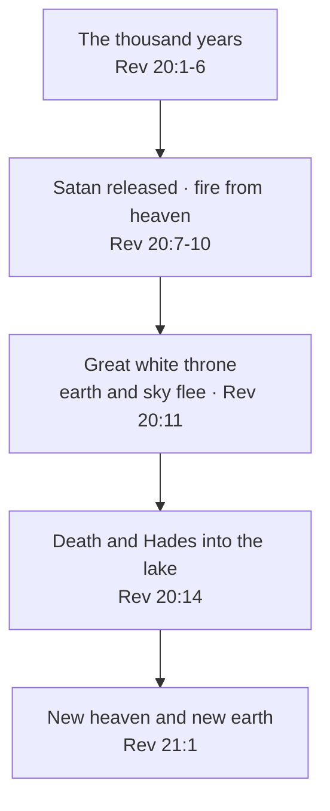

# A New Heaven and a New Earth

The thousand years are over. Satan has been let out, has gathered the nations one last time, and
fire from heaven has ended it (Revelation 20:7-10). The dead have stood before the great white
throne, and death itself has been thrown into the lake of fire (Revelation 20:11-14). The Lamb's wife has been
married since before He rode out (Revelation 19:7, 11). Then John writes one more "I saw":

> ✝️ Revelation 21:1-2 (ESV)
>
> 1 Then I saw a new heaven and a new earth, for the first heaven and the first earth had passed
> away, and the sea was no more. 2 And I saw the holy city, new Jerusalem, coming down out of heaven
> from God, prepared as a bride adorned for her husband.

**In one sentence:** When the thousand-year Sabbath is over and the last judgment is done, God
makes the new heavens and new earth He promised through Isaiah and comes to live in them with His
people, and the Law's eighth days point to it as the first day of a week that is never counted
again.

This study covers the new creation. Its companion, [The New Jerusalem](new-jerusalem.md), covers
the city that comes down into it.

## Key Takeaways

*(This section follows the [Key Takeaways](../about/key-takeaways.md) format — see that page for what each part is for.)*

### Types & Prophecy

**Prophecy.** "For behold, I create new heavens and a new earth" (Isaiah 65:17, ESV). Peter waits
for it "according to his promise" (2 Peter 3:13, ESV), and John sees it done (Revelation 21:1).

**Type.** The eighth day. The Feast of Booths ran seven days, and then "on the eighth day you shall
hold a holy convocation" (Leviticus 23:36, ESV), and the eighth day is itself "a solemn rest" (Leviticus
23:39, ESV). On the eighth day of the priests' ordination "the glory of the LORD appeared to all the
people" (Leviticus 9:23, ESV). Scripture never calls the new creation "the eighth day"; the early
church did (*Epistle of Barnabas* 15), and the pattern in the Law supports it.

### Lessons about Jesus

- **Jesus finishes what He began.** "I am the Alpha and the Omega, the first and the last, the
  beginning and the end" (Revelation 22:13, ESV).
- **Jesus is the first piece of the new creation.** He rose on the day after the Sabbath (Matthew
  28:1), "the firstfruits of those who have fallen asleep" (1 Corinthians 15:20, ESV).
- **Jesus reigns without end.** The throne in the new creation is "the throne of God and of the
  Lamb" (Revelation 22:1, ESV). "Of his kingdom there will be no end" (Luke 1:33, ESV).

### Memory verses

> ✝️ Revelation 21:3 (ESV)
>
> 3 And I heard a loud voice from the throne saying, "Behold, the dwelling place of God is with man.
> He will dwell with them, and they will be his people, and God himself will be with them as their
> God.

> ✝️ Revelation 21:5 (ESV)
>
> 5 And he who was seated on the throne said, "Behold, I am making all things new." Also he said,
> "Write this down, for these words are trustworthy and true."

### Be Transformed

- **Think.** Everything you can see is "stored up for fire" (2 Peter 3:7, ESV). The new heavens and
  new earth "shall remain before me" (Isaiah 66:22, ESV). Weigh your week by which of the two it is
  spent on.
- **Attitude.** Grieve as someone who knows the end of the story. God will wipe the tears away with
  His own hand (Revelation 21:4).
- **Do.** Read Revelation 21:1-7 aloud to someone who is grieving this month, and tell them who said
  it.

### Prayer

Father, Maker of heaven and earth, you have promised a new heaven and a new earth, and you have
never broken a promise. Thank you for your Son Jesus, the firstfruits of the new creation, who
rose on the first day and will make all things new. Keep us patient while the old creation groans,
holy while we wait, and certain that you will dwell with us and wipe away every tear. Let us drink
now from the water of life you give without price.

In Jesus' name. Amen.

## Study outline

- [After the thousand years](#after-the-thousand-years). Where Revelation 21:1 stands in the
  order of events, where Peter's fire falls, and which fire falls when.
- [What Isaiah promised](#what-isaiah-promised). The verb only God performs, and the verse that
  seems to put death in the new creation.
- [What John saw](#what-john-saw). Revelation 21:1-8, phrase by phrase: new, no sea, God's tent,
  all things new, and who is outside.
- [The eighth day](#the-eighth-day). Seven days and then one more, through the Law, Noah and the
  resurrection.
- [The age to come](#the-age-to-come). The New Testament's two ages, and how the thousand years and
  the new creation fit inside them.
- [Discussion questions](#discussion-questions). Five, for a group or on your own.

## After the thousand years

### The last page of the old creation

Revelation 20 gives the order, and it is plain. After the thousand years:

1. Satan is released and gathers the nations "for battle" (Revelation 20:7-8).
2. They surround "the camp of the saints and the beloved city," and "fire came down from heaven and
   consumed them" (Revelation 20:9, ESV).
3. The devil is thrown into the lake of fire (Revelation 20:10).
4. John sees the great white throne: "From his presence earth and sky fled away, and no place was
   found for them" (Revelation 20:11, ESV).
5. The dead are judged "according to what they had done" (Revelation 20:12, ESV), and "Death and Hades were
   thrown into the lake of fire" (Revelation 20:14, ESV).
6. "Then I saw a new heaven and a new earth" (Revelation 21:1, ESV).

The first heaven and earth end at the throne. They flee from the face of the Judge (Revelation 20:11), and at
Revelation 21:1 John sees them "passed away." Death goes into the lake before the new
creation arrives (Revelation 20:14), so there is no death to carry across. John will say so plainly:
"death shall be no more" (Revelation 21:4, ESV).

### Where Peter's fire falls

Peter describes the same end with fire. "The heavens and earth that now exist are stored up for
fire, being kept until the day of judgment and destruction of the ungodly" (2 Peter 3:7, ESV). "The
heavens will be set on fire and dissolved" (2 Peter 3:12, ESV). Then: "according to his promise we are
waiting for new heavens and a new earth in which righteousness dwells" (2 Peter 3:13, ESV).

Revelation settles the order. Peter's fire falls at the end of the old creation and before the new
one, which puts it at Revelation 20:11. Two further steps are inference, and this site takes them
with the dispensational reading. The first is that Peter's "day of the Lord" (2 Peter 3:10) is a period that
opens with the thief-like coming and closes with the dissolution a thousand years later. John
Walvoord calls this telescoping: "the beginning and the end of the day of the Lord are mentioned in
the same passage" (*Bible Knowledge Commentary*, on Revelation 21:1).
*Heaven and Earth Will Pass Away* (in preparation) sets that
reading out, and gives the case of those who put the return and the new creation together. The
second is whether the fire of Revelation 20:9, which falls on Gog and Magog, is the same fire as
Peter's. Revelation does not say.

### Water, then fire

Peter sets the two judgments side by side. "The world that then existed was deluged with water and
perished. But by the same word the heavens and earth that now exist are stored up for fire" (2 Peter
3:6-7, ESV). God closed the first way Himself: "never again shall there be a flood to destroy the
earth" (Genesis 9:11, ESV), a promise that holds "while the earth remains" (Genesis 8:22, ESV). The
next judgment of the whole earth is by fire. *Heaven and Earth Will Pass Away* (in preparation) traces the pairing through the prophets
and Jesus' words, and sets out what 1 Enoch and Josephus expected.

#### Which fire, and when

Fire comes at both ends of the thousand years. Luke 17:30 ties Lot's fire to "the day when the Son of
Man is revealed," and Paul says He comes "in flaming fire" (2 Thessalonians 1:8, ESV). That fire
judges the living nations and leaves the earth standing for the kingdom. At the close, "fire came
down from heaven" on Gog and Magog (Revelation 20:9, ESV), and then "earth and sky fled away"
(Revelation 20:11, ESV). On this site's reading, the fire that dissolves the heavens (2 Peter
3:10-12) falls there, after the thousand years. Readers who hold one event at the return put all of
it together.

**This shows that God judges the whole world and keeps His own through it.** "The Lord knows how to
rescue the godly from trials, and to keep the unrighteous under punishment until the day of
judgment" (2 Peter 2:9, ESV). Noah came through the water, one of "eight persons" (1 Peter 3:20, ESV). [Taken
Before Judgment](taken-before-judgment.md) follows that rescue pattern through Enoch, Noah and Lot.

### After the Sabbath

This site reads the thousand years as the seventh day of a week of history, the Sabbath of the
world ([A Day Is a Thousand Years](day-is-a-thousand-years.md#day-seven-the-rest-that-is-numbered);
compare Hebrews 4:9).
So Revelation 21 opens on the day after the seventh. **This shows that God rules history as surely as
He ruled the first week.** He worked, He rested, and He will begin again, and each step comes in the
order He set.

## What Isaiah promised

### The verb only God performs

> ✝️ Isaiah 65:17-18 (ESV)
>
> 17 "For behold, I create new heavens and a new earth, and the former things shall not be
> remembered or come into mind. 18 But be glad and rejoice forever in that which I create; for
> behold, I create Jerusalem to be a joy, and her people to be a gladness.

"Create" is בָּרָא (*bara*, H1254), the verb of Genesis 1:1. The
*Theological Wordbook of the Old Testament* notes that in its basic form it "is used … only of God's
activity and is thus a purely theological term," and that it "denotes the concept of 'initiating
something new,'" citing this verse (TWOT 278). "New" is חָדָשׁ (*chadash*,
H2319). Isaiah uses the same verb for the city in the next breath: "I create Jerusalem to be a joy"
(Isaiah 65:18). The new creation and the new Jerusalem arrive together in Isaiah and together in Revelation
21:1-2.

The next chapter adds how long it lasts, and who it is kept for: "For as the new heavens and the new
earth that I make shall remain before me, says the LORD, so shall your offspring and your name
remain" (Isaiah 66:22, ESV). God ties Israel's name to the permanence of the new creation. **This
shows that God's promise to Israel outlasts the old creation.** It is written into the new one.

### Isaiah 65:20 and the telescope

The difficulty is two verses later. In the same passage "the young man shall die a hundred years
old, and the sinner a hundred years old shall be accursed" (Isaiah 65:20, ESV). Revelation 21:4
says death "shall be no more." The *ESV Study Bible* lists three ways Christians read the passage:
an idealised picture of restored Jerusalem, the millennium, or the eternal state (note on
Isaiah 65:17-25). This is contested.

The dispensational answer is that Isaiah sees two distant events together, as he does elsewhere.
Isaiah 61:1-2 sets the first and second comings in one sentence (Luke 4:17-19 stops reading halfway),
and Daniel 12:2 puts the resurrection of the righteous and the wicked side by side, which Revelation
20:5 separates by a thousand years. Walvoord applies the same principle here: Isaiah 65:17-19 describes
the new heaven and new earth, and Isaiah 65:20-25 the millennium (*Bible Knowledge Commentary*, on
Revelation 21:1). Revelation supplies what Isaiah compresses: a kingdom on this earth where death is
rare, then a new earth where it is gone.

## What John saw

### "New"

John calls the heaven and earth καινός (*kainos*, G2537), "new." Revelation uses the word nine
times: a new name (Revelation 2:17; 3:12), a new song (Revelation 5:9; 14:3), the new Jerusalem
(Revelation 3:12; 21:2), and here (Revelation 21:1 twice; 21:5). The Greek Old Testament uses the same word at Isaiah 65:17. Greek has another
word for "new," νέος (*neos*, G3501), and it never appears in the book.

Some argue from *kainos* that the new earth is this earth renewed. The Louw-Nida lexicon puts
*kainos* and *neos* in the same meaning group (58.71), so the word cannot settle it. Irenaeus held renewal. He wrote that "neither is the substance nor the essence of the creation
annihilated," only "the fashion of the world passeth away" (*Against Heresies* 5.36.1). Walvoord
holds a "totally new" creation from the "passed away" of Revelation 21:1 (*Bible Knowledge Commentary*, on that verse).
Both agree that the old creation ends and the new one is God's work. *Heaven and Earth Will Pass Away* (in preparation) weighs the texts, among them "the
creation itself will be set free" (Romans 8:21, ESV) and the heavens "will be changed" (Hebrews
1:12, ESV), and leans to renewal through judgment.

### "The sea was no more"

This is the most debated line in the paragraph. The beast rose "out of the sea" (Revelation 13:1,
ESV) and the sea gave up its dead (Revelation 20:13), so many read the sea as a figure for chaos and death. The
*NIV Cultural Backgrounds Study Bible* notes that the sea is positive elsewhere in Revelation (Revelation 5:13;
15:2), and suggests it is replaced by the river of life (note on Revelation 21:1). Walvoord reads it plainly:
"no large body of water will be on the new earth." What the text settles is simpler. The sea that
held the dead has nothing left to give up.

### God pitches His tent

> ✝️ Revelation 21:3-4 (ESV)
>
> 3 And I heard a loud voice from the throne saying, "Behold, the dwelling place of God is with man.
> He will dwell with them, and they will be his people, and God himself will be with them as their
> God. 4 He will wipe away every tear from their eyes, and death shall be no more, neither shall
> there be mourning, nor crying, nor pain anymore, for the former things have passed away."

"Dwelling place" is σκηνή (*skēnē*, G4633),
"tent" or "tabernacle," and the verb that follows, "he will dwell," is σκηνόω (*skēnoō*, G4637),
"to tent." The CSB and LSB footnote both. σκηνόω appears five times in the New Testament: once in
John, "the Word became flesh and dwelt among us" (John 1:14, ESV), and four times in Revelation (Revelation 7:15;
12:12; 13:6; 21:3).

The voice is quoting a promise God made at Sinai. "I will make my dwelling among you … and will be
your God, and you shall be my people" (Leviticus 26:11-12, ESV). Ezekiel repeats it for the restored
nation: "My dwelling place shall be with them" (Ezekiel 37:27, ESV). The Word tented among us for
thirty-three years. In the new creation God tents with His people and never strikes the tent.
The tears and the death in verse 4 come from Isaiah: "He will swallow up death forever; and the Lord
GOD will wipe away tears from all faces" (Isaiah 25:8, ESV).

**This shows that God's goal was always to live with His people.** The tabernacle, the temple and the
incarnation were each a stage on the way to it. [The Bride of
Christ](../israel-and-church/bride-of-christ.md) follows the same promise from the Lamb's wife's side.

### "Behold, I am making all things new"

> ✝️ Revelation 21:5-7 (ESV)
>
> 5 And he who was seated on the throne said, "Behold, I am making all things new." Also he said,
> "Write this down, for these words are trustworthy and true." 6 And he said to me, "It is done! I am
> the Alpha and the Omega, the beginning and the end. To the thirsty I will give from the spring of
> the water of life without payment. 7 The one who conquers will have this heritage, and I will be
> his God and he will be my son.

Three of the Greek words, Ἰδοὺ καινὰ ποιῶ (*idou kaina poiō*), "Behold, new things I make," are the
Greek Old Testament's words at Isaiah 43:19: "Behold, I am doing a new thing" (ESV). God said it to
exiles about the road home from Babylon. He says it from the throne about everything.

Paul uses the same words for you. "If anyone is in Christ, he is a new creation. The old has passed
away; behold, the new has come" (2 Corinthians 5:17, ESV). Behind "the new has come" is ἰδοὺ
γέγονεν καινά (*idou gegonen kaina*), and behind "It is done!" in Revelation 21:6 is Γέγοναν
(*gegonan*, G1096), from the same verb. The new creation has already begun in everyone who is in Christ,
and at Revelation 21 it reaches everything else.

The water "without payment" is Isaiah's: "Come, everyone who thirsts, come to the waters … without
money and without price" (Isaiah 55:1, ESV). The heritage is a son's: "I will be to him a father, and
he shall be to me a son" (2 Samuel 7:14, ESV) was said of David's heir, and Revelation 21:7 gives it
to "the one who conquers." The *NIV Cultural Backgrounds Study Bible* notes that the Greek makes each
believer God's child individually (note on Revelation 21:7). That is adoption, completed.

### Who is outside

Verse 8 names "the cowardly, the faithless, the detestable" and the rest, and says "their portion
will be in the lake that burns with fire and sulfur, which is the second death" (Revelation 21:8,
ESV). The new creation is holy because God has judged. Walvoord reads the list as the evidence of
an unsaved life, and adds that "many will be in heaven who before their conversions were indeed guilty of these sins."
Every name written in the Lamb's book of life is there by grace (Revelation 21:27).

## The eighth day

### Seven days, and then one more

The Law counts in sevens, and then several times it adds a day.

| The eighth day | What happens on it |
|---|---|
| A son's circumcision (Genesis 17:12; Leviticus 12:3) | He enters the covenant |
| A firstborn ox or sheep (Exodus 22:30) | "On the eighth day you shall give it to me" |
| The priests' ordination (Leviticus 9:1, 23-24) | Ministry begins; "the glory of the LORD appeared to all the people" |
| A cleansed leper (Leviticus 14:10, 23) | He is brought back "before the LORD" |
| The Feast of Booths (Leviticus 23:36, 39) | A holy convocation and "a solemn rest" |

Each time, seven days complete something and the eighth begins what the seven were for.

The Feast of Booths makes the point most clearly. Its last day is הַשְּׁמִינִי
(*hashemini*, H8066), "the eighth," and it is called an עֲצֶרֶת (*atzeret*,
H6116), a "solemn assembly" (Leviticus 23:36). It is also a שַׁבָּתוֹן
(*shabbaton*, H7677), "a solemn rest" (Leviticus 23:39), the same word the verse uses for the first day. The
Greek Old Testament renders it ἀνάπαυσις (*anapausis*, G372), "rest." So the eighth day does not end the
rest. It carries the rest past the count of seven. 2 Enoch, a Jewish work usually dated to the
late first century AD, though the date is disputed, calls the eighth "a time of not-counting, endless" (*2 Enoch* 33:1), and [A Day Is a
Thousand Years](day-is-a-thousand-years.md#and-the-eighth) traces it there.

### Noah, and the day Jesus rose

Peter counts the people in the ark: "eight persons, were brought safely through water" (1 Peter 3:20,
ESV). Then he draws the line himself: "Baptism, which corresponds to this, now saves you ... through
the resurrection of Jesus Christ" (1 Peter 3:21, ESV). "Corresponds" is ἀντίτυπον (*antitypon*,
G499), "antitype." The eight brought through the water and the believer raised with Christ are one
pattern in Peter's own words, and he ties it to the resurrection. In his second letter the phrase
ὄγδοον Νῶε (*ogdoon Nōe*, G3590) is Greek idiom for "Noah, one of eight," which the ESV renders "with
seven others" (2 Peter 2:5), so the pattern rests on 1 Peter 3:20-21. Noah and his family stepped out
into a washed world, a people brought through judgment into a new beginning, and Peter sets that
flood beside the coming fire (2 Peter 3:6-7).

Jesus rose "after the Sabbath, toward the dawn of the first day of the week" (Matthew 28:1, ESV),
the day after the seventh. Within a century the church was calling it the eighth day. The *Epistle of
Barnabas*, from the early second century, has God say:

> when, giving rest to all things, I shall make a beginning of the eighth day, that is, a beginning
> of another world. Wherefore, also, we keep the eighth day with joyfulness, the day also on which
> Jesus rose again from the dead.
> — *Epistle of Barnabas* 15 (ANF vol. 1)

Justin Martyr made Peter's link explicit. The eight in the ark "were a symbol of the eighth
day, wherein Christ appeared when He rose from the dead" (*Dialogue with Trypho* 138).

### Booths, the millennium and the eighth

The Feast of Booths gathers these threads. In the millennium the nations "shall go up year after
year to worship the King, the LORD of hosts, and to keep the Feast of Booths" (Zechariah 14:16, ESV).
In Revelation the great multitude carries "palm branches" (Revelation 7:9), the branches of Booths (Leviticus
23:40), and the One on the throne will "shelter them with his presence" (Revelation 7:15, ESV), the verb
σκηνόω again. On a dispensational reading the seven days of Booths picture the kingdom, and the
eighth day pictures the new creation that follows it. That is typology, and it rests on the pattern
above; no verse states it.

On "the last day of the feast, the great day," Jesus stood and cried, "If anyone thirsts, let him come
to me and drink" (John 7:37, ESV). The *NKJV Cultural Backgrounds Study Bible* calls it "the
climactic eighth day" and notes that the Scriptures read on the feast's last day were Ezekiel 47 and
Zechariah 14, the rivers flowing from the temple and from Jerusalem (note and article on John 7:37). John
himself says only "the last day," so the number is an inference, and the seventh day has its
defenders. Either way, the invitation is the one the new creation repeats: "To the thirsty I will
give" (Revelation 21:6), and "let the one who is thirsty come" (Revelation 22:17, ESV).

### What the pattern can carry

The eighth day is a pattern Scripture shows, and the study treats it as that. The number is not
always good: the beast "is an eighth but it belongs to the seven, and it goes to destruction"
(Revelation 17:11, ESV). [Numbers in Scripture](../scripture/numerology.md) gives the general
caution. What the pattern carries is what Revelation 21 states outright: after the seven comes a
beginning that God makes, and it does not run down.

**This shows that God finishes His work and then begins something that never needs finishing.**
Jesus rose on the first day of that week. So your resurrection is already dated on God's calendar.

## The age to come

### Two ages

Jewish teaching in Jesus' day divided time into "this age" and "the age to come." The Mishnah says,
"All Israel have a portion in the world to come" (*m. Sanhedrin* 10:1), in Hebrew
חֵלֶק לָעוֹלָם הַבָּא (*chelek la'olam haba*). Its proof text is Isaiah
60:21, "Your people shall all be righteous; they shall possess the land forever" (ESV), from the
chapter Revelation 21:23-26 draws on for the city's light and open gates. Revelation uses "portion"
language of the same things: a μέρος (*meros*, G3313), a "share," in the first resurrection (Revelation 20:6),
in the lake of fire (Revelation 21:8), and "in the tree of life and in the holy city" (Revelation
22:19).

Jesus used the same frame. Blasphemy against the Holy Spirit "will not be forgiven, either in this age
or in the age to come" (Matthew 12:32, ESV). Whoever leaves home for Him receives "in the age to come
eternal life" (Mark 10:30, ESV). "Those who are considered worthy to attain to that age and to the
resurrection from the dead neither marry nor are given in marriage, for they cannot die anymore"
(Luke 20:35-36, ESV). Paul sets Christ's name above every name "not only in this age but also in the
one to come" (Ephesians 1:21, ESV). And Hebrews says believers have already "tasted … the powers of
the age to come" (Hebrews 6:5, ESV).

### Where the thousand years fits

The New Testament places the start of the age to come at Christ's return. Jesus dates the
παλιγγενεσία (*palingenesia*, G3824), "the new world," "when the Son of Man will sit on his glorious
throne," with the Twelve "judging the twelve tribes of Israel" (Matthew 19:28, ESV). Hebrews calls
it "the world to come" that God subjected to man, and says, "At present, we do not yet see everything
in subjection to him. But we see … Jesus" (Hebrews 2:5, 8-9, ESV).

On the dispensational reading this site holds, the thousand years is the first stage of the age to
come, and the new heaven and new earth is its unending stage. Paul writes of "the coming ages"
(Ephesians 2:7, ESV), and the Greek is plural, ἐν τοῖς αἰῶσιν τοῖς ἐπερχομένοις. Revelation 22:5
ends with the saints reigning εἰς τοὺς αἰῶνας τῶν αἰώνων, "to the ages of the ages." Readers who
hold no intervening millennium take the age to come as the eternal state, beginning at the return.
Both readings put the resurrection at its door (Luke 20:35) and God's people in it forever. Luke
20:36's "cannot die anymore" describes the resurrected. On the dispensational reading, people who
enter the kingdom in mortal bodies can still die, which is why Isaiah 65:20 has death in it and
Revelation 21:4 has none.

### The Son hands over the kingdom

Paul describes the hinge between the two stages. "Then comes the end, when he delivers the kingdom
to God the Father after destroying every rule and every authority and power. … The last enemy to be
destroyed is death" (1 Corinthians 15:24, 26, ESV). Death is destroyed at Revelation 20:14, so the
handing over falls there, at the end of the thousand years. Its purpose is "that God may be all in
all" (1 Corinthians 15:28, ESV).

That does not end the Son's reign. The throne of the new creation is "the throne of God and of the
Lamb" (Revelation 22:1, 3, ESV), and Gabriel promised Mary that "of his kingdom there will be no end"
(Luke 1:33, ESV). Walvoord concludes that 1 Corinthians 15:24 "does not mean that Christ's reign on
the throne will end but that it will change its character" (*Bible Knowledge Commentary*, on
Revelation 22:1). Christ reigns to put down every enemy, and then He reigns with the Father in a
creation with no enemies left.

**This shows that God is bringing everything under one head.** His plan is "to unite all things in
him, things in heaven and things on earth" (Ephesians 1:10, ESV). So you may live now as a citizen
of the age to come. Hebrews draws the conclusion: "let us be grateful for receiving a kingdom that
cannot be shaken" (Hebrews 12:28, ESV).

## Discussion Questions

1. Revelation calls the heaven and earth καινός (*kainos*), and the lexicon puts *neos* in the same
   meaning group. What does Revelation 21:1 make certain about the new creation, and what does it
   leave open?
2. Isaiah 65:20 has death in a passage that opens with "new heavens and a new earth." Read Isaiah
   65:17-25 beside Revelation 20:4-6 and 21:4. Which verses sound like the kingdom, and which like
   the new creation?
3. The eighth day of Booths is "a solemn rest" (Leviticus 23:39), and Jesus rose on the day after the
   Sabbath. What does the eighth day carry forward from the seventh, and what does it begin?
4. Paul says the Son "delivers the kingdom to God the Father" (1 Corinthians 15:24), and Revelation
   puts the Lamb on the throne forever (Revelation 22:1, 3). How do you hold the two together?
5. Paul says the new creation has already come in you (2 Corinthians 5:17), and Hebrews says you
   have tasted "the powers of the age to come" (Hebrews 6:5). Where did you see that this week, and where
   are you still living as if this age is the only one?

## References & Recommended Reading

### Ancient sources

- *Epistle of Barnabas* 15, *Ante-Nicene Fathers* vol. 1 (public domain) — the eighth day as "a
  beginning of another world."
- Justin Martyr, *Dialogue with Trypho* 138, *Ante-Nicene Fathers* vol. 1 (public domain) — Noah's
  eight as a symbol of the eighth day.
- Irenaeus, *Against Heresies* 5.36.1, *Ante-Nicene Fathers* vol. 1 (public domain) — the creation's
  substance not annihilated.
- *2 Enoch* 33:1, as quoted in [A Day Is a Thousand Years](day-is-a-thousand-years.md).
- *Mishnah Sanhedrin* 10:1, from **"Mishnah Yomit" translated by Dr. Joshua Kulp, licensed CC-BY**,
  with the Hebrew from the Torat Emet edition (public domain), retrieved through
  `references/build/sefaria.py` from the Sefaria-Export dataset.

### Commentaries, study Bibles and lexicons

- John F. Walvoord, "Revelation," in *The Bible Knowledge Commentary*, ed. John F. Walvoord and Roy
  B. Zuck (Victor Books) — on Revelation 20:11; 21:1; 21:8; 22:1. Quoted briefly with attribution.
- *ESV Study Bible* (Crossway) — verse text (ESV) and notes on Isaiah 65:17-25 and Revelation 21:1-8.
- *NIV Cultural Backgrounds Study Bible* (Zondervan) — notes on Revelation 21:1 and 21:7 and John
  7:37.
- *NIV Biblical Theology Study Bible* (Zondervan) — notes on Revelation 21:1-8, consulted.
- CSB and LSB translators' footnotes on Revelation 21:3 ("tent", "tabernacle").
- R. Laird Harris, Gleason L. Archer and Bruce K. Waltke, eds., *Theological Wordbook of the Old
  Testament* (Moody), entry 278, בָּרָא (*bara*), by Thomas E. McComiskey.
- MACULA Greek and Hebrew morphology with Louw-Nida domains, and the Septuagint lemma data (open
  licence) — occurrences of καινός, σκηνόω, ὄγδοος, μέρος and παλιγγενεσία; the Greek Old Testament
  at Isaiah 43:19, 65:17 and Leviticus 23:39.

### On this site

- [The New Jerusalem](new-jerusalem.md) — the city that comes down into the new creation.
- [A Day Is a Thousand Years](day-is-a-thousand-years.md) — the seventh day as the millennium, and
  the eighth.
- [Taken Before Judgment](taken-before-judgment.md) — Enoch, Noah and Lot, rescued before judgment.
- *Heaven and Earth Will Pass Away* (in preparation) — 2 Peter 3, the textual
  problem at 2 Peter 3:10, and renewal or replacement.
- [The Bride of Christ](../israel-and-church/bride-of-christ.md) and [The Wife of the
  Lamb](../israel-and-church/wife-of-the-lamb.md) — the Lamb's wife, homed in the new creation.
