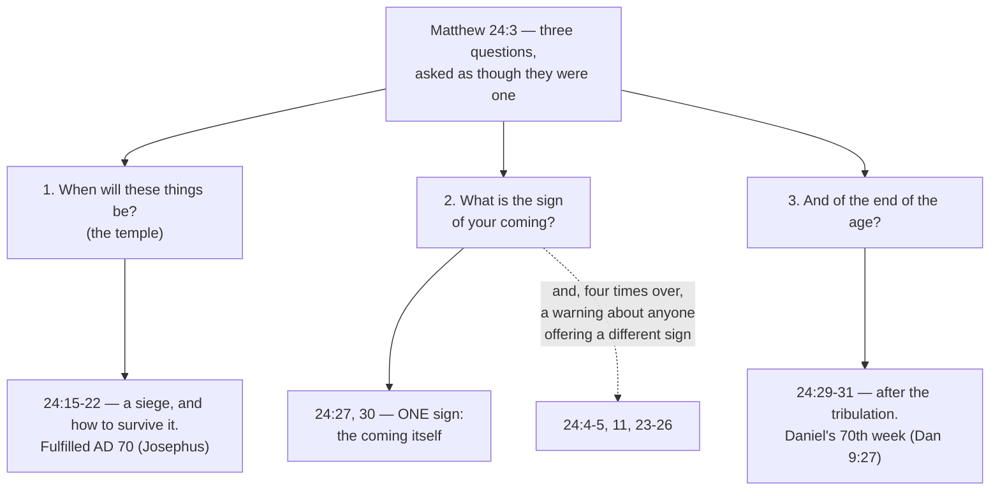
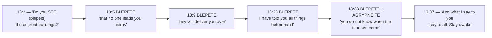
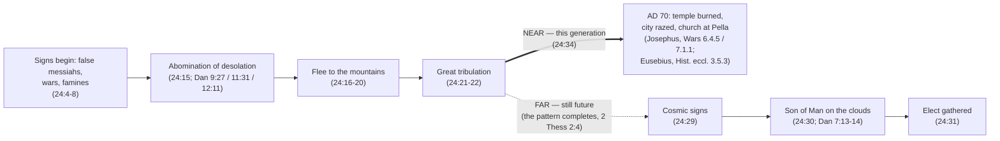
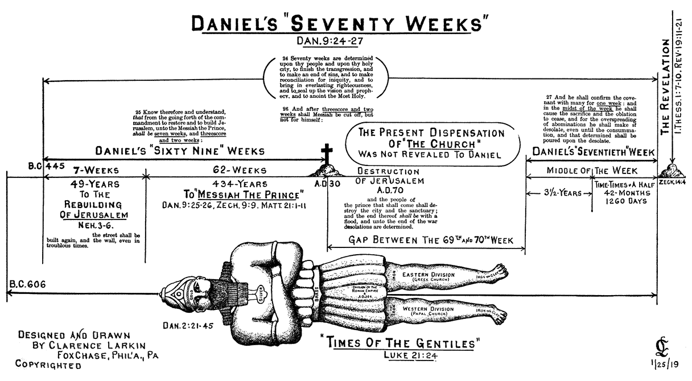
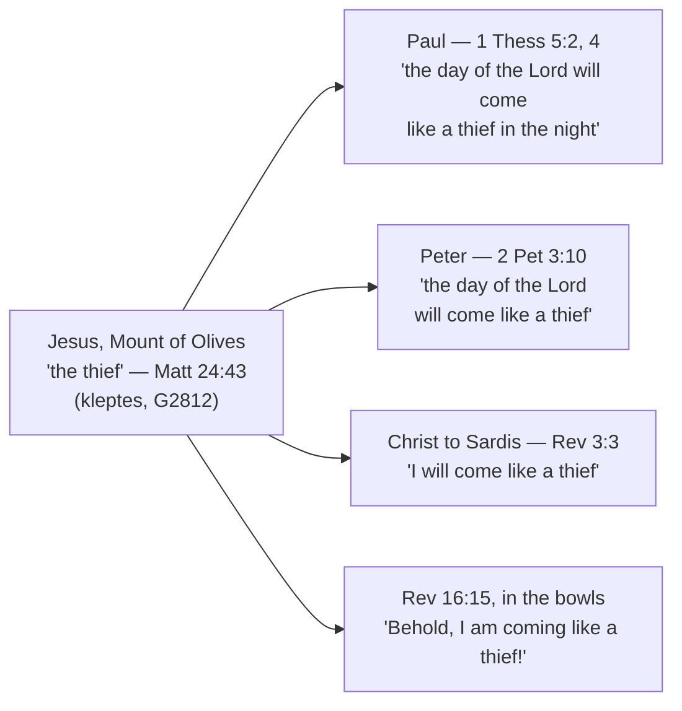
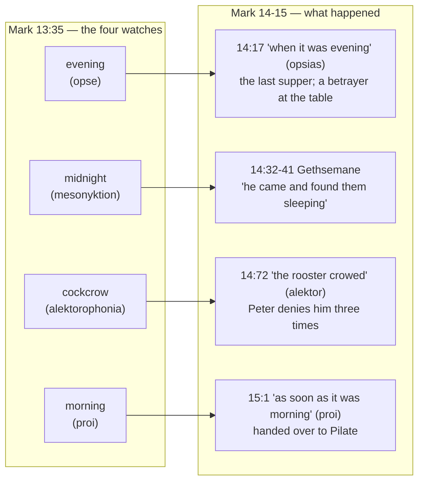

# The Olivet Discourse

Four men sat with Jesus on the Mount of Olives, looking back across the Kidron Valley at the temple
he had just told them would be levelled, and asked him for a sign. They were asking a question their
own century had a standard answer to. Jewish teaching in this period circulated lists of the
disasters that would announce the Messiah's arrival — wars, famine, earthquake, apostasy — sometimes
called the birth pangs of the Messiah. A rabbi asked for the sign was expected to produce the list.

Jesus produced the list, and then took it away from them. Wars, famines, earthquakes: "all these are
but the beginning of the birth pains" (Matthew 24:8, ESV) — the beginning, and so not the sign. Four
separate times he warned them about anyone who would offer them one. Then he named a single sign, and
it was his own arrival, lighting the sky from one horizon to the other, needing no announcement from
anybody.

**The discourse is not a code to be broken. It is a warning against the people who will tell you they
have broken it, and a command to be awake when the answer arrives on its own.** That is how Matthew
and Mark both build it, and it holds the two halves of the discourse together — the siege that came
within forty years and was recorded by an eyewitness, and the return that has not come yet.

## Key Takeaways

### Types & Prophecy

Daniel supplies the discourse's central term, the abomination of desolation, in three settings:
Antiochus IV Epiphanes' desecration of the altar in 167 BC (11:31), a coming ruler's desecration in
a final seven-year period (9:27), and a desolation measured in exact days still future to Daniel
(12:11). Jesus cites the term without saying which he means. Daniel's seventieth week (9:27) remains
unstarted, and the discourse's own far horizon sits inside it.

### Lessons about Jesus

Jesus predicts a specific building's specific fate roughly forty years out, precisely enough that
Josephus's eyewitness account can be checked against it line by line. In the same breath he refuses
the one thing his disciples most wanted: "concerning that day or that hour, no one knows, not even
the angels in heaven, nor the Son, but only the Father" (Mark 13:32, ESV). That sentence is about
whose the date is, not about what the Son is capable of knowing — see [The Day No One
Knows](#the-day-no-one-knows). Asked the same question again after the resurrection, he answered
the same way and named the reason: "it is not for you to know times or seasons that the Father has
fixed by his own authority" (Acts 1:7, ESV).

### Memory verses

"Heaven and earth will pass away, but my words will not pass away" (Matthew 24:35, ESV). "And what I
say to you I say to all: Stay awake" (Mark 13:37, ESV).

### Be Transformed

Jesus gives his disciples something to do about the future, and it is not arithmetic. Stay awake
(Mark 13:37); do not be led astray (Matthew 24:4); endure (24:13); keep working at what you were
given (24:45-46). Every imperative in the discourse is about conduct in the meantime. None of them
is about calculation. Peter, who heard all of it, drew the same conclusion decades later: since
everything visible is going to burn, "what sort of people ought you to be in lives of holiness and
godliness" (2 Peter 3:11, ESV).

### Prayer

Father, you kept every word of this discourse's near half, down to a date on a calendar. Its far
half is still ahead and we do not know the day. Guard us from those who claim they do. Keep us
awake, working at what you gave us, until the sky itself announces your Son. Amen.

## The Question Behind the Question

Jesus has just left the temple. A disciple points out the stonework — "Look, Teacher, what wonderful
stones and what wonderful buildings!" (Mark 13:1, ESV) — and Jesus answers with a demolition notice:
"Do you see these great buildings? There will not be left here one stone upon another that will not
be thrown down" (13:2, ESV). They cross the valley, climb the Mount of Olives, sit down opposite the
temple, and four of them ask him about it privately. Mark alone names them: "Peter and James and John
and Andrew" (13:3, ESV). Keep those names; they matter at the end of this study.

Mark and Luke record one question in two parts — when, and what sign (Mark 13:4; Luke 21:7). Matthew
records three:

> ✝️ Matthew 24:3 (ESV)
> 3 As he sat on the Mount of Olives, the disciples came to him privately, saying, "Tell us, when
> will these things be, and what will be the sign of your coming and of the end of the age?"

*The Temple Mount seen from the Mount of Olives, across the Kidron Valley — the sightline Jesus and
the four disciples had while he spoke. (The gold dome is the seventh-century Dome of the Rock, not
Herod's temple; the platform and the valley are the same ground.) Photo:
[brionv](https://www.flickr.com/photos/brionv/6035890417/), [CC BY-SA
2.0](https://creativecommons.org/licenses/by-sa/2.0/), via Wikimedia Commons.*

Three questions, joined by *and*, asked as though they were one. Behind that grammar is an
assumption: that the temple's destruction, Messiah's arrival, and the end of the age are a single
event. For a first-century Jewish disciple this was not a strange thing to think. If the temple
fell, God's own house had been abandoned, and what could follow that except the end of everything?

Jesus's answer takes the question apart. The temple's fall gets a dated, survivable, tactical answer.
The coming gets a different kind of answer — one sign, unmissable, unschedulable. And the end of the
age turns out to sit at the far side of a stretch of time the disciples did not know was there.

The asymmetry between the accounts is not a disagreement. Mark and Luke's readers asked a narrower
question and got a narrower record of the answer. Matthew's disciples asked about the *parousia*
(παρουσία, *parousia*, Strong's G3952) by name — the word appears at 24:3, 27, 37 and 39, and nowhere
in Mark's or Luke's version — and Matthew's account is correspondingly the one that runs on into
chapter 25's parables. *Parousia* became the standard New Testament term for the second coming
outside the Gospels, which makes Matthew's record the version the epistles later pick up.

The three accounts are one conversation recorded three times — the same illustrations in the same
order, not merely the same topic. What differs is what each writer's readers needed:

| | Matthew 24 | Mark 13 | Luke 21 |
|---|---|---|---|
| Who asks | "the disciples" | Peter, James, John, Andrew (13:3) | unspecified |
| The question | timing, *and* the sign of the *parousia* and the end of the age (24:3) | timing and sign (13:4) | timing and sign (21:7) |
| The sign of the end | Daniel's "abomination of desolation" (24:15) | the same Danielic phrase (13:14) | "Jerusalem surrounded by armies" (21:20) |
| Structural spine | four warnings against deception (24:4, 5, 11, 24) | four times βλέπετε (13:5, 9, 23, 33) | — |
| "No one knows... nor the Son" | 24:36 | 13:32 | absent |
| One taken, one left | 24:40-41 | absent | absent here (parallel at 17:34-35) |
| "Times of the Gentiles" | absent | absent | 21:24 |
| Parables of readiness | 24:45 – 25:46 | 13:34-37 only | absent |

Luke's substitutions are the clearest case of an author reading his audience. Where Matthew and Mark
keep Daniel's coded phrase, Luke gives the literal referent — armies around the city — for readers who
would not catch the citation. He alone names "the times of the Gentiles" (21:24), and he alone states
the application in plain words (21:28).

## What They Expected, and What He Refused

The list Jesus gives in 24:4-8 is not original to him. The *NIV Cultural Backgrounds Study Bible*
notes that "many Jewish thinkers offered lists of sufferings, which they sometimes called the 'birth
pangs' of the Messiah or of the new world; these sufferings would precede the end of the age" (note
on Matthew 24:6-14). Wars, international conflict, famine, earthquake, apostasy — Jesus's list would
have sounded familiar to the four men listening.

Then he does something with it that the same note calls out: "in contrast to many other Jewish
thinkers, he identifies the events listed here as merely 'the beginning of birth pains'," and he
"will answer the question about the sign of his coming (v. 3) with a single sign at his coming
(v. 30)." The disciples asked for a checklist. Jesus handed the checklist back, relabelled.

The word carries this. ὠδίν (*ōdin*, "birth pang," G5604) occurs four times in the New Testament:
here and in the Markan parallel (Matthew 24:8; Mark 13:8), in Peter's Pentecost sermon of the agony
of death (Acts 2:24), and in Paul's own day-of-the-Lord passage — "sudden destruction will come upon
them as labor pains come upon a pregnant woman, and they will not escape" (1 Thessalonians 5:3, ESV).
Labour pains are a real signal that something is coming, and a famously unreliable guide to when. A
woman in early labour knows the birth is real. She does not know the hour. That is the exact
epistemic position Jesus puts his disciples in, and it is the opposite of a timetable.

What follows the list, in Matthew, is six verses the popular treatment of this chapter usually
skips — and they are addressed directly to the disciples, in the second person:

> ✝️ Matthew 24:9-13 (ESV)
> 9 "Then they will deliver you up to tribulation and put you to death, and you will be hated by all
> nations for my name's sake. 10 And then many will fall away and betray one another and hate one
> another. 11 And many false prophets will arise and lead many astray. 12 And because lawlessness
> will be increased, the love of many will grow cold. 13 But the one who endures to the end will be
> saved."

The question was "when." The answer, so far, is: you will be hated, you will be betrayed by each
other, love will cool, and your job is to endure. Mark makes the same turn even more sharply at
13:9 — "be on your guard. For they will deliver you over to councils, and you will be beaten in
synagogues, and you will stand before governors and kings for my sake, to bear witness before them"
(ESV). The disciples asked about the calendar and Jesus answered about their own coming suffering.

He said it to four men Mark names (13:3), and the New Testament reports what became of three of them.
**James son of Zebedee** was killed by Herod with the sword (Acts 12:2) — the first apostle to die,
and the only one whose martyrdom Scripture itself records. **Peter** was told separately, and in
detail, how he would go: "you will stretch out your hands, and another will dress you and carry you
where you do not want to go," which John's narrator glosses as showing "by what kind of death he was
to glorify God" (John 21:18-19, ESV). **John** wrote from exile on Patmos "on account of the word of
God and the testimony of Jesus," calling himself "your brother and partner in the tribulation"
(Revelation 1:9, ESV). That last word is θλῖψις — the one Jesus used to his face at 24:9, and the one
John uses again for the great tribulation still ahead (Revelation 7:14, treated below). Of
**Andrew**, Scripture records nothing; his end is tradition only.

A recorded martyrdom, a predicted death, a documented exile, and a silence — worth keeping straight
rather than levelling into a single story of twelve martyrs. [The Twelve: Disciples and
Apostles](../biblical-figures/twelve-apostles.md) works through the men themselves. And one thing
belongs beside it: within a day of hearing "the one who endures to the end will be saved," these same
men "all left him and fled" (Mark 14:50, ESV). Whatever endurance they later showed was not native to
them.

## "See That No One Leads You Astray"

The first words out of Jesus's mouth in reply are not a date. They are a warning about deception, and
the warning is the discourse's most repeated note.

πλανάω (*planaō*, "lead astray, deceive," G4105) occurs eight times in Matthew's Gospel. Four of the
eight are in this discourse — 24:4, 24:5, 24:11 and 24:24 — and those four are the only Matthean uses
carrying the sense of deceiving somebody (Louw-Nida domain 31.8). The other four are the wandering
sheep of chapter 18, which is a different sense entirely (domain 15.24). Every time Matthew's Jesus
warns about deception, he is on the Mount of Olives.

The four warnings escalate. First a general caution: "See that no one leads you astray" (24:4). Then
the mechanism: "many will come in my name, saying, 'I am the Christ,' and they will lead many astray"
(24:5). Then the professionals: "many false prophets will arise and lead many astray" (24:11). Then
the worst case:

> ✝️ Matthew 24:23-26 (ESV)
> 23 Then if anyone says to you, "Look, here is the Christ!" or "There he is!" do not believe it.
> 24 For false christs and false prophets will arise and perform great signs and wonders, so as to
> lead astray, if possible, even the elect. 25 See, I have told you beforehand. 26 So, if they say to
> you, "Look, he is in the wilderness," do not go out. If they say, "Look, he is in the inner rooms,"
> do not believe it.

Both locations are pointed. Some Jewish groups of the period expected deliverance to begin in the
wilderness (*NIV Cultural Backgrounds Study Bible*, note on Matthew 24:26) — the Qumran community had
gone there on that principle, and Josephus records more than one wilderness messianic movement in the
decades before the war. "Inner rooms" is the opposite error: a private, insider revelation available
to those in the know. Jesus rules out both the public movement and the secret one, and he rules them
out on a single ground, given in the next verse: "For as the lightning comes from the east and shines
as far as the west, so will be the coming of the Son of Man" (24:27, ESV).

That is the answer to question two. Nobody has to point lightning out to you. If someone has to tell
you the Messiah has come, that fact alone disproves the claim.

Mark builds his whole account on this. βλέπετε (*blepete*, "watch out, be on guard," G991) is Mark's
structural spine, and it lands at 13:5, 13:9, 13:23 and 13:33 — all four coded by Louw-Nida as
*beware* (27.58) rather than ordinary seeing. Mark sets it up with a play on the same verb: the
discourse opens with Jesus asking "Do you *see* (βλέπεις) these great buildings?" (13:2). You see the
buildings. Now watch out.

The *ESV Study Bible* reads Mark the same way: "Jesus gives this entire discourse about the end times
so that the disciples will be on guard (vv. 5, 9, 23)... Instead of speculating about the specific
timing of end-time events, all disciples are to be vigilant" (note on Mark 13:33-37). That is an
independent commentary arriving at the discourse's purpose from its own imperatives.

## The Near Horizon: A Siege, and How to Survive It

Question one gets a concrete answer, and the concreteness is the point. Jesus tells them what the
signal will be, and then gives evacuation instructions.

The signal is Daniel's: "when you see the abomination of desolation spoken of by the prophet Daniel,
standing in the holy place" (Matthew 24:15, ESV; near-identical at Mark 13:14). Daniel uses the image
(Hebrew שִׁקּוּץ מְשׁוֹמֵם, *shiqqutz meshomem*, "an abomination that
appals") in three settings — Antiochus's historical desecration of 167 BC (11:31), a future ruler's
desecration at the midpoint of a seven-year covenant (9:27), and a desolation measured at 1,290 days
(12:11). Jesus names the term and does not say which. That silence is doing work, and this study
returns to it below.

Luke, writing for readers who would not catch a citation of Daniel's apocalyptic vocabulary,
substitutes the literal referent: "when you see Jerusalem surrounded by armies, then know that its
desolation has come near" (Luke 21:20, ESV).

Then the instructions, which are startlingly practical:

> ✝️ Matthew 24:16-20 (ESV)
> 16 then let those who are in Judea flee to the mountains. 17 Let the one who is on the housetop not
> go down to take what is in his house, 18 and let the one who is in the field not turn back to take
> his cloak. 19 And alas for women who are pregnant and for those who are nursing infants in those
> days! 20 Pray that your flight may not be in winter or on a Sabbath.

Each line is culturally loaded, and the *NIV Cultural Backgrounds Study Bible* unpacks them:

- **"Flee to the mountains" is counterintuitive advice.** "During invasions, people usually crowded
  into walled cities for protection, but Jesus warns against that measure in this case" (note on
  24:16). The instinct of every Judean under attack was to get inside Jerusalem's walls. Jesus tells
  them the walls are the trap. The same note observes that mountain paths neutralise a large army's
  numbers, which is how David evaded Saul and how the Maccabees fought Rome's predecessors.
- **The housetop.** Roofs were flat and lived on — drying vegetables, praying, talking to neighbours —
  and reached by an external stair, so going down *into* the house costs a detour (note on 24:17).
  Do not take it.
- **The cloak.** Field workers left the outer garment at the edge of the field as the day warmed.
  That garment "was so important that it was the one item that a creditor could not seize from a
  debtor overnight" (note on 24:18) — the law itself protects it: "for that is his only covering, and
  it is his cloak for his body; in what else shall he sleep?" (Exodus 22:27, ESV). It is the last
  possession the Torah guarantees a poor man. Jesus says leave it in the field.
- **Winter and Sabbath.** Judean winter is the rainy season; dry wadis flood, roads turn to mud, and
  the Jordan rises. Josephus records Judean fugitives in AD 68 trapped by the flooded Jordan and
  killed by their pursuers (*Wars* 4.433). On a Sabbath, Jerusalem's gates would be shut (note on
  24:20).

This is not apocalyptic poetry. It is a man telling his friends which way to run, what not to go back
for, and what weather to pray against.

### The fulfilment, dated

Luke had already given the same prophecy in plainer terms, days earlier, weeping as he approached the
city: "the days will come upon you, when your enemies will set up a barricade around you and surround
you and hem you in on every side and tear you down to the ground, you and your children within you.
And they will not leave one stone upon another in you" (Luke 19:43-44, ESV).

Josephus, a Jewish priest who watched the siege from the Roman side, records the temple burning on
"the tenth day of the month Lous [Ab]," noting that this was the same calendar date on which "it was
formerly burnt by the king of Babylon" (*Wars of the Jews* 6.4.5, Whiston). After the city fell, Titus
"gave orders that they should now demolish the entire city and temple," which was "so thoroughly laid
even with the ground by those that dug it up to the foundation, that there was left nothing to make
those that came thither believe it had ever been inhabited" (*Wars* 7.1.1).

The evacuation order has its own record. Eusebius reports that "the people of the church in Jerusalem
had been commanded by a revelation, vouchsafed to approved men there before the war, to leave the
city and to dwell in a certain town of Perea called Pella" (*Ecclesiastical History* 3.5.3). They
left. The instruction in 24:16 was obeyed by people who had heard it, and they lived.

### "This generation"

The timing anchor is 24:34: "this generation will not pass away until all these things take place"
(ESV). Matthew uses "this generation" (γενεά αὕτη, *genea hautē*) eight other times, and every one of
them means Jesus's own contemporaries — "an evil and adulterous generation" (12:39), the generation
judged alongside Nineveh (12:41-42), and, one paragraph before this discourse opens, "all these
things will come upon this generation" (23:36, ESV), said of the men who had just been charged with
killing the prophets.

Louw-Nida codes γενεά at 24:34 under both a group sense (10.4, 11.4) and a time sense (67.144)
simultaneously, so the lexicon alone will not settle it. Matthew's own usage does: eight for eight,
always his contemporaries, never a race persisting across centuries. The near horizon — the events of
verses 4-28 — belongs to the lifetime of the men on that hillside. Verse 29 will place the far horizon
*after* that horizon's distress, which requires the near one to have begun on schedule and requires
nothing else.

## The Hinge at Verse 29

"Immediately after the tribulation of those days the sun will be darkened" (24:29, ESV). Everything
before that verse is the near horizon; everything from it is the far one. Matthew's grammar ties the
far horizon to the *end* of the near one's distress rather than to a date on a calendar.

Jesus telescopes two horizons into one description without marking the join, and he had done it
before. In the Nazareth synagogue he read Isaiah 61:1-2 aloud and stopped mid-sentence, before "the
day of vengeance of our God," then said "today this Scripture has been fulfilled in your hearing"
(Luke 4:21). Isaiah's own sentence runs the near and far together. Jesus read as far as the part then
being fulfilled and closed the scroll.

Clarence Larkin drew the effect as a landscape: a prophet looking forward sees two mountain peaks
lined up one behind the other, with the valley between them hidden entirely from that angle. "We see
the 'mountain peaks' and 'valleys' from the side, and so can separate the first and second coming
prophecies" — a vantage the prophets themselves did not have.

### The fig tree, and what it does not say

"From the fig tree learn its lesson: as soon as its branch becomes tender and puts out its leaves,
you know that summer is near. So also, when you see all these things, you know that he is near, at
the very gates" (24:32-33, ESV). All three accounts call this a parable, and Jesus supplies its own
interpretation in the second sentence. The comparison is between two acts of inference: leaves let
you infer summer; "all these things" let you infer nearness.

A popular reading takes the species of tree as the coded content — the fig tree stands for Israel, its
budding is 1948 or 1967, and "this generation" is then a countable window from that date. Jesus's own
explanation does not go there. He says what the tree illustrates, and it is a method of recognition,
with no nation and no government in it. Treating an incidental detail as the parable's payload, when
the text has already stated the payload, is the standard way to misread a parable.

There is a better-grounded fig tree three days earlier in the same week. On the Monday, Jesus cursed
a leafy, fruitless fig tree on the road into Jerusalem (Matthew 21:19), the same day he cleared the
temple; Mark brackets the two as one unit — tree cursed (11:12-14), temple cleared (11:15-19), withered
tree found (11:20-25) — which the *ESV Study Bible* reads as deliberate, "suggest[ing] a connection
between the cleansing of the temple and the cursing of the fig tree" (note on Mark 11:12-21), and
grounds in the Old Testament's use of the fig tree "as a metaphor for Israel and its standing before
God (e.g., Jer. 8:13; Hos. 9:10, 16; Joel 1:7)" (note on Mark 11:13-14). The men who heard "learn from
the fig tree" on Tuesday had watched one wither on Monday. But the two images point opposite ways:
Monday's tree is barren and judged, Tuesday's is budding toward summer. The shared element is the
tree and the temple's fate, not one fixed meaning for "fig tree" wherever it turns up.

## The Far Horizon: One Sign

Cosmic signs, and then the sign. The vocabulary is the Old Testament's for the day of the LORD:
"the sun will be darkened, and the moon will not give its light, and the stars will fall from heaven"
(24:29) tracks Isaiah's oracle against Babylon almost word for word (Isaiah 13:10) and Joel's "the sun
shall be turned to darkness, and the moon to blood, before the great and awesome day of the LORD
comes" (Joel 2:31), the passage Peter quoted at Pentecost (Acts 2:20).

Then: "they will see the Son of Man coming on the clouds of heaven with power and great glory"
(24:30, ESV), which draws on Daniel's throne room — "with the clouds of heaven there came one like a
son of man... and to him was given dominion and glory and a kingdom" (Daniel 7:13-14, ESV). The title
Jesus has used of himself throughout the discourse comes from that verse.

Revelation opens by quoting the same sentence back: "he is coming with the clouds, and every eye will
see him... and all tribes of the earth will wail on account of him" (Revelation 1:7, ESV) against
Matthew's "all the tribes of the earth will mourn, and they will see the Son of Man coming on the
clouds of heaven" (24:30). Clouds, universal visibility, mourning tribes, in that order. John then
gives the scene in full — heaven opened, a white horse, the rider called Faithful and True, the armies
of heaven behind him, "King of kings and Lord of lords" on his robe and thigh (Revelation 19:11-16) —
positioned after the seal, trumpet and bowl judgments and immediately before the thousand years
(20:1-6).

### The gathering Jerusalem refused

One verb ties the return back to the lament Matthew placed one chapter earlier. At the return, the
angels "will gather his elect from the four winds" (24:31) — ἐπισυνάγω (*episynagō*, "gather
together," G1996). Jesus had used that same verb, twice in one sentence, weeping over the city a day
or two before:

> ✝️ Matthew 23:37 (ESV)
> 37 "O Jerusalem, Jerusalem, the city that kills the prophets and stones those who are sent to it!
> How often would I have gathered your children together as a hen gathers her brood under her wings,
> and you were not willing!"

Twice in Matthew: what he wanted to do for Jerusalem and was refused (23:37), and what he will do at
his return (24:31). The gathering he was not permitted to give the city, he performs from the four
winds. Matthew leaves the two occurrences a chapter apart and does not comment on them.

The trumpet at 24:31 has its own background: "a great trumpet will be blown, and those who were lost
in the land of Assyria... will come and worship the LORD on the holy mountain at Jerusalem" (Isaiah
27:13, ESV), and Paul carries it into 1 Corinthians 15:52 and 1 Thessalonians 4:16. The *NIV Cultural
Backgrounds Study Bible* adds that a regularly prayed Jewish prayer expected a trumpet at God's
final deliverance of his people, and that Jesus sending "his angels" is itself a claim to deity (note
on Matthew 24:31).

### The mountain he was sitting on

Jesus delivers all of this sitting on the Mount of Olives, "opposite the temple" (Mark 13:3) — the
hillside Zechariah names for the LORD's return: "on that day his feet shall stand on the Mount of
Olives that lies before Jerusalem on the east... Then the LORD my God will come, and all the holy ones
with him" (Zechariah 14:4-5, ESV), on a day when the LORD "will go out and fight against those
nations" (14:3). Jesus does not quote Zechariah 14 here; the link is geographic. He describes his
return while sitting on the ground it lands on.

Luke, the one writer who carries both this discourse and its sequel, closes the loop. Acts records
the ascension from "the mount called Olivet" (1:12), with two angels attaching the promise: "this
Jesus, who was taken up from you into heaven, will come in the same way as you saw him go into
heaven" (Acts 1:11, ESV). Same author, same mountain, three times over: the discourse, the departure,
and the promise of the return.

## The Day No One Knows

Immediately after the fig tree and the generation saying, Jesus closes the door on the disciples'
original question:

> ✝️ Matthew 24:36 (ESV)
> 36 "But concerning that day and hour no one knows, not even the angels of heaven, nor the Son, but
> the Father only."

A textual note first. Some manuscripts omit "nor the Son" in Matthew, and the CSB and NLT both flag
it in their footnotes; the two critical Greek texts in this repo's own database, SBLGNT and
Tischendorf, both print οὐδὲ ὁ υἱός, and the phrase is undisputed in Mark 13:32. A scribe softening
a hard saying about Christ is a far likelier change than a scribe inventing one, so the harder
reading stands.

### What the sentence is doing

The verse is not a statement that the Son is ignorant. That reading collides with John's Gospel,
where Jesus "knew all people" and "needed no one to bear witness about man, for he himself knew what
was in man" (John 2:24-25, ESV), and with Peter's "Lord, you know everything" (John 21:17, ESV). Two
things are going on instead, and the second is the emphasis.

**The incarnation is real.** The *ESV Study Bible* takes the classic line: "In his incarnate life,
Jesus learned things as other human beings learn them (cf. Luke 2:52; Heb. 5:8). On the other hand,
Jesus was also fully God, and, as God, he had infinite knowledge (cf. John 2:25; 16:30; 21:17). Here
he is apparently speaking in terms of his human nature" (note on Matthew 24:36) — the same way
Scripture can say he grew, was weary, was thirsty, was hungry, and was crucified, none of which is
true of the divine nature. Paul describes the arrangement as self-emptying: he "emptied himself, by
taking the form of a servant" (Philippians 2:7, ESV). The Council of Chalcedon in AD 451 fixed the
language for holding both together.

**The date belongs to the Father.** This is what the sentence is actually asserting, and the *NLT
Life Application Study Bible* puts it plainly: "the emphasis of this verse is not on Jesus' lack of
knowledge but rather on the fact that no one but God has this knowledge. This is God the Father's
secret to be revealed when he wills" (note on Mark 13:32).

The decisive evidence is that Jesus is asked the same question a second time, after the
resurrection, when no question of incarnational limitation is even in view — and he answers it the
same way, naming the reason:

> ✝️ Acts 1:7 (ESV)
> 7 He said to them, "It is not for you to know times or seasons that the Father has fixed by his own
> authority."

Authority (ἐξουσία, *exousia*), not information. The day is the Father's to set and the Father's to
disclose, and he has not disclosed it. Zechariah says the same of the day itself: "there shall be a
unique day, which is known to the LORD" (14:7, ESV) — a verse the *NIV Cultural Backgrounds Study
Bible* cites at exactly this point (note on Matthew 24:36).

That note also supplies the setting Jesus is speaking into: "Jewish teachers disagreed among
themselves as to whether God had immutably fixed the day of redemption or whether it would depend on
human cooperation. Some tried to calculate dates; others regarded such calculations as impossible."
Jesus lands on the second side, and hard — which is the same move he made with the birth-pangs
checklist at the start of the discourse.

### The Jewish wedding explanation, weighed

A widely taught explanation runs like this: in the betrothal custom the groom leaves to build an
addition onto his father's house, the father alone judges when it is finished, and a groom asked
when the wedding will be answers that only his father knows. On that reading Jesus is quoting a
stock saying every listener would recognise, and disclaiming nothing at all.

The conclusion is right, and it is the conclusion Acts 1:7 reaches on firmer ground. The custom
itself is the problem, on three counts:

- **The sourcing is devotional, not documentary.** The claim circulates through Messianic and
  dispensational teaching materials, and those materials cite each other rather than a primary text.
  No Mishnah, Talmud or Josephus passage is produced for a father-approval gate on the groom's
  departure, and one source making the case concedes the idiom is "not categorically proven."
- **The scholarly cultural commentary explains the delay differently.** On the ten virgins, the *NIV
  Cultural Backgrounds Study Bible* attributes the unpredictable timing to "the many preparations
  (and the bride's relatives haggling over the value of the gifts given them)" (note on Matthew
  25:1), with the ceremony held at the groom's parents' home (note on 25:10). Families negotiating,
  not a father inspecting. The father-approval gate does not appear.
- **The "idiom" mirrors the verse too closely.** It is usually quoted as *"I don't know, the angels
  don't know, only my father knows"* — which reproduces Matthew 24:36's own three-part structure of
  no one, nor the angels, nor the Son, but the Father. A saying that tracks a verse that exactly is
  more likely to have been shaped by the verse than the verse by it.

A related suggestion fares slightly better and still falls short. Rosh Hashanah began on a new moon
whose sighting had to be confirmed by witnesses before the court, and the Mishnah records that
procedure in some detail — how the pairs of witnesses were brought in separately and cross-questioned
on where the moon stood and which way it leaned (*m. Rosh Hashanah* 2:6) — followed by the
declaration: "The head of the court says, 'Sanctified,' and all the people answer after him,
'Sanctified, sanctified'" (2:7, trans. Kulp). That much is documented. What is not documented is the step
the argument needs — that "no one knows the day or hour" was a recognised idiom *meaning* Rosh
Hashanah. And Jesus says day **or hour**, where the new-moon uncertainty concerns only the day.

[The Rapture of the Church](rapture.md) applies the same caution to the wedding pattern as a whole:
the biblical use of betrothal *language* for Christ and the church (Ephesians 5:25-27; Revelation
19:7-9) is solid ground; a custom-by-custom reconstruction of first-century practice is not, and
should not be asked to carry an argument on its own.

### Why it matters to the rest of the discourse

Jesus draws the conclusion himself. He follows this verse with Noah, with the two in the field, and
then with the imperative the whole discourse has been building toward: "therefore, stay awake, for
you do not know on what day your Lord is coming" (24:42, ESV). The unknown date is not a puzzle set
for the church to solve. It is the reason the church is told to stay awake — which is exactly what
the four men who heard it failed to do before the night was out.

## One Taken, One Left

Matthew's Noah illustration ends in the discourse's most contested sentence: "Then two men will be in
the field; one will be taken and one left. Two women will be grinding at the mill; one will be taken
and one left" (24:40-41, ESV).

The verbs are παραλαμβάνω (*paralambanō*, "take," G3880) and ἀφίημι (*aphiēmi*, "leave," G863).
Louw-Nida codes both under domain 15, physical movement, and not under any domain for rescue or
punishment. Lexically neither verb carries a verdict. The verdict has to come from context.

The context is the illustration these two verses complete. "As were the days of Noah, so will be the
coming of the Son of Man... they were unaware until the flood came and swept them all away, so will be
the coming of the Son of Man" (24:37-39, ESV). In that picture the ones removed are the wicked, swept
off by the flood; the man left behind on the earth, preserved through the judgment, is Noah. Read as
the continuation it grammatically is, "taken" is removal in judgment and "left" is survival.

Luke's parallel, in a different setting on the road to Jerusalem, uses the same verb pair at 17:34-35,
and there the disciples ask the follow-up question Matthew does not record: "Where, Lord?" Jesus
answers, "Where the corpse is, there the vultures will gather" (Luke 17:37, ESV). Two things about
that answer. Vultures over a corpse is battlefield imagery, standard in both Greco-Roman writing and
Scripture for the aftermath of slaughter (Deuteronomy 28:26; 1 Samuel 17:44; Psalm 79:1-2; Ezekiel
39:17-20). And the verb Luke uses for the vultures gathering is ἐπισυναχθήσονται — *episynagō* again,
the same verb as the gathering of the elect at Matthew 24:31. One coming, two gatherings.

The mill detail is domestic and specific. Galilean homes commonly shared a courtyard, and women of
different households worked a common millstone together; the *NIV Cultural Backgrounds Study Bible*
draws the conclusion directly: "despite the closest of associations, one is taken (to judgment, v. 39)
but the other is spared" (note on Matthew 24:41). That is an independent commentary reaching the same
reading from the cultural setting rather than from the verbs.

One real counterweight deserves stating. *Paralambanō* is used positively elsewhere, including by
Jesus: "I will come again and will take you to myself, that where I am you may be also" (John 14:3,
ESV). The word genuinely runs both ways — and the semantic-domain annotation shows the two uses
parting company rather than sitting on a single ambiguous meaning. John 14:3's παραλήμψομαι is coded
Louw-Nida **34.53**, the *receive or welcome into one's company* sense that domain 34 (Association)
covers, sharing its slot with δέχομαι, προσδέχομαι and προσλαμβάνομαι. The two occurrences here at
24:40-41 are coded **15.168**, physical movement — carrying someone off.

Where else 34.53 turns up is the striking part: Joseph is told "do not fear to take Mary as your
wife" (Matthew 1:20) and then "took his wife" (1:24), both παραλαμβάνω, both 34.53. The sense John
14:3 draws on is the one used of a man receiving his bride; the sense Matthew 24:40-41 draws on is
the one used of being carried off. Same verb, two domains, and the lexicographers separated them
without reference to anyone's eschatology. Context still decides — and here the context is the
post-tribulation coming introduced eleven verses earlier, with the angels already gathering the elect
(24:31) — but the lexicon is not neutral between the two readings the way a bare gloss suggests.
That marital sense at John 14:3 belongs to a much larger pattern, worked out in [The Bride of
Christ](../israel-and-church/bride-of-christ.md).

This saying is routinely quoted in popular teaching as proof of a pretribulational rapture — taken
equals rescued, left equals abandoned. That reading runs against the Noah illustration it completes
and against Luke's own answer to "where?" The case for a pretribulational rapture rests on other
texts entirely — 1 Thessalonians 4:13-18, John 14:1-4, the restrainer of 2 Thessalonians 2:6-7 — and
is made at length in [The Rapture of the Church](rapture.md). It neither needs this verse nor is
damaged by it.

## Where the Discourse Sits in God's Whole Programme

The abomination of desolation left one piece of Daniel unaccounted for, and it is the piece that
organises everything still ahead.

Daniel's sequence, read in its own order, generates the gap. Sixty-nine weeks — sevens of years — run
"from the going out of the word to restore and build Jerusalem to the coming of an anointed one"
(9:25). "After the sixty-two weeks," that is, after all sixty-nine, "an anointed one shall be cut off
and shall have nothing" (9:26): the crucifixion. *Then* the text turns to "the people of the prince
who is to come," who "destroy the city and the sanctuary" (9:26): AD 70, the Roman armies under Titus.
Only after all of that does the seventieth week appear, and it is tied to neither event but to a
third, still future: "he shall make a strong covenant with many for one week, and for half of the week
he shall put an end to sacrifice and offering. And on the wing of abominations shall come one who
makes desolate" (9:27, ESV).

Nothing in Daniel's sentence requires that covenant to follow AD 70 immediately. Three events, in
sequence, separately timed; two have happened. Larkin charted exactly this, and labelled the space
between them:

*Clarence Larkin, "Daniel's 'Seventy Weeks'" (1919), public domain. Larkin marks the 7 weeks (49
years) to the rebuilding of Jerusalem, the 62 weeks (434 years) to "Messiah the Prince," the cross at
AD 30, the destruction of Jerusalem at AD 70, and then the "Gap Between the 69th and 70th Week,"
noting across it that "the present dispensation of 'the Church' was not revealed to Daniel." Daniel
2's image runs the length of the chart as "the times of the Gentiles" (Luke 21:24), and the seventieth
week closes at Zechariah 14:4 — the Mount of Olives. From
[clarencelarkincharts.com](http://clarencelarkincharts.com/).*

The church age sits in that gap: real, but outside Daniel's count, which is a count of weeks
"decreed about your people and your holy city" (9:24, ESV) — Israel and Jerusalem, not the church.
This is the structural reason a dispensational reading keeps Israel and the church distinct rather
than merging them; see [Israel and the Church](../israel-and-church/israel-and-the-church.md).

The ruler of the seventieth week is "the prince who is to come," drawn from the people who destroyed
Jerusalem. Paul names the same figure without Daniel's title, and
opens the passage with the discourse's own warning: "Let no one deceive you in any way" (2
Thessalonians 2:3, ESV), before describing "the man of lawlessness... who opposes and exalts himself
against every so-called god or object of worship, so that he takes his seat in the temple of God,
proclaiming himself to be God" (2:3-4, ESV). That is Daniel's abomination, personal and future, at the
covenant's midpoint where 9:27 puts it.

Luke's phrase covers the whole span in between. "Jerusalem will be trampled underfoot by the Gentiles,
until the times of the Gentiles are fulfilled" (21:24, ESV) names a period with a stated end
condition, and Daniel supplies the frame: the four Gentile empires of Daniel 2 and 7, ending when "the
God of heaven will set up a kingdom that shall never be destroyed... It shall break in pieces all these
kingdoms and bring them to an end, and it shall stand forever" (Daniel 2:44, ESV). Jerusalem's
political history since AD 70 fits inside that frame without closing it. A Jewish state in 1948 and
the city reunified in 1967 are real markers and are the textually appropriate place to weigh those
dates — this is a passage about Gentile political control of Jerusalem, which is what those dates
concern — but the text names the *kingdom's* arrival as the closing condition, not a state's founding.

```mermaid
flowchart LR
    A["The cross<br/>'anointed one cut off'<br/>Dan 9:26"] --> B["AD 70<br/>city and sanctuary destroyed<br/>Dan 9:26b; Luke 21:20-24"]
    B --> C["The times of the Gentiles<br/>Luke 21:24; Dan 2<br/><i>the church age — outside<br/>Daniel's count</i>"]
    C -.->|"the church removed<br/>1 Thess 4:16-17<br/>2 Thess 2:1"| D["Daniel's 70th week<br/>a covenant with many<br/>Dan 9:27 — seven years"]
    D --> E["Midpoint: sacrifice stopped,<br/>the abomination set up<br/>Dan 9:27; 2 Thess 2:4"]
    E --> F["Great tribulation<br/>Matt 24:21; Dan 12:1; Rev 7:14"]
    F --> G["THE SIGN<br/>Son of Man on the clouds<br/>Matt 24:30; Rev 19:11-16<br/>feet on Olivet — Zech 14:4"]
    G --> H["Millennial kingdom<br/>Rev 20:1-6; Dan 2:44"]
    H --> I["Final judgment<br/>Rev 20:11-15"]
    I --> J["Heavens pass away, burned<br/>2 Pet 3:7, 10, 12"]
    J --> K["New heavens and new earth<br/>2 Pet 3:13; Rev 21:1-4"]
```

The rapture's position on that diagram is dashed because this discourse does not put it there. Jesus
is answering four Jewish disciples about Jerusalem, the temple, and his return in glory; the removal
of the church is revealed later, to Paul, as something previously undisclosed (1 Corinthians 15:51).
That the discourse does not teach it is not an argument against it, any more than Daniel's silence
about the church age is an argument that there isn't one — Larkin's chart makes exactly that point in
its caption. The full argument is in [The Rapture of the Church](rapture.md).

## "Heaven and Earth Will Pass Away"

The discourse's own last word about the far horizon reaches past the return, past the kingdom, to the
end of the physical creation. It sits in a verse this study has already quoted twice and not yet
explained.

Jesus puts one verb in two senses in consecutive sentences:

> ✝️ Matthew 24:34-35 (ESV)
> 34 Truly, I say to you, this generation will not pass away until all these things take place.
> 35 Heaven and earth will pass away, but my words will not pass away.

All three are παρέρχομαι (*parerchomai*, G3928). At verse 34, of the generation, Louw-Nida reads it as
time elapsing (67.85). At verse 35, of heaven and earth and of his own words, the sense shifts to
ceasing to exist (13.93). A generation that will not run out before these things happen; a cosmos
that will one day cease; words that will not. The study of "this generation" that stops at verse 34
has cut a sentence in half.

Peter was sitting there when Jesus said it. Decades later, writing to churches mocked for still
expecting a return that had not come, he wrote the discourse's sequel — and reached for its
vocabulary:

> ✝️ 2 Peter 3:10, 13 (ESV)
> 10 But the day of the Lord will come like a thief, and then the heavens will pass away with a roar,
> and the heavenly bodies will be burned up and dissolved, and the earth and the works that are done
> on it will be exposed... 13 But according to his promise we are waiting for new heavens and a new
> earth in which righteousness dwells.

παρέρχομαι occurs exactly once in the whole of 2 Peter, at 3:10, of the heavens passing away — the
same verb and the same Louw-Nida sense (13.93) as Matthew 24:35. That is not the only borrowing.
2 Peter 3 works through the discourse point by point:

| 2 Peter 3 | The Olivet Discourse |
|---|---|
| 3:4 the scoffers' taunt: "Where is the promise of his **coming**?" | *parousia* — Matthew 24:3, 27, 37, 39 |
| 3:5-6 the flood, the world that "perished" | the days of Noah — Matthew 24:37-39 |
| 3:10 "the day of the Lord will come like a **thief**" | "if the master of the house had known in what part of the night the **thief** was coming" — Matthew 24:43 |
| 3:10 "the heavens will **pass away**" (παρελεύσονται) | "heaven and earth will **pass away**" (παρελεύσεται) — Matthew 24:35 |
| 3:11 "what sort of people ought you to be" | "stay awake... you also must be ready" — Matthew 24:42, 44 |
| 3:7, 10, 12 fire; 3:13 new heavens and new earth | *the step past the return the discourse does not take* |

Peter also answers the objection the discourse raises and leaves open. If nobody knows the day, and it
has been a long time, has the promise failed? "The Lord is not slow to fulfill his promise as some
count slowness, but is patient toward you, not wishing that any should perish" (3:9, ESV). The delay
the scoffers read as failure is mercy, deliberately extended.

Paul draws on the same discourse for the same purpose in 1 Thessalonians 5, and takes two images from
it in two consecutive verses: "the day of the Lord will come like a thief in the night" (5:2), and
"sudden destruction will come upon them as labor pains come upon a pregnant woman" (5:3) — κλέπτης
and ὠδίν, Matthew 24:43 and 24:8. He then applies it exactly as Jesus did: "So then let us not sleep,
as others do, but let us keep awake and be sober" (5:6, ESV).

The image Jesus used of himself travels further than any other in the discourse:

Five occurrences across three writers and the risen Christ's own letters, all of the same event, all
traceable to a sentence spoken on a hillside to four men. And the last word of the whole chain is the
one Jesus attached to it in the first place: "Blessed is the one who stays awake" (Revelation 16:15,
ESV).

## "What I Say to You I Say to All: Stay Awake"

Mark closes the discourse with a short parable and a command:

> ✝️ Mark 13:33-37 (ESV)
> 33 Be on guard, keep awake. For you do not know when the time will come. 34 It is like a man going
> on a journey, when he leaves home and puts his servants in charge, each with his work, and commands
> the doorkeeper to stay awake. 35 Therefore stay awake—for you do not know when the master of the
> house will come, in the evening, or at midnight, or when the rooster crows, or in the morning—
> 36 lest he come suddenly and find you asleep. 37 And what I say to you I say to all: Stay awake.

The four times named are the Roman night watches — "the four three-hour periods into which the Romans
divided the night" (*NIV Biblical Theology Study Bible*, note on Mark 13:35). Jesus lists them because
the point is that any one of them will do; a doorkeeper does not get to pick which watch to be awake
for.

Then Mark does something with those four watches. Within a chapter, his own narrative walks through
all four, in order — and at each one, the men who were told to stay awake do not.

Three of the four are lexical matches. Mark 13:35's ὀψέ answers to ὀψία at 14:17; ἀλεκτοροφωνία
("cockcrow") answers to ἀλέκτωρ at 14:72; and πρωΐ at 15:1 is the identical word in the identical
Louw-Nida sense as 13:35. The midnight watch is positional rather than verbal — μεσονύκτιον occurs
only once in Mark, at 13:35 — but its slot in the sequence is Gethsemane, and Gethsemane is where the
command is put to the test by name.

γρηγορέω (*grēgoreō*, "stay awake," G1127) occurs six times in Mark. Three of them are the end of the
discourse (13:34, 35, 37). The other three are Gethsemane:

> ✝️ Mark 14:34, 37-38 (ESV)
> 34 And he said to them, "My soul is very sorrowful, even to death. Remain here and watch."...
> 37 And he came and found them sleeping, and he said to Peter, "Simon, are you asleep? Could you not
> watch one hour? 38 Watch and pray that you may not enter into temptation. The spirit indeed is
> willing, but the flesh is weak."

Same verb. Same mountain: Gethsemane "means 'oil press,' indicating a garden area among the olive
groves on the Mount of Olives" (*ESV Study Bible*, note on Matthew 26:36) — the discourse and its
test happen on the same hill, one at the top and one at the foot. Same men: Mark 13:3 named Peter,
James, John and Andrew as the ones who asked the
question, and Mark 14:33 takes Peter, James and John into the garden. Hours, not years, separate the
command from the failure. Jesus said "lest he come suddenly and find you asleep" (13:36); Mark writes
"he came and found them sleeping" (14:37), and then twice more.

Mark is not scoring a point against the disciples. He is showing his readers what the command costs,
using the only three men who had the chance to obey it that same night, and failed while their Lord
was a stone's throw away in agony. Anyone reading Mark 13:37 — "what I say to you I say to all" — and
feeling secure about their own watchfulness has one chapter to go before that confidence is tested.

The discourse's answer to "when?" is therefore not a date, and not really an argument. It is a job.
Matthew makes the same turn by following 24:44 with four parables of servants who were and were not
ready when the master arrived; those are treated in [The Parables of the Olivet
Discourse](olivet-discourse-parables.md). Luke states the posture in a sentence: "when these things
begin to take place, straighten up and raise your heads, because your redemption is drawing near"
(21:28, ESV).

## Discussion Questions

1. The disciples asked for a sign, and their culture expected a checklist. Jesus demoted the whole
   list to "the beginning of the birth pains" and gave one sign — his own arrival. What does that do
   to the way end-times signs are commonly discussed today?
2. Four times Jesus warns about being led astray, and the most dangerous deceivers are the ones
   performing "great signs and wonders" (24:24). Why would convincing signs be the mark of a false
   messiah rather than a true one, in a discourse where the true sign needs no interpreter?
3. Read Matthew 24:16-20 alongside the cultural notes above. Jesus tells a man not to go back for the
   one possession the law guarantees him. What does the urgency of these instructions suggest about
   how literally he expected to be taken?
4. Mark ends the discourse with "Stay awake," and one chapter later the same three men are asleep in
   Gethsemane. What is Mark asking his reader to conclude — about the disciples, and about the
   reader?
5. Peter heard Matthew 24:35 in person and used its verb decades later in 2 Peter 3:10. Compare the
   two passages. What has Peter added that the discourse itself does not say?

## References & Recommended Reading

- ESV Study Bible (Crossway) — verse text (ESV) and notes on Mark 11:12-21, Mark 13:33-37, Matthew
  24:36 (the two natures and Chalcedon) and Matthew 26:36, quoted briefly with attribution.
- NLT Life Application Study Bible (Tyndale) — note on Mark 13:32 (the verse's emphasis falling on
  the Father's prerogative rather than on the Son's knowledge), quoted briefly with attribution.
- *Mishnah Rosh Hashanah* 2:6-7 (the examination of the new-moon witnesses, and the court declaring
  the month sanctified) — quoted from **"Mishnah Yomit" translated by Dr. Joshua Kulp, licensed
  CC-BY**, retrieved through `references/build/sefaria.py`. Sefaria's default English for the Mishnah
  is the CC-BY-NC William Davidson Edition, which this site avoids quoting.
- NIV Cultural Backgrounds Study Bible / NKJV Cultural Backgrounds Study Bible (Zondervan) — notes on
  Matthew 24:6-14 (Jewish "birth pangs" lists), 24:16-20 (flight, housetop, cloak, winter and
  Sabbath), 24:26 (wilderness expectation), 24:28 (carrion imagery), 24:31 (trumpet), and 24:41 (the
  shared courtyard mill), quoted briefly with attribution.
- NIV Biblical Theology Study Bible (Zondervan) — note on Mark 13:35 (the Roman night watches),
  quoted briefly with attribution.
- Flavius Josephus, *The Wars of the Jews*, trans. William Whiston — Book 4.433 (the flooded Jordan),
  Book 6.4.5 (the temple's burning), Book 7.1.1 (the city's demolition).
- Eusebius of Caesarea, *Ecclesiastical History* 3.5.3 (the Pella tradition), NPNF2 translation via
  ccel.org.
- MACULA Greek morphology and Louw-Nida semantic domains (open license) — occurrence and domain data
  for πλανάω, βλέπω, γρηγορέω, ὠδίν, παρέρχομαι, ἐπισυνάγω, κλέπτης, γενεά, παραλαμβάνω, ἀφίημι.
- Clarence Larkin, *Dispensational Truth* (1918/1920) — "The 'Mountain Peaks' of Prophecy" and
  "Daniel's 'Seventy Weeks'", public domain in the United States; the latter reproduced from
  [clarencelarkincharts.com](http://clarencelarkincharts.com/). See also [Charting End
  Times](prophecy-chart.md).
- Photograph of the Temple Mount from the Mount of Olives by brionv, via Wikimedia Commons,
  [CC BY-SA 2.0](https://creativecommons.org/licenses/by-sa/2.0/).
- [The Rapture of the Church](rapture.md) — the pretribulational case, which rests on texts other
  than "one taken, one left."
- [The Parables of the Olivet Discourse](olivet-discourse-parables.md) — the faithful servant, the
  ten virgins, the talents, and the sheep and the goats.
- [Israel and the Church](../israel-and-church/israel-and-the-church.md) — why Daniel's seventy weeks
  are counted over Israel and Jerusalem, not the church.
