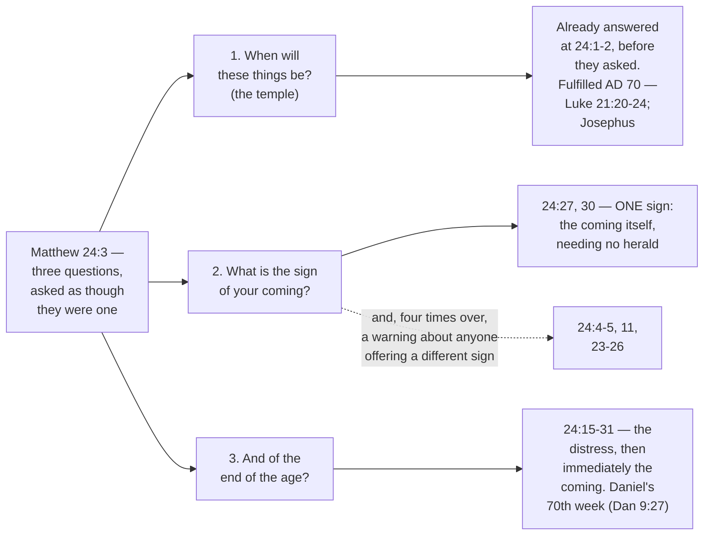
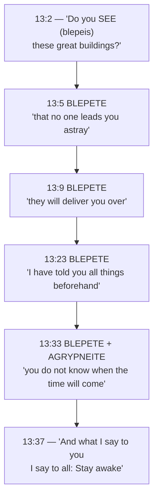
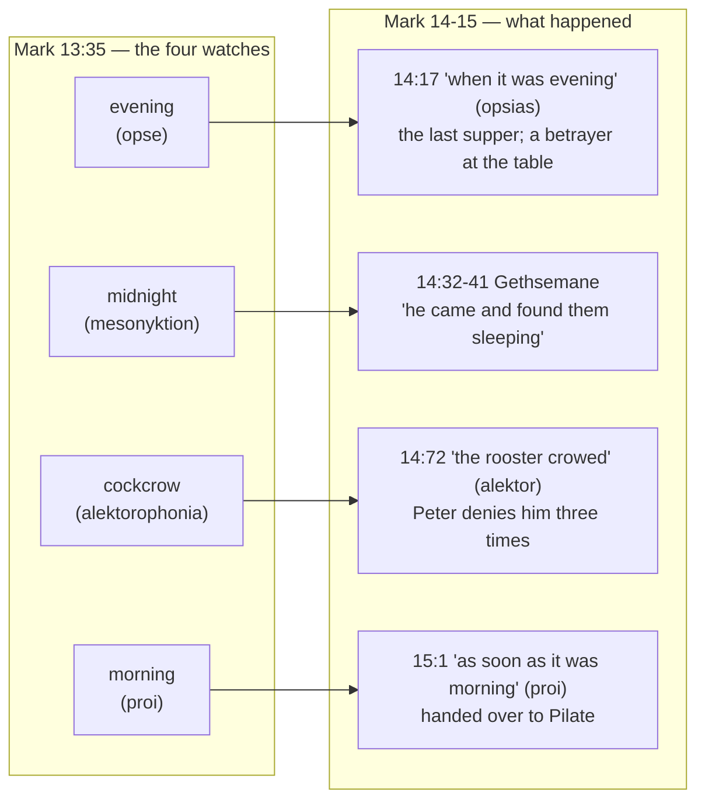

# The Olivet Discourse

Four men sat with Jesus on the Mount of Olives, looking back across the Kidron Valley at the temple
he had just told them would be levelled, and asked him for a sign. They were asking a question their
own world had a standard answer to: a list. Jewish writing across three centuries catalogues the
disasters expected before God finally acts, and the lists are strikingly consistent — see [What They
Expected](#what-they-expected-and-what-he-refused) for the texts. A teacher asked for the sign was
expected to produce the catalogue.

Jesus produced the list, and then took it away from them. Wars, famines, earthquakes: "all these are
but the beginning of the birth pains" (Matthew 24:8, ESV) — the beginning, and so not the sign. Four
separate times he warned them about anyone who would offer them one. Then he named a single sign, and
it was his own arrival, lighting the sky from one horizon to the other, needing no announcement from
anybody.

**In one sentence: the Father has fixed the day by His own authority, and Jesus, whose word about the
temple came true stone for stone, will come as the one sign nobody needs to point out — so you stay
awake at the work He gave you, and believe no one who claims to know the hour.** That is how Matthew
and Mark both build it, and it holds the discourse's three movements together: the age they were
about to live in, the distress that ends it, and the arrival no one will need pointing out.

## Key Takeaways

### Types & Prophecy

Daniel supplies the discourse's central term, the abomination of desolation, in three settings:
Antiochus IV Epiphanes' desecration of the altar in 167 BC (11:31), a coming ruler's desecration in
a final seven-year period (9:27), and a desolation measured in exact days still future to Daniel
(12:11). Jesus cites the term without saying which he means. Daniel's seventieth week (9:27) remains
unstarted, and the distress of 24:15-28 sits inside it.

### Lessons about Jesus

Jesus predicts a specific building's specific fate roughly forty years out, precisely enough that
Josephus's eyewitness account can be checked against it line by line. In the same breath he refuses
the one thing his disciples most wanted: "concerning that day or that hour, no one knows, not even
the angels in heaven, nor the Son, but only the Father" (Mark 13:32, ESV). See [The Day No One
Knows](#the-day-no-one-knows).

### Memory verses

> ✝️ [Matthew 24:35 (ESV)](https://www.blueletterbible.org/esv/Mat/24/35)
>
> 35 Heaven and earth will pass away, but my words will not pass away.

> ✝️ [Mark 13:37 (ESV)](https://www.blueletterbible.org/esv/Mar/13/37)
>
> 37 And what I say to you I say to all: Stay awake.

### Be Transformed

- **Think.** Not one of the discourse's imperatives asks you to calculate anything. Jesus gives his
  disciples something to do about the future, and arithmetic is not on the list — stay awake
  (Mark 13:37), do not be led astray (Matthew 24:4), endure (24:13), keep working at what you were
  given (24:45-46). Every imperative is about conduct in the meantime.
- **Attitude.** Peter drew the conclusion from all of it decades later: since everything visible is
  going to burn, the question is "what sort of people ought you to be in lives of holiness and
  godliness" (2 Peter 3:11, ESV) — a settled disposition, not anxious watching for signs.
- **Do.** Pick one of the four imperatives above and name where it currently applies to you — where
  you are being led astray, where endurance is actually costing you something, or what you were
  given to keep working at while you wait.

### Prayer

Father, you kept every word of this discourse's near half, down to a date on a calendar. Its far
half is still ahead and we do not know the day. Guard us from those who claim they do. Keep us
awake, working at what you gave us, until the sky itself announces your Son Jesus. In Jesus' name.
Amen.

## The Question Behind the Question

### The three questions

Jesus has just left the temple. A disciple points out the stonework — "Look, Teacher, what wonderful
stones and what wonderful buildings!" (Mark 13:1, ESV) — and Jesus answers with a demolition notice:
"Do you see these great buildings? There will not be left here one stone upon another that will not
be thrown down" (13:2, ESV). They cross the valley, climb the Mount of Olives, sit down opposite the
temple, and four of them ask him about it privately. Mark alone names them: "Peter and James and John
and Andrew" (13:3, ESV). Keep those names; they matter at the end of this study.

Mark and Luke record one question in two parts — when, and what sign (Mark 13:4; Luke 21:7). Matthew
records three:

> ✝️ Matthew 24:3 (ESV)
> 3 As he sat on the Mount of Olives, the disciples came to him privately, saying, "Tell us, when
> will these things be, and what will be the sign of your coming and of the end of the age?"

*The Temple Mount seen from the Mount of Olives, across the Kidron Valley — the sightline Jesus and
the four disciples had while he spoke. (The gold dome is the seventh-century Dome of the Rock, not
Herod's temple; the platform and the valley are the same ground.) Photo:
[brionv](https://www.flickr.com/photos/brionv/6035890417/), [CC BY-SA
2.0](https://creativecommons.org/licenses/by-sa/2.0/), via Wikimedia Commons.*

Three questions, joined by *and*, asked as though they were one. Behind that grammar is an
assumption: that the temple's destruction, Messiah's arrival, and the end of the age are a single
event. If the temple fell, God's own house had been abandoned, and what could follow that except the end of everything?

Jesus's answer takes the question apart. The temple's fall he had already answered before they asked
it — "there will not be left here one stone upon another" — and Luke records the prophecy in plain
siege language that came true within forty years. The coming gets a different kind of answer
altogether: one sign, unmissable, unschedulable. And the end of the age turns out to sit at the far
side of a stretch of time the disciples did not know was there. This shows that God orders history on
His own timetable and that Jesus answers His disciples truthfully: you are told what you need in
order to obey, and the Father keeps the rest.

### One conversation, three records

Matthew's disciples asked about the *parousia*
(παρουσία, *parousia*, Strong's G3952) by name — the word appears at 24:3, 27, 37 and 39, and nowhere
in Mark's or Luke's version — and Matthew's account is correspondingly the one that runs on into
chapter 25's parables.

The three accounts are one conversation recorded three times, with the same illustrations in the same
order. What differs is what each writer's readers needed:

| | Matthew 24 | Mark 13 | Luke 21 |
|---|---|---|---|
| Who asks | "the disciples" | Peter, James, John, Andrew (13:3) | unspecified |
| The question | timing, *and* the sign of the *parousia* and the end of the age (24:3) | timing and sign (13:4) | timing and sign (21:7) |
| The sign of the end | Daniel's "abomination of desolation" (24:15) | the same Danielic phrase (13:14) | "Jerusalem surrounded by armies" (21:20) |
| Structural spine | four warnings against deception (24:4, 5, 11, 24) | four times βλέπετε (13:5, 9, 23, 33) | — |
| "No one knows... nor the Son" | 24:36 | 13:32 | absent |
| One taken, one left | 24:40-41 | absent | absent here (parallel at 17:34-35) |
| "Times of the Gentiles" | absent | absent | 21:24 |
| Parables of readiness | 24:45 – 25:46 | 13:34-37 only | absent |

## What They Expected, and What He Refused

### The list Jesus inherited

The list Jesus gives in 24:4-8 is not original to him. The *NIV Cultural Backgrounds Study Bible*
notes that "many Jewish thinkers offered lists of sufferings, which they sometimes called the 'birth
pangs' of the Messiah or of the new world; these sufferings would precede the end of the age" (note
on Matthew 24:6-14). Wars, international conflict, famine, earthquake, apostasy — the list would have
sounded entirely familiar to the four men listening.

Then he does something with it that the same note calls out: "in contrast to many other Jewish
thinkers, he identifies the events listed here as merely 'the beginning of birth pains'," and he
"will answer the question about the sign of his coming (v. 3) with a single sign at his coming
(v. 30)." The disciples asked for a checklist. Jesus handed the checklist back, relabelled.

### Birth pangs: Scripture's own image

**The image he relabelled it with is Scripture's own.** The prophets already use birth pangs for the
distress preceding God's decisive act — Isaiah 13:8 and 26:17, Jeremiah 6:24, Micah 4:9-10, Hosea
13:13 — which is why neither Jesus nor Paul stops to explain it. ὠδίν (*ōdin*, G5604) occurs four
times in the New Testament: here and in the Markan parallel (Matthew 24:8; Mark 13:8), of the agony
of death in Peter's Pentecost sermon (Acts 2:24), and in Paul's own day-of-the-Lord passage — "sudden
destruction will come upon them as labor pains come upon a pregnant woman, and they will not escape"
(1 Thessalonians 5:3, ESV).

The metaphor does exactly the work Jesus needs. Labour pains are a real signal that something is
coming and a famously unreliable guide to when. A woman in early labour knows the birth is real; she
does not know the hour. That is the epistemic position he puts his disciples in, and it is the
opposite of a timetable.

### Jewish witnesses to the expectation

Alongside Scripture, and clearly distinct from it, sits a body of **Jewish writing that is not
Scripture** but tells us what people in that world expected. Three witnesses, three centuries apart,
show how fixed the habit of listing was:

| | Date | The catalogue |
|---|---|---|
| *Jubilees* 23:13, 19 | c. 150 BC, found at Qumran | "calamity follows on calamity... famine, and death, and sword, and captivity"; "the young [strive] with the old" |
| *2 Baruch* 27:2-7 | c. a generation after AD 70 | Twelve numbered parts — "the beginning of commotions... famine and the withholding of rain... earthquakes and terrors" |
| *m. Sotah* 9:15 | Mishnah, c. AD 200 | "In the footsteps of the messiah insolence will increase... 'a man's own household are his enemies' (Micah 7:6)" |

Two details earn their place. *2 Baruch*'s order — commotions, famine,
earthquakes — is Matthew 24:6-7's order. And the Mishnah's closing quotation is Micah 7:6, the verse
behind Matthew 24:10's mutual betrayal, which Jesus had already turned on himself at 10:35-36.

### To the disciples, in the second person

What follows the list in Matthew is addressed directly to the disciples, in the second person:

> ✝️ Matthew 24:9-13 (ESV)
> 9 "Then they will deliver you up to tribulation and put you to death, and you will be hated by all
> nations for my name's sake. 10 And then many will fall away and betray one another and hate one
> another. 11 And many false prophets will arise and lead many astray. 12 And because lawlessness
> will be increased, the love of many will grow cold. 13 But the one who endures to the end will be
> saved."

The question was "when." The answer, so far, is: you will be hated, you will be betrayed by each
other, love will cool, and your job is to endure. Mark makes the same turn even more sharply at
13:9 — "be on your guard. For they will deliver you over to councils, and you will be beaten in
synagogues, and you will stand before governors and kings for my sake, to bear witness before them"
(ESV). The disciples asked about the calendar and Jesus answered about their own coming suffering.

He said it to four men Mark names (13:3), and within a day of hearing "the one who endures to the
end will be saved," those same men "all left him and fled" (Mark 14:50, ESV). Whatever endurance
they later showed was not native to them. It was the grace of God, and the endurance Jesus commands
of you is the endurance He supplies.

## "See That No One Leads You Astray"

### The four warnings, escalating

The first words out of Jesus's mouth in reply are a warning about deception, the discourse's most
repeated note.

πλανάω (*planaō*, "lead astray, deceive," G4105) occurs eight times in Matthew's Gospel. Four of the
eight are in this discourse — 24:4, 24:5, 24:11 and 24:24 — and those four are the only Matthean uses
carrying the sense of misleading somebody (Louw-Nida domain 31.8).
Every time Matthew's Jesus warns about someone deceiving others, he is on the Mount of Olives.

The four warnings escalate. First a general caution: "See that no one leads you astray" (24:4). Then
the mechanism: "many will come in my name, saying, 'I am the Christ,' and they will lead many astray"
(24:5). Then the professionals: "many false prophets will arise and lead many astray" (24:11). Then
the worst case:

> ✝️ Matthew 24:23-26 (ESV)
> 23 Then if anyone says to you, "Look, here is the Christ!" or "There he is!" do not believe it.
> 24 For false christs and false prophets will arise and perform great signs and wonders, so as to
> lead astray, if possible, even the elect. 25 See, I have told you beforehand. 26 So, if they say to
> you, "Look, he is in the wilderness," do not go out. If they say, "Look, he is in the inner rooms,"
> do not believe it.

### Wilderness and inner rooms

Both locations are pointed. Some Jewish groups of the period expected deliverance to begin in the
wilderness (*NIV Cultural Backgrounds Study Bible*, note on Matthew 24:26) — the Qumran community had
gone there on that principle, and Josephus records more than one wilderness messianic movement in the
decades before the war. "Inner rooms" is the opposite error: a private, insider revelation available
to those in the know. Jesus rules out both the public movement and the secret one, and he rules them
out on a single ground, given in the next verse: "For as the lightning comes from the east and shines
as far as the west, so will be the coming of the Son of Man" (24:27, ESV).

That is the answer to question two. Nobody has to point lightning out to you. If someone has to tell
you the Messiah has come, that fact alone disproves the claim. This shows that God has made His Son's
return public by design: Jesus will come the way lightning comes, so no movement, teacher or private
revelation stands between you and Him, and none of them is owed your belief.

### Mark's structural spine: watch

Mark builds his whole account on this. βλέπετε (*blepete*, "watch out, be on guard," G991) is Mark's
structural spine, and it lands at 13:5, 13:9, 13:23 and 13:33 — all four coded by Louw-Nida as
*beware* (27.58) rather than ordinary seeing. Mark sets it up with a play on the same verb: the
discourse opens with Jesus asking "Do you *see* (βλέπεις) these great buildings?" (13:2). You see the
buildings. Now watch out.

The *ESV Study Bible* reads Mark the same way: "Jesus gives this entire discourse about the end times
so that the disciples will be on guard (vv. 5, 9, 23)... Instead of speculating about the specific
timing of end-time events, all disciples are to be vigilant" (note on Mark 13:33-37).

## AD 70: Question One, Answered and Documented

The first of the three questions can be closed here, because its answer is history. Jesus predicted *this* temple's destruction before they asked
anything — "there will not be left here one stone upon another" (24:2) — and Luke had recorded the
same prophecy in plainer terms days earlier, weeping as he approached the city: "the days will come upon you, when your enemies will set up a barricade around you and surround
you and hem you in on every side and tear you down to the ground, you and your children within you.
And they will not leave one stone upon another in you" (Luke 19:43-44, ESV).

### The external record: Josephus and Eusebius

Josephus, a Jewish priest who watched the siege from the Roman side, records the temple burning on
"the tenth day of the month Lous [Ab]," noting that this was the same calendar date on which "it was
formerly burnt by the king of Babylon" (*Wars of the Jews* 6.4.5, Whiston). After the city fell, Titus
"gave orders that they should now demolish the entire city and temple," which was "so thoroughly laid
even with the ground by those that dug it up to the foundation, that there was left nothing to make
those that came thither believe it had ever been inhabited" (*Wars* 7.1.1).

A flight out of the city has its own record. Eusebius reports that
"the people of the church in Jerusalem had been commanded by a revelation, vouchsafed to approved men
there before the war, to leave the city and to dwell in a certain town of Perea called Pella"
(*Ecclesiastical History* 3.5.3). They left, and they lived.

Eusebius attributes the command to that oracle. Tying the Pella departure to Matthew 24:16 is a
reasonable inference, since these people knew what Jesus had said about fleeing Judea, but the
sources do not make it for us.

## The Sign, the Flight, and the Distress

### The abomination of desolation

Verse 15 turns a corner. Up to verse 14 Jesus has described what the whole age between his going and
his coming will be like — deception, war, famine, persecution, endurance. From verse 15 he describes
one particular period of distress, and the *ESV Study Bible* marks the same break: "Jesus moves from
the general characteristics of this age to describe the 'great tribulation' (vv. 15-28) that will
precede the coming of the Son of Man (vv. 29-31)" (note on 24:15-31).

The signal is Daniel's: "when you see the abomination of desolation spoken of by the prophet Daniel,
standing in the holy place" (Matthew 24:15, ESV; near-identical at Mark 13:14). Daniel uses the image
(Hebrew שִׁקּוּץ מְשׁוֹמֵם, *shiqqutz meshomem*, "an abomination that
appals") in three settings — Antiochus's historical desecration of 167 BC (11:31), a future ruler's
desecration at the midpoint of a seven-year covenant (9:27), and a desolation measured at 1,290 days
(12:11).

Jesus names the term without saying which he means, and the *ESV Study Bible* reads the citation as
reaching to more than one: the complete fulfilment "will be found in (1) the Roman destruction of the
temple in A.D. 70 and (2) the image of the Antichrist being set up in the last days" (note on 24:15).
This study follows that reading — with the weight on the second, since verse 29 has the Son of Man
arriving *immediately after* the distress this section describes, and that did not happen in 70.

Luke is the reason the first fulfilment can be held with any confidence, because Luke does not use
Daniel's coded phrase at all. Where Matthew and Mark have the abomination, Luke has the literal
referent: "when you see Jerusalem surrounded by armies, then know that its desolation has come near"
(Luke 21:20, ESV), followed by the city falling "by the edge of the sword" and its people "led
captive among all nations" (21:24). That is a plain description of AD 70, and it was fulfilled.

### Flee — practical instructions

Then the instructions, which are startlingly practical:

> ✝️ Matthew 24:16-20 (ESV)
> 16 then let those who are in Judea flee to the mountains. 17 Let the one who is on the housetop not
> go down to take what is in his house, 18 and let the one who is in the field not turn back to take
> his cloak. 19 And alas for women who are pregnant and for those who are nursing infants in those
> days! 20 Pray that your flight may not be in winter or on a Sabbath.

### What each instruction meant

Each line is culturally loaded, and the *NIV Cultural Backgrounds Study Bible* unpacks them:

- **"Flee to the mountains" is counterintuitive advice.** "During invasions, people usually crowded
  into walled cities for protection, but Jesus warns against that measure in this case" (note on
  24:16). The instinct of every Judean under attack was to get inside Jerusalem's walls. Jesus tells
  them the walls are the trap.
- **The housetop.** Roofs were flat and lived on — drying vegetables, praying, talking to neighbours —
  and reached by an external stair, so going down *into* the house costs a detour (note on 24:17).
  Do not take it.
- **The cloak.** Field workers left the outer garment at the edge of the field as the day warmed.
  That garment "was so important that it was the one item that a creditor could not seize from a
  debtor overnight" (note on 24:18) — the law itself protects it: "for that is his only covering, and
  it is his cloak for his body; in what else shall he sleep?" (Exodus 22:27, ESV). It is the last
  possession the Torah guarantees a poor man. Jesus says leave it in the field.
- **Winter and Sabbath.** Judean winter is the rainy season; dry wadis flood, roads turn to mud, and
  the Jordan rises. Josephus records Judean fugitives in AD 68 trapped by the flooded Jordan and
  killed by their pursuers (*Wars* 4.433). On a Sabbath, Jerusalem's gates would be shut (note on
  24:20).

### First-century furniture, timeless substance

It is evacuation advice: which way to run, what not to go back for, and what weather to pray
against.

The specificity cuts both ways, and it is the best argument for reading these verses of AD 70 and
nothing else. Shut Sabbath gates, an outside stair, a cloak left at the edge of a field — that is
first-century Judean furniture, and a flight two thousand years later would not obviously need any of
it. Jesus is speaking to first-century men in the furniture of their own
world, and the substance of the order — go, go now, do not go back for anything, not even the one
possession the law says nobody can take from you — transfers to any flight from any city.

Where the long interval before verse 15 sits, and why verse 29's "immediately" leaves no gap after
the distress, is worked through against Daniel 9:24-27 in a separate study, *Immediately After*
(in preparation).

## The One Sign: The Son of Man Comes

Cosmic signs, and then the sign. The vocabulary is the Old Testament's for the day of the LORD:
"the sun will be darkened, and the moon will not give its light, and the stars will fall from heaven"
(24:29) tracks Isaiah's oracle against Babylon almost word for word (Isaiah 13:10) and Joel's "the sun
shall be turned to darkness, and the moon to blood, before the great and awesome day of the LORD
comes" (Joel 2:31), the passage Peter quoted at Pentecost (Acts 2:20).

Then: "they will see the Son of Man coming on the clouds of heaven with power and great glory"
(24:30, ESV), which draws on Daniel's throne room — "with the clouds of heaven there came one like a
son of man... and to him was given dominion and glory and a kingdom" (Daniel 7:13-14, ESV). The title
Jesus has used of himself throughout the discourse comes from that verse.

Revelation opens by quoting the same sentence back: "he is coming with the clouds, and every eye will
see him... and all tribes of the earth will wail on account of him" (Revelation 1:7, ESV) against
Matthew's "all the tribes of the earth will mourn, and they will see the Son of Man coming on the
clouds of heaven" (24:30). Clouds, universal visibility, mourning tribes, in that order.

### The gathering Jerusalem refused

One verb ties the return back to the lament Matthew placed one chapter earlier. At the return, the
angels "will gather his elect from the four winds" (24:31) — ἐπισυνάγω (*episynagō*, "gather
together," G1996). Jesus had used that same verb, twice in one sentence, weeping over the city a day
or two before:

> ✝️ Matthew 23:37 (ESV)
> 37 "O Jerusalem, Jerusalem, the city that kills the prophets and stones those who are sent to it!
> How often would I have gathered your children together as a hen gathers her brood under her wings,
> and you were not willing!"

Twice in Matthew: what he wanted to do for Jerusalem and was refused (23:37), and what he will do at
his return (24:31). The gathering he was not permitted to give the city, he performs from the four
winds. This shows the heart of God in Jesus: the Son of Man who comes with power and great glory is
the same Jesus who wept over Jerusalem, and His return is an act of gathering. You can long for the
One who is coming, because He has longed to gather His people all along.

### The mountain he was sitting on

Jesus delivers all of this sitting on the Mount of Olives, "opposite the temple" (Mark 13:3) — the
hillside Zechariah names for the LORD's return: "on that day his feet shall stand on the Mount of
Olives that lies before Jerusalem on the east... Then the LORD my God will come, and all the holy ones
with him" (Zechariah 14:4-5, ESV), on a day when the LORD "will go out and fight against those
nations" (14:3). Jesus does not quote Zechariah 14 here; the link is geographic. He describes his
return while sitting on the ground it lands on.

Luke, the one writer who carries both this discourse and its sequel, closes the loop. Acts records
the ascension from "the mount called Olivet" (1:12), with two angels attaching the promise: "this
Jesus, who was taken up from you into heaven, will come in the same way as you saw him go into
heaven" (Acts 1:11, ESV). Same author, same mountain, three times over: the discourse, the departure,
and the promise of the return.

## The Day No One Knows

The fig tree (24:32-33) and "this generation" (24:34) are worked through in a separate study, *The
Fig Tree and This Generation* (in preparation).

### "Concerning that day and hour"

Immediately after the fig tree and the generation saying, Jesus closes the door on the disciples'
original question:

> ✝️ Matthew 24:36 (ESV)
> 36 "But concerning that day and hour no one knows, not even the angels of heaven, nor the Son, but
> the Father only."

That sentence raises a real question about Christ's own knowledge, worked through in [The Day No One
Knows](../jesus/the-day-no-one-knows.md): the textual variant, the two natures, and the popular claim
that Jesus was quoting a Jewish wedding idiom.

The short of it is that the verse is about **whose the date is**, not about what the Son is capable of
knowing. Asked the same question again after the resurrection, when no question of incarnational
limitation is in view, he answered the same way and named the reason: "it is not for you to know times
or seasons that the Father has fixed by his own authority" (Acts 1:7, ESV). This is the sovereignty
of God over history: the Father has fixed the day and kept it for Himself, so you can leave it with
Him and give your attention to what He has given you to do.

### Why the discourse tells them this

Jesus draws the conclusion himself. He follows this verse with Noah, with the two in the field, and then with the imperative the
whole chapter has been building toward: "therefore, stay awake, for you do not know on what day your
Lord is coming" (24:42, ESV). The unknown date is the reason the church is told to be
ready.

### What "ready" actually means

**"Ready" is easily heard as watchfulness for an arrival, and that is not mainly what the parables
measure.** Ἕτοιμος ("ready",
Strong's G2092) turns up at 24:44 and again of the virgins who "were ready" at 25:10 — and only that
second parable is about anticipating the moment. The other three are about being answerable. The
faithful servant is "set over his household, to give them their food at the proper time" (24:45), and
is blessed if the master "will find so doing when he comes" (24:46) — found *doing the job*, not
found looking out of a window. The master of the talents "came and settled accounts with them"
(25:19). The nations are separated on what they did and failed to do for "the least of these my
brothers" (25:40). In three of the four, readiness is a record, not a posture, and it is made of
conduct toward other people. So you get ready for Jesus' return the way the faithful servant did, by
feeding the household He has put in your care.

All four parables are worked through in [The
Parables of the Olivet Discourse](olivet-discourse-parables.md).

## One Taken, One Left

Matthew's Noah illustration ends in the discourse's most contested sentence: "Then two men will be in
the field; one will be taken and one left. Two women will be grinding at the mill; one will be taken
and one left" (24:40-41, ESV).

This saying is routinely quoted in popular teaching as proof of a pretribulational rapture — taken
equals rescued, left equals abandoned. That reading runs against the Noah illustration it completes
and against Luke's own answer to "where?" The case for a pretribulational rapture rests on other
texts entirely — 1 Thessalonians 4:13-18, John 14:1-4, the restrainer of 2 Thessalonians 2:6-7 — and
is made at length in [The Rapture of the Church](rapture.md). It neither needs this verse nor is
damaged by it.

The verbs, Noah's flood and Luke's vultures are worked through in a separate study, *One Taken,
One Left* (in preparation).

## "What I Say to You I Say to All: Stay Awake"

### The four watches

Mark closes the discourse with a short parable and a command:

> ✝️ Mark 13:33-37 (ESV)
> 33 Be on guard, keep awake. For you do not know when the time will come. 34 It is like a man going
> on a journey, when he leaves home and puts his servants in charge, each with his work, and commands
> the doorkeeper to stay awake. 35 Therefore stay awake—for you do not know when the master of the
> house will come, in the evening, or at midnight, or when the rooster crows, or in the morning—
> 36 lest he come suddenly and find you asleep. 37 And what I say to you I say to all: Stay awake.

The four times named are the Roman night watches — "the four three-hour periods into which the Romans
divided the night" (*NIV Biblical Theology Study Bible*, note on Mark 13:35). Jesus lists them because
the point is that any one of them will do; a doorkeeper does not get to pick which watch to be awake
for.

### The watches fulfilled: Mark's own narrative

Then Mark does something with those four watches. Within a chapter, his own narrative walks through
all four, in order — and at each one, the men who were told to stay awake do not.

Three of the four are lexical matches. Mark 13:35's ὀψέ answers to ὀψία at 14:17; ἀλεκτοροφωνία
("cockcrow") answers to ἀλέκτωρ at 14:72; and πρωΐ at 15:1 is the identical word in the identical
Louw-Nida sense as 13:35. The midnight watch is positional rather than verbal — μεσονύκτιον occurs
only once in Mark, at 13:35 — but its slot in the sequence is Gethsemane, and Gethsemane is where the
command is put to the test by name.

### The same command, tested that same night

γρηγορέω (*grēgoreō*, "stay awake," G1127) occurs six times in Mark. Three of them are the end of the
discourse (13:34, 35, 37). The other three are Gethsemane:

> ✝️ Mark 14:34, 37-38 (ESV)
> 34 And he said to them, "My soul is very sorrowful, even to death. Remain here and watch."...
> 37 And he came and found them sleeping, and he said to Peter, "Simon, are you asleep? Could you not
> watch one hour? 38 Watch and pray that you may not enter into temptation. The spirit indeed is
> willing, but the flesh is weak."

Same verb. Same mountain: Gethsemane "means 'oil press,' indicating a garden area among the olive
groves on the Mount of Olives" (*ESV Study Bible*, note on Matthew 26:36) — the discourse and its
test happen on the same hill, one at the top and one at the foot. Same men: Mark 13:3 named Peter,
James, John and Andrew as the ones who asked the
question, and Mark 14:33 takes Peter, James and John into the garden. Hours, not years, separate the
command from the failure. Jesus said "lest he come suddenly and find you asleep" (13:36); Mark writes
"he came and found them sleeping" (14:37), and then twice more.

Mark is showing his readers what the command costs,
using the only three men who had the chance to obey it that same night, and failed while their Lord
was a stone's throw away in agony. Anyone reading Mark 13:37 — "what I say to you I say to all" — and
feeling secure about their own watchfulness has one chapter to go before that confidence is tested.
Jesus kept the men He found asleep, and the endurance they later showed came from Him. That is grace,
and it is yours on the same terms: stay awake, and when you find you have slept, return to your Lord
and keep watching.

The discourse's answer to "when?" is therefore not a date, and not really an argument. It is a job.
Matthew makes the same turn by following 24:44 with four parables of servants who were and were not
ready when the master arrived; those are treated in [The Parables of the Olivet
Discourse](olivet-discourse-parables.md). Luke states the posture in a sentence: "when these things
begin to take place, straighten up and raise your heads, because your redemption is drawing near"
(21:28, ESV).

Peter and Paul carried this discourse's verbs and images into 2 Peter 3 and 1 Thessalonians 5; that
trail is followed in a separate study, *Heaven and Earth Will Pass Away* (in preparation).

## Discussion Questions

1. The disciples asked for a sign, and their culture expected a checklist. Jesus demoted the whole
   list to "the beginning of the birth pains" and gave one sign — his own arrival. What does that do
   to the way end-times signs are commonly discussed today?
2. Four times Jesus warns about being led astray, and the most dangerous deceivers are the ones
   performing "great signs and wonders" (24:24). Why would convincing signs be the mark of a false
   messiah rather than a true one, in a discourse where the true sign needs no interpreter?
3. Read Matthew 24:16-20 alongside the cultural notes above. Jesus tells a man not to go back for the
   one possession the law guarantees him. What does the urgency of these instructions suggest about
   how literally he expected to be taken?
4. Mark ends the discourse with "Stay awake," and one chapter later the same three men are asleep in
   Gethsemane. What is Mark asking his reader to conclude — about the disciples, and about the
   reader?

## References & Recommended Reading

- ESV Study Bible (Crossway) — verse text (ESV) and notes on Mark 11:12-21, Mark 13:33-37, Matthew
  24:36 (the two natures and Chalcedon) and Matthew 26:36, quoted briefly with attribution.
- NLT Life Application Study Bible (Tyndale) — note on Mark 13:32 (the verse's emphasis falling on
  the Father's prerogative rather than on the Son's knowledge), quoted briefly with attribution.
- *Mishnah Rosh Hashanah* 2:6-7 (the examination of the new-moon witnesses, and the court declaring
  the month sanctified) — quoted from **"Mishnah Yomit" translated by Dr. Joshua Kulp, licensed
  CC-BY**, retrieved through `references/build/sefaria.py`. Sefaria's default English for the Mishnah
  is the CC-BY-NC William Davidson Edition, which this site avoids quoting.
- NIV Cultural Backgrounds Study Bible / NKJV Cultural Backgrounds Study Bible (Zondervan) — notes on
  Matthew 24:6-14 (Jewish "birth pangs" lists), 24:16-20 (flight, housetop, cloak, winter and
  Sabbath), 24:26 (wilderness expectation), 24:28 (carrion imagery), 24:31 (trumpet), and 24:41 (the
  shared courtyard mill), quoted briefly with attribution.
- NIV Biblical Theology Study Bible (Zondervan) — note on Mark 13:35 (the Roman night watches),
  quoted briefly with attribution.
- Flavius Josephus, *The Wars of the Jews*, trans. William Whiston — Book 4.433 (the flooded Jordan),
  Book 6.4.5 (the temple's burning), Book 7.1.1 (the city's demolition).
- Eusebius of Caesarea, *Ecclesiastical History* 3.5.3 (the Pella tradition), NPNF2 translation via
  ccel.org.
- *Jubilees* 23:11-25, *2 Baruch* 27:2-7 (the twelve-part list of woes) — English texts from this
  repo's `scrollmapper-bible-databases-deuterocanonical` source set, public domain. Cited as
  extra-biblical witnesses to Jewish expectation, never as Scripture.
- *Mishnah Sotah* 9:15 ("in the footsteps of the messiah"), trans. Dr. Joshua Kulp, **CC-BY**,
  retrieved through `references/build/sefaria.py`.
- MACULA Greek morphology and Louw-Nida semantic domains (open license) — occurrence and domain data
  for πλανάω, βλέπω, γρηγορέω, ὠδίν, παρέρχομαι, ἐπισυνάγω, κλέπτης, γενεά, παραλαμβάνω, ἀφίημι.
- Photograph of the Temple Mount from the Mount of Olives by brionv, via Wikimedia Commons,
  [CC BY-SA 2.0](https://creativecommons.org/licenses/by-sa/2.0/).
- [The Rapture of the Church](rapture.md) — the pretribulational case, which rests on texts other
  than "one taken, one left."
- [The Parables of the Olivet Discourse](olivet-discourse-parables.md) — the faithful servant, the
  ten virgins, the talents, and the sheep and the goats.
- [Israel and the Church](../israel-and-church/israel-and-the-church.md) — why Daniel's seventy weeks
  are counted over Israel and Jerusalem, not the church.
