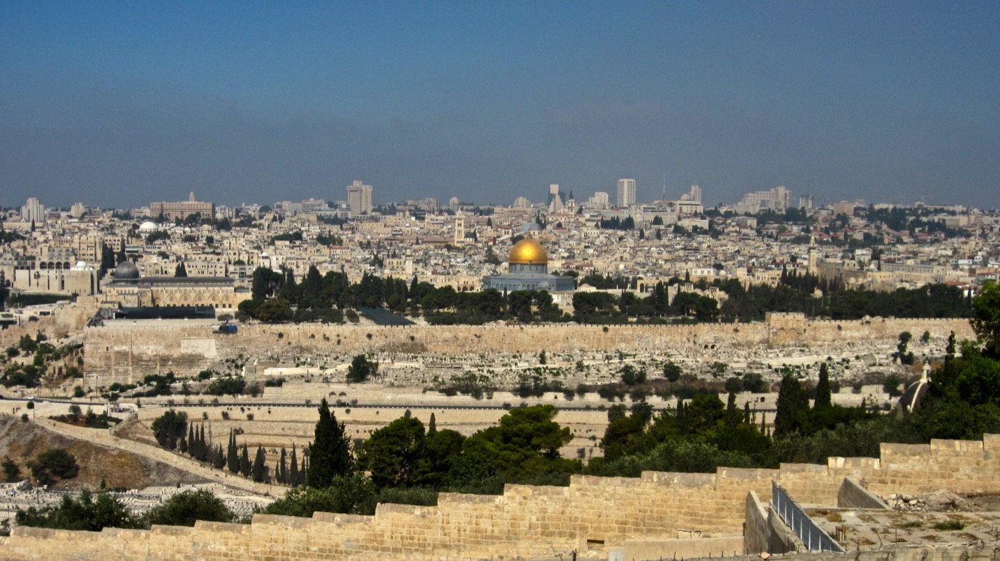
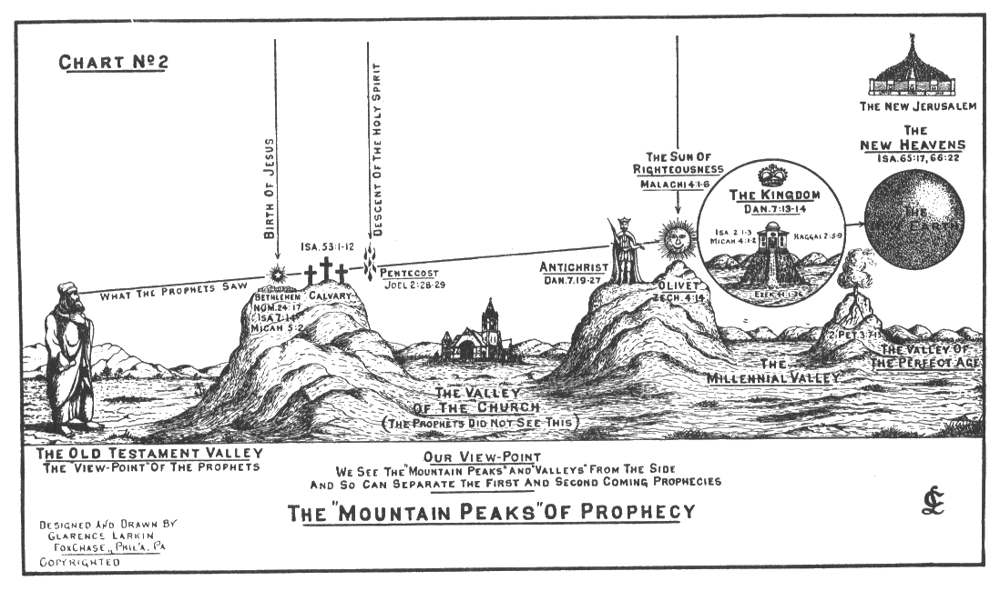
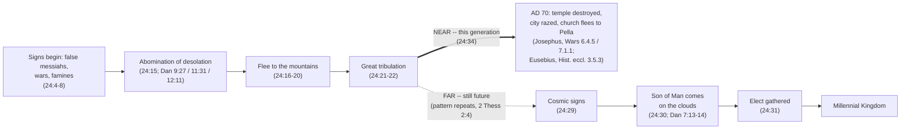

# The Olivet Discourse

Four men ask Jesus a private question on a hillside, and the answer runs to two full chapters in
Matthew, one in Mark, and one in Luke — three accounts of a single conversation that never once
agree on exactly what to include. Matthew keeps a saying Luke doesn't have. Luke keeps a phrase
Matthew doesn't have. All three keep the one sentence that started it: not one stone here will be
left on another. **The differences between the three accounts are not disagreements about what
Jesus said — they are three authors making different, traceable choices about which parts of one
long answer their own readers needed**, and reading those choices side by side is what actually
exposes the discourse's structure: a near horizon that arrived within a lifetime, verified against
Josephus, and a far horizon that has not arrived yet.

## Key Takeaways

### Types & Prophecy

Daniel gives the discourse's central term three times, in three settings: Antiochus IV Epiphanes'
historical desecration of the altar in 167 BC (11:31), a coming ruler's desecration during a final
seven-year period (9:27), and a desolation measured in exact days still future to Daniel himself
(12:11). Jesus cites the term without specifying which — a choice examined below, in [The Temple's
Destruction](#the-temples-destruction-prophecy-and-fulfillment) — and the discourse itself lands on
the Mount of Olives, the same site Zechariah 14:4 names for the LORD's own future return to fight
for Jerusalem.

### Lessons about Jesus

Jesus predicts a specific structure's specific fate roughly forty years out, in a form precise
enough that Josephus's own account of AD 70 can be checked against it verse by verse — see [The
Temple's Destruction](#the-temples-destruction-prophecy-and-fulfillment). He also declines to know
what he could, by his own account, have claimed: "concerning that day or that hour no one
knows... nor the Son, but only the Father" (Mark 13:32, ESV). The same discourse that displays his
authority over history states the limit he accepted on his own knowledge of it.

### Memory verses

"Heaven and earth will pass away, but my words will not pass away" (Matthew 24:35, ESV) — see [Time
Periods in View](#time-periods-in-view-near-and-far). "Concerning that day or that hour no one
knows... nor the Son, but only the Father" (Mark 13:32, ESV) — see above.

### Be Transformed

The discourse's own instruction for its still-future half is not calculation but readiness: "stay
awake, for you do not know on what day your Lord is coming" (Matthew 24:42, ESV). That cuts both
ways against a comfortable reading. It rules out date-setting — the very thing "no one knows... not
even the Son" forecloses — and it rules out treating the far horizon as someone else's problem
because a near horizon already came and went. Readiness in view of a still-future coming, not
speculation about its date, is what the text itself asks for.

### Prayer

Father, you kept every word of this discourse's near half exactly as your Son spoke it, down to a
date on the Roman calendar. Its far half is still ahead, and we do not know the day. Keep us from
guessing at what you have not told us, and keep us ready for what you have promised. Amen.

## Setting the Scene

Both Mark and Luke put the same story immediately before the discourse: a poor widow puts two small
coins into the temple treasury, "out of her poverty," having "put in all that she had to live on"
(Luke 21:1-4, echoing Mark 12:41-44) — a gift Jesus commends over every larger one just given, on the
strength of the heart behind it rather than its size (Mark 12:43; Luke 21:3, "Truly, I say to you,
this poor widow put in more than all of them"). Luke places her immediately after Jesus has just
told the crowd to "beware of those scribes... who devour widows' houses" (20:47) — a contrast between
the scribes, indicted, and the widow, commended, not a comment on her gift itself; the *NIV Biblical
Theology Study Bible* reads the same juxtaposition: "a poor widow's offering exemplifies how the
Jewish religious leaders 'devour widows' houses'... because they misuse the temple and its funds,
judgment is imminent" (note on Luke 21:1-4). The disciples then admire the temple's stones and gifts
(Luke 21:5), or the buildings generally (Mark 13:1) — and Jesus's answer is that none of it will
stand. Matthew's approach is different: his immediately preceding material is Jesus's lament over the
city itself — "Jerusalem, Jerusalem, who kills the prophets and stones those who are sent to her...
your house is left to you desolate" (Matthew 23:37-38, WEB) — so Matthew arrives at the temple's fate
already primed by a lament over the city that houses it, where Mark and Luke arrive by way of a
contrast between exploitative leaders and a widow's genuine devotion, both inside the same
institution Jesus is about to condemn.

All three then agree on the physical setting: Jesus has just left the temple (Matthew 24:1, Mark
13:1), the prediction is made — "there will not be left here one stone on another, that will not be
thrown down" (Matthew 24:2, WEB; matched almost word for word in Mark 13:2 and Luke 21:6) — and the
discussion continues "on the Mount of Olives" (Matthew 24:3, Mark 13:3), a hillside directly
across the Kidron Valley from the temple mount, close enough that the buildings under discussion are
still in view.

*The Temple Mount seen from the Mount of Olives, across the Kidron Valley — the same sightline Jesus
and the four disciples had while he spoke. (The gold-domed structure is the seventh-century Dome of
the Rock, not Herod's temple; the platform and the valley between are the same ground.) Photo:
[brionv](https://www.flickr.com/photos/brionv/6035890417/), [CC BY-SA
2.0](https://creativecommons.org/licenses/by-sa/2.0/), via Wikimedia Commons.*

Only Mark names who is present: "Peter and James and John and Andrew asked him privately" (Mark
13:3, ESV) — the same inner circle, minus none, that appears together nowhere else in the
Gospels quite this way. Matthew and Luke both say only "the disciples" (Matthew 24:3) or leave the
audience for the question unstated beyond "they asked him" (Luke 21:7). This is not a discrepancy;
Mark simply preserves a detail neither of the other two thought their readers needed.

The question itself has one further asymmetry worth tracking through the rest of the discourse.
Mark and Luke record a single question, essentially "when will this happen, and what will be the
sign?" (Mark 13:4, Luke 21:7) — asking only about the temple's fall. Matthew records two: "when will
these things be? What is the sign of your coming, and of the end of the age?" (Matthew 24:3, WEB).
Matthew's disciples ask about the temple's destruction *and* about Christ's own coming and the
end of the age, as though the two were the same question — and Matthew's version of the discourse,
uniquely among the three, goes on to answer both at length, including the parables in chapter 25 that
have no parallel in Mark or Luke's version of this discourse at all.

## Same Discourse, Three Witnesses

Every element that follows the setting appears, in some form, in at least two of the three accounts:
false messiahs, wars and rumors of wars, earthquakes and famines described as the beginning of
"birth pains" (Matthew 24:8, Mark 13:8), persecution of the disciples themselves, a warning to flee
Judea for the mountains when a specific sign appears, unprecedented distress, cosmic signs in sun,
moon, and stars, the Son of Man coming with power and great glory, a fig tree lesson about
recognizing nearness from a sign, and the flat statement that "this generation will not pass away
until all these things are accomplished" (Matthew 24:34, Mark 13:30, Luke 21:32 — nearly identical
wording in all three). That degree of shared, specific structure — not just shared topic, but the
same illustrations in the same order — is what marks this as one discourse recorded three times,
not three separate speeches that happen to cover similar ground.

Two features are Matthew-only. Matthew alone records the disciples asking about Christ's *parousia*
(παρουσία, Strong's G3952) by name — the term appears at 24:3, 24:27, 24:37, and 24:39, and nowhere
in Mark's or Luke's version of this discourse. Mark and Luke instead simply describe the Son of Man
"coming" (ἔρχομαι), the ordinary verb. *Parousia* went on to become the New Testament's standard
technical term for the second coming outside the Gospels — 1 Thessalonians 4:15, 2 Thessalonians
2:1, James 5:7-8, 2 Peter 3:4, 1 John 2:28 all use it — which makes Matthew's version, not Mark's or
Luke's, the discourse's actual point of contact with how the epistles later talk about this event.
Matthew alone also records the Noah illustration's continuation into "one will be taken and one
left" (24:40-41) — treated in full below.

Luke, in turn, keeps three things neither Matthew nor Mark records in this discourse: an explicit
statement that Jerusalem will fall "by the edge of the sword" and its people "led captive into all
the nations" (21:24), the phrase "the times of the Gentiles" for the period that follows, and a
direct application — "when these things begin to take place, look up and lift up your heads, because
your redemption is near" (21:28) — that neither Matthew nor Mark's parallel material states this
plainly. All three agree that persecution is coming and that a generation will see all of it, but
only Luke commits to a description of the city's fall in the plain language of military conquest
rather than left implicit in Daniel's coded phrase.

## What Each Account Keeps, Compresses, or Leaves Out

| Element | Matthew 24 | Mark 13 | Luke 21 |
|---|---|---|---|
| Audience named | "the disciples" | Peter, James, John, Andrew (13:3) | "they" (unspecified) |
| The question | dual: timing *and* sign of the *parousia*/end of the age (24:3) | single: timing and sign (13:4) | single: timing and sign (21:7) |
| Gospel preached to all nations first | 24:14 | 13:10 | absent |
| Sign of the end | "abomination of desolation... standing in the holy place" (24:15, quoting Daniel) | same Danielic phrase (13:14) | "Jerusalem surrounded by armies" (21:20), plain language |
| "This generation" saying | 24:34 | 13:30 | 21:32 |
| "No one knows the day or hour... nor the Son" | 24:36 | 13:32 | absent |
| Noah illustration / "one taken, one left" | 24:37-41 | absent | absent (parallel exists at Luke 17:26-35, different setting) |
| "Times of the Gentiles" | absent | absent | 21:24 |
| Parables of watchfulness (ten virgins, talents, sheep and goats) | 25:1-46 | absent | absent |

Two absences are worth reading correctly rather than as gaps. Mark's version is the shortest of the
three not because Mark knew less, but because Mark's Gospel consistently compresses Jesus's long
discourses in favor of narrative pace — the same pattern shows up in how briefly Mark handles the
parables in chapter 4 compared to Matthew 13. Luke's absence of the "no one knows... nor the Son"
statement and of the Noah/taken-left material is different in kind: both are present in Luke's
Gospel, just not in this discourse. The "no one knows the day" theme surfaces at Acts 1:7 ("it is not
for you to know times or seasons"), and the taken/left saying has its own, differently-set parallel at
Luke 17:26-35, examined below. Luke has both ideas; he simply does not repeat them a second time
inside chapter 21.

## Time Periods in View: Near and Far

Matthew's dual question — "when will these things be?" and "what is the sign of your coming and of
the end of the age?" (24:3) — sets up a discourse that answers on two timescales.

### The Hinge at Verse 29

The hinge between the two timescales is Matthew 24:29: "immediately after the tribulation of those
days the sun will be darkened" (ESV). Everything before that verse — false messiahs, wars, famines,
persecution, the abomination of desolation, flight to the mountains, unprecedented distress — is the
near horizon. Everything from that verse on — cosmic signs, the Son of Man visibly coming on the
clouds, the angels gathering the elect — is the far horizon, and Matthew's own grammar ties it to the
near horizon's *end*, not to some open interval after it: the far horizon begins the moment the near
one's distress is over.

### The Fig Tree's Own Lesson

Jesus gives his own instruction for reading that timing immediately after: "from the fig tree learn
its lesson: as soon as its branch becomes tender and puts out its leaves, you know that summer is
near. So also, when you see all these things, you know that he is near, at the very gates" (Matthew
24:32-33, ESV; matched in Mark 13:28-29 and Luke 21:29-31). All three call it a *parable* — and the
comparison Jesus states is between two acts of recognition, not between the tree and some future
entity: as leaves let you infer summer, so "all these things" — the near-horizon signs just
described — let you infer that "he is near." The parable's own point is method, not identity.

That distinction matters because a popular reading goes further than the text does: that the fig
tree symbolizes the nation of Israel specifically, so that its "putting out leaves" points to a
datable event — usually Israel's 1948 restatement as a nation, sometimes 1967's reunification of
Jerusalem — which then anchors "this generation will not pass away" to a calculable window from that
date. The move imports meaning the parable's own grammar doesn't supply: Jesus explains what the
fig tree illustrates ("even so you also, when you see all these things, know...") and the explanation
is about recognizing nearness from observed signs in general, not about the tree standing for a
specific nation. Treating the species of tree as the coded content — rather than the stated
comparison — is exactly the move the parable genre warns against: resist allegorizing an incidental
detail the text itself doesn't unpack.

A better-grounded fig-tree connection sits three days earlier in the same week, not in 24:32 itself.
Monday of that week, Jesus curses a leafy, fruitless fig tree on the way into Jerusalem — "may no
fruit ever come from you again... and the fig tree withered at once" (Matthew 21:19, ESV) — the same
day he clears the temple, and Mark structures the two episodes as one bracketed unit: fig tree cursed
(11:12-14), temple cleared (11:15-19), the withered fig tree found and discussed (11:20-25), a
sequence the ESV Study Bible reads as deliberate, "suggest[ing] a connection between the cleansing of
the temple and the cursing of the fig tree" (note on Mark 11:12-21). That note also grounds the
symbolism in the Old Testament's own usage: "in the OT the fig tree often serves as a metaphor for
Israel and its standing before God (e.g., Jer. 8:13; Hos. 9:10, 16; Joel 1:7)... the cursing of the
fig tree signifies the judgment of God on the 'fruitless' Jewish people" (note on Mark 11:13-14). The
disciples who hear "from the fig tree learn its lesson" on Tuesday had cursed and confronted a fig
tree with them two days before. But the two images run in opposite directions rather than being the
same symbol reused: Monday's tree is barren and judged; Tuesday's illustration is a tree budding
toward summer, a sign of approach rather than of failure. What carries over is the tree itself and
the temple's fate as the shared subject, not a single, stable meaning attached to "fig tree"
wherever it appears in these chapters.

### "This Generation"

The phrase that fixes the near horizon's own timing is "this generation will not pass away until all
these things are accomplished" (Matthew 24:34, Mark 13:30, Luke 21:32). Matthew's own Gospel uses
"this generation" (γενεά αὕτη) eight other times, and every one of them names Jesus's own
contemporaries: "an evil and adulterous generation" (12:39), "this generation" that will be judged
alongside Nineveh and the queen of the South (12:41-42), and — one paragraph before this discourse
begins — "all these things will come upon this generation" (23:36, ESV), spoken of the very people
who had just been charged with killing the prophets. Louw-Nida's own domain coding for the word at
24:34 carries both a group sense (10.4, 11.4) and a time sense (67.144) simultaneously, which is
the honest state of the lexicon: γενεά can mean either a kinship group or a time-bounded cohort of
people living together. What settles it here is not the lexicon but Matthew's own consistent
practice — eight-for-eight elsewhere, always his contemporaries, never a "race" that persists across
centuries. Read that way, "this generation will not pass away" fixes the near horizon — the events
of verses 4-28 — to something that had to begin, and substantially occur, within the lifetime of the
people standing on the Mount of Olives that day. It does not, by the same grammar, claim that the far
horizon beginning at verse 29 happens within that window; verse 29 places the far horizon
*immediately after* the near one's distress ends, which only requires the near horizon itself to have
started on schedule.

### A Precedent for Reading It This Way

That near/far structure without a marked gap is not unique to this discourse. Jesus does the same
thing, more starkly, at Luke 4:18-19: reading Isaiah 61:1-2 in the Nazareth synagogue, he stops
mid-sentence, before "and the day of vengeance of our God" — the clause naming the far horizon — and
says only "today this Scripture has been fulfilled in your hearing" (Luke 4:21) about the clause
naming the near one. Isaiah's own sentence runs the two together without marking the distance between
them; Jesus reads only as far as the part then being fulfilled. The Olivet Discourse runs the same
two horizons together in a single flowing description — near events in verses 4-28, far events from
verse 29 — without Jesus flagging where one stops and the other starts any more explicitly than
Isaiah did.

Clarence Larkin drew the same phenomenon as a landscape: an Old Testament prophet, standing in his
own moment, sees two mountain peaks — the first and second comings — lined up one behind the other,
with the valley between them (the church age) hidden entirely from that angle. "We see the 'mountain
peaks' and 'valleys' from the side, and so can separate the first and second coming prophecies" —
something the prophets' own straight-on viewpoint could not do.

Mapped onto this discourse's own two horizons rather than Larkin's general first/second-coming
scheme, the same near/far shape looks like this — a solid arrow where the near horizon's own
fulfillment is dated and documented, a dashed arrow where the pattern repeats but hasn't happened
yet:

The branch point is Daniel's own abomination-of-desolation image doing double duty, as [The Temple's
Destruction](#the-temples-destruction-prophecy-and-fulfillment) works out below: Antiochus's real,
historical desecration in 167 BC, a coded citation Jesus applies to a near, dated AD 70 fulfillment,
and Daniel 9:27's own still-unfulfilled "prince who is to come" waiting on the far side of the same
image.

## Word Study: One Taken, One Left

In Matthew 24, Jesus is talking with four disciples. In Luke 17, Jesus is talking to the pharisees.
In both they have asked Jesus when the kingdom of heaven will come. Both looking for the reign of the promised messiah.

Jesus answers both with a vision of one being left and another taken. Both accounts in the context of 
judgement and salvation runniing parrallel. In the time of Noah spared from the flood, and Lot and his family saved from the
destruction, by fire, of the cities of the plain (Sodom and Gommorah).

Matthew's Noah illustration continues into the discourse's single most contested sentence: "then two
men will be in the field; one will be taken and one left. Two women will be grinding at the mill; one
will be taken and one left" (24:40-41, ESV). The verbs are παραλαμβάνεται (*paralambanetai*, "is
taken," from παραλαμβάνω, Strong's G3880) and ἀφίεται (*aphietai*, "is left," from ἀφίημι, G863).
Louw-Nida codes both under domain 15 — physical movement — rather than under any domain for
punishment or rescue: lexically, neither verb carries a built-in verdict about whether being "taken"
is good news or bad. Whatever verdict the sentence carries has to come from its context, not from the
words themselves.

The context is the illustration these verses complete. "As were the days of Noah, so will be the
coming of the Son of Man... they were unaware until the flood came and swept them all away
[ἦρεν, from αἴρω, a different verb from *paralambanō*], so will the coming of the Son of Man be"
(24:37-39, ESV). In that illustration, the ones removed are the wicked, swept away by the flood; the
one left behind, on the earth, preserved through the judgment, is Noah. If the two-men-in-a-field
saying continues the same picture, "taken" maps to removal in judgment and "left" maps to
preservation — the reverse of a popular reading that treats "taken" as rescue.

Luke's parallel, spoken in a different setting on the journey to Jerusalem (Luke 17:22-37), uses the
identical verb pair — παραλημφθήσεται / ἀφεθήσεται, future tense of the same two roots — at 17:34-35,
and there the disciples ask directly, "Where, Lord?" Jesus answers: "where the corpse is, there the
vultures will gather" (17:37, WEB) — the same image Matthew places earlier in his own account, at
24:28, attached there to the *visibility* of Christ's coming rather than to this saying. Carrion
imagery is not rescue imagery; vultures gather over the dead, and Luke's placement of that answer
directly after "one taken, one left" reads as an answer to where the taken ones end up, not where
they're spared to.

Against that reading stands one real counterweight: *paralambanō* is used positively elsewhere,
including by Jesus himself — "I will come again and will take you [παραλήμψομαι] to myself, that
where I am you may be also" (John 14:3, ESV). The word can carry either sense; only its immediate
setting decides which. In Matthew 24, that setting is the *post*-tribulation, visible coming just
introduced two verses earlier at 24:29-31 — the angels already sent to "gather his elect from the
four winds" (24:31) — not a separately-timed event Matthew's account never otherwise names. Read in
that setting, "taken" reads most naturally as removal in judgment at the events surrounding that
visible coming, and "left" as those who remain to enter the kingdom that follows it.

This saying is commonly cited in popular teaching as evidence for a pretribulational rapture — "taken
= raptured to safety, left = left behind for judgment" — but that reading runs against the Noah
illustration's own logic and against Luke's own placement of the vultures saying as its answer. The
case for a pretribulational rapture does not need this text and does not rest on it; it is built from
other passages — 1 Thessalonians 4:13-18, John 14:1-4, the restrainer's removal in 2 Thessalonians
2:6-7 — treated at length in [The Rapture of the Church](rapture.md). Whatever this saying means, it
answers a different question than that one does.

## The Temple's Destruction: Prophecy and Fulfillment

The phrase Matthew and Mark record — "the abomination of desolation... standing in the holy place"
(Matthew 24:15, ESV; near-identical at Mark 13:14) — is a direct citation of Daniel, and Daniel uses
the underlying image (Hebrew שִׁקּוּץ מְשׁוֹמֵם, *shiqqutz meshomem*, "an
abomination that appalls/desolates") in three distinct settings. At 11:31, it describes something
already history by Daniel's own reckoning's fulfillment: Antiochus IV Epiphanes profaning the
Jerusalem sanctuary in 167 BC, halting the daily sacrifice, and setting up a pagan altar in its place
— an event 1 Maccabees records happening exactly as Daniel had described it centuries earlier. At
9:27, the same image is attached to a future ruler — "the people of the prince who is to come shall
destroy the city and the sanctuary... he shall make a strong covenant with many for one week, and for
half of the week he shall put an end to sacrifice and offering... on the wing of abominations shall
come one who makes desolate" (Daniel 9:26-27, ESV) — a ruler from the same people who destroy the
city, which the prior verse already identifies as Rome by the time of Christ. At 12:11, the same
image is given an exact duration: "from the time that the regular burnt offering is taken away and
the abomination that makes desolate is set up, there shall be 1,290 days" (ESV). Jesus, in Matthew
24:15, cites the term without specifying which of the three he means — which is itself the
discourse's own signal that the image is not exhausted by a single fulfillment; the near fulfillment
below does not close the door Daniel 9 and 12 leave open for a further one.

Luke's own earlier, independent statement of the same prophecy is more exact about the mechanism of
that near fulfillment than either Matthew or Mark, and it comes even before the Mount of Olives
conversation, as Jesus approaches Jerusalem in the triumphal entry: "the days will come upon you,
when your enemies will set up a barricade around you and surround you and hem you in on every side
and tear you down to the ground, you and your children within you. And they will not leave one stone
upon another in you, because you did not know the time of your visitation" (Luke 19:43-44, ESV) —
weeping as he says it (19:41). That is a description of a siege, stated plainly, roughly 40 years
before the event.

The fulfillment is dated and documented. Josephus, a Jewish priest who witnessed the siege from the
Roman side, records the temple catching fire on "the tenth day of the month Lous [Ab]... although
these flames took their rise from the Jews themselves, and were occasioned by them" — noting that
this was the same calendar date on which "it was formerly burnt by the king of Babylon" (*Wars of the
Jews* 6.4.5, Whiston translation). Once the city fell, Josephus records Titus's order: "Caesar gave
orders that they should now demolish the entire city and temple... it was so thoroughly laid even
with the ground by those that dug it up to the foundation, that there was left nothing to make those
that came thither believe it had ever been inhabited" (*Wars of the Jews* 7.1.1) — a direct,
independently-dated fulfillment of "there will not be left here one stone on another" (Matthew 24:2).

The warning to flee has its own separate historical record. Eusebius, writing around AD 312, reports
that "the people of the church in Jerusalem had been commanded by a revelation, vouchsafed to
approved men there before the war, to leave the city and to dwell in a certain town of Perea called
Pella" (*Ecclesiastical History* 3.5.3) — the Jerusalem church relocating across the Jordan before
the Roman siege closed in, matching "let those who are in Judea flee to the mountains" (Matthew
24:16, Mark 13:14, Luke 21:21) with a documented, dated event rather than a general expectation.

Luke's plain-language version of the sign — "Jerusalem surrounded by armies" (21:20) rather than
Daniel's coded phrase — reads as Luke writing for readers who would not have caught a citation of
Daniel's apocalyptic image, giving them the literal referent instead of the coded one Matthew and
Mark preserve. Luke also alone states the aftermath: "Jerusalem will be trampled underfoot by the
Gentiles, until the times of the Gentiles are fulfilled" (21:24, ESV) — a period, not a moment.
Jerusalem passed from Roman to Byzantine to Muslim to Crusader to Ottoman to British control across
the nineteen centuries after AD 70, without a sovereign Jewish government over the city again until
1967 — and even that milestone is a marker within "the times of the Gentiles," not obviously its
close, since the phrase's own biblical background (the four-kingdom sequence of Daniel 2 and 7) frames
Gentile dominion over Jerusalem as ending only when "the God of heaven will set up a kingdom that
shall never be destroyed" (Daniel 2:44) at Christ's own return — the far horizon this discourse turns
to next.

## Still to Come

Everything from Matthew 24:29 onward, in all three accounts, describes something that has not yet
happened. This section works out what that still-future half actually contains, piece by piece,
rather than naming it in one sentence and moving on.

### The Visible Return Itself

Cosmic signs in sun, moon, and stars; the Son of Man "coming in a cloud with power and great glory"
(Luke 21:27); the angels gathering the elect "from the four winds" (Matthew 24:31). None of that
occurred in AD 70 — the temple fell, but no visible, glorious return of the Son of Man accompanied
it, which is exactly what the discourse's own near/far structure, above, predicts: verse 29's events
follow the near horizon's *distress*, not its calendar date, and nothing requires them to have landed
within "this generation" rather than immediately after whatever future tribulation finally completes
the pattern Daniel 9:27 and 12:11 describe.

The language for that still-future coming is drawn from the Old Testament's own vocabulary for "the
day of the LORD." "The sun will be darkened... the moon will not give its light, the stars will fall
from heaven" (Matthew 24:29) echoes Isaiah's oracle against Babylon almost verbatim — "the stars of
the sky and its constellations will not give their light. The sun will be darkened in its going out,
and the moon will not cause its light to shine" (Isaiah 13:10, WEB) — and Joel's "the sun will be
turned into darkness, and the moon into blood, before the great and terrible day of Yahweh comes"
(Joel 2:31, WEB), the same passage Peter quotes at Pentecost (Acts 2:20). "They will see the Son of
Man coming on the clouds of heaven with power and great glory" (Matthew 24:30) draws directly on
Daniel's throne-room vision: "with the clouds of heaven there came one like a son of man... and to
him was given dominion and glory and a kingdom, that all peoples, nations, and languages should serve
him; his dominion is an everlasting dominion" (Daniel 7:13-14, ESV) — the title "Son of Man" itself,
which Jesus uses of himself throughout this discourse, is drawn from that same verse. Revelation
later names the period this discourse calls "great tribulation" (Matthew 24:21) using the identical
Greek phrase with the definite article — "these are the ones coming out of the great tribulation [τῆς
θλίψεως τῆς μεγάλης]" (Revelation 7:14) — the same noun, the same modifier, the same specific referent
the two texts are describing as one thing.

Revelation gives this same event its own full scene, not just a shared vocabulary word. John sees
"heaven opened, and behold, a white horse, and he who sat on it is called Faithful and True... the
armies which are in heaven... followed him," with "KING OF KINGS AND LORD OF LORDS" written on his
robe and thigh (Revelation 19:11-16) — a public, military, visible return, not a private or spiritual
one, positioned in Revelation's own sequence at the close of the seal, trumpet, and bowl judgments
(chapters 6-18) and immediately before the millennial reign (20:1-6). Revelation's own opening line
about this coming is closer to a quotation of Matthew's than an echo: "he is coming with the clouds,
and every eye will see him... all the tribes of the earth will mourn over him" (Revelation 1:7, ESV)
against Matthew's "they will see the Son of Man coming on the clouds of heaven... and all the tribes
of the earth will mourn" (Matthew 24:30) — clouds, universal visibility, and mourning tribes, in the
same order, naming what the discourse's account leaves more general: not a coming *some* will
perceive, but one no one alive at the time will be able to miss. Positioned where it is in Revelation,
this return closes the seven-year week worked out next, not some open interval after the near
horizon's own distress — Daniel's own count gives that week its shape.

### Daniel's Seventieth Week

The abomination of desolation's own citation, worked out in [The Temple's
Destruction](#the-temples-destruction-prophecy-and-fulfillment), leaves one piece of Daniel 9:24-27
still unaccounted for on the far side of AD 70: the seventieth week itself. Daniel's own sequence,
read in order, is what generates the gap. Sixty-nine weeks (sevens of years, 483 years by the
standard count) run "from the going out of the word to restore and build Jerusalem to the coming of
an anointed one" (9:25, ESV); "after the sixty-two weeks" — that is, after all sixty-nine are
complete — "an anointed one shall be cut off and shall have nothing" (9:26), fulfilled at the
crucifixion. Only *after* that cutting off does the text turn to "the people of the prince who is to
come," who "destroy the city and the sanctuary" (9:26) — fulfilled in AD 70, as already worked out
above, by the Roman armies under Titus. The seventieth week's own beginning is tied to neither of
those events but to a separate, future one: "he shall make a strong covenant with many for one week,
and for half of the week he shall put an end to sacrifice and offering. And on the wing of
abominations shall come one who makes desolate" (9:27, ESV). Nothing in the text requires that
covenant to follow immediately on AD 70's destruction — the cutting off, the city's fall, and the
covenant are three sequential but separately-timed events in Daniel's own sentence, and only the
first two have occurred. The church age sits in exactly that structural gap: real, but not itself
named by Daniel's own count, which the text simply leaves open between "the city and the sanctuary"
falling and a still-future ruler's covenant.

That future ruler is "the prince who is to come" — drawn from "the people" who destroy Jerusalem in
9:26, i.e. Rome, which is why a dispensational reading looks for him from a future, revived form of
the same imperial line rather than treating "prince" as already identified in history. Paul names the
same figure without Daniel's title: "the man of lawlessness... who opposes and exalts himself against
every so-called god or object of worship, so that he takes his seat in the temple of God, proclaiming
himself to be God" (2 Thessalonians 2:3-4, ESV) — a future, personal desecration of a rebuilt temple
that reads as the seventieth week's own "abomination," set up at the covenant's midpoint exactly where
Daniel 9:27 places it. The seventieth week's full length — Daniel's remaining seven years — is itself
the "great tribulation" this discourse's near horizon only foreshadowed (see [Time Periods in
View](#time-periods-in-view-near-and-far) above): a real, dated AD 70 fulfillment of the *pattern*,
with the pattern's own complete, personal, temple-desecrating fulfillment still ahead of it.

### The Times of the Gentiles

Luke's own phrase for the intervening period — "Jerusalem will be trampled underfoot by the
Gentiles, until the times of the Gentiles are fulfilled" (21:24, ESV) — names a span, not a moment,
and Daniel supplies its own outer frame: a sequence of Gentile world-empires (Babylon, then
Medo-Persia, Greece, and Rome, per Daniel 2's statue and Daniel 7's four beasts) ending only when "the
God of heaven will set up a kingdom that shall never be destroyed, nor shall the kingdom be left to
another people. It shall break in pieces all these kingdoms and bring them to an end, and it shall
stand forever" (Daniel 2:44, ESV) — the same kingdom this discourse's own "Son of Man... given
dominion" (Daniel 7:13-14) inaugurates at his visible return. Jerusalem's political history since AD
70 fits inside that frame without closing it: continuous Gentile sovereignty over the city from Rome
through the Ottomans, a Jewish state re-established in 1948, Jerusalem itself reunified under Israeli
control in 1967 — real, watched milestones, but the text names the *kingdom's* arrival as the frame's
close, not a state's founding or a city's administrative control. This is also the better-grounded
place, rather than the fig tree of 24:32, to weigh 1948 and 1967 as signs: "the times of the Gentiles"
is a passage actually about Gentile political dominion over Jerusalem, which those dates concern
directly, where the fig tree's own comparison (see above) never mentions a nation or a government at
all.

### The Mount of Olives, Twice

One geographic detail belongs to the far horizon rather than the near one. Jesus delivers this entire
discourse sitting on the Mount of Olives, "opposite the temple" (Mark 13:3) — the same hillside
Zechariah names for the LORD's own return: "his feet shall stand on the Mount of Olives that lies
before Jerusalem on the east... then the LORD my God will come, and all the holy ones with him"
(Zechariah 14:4-5, ESV), on a day when "the LORD will go out and fight" for a besieged Jerusalem
(14:2-3). Jesus does not cite Zechariah 14 in the discourse; the connection is geographic, not a
quotation. But he gives his own last major discourse before the crucifixion, on the very ground
Zechariah names for his return, describing that same return.

Luke — the one Gospel writer who carries both this discourse and its sequel — closes that loop
explicitly rather than only geographically. His second volume records Jesus ascending from "the
mountain called Olivet, which is near Jerusalem" (Acts 1:12, WEB), with two angels giving the
promise in the same breath: "this Jesus, who was received up from you into the sky, will come back
in the same way as you saw him going into the sky" (Acts 1:11, WEB). The same author sets this
discourse on that mountain, then sets the ascension on it too, with the return promised on the spot
where it began. One further detail belongs to the same hillside rather than to prophecy at all:
Gethsemane, where Jesus goes within hours of finishing this discourse to pray before his arrest,
sits at the mountain's base and takes its name from the Hebrew for "oil press" (ESV Study Bible,
note on John 18:1-19:42) — the Anointed One, in anguish, at the foot of the mountain named for the
trees that supply anointing oil.

### What Still Waits

The angels "gather his elect from the four winds" at the visible return (Matthew 24:31) — the same
event Matthew's own next chapters dramatize as a judgment scene, the King separating "the sheep from
the goats" (25:31-46), preceded by three further parables of readiness for the same still-unscheduled
day. All four get their own full treatment in [The Parables of the Olivet
Discourse](olivet-discourse-parables.md), the direct destination of everything worked out in this
section: a still-future ingathering, at the end of a still-future week, closing a still-open span of
Gentile dominion, on the far side of a return this discourse describes but does not date.

## Discussion Questions

1. Luke replaces Daniel's coded "abomination of desolation" with plain language about armies
   surrounding the city. What does that choice suggest about who each Gospel was written for?
2. If "this generation" in Matthew 24:34 means Jesus's own contemporaries — consistent with how
   Matthew uses the phrase everywhere else in his Gospel — what does that require you to believe
   happened, and by when, in the events of verses 4-28?
3. Josephus records the temple's fire falling on the same calendar date tradition assigns to the
   first temple's destruction by Babylon. What does a fulfillment this exact do to how you read the
   discourse's still-future half?
4. The "one taken, one left" saying is popularly read as rescue. What in the Noah illustration itself
   pushes against that reading — and what does it change about the saying if "taken" means judgment
   rather than rescue?

## References & Recommended Reading

- ESV Study Bible (Crossway) — verse text (ESV) and cross-reference notes on Matthew 21, 24-25,
  Mark 11, 13, Luke 21, Daniel 9, and John 18, quoted briefly with attribution.
- NIV Biblical Theology Study Bible (Zondervan) — note on Luke 21:1-4 (the widow's offering set
  against the scribes' indictment), quoted briefly with attribution.
- Flavius Josephus, *The Wars of the Jews*, trans. William Whiston — Book 6, chapter 4, section 5
  (the temple's burning); Book 7, chapter 1, section 1 (the city's demolition).
- Eusebius of Caesarea, *Ecclesiastical History*, Book 3, chapter 5, section 3 (the Pella tradition),
  via the NPNF2 translation hosted at ccel.org.
- MACULA Greek/Hebrew morphology and Louw-Nida semantic domains (open license) — word data for
  παραλαμβάνω, ἀφίημι, γενεά, βδέλυγμα, ἐρήμωσις.
- Clarence Larkin, *Dispensational Truth* (1918/1920), "The 'Mountain Peaks' of Prophecy" — in the
  public domain in the United States; reproduced as hosted at preservedwords.com. See also
  [Charting End Times](prophecy-chart.md) for two further Larkin charts on this site.
- Photograph of the Temple Mount from the Mount of Olives by brionv, via Wikimedia Commons,
  [CC BY-SA 2.0](https://creativecommons.org/licenses/by-sa/2.0/).
- [The Rapture of the Church](rapture.md) — the pretribulational rapture argument this study
  deliberately does not rest on the "one taken, one left" saying.
- [The Parables of the Olivet Discourse](olivet-discourse-parables.md) — the ten virgins, the
  talents, and the sheep and the goats.
