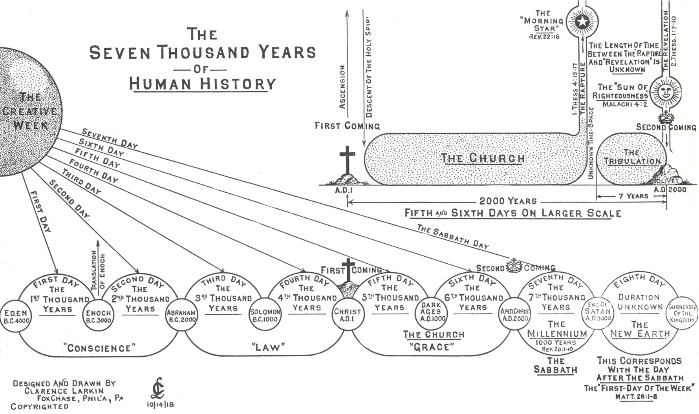
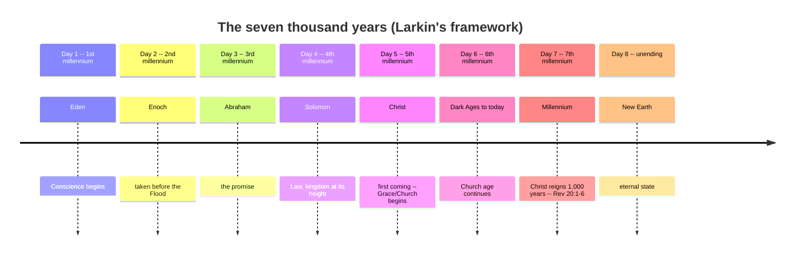
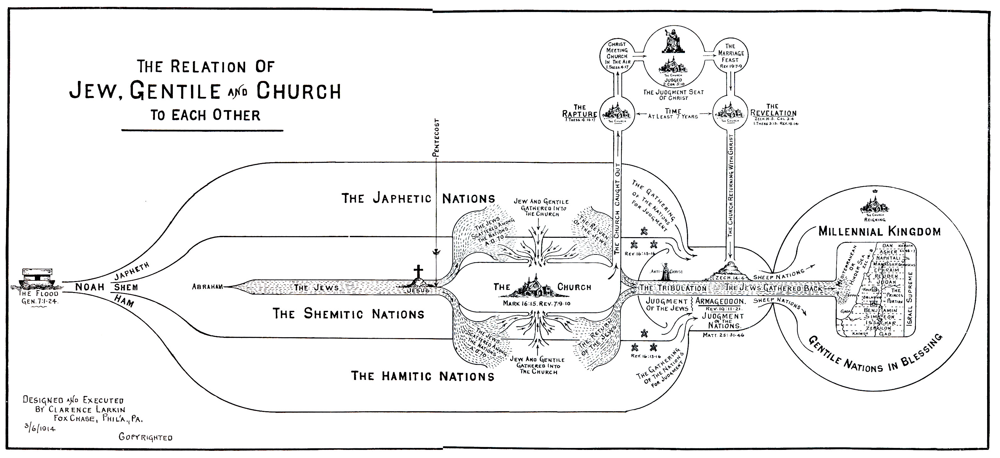
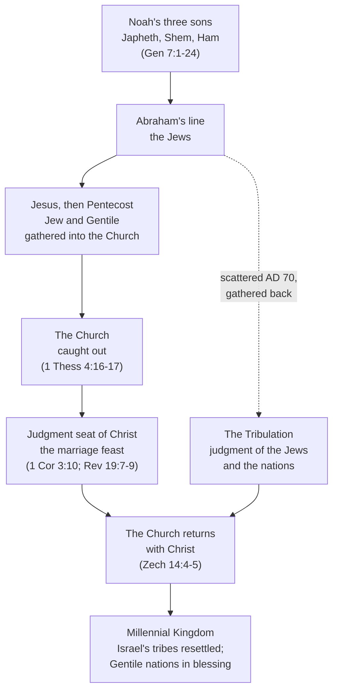

# Charting end times

Clarence Larkin (1850-1924) drew a series of large, hand-lettered charts working out the same
dispensational framework this site argues for in prose across
[Bible Prophecy Essentials](prophecy-essentials.md), [The Rapture of the Church](rapture.md), and
[The Day Is Near](day-is-near.md). Some of this material -- the whole sweep from creation to the
millennium, or how Jew, Gentile, and Church relate across that sweep -- is easier to see laid out
than to read paragraph by paragraph. Larkin's own charts are reproduced below; his *Dispensational
Truth* (1918/1920) is in the public domain in the United States. A mermaid diagram follows each one,
translating the same framework into a form this site's pages can link into directly, section by
section.

## The seven thousand years of human history

Larkin maps the creation week itself (Genesis 1:1-2:3) onto human history: six "days," each a
thousand years, followed by a seventh -- the same "day as a thousand years" reading (2 Peter 3:8)
worked out in full, loose ends included, in
[The Day Is Near](day-is-near.md#when-is-the-year-6000). Larkin's own labels divide the
six days into three broad eras -- **Conscience** (Eden to the Law, Genesis-Exodus), **Law** (Moses to
Christ), and **Grace**, his name for the Church age -- with the seventh day as **the Millennium**,
explicitly tied to the weekly Sabbath pattern (Exodus 20:11; Hebrews 4:9; Colossians 2:16-17), and an
eighth, open-ended "day" for the New Earth beyond it.

This site's own position, as against Larkin's chart: the *shape* -- six ordinary ages followed by a
Sabbath-like millennium -- is argued at length in [The Day Is Near](day-is-near.md). The specific
*calendar dates* Larkin prints (Eden at 4000 BC, Solomon at 1000 BC, and so on) are not this site's
settled chronology. [The Day Is Near](day-is-near.md#when-is-the-year-6000) leaves its own
creation-epoch arithmetic as an open discrepancy against
[The Zadok Calendar](../feasts/zadok-calendar.md) and [Bible Chronology & Genealogical
Time](genealogy-times.md); Larkin's numbers don't settle it.

## The relation of Jew, Gentile, and Church

Larkin's second chart answers a different question: how do Israel, the nations, and the Church
relate to each other across the same timeline, rather than just what order the ages come in. It
opens at the Flood, traces Noah's three sons into the Japhetic, Shemitic, and Hamitic nations, and
follows Abraham's line -- the Jews -- as a distinct thread running through and alongside "the
Church," gathered from Jew and Gentile alike at Pentecost (Mark 16:15; Revelation 7:9-10). The
Church is shown "caught out" at the rapture (1 Thessalonians 4:16-17) while the Jews scattered at
AD 70 are gathered back, the two threads converging through **the Tribulation** and its judgments
(Revelation 19:11-21; Matthew 25:31-46) into a single **Millennial Kingdom** -- Israel's tribes
resettled in the land, the Gentile nations "in blessing" alongside them.

Read together with [The Rapture of the Church](rapture.md) (which works out the Church's removal,
the tribulation's judgments, and the millennium verse by verse) and
[Bible Prophecy Essentials](prophecy-essentials.md#prophecy-yet-to-come) (which locates all of this
on Daniel's seventy-weeks timeline), Larkin's chart is a summary of arguments made in full elsewhere
on this site: a map for orienting yourself in those studies, not a standalone proof of any one claim
on it.

## References & Recommended Reading

- Clarence Larkin, *Dispensational Truth, or God's Plan and Purpose in the Ages* (Rev. Clarence
  Larkin Est., 1918/1920) -- source of both charts reproduced above; public domain in the United
  States.
- [Bible Prophecy Essentials](prophecy-essentials.md) -- the framework these charts summarize.
- [The Rapture of the Church](rapture.md) -- the tribulation, the judgments, and the millennium,
  argued in full.
- [The Day Is Near](day-is-near.md) -- the six-then-seventh chronological pattern behind the "seven
  thousand years" chart, including its open chronology discrepancy.
- [The Zadok Calendar](../feasts/zadok-calendar.md) and [Bible Chronology & Genealogical
  Time](genealogy-times.md) -- this site's chronology studies, which Larkin's printed dates above
  are checked against.
