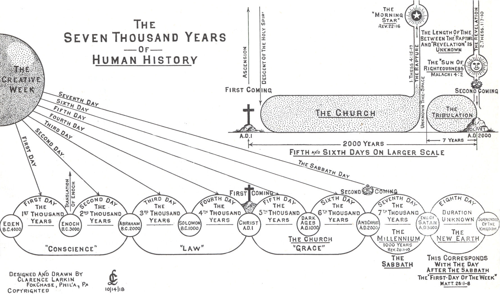
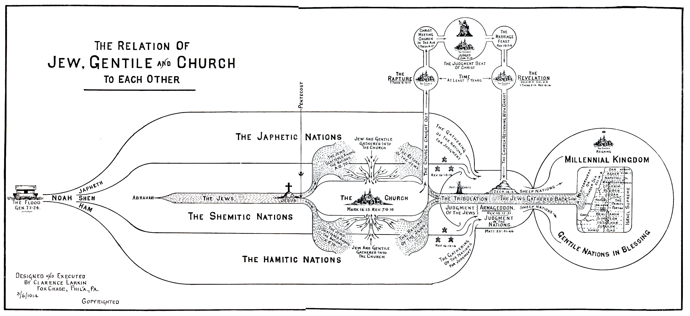
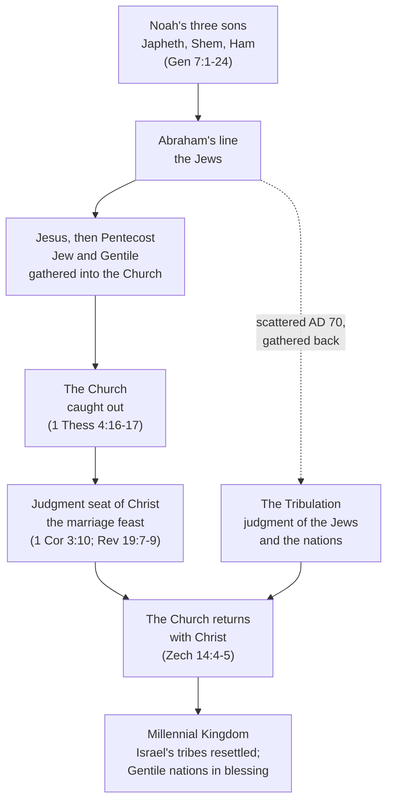

# Charting end times

Clarence Larkin (1850-1924) drew a series of large, hand-lettered charts working out the same
dispensational framework this site argues for in prose across
[Bible Prophecy Essentials](prophecy-essentials.md), [The Rapture of the Church](rapture.md), and
[A Day Is a Thousand Years](day-is-a-thousand-years.md). Some of this material -- the whole sweep from creation to the
millennium, or how Jew, Gentile, and Church relate across that sweep -- is easier to see laid out
than to read paragraph by paragraph. Larkin's own charts are reproduced below; his *Dispensational
Truth* (1918/1920) is in the public domain in the United States. After the first comes this site's own
redrawing of it on the site's chronology; after the second, a mermaid diagram of the same framework;
and the third, of the underworld, stands beside its redrawing.

## The seven thousand years of human history

Larkin maps the creation week itself (Genesis 1:1-2:3) onto human history: six "days," each a
thousand years, followed by a seventh -- the same "day as a thousand years" reading (2 Peter 3:8)
worked out in full, loose ends included, in
[A Day Is a Thousand Years](day-is-a-thousand-years.md#six-days-of-history). Larkin's own labels divide the
six days into three broad eras -- **Conscience** (Eden to the Law, Genesis-Exodus), **Law** (Moses to
Christ), and **Grace**, his name for the Church age -- with the seventh day as **the Millennium**,
explicitly tied to the weekly Sabbath pattern (Exodus 20:11; Hebrews 4:9; Colossians 2:16-17), and an
eighth, open-ended "day" for the New Earth beyond it.

This site's own position, as against Larkin's chart: the *shape* -- six ordinary ages followed by a
Sabbath-like millennium -- is argued at length in [A Day Is a Thousand Years](day-is-a-thousand-years.md). The specific
*calendar dates* Larkin prints (Eden at 4000 BC, Solomon at 1000 BC, and so on) are not this site's
settled chronology. This site's dates follow the Masoretic numbers on a 1446 BC Exodus: creation
at 3959 BC and the year 6000 in AD 2042, with the reasons in [Chronology
Anchors](chronology-anchors.md) and [A Day Is a Thousand Years](day-is-a-thousand-years.md#six-days-of-history).

The same seven days redrawn on this site's chronology, each event placed by its year, with the theme
[Six Days of History](six-days-of-history.md) reads in each day:

*Select the chart to open it full size.*

## The relation of Jew, Gentile, and Church

Larkin's second chart answers a different question: how do Israel, the nations, and the Church
relate to each other across the same timeline, rather than just what order the ages come in. It
opens at the Flood, traces Noah's three sons into the Japhetic, Shemitic, and Hamitic nations, and
follows Abraham's line -- the Jews -- as a distinct thread running through and alongside "the
Church," gathered from Jew and Gentile alike at Pentecost (Mark 16:15; Revelation 7:9-10). The
Church is shown "caught out" at the rapture (1 Thessalonians 4:16-17) while the Jews scattered at
AD 70 are gathered back, the two threads converging through **the Tribulation** and its judgments
(Revelation 19:11-21; Matthew 25:31-46) into a single **Millennial Kingdom** -- Israel's tribes
resettled in the land, the Gentile nations "in blessing" alongside them.

```mermaid
flowchart TD
    A["Noah's three sons<br/>Japheth, Shem, Ham<br/>(Gen 7:1-24)"] --> B["Abraham's line<br/>the Jews"]
    B --> C["Jesus, then Pentecost<br/>Jew and Gentile<br/>gathered into the Church"]
    C --> D["The Church<br/>caught out<br/>(1 Thess 4:16-17)"]
    B -.->|"scattered AD 70,<br/>gathered back"| E["The Tribulation<br/>judgment of the Jews<br/>and the nations"]
    D --> F["Judgment seat of Christ<br/>the marriage feast<br/>(1 Cor 3:10; Rev 19:7-9)"]
    F --> G["The Church returns<br/>with Christ<br/>(Zech 14:4-5)"]
    E --> G
    G --> H["Millennial Kingdom<br/>Israel's tribes resettled;<br/>Gentile nations in blessing"]
```

Read together with [The Rapture of the Church](rapture.md) (which works out the Church's removal,
the tribulation's judgments, and the millennium verse by verse) and
[Bible Prophecy Essentials](prophecy-essentials.md#prophecy-yet-to-come) (which locates all of this
on Daniel's seventy-weeks timeline), Larkin's chart is a summary of arguments made in full elsewhere
on this site: a map for orienting yourself in those studies, not a standalone proof of any one claim
on it.

## The underworld

=== "Larkin's original (1920)"

    

=== "Redrawn"

    [![Larkin's The Underworld, redrawn: Paradise and Hell as compartments of Hades either side of the Great Gulf, a dotted line over it marking that each side is seen and heard across and never crossed (Luke 16:23-26), Tartarus and the Abyss below them and the lake of fire apart; from the three crosses the souls of the penitent thief and of Christ go down to Paradise and the impenitent thief's soul to Hell, and the righteous souls rise with Christ as the first fruits; on the right the Harvest, the Gleanings seven years later and the Tares a thousand years after that. Larkin's labels in black, this site's verses in blue, and his Ephesians 4:8-10 caption boxed with a dashed line](../assets/img/last-things/larkin-underworld.svg)](../assets/img/last-things/larkin-underworld.svg)

Larkin's third chart turns from the ages to the dead: where the soul goes between death and the
resurrection. Paradise and Hell sit either side of the Great Gulf of Luke 16, with Tartarus, the
abyss and the lake of fire below them. The righteous rise from Paradise with Christ as "the first
fruits," and on the right the resurrections run out through the tribulation and the thousand years.

This site's own position, as against Larkin's chart: [At Home with the Lord](at-home-with-the-lord.md)
holds its conclusion, that the believing dead are now with Christ (2 Corinthians 5:8; Philippians
1:23), and names its caption, Ephesians 4:8-10, as the weak point, because two of the four study
Bibles consulted there read that descent as the incarnation. The two-compartment reading of Hades is
itself contested, and [Three Days and Three Nights](../jesus/three-days-and-three-nights.md#abrahams-side-paradise-and-the-great-chasm)
sets out the case for it and the disagreement. The redrawn chart keeps Larkin's labels in black and
adds, in blue, the verses At Home with the Lord rests each point on.

## References & Recommended Reading

- Clarence Larkin, *Dispensational Truth, or God's Plan and Purpose in the Ages* (Rev. Clarence
  Larkin Est., 1918/1920) -- source of all three charts reproduced above; public domain in the
  United States.
- [Bible Prophecy Essentials](prophecy-essentials.md) -- the framework these charts summarize.
- [At Home with the Lord](at-home-with-the-lord.md) -- where the believing dead are now, with the
  underworld chart set beside the argument section by section.
- [The Rapture of the Church](rapture.md) -- the tribulation, the judgments, and the millennium,
  argued in full.
- [A Day Is a Thousand Years](day-is-a-thousand-years.md) -- the six-then-seventh chronological pattern behind the "seven
  thousand years" chart.
- [The Zadok Calendar](../feasts/zadok-calendar.md) and [Bible Chronology & Genealogical
  Time](genealogy-times.md) -- this site's chronology studies, which Larkin's printed dates above
  are checked against.
