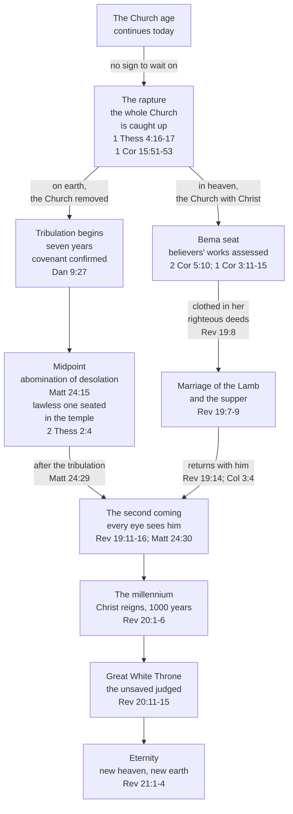

# The rapture of the Church

The *blessed hope* is the Church's expectation of being gathered to Christ before the world's final judgment falls.

One view holds that the rapture — the *harpazo*, "catching up" — is a distinct event from the second coming, separated by the seven-year tribulation; another holds that they are one event described in different terms. This study makes the case for the first, pretribulational and dispensational, as this site reads prophecy elsewhere (see [The Zadok Calendar](../feasts/zadok-calendar.md) and [The Day is Near](day-is-near.md)). The second gets its hearing under [Other end-times views](#other-end-times-views).

**In one sentence:** God will send His Son Jesus to catch His Church up bodily to Himself before the tribulation's wrath falls, a sudden and real rescue He has promised in His own word, so that you can meet grief and waiting with comfort.

## Key Takeaways

### Types & Prophecy

**Type.** Enoch, "taken" bodily before the Flood ever fell (Genesis 5:24; Hebrews 11:5), and Lot, physically removed from Sodom minutes before its judgment (Genesis 19:16, 24), pattern the rapture's own shape — removed *before* judgment, not carried through it like Noah. Peter names Noah and Lot together as one pattern of rescue (2 Peter 2:5-9), and Jesus applies Lot's day directly to his own return (Luke 17:28-30).

**Prophecy.** 1 Thessalonians 4:16-17 is a direct, first-time revelation — Paul explicitly calls it "a word from the Lord" (4:15) and "a mystery" at 1 Corinthians 15:51, not a truth already stated in the Old Testament and merely repeated here.

### Lessons about Jesus

- He comes for his own personally, not by proxy — "I will come again and will take you to myself" (John 14:3).
- His two returns serve two purposes: a quiet gathering of the Church, and a visible, public arrival with "the armies of heaven" (Revelation 19:11-16). The same person, two comings, two aims.

### Memory verses

> ✝️ [John 14:3 (ESV)](https://www.blueletterbible.org/esv/Joh/14/3)
>
> 3 And if I go and prepare a place for you, I will come again and will take you to myself, that
> where I am you may be also.

> ✝️ [1 Thessalonians 4:17 (ESV)](https://www.blueletterbible.org/esv/1Th/4/17)
>
> 17 Then we who are alive, who are left, will be caught up together with them in the clouds to
> meet the Lord in the air, and so we will always be with the Lord.

> ✝️ [1 Thessalonians 5:9 (ESV)](https://www.blueletterbible.org/esv/1Th/5/9)
>
> 9 For God has not destined us for wrath, but to obtain salvation through our Lord Jesus Christ.

### Be Transformed

- **Think.** Notice any temptation to treat the rapture's *timing* as more settled than Scripture presents it. The counter-argument named below, Revelation 3:10's ambiguity, is a live one, and a conclusion is only as strong as its handling of it.
- **Attitude.** 1 Thessalonians 4:18's whole point is comfort, not anxious calculation — "encourage one another with these words" is a command to bring grieving people hope, not to trade date-guesses.
- **Do.** Live daily with the readiness Matthew 25's parable calls for — prepared in advance, not scrambling when the moment comes (Matthew 25:1-13, [The Day Is Near](day-is-near.md)).

### Prayer

Lord, you promised to come again for your own, personally, not as an afterthought — thank you that the hope of being with you isn't vague reassurance but a specific promise, tied to your own word. Where I've let uncertainty about timing become anxiety instead of the comfort this was meant to be, correct that in me. Keep me ready the way the wise virgins were ready — not idle, not fearful, just prepared — until you come. In Jesus' name. Amen.

## The word behind "rapture": ἁρπάζω

The English word "rapture" doesn't translate anything directly — it comes from the Latin Vulgate's *rapiemur* ("we will be caught up"), itself a translation of the Greek verb used in [1 Thessalonians 4:17 (ESV)](https://www.blueletterbible.org/esv/1Th/4/17): **ἁρπάζω** (*harpazō*, pronounced har-PAD-zo, Strong's G726), "to seize, snatch, or catch away by force."

**Where the word comes from.** In classical and koine Greek, ἁρπάζω is ordinary language for forcible seizure — a wolf snatching prey, a robber seizing goods, a kidnapper taking a person against their will. Its core sense is *sudden, forceful removal*, and that sense carries through every New Testament use.

**How the New Testament uses it.** The word occurs 14 times. Most describe ordinary forceful
seizure. A wolf snatching sheep (John 10:12). A strong man's house being plundered (Matthew 12:29).
The word snatched away by the evil one before it takes root (Matthew 13:19). The violent "forcing"
of the kingdom (Matthew 11:12). A crowd about to seize Jesus to force him into kingship (John 6:15).
A mob trying to seize Paul (Acts 23:10). Someone snatched from the fire (Jude 1:23). No one can
*seize* the Father's sheep out of His hand (John 10:28-29) — the same force, turned into a promise
of security.

But four occurrences describe something more specific: a person suddenly, physically taken up into heaven or the heavenly realm.

- **[2 Corinthians 12:2-4 (ESV)](https://www.blueletterbible.org/esv/2Co/12/2-4)** — Paul describes himself (guardedly, in the third person) being "caught up" to the third heaven, into paradise — a real, momentary, involuntary experience, not something he did to himself.
- **[Acts 8:39 (ESV)](https://www.blueletterbible.org/esv/Act/8/39)** — after baptizing the Ethiopian eunuch, "the Spirit of the Lord carried Philip away" — an abrupt, physical relocation.
- **[Revelation 12:5 (ESV)](https://www.blueletterbible.org/esv/Rev/12/5)** — the male child (Christ) is "caught up to God and to his throne," His ascension described with the same verb.
- **[1 Thessalonians 4:17 (ESV)](https://www.blueletterbible.org/esv/1Th/4/17)** — "we who are alive, who are left, will be caught up together with them in the clouds to meet the Lord in the air."

**Conclusion.** Every time ἁρπάζω describes someone going to be with God, it describes a real, sudden, physical event. Paul chose that term in 1 Thessalonians 4:17, and it is the strongest lexical argument that the rapture is what it sounds like: a real, sudden, bodily gathering of the Church.

This shows that God gathers His people with the whole force the word carries: no one can snatch you out of His hand (John 10:28-29), and one day He will snatch you up to be with Jesus Himself.

## The promise: Christ returns for his own

> ✝️ [John 14:1-4 (ESV)](https://www.blueletterbible.org/esv/Joh/14/1-4)
>
> 1 "Let not your hearts be troubled. Believe in God; believe also in me. 2 In my Father's house are many rooms. If it were not so, would I have told you that I go to prepare a place for you? 3 And if I go and prepare a place for you, **I will come again and will take you to myself, that where I am you may be also.** 4 And you know the way to where I am going."

Christ is coming back *for His own*, personally, to take them where he is — stated as a promise before any sequence of events is worked out. Chuck Missler begins his own treatment of the "blessed hope" here for that reason.

This shows that God has tied your hope to a person: Jesus Himself is coming for you, so your heart need not be troubled (John 14:1).

## The call to rapture

Paul is answering a grief. Some Thessalonian believers had died since he taught the church about Christ's return, and the church seemed unsure whether they would share in it. The paragraph opens by naming exactly that concern: "we do not want you to be uninformed... about those who are asleep, that you may not grieve as others do who have no hope" (1 Thessalonians 4:13, ESV).

> ✝️ [1 Thessalonians 4:15-18 (ESV)](https://www.blueletterbible.org/esv/1Th/4/15-18)
>
> 15 For this we declare to you by a word from the Lord, that we who are alive, who are left until the coming of the Lord, will not precede those who have fallen asleep. 16 For the Lord himself will descend from heaven with a cry of command, with the voice of an archangel, and with the sound of the trumpet of God. And the dead in Christ will rise first. 17 Then we who are alive, who are left, will be caught up together with them in the clouds to meet the Lord in the air, and so we will always be with the Lord. 18 Therefore encourage one another with these words.

- The dead in Christ rise *first* — the rapture includes resurrection, not just the living being taken.
- A cry of command, an archangel's voice, a trumpet — three distinct signals, none of them subtle or secret.
- "Encourage one another with these words" — whatever the mechanics, the pastoral purpose of this text is comfort.

This shows that God answers grief with the resurrection of the body: those you have buried in Christ rise first, and you will be with them and with the Lord always.

### The mystery of 1 Corinthians 15:51-53

> ✝️ [1 Corinthians 15:51-53 (ESV)](https://www.blueletterbible.org/esv/1Co/15/51-53)
>
> 51 Behold! I tell you a mystery. We shall not all sleep, but we shall all be changed, 52 in a moment, in the twinkling of an eye, at the last trumpet. For the trumpet will sound, and the dead will be raised imperishable, and we shall be changed. 53 For this perishable body must put on the imperishable, and this mortal body must put on immortality.

- "I tell you a mystery" — something not previously revealed in the Old Testament, disclosed here for the first time.
- "In a moment, in the twinkling of an eye" — about as fast as language can describe, reinforcing the sudden, ἁρπάζω-consistent nature of the event.
- The trumpet appears again, tying this passage to 1 Thessalonians 4 and to [The Trumpet Call of God](trumpet.md).
- Imperishable, immortal — the goal isn't escape from the body, but its transformation.

This is glorification, the last stage of your salvation, and God will complete it in you in the twinkling of an eye.

## The imminence of the rapture

> ✝️ [Matthew 24:36-44 (ESV)](https://www.blueletterbible.org/esv/Mat/24/36-44)
>
> 36 "But concerning that day and hour no one knows, not even the angels of heaven, nor the Son, but the Father only. 37 For as were the days of Noah, so will be the coming of the Son of Man. 38 For as in those days before the flood they were eating and drinking, marrying and giving in marriage, until the day when Noah entered the ark, 39 and they were unaware until the flood came and swept them all away, so will be the coming of the Son of Man. 40 Then two men will be in the field; one will be taken and one left. 41 Two women will be grinding at the mill; one will be taken and one left. 42 Therefore, stay awake, for you do not know on what day your Lord is coming. 43 But know this, that if the master of the house had known in what part of the night the thief was coming, he would have stayed awake and would not have let his house be broken into. 44 Therefore you also must be ready, for the Son of Man is coming at an hour you do not expect."

- No sign is given here for the rapture to wait on — contrast the specific, sequenced signs Jesus gives for the second coming earlier in the same chapter (Matthew 24:4-31). That contrast is itself an argument for two distinct comings, and [The Olivet Discourse](olivet-discourse.md) works through those signs in detail. On verse 36's "nor the Son", and what it does and does not say about Christ's knowledge, see [The Day No One Knows](../jesus/the-day-no-one-knows.md).
- The point of comparison is being *unprepared*, not being removed. The flood generation was "eating and drinking, marrying and giving in marriage… and they were unaware until the flood came" (24:38-39). Noah is not the one taken out of the scene here; he is the one sealed into the ark while the water falls on the world around him, which is why this passage models preservation *through* judgment and why the ark is not a picture of the rapture.
- "You also must be ready" — the imminence isn't a detail to work out; it's the point of the passage.

This shows that God keeps the day in His own hand and asks you for readiness: watch for Jesus Himself every day, because He is coming at an hour you do not expect (24:44).

### Why "one taken, one left" is not part of this case

"One will be taken and one left" (24:40-41) is regularly quoted as proof of a pretribulational
rapture. It will not carry that weight. Neither verb carries a verdict lexically, and in the Noah
illustration these two verses complete, the ones swept away are the wicked and the man left standing
on the earth is Noah. [The Olivet Discourse](olivet-discourse.md) works this through.

### The ten virgins

> ✝️ [Matthew 25:1-13 (ESV)](https://www.blueletterbible.org/esv/Mat/25/1-13)
>
> 1 "Then the kingdom of heaven will be like ten virgins who took their lamps and went to meet the bridegroom. 2 Five of them were foolish, and five were wise. 3 For when the foolish took their lamps, they took no oil with them, 4 but the wise took flasks of oil with their lamps. 5 As the bridegroom was delayed, they all became drowsy and slept. 6 But at midnight there was a cry, 'Here is the bridegroom! Come out to meet him.' 7 Then all those virgins rose and trimmed their lamps. 8 And the foolish said to the wise, 'Give us some of your oil, for our lamps are going out.' 9 But the wise answered, saying, 'Since there will not be enough for us and for you, go rather to the dealers and buy for yourselves.' 10 And while they were going to buy, the bridegroom came, and those who were ready went in with him to the marriage feast, and the door was shut. 11 Afterward the other virgins came also, saying, 'Lord, lord, open to us.' 12 But he answered, 'Truly, I say to you, I do not know you.' 13 Watch therefore, for you know neither the day nor the hour."

This parable sits third in a run of four that Matthew groups together; [The Parables of the Olivet Discourse](olivet-discourse-parables.md) reads all four against their setting.

## Two comings, sorted by their own language

The pretribulational case needs the rapture and the visible second coming to be two events. The
usual way that gets argued is from vocabulary — different words, therefore different events. Laid
out against the corpus, that argument mostly fails, and a different one takes its place.

### The vocabulary does not sort

| Greek term | In the rapture passages | In the visible-coming passages | Separates them? |
|---|---|---|---|
| **παρουσία** (*parousia*, "arrival, presence") | 1 Thess 4:15; 1 Cor 15:23; 2 Thess 2:1 | Matt 24:27, 37, 39; 2 Thess 2:8 | No |
| **ἀποκάλυψις** (*apokalypsis*, "unveiling") | 1 Cor 1:7; 1 Pet 1:7, 13 | 2 Thess 1:7 | No |
| **ἐπιφάνεια** (*epiphaneia*, "appearing") | Titus 2:13 | 2 Thess 2:8 | No |
| **ἐπισυνάγω / ἐπισυναγωγή** ("gather together") | 2 Thess 2:1 | Matt 24:31; Mark 13:27 | No |
| **σάλπιγξ** (*salpinx*, "trumpet") | 1 Thess 4:16; 1 Cor 15:52 | Matt 24:31 | No |
| **ἄγγελος** ("angel") | 1 Thess 4:16 — an archangel's *voice* | Matt 24:31; 2 Thess 1:7 — angels *sent*, and accompanying | Partly |
| **ἁρπάζω** (*harpazō*, "snatch away") | 1 Thess 4:17 | — | **Yes** |
| **ἀπάντησις** (*apantēsis*, "meeting") | 1 Thess 4:17 | — | **Yes** |

Five of the eight terms appear on both sides. The two that are genuinely one-sided both sit in the
same verse, 1 Thessalonians 4:17 — so the vocabulary argument reduces to a single sentence of Paul's
rather than a pattern across the corpus. The trumpet is the clearest casualty: this study notes above
that it ties 1 Thessalonians 4 to 1 Corinthians 15, and it does, but Matthew 24:31 has one too.

### The features do sort

| | Rapture passages 1 Thess 4:15-17 · 1 Cor 15:51-53 · John 14:1-3 | Visible-coming passages Matt 24:29-31 · 2 Thess 1:7-10 · Rev 1:7 · Rev 19:11-16 |
|---|---|---|
| **Which way the saints move** | up — "caught up… to meet the Lord **in the air**" (1 Thess 4:17) | not stated of them; angels gather the elect as he descends (Matt 24:31) |
| **Who comes with him** | the dead in Christ, raised first (1 Thess 4:16) | "his mighty angels" (2 Thess 1:7); the armies of heaven on white horses (Rev 19:14) — **and the Church is plausibly among them**, see below |
| **Who sees it** | not stated | "every eye" (Rev 1:7); "all the tribes of the earth… will see" (Matt 24:30) |
| **How the nations react** | not stated | they mourn — **κόψονται**, the same verb and the same phrase "all the tribes of the earth" in both Matt 24:30 and Rev 1:7 |
| **Signs beforehand** | none; "like a thief" (1 Thess 5:2), "in the twinkling of an eye" (1 Cor 15:52) | sun, moon and stars, "immediately **after the tribulation** of those days" (Matt 24:29) |
| **Judgment on the wicked** | absent | flaming fire, vengeance, eternal destruction (2 Thess 1:8-9); the sword and the winepress (Rev 19:15) |
| **Resurrection and transformation** | central — the dead raised, the living changed, mortality putting on immortality (1 Cor 15:52-53) | absent |
| **Stated purpose in context** | comfort for the grieving (1 Thess 4:18); "the blessed hope" (Titus 2:13) | "to judge and make war" (Rev 19:11); recompense (2 Thess 1:8) |

Seven of the eight land in one column only, which is the argument the vocabulary was being asked to
carry and could not: two events described in overlapping words with almost nothing in common in
direction, visibility, consequence or purpose. The eighth — who comes with him — is shared, and it
turns out to be the most interesting row in the table.

### Does the Church ride out with him?

"And so we will always be with the Lord" (1 Thessalonians 4:17). **πάντοτε** — *always*, with no
period carved out of it. If the Church is caught up to him before the tribulation, then the Church is
with him when he returns at the end of it, and the company that rides out in Revelation 19:14 should
include her. Four lines of evidence say it does.

#### The fabric linking the armies and the Bride

**The fabric.** The armies wear **βύσσινον λευκὸν καθαρόν**, "fine linen, white and pure" (19:14).
Six verses earlier the bride is granted **βύσσινον λαμπρὸν καθαρόν**, "fine linen, bright and pure"
(19:8) — two of the three words identical. When John dresses angels he reaches for a different noun:
the seven angels of 15:6 wear **λίνον** καθαρὸν λαμπρόν, same participle *ἐνδεδυμένοι*, different
cloth. So the armies are dressed as the Bride is, not as the angels are.

#### The company at the Lamb's war

**The company at the Lamb's war.** Running up to this scene, Revelation 17:14 says of those who
fight beside him that "those with him are **called and chosen and faithful**" — κλητοὶ καὶ ἐκλεκτοὶ
καὶ πιστοί, three words the New Testament uses of believers and not of angels.

#### Paul's own testimony

**Paul says it directly.** "When Christ who is your life appears, then you also will appear **with
him** in glory" (Colossians 3:4) — one verb, φανερόω, for both, and **σὺν αὐτῷ** joining them. And
he prays for hearts blameless "at the coming of our Lord Jesus **with all his saints**" (1
Thessalonians 3:13). That phrase can mean angels; Zechariah 14:5 and Jude 14 both use "holy ones"
that way, and 3:13 may be echoing Zechariah. But in these two letters Paul's substantive *οἱ ἅγιοι*
occurs only here and at 2 Thessalonians 1:10, where it unambiguously means believers — "glorified in
his saints, and marveled at among all who have believed."

#### Why this strengthens the pretribulational case

**This strengthens the pretribulational case rather than straining it.** The Church can only come
*with* him if she was already taken *to* him, so a second coming accompanied by the Bride requires a
prior gathering — which is the reading argued above. It also explains the one shared row in the
features table: the two events differ in almost everything, but the same people are present at both,
on opposite sides of the journey. Caught up to meet him in the air, and riding out behind him in the
linen the Bema produced.

This shows that God means *always* in 1 Thessalonians 4:17: once you are caught up to Jesus you stay at His side, and when He appears in glory, you appear with Him (Colossians 3:4).

### What the sequence markers do and do not say

One asymmetry cuts against the tidy reading, and it belongs here rather than buried. **Only the
visible-coming passages carry an explicit time-stamp.** Matthew 24:29 opens *εὐθέως δὲ μετὰ τὴν
θλῖψιν τῶν ἡμερῶν ἐκείνων* — "immediately after the tribulation of those days" — placing that coming
after the tribulation in so many words. 1 Thessalonians
4 gives an order *within* the event (the dead rise, then the living are caught up) and none for the
event itself.

So the second coming's position is stated; the rapture's is inferred. The inference is drawn from the
features table above and from 1 Thessalonians 5:9 — a gathering with no signs, no visibility, no
judgment and a stated purpose of comfort does not fit after the tribulation it never mentions. That
is an argument from silence about timing rather than a timing statement, which is why careful
interpreters land in different places on it.

One sequence marker does run the other way, and it is the strongest of them: Revelation 19 reports
the marriage of the Lamb as already come **two verses before** heaven opens (19:7-11). [Where the supper
sits](#where-the-supper-sits-and-what-the-bride-is-wearing) works that through.

## The restrainer and his going

> ✝️ [2 Thessalonians 2:1-7 (ESV)](https://www.blueletterbible.org/esv/2Th/2/1-7)
>
> 1 Now concerning the coming of our Lord Jesus Christ and our being gathered together to him, we ask you, brothers, 2 not to be quickly shaken in mind or alarmed, either by a spirit or a spoken word, or a letter seeming to be from us, to the effect that the day of the Lord has come. 3 Let no one deceive you in any way. For that day will not come, unless the rebellion comes first, and the man of lawlessness is revealed, the son of destruction, 4 who opposes and exalts himself against every so-called god or object of worship, so that he takes his seat in the temple of God, proclaiming himself to be God. 5 Do you not remember that when I was still with you I told you these things? 6 And you know what is restraining him now so that he may be revealed in his time. 7 For the mystery of lawlessness is already at work. Only he who now restrains it will do so until he is out of the way.

- "Our being gathered together to him" — Paul opens by naming the very event 1 Thessalonians 4 described, then uses it as the reference point for everything that follows.
- "That day will not come unless the rebellion comes first" — this is the second coming ("the day of the Lord"), not the rapture, being tied to specific preceding events.

### What verse 7 actually says about the going

"Until he is out of the way" is **ἕως ἐκ μέσου γένηται** (*heōs ek mesou genētai*), "until he comes
to be out of the midst." The verb is **γίνομαι** (*ginomai*), "become, come to be," in the aorist
middle subjunctive, and the clause names no one who removes him: the construction is intransitive.
The restrainer comes to be out of the midst. [The Restrainer](the-restrainer.md#out-of-the-midst)
follows Paul's phrase through his letters.

### Who is the restrainer?

This site reads the restrainer as the Holy Spirit dwelling in the church, the body of believers.
Paul's neuter "what is restraining" (**τὸ κατέχον**, 2:6) and masculine "he who restrains" (**ὁ
κατέχων**, 2:7) fit the Spirit, who in John's Gospel carries a neuter name and a masculine title (John
14:26; 16:13). When the church is caught up (1 Thessalonians 4:17), His restraining presence in her
comes to be out of the midst, and the lawless one is revealed. The Spirit still saves in the
tribulation (Revelation 7:9-14); what ends is His restraining presence in the church. Interpreters
divide over the identification — Rome, human government, the gospel and the archangel Michael have
all been proposed — and [The Restrainer](the-restrainer.md) sets out the case and answers each.

This shows that God rules the timing of evil in His providence: the lawless one is revealed only "in his time" (2:6), so you need not be shaken or alarmed (2:2).

### What Victorinus actually says

Ken Johnson (Th.D.) argues from what he presents as an ancient Hebrew-language text of 1-2
Thessalonians, quoted by two church fathers by around AD 180, that the restrainer is named there as
the Holy Spirit. The publicly available material doesn't name the manuscript, give a catalog
reference, or identify the two fathers, so the claim itself can't be checked from here. And a Hebrew
*Vorlage* for letters written to a Gentile-majority congregation in Macedonia is part of no
established textual-critical tradition, unlike the Peshitta or the Old Latin.

One half of it can be checked, because our notes name Victorinus of Pettau as one of the two
fathers. Haussleiter's critical edition (CSEL 49, 1916) prints both surviving recensions, and at
*Commentary on the Apocalypse* 11.4-5 Victorinus quotes 2 Thessalonians 2:7 as **donec de medio
tollatur**, with Jerome's revision reading **donec de medio fiat**. So "out of the midst" is
genuinely his phrase. What follows it in his own text is a gloss identifying the restrainer as Roman
imperial power — *fuisse inter Caesares*, "he was among the Caesars", *qui tunc erat princeps*, "who
was then the prince." Whatever his Greek or Latin read, Victorinus did not take the restrainer to be
the Church. His date is a second problem: he died around 304, so he cannot be a witness "by around
AD 180."

## The marriage of the Lamb

### Where the supper sits, and what the bride is wearing

Revelation puts the wedding at a specific point.

> ✝️ [Revelation 19:7-9 (ESV)](https://www.blueletterbible.org/esv/Rev/19/7-9)
>
> 7 Let us rejoice and exult and give him the glory, for the marriage of the Lamb has come, and his
> Bride has made herself ready; 8 it was granted her to clothe herself with fine linen, bright and
> pure"— for the fine linen is the righteous deeds of the saints. 9 And the angel said to me,
> "Write this: Blessed are those who are invited to the marriage supper of the Lamb." And he said to
> me, "These are the true words of God."

Two verses later heaven opens and the rider on the white horse goes out (19:11). So in Revelation's
own order the marriage **has come** — ἦλθεν, aorist — and the bride **has made herself ready** —
ἡτοίμασεν, aorist — before the visible return, not after it. Both verbs report completed action. The
supper is announced while the King is still in heaven.

That places a requirement on the sequence, and it is the join this study has been making in pieces.
The bride's garment "is the righteous deeds of the saints." The word is **δικαιώματα**
(*dikaiōmata*), which Louw-Nida puts at 88.14, "righteous acts" — the same sense as Revelation 15:4.
Those deeds are exactly what [the Bema seat](#the-judgments) assesses, and
this study already places the Bema in heaven during the tribulation years. The bride is therefore
dressed in the outcome of a judgment that has already happened — which cannot be true if the Church
is still on earth when the rider appears.

One guard against reading that as merit. The linen is not sewn but **ἐδόθη αὐτῇ**, "it was granted
her" (19:8), a divine passive: given, and *consisting of* deeds, at the same time. That is the Bema's
own logic — reward for what was built on a foundation already laid, never the foundation itself
(1 Corinthians 3:11-15).

This shows that God clothes the bride by grace from first to last: Jesus is the foundation already laid, and the linen is His gift, so you can build on Jesus now knowing that what He assesses at the Bema He first gave you.

The bride imagery runs much wider than this study's use of it, from Hosea and Isaiah through Paul to
the new Jerusalem. [The Bride of Christ](../israel-and-church/bride-of-christ.md) works through the
whole thread, including where the identification is argued rather than assumed.

## The tribulation

The tribulation is a specific seven-year period. It is Daniel's seventieth "week" of years ([Daniel
9:27 (ESV)](https://www.blueletterbible.org/esv/Dan/9/27); see [The Zadok Calendar](../feasts/zadok-
calendar.md) for how this site reckons that kind of chronology). During it God's judgment falls on a
world that has rejected Him. At its midpoint the man of lawlessness takes his seat in the temple (2 Thessalonians 2:4), the
abomination of desolation (Matthew 24:15).

Scripture gives two direct reasons to expect the Church to be removed before this period.

**Not destined for wrath.** "For God has not destined us for wrath, but to obtain salvation through our Lord Jesus Christ" ([1 Thessalonians 5:9 (ESV)](https://www.blueletterbible.org/esv/1Th/5/9)). The tribulation is explicitly God's wrath poured out on the earth — a category Scripture says believers are not appointed to.

This shows that God has already settled your destiny: He appointed you to obtain salvation through your Lord Jesus Christ, and on the reading argued here He will gather you before that week of wrath begins.

**Kept from, not kept through.** To the church in Philadelphia: "I will keep you from the hour of trial that is coming on the whole world, to try those who dwell on the earth" ([Revelation 3:10 (ESV)](https://www.blueletterbible.org/esv/Rev/3/10)). That reads best as a promise to be kept *from* the hour itself, not merely preserved safely inside it.

The underlying Greek is contested, though. Standard commentary treats ἐκ τῆς ὥρας ("out of the hour") as ambiguous between "keep you from undergoing" and "keep you through," with serious interpreters on both sides. The reading above is defensible, and the pretribulational case leans on more than this verse.

## The judgments

Scripture describes two distinct judgments, for two distinct groups, at two distinct times.

| Judgment | Who | When | Basis |
| --- | --- | --- | --- |
| The Bema seat | Believers | During the tribulation, in heaven | Works tested for reward, not for salvation — [2 Corinthians 5:10 (ESV)](https://www.blueletterbible.org/esv/2Co/5/10); [1 Corinthians 3:11-15 (ESV)](https://www.blueletterbible.org/esv/1Co/3/11-15) |
| The Great White Throne | The unsaved dead | After the millennium | Judged "according to what they had done," ending in the second death — [Revelation 20:11-15 (ESV)](https://www.blueletterbible.org/esv/Rev/20/11-15) |

**Bēma** (**βῆμα**) is commonly glossed as "a Greek athletic term for the judge's stand at the games." That gloss is wrong. Every one of its twelve New Testament occurrences is judicial or civic: Pilate's judgment seat (Matthew 27:19; John 19:13), Herod's throne (Acts 12:21), Gallio's tribunal at Corinth (Acts 18:12, 16-17), Festus's tribunal (Acts 25:6, 10, 17), and "the judgment seat of God/Christ" itself (Romans 14:10; 2 Corinthians 5:10). The ESV Study Bible's note on 2 Corinthians 5:10 identifies it as "the tribunal bench in the Roman courtroom, where the governor sat while rendering judicial verdicts".

The Bema is a judgment of reward, not of condemnation. A believer's salvation was settled at the cross; what is evaluated here is what was built on that foundation (1 Corinthians 3:12-13). The Great White Throne is where those never covered by Christ's righteousness are judged by their own deeds, and found wanting.

## The whole sequence in one view

On the pretribulational reading the events fall in this order. The branch below the rapture is not the Church dividing — it is the whole Church leaving.
Two tracks then run in parallel through the tribulation years: one on earth, which the Church has
been removed from, and one in heaven, where she is. They converge at the second coming, when she
returns with him.

## Other end-times views

Serious, Bible-believing Christians hold other views.

- **Post-tribulationism** holds that the rapture and the second coming are the same event, occurring together at the end of the tribulation — taking 1 Thessalonians 4 and Matthew 24 as descriptions of one single arrival.
- **Mid-tribulationism** and **pre-wrath** views place the rapture partway through the seven years, typically before the specifically wrath-pouring judgments of Revelation's later chapters, while still holding to a real, distinct catching-up event.
- **[Amillennialism](https://en.wikipedia.org/wiki/Amillennialism)** rejects a future literal thousand-year reign altogether, reading Revelation 20 symbolically of the present Church age. This affects the millennium more than the rapture question itself, though the two are often held together.

Whichever of these is correct, the outcome for the believer is the same: Christ returns, the dead in Him are raised, and His people are with Him forever. That shared hope outweighs the disagreement over its timing.

## Conclusion

The word Scripture uses for the rapture, ἁρπάζω, describes a real, sudden, physical event everywhere else it is used of someone going to be with God. Read alongside the specific, sequenced signs attached to the second coming but absent from the rapture texts, and alongside Scripture's promise that believers are not destined for the wrath of the tribulation, the pretribulational reading carries real textual weight. Whatever the exact timing, the promise underneath it doesn't move: "and so we will always be with the Lord" (1 Thessalonians 4:17).

This is the blessed hope: God will send Jesus for you Himself, raise those who have died in Him, and keep you with Him forever, so encourage one another with these words (1 Thessalonians 4:18).

## Discussion questions

1. Matthew 24 gives detailed signs for the second coming and none for the rapture. How much weight can that silence carry, and what would it take to change your mind about it?
2. Identifying "the restrainer" in 2 Thessalonians 2:6-7 is an open question among careful interpreters. Does not knowing the answer for certain change anything about how you'd live in light of this passage?
3. Paul's stated purpose in 1 Thessalonians 4 is comfort for people grieving specific deaths. How well does the way you usually hear the rapture discussed match that purpose?

## References & Recommended Reading

- Chuck Missler, [Blessed Hope teaching series](https://www.khouse.org/) — starting point for [The promise: Christ returns for his own](#the-promise-christ-returns-for-his-own).
- *ESV Study Bible* (Crossway, 2016) — notes on Revelation 3:10, 1 Thessalonians 4:17, 2 Thessalonians 2:6-7, and 2 Corinthians 5:10, consulted as an independent check; source of the corrected Bēma etymology and the acknowledged ambiguity on Revelation 3:10 and the restrainer's identity.
- *NIV Biblical Theology Study Bible* (Zondervan, 2018) — notes on 1 Thessalonians 4:17 (the *apantēsis* civic-welcome sense) and 2 Thessalonians 2:6-7 (the scholarly proposals for the restrainer), consulted independently of the ESV Study Bible above.
- Robert L. Thomas, cited in Thomas Ice, [The Holy Spirit and the Pretribulational Rapture](https://www.according2prophecy.org/hsrap.html) — source of the τὸ κατέχον / ὁ κατέχων gender-shift argument at 2 Thessalonians 2:6-7, confirmed against this repo's own Greek text (SBLGNT).
- Ken Johnson, Th.D., *[Paul's Ancient Hebrew Thessalonian Epistles](https://prophecywatchers.com/product/pauls-ancient-hebrew-thessalonians-epistles-proof-of-a-pre-trib-rapture-by-ken-johnson-shipping-included-usa-only/)* — see [What Victorinus actually says](#what-victorinus-actually-says): the underlying manuscript claim could not be checked from publicly available material, and Victorinus, named as one of the two witnesses, glosses 2 Thessalonians 2:7 as Roman imperial power.
- [The Trumpet Call of God](trumpet.md) — the trumpet imagery shared between 1 Thessalonians 4:16 and 1 Corinthians 15:52, and this site's model for tracing Revelation's imagery to its Old Testament source.
- [The Day Is Near](day-is-near.md) — the readiness Matthew 25's parable calls for, worked out in full.
- [The Zadok Calendar](../feasts/zadok-calendar.md) — the chronological framework behind the seven-year tribulation reckoning above.
