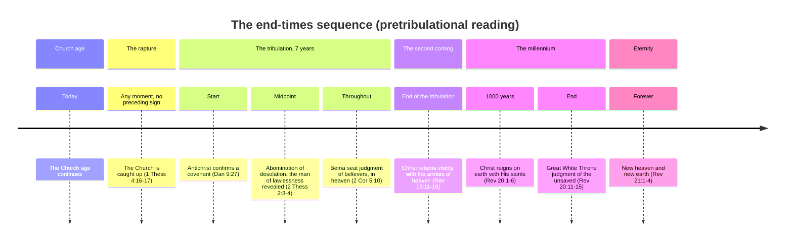
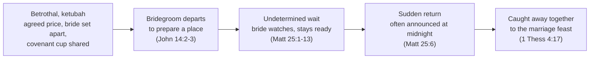

# The rapture of the Church

Studies on end times, and specifically on the *blessed hope* — the Church's expectation of being gathered to Christ before the world's final judgment falls.

There are two well-argued perspectives on how this happens. The first holds that the rapture — the *harpazo*, "catching up" — is a distinct event from the second coming of Christ, separated by the seven-year tribulation. The second holds that the *harpazo* and the second coming are the same event, described in different terms. What follows makes the case for the first view — pretribulational and dispensational, consistent with how this site reads prophecy elsewhere (see [The Zadok Calendar](zadok-calendar.md) and [The Day is Near](day-is-near.md)) — while giving the second a fair hearing under [Other end-times views](#other-end-times-views).

Whichever view is correct, the core promise doesn't change: Christ is coming for His Church, and that hope is meant to comfort, not to divide.

## Key Takeaways

*(This section follows the [Key Takeaways](../../about/key-takeaways.md) format this site is prototyping -- see that page for what each part is for and why.)*

### Types & Prophecy

**Type.** Enoch, "taken" bodily before the Flood ever fell (Genesis 5:24; Hebrews 11:5), and Lot, physically removed from Sodom minutes before its judgment (Genesis 19:16, 24), pattern the rapture's own shape — removed *before* judgment, not carried through it like Noah. Peter names Noah and Lot together as one pattern of rescue (2 Peter 2:5-9), and Jesus applies Lot's day directly to his own return (Luke 17:28-30). See [Types in the Old Testament](#types-in-the-old-testament-enoch-lot-and-elijah) below for why this is held as a suggestive pattern, not independent proof.

**Prophecy.** 1 Thessalonians 4:16-17 is a direct, first-time revelation — Paul explicitly calls it "a word from the Lord" (4:15) and "a mystery" at 1 Corinthians 15:51, not a truth already stated plainly elsewhere in the Old Testament and merely repeated here.

### Lessons about Jesus

- He comes for his own personally, not by proxy — "I will come again and will take you to myself" (John 14:3).
- His two returns serve two different purposes: a quiet gathering of the Church (the rapture) versus a visible, public arrival with "the armies of heaven" (the second coming, Revelation 19:11-16) — the same person, two distinct comings with two distinct aims.
- The word behind "rapture," ἁρπάζω (*harpazo*), everywhere else describes a real, sudden, physical event when used of someone going to be with God — this is the strongest lexical case that what he does for the Church is exactly what the word says, not a spiritualized metaphor.

### Memory verses

- John 14:3 — "I will come again and will take you to myself, that where I am you may be also."
- 1 Thessalonians 4:17 — "we who are alive, who are left, will be caught up together with them in the clouds to meet the Lord in the air."
- 1 Thessalonians 5:9 — "For God has not destined us for wrath, but to obtain salvation through our Lord Jesus Christ."

### Be Transformed

- **Think.** Notice any temptation to treat the rapture's *timing* as more settled than Scripture itself presents it — this study argues for pretribulationism while naming real, live counter-arguments (Revelation 3:10's ambiguity, 1 Thessalonians 4:17's *apantēsis*) rather than hiding them, because a conclusion that can't survive its own best objections isn't as strong as one that's been tested against them.
- **Attitude.** 1 Thessalonians 4:18's whole point is comfort, not anxious calculation — "encourage one another with these words" is a command to bring grieving people hope, not to trade date-guesses.
- **Do.** Live daily with the same readiness Matthew 25's parable calls for — prepared in advance, not scrambling when the moment comes (Matthew 25:1-13, [The Day Is Near](day-is-near.md)).

### Prayer

Lord, you promised to come again for your own, personally, not as an afterthought — thank you that the hope of being with you isn't vague reassurance but a specific promise, tied to your own word. Where I've let uncertainty about timing become anxiety instead of the comfort this was meant to be, correct that in me. Keep me ready the way the wise virgins were ready — not idle, not fearful, just prepared — until you come. Amen.

## Approach

1. Review the relevant literature.
2. Record the biblical texts directly, rather than working from summaries of them.
3. Order the texts into a coherent sequence of events.
4. Note anything that doesn't fit cleanly, rather than smoothing it over.
5. Use more than one presentation format — texts, tables, and diagrams — since a sequence of events is often clearer to see than to read.

## The word behind "rapture": ἁρπάζω

The English word "rapture" doesn't translate anything directly — it comes from the Latin Vulgate's *rapiemur* ("we will be caught up"), itself a translation of the Greek verb actually used in [1 Thessalonians 4:17 (ESV)](https://www.blueletterbible.org/esv/1Th/4/17): **ἁρπάζω** (*harpazō*, pronounced har-PAD-zo, Strong's G726), "to seize, snatch, or catch away by force."

**Where the word comes from.** In classical and koine Greek generally, ἁρπάζω is ordinary language for forcible seizure — a wolf snatching prey, a robber seizing goods, a kidnapper taking a person against their will. There's nothing inherently religious or gentle about the word; its core sense is *sudden, forceful removal*, and that sense carries through everywhere the New Testament uses it.

**How the New Testament actually uses it.** The word occurs 14 times. Most of the fourteen describe ordinary forceful seizure: a wolf snatching sheep (John 10:12), a strong man's house being plundered (Matthew 12:29), the word snatched away by the evil one before it takes root (Matthew 13:19), the violent "forcing" of the kingdom (Matthew 11:12), a crowd about to seize Jesus to force him into kingship (John 6:15), a mob trying to seize Paul (Acts 23:10), someone snatched from the fire (Jude 1:23). No one can *seize* the Father's sheep out of His hand (John 10:28-29) — the same force, turned into a promise of security.

But four occurrences describe something more specific: a person being suddenly, physically taken up into heaven or the heavenly realm.

- **[2 Corinthians 12:2-4 (ESV)](https://www.blueletterbible.org/esv/2Co/12/2-4)** — Paul describes himself (guardedly, in the third person) being "caught up" to the third heaven, into paradise — a real, momentary, involuntary experience, not something he did to himself.
- **[Acts 8:39 (ESV)](https://www.blueletterbible.org/esv/Act/8/39)** — after baptizing the Ethiopian eunuch, "the Spirit of the Lord carried Philip away" — an abrupt, physical relocation.
- **[Revelation 12:5 (ESV)](https://www.blueletterbible.org/esv/Rev/12/5)** — the male child (Christ) is "caught up to God and to his throne," His ascension described with the same verb.
- **[1 Thessalonians 4:17 (ESV)](https://www.blueletterbible.org/esv/1Th/4/17)** — "we who are alive, who are left, will be caught up together with them in the clouds to meet the Lord in the air."

**Conclusion.** Every time ἁρπάζω describes someone going to be with God, it describes a real, sudden, physical event — not a slow transition, and not a figure of speech for dying or for a spiritual change of status. That's the term Paul reaches for in 1 Thessalonians 4:17, deliberately, and it's the strongest lexical argument that the rapture is exactly what it sounds like: a real, sudden, bodily gathering of the Church, distinct in kind from the visible, earth-bound Second Coming described a few paragraphs later in 2 Thessalonians.

## The sequence of end-time events

## Types in the Old Testament: Enoch, Lot, and Elijah

Before the New Testament ever describes the rapture directly, three Old Testament lives already trace its shape, standing beside a fourth who models the alternative. This is typology, not proof: narrative illustrates a pattern rather than establishing one on its own, so what follows is suggestive, not a substitute for the direct teaching texts above.

**Enoch — taken before judgment fell.** "Enoch walked with God, and he was not, for God took him" ([Genesis 5:21-24 (ESV)](https://www.blueletterbible.org/esv/Gen/5/21-24)). Hebrews makes the point explicit: "By faith Enoch was taken up so that he should not see death... he was commended as having pleased God" ([Hebrews 11:5 (ESV)](https://www.blueletterbible.org/esv/Heb/11/5)). Enoch is the seventh from Adam ([Jude 1:14-15 (ESV)](https://www.blueletterbible.org/esv/Jud/1/14-15)) — and the flood, the judgment that sweeps away everyone left on earth, falls only three generations later, in the days of his own great-grandson. Enoch is removed *before* that judgment ever comes; he simply isn't there for it, taken quietly, without spectacle, sometime before the water rises.

**Noah — preserved through judgment, not removed from it.** Noah is a different pattern entirely: he and his family go *into* the flood, sealed in the ark, and come out the other side of God's judgment rather than being taken away before it starts ([Genesis 7:1 (ESV)](https://www.blueletterbible.org/esv/Gen/7/1); [Genesis 7:16 (ESV)](https://www.blueletterbible.org/esv/Gen/7/16)). Both men are righteous; both are spared; but only one is removed before the judgment falls, and the other is carried through it. Since the flood is already treated as a type of the tribulation above (see [The imminence of the rapture](#the-imminence-of-the-rapture); Matthew 24:37-39), Enoch and Noah between them model the two competing views of the rapture's timing side by side, in the very same chapters of Genesis.

**Lot — physically removed, moments before fire fell.** Genesis records the angels physically dragging Lot, his wife, and his daughters out of Sodom because Lot himself hesitated: "he lingered. So the men seized him and his wife and his two daughters by the hand... and they brought him out and set him outside the city" ([Genesis 19:16 (ESV)](https://www.blueletterbible.org/esv/Gen/19/16)). The rescue and the judgment are separated by minutes, not centuries — Lot reaches Zoar, and only then "the LORD rained on Sodom and Gomorrah sulfur and fire" (Genesis 19:24-25). Peter draws the direct comparison Jesus himself also draws (Luke 17:28-30, pairing Lot's day explicitly with the Son of Man's): Noah and Lot are named together as the same category of act — "the Lord knows how to rescue the godly from trials, and to keep the unrighteous under punishment until the day of judgment" ([2 Peter 2:9 (ESV)](https://www.blueletterbible.org/esv/2Pe/2/9)), rescue named as God's ordinary pattern, not a one-off. Worth flagging rather than smoothing over: Lot's removal isn't the quiet, willing translation Enoch's is — he has to be seized by the hand because he's slow to leave what he's about to lose, a detail that complicates any tidy typology rather than completing one.

**Elijah — taken up bodily, in full view.** Where Enoch's departure is quiet, Elijah's is dramatic: "as they still went on and talked, behold, chariots of fire and horses of fire separated the two of them. And Elijah went up by a whirlwind into heaven" ([2 Kings 2:11 (ESV)](https://www.blueletterbible.org/esv/2Ki/2/11)), in full view of Elisha. Elijah is taken up alive, without dying — the same basic shape 1 Corinthians 15:51-52 describes for believers still alive at the rapture ("we shall not all sleep... in a moment, in the twinkling of an eye").

Taken together: three men removed bodily before judgment fell or reached them — one quietly (Enoch), one seized by the hand at the last possible moment (Lot), one in full public view (Elijah) — standing beside a fourth man (Noah) preserved through that same kind of judgment rather than taken from it, and Peter's own epistle is the one that names Noah and Lot together as one pattern rather than leaving the connection to later readers to notice. That's not a proof text — it's a pattern Scripture itself points out, repeated in three different keys before it happened, then applied directly by name to "the day when the Son of Man is revealed" (Luke 17:30).

## Certainty

> ✝️ [John 14:1-4 (ESV)](https://www.blueletterbible.org/esv/Joh/14/1-4)
>
> 1 "Let not your hearts be troubled. Believe in God; believe also in me. 2 In my Father's house are many rooms. If it were not so, would I have told you that I go to prepare a place for you? 3 And if I go and prepare a place for you, **I will come again and will take you to myself, that where I am you may be also.** 4 And you know the way to where I am going."

This is where Chuck Missler begins his own discussion of the "blessed hope," and for good reason — before any sequence of events is worked out, the promise itself is stated plainly: Christ is coming back *for His own*, personally, to take them to be with Him.

## The imminence of the rapture

> ✝️ [Matthew 24:36-44 (ESV)](https://www.blueletterbible.org/esv/Mat/24/36-44)
>
> 36 "But concerning that day and hour no one knows, not even the angels of heaven, nor the Son, but the Father only. 37 For as were the days of Noah, so will be the coming of the Son of Man. 38 For as in those days before the flood they were eating and drinking, marrying and giving in marriage, until the day when Noah entered the ark, 39 and they were unaware until the flood came and swept them all away, so will be the coming of the Son of Man. 40 Then two men will be in the field; one will be taken and one left. 41 Two women will be grinding at the mill; one will be taken and one left. 42 Therefore, stay awake, for you do not know on what day your Lord is coming. 43 But know this, that if the master of the house had known in what part of the night the thief was coming, he would have stayed awake and would not have let his house be broken into. 44 Therefore you also must be ready, for the Son of Man is coming at an hour you do not expect."

- No sign is given here for the rapture to wait on — contrast this with the specific, sequenced signs Jesus gives for the second coming earlier in the same chapter (Matthew 24:4-31). That contrast is itself an argument for two distinct comings, not one.
- The rapture is pre-judgment: Noah's household is removed *before* the flood falls, not partway through it or after.
- The ark is a type of the rapture, at least loosely — a way of escape prepared in advance, entered before judgment arrives, not during it.
- "You also must be ready" — the imminence isn't a detail to work out; it's the point of the passage.

> ✝️ [Matthew 25:1-13 (ESV)](https://www.blueletterbible.org/esv/Mat/25/1-13)
>
> 1 "Then the kingdom of heaven will be like ten virgins who took their lamps and went to meet the bridegroom. 2 Five of them were foolish, and five were wise. 3 For when the foolish took their lamps, they took no oil with them, 4 but the wise took flasks of oil with their lamps. 5 As the bridegroom was delayed, they all became drowsy and slept. 6 But at midnight there was a cry, 'Here is the bridegroom! Come out to meet him.' 7 Then all those virgins rose and trimmed their lamps. 8 And the foolish said to the wise, 'Give us some of your oil, for our lamps are going out.' 9 But the wise answered, saying, 'Since there will not be enough for us and for you, go rather to the dealers and buy for yourselves.' 10 And while they were going to buy, the bridegroom came, and those who were ready went in with him to the marriage feast, and the door was shut. 11 Afterward the other virgins came also, saying, 'Lord, lord, open to us.' 12 But he answered, 'Truly, I say to you, I do not know you.' 13 Watch therefore, for you know neither the day nor the hour."

This is a parable, and parables make one or a few main points for their original hearers rather than encoding a checklist of independently significant details — worth naming plainly before mining it further, so what follows reads the count of virgins and the specifics of the oil as illustrating the point (readiness, tested by a genuinely unknown delay) rather than as separate doctrinal claims in their own right.

- Why ten? Five foolish, five wise — a mixed group, outwardly identical until the moment of testing.
- The wise were prepared *in advance* for the bridegroom's return, not scrambling to prepare when he arrived.
- "They all became drowsy and slept" — the same failure recurs at Gethsemane, where Jesus prayed and the disciples slept (Matthew 26:36-45); sleep, in both scenes, is what happens to people who don't grasp the weight of the moment.
- "Those who were ready went in with him... and the door was shut" — a door that shuts is a door that, at some point, cannot be opened again.
- "Watch therefore, for you know neither the day nor the hour" — the same imminence as Matthew 24, now tied explicitly to a wedding.

## The call to rapture

Paul isn't answering an abstract question here. Earlier in the same letter he'd already taught the Thessalonians about Christ's return; in the time since, some of them had died, and the church was grieving in a way that suggests real confusion about whether those believers would share in that return at all — the paragraph opens by naming exactly that concern: "we do not want you to be uninformed... about those who are asleep, that you may not grieve as others do who have no hope" (1 Thessalonians 4:13, ESV). What follows is pastoral correction aimed at that specific grief, not a freestanding timetable offered for its own sake.

> ✝️ [1 Thessalonians 4:15-18 (ESV)](https://www.blueletterbible.org/esv/1Th/4/15-18)
>
> 15 For this we declare to you by a word from the Lord, that we who are alive, who are left until the coming of the Lord, will not precede those who have fallen asleep. 16 For the Lord himself will descend from heaven with a cry of command, with the voice of an archangel, and with the sound of the trumpet of God. And the dead in Christ will rise first. 17 Then we who are alive, who are left, will be caught up together with them in the clouds to meet the Lord in the air, and so we will always be with the Lord. 18 Therefore encourage one another with these words.

- "We declare to you by a word from the Lord" — Paul isn't speculating; he's passing on direct revelation.
- The dead in Christ rise *first* — the rapture includes resurrection, not just the living being taken.
- A cry of command, an archangel's voice, a trumpet — three distinct signals, none of them subtle or secret.
- "Encourage one another with these words" — whatever the mechanics, the pastoral purpose of this text is comfort, not anxiety about timing.
- **A counter-argument worth engaging, not skipping past.** "Meet the Lord in the air" translates **εἰς ἀπάντησιν τοῦ κυρίου** — **ἀπάντησις** (*apantēsis*) was the ordinary Greek term for a delegation going *out* to formally greet an arriving dignitary and then escorting him *back* into the city, its only other New Testament uses being exactly this civic-welcome sense (Matthew 25:6, the virgins going out to meet the bridegroom; Acts 28:15, believers from Rome going out to meet Paul on the road). Read strictly on that pattern, the word could imply the church escorts Christ back down to earth immediately, which is the standard scholarly objection to reading the rapture as a separate event years ahead of the second coming. This site still reads the two as distinct — resting on the imminence argument above, the absent-signs contrast with Matthew 24, and 1 Thessalonians 5:9's "not destined for wrath," none of which depend on *apantēsis* alone — but the word itself doesn't settle the question either way, and a fair presentation says so rather than treating it as one more plank in the case.

> ✝️ [1 Corinthians 15:51-53 (ESV)](https://www.blueletterbible.org/esv/1Co/15/51-53)
>
> 51 Behold! I tell you a mystery. We shall not all sleep, but we shall all be changed, 52 in a moment, in the twinkling of an eye, at the last trumpet. For the trumpet will sound, and the dead will be raised imperishable, and we shall be changed. 53 For this perishable body must put on the imperishable, and this mortal body must put on immortality.

- "I tell you a mystery" — something not previously revealed in the Old Testament, disclosed here for the first time.
- "In a moment, in the twinkling of an eye" — about as fast as language can describe, reinforcing the sudden, ἁρπάζω-consistent nature of the event.
- The trumpet appears again, tying this passage to 1 Thessalonians 4 and to [The Trumpet Call of God](trumpet.md).
- Imperishable, immortal — the goal isn't escape from the body, but its transformation.

## The restrainer removed

> ✝️ [2 Thessalonians 2:1-7 (ESV)](https://www.blueletterbible.org/esv/2Th/2/1-7)
>
> 1 Now concerning the coming of our Lord Jesus Christ and our being gathered together to him, we ask you, brothers, 2 not to be quickly shaken in mind or alarmed, either by a spirit or a spoken word, or a letter seeming to be from us, to the effect that the day of the Lord has come. 3 Let no one deceive you in any way. For that day will not come, unless the rebellion comes first, and the man of lawlessness is revealed, the son of destruction, 4 who opposes and exalts himself against every so-called god or object of worship, so that he takes his seat in the temple of God, proclaiming himself to be God. 5 Do you not remember that when I was still with you I told you these things? 6 And you know what is restraining him now so that he may be revealed in his time. 7 For the mystery of lawlessness is already at work. Only he who now restrains it will do so until he is out of the way.

- "Our being gathered together to him" — Paul opens by naming the very event 1 Thessalonians 4 described, then uses it as the reference point for everything that follows.
- "That day will not come unless the rebellion comes first" — this is the second coming ("the day of the Lord"), not the rapture, being tied to specific preceding events. The "day of the Lord" language recurs at multiple points in Scripture, not only at the very end — Joel already used it for a locust-plague judgment centuries before Christ (Joel 2:31, quoted directly at Acts 2:20), and Amos warned Israelites who wished for it that it meant darkness, not light, for the unrepentant (Amos 5:18-20) — the phrase names a category of decisive divine action God's people can face more than once, not a single fixed date that only ever refers to the end.
- "He who now restrains it will do so until he is out of the way" — identifying the restrainer is a genuinely open question among serious interpreters, not a settled one: proposed answers include the Roman Empire and its rule of law, human government generally, the ongoing proclamation of the gospel, the archangel Michael (drawing on Daniel 10-12's own restraining angelic conflict), and the Holy Spirit working in and through the Church. This site finds the last of these the most compelling, and not only by elimination. A real grammatical detail supports it, worth checking directly rather than taking on someone else's word: queried against the Greek text (SBLGNT), verse 6's participle is **τὸ κατέχον** — neuter, "that which restrains" — while verse 7 switches to **ὁ κατέχων** — masculine, "the one restraining." Paul moves from an impersonal, general description to a personal one within two verses. That shift is exactly what's expected if the restrainer is the Spirit: **πνεῦμα** ("spirit") is itself a grammatically neuter noun, but the New Testament consistently refers back to the Spirit with personal, masculine pronouns when his agency and personhood are in view (John 14:26; 16:13-14) rather than the grammatically "correct" neuter — the same pattern this verse shows. This ties the removal of the restrainer directly to the Church's own removal at the rapture — not the Spirit ceasing to exist or act in the world altogether (people still come to saving faith during the tribulation itself, per the great multitude "washed... in the blood of the Lamb" at Revelation 7:9-14, which implies the Spirit's saving work continues even during that period), but His restraining ministry *through the Church* ending when the Church itself is taken. If that reading is right, this is the same event as 1 Thessalonians 4:17, seen from its consequence rather than its promise — and the grammatical shift above is real evidence for it, not just an inference from the doctrine assumed in advance, though it isn't the only reading serious interpreters hold, and a reader should know that going in.
- **A claim worth naming, and being direct about what can and can't be checked.** Ken Johnson (Th.D.) argues from what he presents as an ancient Hebrew-language text of 1-2 Thessalonians — claimed to be quoted by two church fathers by around AD 180 — that the restrainer is identified there by name as the Holy Spirit, removing the ambiguity the Greek leaves open. This site already cites Johnson elsewhere ([The Zadok Calendar](zadok-calendar.md)) for a different, independently-checkable claim (1 Enoch's Apocalypse of Weeks), so the name isn't being raised here to dismiss it. But this specific claim is different in kind: the publicly available material describing it doesn't name the manuscript, give a catalog reference, or identify which two church fathers supposedly quote it — details that would let anyone independently verify it, the way Pseudo-Ephraem's and Irenaeus's much more modest claims above can be checked against a named, locatable text even where their *meaning* is disputed. Paul's letters to a Gentile-majority congregation in Macedonia are, without serious dispute among textual scholars, Greek compositions; a Hebrew Vorlage for them isn't part of any established textual-critical tradition (unlike, say, the Peshitta or the Old Latin, which are real, catalogued ancient versions). None of that makes Johnson's underlying conclusion wrong — the Greek grammatical evidence just above reaches a similar place on firmer, independently-checkable ground — but the Hebrew-text claim itself isn't something this study can verify, and saying so plainly is more honest than either repeating it as settled or leaving it out because it's inconvenient to check.

## The tribulation

The tribulation is a specific seven-year period — Daniel's seventieth "week" of years ([Daniel 9:27 (ESV)](https://www.blueletterbible.org/esv/Dan/9/27); see [The Zadok Calendar](zadok-calendar.md) for how this site reckons that kind of chronology) — during which God's judgment falls on a world that has rejected Him, culminating in the man of lawlessness taking his seat in the temple (2 Thessalonians 2:4) and the abomination of desolation at its midpoint.

Scripture gives two direct reasons to expect the Church to be removed before this period, not merely protected through it:

- **Not destined for wrath.** "For God has not destined us for wrath, but to obtain salvation through our Lord Jesus Christ" ([1 Thessalonians 5:9 (ESV)](https://www.blueletterbible.org/esv/1Th/5/9)). The tribulation is explicitly God's wrath poured out on the earth — a category Scripture says believers are not appointed to.
- **Kept from, not through — a reading held with real disagreement, not settled fact.** To the church in Philadelphia: "I will keep you from the hour of trial that is coming on the whole world, to try those who dwell on the earth" ([Revelation 3:10 (ESV)](https://www.blueletterbible.org/esv/Rev/3/10)). This site reads that as a promise to be kept *from* the hour itself, not merely preserved safely inside it — but it's worth being direct about how contested the underlying Greek (ἐκ τῆς ὥρας, "out of the hour") actually is: standard commentary treats it as genuinely ambiguous between "keep you from undergoing" and "keep you through," with serious interpreters on both sides. This site's reading is a real, defensible one, not the only one a careful reader of the Greek can land on — which is why the case for a pretribulational rapture below leans on more than this verse alone.

## The judgments

Scripture describes two distinct judgments, for two distinct groups, at two distinct times — collapsing them into one "final judgment" flattens a real structure in the text.

| Judgment | Who | When | Basis |
| --- | --- | --- | --- |
| The Bema seat | Believers | During the tribulation, in heaven | Works tested for reward, not for salvation — [2 Corinthians 5:10 (ESV)](https://www.blueletterbible.org/esv/2Co/5/10); [1 Corinthians 3:11-15 (ESV)](https://www.blueletterbible.org/esv/1Co/3/11-15) |
| The Great White Throne | The unsaved dead | After the millennium | Judged "according to what they had done," ending in the second death — [Revelation 20:11-15 (ESV)](https://www.blueletterbible.org/esv/Rev/20/11-15) |

**Bēma** (**βῆμα**) is worth getting right rather than repeating the popular but inaccurate gloss "a Greek athletic term for the judge's stand at the games": every one of its twelve New Testament occurrences is judicial or civic, not athletic — Pilate's judgment seat (Matthew 27:19; John 19:13), Herod's throne (Acts 12:21), Gallio's tribunal at Corinth (Acts 18:12, 16-17), Festus's tribunal (Acts 25:6, 10, 17), and "the judgment seat of God/Christ" itself (Romans 14:10; 2 Corinthians 5:10). The ESV Study Bible's note on 2 Corinthians 5:10 identifies it specifically as "the tribunal bench in the Roman courtroom, where the governor sat while rendering judicial verdicts" — remains of one still stand in the Corinthian forum. The Bema is a judgment of reward, not of condemnation — a believer's salvation was already settled at the cross; what's evaluated here is what was built on that foundation (1 Corinthians 3:12-13). The Great White Throne, by contrast, is where those never covered by Christ's righteousness are judged by their own deeds, and found wanting.

## The millennial reign

Revelation is apocalyptic literature, and this site's own practice elsewhere (see [The Trumpet Call of God](trumpet.md)'s treatment of Revelation's seven trumpets) is to trace a vision's Old Testament imagery before assigning it a novel referent, rather than reading it plainly on first pass. The white-horse imagery below already has that grounding — it echoes the same rider-on-a-white-horse figure John introduces earlier in Revelation (6:2) and, further back, the coming king's triumph pictured across the Psalms and Prophets (e.g. Psalm 45:3-5) — so reading it as a real, visible, future event isn't skipping that step, but it's worth naming that the step was taken rather than assuming a plain reading needs no justification here.

After the tribulation, Christ returns visibly and physically — "the armies of heaven, arrayed in fine linen, white and pure, were following him on white horses" ([Revelation 19:11-16 (ESV)](https://www.blueletterbible.org/esv/Rev/19/11-16)) — not in secret, and not merely "spiritually." He then reigns on earth for a literal thousand years, with resurrected and raptured believers reigning alongside Him as priests of God ([Revelation 20:1-6 (ESV)](https://www.blueletterbible.org/esv/Rev/20/1-6)). This is the earthly, physical fulfillment of the many Old Testament promises of a coming kingdom of peace and righteousness — not spiritualized into the Church age, but still future.

## Eternity

At the millennium's close, Satan is judged once for all, the unsaved face the Great White Throne, and then comes the eternal state: "a new heaven and a new earth... and I heard a loud voice from the throne saying, 'Behold, the dwelling place of God is with man. He will dwell with them'" ([Revelation 21:1-4 (ESV)](https://www.blueletterbible.org/esv/Rev/21/1-4)). Whatever remains uncertain about the sequence leading up to this point, the destination itself is not in doubt: God, dwelling with His people, forever.

## The Jewish wedding pattern

The sequence above maps unusually closely onto the structure of a first-century Jewish betrothal and wedding — likely not a coincidence, given that Jesus and Paul were both speaking to audiences who would have recognized the pattern immediately.

**Worth being direct about the sourcing here, the same way this study flags its patristic evidence below rather than overclaiming it.** The specific sequence of customs in this section — the ketubah's agreed price, a shared covenant cup, the bridegroom's indeterminate absence, a midnight announcement — comes from popular teaching sources (cited in the References below) rather than from a single primary first-century text laying the whole custom out end to end; reconstructing first-century Jewish wedding practice in this much procedural detail is itself a live question among historians of the period, not settled ethnography. What's on firmer ground is the biblical text's own use of betrothal and wedding *language* for Christ and the Church (Ephesians 5:25-27; Revelation 19:7-9) — the custom-by-custom mapping below illustrates that language vividly, but shouldn't be mistaken for an independently attested historical record with the same certainty as the Scripture passages it's paired against.

- **The betrothal (*ketubah*).** A price is agreed, the bride is set apart for the groom alone, and a cup of wine is shared to seal the covenant — compare the new covenant in Christ's blood ([1 Corinthians 11:25 (ESV)](https://www.blueletterbible.org/esv/1Co/11/25)), the price of being bought at a cost ([1 Corinthians 6:19-20 (ESV)](https://www.blueletterbible.org/esv/1Co/6/19-20)), and being sanctified — set apart — as those "called to be saints" ([1 Corinthians 1:2 (ESV)](https://www.blueletterbible.org/esv/1Co/1/2); [1 Corinthians 6:11 (ESV)](https://www.blueletterbible.org/esv/1Co/6/11); [Hebrews 10:10 (ESV)](https://www.blueletterbible.org/esv/Heb/10/10); [Hebrews 13:12 (ESV)](https://www.blueletterbible.org/esv/Heb/13/12)).
- **The bridegroom departs to prepare a place**, at his father's house — the wait is indeterminate; the bride doesn't set the date. This is exactly the language of John 14:2-3.
- **The bride prepares** during the wait, rather than passing the time idly — see [Ephesians 5:25-27 (ESV)](https://www.blueletterbible.org/esv/Eph/5/25-27), Christ sanctifying and cleansing the church so as to present her "without spot or wrinkle."
- **The return** comes as a surprise, traditionally announced at midnight with a shout — matching both the parable of the ten virgins and the "cry of command" of 1 Thessalonians 4:16.

### Prepared for good works

> ✝️ [Ephesians 2:10 (ESV)](https://www.blueletterbible.org/esv/Eph/2/10)
>
> 10 For we are his workmanship, created in Christ Jesus for good works, which God prepared beforehand, that we should walk in them.

These good works aren't confined to this present life — the reward evaluated at the Bema seat (above) suggests they carry forward into eternity, not merely into the record of a life now finished.

## Early church testimony

How far back does this expectation actually go? The post-apostolic church was broadly premillennial — Justin Martyr, Papias, Irenaeus, and Tertullian all held that Christ returns to reign on earth for a literal thousand years, the same basic framework as [the millennial reign](#the-millennial-reign) above. That much isn't seriously disputed among historians of the early church.

Whether any of them taught a *pretribulational* rapture specifically — the Church removed years before the tribulation even starts, as a distinct event from the second coming — is far more contested, and it's worth saying plainly rather than overclaiming a clean pedigree back to the apostles.

The single most-cited text is a sermon traditionally attributed to Ephraem the Syrian (4th century), *[On the Last Times, the Antichrist, and the End of the World](https://www.according2prophecy.org/lastimes.html)* — though the attribution is doubtful. Most scholars regard it as the work of a later, unknown author (plausibly as late as the 6th or 7th century), and refer to it as Pseudo-Ephraem rather than treat it as genuine. It contains this line:

> "For all the saints and elect of God are gathered, prior to the tribulation that is to come, and are taken to the Lord, lest they see the confusion that is to overwhelm the world because of our sins."

Advocates for a pretribulational rapture point to this as an early witness to the doctrine. Critics respond that the line reads most naturally as describing saints *already dead* being gathered to the Lord — a statement about the blessed dead escaping a future confusion they won't live to see, not a doctrine about the living Church being removed. That same ambiguity runs through most of the patristic evidence usually cited on this question.

Irenaeus, a genuine 2nd-century figure and disciple of Polycarp, writes in [*Against Heresies* 5.29](https://www.newadvent.org/fathers/0103529.htm) that "when in the end the Church shall be suddenly caught up from this [the present world], it is said, 'There shall be tribulation such as has not been since the beginning.'" Some read this as the Church being removed *before* tribulation begins. Others point out that Irenaeus immediately calls this "the last contest of the righteous" — language suggesting the Church is caught up *into* the trial as its culmination, not away from it before it starts.

The honest historical conclusion: an any-moment, escape-oriented hope has real roots earlier than critics of dispensationalism often allow, but a fully worked-out doctrine that clearly separates the rapture from the second coming as two distinct events, years apart, doesn't appear in a developed, unambiguous form until much later — most identifiably with 19th-century teachers like John Nelson Darby and the Brethren movement. That doesn't settle whether the doctrine is *true* — plenty of doctrines took centuries of the church thinking carefully to state precisely, the Trinity itself not receiving its classic creedal formulation until Nicaea and Constantinople — but it does mean a claim that "the early church all clearly believed this" overclaims what the actual texts support.

## Other end-times views

The view argued above is pretribulational and dispensational — but it isn't the only view held by serious, Bible-believing Christians, and it's worth naming the alternatives fairly rather than only their weakest forms:

- **Post-tribulationism** holds that the rapture and the second coming are the same event, occurring together at the end of the tribulation — taking 1 Thessalonians 4 and Matthew 24 as descriptions of one single arrival, not two.
- **Mid-tribulationism** and **pre-wrath** views place the rapture partway through the seven years, typically before the specifically wrath-pouring judgments of Revelation's later chapters, while still holding to a real, distinct catching-up event.
- **[Amillennialism](https://en.wikipedia.org/wiki/Amillennialism)** rejects a future literal thousand-year reign altogether, reading Revelation 20 symbolically of the present Church age rather than as a future earthly kingdom — this affects the millennium section above more than the rapture question itself, but the two are often held together.

Whichever of these is correct, the outcome for the believer is the same: Christ returns, the dead in Him are raised, and His people are with Him forever. That shared hope is worth more than the disagreement over its timing.

## Conclusion

The word Scripture actually uses for the rapture, ἁρπάζω, describes a real, sudden, physical event everywhere else it's used of someone going to be with God — not a metaphor to be reinterpreted. Read alongside the specific, sequenced signs attached to the second coming but conspicuously absent from the rapture texts, and alongside Scripture's own promise that believers are not destined for the wrath of the tribulation, the pretribulational reading has real textual weight behind it, not just tradition. Whatever the exact timing, the promise underneath all of it doesn't move: "and so we will always be with the Lord" (1 Thessalonians 4:17).

## Discussion questions

1. This study names two real counter-arguments against its own pretribulational reading (Revelation 3:10's ambiguity, and *apantēsis*'s civic-welcome sense at 1 Thessalonians 4:17) rather than only citing evidence in its favor. Did seeing those objections named change how persuasive the conclusion felt to you?
2. Identifying "the restrainer" in 2 Thessalonians 2:6-7 turns out to be a genuinely open question among careful interpreters. Does not knowing the answer for certain change anything about how you'd live in light of this passage?
3. Enoch is removed before the Flood; Noah is preserved through it. Both are called righteous. What does it mean that Scripture models two different ways of being spared, rather than only one?
4. The Jewish-wedding-pattern section draws a line between what's biblical text (betrothal and wedding *language* applied to Christ and the Church) and what's reconstructed custom (the specific sequence of first-century practices). Did that distinction change how you weighed that section against the study's more directly textual arguments?

## References & Recommended Reading

- Chuck Missler, [Blessed Hope teaching series](https://www.khouse.org/) — starting point for the "Certainty" section above.
- [A study from a scholarly perspective on ancient Jewish weddings](https://hearingshofar.blogspot.com/2013/12/the-parable-of-bridegrooms-shofar.html) and [The prophetic pattern of the ancient Jewish wedding](https://www.truevinelife.com/growthinchrist/return-of-jesus-christ-part-2-the-prophetic-pattern-of-the-ancient-jewish-wedding) — popular-level sources for [The Jewish wedding pattern](#the-jewish-wedding-pattern) section's custom sequence; named directly rather than left uncited, per the caveat given there about their evidentiary weight.
- *ESV Study Bible* (Crossway, 2016) — notes on Revelation 3:10, 1 Thessalonians 4:17, 2 Thessalonians 2:6-7, and 2 Corinthians 5:10, consulted as an independent check on this study's own reading; source of the corrected Bēma etymology and the acknowledged ambiguity on Revelation 3:10 and the restrainer's identity.
- *NIV Biblical Theology Study Bible* (Zondervan, 2018) — notes on 1 Thessalonians 4:17 (the *apantēsis* civic-welcome sense) and 2 Thessalonians 2:6-7 (the seven scholarly proposals for the restrainer), consulted independently of the ESV Study Bible above.
- Robert L. Thomas, cited in Thomas Ice, [The Holy Spirit and the Pretribulational Rapture](https://www.according2prophecy.org/hsrap.html) — source of the τὸ κατέχον / ὁ κατέχων gender-shift argument at 2 Thessalonians 2:6-7, independently confirmed against this repo's own Greek text (SBLGNT) above.
- Ken Johnson, Th.D., *[Paul's Ancient Hebrew Thessalonian Epistles](https://prophecywatchers.com/product/pauls-ancient-hebrew-thessalonians-epistles-proof-of-a-pre-trib-rapture-by-ken-johnson-shipping-included-usa-only/)* — named directly per the caveat given in [The restrainer removed](#the-restrainer-removed) above: this study could not independently verify the underlying manuscript claim from publicly available material, unlike the more checkable (if still disputed) patristic citations elsewhere in this study.
- [The Trumpet Call of God](trumpet.md) — the trumpet imagery shared between 1 Thessalonians 4:16 and 1 Corinthians 15:52, and this site's own model for tracing Revelation's imagery to its Old Testament source before reading it.
- [The Day Is Near](day-is-near.md) — the readiness Matthew 25's parable calls for, worked out in full.
- [The Zadok Calendar](zadok-calendar.md) — the chronological framework behind the seven-year tribulation reckoning above.
- Pseudo-Ephraem, *[On the Last Times, the Antichrist, and the End of the World](https://www.according2prophecy.org/lastimes.html)* — the most-cited patristic text in the pretrib debate; see [Early church testimony](#early-church-testimony) for the authorship caveat. Not independently verified against a critical edition in this repo's own tooling — quoted as commonly cited in pretrib literature, with that limit named rather than hidden.
- Irenaeus of Lyon, *[Against Heresies, Book V, Chapter 29](https://www.newadvent.org/fathers/0103529.htm)* — the "caught up" passage discussed above. Same verification limit as the Pseudo-Ephraem citation above.
