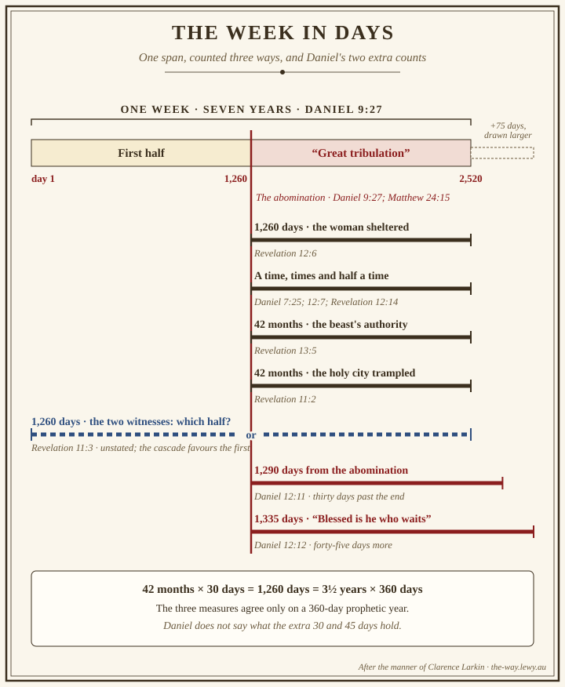
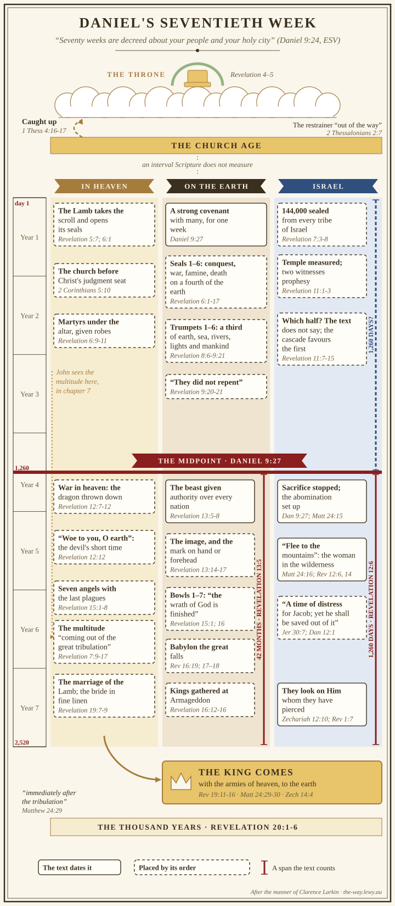

# The Tribulation

*Daniel's seventieth week, year by year*

The angel Gabriel gave Daniel a count of seventy weeks and told him who it was about:

> ✝️ Daniel 9:24 (ESV)
>
> 24 "Seventy weeks are decreed about your people and your holy city, to finish the transgression, to
> put an end to sin, and to atone for iniquity, to bring in everlasting righteousness, to seal both
> vision and prophet, and to anoint a most holy place.

Sixty-nine of those weeks ran to the Messiah and His death. One week is left (Daniel 9:27). The rest of
the Bible's prophecy fills it in: Jeremiah names it, Jesus quotes Daniel about it, Paul says what opens
it, and Revelation gives it fourteen chapters.

**In one sentence:** Daniel's seventieth week is seven years in which God keeps His word to Israel,
judges a world that has refused His Son, and still saves a multitude no one can number; Revelation
shows the whole week from the throne room, where on this site's reading the church already is.

This study draws the week as Clarence Larkin drew prophecy, as charts you can stand back from. Four
charts carry the order of events, so the prose can spend its words on what the week means. Each chart
marks its own confidence: a solid outline means the text dates the event, a dashed one means it is
placed by its order in Revelation. Revelation is prophecy given in visions to seven churches under
pressure (Revelation 1:3-4, 9). This study reads its numbers as the lengths of real periods, as the
dispensational reading does, and marks where that reading decides a point.

## Key Takeaways

*(This section follows the [Key Takeaways](../about/key-takeaways.md) format — see that page for what
each part is for.)*

### Types & Prophecy

- **One week of Daniel's seventy is still to run.** It begins with a covenant "for one week" and turns
  at its middle, when sacrifice is stopped and the abomination set up (Daniel 9:27). Jesus told His
  disciples to watch for that abomination (Matthew 24:15).
- **The trumpets and bowls replay Egypt.** Hail and fire, water turned to blood, darkness, locusts and
  sores come back on a world scale, and the people who come through them sing "the song of Moses, the
  servant of God, and the song of the Lamb" (Revelation 15:3, ESV).

### Lessons about Jesus

- **Every judgment is opened by the Lamb.** Only the slain Lamb is worthy to take the scroll and open
  its seals (Revelation 5:5-9), so the week's judgments are His, and so is its outcome.
- **He ends the week in person.** It closes when He comes from heaven with His armies (Revelation
  19:11-16) and Israel looks "on him whom they have pierced" (Zechariah 12:10, ESV).

### Memory verses

> ✝️ Jeremiah 30:7 (ESV)
>
> 7 Alas! That day is so great there is none like it; it is a time of distress for Jacob; yet he shall
> be saved out of it.

> ✝️ Revelation 7:14 (ESV)
>
> 14 I said to him, "Sir, you know." And he said to me, "These are the ones coming out of the great
> tribulation. They have washed their robes and made them white in the blood of the Lamb.

### Be Transformed

- **Think.** God has not destined you for wrath (1 Thessalonians 5:9). The week is real, and your Lord
  Jesus delivers you from it.
- **Attitude.** Hold the week's grief and its mercy together, as Habakkuk prayed: "in wrath remember
  mercy" (Habakkuk 3:2, ESV).
- **Do.** Twice the judgments end with "they did not repent" (Revelation 9:20-21; 16:9, 11). Pray this week, by name, for one
  person who has not yet turned to Christ, and speak to them while the door is open.

### Prayer

Father, You keep every word You have spoken, to Israel and to us. Thank You for Your Son Jesus, the
Lamb who was slain, who alone is worthy to open the scroll, and who will come again as King of kings.
Thank You that You have not destined us for wrath but for salvation through Him. Keep us awake and
faithful. Give us urgency for those who have not yet turned to You, and bring many to wash their robes
in the blood of the Lamb while it is still today.

In Jesus' name. Amen.

## Study outline

- [Seven years, counted from Daniel](#seven-years-counted-from-daniel). Where the week comes from,
  the names the prophets give it, and Revelation's three measures of its halves.
- [What the week is for](#what-the-week-is-for). Three purposes, each from a text: Israel, the
  earth-dwellers, and a multitude saved.
- [Revelation's map of the week](#revelations-map-of-the-week). How the book divides, and how each
  seventh judgment opens the next seven.
- The week itself, in three sections: [the first half](#the-first-half),
  [the midpoint](#the-midpoint) and [the second half](#the-second-half).
- [Who is where](#who-is-where). The church, Israel, the tribulation saints and the earth-dwellers,
  with a word count that shows where Revelation names each.
- [What the week shows about God](#what-the-week-shows-about-god). His justice, patience,
  faithfulness and mercy, and what they mean for you.

## Seven years, counted from Daniel

### The last of seventy weeks

Daniel was praying over Jeremiah's seventy years of exile when Gabriel answered him with seventy
weeks (Daniel 9:1-2, 24). The weeks are weeks of years: seven sevens and sixty-two sevens run "to the
coming of an anointed one, a prince," and after them "an anointed one shall be cut off" (Daniel
9:25-26, ESV). Then the city and sanctuary are destroyed, which Rome did in AD 70. The last week stands
apart:

> ✝️ Daniel 9:27 (ESV)
>
> 27 And he shall make a strong covenant with many for one week, and for half of the week he shall put
> an end to sacrifice and offering. And on the wing of abominations shall come one who makes desolate,
> until the decreed end is poured out on the desolator."

This site reads the interval between the sixty-ninth week and the seventieth as the church age, and
[Immediately After](immediately-after.md#where-the-gap-does-sit) gives the case from Daniel's own
order. The week has a beginning (a covenant), a middle (sacrifice stopped, the abomination set up) and
an end (the desolator's "decreed end"). Every chart below hangs on those three points.

Who "he" is in Daniel 9:27 is contested. Some read the Messiah, whose death ended the sacrifices; this
site reads the coming prince of Daniel 9:26, whose people destroy the city, because Jesus still placed
the abomination ahead (Matthew 24:15). [Immediately
After](immediately-after.md#whose-covenant-the-contested-he-of-927) weighs both. Daniel had already
seen the pattern once, in Antiochus IV, whose forces "shall set up the abomination that makes
desolate" (Daniel 11:31, ESV), as they did in 167 BC.

### The prophets' names for it

Jeremiah saw a day with "none like it," and called it "a time of distress for Jacob" (Jeremiah 30:7,
ESV). Daniel uses the same Hebrew phrase, עֵת צָרָה (*ʿet tsarah*, H6869, "a time of distress"), for "a
time of trouble, such as never has been since there was a nation till that time" (Daniel 12:1, ESV).
Both verses end in rescue. Jacob "shall be saved out of it"; Daniel's people "shall be delivered,
everyone whose name shall be found written in the book."

Jesus took Daniel's sentence into the Olivet Discourse. In Theodotion's Greek version, Daniel 12:1
reads θλῖψις οἵα οὐ γέγονεν, "distress such as has not been," with θλῖψις (*thlipsis*, G2347,
"distress, tribulation"). Jesus says "there will be great tribulation, such as has not been from the
beginning of the world until now, no, and never will be" (Matthew 24:21, ESV), and His Greek has the
same noun and the same clause. He places it after the abomination (Matthew
24:15) and says the days will be "cut short" for the sake of the elect (Matthew 24:22, ESV). So the
"great tribulation" is the second half of the week, and "the tribulation" is the usual name for the
whole seven years.

### One span, counted three ways

Revelation measures the halves of the week three ways and gets the same length each time: 1,260 days
(Revelation 11:3; 12:6), forty-two months (Revelation 11:2; 13:5) and "a time, and times, and half a
time" (Revelation 12:14, ESV), the phrase Daniel uses for the little horn's power over the saints
(Daniel 7:25; 12:7). Forty-two months of thirty days is 1,260 days, and so is three and a half years
of 360 days. [Prophecy Events and Times](prophecy-events-times.md) works through why the prophetic
year runs to 360 days.

Daniel adds two counts no other book explains. From the day the burnt offering is taken away "there
shall be 1,290 days," and "Blessed is he who waits and arrives at the 1,335 days" (Daniel 12:11-12,
ESV). Counted from the abomination, they run past the end of the week by thirty days and then
forty-five more. Daniel 12:12 does not name its starting point, so counting it from the abomination,
as the chart does, assumes the start of Daniel 12:11. What the extra days hold Daniel does not say,
and the *NIV Cultural Backgrounds Study Bible* notes that no explanation offered has satisfied. The
chart leaves them unlabelled.

## What the week is for

The tribulation is God at work, and He names His purposes. Three of them carry the week.

### To bring Israel home

The seventy weeks are "decreed about your people and your holy city" (Daniel 9:24, ESV). Daniel's
people are Israel, and the six goals of that verse, from finishing transgression to anointing a most
holy place, are promises to them. The last week completes them. Zechariah describes the refining:
"two thirds shall be cut off and perish, and one third shall be left alive. And I will put this third
into the fire, and refine them as one refines silver" (Zechariah 13:8-9, ESV). The fire ends in a
covenant restored: "I will say, 'They are my people'; and they will say, 'The LORD is my God.'"

Paul states the outcome as a mystery revealed: "a partial hardening has come upon Israel, until the
fullness of the Gentiles has come in. And in this way all Israel will be saved" (Romans 11:25-26,
ESV). This shows that God keeps the promises He swore to Abraham's children. Their unbelief has not
cancelled them, and the hardest week in their history is the week He brings them to the Son they
pierced.

### To judge those who dwell on the earth

Revelation has a name for humanity in settled rebellion: "those who dwell on the earth." The hour
of trial is coming "on the whole world, to try those who dwell on the earth"
(Revelation 3:10, ESV). The judgments are God's answer to the martyrs' cry, "how long before you will
judge and avenge our blood on those who dwell on the earth?" (Revelation 6:10, ESV), and the world
itself names them: "hide us from the face of him who is seated on the throne, and from the wrath of the
Lamb, for the great day of their wrath has come, and who can stand?" (Revelation 6:16-17, ESV).

That question adapts Joel 2:11 ("The day of the LORD is great... who can endure it?"), as the *NIV
Cultural Backgrounds Study Bible* notes on Revelation 6:17. It is the prophets' day of the Lord,
arriving. ὀργή (*orgē*, G3709, "wrath") first appears in Revelation here, at the sixth seal, and the
seals are opened by the Lamb from the first. God's wrath is His settled justice against evil, and it
falls in this week on people who have refused His Son.

### To save a multitude no one can number

Immediately after the world asks "who can stand?", John sees who can: "a great multitude that no one
could number, from every nation, from all tribes and peoples and languages, standing before the throne
and before the Lamb" (Revelation 7:9, ESV). The *NIV Biblical Theology Study Bible* notes the link:
the word for "stand" in Revelation 6:17 is the word for "standing" in Revelation 7:9. The elder says
they come out of the great tribulation, washed in the blood of the Lamb (Revelation 7:14). An angel flies over the
earth "with an eternal gospel to proclaim to those who dwell on earth, to every nation and tribe and
language and people" (Revelation 14:6, ESV).

So the week of wrath is also the gospel's last harvest before the King comes. God's patience, which
Peter says waits because He is "not wishing that any should perish, but that all should reach
repentance" (2 Peter 3:9, ESV), is still at work in the worst days the world will see.

## Revelation's map of the week

### Where the week begins in the book

Jesus gives John a three-part commission: "Write therefore the things that you have seen, those that
are and those that are to take place after this" (Revelation 1:19, ESV). Chapter 1 is what John has
seen; chapters 2 and 3 are the seven churches as they are. Then the phrase returns: "After this I
looked, and behold, a door standing open in heaven! And the first voice... said, 'Come up here, and I
will show you what must take place after this'" (Revelation 4:1, ESV). From there John watches
from the throne room: the Lamb takes the scroll (Revelation 5:7), and in chapter 6 He begins to open
it.

### Each seventh opens the next seven

The judgments come in three series of seven, and the seventh of each holds the next. The seventh seal
brings silence in heaven, and then "the seven angels who stand before God, and seven trumpets were
given to them" (Revelation 8:1-2, ESV). The seventh trumpet announces the kingdom (Revelation 11:15),
and the next series follows: "seven angels with seven plagues, which are the last, for with them the
wrath of God is finished" (Revelation 15:1, ESV). The chart below draws this cascade.

Another reading is widely held, and it has a real textual basis. On the recapitulation view the three
series retell one period from three angles, because each of them reaches the end: the sixth seal
shakes heaven and earth (Revelation 6:12-17), the seventh trumpet announces the kingdom (Revelation
11:15-18), and the seventh bowl cries "It is done!" (Revelation 16:17, ESV). The cascade answers that
each series reaches the end because each seventh contains what follows it. Both readings agree on the
direction of travel: the judgments grow. The seals reach "a fourth of the earth" (Revelation 6:8, ESV),
the trumpets "a third" of earth, sea, waters, lights and mankind (Revelation 8:7-12; 9:15, ESV), and at
the second bowl "every living thing died that was in the sea" (Revelation 16:3, ESV).

### The interludes are heaven's explanations

Between the sixth and seventh seals, and again between the sixth and seventh trumpets, John is shown
something else: the 144,000 sealed and the great multitude (Revelation 7), then the little scroll and
the two witnesses (Revelation 10:1-11:14). Chapters 12-14 stand before the bowls, and they step back
from the sequence altogether: the "great sign" of the woman reaches back to her child "caught up to
God and to his throne" (Revelation 12:5, ESV) before it shows the dragon's war. Between the sixth and
seventh bowls there is one sentence, and Jesus speaks it: "Behold, I am coming like a thief!"
(Revelation 16:15, ESV). The pauses tell the reader who is being kept; the last one calls the reader
to be ready.

## The week, chart by chart

The master chart sets all of this against the seven years in three lanes: heaven, the earth and Israel.
Read it from the top. The sections after it walk through each half.

*Select any chart to open it full size.*

## The first half

### What opens it

Paul names the order: "that day will not come, unless the rebellion comes first, and the man of
lawlessness is revealed," and something holds him back "so that he may be revealed in his time"
(2 Thessalonians 2:3, 6, ESV). "Only he who now restrains it will do so until he is out of the way"
(2 Thessalonians 2:7, ESV). [The Restrainer](the-restrainer.md) identifies that restrainer as the
Holy Spirit indwelling the church, so the church's removal (1 Thessalonians 4:16-17) comes before the
lawless one is revealed. The week itself opens with Daniel's covenant (Daniel 9:27). Scripture does not
measure the interval between the two, and the chart leaves it unmeasured.

### The seals and the sealed

The first four seals release the four horsemen: a conqueror, war, famine priced at a day's wage for a
quart of wheat, and Death with Hades, given authority "over a fourth of the earth" (Revelation 6:1-8,
ESV). Jesus' list in the Olivet Discourse runs in the same order (false christs, wars, famines), and He
called it "the beginning of the birth pains" (Matthew 24:8, ESV). Placing the seals in the first half
follows from that parallel and from their place before the midpoint events of Revelation 11-13; the
text does not date them, and the chart draws them dashed. One objection deserves its place: the sixth
seal's darkened sun and falling stars (Revelation 6:12-13) are the signs Jesus puts "immediately after
the tribulation" (Matthew 24:29, ESV), so some readers set the sixth seal at the end of the week.

The fifth seal shows the martyrs under the altar, each given a white robe and told to rest "a little
longer, until the number of their fellow servants and their brothers should be complete" (Revelation
6:11, ESV). The sixth shakes the sky. Then, before the four winds are let loose on the earth, an angel orders a halt
"until we have sealed the servants of our God on their foreheads" (Revelation 7:3, ESV): 144,000, "from
every tribe of the sons of Israel" (Revelation 7:4, ESV), twelve thousand from each tribe named.
God marks His own before the trumpets sound.

John sees the great multitude next (Revelation 7:9-17), but the elder calls them "the ones coming out
of the great tribulation" (Revelation 7:14, ESV), with a present participle, ἐρχόμενοι: a company still
arriving out of the second half. Revelation shows the conquerors ahead of time again on the sea of
glass, before the bowls (Revelation 15:2), so the chart draws the multitude where they arrive.

### The trumpets and the refusal

The first four trumpets strike a third of the earth, the sea, the fresh water and the lights
(Revelation 8:7-12). The fifth releases locusts that torment for five months without killing
(Revelation 9:5); the sixth an army that kills "a third of mankind" (Revelation 9:15, ESV). The verdict
on the survivors closes the first half: they "did not repent of the works of their
hands nor give up worshiping demons and idols... nor did they repent of their murders or their sorceries
or their sexual immorality or their thefts" (Revelation 9:20-21, ESV). [The Trumpet Call of
God](trumpet.md#the-seven-trumpets-of-revelation) traces the Exodus pattern behind each trumpet.

## The midpoint

### The abomination

"For half of the week he shall put an end to sacrifice and offering" (Daniel 9:27, ESV). Jesus made this
the signal: "when you see the abomination of desolation spoken of by the prophet Daniel, standing in the
holy place (let the reader understand), then let those who are in Judea flee to the mountains"
(Matthew 24:15-16, ESV). Paul describes the man himself: he "takes his seat in the temple of God,
proclaiming himself to be God" (2 Thessalonians 2:4, ESV). All three need a sanctuary in Jerusalem
for it to happen in; on this reading a temple stands there again by the midpoint.

### War in heaven, woe on earth

Revelation 12 shows the same turn from above. "Now war arose in heaven, Michael and his angels fighting
against the dragon" (Revelation 12:7, ESV), and the dragon is "thrown down to the earth" (Revelation
12:9, ESV). Heaven rejoices, and the earth is warned: "woe to you, O earth and sea, for the devil has
come down to you in great wrath, because he knows that his time is short!" (Revelation 12:12, ESV).
θυμός (*thymos*, G2372, "fury") first appears in Revelation here, and it is the devil's. His fury
lasts three and a half years. God's wrath is finished at the end of them (Revelation 15:1).
Revelation ties the dragon's fall to the woman's flight (Revelation 12:13-14) and gives it no date of
its own, so the chart draws it dashed.

The thrown-down dragon pursues the woman, and she is carried "into the wilderness, to the place where
she is to be nourished for a time, and times, and half a time" (Revelation 12:14, ESV), the 1,260 days
of Revelation 12:6. At the same time the beast is "allowed to exercise authority for forty-two months"
and "to make war on the saints and to conquer them" (Revelation 13:5, 7, ESV). The chart therefore
draws three spans starting together at day 1,260: the woman's shelter, the beast's authority, and
Jesus' "great tribulation."

## The second half

### The beast's mark and the bowls

The second beast compels worship of the first and requires a mark on the right hand or forehead for
anyone to buy or sell (Revelation 13:14-17). Then the last series falls. The bowls strike those who
bear the mark with sores, turn the sea and the rivers to blood, let the sun scorch, plunge the beast's
kingdom into darkness and dry the Euphrates (Revelation 16:2-12). An angel answers the plagues on the
waters: "Just are you, O Holy One, who is and who was, for you brought these judgments. For they have
shed the blood of saints and prophets, and you have given them blood to drink" (Revelation 16:5-6,
ESV). The refusal comes twice more: "They did not repent and give him glory," and "They did not repent
of their deeds" (Revelation 16:9, 11, ESV).

### Armageddon and "It is done"

Demonic spirits gather "the kings of the whole world... for battle on the great day of God the
Almighty," "at the place that in Hebrew is called Armageddon" (Revelation 16:14, 16, ESV). Between the
two comes Jesus' own warning to stay awake (Revelation 16:15). The seventh bowl is poured into the air, and a voice from the throne says "It is
done!" (Revelation 16:17, ESV). Babylon the great is made to "drain the cup of the wine of the fury of
his wrath" (Revelation 16:19, ESV), and chapters 17 and 18 tell her fall at length.

### The King comes

"Immediately after the tribulation of those days," Jesus said, the heavens are darkened and "they will
see the Son of Man coming on the clouds of heaven with power and great glory" (Matthew 24:29-30, ESV).
John sees it:

> ✝️ Revelation 19:11, 14-16 (ESV)
>
> 11 Then I saw heaven opened, and behold, a white horse! The one sitting on it is called Faithful and
> True, and in righteousness he judges and makes war. ... 14 And the armies of heaven, arrayed in fine
> linen, white and pure, were following him on white horses. 15 From his mouth comes a sharp sword with
> which to strike down the nations, and he will rule them with a rod of iron. He will tread the
> winepress of the fury of the wrath of God the Almighty. 16 On his robe and on his thigh he has a name
> written, King of kings and Lord of lords.

Paul's lawless one meets his end here, the one "whom the Lord Jesus will kill with the breath of his
mouth and bring to nothing by the appearance of his coming" (2 Thessalonians 2:8, ESV). Israel sees Him: "when
they look on me, on him whom they have pierced, they shall mourn for him, as one mourns for an only
child" (Zechariah 12:10, ESV). Then the thousand years begin (Revelation 20:1-6). The week ends in the
person of Jesus, crowned with many diadems, and every purpose God named for it is complete.

## Who is where

### The church

Where is the church during the week? One piece of evidence can be counted. ἐκκλησία (*ekklēsia*, G1577, "church") occurs twenty times in
Revelation: nineteen times in chapters 1-3, and once in Revelation 22:16. Between Revelation 4:1 and
Revelation 22:15 the book never uses the word.

The pretribulational reading takes that silence with Revelation 3:10, "I will keep you from the hour of
trial that is coming on the whole world" (ESV), and 1 Thessalonians 5:9, "God has not destined us for
wrath," and concludes that the church is in heaven while chapters 6-19 unfold, standing before the
judgment seat of Christ (2 Corinthians 5:10). [The Rapture of the
Church](rapture.md#the-tribulation) gives the full case.

That case is contested at two points. First, an argument from
silence proves little alone: ἅγιοι (*hagioi*, G40, "saints") occurs thirteen times, all in chapters 5-20,
and many readers take these saints to be the church on earth. Second, the Greek of Revelation 3:10,
τηρήσω ἐκ τῆς ὥρας (from τηρέω, *tēreō*, G5083, "keep"), can mean "keep you from undergoing" or "keep you through," as the *NIV Biblical
Theology Study Bible* notes, citing the parallel in John 17:15. The *ESV Study Bible* sets out both
readings. This site holds the pretribulational reading for the reasons in [The Rapture](rapture.md) and [The
Restrainer](the-restrainer.md); the count supports that reading and settles nothing alone.

### Israel

Israel is on the earth, and God's hand is on her throughout. The 144,000 are sealed "from every tribe
of the sons of Israel" before the trumpets (Revelation 7:4, ESV), and dispensational readers take them
as Israel's tribes; [Israel and the Church](../israel-and-church/israel-and-the-church.md#two-companies-in-revelation-7)
notes that Revelation 7 is where the distinction is least secure. They stand with the Lamb on Mount
Zion in Revelation 14:1. The temple is measured (Revelation 11:1-2), and the two witnesses prophesy in
Jerusalem (Revelation 11:3). Revelation does not say which half of the week they fill, and [The Two
Witnesses](two-witnesses.md#one-period-counted-three-ways) leaves it open. On the cascade followed
here the first half fits better: witnesses who died at the end of the week would put the seventh
trumpet, and every bowl, after it (Revelation 11:7-15). At the midpoint the woman is carried into the wilderness and nourished there for 1,260
days. Dispensational readers identify her as Israel, because her sun, moon and twelve stars recall
Joseph's dream of Jacob's family (Genesis 37:9; Revelation 12:1); others read her as the people of God
in both Testaments, and some as Mary. It is "a time of distress for Jacob," and "he shall be saved out of it" (Jeremiah 30:7, ESV).

### The tribulation saints

People are saved during the week, and many die for it. The martyrs under the altar are waiting for
"their fellow servants and their brothers" who "were to be killed as they themselves had been"
(Revelation 6:11, ESV). The great multitude comes "out of the great tribulation" (Revelation 7:14, ESV);
the definite article stands twice in the Greek, ἐκ τῆς θλίψεως τῆς μεγάλης, "out of *the* tribulation,
*the* great one." The beast makes war on the saints (Revelation 13:7). At the end John sees "the souls
of those who had been beheaded for the testimony of Jesus and for the word of God," who had refused the
mark, and "they came to life and reigned with Christ for a thousand years" (Revelation 20:4, ESV).

The Holy Spirit does not leave the world when the church is taken
([The Restrainer](the-restrainer.md#the-spirit-in-the-tribulation)), and the saints of the week are
saved the way every believer is saved, by the blood of the Lamb (Revelation 7:14; 12:11).

### Those who dwell on the earth

The last group is the largest. They worship the beast, "everyone whose name has not been written before
the foundation of the world in the book of life of the Lamb who was slain" (Revelation 13:8, ESV). The
chart's last row counts μετανοέω (*metanoeō*, G3340, "repent"). In the letters it occurs eight times,
as a call and a warning to the churches, and once already refused: Jezebel "refuses to repent"
(Revelation 2:21, ESV). In the judgments it occurs four times, in two passages, and every one is
negated: they "did not repent" (Revelation 9:20, 21; 16:9, 11). The judgments call for repentance, and the
earth-dwellers refuse it to the end.

## What the week shows about God

### He is just

The altar itself answers the bowls: "Yes, Lord God the Almighty, true and just are your judgments!"
(Revelation 16:7, ESV). The week shows that God does not leave the blood of His people unanswered, and
that sin which refuses grace meets justice. The conquerors by the sea of glass sing it: "Just and true
are your ways, O King of the nations!" (Revelation 15:3, ESV). So you can leave every wrong done to you
with Him. He will answer it.

### He is patient

Judgment comes in measures, a fourth, then a third, then all, and each measure leaves room to turn. God
seals His servants first, sends two witnesses, and sends an angel with "an eternal gospel" to every
nation (Revelation 14:6, ESV). The "did not repent" of Revelation 9 and 16 is a record of an open door
refused. That door stands open to you today, and to everyone you pray for.

### He keeps His word to Israel

Gabriel's seventy weeks are fulfilled to the last day. The God who decreed them "about your people and
your holy city" (Daniel 9:24, ESV) brings Israel through the fire to the day they say "The LORD is my
God" (Zechariah 13:9, ESV). If He keeps His word to a people who rejected His Son, He will keep His word
to you.

### He saves to the end

The worst week in history produces a multitude no one can number, robed in white, before the throne:
"he who sits on the throne will shelter them with his presence... and God will wipe away every tear
from their eyes" (Revelation 7:15, 17, ESV).

If you belong to Jesus, your Lord "delivers us from the wrath to come"
(1 Thessalonians 1:10, ESV), and you can read Revelation 6-19 as His people in the throne room will
see it: with worship, because the Lamb who opens the seals is the Lamb who was slain for you. If you do
not yet belong to Him, the door Revelation 4:1 shows open in heaven is open to you today: "let the one
who desires take the water of life without price" (Revelation 22:17, ESV). Read the prophecy, keep what
is written in it, "for the time is near" (Revelation 1:3, ESV). Come, Lord Jesus (Revelation 22:20).

## Discussion Questions

1. Jeremiah 30:7 and Daniel 12:1 both use עֵת צָרָה, "a time of distress," and Jesus' "great
   tribulation" follows the Greek of Daniel 12:1. What does it add to Matthew 24:21 to hear Daniel
   behind it? Who does that make the week about?
2. Revelation 6:17 asks "who can stand?" and Revelation 7:9 answers with a multitude "standing" before
   the throne. Why do you think John puts the answer straight after the question, before the seventh
   seal?
3. The Lamb who was slain opens every seal (Revelation 5:5-9). What does it mean for you that the One
   who judges the world in this week is the One who died for it?
4. The word "church" disappears from Revelation after chapter 3, and "saints" appears in chapters 5-20.
   Who do you think the saints of Revelation 13:7 are, and what in the text decides it for you?
5. Twice the judgments end with "they did not repent." What does that tell you about what the
   judgments were calling for? Who do you know who needs to hear the gospel before that day?

## References & Recommended Reading

- *ESV Study Bible* (Crossway, 2008), notes on Revelation 3:10, 6:12-17 and 8:1.
- *NIV Biblical Theology Study Bible* (Zondervan, 2018), notes on Revelation 3:10, 6:17 and 8:1.
- *NIV Cultural Backgrounds Study Bible* (Zondervan, 2016), notes on Daniel 12:11-12 and Revelation 6:17.
- *NLT Life Application Study Bible*, 3rd ed. (Tyndale House, 2019), note on Revelation 8:1.
- Clarence Larkin, *Dispensational Truth* (1918; expanded 1920), the model for this study's charts;
  his own charts are reproduced in [Charting End Times](prophecy-chart.md).
- Word counts are from the SBLGNT as tagged by MACULA Greek, queried in this site's `bible-text.db`;
  the Hebrew is the unfoldingWord Hebrew Bible, and the Greek of Daniel 12:1 is Theodotion's version
  as printed in Brenton's Septuagint, in the same database.
- Related studies: [The Rapture of the Church](rapture.md), [The Restrainer](the-restrainer.md),
  [Immediately After](immediately-after.md), [The Two Witnesses](two-witnesses.md),
  [The Trumpet Call of God](trumpet.md) and [The Olivet Discourse](olivet-discourse.md).
