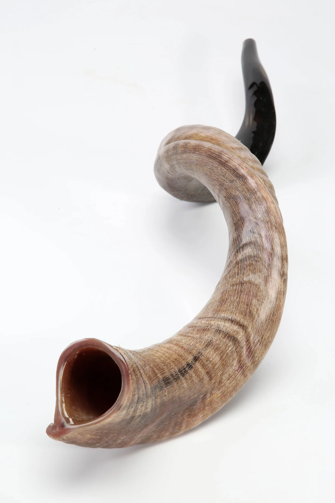
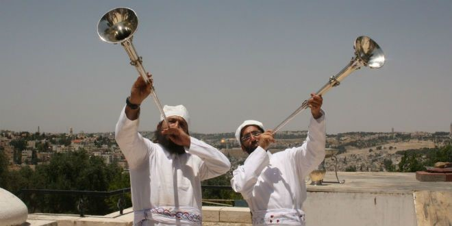

# The Trumpet Call of God

A trumpet blast is never incidental in Scripture. From the thunder at Sinai to the fall of Jericho, from a king's coronation to the alarm cried in a besieged city, the same handful of instruments keep showing up at the same kind of moment: God is about to act, and someone needs to know it now. That pattern doesn't stop at the end of the Old Testament — it escalates. This study traces the trumpet from its Hebrew and Greek vocabulary through its ordinary uses in Israel's life to the seven trumpets of Revelation and the "last trumpet" of the resurrection, asking what the instrument itself was, what it was culturally understood to mean each time it sounded, and what all of that was always pointing toward.

## Key Takeaways

*(This section follows the [Key Takeaways](../about/key-takeaways.md) format this site is
prototyping — see that page for what each part is for and why.)*

### Types & Prophecy

**Type.** No single trumpet is a type the way Melchizedek or the tabernacle are — a trumpet blast is a *pattern*, repeated across very different Old Testament settings, that consistently marks the same kind of moment: God moving decisively, and his people being summoned to respond. Revelation reads that pattern forward rather than starting a new one — seven trumpet-announced judgments that reuse Egypt's own plagues and Joel's locust-army imagery, climbing in intensity until the seventh trumpet announces what every earlier trumpet in Scripture was a smaller version of: God taking visible, final possession of his kingdom (Revelation 11:15).

**Prophecy.** Two direct verbal predictions anchor this study rather than an inferred pattern. Isaiah 27:13 states outright that "a great trumpet will be blown" to gather Israel's exiles back to worship at Jerusalem. Paul states 1 Corinthians 15:51-52 is a *mystery* — new revelation, not an inference from existing texts — that at "the last trumpet" the dead in Christ will be raised and the living transformed. Neither has happened yet; both are stated as certainties, not likelihoods.

### Lessons about Jesus

- The seventh trumpet's announcement — "the kingdom of the world has become the kingdom of our Lord and of his Christ" (Revelation 11:15, ESV) — reuses the exact pattern of a trumpet-announced coronation (1 Kings 1:34-39), now applied to Christ's kingdom over the whole earth rather than one throne in Jerusalem.
- Jesus himself sends out the gathering trumpet call at his return (Matthew 24:31): "he will send out his angels." The Cultural Backgrounds Study Bible notes that the Son of Man sending "his angels" — rather than an angel simply being sent — is itself a claim to deity in Jewish thought.[^nkjvcbsb-matt24]
- Paul's "mystery" about the resurrection (1 Corinthians 15:51) is stated as something the dead in Christ specifically will be raised *incorruptible* to receive — the trumpet doesn't just announce Christ's return, it delivers what his resurrection already secured for those who are his.

### Memory verses

> ✝️ 1 Corinthians 15:52 (ESV)
>
> 52 In a moment, in the twinkling of an eye, at the last trumpet. For the trumpet will sound, and
> the dead will be raised imperishable, and we shall be changed.

> ✝️ Revelation 11:15 (ESV)
>
> 15 Then the seventh angel blew his trumpet, and there were loud voices in heaven, saying, "The
> kingdom of the world has become the kingdom of our Lord and of his Christ, and he shall reign
> forever and ever."

### Be Transformed

- **Think:** every trumpet in Scripture assumes someone is listening for it. A watchman who sounds an alarm no one heeds still isn't at fault for the outcome (Ezekiel 33:3-6) — but a people trained to expect no trumpet at all won't recognize one when it sounds. Examine whether you're actually listening for what Scripture says is coming, or have quietly stopped expecting it.
- **Attitude:** 1 Corinthians 15:58 draws the conclusion right after this chapter's resurrection trumpet — "be steadfast, immovable, always abounding in the work of the Lord, knowing that in the Lord your labor is not in vain." The trumpet's certainty is meant to produce settled work now, not anxious speculation about timing.
- **Do:** name one place your life is currently arranged as though this world's ordinary order is permanent. The seventh trumpet says otherwise. Let that shape one concrete decision this week.

### Prayer

Lord — every trumpet you have ever sounded has meant the same thing: you are not silent, and you are not finished. You called Israel to your presence at Sinai, you leveled Jericho's wall, you seated a king with a blast that still echoes in your Son's own coronation. You have promised one more sound is coming — a last trumpet, at which the dead in Christ rise and the living are changed, and a seventh, at which your kingdom is openly, finally yours.

Until then, let me be found listening rather than asleep, working rather than idle, and steadfast rather than shaken by how long the wait feels. Amen.

## Scope: what this study covers, and what it doesn't

Leviticus 23:23-25 commands Israel to keep a day in the seventh month marked by *teruah* — the blast or shout a trumpet gave. That feast, its Hebrew name (Yom Teruah), and the word *teruah* itself already have a full word-study treatment on this site: [Feast of Trumpets: Yom Teruah](../feasts/trumpets.md). This study doesn't repeat that ground. What follows treats the trumpet as an instrument and a recurring biblical pattern across the whole canon — Sinai, the wilderness camp, the conquest, the monarchy, the prophets' warnings, and finally Revelation and the resurrection — with the feast noted only as one occasion among several where a trumpet sounded, not as this study's own subject.

## Two instruments, two Hebrew words

Ancient Israel used two distinct instruments for the "trumpet" English translations render with one word, and the distinction carries real weight.

שׁוֹפָר (*shofar*, H7782) is a ram's horn — a natural instrument, no two exactly alike, blown by anyone who could produce a sound from it. It announced the Day of Atonement and the start of Jubilee throughout the land (Leviticus 25:9), and it led Israel's march around Jericho (Joshua 6:4-5). Its Hebrew root sense is simply "horn," and the related noun יוֹבֵל (*yobel*, H3104, TWOT root 835e) — "ram" or "ram's horn" — is where "jubilee" gets its name: the Year of Jubilee is, at the level of its own vocabulary, "the ram's-horn year."[^esvsb-lev25]

חֲצֹצְרָה (*chatsotsrah*, H2689, TWOT root 726a), glossed "clarion," is a different instrument entirely — straight, metal, made of hammered silver, roughly two feet long with a flared end.[^esvsb-num10] Numbers 10:1-10 specifies exactly two of them, commissioned for a specific job:

> ✝️ Numbers 10:2-3 (ESV)
>
> 2 "Make two silver trumpets. Of hammered work you shall make them, and you shall use them for
> summoning the congregation and for breaking camp. 3 And when both are blown, all the
> congregation shall gather themselves to you at the entrance of the tent of meeting."

The Cultural Backgrounds Study Bible notes these were likely styled after Egyptian instruments of the same period — narrow-tubed, sharp-pitched trumpets known from Late Bronze Age Egypt, examples of which were found in Tutankhamun's own tomb, used there in both cultic and military settings.[^cbsb-num10] Josephus describes Israel's own pair as just over a foot long and flared, and pictures of captured temple trumpets survive on the Arch of Titus in Rome, carried among the plunder of Jerusalem's fall in AD 70.[^cbsb-num10] Silver trumpets were blown by Aaron's priestly line specifically (Numbers 10:8) and reappear in Phinehas's hand at the battle against Midian (Numbers 31:6) — a war context, not a worship one, showing the same instrument served both. The shofar and the silver trumpet were never interchangeable in function: the ram's horn belonged to Israel generally and to unrepeatable, dramatic moments (Sinai, Jericho, Jubilee); the silver trumpets belonged to the priesthood and to Israel's ordinary operating rhythm — assembling, marching, going to war, marking a feast day.

Revelation's Greek text draws no such distinction — **σάλπιγξ (*salpigx*, G4536)** covers every trumpet in the New Testament, from Paul's illustration about an army preparing for battle (1 Corinthians 14:8) to the seven angels of Revelation 8-11. The word itself carries no information about which Hebrew instrument (or neither) lies behind a given use; that has to come from context, not vocabulary — a caution worth keeping in mind before the "last trumpet" section below.

## What a trumpet call was for

Read across the Old Testament rather than assumed from a modern guess, five purposes recur, each with its own text rather than an unsupported assertion:

- **To gather the assembly.** "You shall use them for summoning the congregation" (Numbers 10:2-3, ESV) — a single, sustained blast called everyone; blowing just one trumpet called only the tribal leaders (10:4).
- **To move the camp.** A different pattern — short, staccato blasts, an *alarm* rather than a summons — signaled each tribal division in turn to break camp and march (Numbers 10:5-6).
- **To sound a war alarm.** "And when you go to war in your land against the adversary who oppresses you, then you shall sound an alarm with the trumpets, that you may be remembered before the LORD your God, and you shall be saved from your enemies" (Numbers 10:9, ESV).

    The trumpet here functions as prayer as much as signal — a plea attached to the sound itself.[^esvsb-num10] Gideon's three hundred each carried one into battle against Midian (Judges 7:16-22), and Joshua's seven priests carried rams' horns around Jericho for seven days before the city's wall fell at the sound (Joshua 6:4-5).
- **To mark sacred time.** "At your appointed feasts... you shall blow the trumpets... they shall be a reminder of you before your God" (Numbers 10:10, ESV); the ram's horn specifically announced the Day of Atonement and, every fifty years, the start of Jubilee — "you shall sound the loud trumpet... and proclaim liberty throughout the land" (Leviticus 25:9-10, ESV).
- **To announce a king.** When Solomon was anointed, the command was explicit: "Then blow the trumpet and say, 'Long live King Solomon!'" (1 Kings 1:34, ESV) — and when it happened, "they blew the trumpet, and all the people said, 'Long live King Solomon!'" (1:39, ESV). A trumpet blast was, in ancient Israel, the sound of a coronation.

One purpose isn't a summons at all but a warning, and it's the one the prophets return to most: "Is a trumpet blown in a city, and the people are not afraid?" (Amos 3:6, ESV). Zephaniah names an entire coming day by its trumpet: "a day of trumpet blast and battle cry" (Zephaniah 1:16, ESV). Joel opens his description of the Day of the LORD the same way — "Blow a trumpet in Zion; sound an alarm on my holy mountain" (Joel 2:1, ESV) — before describing an invading army "like the appearance of horses," advancing in unbroken ranks, darkening the sun and moon (2:4-10). That specific image — locust-like, horse-shaped, unstoppable, sun-darkening — is not incidental. It resurfaces, almost unchanged, under Revelation's fifth trumpet.

## The trumpet as theophany: Sinai

Before any of those ordinary uses existed, a trumpet had already announced the LORD's own arrival:

> ✝️ Exodus 19:16 (ESV)
>
> 16 On the morning of the third day there were thunders and lightnings and a thick cloud on the
> mountain and a very loud trumpet blast, so that all the people in the camp trembled.

The ESV Study Bible's note ties the sound directly to the sight: "all the sights... and sounds... signify the LORD's presence... a continual reminder to Israel that the LORD had spoken to Moses."[^esvsb-exod19] The trumpet here isn't summoning Israel to do anything yet — it is itself part of what God's presence sounds like, growing "louder and louder" as the mountain shakes (19:19). Every later use of a trumpet in Israel's worship — gathering the congregation, marking a feast, sounding Atonement — inherits this first association: the sound itself means *the LORD is here.* Hebrews 12:19 looks back on this same trumpet centuries later as part of what made Sinai a terrifying encounter believers under the new covenant are explicitly told they have not come to (Hebrews 12:18-24) — the sound remains, in the New Testament's own reckoning, the marker of God's dramatic, unmediated presence.

## The seven trumpets of Revelation

John received this vision while exiled on Patmos, an Aegean island Rome used to banish political prisoners (Revelation 1:9) — a detail John himself gives as evidence he shares in the very "tribulation" his readers are enduring, not a remote seer writing from safety.[^esvsb-rev1] What follows is addressed to seven specific, named congregations in Asia Minor (chs. 2-3) already under real pressure before a single trumpet sounds. The trumpet judgments are not this book's starting point; they're the second half of a vision whose first half is Christ's own diagnosis of, and promises to, churches actually reading it.

Revelation structures its judgments in four cycles — seven letters, seven seals, seven trumpets, seven bowls — and the trumpets are the third.[^esvsb-rev8] They open in heaven, not on earth: seven angels are given seven trumpets in response to the prayers of the saints, offered up with incense from a golden altar (Revelation 8:2-5), before the first one sounds. What follows deliberately reuses Egypt's own plagues, escalated and directed at "those who dwell on the earth" rather than one nation:

| Trumpet | Revelation | Result | Old Testament echo |
|---|---|---|---|
| First | 8:7 | Hail, fire, and blood cast on the earth — a third of it, and all green grass, burned up | The seventh plague on Egypt: hail mixed with fire (Exodus 9:23-24) |
| Second | 8:8-9 | A burning mountain cast into the sea — a third of the sea turned to blood, a third of sea life and ships destroyed | The first plague: the Nile turned to blood (Exodus 7:20-21) |
| Third | 8:10-11 | A burning star, "Wormwood," falls on a third of the rivers and springs, poisoning them | The same water-to-blood plague, extended to fresh water |
| Fourth | 8:12 | A third of the sun, moon, and stars struck, darkening a third of day and night | The ninth plague: darkness over the land (Exodus 10:21-22) |
| Fifth (1st woe) | 9:1-11 | Locusts from the abyss torment (not kill) those without God's seal, for five months | The eighth plague, locusts (Exodus 10:12-15) — but their shape and battle-array come from Joel's locust army (Joel 2:4-11), not Exodus |
| Sixth (2nd woe) | 9:13-21 | Four bound angels released at the Euphrates lead a vast army that kills a third of mankind | — |
| Seventh (3rd woe) | 11:15-19 | "The kingdom of the world has become the kingdom of our Lord and of his Christ" | The coronation-trumpet pattern of 1 Kings 1:34-39, now cosmic |

The Cultural Backgrounds Study Bible tracks this Exodus pattern across all three of Revelation's judgment cycles — trumpets, and again in the bowls of chapter 16 — concluding that "Revelation is not simply recounting what happened in Moses's day; it is depicting judgments on the world in familiar biblical terms."[^cbsb-rev8] The fifth trumpet is the clearest case of borrowed imagery doing real interpretive work: John's locusts are "like horses prepared for battle," crowned, with human faces, women's hair, and a king named **Ἀβαδδών / Ἀπολλύων** — Hebrew and Greek both meaning "Destroyer" (Revelation 9:7-11). None of that description comes from Exodus's locust plague, which is simply locusts. It comes from Joel 2:4-11's war-horse imagery, describing what Joel himself calls Yahweh's own army executing the Day of the LORD. Revelation doesn't invent a new locust; it identifies which prophetic locust-army this is.

The escalation is deliberate and stated, not merely observed: where the first four seals had touched "a fourth" of the earth (Revelation 6:8), the first four trumpets touch "a third" — worse, but still restrained, "giving foretastes of total devastation to come if rebels ignore his warnings."[^esvsb-rev8] The seventh trumpet is where restraint ends and the pattern this whole study has traced reaches its own conclusion: a trumpet, sounding a coronation, exactly as one sounded for Solomon a thousand years earlier — except this throne is the whole world's, and this reign has no successor to wait for. Revelation 10:7 marks the same moment from a different angle, calling it the point at which "the mystery of God would be fulfilled, just as he announced to his servants the prophets" (ESV) — every trumpet warning the prophets ever gave was building toward this specific sound.

## "At the last trumpet": three texts, not automatically one event

Three New Testament passages use trumpet language for a future gathering, and popular reading often merges them into a single moment. The vocabulary invites that — all three use forms of the same word, *salpigx* — but vocabulary alone doesn't establish that. Read on their own terms, each text names a different audience and a different content.

**1 Corinthians 15:51-53 and 1 Thessalonians 4:16-17** address the church specifically — "we shall not all sleep, but we shall all be changed" (1 Corinthians 15:51, ESV); "the dead in Christ will rise first. Then we who are alive, who are left, will be caught up together with them" (1 Thessalonians 4:16-17, ESV). The ESV Study Bible identifies the Greek verb behind "caught up" as **ἁρπάζω** (*harpazō*, "to seize suddenly, snatch away") — the term the word "rapture" translates — and notes the three sounds Paul describes (a cry of command, an archangel's voice, "the trumpet of God") together summon the dead to rise, before the living join them in the air.[^esvsb-1thess4] Nothing in either passage mentions judgment on unbelievers, a tribulation, or the earth itself; the entire scene concerns believers already united to Christ.

**Matthew 24:29-31** is different in every one of those respects. It comes explicitly "immediately after the tribulation of those days" (24:29, ESV) — a stated chronological marker neither Corinthians nor Thessalonians carries — and describes Christ's visible appearing "with power and great glory," at which his angels "will gather his elect from the four winds" (24:30-31). The Cultural Backgrounds Study Bible traces this trumpet image to Jewish end-time expectation rooted in Isaiah 27:12-13 — a passage naming Israel specifically: exiled Israelites "lost in the land of Assyria" and "driven out to the land of Egypt," gathered by a "great trumpet" to worship at Jerusalem (Isaiah 27:13, ESV).[^nkjvcbsb-matt24] That is a regathering of scattered Israel to a specific place, at a stated point after tribulation — not the same shape of event as believers of every nation caught up to meet Christ "in the air."

**Revelation 11:15-19**, the seventh trumpet studied above, differs from both: it is the last of a numbered judgment sequence falling on "those who dwell on the earth" (8:13), and its content is a kingdom announcement and a reckoning — "the time for the dead to be judged... and for destroying the destroyers of the earth" (11:18, ESV) — not a resurrection of the righteous dead in Christ.

Not every source treats these three as sharply distinct. The NIV Biblical Theology Study Bible's note on 1 Corinthians 15:52 lists Isaiah 27:13, Joel 2:1, Matthew 24:31, 1 Thessalonians 4:16, and Revelation's trumpets together as one family of "trumpet announces the Lord's coming" texts, without separating them by timing.[^nivbtsb-1cor15] That's true as far as it goes — all of them do draw on the same Old Testament pattern this study has traced from Sinai onward, and Revelation 10:7's "mystery of God," fulfilled at the seventh trumpet, even echoes the same word Paul uses for the resurrection ("I tell you a mystery," 1 Corinthians 15:51) — a real point of contact, not one to paper over. But sharing an image and a vocabulary word is not the same as sharing an event. Paul's audience, timing, and content point one way; Matthew's point another; Revelation's a third. On a dispensational reading, which keeps the church's hope distinct from Israel's promised regathering and from the tribulation judgments poured out on an unbelieving world, that's exactly what the text's own details predict: three trumpets, doing three different jobs, because a shared instrument was never a shared event to begin with — no more than a shofar at Jericho and a shofar at Jubilee were the same occasion because they used the same kind of horn.

## Then and now

What transcends every one of these texts: a trumpet in Scripture is never ornamental. It marks the specific moment God has decided to act, and the appropriate human response is never curiosity about the sound itself but readiness for what it announces — worship at Sinai, obedience in the camp, resistance in war, celebration at a coronation, repentance at a warning. What's tied to its own moment is which instrument, which occasion, which audience: a ram's horn calling one nation to atonement is not the same event as silver trumpets breaking camp, and neither is the same event as the last trumpet raising the dead in Christ. The consistent principle underneath all of it is Amos's own question, aimed originally at a besieged city but true of every trumpet this study has traced: when the trumpet sounds, something real is happening, and pretending otherwise was never a live option (Amos 3:6).

## Discussion questions

1. A shofar and a silver trumpet were never interchangeable in ancient Israel — different material, different maker, different job. Where do you collapse things Scripture actually keeps distinct, the way popular reading often merges the "last trumpet" texts?
2. Revelation's fifth trumpet borrows its locust imagery from Joel rather than from Exodus's own locust plague. What does it change to read Revelation as identifying an existing prophecy rather than inventing new symbolism?
3. The seventh trumpet's coronation language deliberately echoes 1 Kings 1:34-39. Does thinking of Christ's future reign as a coronation — a specific, sound-marked moment — change how you picture "the kingdom of God" versus treating it as a vague future state?
4. Numbers 10:9 ties the war trumpet to being "remembered before the LORD" — the sound is described as a kind of prayer. Where in your own life could a concrete, audible act (not just an internal feeling) function the same way?
5. Amos asks whether a trumpet can sound in a city without the people trembling. What would it look like for you to actually tremble — not just intellectually agree — at what Scripture says is still coming?

## References & Recommended Reading

- **ESV Bible** (Crossway) — primary translation quoted throughout, per this site's translation
  conventions. **World English Bible (WEB)**, queried from this repo's own text database, used
  for initial research passages.
- **MACULA Greek Linguistic Datasets (SBLGNT)** and **MACULA Hebrew Linguistic Datasets (WLC)**,
  queried via this repo's `references/build/bible-text.db` — source of every Strong's number,
  gloss, and Greek/Hebrew form cited above, including the full NT concordance for *salpigx*
  (G4536) and OT concordance for *shofar* (H7782) behind this study's scoping.
- ***Theological Wordbook of the Old Testament*** (TWOT), ed. R. Laird Harris, Gleason L. Archer
  Jr., and Bruce K. Waltke (Moody Publishers) — roots 2449c (*shofar*), 726a (*chatsotsrah*), and
  835e (*yobel*), consulted via this repo's committed TWOT Strong's-number map.
- ***ESV Study Bible*** (Crossway, 2016) — consulted last, as a check on conclusions already
  reached from the text. Source of the Numbers 10 silver-trumpet background (construction,
  Josephus citation, the "blowing" vs. "alarm" distinction), the Exodus 19 Sinai note, the
  Leviticus 25 Jubilee/*yobel* word connection, the Revelation 1:9 Patmos background, the
  four-cycle structure of Revelation's judgments, and the *harpazō* word study at
  1 Thessalonians 4:16-17.
- ***NIV Cultural Backgrounds Study Bible*** and ***NKJV Cultural Backgrounds Study Bible***
  (Zondervan, ed. John H. Walton and Craig S. Keener) — source of the Numbers 10 silver-trumpet
  construction detail (Egyptian parallels, Tutankhamun's tomb), the Exodus-plague/trumpet/bowl
  parallel chart behind this study's Seven Trumpets table, the Joel-locust background to
  Revelation 9's fifth trumpet, and the Isaiah 27:12-13 background to Matthew 24:31.
- ***NIV Biblical Theology Study Bible*** (Zondervan, 2018), gen. ed. D. A. Carson — consulted for
  the 1 Corinthians 15:52 cross-reference list, engaged directly in the "last trumpet" section
  above rather than simply cited, since it reads those texts as one thematic family rather than
  drawing the timing distinction this study argues for.
- **Flavius Josephus**, *Jewish Antiquities* 3.291 — description of the silver trumpets' physical
  dimensions, consulted via the ESV Study Bible's citation.
- Related study on this site: [Feast of Trumpets: Yom Teruah](../feasts/trumpets.md) — the full
  word study on *teruah* and the Leviticus 23 feast this study deliberately doesn't repeat.

[^esvsb-lev25]: *ESV Study Bible*, note on Leviticus 25:8-12.
[^esvsb-num10]: *ESV Study Bible*, note on Numbers 10:1-10.
[^cbsb-num10]: *NIV Cultural Backgrounds Study Bible* / *NKJV Cultural Backgrounds Study Bible*, note on Numbers 10:2.
[^esvsb-exod19]: *ESV Study Bible*, note on Exodus 19:16-20.
[^esvsb-rev1]: *ESV Study Bible*, note on Revelation 1:9.
[^esvsb-rev8]: *ESV Study Bible*, notes on Revelation 8:2-11:18 and 8:6-11:18.
[^cbsb-rev8]: *NIV Cultural Backgrounds Study Bible* / *NKJV Cultural Backgrounds Study Bible*, note on Revelation 8:7-9:19.
[^esvsb-1thess4]: *ESV Study Bible*, note on 1 Thessalonians 4:16-17.
[^nkjvcbsb-matt24]: *NKJV Cultural Backgrounds Study Bible*, note on Matthew 24:31.
[^nivbtsb-1cor15]: *NIV Biblical Theology Study Bible*, note on 1 Corinthians 15:52.
