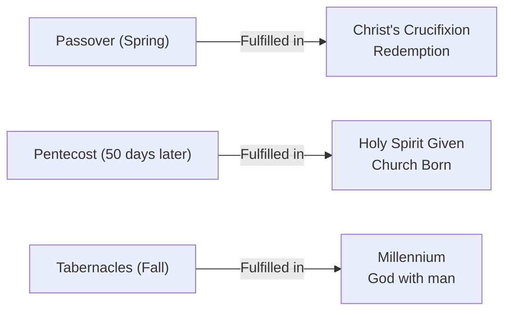
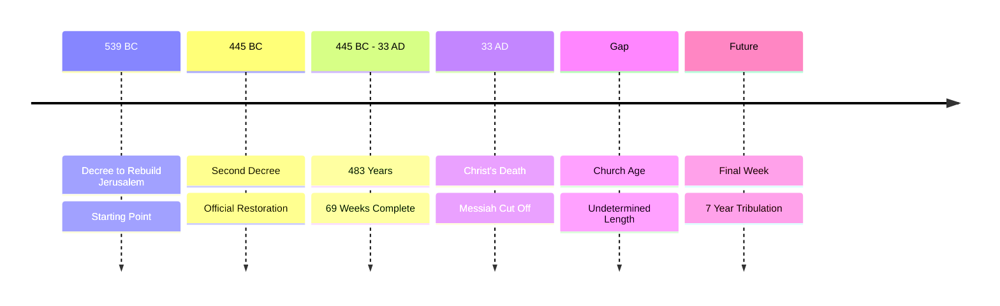
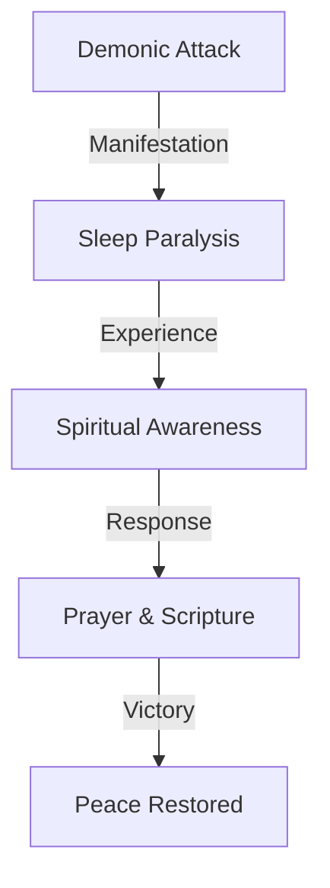

# Contributing to Biblical Studies

Thank you for wanting to contribute! This guide makes it easy to add or edit content.

## Quick Start

### For Study Files

All studies go in `/docs/studies/` as markdown files. Each file needs **frontmatter** (metadata at the top) plus your content.

### Template

Copy this template and fill in your content:

```markdown
---
title: "Your Study Title"
year: 2024
category: "prophecy"
description: "One-line summary of this study"
tags: ["end-times", "timeline", "prophecy"]
draft: false
bible_references: ["Daniel 12:11", "Matthew 24:15"]
essene_year: 3972
gregorian_year: 2024
---

# Your Study Title

Your content starts here in markdown...

## Section Heading

More content with **bold**, *italic*, `code`, etc.

### Subsection

- Bullet points
- Work great
- For lists

> Quotes are supported too
```

## Field Guide

| Field | Required | Notes |
|-------|----------|-------|
| `title` | ✅ Yes | Study title (appears in timeline and pages) |
| `year` | ❌ No | Display year for timeline (can be Gregorian or Essene - clarify in content) |
| `category` | ❌ No | `prophecy`, `dreams`, `feasts`, `investigation`, `sermons`, or `other` |
| `description` | ❌ No | Short summary (1-2 sentences) shown in previews |
| `tags` | ❌ No | Array of tags for filtering (e.g., `["resurrection", "end-times"]`) |
| `draft` | ❌ No | Set to `true` to hide from site (default: `false`) |
| `bible_references` | ❌ No | Array of scripture references (e.g., `["John 3:16", "Romans 6:9"]`) |
| `gregorian_year` | ❌ No | Precise year in Gregorian calendar (e.g., 1948, 2024) - used for Gregorian timeline view |
| `essene_year` | ❌ No | Precise year in Essene calendar (Year 0 = Adam's creation) - used for Essene timeline view |

## Examples

### Prophecy Timeline Event

```markdown
---
title: "The Rapture of the Church"
year: 2026
category: "prophecy"
description: "Understanding when and how the rapture occurs according to Scripture"
tags: ["rapture", "eschatology", "1-thessalonians-4"]
---

# The Rapture of the Church

The rapture, also called the harpazo or snatching away...
```

### Dream Analysis

```markdown
---
title: "Sleep Paralysis and Spiritual Warfare"
category: "dreams"
description: "Biblical perspective on sleep paralysis and spiritual attacks during sleep"
tags: ["dreams", "spiritual-warfare", "sleep"]
---

# Sleep Paralysis and Spiritual Warfare

Many people experience sleep paralysis...
```

### Historical Study (No Year)

```markdown
---
title: "Role of Christians in Deliverance Ministry"
category: "investigation"
description: "Examining biblical support for deliverance and healing"
tags: ["deliverance", "ministry", "healing"]
---

# Role of Christians in Deliverance Ministry

In contemporary Christian practice...
```

## File Naming

- Use lowercase with underscores: `my_study_title.md`
- Make it descriptive: ❌ `study1.md` → ✅ `rapture_eschatology.md`
- Keep it short: 3-5 words

## Editing Existing Files

1. Open the file in `/docs/studies/`
2. Edit frontmatter if needed (title, year, tags, etc.)
3. Edit the markdown content
4. Save

Changes are reflected instantly in the dev server.

## Adding to Timeline

**For events to appear on the interactive timeline:**
1. Include a `year` field in frontmatter
2. The event will auto-sort by year
3. Click the event in the timeline to see your full study

**Without a year:**
- Study appears in collections/listings
- Not shown on timeline
- Perfect for topics without specific dates

## Markdown Formatting

All standard markdown works:

```markdown
# Heading 1
## Heading 2
### Heading 3

**Bold text**
*Italic text*
`inline code`

- Bullet lists
- Item 2
- Item 3

1. Numbered lists
2. Item 2

> Blockquotes for emphasis

[Link text](https://example.com)


```

## Code Blocks

```markdown
\```python
def hello():
    print("Hello, world!")
\```
```

## Admonitions (Special Boxes)

```markdown
> [!NOTE]
> This is a note

> [!WARNING]
> This is a warning

> [!TIP]
> This is a helpful tip
```

## Tables

```markdown
| Header 1 | Header 2 |
|----------|----------|
| Cell 1   | Cell 2   |
| Cell 3   | Cell 4   |
```

## Process

### Individual Contributors

1. Create/edit a file in `/docs/studies/`
2. Add proper frontmatter
3. Write your content in markdown
4. Save and submit

### Maintainers

1. Review frontmatter completeness
2. Check for spelling/grammar
3. Verify links work
4. Merge/deploy

## Tips

✅ **Do:**
- Use descriptive titles
- Add years for timeline events
- Include tags for related content
- Use clear section headings
- Link to related studies

❌ **Don't:**
- Forget frontmatter
- Leave fields blank without reason
- Use special characters in filenames
- Add multiple studies to one file

## Questions?

If you're unsure about anything:
1. Check existing files in `/docs/studies/` for examples
2. Reference the Template section above
3. Ask in issues or discussions

## Workflow Example

**You want to add a study about Feasts:**

1. Create file: `docs/studies/feasts_and_prophecy.md`

2. Add this content:
```markdown
---
title: "Biblical Feasts and Prophecy"
year: 1948
category: "feasts"
description: "How Jewish feasts predict and fulfill messianic prophecy"
tags: ["feasts", "passover", "pentecost", "tabernacles"]
---

# Biblical Feasts and Prophecy

The Old Testament feasts were shadows of coming events...

## Passover

Speaks of Christ's redemption...

## Pentecost

Represents the Holy Spirit...
```

3. Save the file

4. Check `http://localhost:4321/` - it appears on the site automatically!

5. Timeline sorts by year if included

That's it! The system does the heavy lifting.

## Structure

```
docs/
├── studies/
│   ├── prophecy_events_times.md      ← Existing studies
│   ├── rapture_eschatology.md         ← Your new study
│   ├── feasts_and_prophecy.md         ← Your new study
│   └── ...
├── CONTRIBUTING.md                     ← You are here
└── ...
```

## Diagrams and Visualizations

Create diagrams using **Mermaid** (for quick sketches) or **React components** (for interactive viz). Both integrate seamlessly with Astro.

### Mermaid in Markdown (Easiest)

Add a code block with `mermaid` language identifier directly in your markdown:

#### Timeline Diagram
```markdown
\`\`\`mermaid
timeline
    title End Times Prophecy
    1948 : Israel Reborn : Modern State Established
    1967 : Jerusalem Reclaimed : Six Day War
    2024 : Present Day : Signs Increase
    TBD : Rapture : Sudden Removal of Church
    TBD : Tribulation : Seven Years of Judgment
    TBD : Second Coming : Christ Returns
\`\`\`
```

#### Flowchart (Prophecy Dependencies)
```markdown
\`\`\`mermaid
flowchart TD
    A[Old Testament Prophecies] -->|Messianic| B[Jesus Christ]
    A -->|Eschatological| C[End Times Events]
    B --> D[Church Age]
    D --> E[Rapture]
    E --> F[Tribulation Period]
    F --> G[Second Coming]
    G --> H[Millennium Kingdom]
\`\`\`
```

#### Concept Map (Relationships)
```markdown
\`\`\`mermaid
graph LR
    A[Dispensations] -->|Ages| B[Mosaic Law]
    A -->|Ages| C[Grace]
    A -->|Ages| D[Kingdom]
    B --> E[Israel]
    C --> F[Church]
    D --> G[Eternal State]
\`\`\`
```

#### Comparison (Pretrib vs Posttrib)
```markdown
\`\`\`mermaid
graph TD
    subgraph Pretribulational
        A["Rapture before<br/>Tribulation starts"]
        B["Church escapes<br/>God's wrath"]
        C["Imminent return"]
    end
    subgraph Posttribulational
        D["Rapture at end<br/>of Tribulation"]
        E["Church goes<br/>through tribulation"]
        F["Literal 1000 years"]
    end
\`\`\`
```

### React Components (Interactive)

For interactive diagrams, use React components. Example:

#### in `src/components/ProphecyComparison.jsx`:

```jsx
export default function ProphecyComparison() {
  return (
    <div style={{ display: 'grid', gridTemplateColumns: '1fr 1fr', gap: '2rem' }}>
      <div style={{ padding: '1rem', border: '2px solid #3b82f6', borderRadius: '0.5rem' }}>
        <h3>Pretribulational View</h3>
        <ol>
          <li>Church Rapture (sudden)</li>
          <li>7-Year Tribulation begins</li>
          <li>Antichrist rises</li>
          <li>Christ returns with Church</li>
          <li>1000-Year Millennium</li>
        </ol>
      </div>
      <div style={{ padding: '1rem', border: '2px solid #ef4444', borderRadius: '0.5rem' }}>
        <h3>Posttribulational View</h3>
        <ol>
          <li>Church continues through Tribulation</li>
          <li>Church perseveres under persecution</li>
          <li>Rapture at end of Tribulation</li>
          <li>Christ returns immediately after</li>
          <li>1000-Year Millennium begins</li>
        </ol>
      </div>
    </div>
  );
}
```

#### Use in your markdown:

```astro
---
import ProphecyComparison from '../components/ProphecyComparison.jsx';
---

# Rapture Theology Debate

<ProphecyComparison client:load />

Both views hold to the literal return of Christ...
```

## When to Use Each

| Use Mermaid If | Use React If |
|---|---|
| Quick sketch in markdown | Needs user interaction |
| Timeline or flow | Requires dynamic data |
| Concept relationships | Complex styling needed |
| Simple visualization | Animation needed |
| No dependencies | Showing multiple states |

## Mermaid Examples for Bible Studies

### Feast Fulfillment


### Daniel's 70 Weeks


### Spiritual Warfare (Dream Context)


## Best Practices

✅ **Do:**
- Use Mermaid for relationships and flows in markdown
- Keep diagrams focused on one concept
- Label events with Scripture references when relevant
- Use clear, biblical terminology

❌ **Don't:**
- Make diagrams too complex (use multiple simple ones)
- Overuse colors in React components
- Create interactive components for static content
- Leave diagrams unexplained in text

## Diagram Syntax Help

- **Mermaid docs:** https://mermaid.js.org
- **Flowchart guide:** https://mermaid.js.org/syntax/flowchart.html
- **Timeline guide:** https://mermaid.js.org/syntax/timeline.html
- **Live editor:** https://mermaid.live

## Auto-Features

When you add a study with frontmatter:
- ✅ Timeline auto-sorts by year
- ✅ Collections auto-load in Astro
- ✅ Search can index tags
- ✅ Categories auto-organize content
- ✅ Draft flag for work-in-progress
- ✅ Hot reload for instant preview
- ✅ Mermaid diagrams render automatically
- ✅ React components hydrate on demand

No build scripts, no special tools—just markdown with metadata (and optional diagrams).
