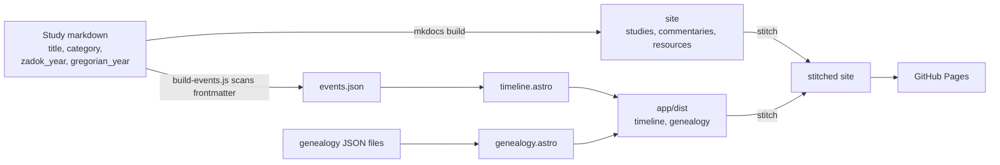
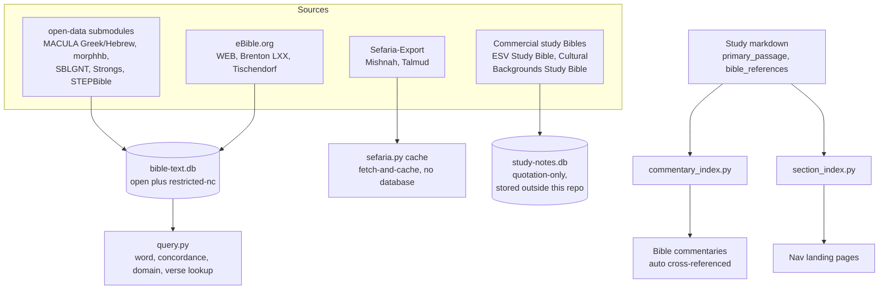

# How This Site Is Built

This site is two independent tools stitched into one deploy, plus a content-authoring pipeline that produces what they serve. None of what's below is required reading to use the site — it's here for anyone curious how a personal Bible-study project ended up with its own Hebrew/Greek word-study database and Mishnah lookup tool.

## Build & deploy

**[mkdocs-material](https://squidfunk.github.io/mkdocs-material/)** serves every study, commentary, and resource page — everything under `docs/content/`. **[Astro](https://astro.build/)** serves exactly two interactive tools: the prophetic timeline and the genealogy viewer, nothing else. A single GitHub Actions workflow builds both and stitches Astro's output into mkdocs' site directory before deploying:

`docs/data/events.json` is the deliberate seam between the two systems: a small Node script (`app/scripts/build-events.js`) reads every study's `zadok_year`/`gregorian_year` frontmatter and writes a flat JSON file Astro's timeline imports at build time. Neither system reaches into the other's internals — that's what let the site go from a single Astro app to this split without rewriting the studies themselves. (The full design rationale, if you want the history: `docs/superpowers/specs/2026-07-09-mkdocs-astro-split-design.md`.)

mkdocs-material extras actually in use here: **awesome-pages** (nav builds itself from the directory tree — no manual nav config), **admonitions** (the `!!! note` boxes), **Mermaid diagrams** (this one, via `pymdownx.superfences`), and the light/dark toggle in the header.

## Writing a study: the develop-bible-study skill

New studies aren't just written — they go through a defined process: scope the passage and genre, work through historical context, literary context, and original-language word studies *before* any theology or application gets drafted (the skill's own stated rule: reaching for a conclusion before establishing context means stopping and going back a phase). Every study ends with a **References & Recommended Reading** section naming every source actually used, restricted or copyrighted ones included by name with attribution.

Progress on an in-flight study is tracked in a structured YAML file (`references/study-state/<slug>.yml`) — not because the process needs bureaucracy, but so a study can be picked back up in a later session (or by a different agent) without re-deriving where the research left off.

## The data pipeline behind word studies and cross-references

None of this is part of the deployed site — it's local tooling under `references/build/` that *produces* content (Hebrew/Greek word data, cross-reference links) which then gets committed as ordinary markdown/JSON:

Two databases, two different safety postures, on purpose: `bible-text.db` holds open and restricted-non-commercial data and lives inside this repo's directory tree (gitignored, regenerable). `study-notes.db` holds commercial study-Bible commentary — every source in it is quotation-only — and is built **entirely outside** this repo, on the machine's own storage, never even gitignored-but-present. `sefaria.py` doesn't use either database: Mishnah/Talmud addressing (chapter + mishnah/daf) doesn't fit a Bible book/chapter/verse schema, so it's a standalone fetch-and-cache instead.

The two `*_index.py` generators solve the same problem in the same way: scan this repo's own content frontmatter, write markdown directly into `docs/content/`, and only ever touch a clearly delimited auto-generated section (`<!-- ...-index:auto-start/end -->`) so hand-written prose around them survives re-runs. `commentary_index.py` links a Bible chapter to every study that treats it; `section_index.py` generates the landing page for every directory (fixing what would otherwise be mkdocs falling through to the first alphabetical page when you click a nav section with nothing to show).

There's also an in-progress, not-yet-integrated piece: `references/build/twot/`, an OCR/segmentation pipeline for the Theological Wordbook of the Old Testament. Its committed output today is just `twot_strongs_map.json` (Strong's number → TWOT root/lemma/gloss); the fuller entry-discussion-text extraction is real work-in-progress, not wired into anything above yet.

## Quick reference

| Tool | What it does | Docs |
|---|---|---|
| `mkdocs.yml` | Builds `docs/content/` into the main site | [CONTENT_GUIDE.md](https://github.com/ding0t/bible_studies/blob/main/docs/CONTENT_GUIDE.md) |
| `app/` | Timeline + genealogy viewer (Astro + React) | `app/docs/` |
| `.claude/skills/develop-bible-study/` | The exegesis-then-hermeneutics writing process | [SKILL.md](https://github.com/ding0t/bible_studies/blob/main/.claude/skills/develop-bible-study/SKILL.md) |
| `references/build/build.py` | Builds `bible-text.db` from open Bible-text/lexicon sources | [references/README.md](https://github.com/ding0t/bible_studies/blob/main/references/README.md) |
| `references/build/query.py` | CLI for word/concordance/domain/verse lookups against `bible-text.db` | same |
| `references/build/sefaria.py` | Fetches/caches Jewish literature (Mishnah, Talmud) from Sefaria | [jewish-sources.md](jewish-sources.md) |
| `references/build/build_study_notes.py` | Builds `study-notes.db` from commercial study Bibles (external storage) | [references/README.md](https://github.com/ding0t/bible_studies/blob/main/references/README.md) |
| `references/build/commentary_index.py` | Auto-links Bible commentary chapters to the studies that treat them | same |
| `references/build/section_index.py` | Generates nav landing pages for every content section | same |
| `.github/workflows/deploy.yml` | Builds mkdocs + Astro, stitches them, deploys to GitHub Pages | — |

## Source

Like every study on this site, the code is public: [github.com/ding0t/bible_studies](https://github.com/ding0t/bible_studies).
