# Ancient Texts, Manuscripts, and Inscriptions Validating Scripture

Sun Tzu wrote *The Art of War* around the fifth century BC. Until 1972, the earliest copy anyone had
was a Song dynasty compilation from about AD 1080 — a gap of roughly sixteen centuries between the
writing and the oldest surviving witness to it. Nobody treats that as a reason to doubt the book.

The New Testament was written between roughly AD 50 and AD 95. A fragment of John's Gospel survives
that was copied within about a generation of the ink drying on the original, and around 5,800 Greek
manuscripts of the New Testament survive in total. No other work from the ancient world is attested
anything like this well — and none of them was actively hunted.

That is the double claim this study is about: Scripture is preserved far better than the classical
texts we accept without argument, *and* it was preserved through centuries of deliberate attempts to
destroy it.

## What the evidence shows

The catalogue below runs to twenty-four artifacts. Six things come out of it:

1. **Textual reliability.** Manuscripts show the biblical text transmitted accurately across centuries.
2. **Historical accuracy.** Extra-biblical sources corroborate biblical accounts — including hostile and neutral witnesses with no interest in helping.
3. **Early dating.** Early papyri (P52, P46, P66) place the New Testament in the first and second centuries, not a later legendary period.
4. **Widespread knowledge.** Multiple independent sources mention Christ, showing he registered on people who were not his followers.
5. **Prophetic fulfilment.** The Dead Sea Scrolls put messianic prophecies in writing demonstrably before Christ.
6. **Historical figures.** Inscriptions confirm biblical kings, priests and officials — David, Hezekiah, Pilate, Caiaphas.

The pattern holds across categories: the Dead Sea Scrolls validate Old Testament textual accuracy,
early papyri establish New Testament dating, inscriptions confirm named individuals, and hostile
sources such as Tacitus and the Talmud concede Jesus's existence while disputing everything else
about him.

## How the Bible compares to other ancient works

Two objective measures apply to any ancient text: how many copies survive, and how long the gap is
between composition and the earliest surviving copy. On both, Scripture is an outlier.

| Work | Written | Earliest surviving copy | Gap | Surviving manuscripts |
|---|---|---|---|---|
| **New Testament** | c. AD 50-95 | P52, c. AD 125-150 | **~40-60 years** | **~5,800 Greek**, plus thousands more in Latin, Syriac, Coptic and other versions |
| Sun Tzu, *The Art of War* | c. 5th c. BC | Yinqueshan bamboo slips, c. 140-118 BC (found 1972) | ~350 years | A handful of early witnesses; before 1972 the oldest complete text was c. AD 1080 |
| Homer, *Iliad* | c. 8th c. BC | c. 3rd c. BC fragments | ~500 years | ~1,900 |
| Tacitus, *Annals* | c. AD 116 | 9th c. AD | ~750 years | **Books 1-6 survive in a single manuscript**; books 11-16 in one other; books 7-10 and 17-18 are lost entirely |
| Shakespeare | 1590s-1613 | First Folio, 1623 | ~10-30 years | Printed, not copied by hand |

Two honest caveats, because this comparison is often pushed further than it will go.

**The playing field isn't level, and that cuts both ways.** The New Testament was copied by a
religious community with enormous motive and reach; Tacitus was copied by a handful of monks who
found him useful. More copies is a real advantage for reconstructing a text, but it is partly a fact
about Christianity's spread, not only about the text's quality.

**Shakespeare is the interesting case, not the easy one.** He is four centuries old and was
*printed* rather than hand-copied, and editors still argue over genuine textual cruxes — the quarto
and folio texts of *Hamlet* and *King Lear* differ substantially, and famous lines rest on editorial
emendation. If a printed English text from 1623 needs this kind of reconstruction, the discipline
applied to Scripture is not special pleading. It is the ordinary work of establishing any old text,
carried out on the best-attested one we have.

## Textual criticism: how we actually know

Textual criticism is the discipline of comparing surviving manuscripts to recover what the original
said. It is not a threat to Scripture's reliability; it is the method by which that reliability is
demonstrated. Understanding how it works comes before trusting or dismissing its results.

**The problem is an embarrassment of riches, not a shortage.** Because so many manuscripts survive,
scholars catalogue several hundred thousand points of variation between them. That number sounds
alarming until you see what it consists of. The overwhelming majority are spelling differences and
word-order changes that make no difference in translation — Greek word order is flexible, so
"Jesus loves Paul" and "Paul, Jesus loves" are the same sentence and count as a variant. A very
small fraction are both meaningful and genuinely viable as the original reading.

Even Bart Ehrman, the best-known popular sceptic on this subject, concedes the point in the appendix
to *Misquoting Jesus*: "essential Christian beliefs are not affected by textual variants in the
manuscript tradition of the New Testament."

**Fewer manuscripts would mean fewer known variants and less certainty, not more.** Tacitus has
almost no variants recorded for *Annals* 1-6 — because there is only one manuscript to disagree
with. Silence there is ignorance, not accuracy.

### This site works these cases rather than asserting them

Several textual questions are worked through elsewhere on this site, with the manuscript evidence
laid out rather than summarised:

- **Psalm 145's missing line.** The psalm is an alphabetic acrostic, and the *nun* verse is absent
  from the Masoretic Text — the structure itself reveals the gap. The line survives in the
  Septuagint and the Dead Sea Scrolls. See [Biblical Numerology](numerology.md#when-the-acrostic-catches-a-missing-line),
  which also shows how nine English versions handle it differently.
- **Psalm 22:16 — "pierced" or "like a lion"?** A messianic proof text that turns on a single
  Hebrew word, where the Masoretic Text and the Septuagint diverge. Worked through in
  [Bible Prophecy Essentials](../last-things/prophecy-essentials.md).
- **Luke 22:19b-20.** One important early witness, Codex Bezae, omits material the majority text
  includes — one of the "Western non-interpolations." See
  [The Last Supper and the Cups of Passover](../feasts/last-supper-four-cups.md).
- **Revelation 13:18 — 666 or 616?** A genuine variant, and the earliest commentator on the verse
  already knew about it. See [Biblical Numerology](numerology.md#the-one-number-scripture-asks-us-to-calculate).

Each of these is a real difficulty, none is hidden, and none of them changes a doctrine. That is
what the manuscript situation actually looks like up close.

## Persecuted and preserved

What makes the survival remarkable is not merely age. It is that the text was repeatedly and
deliberately targeted for destruction — and Scripture records the first attempt itself.

**Jehoiakim burns Jeremiah's scroll (c. 604 BC).** The king of Judah has the prophet's scroll read
aloud to him, and destroys it as it is read:

> ✝️ Jeremiah 36:23 (ESV)
>
> 23 As Jehudi read three or four columns, the king would cut them off with a knife and throw them
> into the fire in the fire pot, until the entire scroll was consumed in the fire that was in the
> fire pot.

The response is the pattern in miniature:

> ✝️ Jeremiah 36:32 (ESV)
>
> 32 Then Jeremiah took another scroll and gave it to Baruch the scribe, the son of Neriah, who
> wrote on it at the dictation of Jeremiah all the words of the scroll that Jehoiakim king of Judah
> had burned in the fire. And many similar words were added to them.

The burned scroll came back longer.

**Antiochus IV Epiphanes (c. 167 BC).** In the Seleucid persecution that provoked the Maccabean
revolt, copies of the Torah were torn up and burned, and possession of a scroll was made a capital
offence. The Dead Sea Scrolls — hidden in caves by a community under pressure — are part of how the
text came through that era, and they are the single most important witness to the accuracy of Old
Testament transmission.

**Diocletian's edict (AD 303).** The Great Persecution ordered Christian scriptures surrendered and
burned across the empire. It was systematic, imperial, and specifically aimed at the books.
Within a generation, Constantine was commissioning fifty copies of the scriptures for the churches
of Constantinople — the codices Sinaiticus and Vaticanus in the catalogue below date from roughly
this period.

**The translators (14th-16th centuries).** John Wycliffe's bones were exhumed and burned in 1428,
decades after his death, for the offence of putting Scripture into English. William Tyndale was
strangled and burned in 1536 for the same work. Within four years of Tyndale's execution, an English
Bible drawing heavily on his translation was licensed by the same crown that killed him.

The pattern repeats: the text is attacked, and comes out the other side more widely copied than
before. That is the claim the artifacts below are evidence for.

## The catalogue

Each numbered entry is placed where it was found. Codex Vaticanus is the exception: it is drawn in
Rome, where it is kept, because where it was copied is unknown.

[![Map of where each numbered text was found. The ancient Near East: Babylon (5, 6), Nineveh (8), Amarna (10), Thebes (11), St Catherine's Monastery in Sinai (16), Rome as a double ring for Codex Vaticanus (17), and a dashed ring over the Nile valley for the papyri P52, P46 and P66 (13 to 15), whose findspots are unrecorded. The land of Israel: Qumran (1), Dhiban (3), Tel Dan (4), Lachish (7) and Caesarea (18). Jerusalem inset: Ketef Hinnom (2), the Siloam Inscription (9), the bullae from the Ophel and City of David (12), and the Caiaphas tomb in the Peace Forest as a dashed ring, placed approximately (19)](../assets/img/archaeology/ancient-texts-map.svg)](../assets/img/archaeology/ancient-texts-map.svg)

## Old Testament Texts and Inscriptions

### Ancient Manuscripts

#### 1. The Dead Sea Scrolls (c. 250 BC - AD 68)

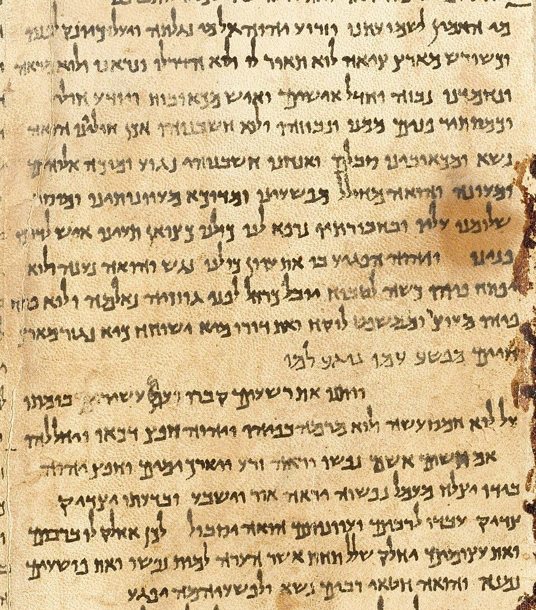{ loading=lazy }
*Isaiah 53 in the Great Isaiah Scroll (1QIsaᵃ) from Qumran Cave 1, copied in the second century BC and now in the Israel Museum, Jerusalem. Image: [Ardon Bar Hama](https://commons.wikimedia.org/wiki/File:Great_Isaiah_Scroll_Ch53.jpg), public domain, via Wikimedia Commons.*

**Location:** Qumran, near the Dead Sea
**Discovery Date:** 1947-1956
**Significance:** The most significant biblical manuscript discovery in history

**Contents:**
- Over 900 manuscripts including:
  - Every OT book except Esther
  - Complete scroll of Isaiah (1QIsa^a) dated c. 125 BC
  - Fragments of all other OT books
  - Community rules and sectarian documents

**Biblical Validation:**
- Confirms remarkable accuracy of Masoretic Text
- Isaiah scroll is 1,000 years older than previously known manuscripts
- Shows minimal textual variation over centuries
- Validates prophecies written before Christ (Isaiah 53, Daniel's prophecies)

**Key Scriptures Validated:**
- Isaiah 53:1-12 (Suffering Servant prophecy - written c. 700 BC, confirmed by DSS c. 125 BC)
- Daniel 9:24-27 (70 Weeks prophecy)
- Psalm 22 (Crucifixion psalm)
- All major prophetic texts

**Time Period:** Second Temple Judaism (516 BC - AD 70)

---

#### 2. The Ketef Hinnom Silver Scrolls (c. 600 BC)

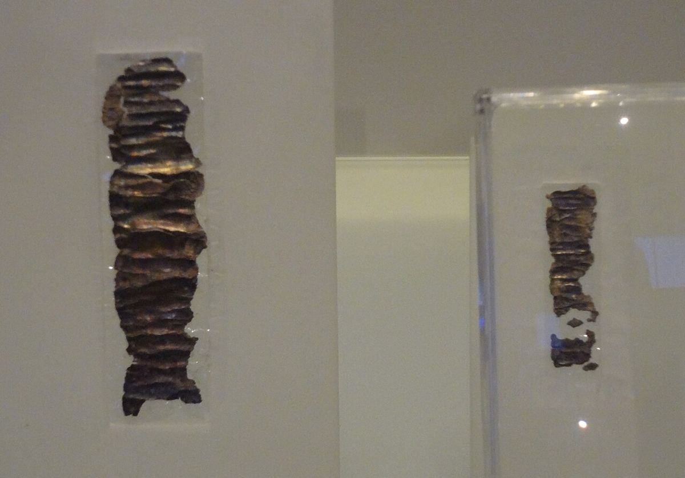{ loading=lazy }
*The two Ketef Hinnom silver scrolls, unrolled, in the Israel Museum. Each carries a form of the priestly blessing of Numbers 6:24-26. Photo: [Bachrach44](https://commons.wikimedia.org/wiki/File:Ketef_hinom_scrolls.JPG), [CC BY-SA 3.0](https://creativecommons.org/licenses/by-sa/3.0/), via Wikimedia Commons.*

**Location:** Jerusalem
**Discovery Date:** 1979
**Significance:** Oldest known biblical text

**Contents:**
- Two tiny silver scrolls containing the Priestly Blessing
- Predates Dead Sea Scrolls by 400 years

**Biblical Validation:**
- Contains Numbers 6:24-26 word-for-word
- Proves this text existed before Babylonian exile
- Demonstrates early use of Scripture as blessing

**Scripture Reference:**
> "The LORD bless you and keep you; the LORD make his face shine on you and be gracious to you; the LORD turn his face toward you and give you peace." (Numbers 6:24-26)

**Time Period:** Late First Temple period (c. 600 BC)

---

### Ancient Inscriptions and Monuments

#### 3. The Mesha Stele (Moabite Stone) (c. 840 BC)

{ loading=lazy }
*The Mesha Stele in the Louvre. It was smashed in 1869 and rebuilt from the surviving fragments and a paper squeeze taken beforehand; the smooth areas are the restored parts. Image: [Tangopaso](https://commons.wikimedia.org/wiki/File:Mesha_stele_(Louvre,_AO_5066).jpg), public domain, via Wikimedia Commons.*

**Location:** Moab (modern Jordan)
**Discovery Date:** 1868
**Significance:** Confirms Israelite-Moabite conflicts

**Contents:**
- 34-line inscription by King Mesha of Moab
- Mentions "Omri, king of Israel"
- References Israel's oppression of Moab
- Mentions "House of David" (debated reading)
- References Israelite towns and Yahweh

**Biblical Validation:**
- Confirms 2 Kings 3:4-27 (Moabite rebellion)
- Validates existence of King Omri and his dynasty
- Corroborates biblical account from Moabite perspective

**Scripture References:**
- 2 Kings 3:4-5 - "Now Mesha king of Moab raised sheep, and he had to pay the king of Israel a tribute... But after Ahab died, the king of Moab rebelled against the king of Israel."
- 1 Kings 16:23-28 (Omri's reign, 885-874 BC)

**Time Period:** Divided Kingdom (c. 840 BC)

---

#### 4. The Tel Dan Inscription (c. 841 BC)

{ loading=lazy }
*The Tel Dan Stele in the Israel Museum. Its phrase *bytdwd*, "house of David," is the earliest mention of David's name outside the Bible. Photo: [Oren Rozen](https://commons.wikimedia.org/wiki/File:JRSLM_300116_Tel_Dan_Stele_01.jpg), [CC BY-SA 4.0](https://creativecommons.org/licenses/by-sa/4.0/), via Wikimedia Commons.*

**Location:** Tel Dan, northern Israel
**Discovery Date:** 1993-1994
**Significance:** First archaeological evidence of King David outside the Bible

**Contents:**
- Aramaic inscription by Hazael, king of Damascus
- Contains phrase "House of David" (בית דוד - *beit david*)
- Describes victory over kings of Israel and Judah

**Biblical Validation:**
- Proves David was a historical figure
- Confirms Davidic dynasty
- Corroborates conflicts between Israel and Aram

**Scripture References:**
- 2 Kings 8:7-15 (Hazael becomes king of Aram)
- 2 Kings 8:28-29 (Battle at Ramoth Gilead)
- 2 Kings 9:14-15 (Jehu's revolt)

**Time Period:** Divided Kingdom (c. 841 BC)

---

#### 5. The Cyrus Cylinder (c. 539 BC)

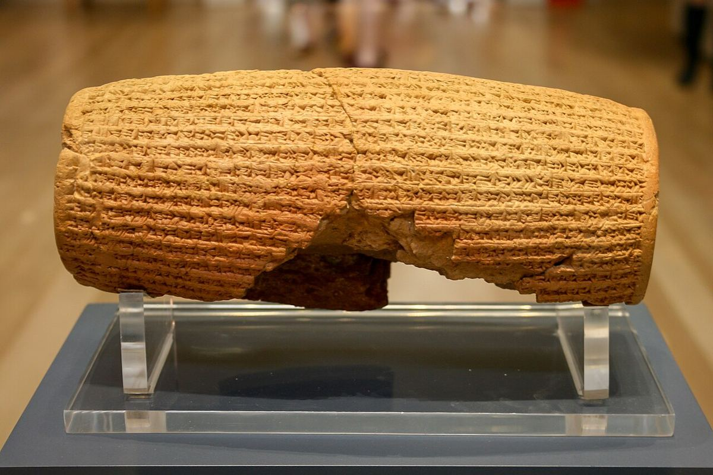{ loading=lazy }
*The Cyrus Cylinder, British Museum. It names no Jews; it records Cyrus returning displaced peoples and their gods to their cities, the policy behind his decree in Ezra 1:1-4. Photo: [Mike Peel](https://commons.wikimedia.org/wiki/File:Cyrus_Cylinder_2.jpg), [CC BY-SA 4.0](https://creativecommons.org/licenses/by-sa/4.0/), via Wikimedia Commons.*

**Location:** Babylon
**Discovery Date:** 1879
**Significance:** Confirms Persian policy of returning exiles

**Contents:**
- Akkadian text describing Cyrus the Great's conquest of Babylon
- Declares policy of returning displaced peoples to homelands
- Allows restoration of temples and religious practices

**Biblical Validation:**
- Confirms Ezra 1:1-4 (Cyrus's decree allowing Jews to return)
- Validates Persian policy mentioned in 2 Chronicles 36:22-23
- Corroborates Isaiah's prophecy about Cyrus

**Scripture References:**
- Isaiah 44:28 - "who says of Cyrus, 'He is my shepherd and will accomplish all that I please; he will say of Jerusalem, "Let it be rebuilt," and of the temple, "Let its foundations be laid."'" (Written c. 700 BC, fulfilled 539 BC)
- Isaiah 45:1-4 - God calls Cyrus by name before his birth
- Ezra 1:1-4 - Cyrus's decree allowing Jewish return (539 BC)
- 2 Chronicles 36:22-23 - Parallel account

**Time Period:** Persian period (539 BC)

---

#### 6. The Babylonian Chronicles (Various dates 7th-6th centuries BC)

{ loading=lazy }
*The Babylonian Chronicle tablet for 605-594 BC, British Museum. It records Nebuchadnezzar seizing "the city of Judah" in 597 BC and appointing a king of his own choice there (2 Kings 24:10-17). Photo: [Osama Shukir Muhammed Amin](https://commons.wikimedia.org/wiki/File:The_cuneiform_inscription_highlights_the_conquest_of_Jerusalem_and_the_surrender_of_Jehoiakim,_king_of_Judah,_in_597_BCE._From_Babylon,_Iraq.jpg), [CC BY-SA 4.0](https://creativecommons.org/licenses/by-sa/4.0/), via Wikimedia Commons.*

**Location:** Babylon
**Discovery Date:** Late 19th century
**Significance:** Confirms Babylonian conquests and biblical chronology

**Contents:**
- Cuneiform tablets recording Babylonian history
- Documents Nebuchadnezzar II's campaigns
- Records fall of Jerusalem (597 BC and 586 BC)
- Chronicles fall of Nineveh (612 BC)

**Biblical Validation:**
- Confirms 2 Kings 24:10-17 (597 BC siege)
- Validates 2 Kings 25:1-21 (586 BC destruction)
- Corroborates dates and events of Judah's fall
- Confirms Nebuchadnezzar as historical figure

**Scripture References:**
- 2 Kings 24:10-12 - "Jehoiachin king of Judah...surrendered to him. It was the eighth year of the reign of the king of Babylon" (March 16, 597 BC)
- 2 Kings 25:1-2 - "So in the ninth year of Zedekiah's reign, on the tenth day of the tenth month, Nebuchadnezzar...marched against Jerusalem" (588-586 BC)
- Jeremiah 39:1-2 - Parallel account with precise dates
- Nahum 1-3 (Prophecy against Nineveh, fulfilled 612 BC)

**Time Period:** Neo-Babylonian Empire (626-539 BC)

---

#### 7. The Lachish Letters (c. 588-586 BC)

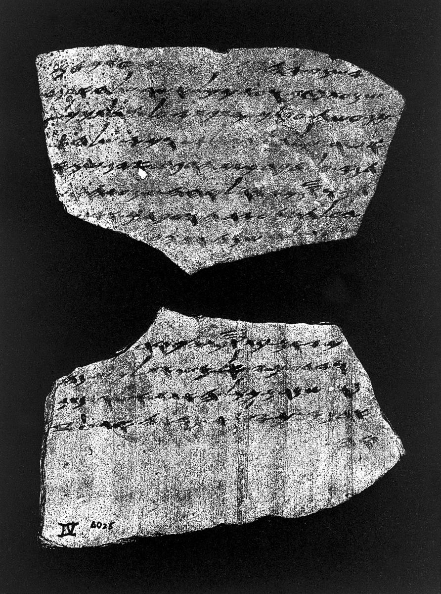{ loading=lazy }
*Lachish Letter 4. Its writer is watching for the fire-signals of Lachish "because we cannot see Azekah," the moment Jeremiah 34:7 describes. Photo: [Wellcome Collection](https://commons.wikimedia.org/wiki/File:Lachish,Tell_ed_Duweir,_Letter_4_Wellcome_L0005980.jpg), [CC BY 4.0](https://creativecommons.org/licenses/by/4.0/), via Wikimedia Commons.*

**Location:** Lachish, Israel
**Discovery Date:** 1935-1938
**Significance:** Correspondence during Babylonian siege

**Contents:**
- 21 ostraca (pottery shards with ink inscriptions)
- Letters from military commander to governor
- References signal fires going out in nearby cities
- Mentions "the prophet" (possibly Jeremiah)

**Biblical Validation:**
- Confirms Jeremiah 34:7 (Lachish and Azekah last cities standing)
- Validates historical setting of Jeremiah's ministry
- Shows Hebrew script of that period
- Demonstrates literacy in ancient Judah

**Scripture References:**
- Jeremiah 34:7 - "while the army of the king of Babylon was fighting against Jerusalem and the other cities of Judah that were still holding out—Lachish and Azekah. These were the only fortified cities left in Judah."
- 2 Kings 18:13-14 (Earlier Assyrian siege of Lachish, 701 BC)

**Time Period:** Late First Temple period (588-586 BC)

---

#### 8. The Taylor Prism (Sennacherib's Prism) (c. 690 BC)

{ loading=lazy }
*The Taylor Prism, British Museum. Sennacherib boasts of shutting Hezekiah up in Jerusalem "like a bird in a cage" and claims no capture of the city (2 Kings 19:32-36). Photo: [Gary Todd](https://commons.wikimedia.org/wiki/File:Taylor_Prism,_British_Museum.jpg), [CC0](https://creativecommons.org/publicdomain/zero/1.0/), via Wikimedia Commons.*

**Location:** Nineveh, Assyria
**Discovery Date:** 1830
**Significance:** Assyrian account of Hezekiah's siege

**Contents:**
- Hexagonal clay prism with cuneiform inscription
- Sennacherib's account of his third campaign (701 BC)
- Mentions Hezekiah by name
- Describes siege of Jerusalem: "I shut up Hezekiah like a bird in a cage"
- Lists tribute received from Hezekiah

**Biblical Validation:**
- Confirms 2 Kings 18-19 and Isaiah 36-37
- Validates Hezekiah as historical king
- Notably DOES NOT claim capturing Jerusalem (confirming biblical account of deliverance)
- Corroborates tribute payment (2 Kings 18:14-16)

**Scripture References:**
- 2 Kings 18:13-16 - Sennacherib invades Judah, Hezekiah pays tribute
- 2 Kings 19:35-36 - "That night the angel of the LORD went out and put to death a hundred and eighty-five thousand in the Assyrian camp...So Sennacherib king of Assyria broke camp and withdrew"
- Isaiah 37:36-37 - Parallel account

**Time Period:** Neo-Assyrian Empire (701 BC)

---

#### 9. The Siloam Inscription (c. 701 BC)

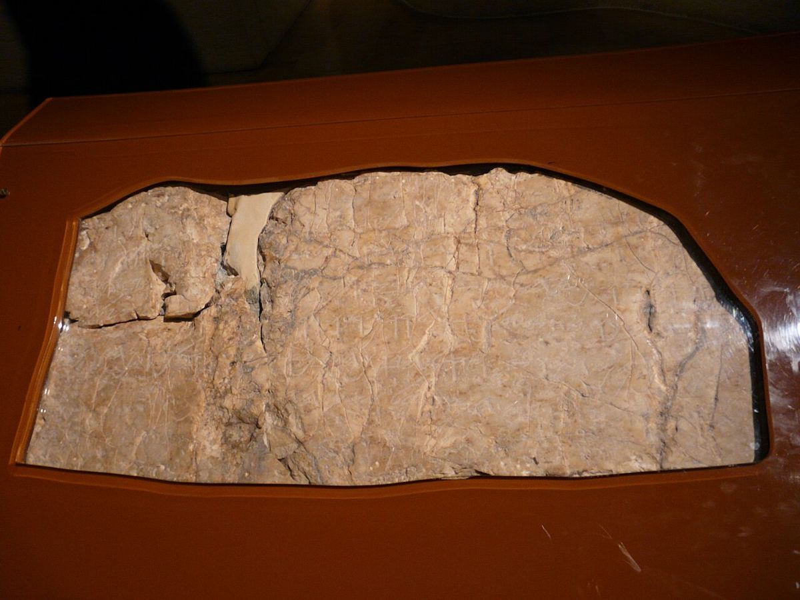{ loading=lazy }
*The Siloam Inscription, cut from the wall of Hezekiah's Tunnel and now in the Istanbul Archaeology Museums. It records the two tunnelling crews breaking through to each other (2 Kings 20:20). Photo: [Yong Woo Park](https://commons.wikimedia.org/wiki/File:Siloam_Inscription_from_Hezekiahs_Tunnel_Istanbul_Archaeology_Museums.jpg), [CC0](https://creativecommons.org/publicdomain/zero/1.0/), via Wikimedia Commons.*

**Location:** Hezekiah's Tunnel, Jerusalem
**Discovery Date:** 1880
**Significance:** Hebrew inscription describing tunnel construction

**Contents:**
- Inscription carved into tunnel wall
- Describes how two teams of workers dug from opposite ends and met in the middle
- Written in ancient Hebrew script
- Engineering achievement documented

**Biblical Account:**
- 2 Kings 20:20 - Hezekiah's water project
- 2 Chronicles 32:30 - Blocking Gihon spring and channeling water

**Scripture References:**
- 2 Chronicles 32:2-4 - "When Hezekiah saw that Sennacherib had come...he consulted with his officials and military staff about blocking off the water from the springs outside the city"
- 2 Chronicles 32:30 - "He blocked the upper outlet of the Gihon spring and channeled the water down to the west side of the City of David"

**Time Period:** Late First Temple period (c. 701 BC)

---

#### 10. The Amarna Letters (c. 1360-1332 BC)

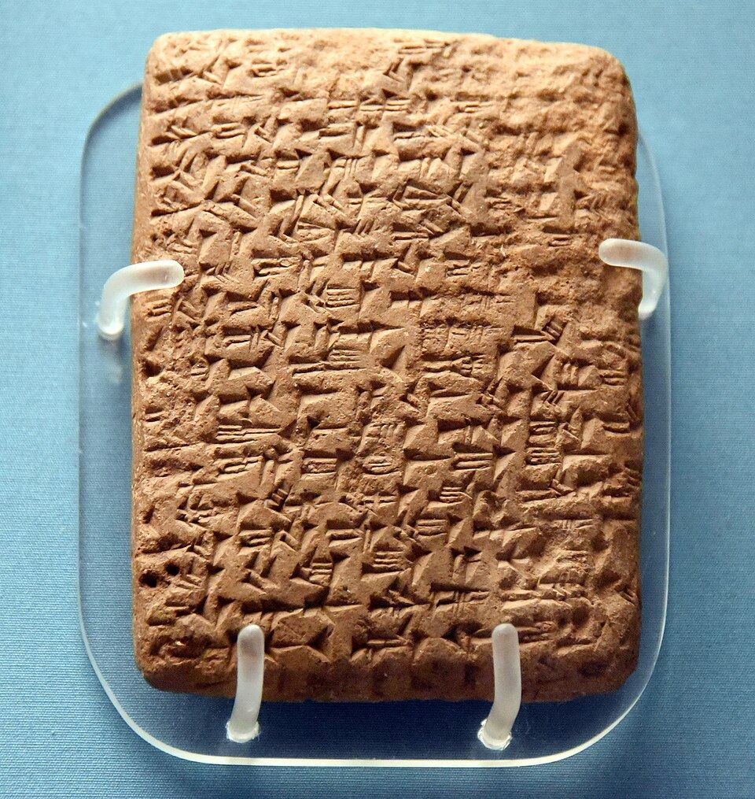{ loading=lazy }
*An Amarna letter from Yapahu, ruler of Gezer, asking the pharaoh for help against the Habiru. Photo: [Osama Shukir Muhammed Amin](https://commons.wikimedia.org/wiki/File:Amarna_letter._Letter_from_Yapahu_(ruler_of_Gezer)_to_the_Egyptian_pharaoh_Amenhotep_III_or_son_Akhenaten.jpg), [CC BY-SA 4.0](https://creativecommons.org/licenses/by-sa/4.0/), via Wikimedia Commons.*

**Location:** Amarna, Egypt
**Discovery Date:** 1887
**Significance:** Diplomatic correspondence mentioning Canaan

**Contents:**
- 382 clay tablets in Akkadian cuneiform
- Letters between Egyptian Pharaohs and Canaanite rulers
- Mention of 'Habiru' (possibly Hebrews)
- References Jerusalem and other biblical cities
- Shows political situation in Canaan

**Biblical Validation:**
- Confirms existence of Jerusalem in pre-Israelite period
- Documents Canaanite city-states mentioned in Joshua
- May reference Israelite conquest period
- Validates biblical geography

**Scripture References:**
- Joshua 10:1-5 (Jerusalem allied with other Canaanite cities)
- Joshua 10:3 - "So Adoni-Zedek king of Jerusalem appealed to Hoham king of Hebron, Piram king of Jarmuth, Japhia king of Lachish and Debir king of Eglon"
- Judges 1:21 - "The Benjamites, however, did not drive out the Jebusites, who were living in Jerusalem"

**Time Period:** Late Bronze Age (c. 1400-1300 BC)

---

#### 11. The Merneptah Stele (c. 1208 BC)

{ loading=lazy }
*The Merneptah Stele in the Egyptian Museum, Cairo. Photo: [Webscribe](https://commons.wikimedia.org/wiki/File:Merenptah_Israel_Stele_Cairo.jpg), [CC BY-SA 3.0](https://creativecommons.org/licenses/by-sa/3.0/), via Wikimedia Commons.*

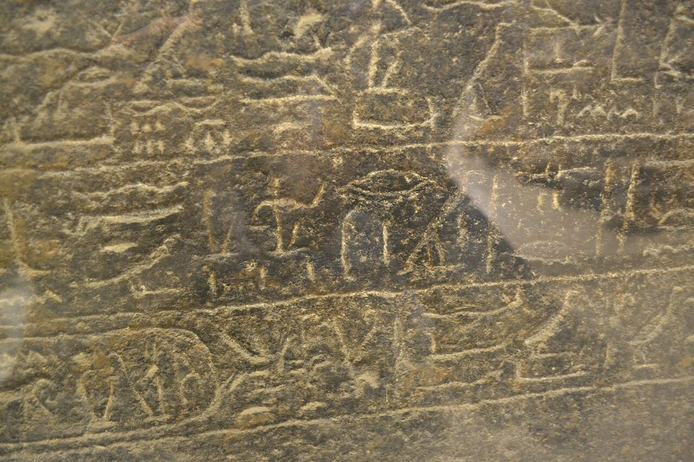{ loading=lazy }
*Line 27 of the stele: "Israel is laid waste, his seed is not." The name carries the sign Egyptian scribes used for a people, so Israel was already a people in Canaan by about 1208 BC. Photo: [Darer101](https://commons.wikimedia.org/wiki/File:Closeup_of_the_Merenptah_Stele,_mentioning_ysr%E1%BB%89%EA%9C%A3r_(%22Israel%22).jpg), [CC BY-SA 4.0](https://creativecommons.org/licenses/by-sa/4.0/), via Wikimedia Commons.*

**Location:** Thebes, Egypt
**Discovery Date:** 1896
**Significance:** Earliest extra-biblical mention of "Israel"

**Contents:**
- Victory stele of Pharaoh Merneptah
- Contains line: "Israel is laid waste; his seed is no more"
- Refers to Israel as a people (not a place)
- Dated to 5th year of Merneptah's reign

**Biblical Validation:**
- Confirms Israel existed as distinct people by 1208 BC
- Places Israel in Canaan during Judges period
- Earliest secular reference to Israel
- Validates biblical chronology of conquest/settlement

**Scripture References:**
- Judges 3:12-30 (Oppression by Moab, c. 1200s BC)
- Judges 4-5 (Deborah and Barak period)
- Exodus 1:8-14 (Oppression in Egypt, which preceded exodus c. 1446 BC)

**Time Period:** Late Bronze Age / Early Iron Age (c. 1208 BC)

---

### Seals and Bullae (Seal Impressions)

#### 12. Bullae with Biblical Names

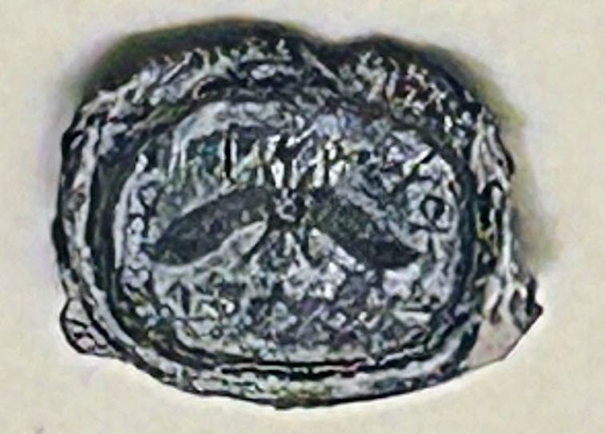{ loading=lazy }
*A seal impression of King Hezekiah, on loan to the Israel Museum from a private collection. It reads like the impression excavated on the Ophel in 2015, but this one has no recorded findspot, so the excavated piece is the stronger evidence. Photo: [Tamir Zegman](https://commons.wikimedia.org/wiki/File:%D7%98%D7%91%D7%99%D7%A2%D7%AA_%D7%97%D7%95%D7%AA%D7%9D_%D7%94%D7%9E%D7%9C%D7%9A_%D7%97%D7%96%D7%A7%D7%99%D7%94%D7%95.jpg), [CC BY-SA 4.0](https://creativecommons.org/licenses/by-sa/4.0/), via Wikimedia Commons.*

**Location:** Various sites in Israel
**Discovery Dates:** Various
**Significance:** Seal impressions of people mentioned in the Bible

**Notable Examples:**

**Bulla of Baruch son of Neriah** (c. 587 BC)
- Jeremiah's scribe
- Inscription: "Belonging to Baruch, son of Neriah, the scribe"
- Scripture: Jeremiah 36:4 - "So Jeremiah called Baruch son of Neriah, and while Jeremiah dictated all the words the LORD had spoken to him, Baruch wrote them on the scroll"

**Bulla of Gemariah son of Shaphan** (c. 587 BC)
- Royal official mentioned in Jeremiah
- Scripture: Jeremiah 36:10 - "Baruch read to all the people...the words of Jeremiah from the scroll in the room of Gemariah son of Shaphan the secretary"

**Bulla of King Hezekiah** (c. 727-698 BC)
- Discovered 2015, published 2018
- Inscription: "Belonging to Hezekiah, [son of] Ahaz, king of Judah"
- Features winged sun disk (Egyptian symbol) with *ankh* (life symbol)
- Scripture: 2 Kings 18-20 (Hezekiah's reign)

**Time Period:** First Temple period (8th-6th centuries BC)

---

## New Testament Manuscripts and Inscriptions

### Early New Testament Manuscripts

#### 13. Papyrus P52 (John Rylands Fragment) (c. AD 125-150)

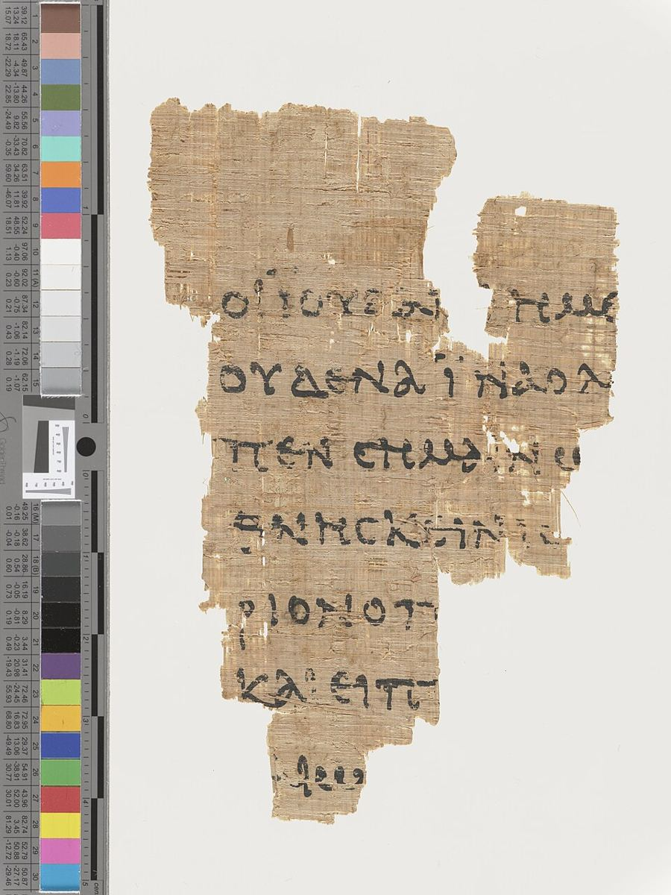{ loading=lazy }
*Papyrus 52, John Rylands Library, Manchester: John 18:31-33 on a scrap about the size of a credit card. Photo: [John Rylands Library, University of Manchester](https://commons.wikimedia.org/wiki/File:JRL19071950.jpg), [CC BY-SA 4.0](https://creativecommons.org/licenses/by-sa/4.0/), via Wikimedia Commons.*

**Location:** Egypt (found); now in Manchester, UK
**Discovery Date:** Acquired 1920, identified 1934
**Significance:** Earliest known NT manuscript fragment

**Contents:**
- Small fragment of John 18:31-33, 37-38
- Contains portions of Pilate's dialogue with Jesus
- Both sides of papyrus preserved
- Greek text

**Biblical Validation:**
- Proves John's Gospel circulated widely by early 2nd century
- Only 30-60 years after traditional date of composition
- Demolishes late-dating theories
- Confirms textual reliability

**Scripture Text:**
- John 18:37-38 - "'You are a king, then!' said Pilate. Jesus answered, 'You say that I am a king. In fact, the reason I was born and came into the world is to testify to the truth. Everyone on the side of truth listens to me.' 'What is truth?' retorted Pilate."

**Time Period:** Early 2nd century AD

---

#### 14. Papyrus P46 (Chester Beatty II) (c. AD 175-225)

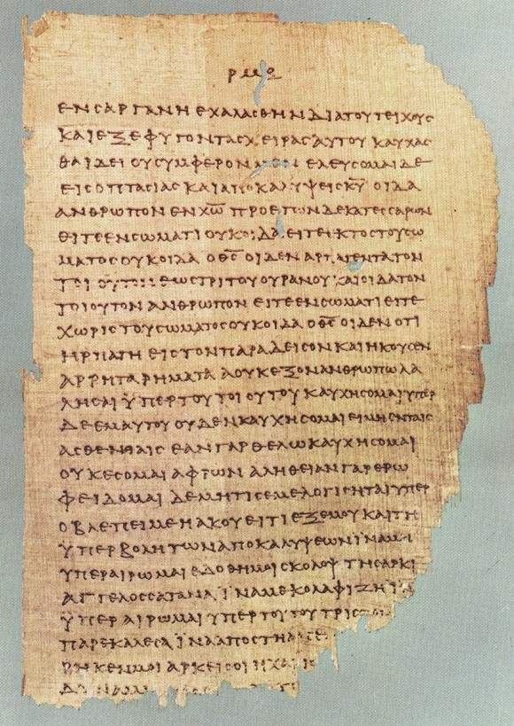{ loading=lazy }
*A leaf of Papyrus 46 held by the University of Michigan, with 2 Corinthians 11:33-12:9, where Paul tells of being caught up into paradise. Image: [University of Michigan](https://commons.wikimedia.org/wiki/File:P46.jpg), public domain, via Wikimedia Commons.*

**Location:** Egypt
**Discovery Date:** 1930s
**Significance:** Earliest extensive collection of Paul's letters

**Contents:**
- 86 leaves (out of original 104)
- Contains most of Paul's epistles:
  - Romans 5:17-6:14, 8:15-15:9, 15:11-16:27
  - 1-2 Corinthians (nearly complete)
  - Ephesians, Galatians, Philippians, Colossians
  - 1-2 Thessalonians, Hebrews
- Romans and Hebrews placed prominently

**Biblical Validation:**
- Confirms Paul's letters as collected corpus by AD 200
- Shows textual stability across centuries
- Validates authenticity of Pauline epistles
- Contains Romans 5:1 affirming justification by faith

**Scripture Highlights:**
- Romans 5:1 - "Therefore, since we have been justified through faith, we have peace with God through our Lord Jesus Christ"
- 1 Corinthians 15:3-4 - "For what I received I passed on to you as of first importance: that Christ died for our sins according to the Scriptures, that he was buried, that he was raised on the third day"

**Time Period:** Late 2nd / early 3rd century AD

---

#### 15. Papyrus P66 (Bodmer II) (c. AD 175-200)

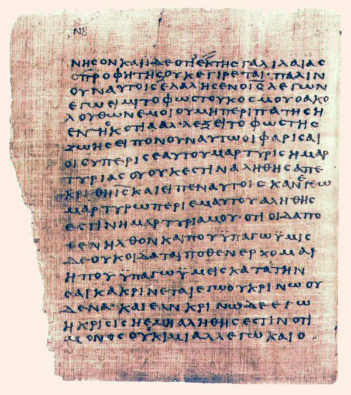{ loading=lazy }
*A page of Papyrus 66, Bodmer Library, Geneva, the oldest near-complete copy of John's Gospel. Image: [Bodmer Library](https://commons.wikimedia.org/wiki/File:Papyrus66.jpg), public domain, via Wikimedia Commons.*

**Location:** Egypt
**Discovery Date:** 1950s
**Significance:** Early, nearly complete Gospel of John

**Contents:**
- Contains John 1:1-6:11, 6:35-14:26, 14:29-30, 15:2-26, 16:2-4, 16:6-7, fragments to chapter 21
- 104 leaves
- Shows early Christian belief in Jesus' deity

**Biblical Validation:**
- Confirms John 1:1 "the Word was God" (not "a god")
- Validates key Christological passages
- Demonstrates textual reliability

**Scripture Highlights:**
- John 1:1 - "In the beginning was the Word, and the Word was with God, and the Word was God"
- John 3:16 - "For God so loved the world that he gave his one and only Son"
- John 20:31 - Purpose statement of John's Gospel

**Time Period:** Late 2nd century AD

---

P52, P46, and P66 above are three of the 83 known New Testament manuscripts dated to AD 300 or earlier. For English translations of all 83 — read what each papyrus actually says, rather than a summary of it — see [Early New Testament Manuscripts](early-new-testament-manuscripts.md).

---

#### 16. Codex Sinaiticus (c. AD 330-360)

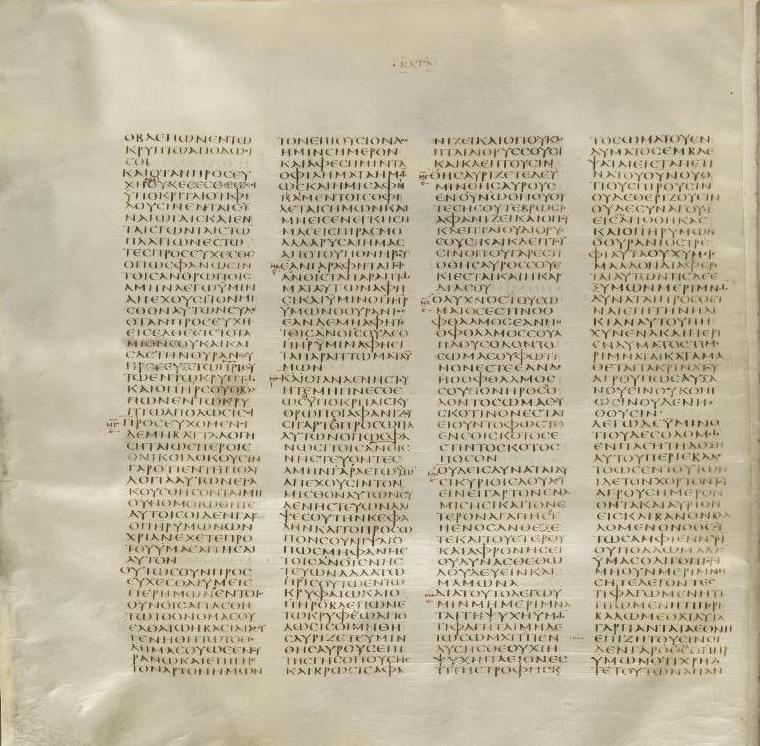{ loading=lazy }
*Codex Sinaiticus at Matthew 6:4-32, including the Lord's Prayer. British Library. Image: [British Library](https://commons.wikimedia.org/wiki/File:Codex_Sinaiticus_Matthew_6,4-32.JPG), public domain, via Wikimedia Commons.*

**Location:** St. Catherine's Monastery, Sinai
**Discovery Date:** 1844-1859 (Constantin von Tischendorf)
**Significance:** Oldest complete New Testament

**Contents:**
- Entire NT in Greek
- Large portions of OT (Septuagint)
- Written in uncial script on vellum
- 347 surviving leaves

**Biblical Validation:**
- Complete witness to NT text
- Confirms canonical books
- Shows textual transmission
- Includes disputed passages (variants noted)

**Time Period:** 4th century AD (Constantine era)

---

#### 17. Codex Vaticanus (c. AD 300-325)

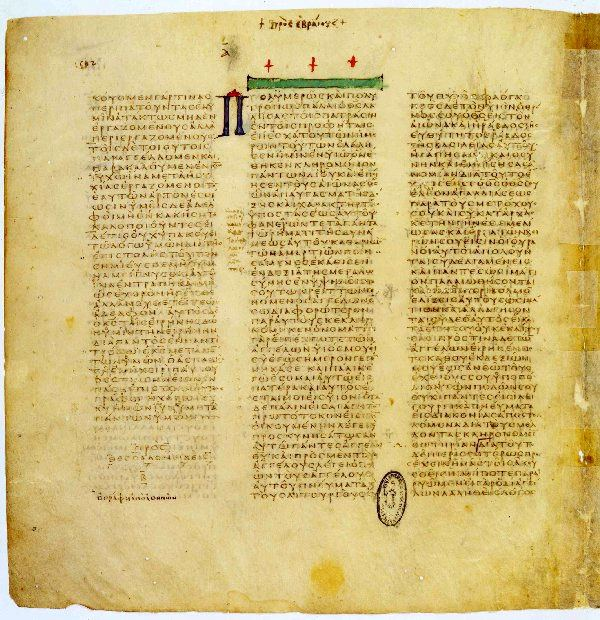{ loading=lazy }
*Codex Vaticanus at the end of 2 Thessalonians and the opening of Hebrews, Vatican Library. The note in the margin at Hebrews 1:3 is a later scribe's rebuke of one who had altered the text: "Fool and knave, leave the old reading, don't change it!" Image: [Vatican Library](https://commons.wikimedia.org/wiki/File:Codex_Vaticanus_B,_2Thess._3,11-18,_Hebr._1,1-2,2.jpg), public domain, via Wikimedia Commons.*

**Location:** Vatican Library
**Known Since:** At least 1475 in Vatican catalog
**Significance:** Oldest nearly complete Bible

**Contents:**
- Complete OT and NT (missing Hebrews 9:14-13:25, Pastoral epistles, Philemon, Revelation)
- Written on vellum
- Exceptionally high quality text

**Biblical Validation:**
- One of most important witnesses to biblical text
- Shows remarkable consistency with other early manuscripts
- Used in modern critical editions

**Time Period:** Early 4th century AD

---

### New Testament Inscriptions

#### 18. The Pontius Pilate Stone (c. AD 26-36)

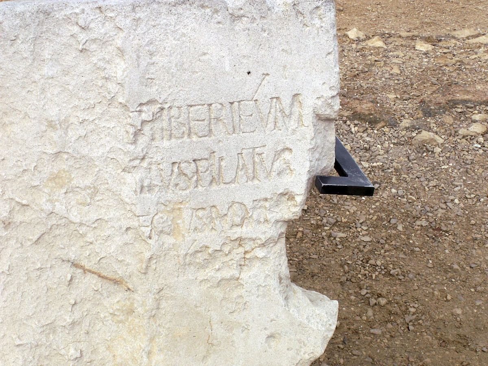{ loading=lazy }
*The Pilate Stone, naming "Pontius Pilatus, prefect of Judaea." The original is in the Israel Museum; a cast stands at Caesarea Maritima, where it was found in 1961. Photo: [Marion Doss](https://commons.wikimedia.org/wiki/File:Pilate_Inscription.JPG), [CC BY-SA 2.0](https://creativecommons.org/licenses/by-sa/2.0/), via Wikimedia Commons.*

**Location:** Caesarea Maritima
**Discovery Date:** 1961
**Significance:** Only archaeological evidence of Pontius Pilate

**Contents:**
- Latin inscription reading "Pontius Pilatus, Prefect of Judea"
- Part of dedication to Tiberius Caesar
- Confirms Pilate's title and historical existence

**Biblical Validation:**
- Confirms all four Gospel accounts of Pilate
- Validates his title as "Prefect" (Latin: *praefectus*)
- Places him in correct location and time period

**Scripture References:**
- Matthew 27:2 - "They bound him, led him away and handed him over to Pilate the governor"
- Luke 3:1 - "In the fifteenth year of the reign of Tiberius Caesar—when Pontius Pilate was governor of Judea" (AD 29)
- John 18:28-19:16 (Extended trial narrative before Pilate)
- 1 Timothy 6:13 - "Christ Jesus, who while testifying before Pontius Pilate made the good confession"

**Time Period:** Roman period (AD 26-36, Pilate's tenure)

---

#### 19. The Caiaphas Ossuary (c. 1st century AD)

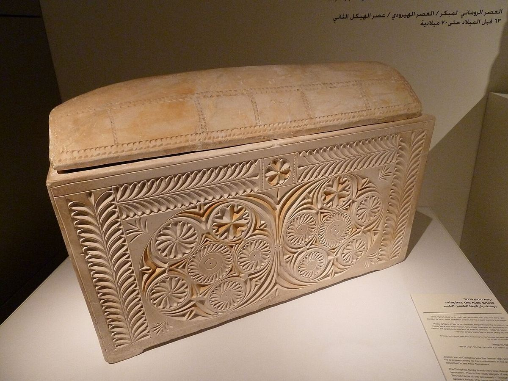{ loading=lazy }
*The ossuary inscribed "Joseph son of Caiaphas," found in a Jerusalem burial cave in 1990 and now in the Israel Museum (Matthew 26:57; John 18:13). Photo: [Avi Deror](https://commons.wikimedia.org/wiki/File:Ossuary_of_the_high_priest_Joseph_Caiaphas_P1180839.JPG), [CC BY-SA 3.0](https://creativecommons.org/licenses/by-sa/3.0/), via Wikimedia Commons.*

**Location:** Jerusalem
**Discovery Date:** 1990
**Significance:** Possible burial box of High Priest who tried Jesus

**Contents:**
- Limestone ossuary with inscription "Yehosef bar Qafa" (Joseph, son of Caiaphas)
- Ornately decorated
- Contained bones of six individuals
- Found in family tomb

**Biblical Validation:**
- Confirms Caiaphas as historical figure
- Matches time period of Jesus' ministry
- Validates Gospel accounts of high priest

**Scripture References:**
- Matthew 26:3 - "Then the chief priests and the elders of the people assembled in the palace of the high priest, whose name was Caiaphas"
- Matthew 26:57-68 - Jesus' trial before Caiaphas
- John 11:49-50 - "Then one of them, named Caiaphas, who was high priest that year, spoke up, 'You know nothing at all! You do not realize that it is better for you that one man die for the people'"
- John 18:13-14 - Jesus taken to Caiaphas
- Acts 4:6 - Mentions Caiaphas in early church period

**Time Period:** Second Temple period (AD 18-36, Caiaphas's tenure as high priest)

---

## Extra-Biblical Historical Sources

### Ancient Historians and Documents

#### 20. Josephus' Antiquities (c. AD 93-94)
**Author:** Flavius Josephus (Jewish historian)
**Significance:** Contemporary historical account mentioning Jesus, John the Baptist, James

**Key Passages:**

**Testimonium Flavianum (Antiquities 18.3.3):**
"At this time there was a wise man called Jesus, and his conduct was good, and he was known to be virtuous. Many people among the Jews and the other nations became his disciples. Pilate condemned him to be crucified and to die. But those who had become his disciples did not abandon his discipleship. They reported that he had appeared to them three days after his crucifixion and that he was alive."
(Reconstructed text removing likely Christian interpolations)

**James the Brother of Jesus (Antiquities 20.9.1):**
"[Ananus] assembled the Sanhedrin of judges, and brought before them the brother of Jesus, who was called Christ, whose name was James, and some others; and when he had formed an accusation against them as breakers of the law, he delivered them to be stoned."

**John the Baptist (Antiquities 18.5.2):**
References John's baptism and execution by Herod Antipas

**Biblical Validation:**
- Confirms Jesus as historical figure
- Validates execution under Pilate
- Corroborates NT accounts of John the Baptist
- Confirms James as Jesus' brother and leader in Jerusalem

**Scripture References:**
- Matthew 14:1-12 (John the Baptist's death)
- Acts 12:17, 15:13, 21:18 (James as Jerusalem church leader)
- Galatians 1:19 - "I saw none of the other apostles—only James, the Lord's brother"

**Time Period:** Written AD 93-94, covering events of AD 30s

---

#### 21. Tacitus' Annals (c. AD 116)

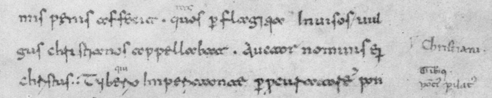{ loading=lazy }
*Annals 15.44 in the eleventh-century Codex Mediceus II, Florence, the manuscript all later copies of this part of the Annals descend from. These lines name the Christians and "Christus," executed "while Tiberius was emperor, by the procurator Pontius Pilate." Image: [1902 facsimile](https://commons.wikimedia.org/wiki/File:MII_(cropped)-Tacitus-chrestianos_appellabantur.png), public domain, via Wikimedia Commons.*

**Author:** Cornelius Tacitus (Roman historian)
**Significance:** Roman historical record of Christ and Christianity

**Key Passage (Annals 15.44):**
"Nero fastened the guilt and inflicted the most exquisite tortures on a class hated for their abominations, called Christians by the populace. Christus, from whom the name had its origin, suffered the extreme penalty during the reign of Tiberius at the hands of one of our procurators, Pontius Pilatus, and a most mischievous superstition, thus checked for the moment, again broke out not only in Judaea, the first source of the evil, but even in Rome."

**Biblical Validation:**
- Confirms Christ's execution under Pilate during Tiberius's reign
- Validates rapid spread of Christianity
- Corroborates persecution of Christians under Nero (AD 64)
- Independent Roman confirmation of Gospel accounts

**Scripture References:**
- Luke 3:1 - "In the fifteenth year of the reign of Tiberius Caesar—when Pontius Pilate was governor of Judea"
- Acts 28:14-31 - Paul in Rome
- 2 Timothy 4:16-17 - Paul's first Roman defense (possibly before Nero)

**Time Period:** Written c. AD 116, describing events of AD 64

---

#### 22. Pliny the Younger's Letter (c. AD 112)
**Author:** Pliny the Younger (Roman governor)
**Recipient:** Emperor Trajan
**Significance:** Roman official documentation of Christian practices

**Key Passage (Epistle 10.96):**
"They were in the habit of meeting on a certain fixed day before it was light, when they sang in alternate verses a hymn to Christ, as to a god, and bound themselves by a solemn oath, not to any wicked deeds, but never to commit any fraud, theft or adultery, never to falsify their word, nor deny a trust when they should be called upon to deliver it up; after which it was their custom to separate, and then reassemble to partake of food—but food of an ordinary and innocent kind."

**Biblical Validation:**
- Confirms early Christian worship of Jesus as God
- Describes early Christian ethical standards
- References Sunday worship ("fixed day")
- Mentions communion ("partake of food")
- Documents geographical spread (Bithynia, modern Turkey)

**Scripture References:**
- Acts 20:7 - "On the first day of the week we came together to break bread"
- 1 Corinthians 16:2 - Sunday worship pattern
- Colossians 3:16 - "Sing psalms, hymns, and songs from the Spirit"
- Philippians 2:6-11 - Early hymn to Christ

**Time Period:** c. AD 112

---

#### 23. Suetonius' Lives of the Twelve Caesars (c. AD 121)
**Author:** Gaius Suetonius Tranquillus (Roman historian)
**Significance:** Roman documentation of Christ and Christian disturbances

**Key Passage (Claudius 25.4):**
"Since the Jews constantly made disturbances at the instigation of Chrestus, he [Claudius] expelled them from Rome."

**Biblical Validation:**
- Likely refers to Christ (Chrestus/Christus confusion was common)
- Confirms Acts 18:2 (expulsion of Jews from Rome under Claudius)
- Documents early Christian-Jewish tensions in Rome

**Scripture Reference:**
- Acts 18:2 - "There he met a Jew named Aquila, a native of Pontus, who had recently come from Italy with his wife Priscilla, because Claudius had ordered all Jews to leave Rome"

**Time Period:** Event c. AD 49, written c. AD 121

---

#### 24. The Talmud References (c. AD 200-500)
**Source:** Jewish rabbinic writings
**Significance:** Hostile witness to Jesus' existence

**Key References:**
- Sanhedrin 43a mentions execution of "Yeshu" (Jesus) on Passover eve
- References to "that man" and his disciples
- Accuses Jesus of sorcery and leading Israel astray

**Biblical Validation:**
- Hostile Jewish sources confirm Jesus' existence
- Acknowledge his miracles (though attributed to sorcery)
- Confirm execution around Passover
- Show Jesus was significant enough to warrant rabbinic response

**Scripture References:**
- Matthew 12:24 - Pharisees accuse Jesus: "It is only by Beelzebul, the prince of demons, that this fellow drives out demons"
- John 19:14 - "It was the day of Preparation of the Passover"

**Time Period:** Describes events of AD 30-33, written AD 200-500

---

## Conclusion

The evidence set out at the top of this page is what these twenty-four artifacts amount to: a text
attested earlier, more often, and across more independent lines of transmission than any comparable
work from the ancient world, and one that survived deliberate campaigns to erase it.

Archaeology cannot produce faith, and none of this is offered as a substitute for it. What it does
is remove a particular excuse. Whatever else is in question about Scripture, whether we have
substantially what its authors wrote is not.

## Further reading on this site

- [Early New Testament Manuscripts](early-new-testament-manuscripts.md) — English translations of the 83 earliest known New Testament papyri, all dated AD 300 or earlier
- [Bible Translations and Source Texts](translations.md) — which manuscript traditions stand behind the English versions
- [Archaeological Sites](archaeological-sites.md) — the sites, as distinct from the texts
- [How to Read the Bible](how-to-read-the-bible.md) — the method this site applies to the text once its reliability is granted

---

*"Your word, LORD, is eternal; it stands firm in the heavens" (Psalm 119:89). The ancient texts bear witness to the enduring truth of God's Word.*
