# The cities of the plain

Five kings ruled the plain at the south end of the Salt Sea. Genesis names their cities: Sodom,
Gomorrah, Admah, Zeboiim, and "Bela (that is, Zoar)" (Genesis 14:2, ESV). In Abraham's ninety-ninth
year the LORD rained sulphur and fire on the plain. Four of the cities burned. The fifth, the little
one Lot asked for, was left standing.

The rest of Scripture keeps that difference. The four are never rebuilt. Zoar is still a town when
Isaiah and Jeremiah write, when Josephus writes, and when a sixth-century mosaicist sets it among
palm trees on a church floor in Madaba.

**In one sentence:** God overthrew four cities of the plain and spared the fifth, little Zoar, for
Lot's sake, and the record keeps that difference for two thousand years, because the Judge of all
the earth judges exactly and keeps the people He has promised to keep.

## Key Takeaways

*(This section follows the [Key Takeaways](../about/key-takeaways.md) format — see that page for what each part is for.)*

### Types & Prophecy

**Prophecy.** Jesus made the overthrow a picture of His own coming: "on the day when Lot went out
from Sodom, fire and sulfur rained from heaven and destroyed them all— so will it be on the day when
the Son of Man is revealed" (Luke 17:29-30, ESV). Peter calls the cities "an example of what is
going to happen to the ungodly" (2 Peter 2:6, ESV). The New Testament's word for that sulphur,
θεῖον (*theion*, G2303), occurs in Luke 17:29 and then six times in Revelation, ending in "the lake
that burns with fire and sulfur" (Revelation 21:8, ESV).

### Lessons about Jesus

- **Jesus treated Sodom as history.** He named the day Lot went out, the fire and the sulphur, and
  Lot's wife (Luke 17:28-32), and He told Capernaum that Sodom "would have remained until this day"
  had it seen His works (Matthew 11:23, ESV).
- **Jesus is the rescuer Lot needed.** Peter's verb for God rescuing "righteous Lot" (2 Peter 2:7,
  ESV) is the verb Paul uses of "Jesus who delivers us from the wrath to come" (1 Thessalonians 1:10,
  ESV). See [Taken Before Judgment](../last-things/taken-before-judgment.md).

### Memory verses

> ✝️ Genesis 18:25 (ESV)
>
> 25 Far be it from you to do such a thing, to put the righteous to death with the wicked, so that
> the righteous fare as the wicked! Far be that from you! Shall not the Judge of all the earth do
> what is just?"

> ✝️ 2 Peter 2:9 (ESV)
>
> 9 then the Lord knows how to rescue the godly from trials, and to keep the unrighteous under
> punishment until the day of judgment,

### Be Transformed

- **Think.** The overthrow happened, in a real valley, to real cities. God's judgment on sin is a
  matter of record, and so is His rescue.
- **Attitude.** Pray as Abraham prayed, boldly and for named people, trusting the Judge to do what is
  just.
- **Do.** "Remember Lot's wife" (Luke 17:32, ESV). Name one thing you are looking back at, and turn
  your face from it this week.

### Prayer

Father, Judge of all the earth, you do what is just. You heard Abraham, you remembered him, and you
brought Lot out by the hand before the fire fell. Thank you that your Son Jesus delivers us from the
wrath to come. Keep us from looking back, and make us bold to pray for the people around us while
the day of your patience lasts. In Jesus' name. Amen.

## Study outline

- **[Five cities in one valley](#five-cities-in-one-valley)** — what Genesis 13-14 says about the
  plain, its kings and its bitumen pits.
- **[The overthrow and the little one](#the-overthrow-and-the-little-one)** — Abraham's prayer, Lot's
  plea for Zoar, and the fire (Genesis 18-19).
- **[Four never rebuilt, one lived on](#four-never-rebuilt-one-lived-on)** — how the prophets and
  Josephus keep the four and the one apart.
- **[Zoar on a church floor](#zoar-on-a-church-floor-the-madaba-map)** — the sixth-century Madaba
  mosaic and the sanctuary of Lot above Zoar.
- **[Where were the burned cities?](#where-were-the-burned-cities)** — the southern case, the northern
  case, and the dates.
- **[The sulphur balls](#the-sulphur-balls)** — what is claimed for them, what the geology shows, and
  the two tests that would settle it.
- **[What the overthrow shows about God](#what-the-overthrow-shows-about-god)** — exact judgment,
  remembered mercy, and the fire still to come.

## Five cities in one valley

Lot chose the valley with his eyes. "Lot lifted up his eyes and saw that the Jordan Valley was well
watered everywhere like the garden of the LORD, like the land of Egypt, in the direction of Zoar"
(Genesis 13:10, ESV). Genesis adds at once: "This was before the LORD destroyed Sodom and Gomorrah."

The Hebrew behind "Jordan Valley" is כִּכָּר (*kikkar*, H3603), "a circle." The
CSB and LSB footnote it "Lit circle": a round, level plain. The same word names "the cities of the
valley" where Lot pitched his tent (Genesis 13:12) and the land God overthrew (Genesis 19:25, 28-29).

Genesis 14 places the five kings together. They "joined forces in the Valley of Siddim (that is, the
Salt Sea)" (Genesis 14:3, ESV), and "the Valley of Siddim was full of bitumen pits" (Genesis 14:10,
ESV). Bitumen still rises from the Dead Sea floor and washes up on its shores. Josephus describes the
lake casting up "black clods of bitumen" shaped "like headless bulls" (*Jewish War* 4.8.4, Whiston).
The cities also mark the Canaanites' south-eastern border, running from Gaza "in the direction of
Sodom, Gomorrah, Admah, and Zeboiim" (Genesis 10:19, ESV).

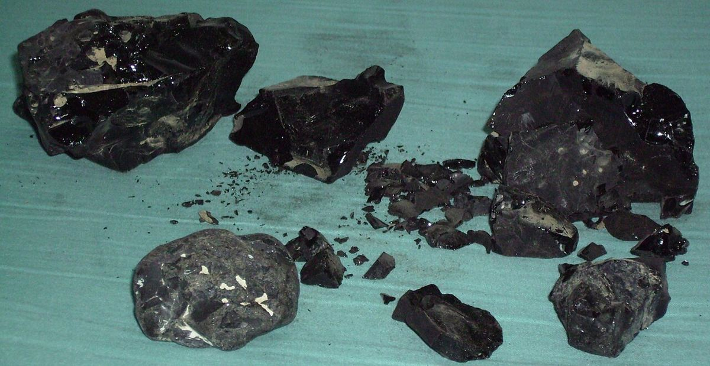{ loading=lazy }
*Natural bitumen collected on the Dead Sea shore: the material of the "bitumen pits" of Genesis
14:10. Image: [Daniel Tzvi](https://commons.wikimedia.org/wiki/File:Bitumen.jpg), public domain, via Wikimedia Commons.*

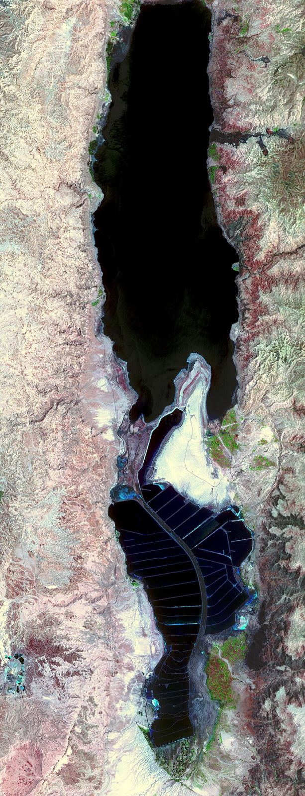{ loading=lazy }
*The Dead Sea from orbit. The Lisan peninsula juts from the east shore; the shallow southern basin,
now evaporation ponds, lies beside the plain where the southern case places the cities.
Image: [NASA/METI/AIST/Japan Space Systems and U.S./Japan ASTER Science Team](https://commons.wikimedia.org/wiki/File:The_Dead_Sea_(ASTER).jpg), public domain, via Wikimedia Commons.*

## The overthrow and the little one

### Abraham's prayer

The LORD told Abraham first. "Because the outcry against Sodom and Gomorrah is great and their sin is
very grave, I will go down to see" (Genesis 18:20-21, ESV). Abraham pleaded for the city on the
ground of God's own character: "Shall not the Judge of all the earth do what is just?" (Genesis
18:25, ESV). He came down from fifty righteous to ten, and the LORD answered every step: "For the
sake of ten I will not destroy it" (Genesis 18:32, ESV).

### "Is it not a little one?"

The angels pulled Lot, his wife and his daughters out by the hand, "the LORD being merciful to him"
(Genesis 19:16, ESV). They told him to run for the hills. Lot asked for a town instead:

> ✝️ Genesis 19:20-22 (ESV)
>
> 20 Behold, this city is near enough to flee to, and it is a little one. Let me escape there—is it
> not a little one?—and my life will be saved!" 21 He said to him, "Behold, I grant you this favor
> also, that I will not overthrow the city of which you have spoken. 22 Escape there quickly, for I
> can do nothing till you arrive there." Therefore the name of the city was called Zoar.

Lot's word is מִצְעָר (*mitsʿar*, H4705), "a little thing," said twice. The
town's name, צוֹעַר (*Tsoʿar*, H6820), comes from the same root. Josephus
glosses it the same way: the place "is to this day called Zoar, for that is the word which the
Hebrews use for a small thing" (*Antiquities* 1.11.4, Whiston).

God spared Zoar because Lot asked, and He held the fire until Lot was inside it: "I can do nothing
till you arrive there." [Taken Before Judgment](../last-things/taken-before-judgment.md) follows that
sentence through Scripture.

### Sulphur and fire

> ✝️ Genesis 19:24-28 (ESV)
>
> 24 Then the LORD rained on Sodom and Gomorrah sulfur and fire from the LORD out of heaven. 25 And he
> overthrew those cities, and all the valley, and all the inhabitants of the cities, and what grew on
> the ground. 26 But Lot's wife, behind him, looked back, and she became a pillar of salt. 27 And
> Abraham went early in the morning to the place where he had stood before the LORD. 28 And he looked
> down toward Sodom and Gomorrah and toward all the land of the valley, and he looked and, behold,
> the smoke of the land went up like the smoke of a furnace.

{ loading=lazy }
*Abraham looks toward the plain from the hills near Hebron: "he looked and, behold, the smoke of the
land went up like the smoke of a furnace" (Genesis 19:28, ESV). AI-generated illustration; the smoke
is placed on the plain where the southern case puts the cities.*

"Sulfur" is גָּפְרִית (*gophrit*, H1614). It occurs in seven verses of the Old
Testament, and from Genesis 19:24 on it is the material of God's judgment: on the wicked (Psalm
11:6), on Gog (Ezekiel 38:22), on Edom (Isaiah 34:9). "Overthrew" is הָפַךְ
(*haphak*, H2015), to turn upside down. Genesis 19:29 sums it up with a noun used nowhere else,
הֲפֵכָה (*hapheikhah*, H2018), "the overthrow."

Abraham watched from the hills near Mamre. He saw smoke going up "like the smoke of a furnace"
(Genesis 19:28, ESV), and the narrator gives the reason Lot came through: "God remembered Abraham"
(Genesis 19:29, ESV).

### Lot's wife

Lot's wife "looked back, and she became a pillar of salt" (Genesis 19:26, ESV). Jesus gave the
shortest sermon on it: "Remember Lot's wife" (Luke 17:32, ESV). The south-west shore of the Dead Sea
is a ridge of rock salt, Mount Sodom, and its weathered columns have carried her name for centuries.
Josephus wrote of the pillar, "I have seen it, and it remains at this day" (*Antiquities* 1.11.4, Whiston). Which pillar he saw cannot be known,
and the columns standing now are natural salt.

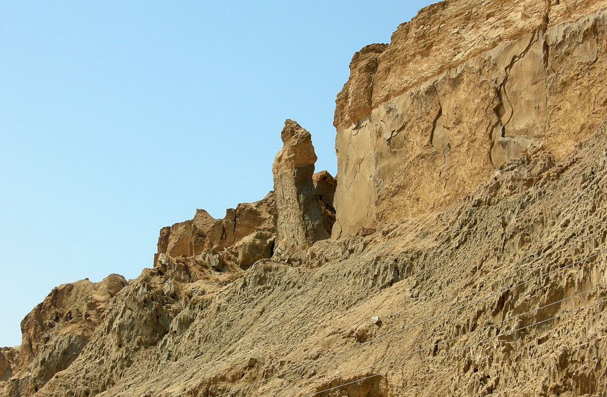{ loading=lazy }
*The column on Mount Sodom known as "Lot's Wife," a salt formation that carries her name by
tradition. Image: [Wilson44691](https://commons.wikimedia.org/wiki/File:MountSodom061607.jpg), public domain, via Wikimedia Commons.*

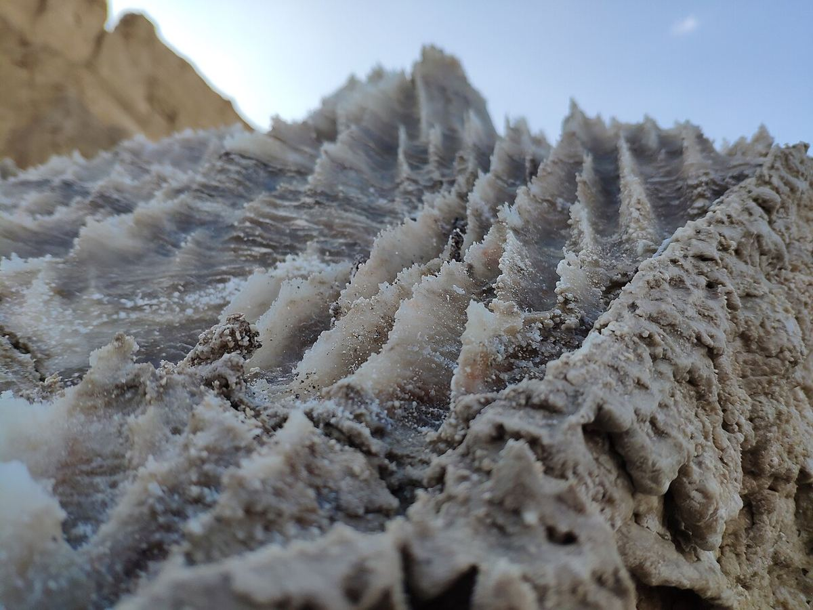{ loading=lazy }
*Rock salt on Mount Sodom. The whole ridge is salt, pushed up from beneath the valley floor.
Photo: [Shayshal2](https://commons.wikimedia.org/wiki/File:Rock_Salt_in_Mount_Sodom_closeup.jpg), [CC BY-SA 4.0](https://creativecommons.org/licenses/by-sa/4.0/), via Wikimedia Commons.*

## Four never rebuilt, one lived on

### The four

Moses, warning Israel, named the four and left Zoar out: "an overthrow like that of Sodom and
Gomorrah, Admah, and Zeboiim, which the LORD overthrew in his anger and wrath" (Deuteronomy 29:23,
ESV). The noun there, מַהְפֵּכָה (*mahpekhah*, H4114), "overthrow," occurs
six times in the Hebrew Bible, and five of them name Sodom (Deuteronomy 29:23; Isaiah 13:19;
Jeremiah 49:18; 50:40; Amos 4:11). Isaiah 1:7 is the sixth.

The prophets turned the empty valley into a byword. "As when God overthrew Sodom and Gomorrah and
their neighboring cities, declares the LORD, so no man shall dwell there, and no son of man shall
sojourn in her" (Jeremiah 50:40, ESV). Isaiah said the same of Babylon: "It will never be inhabited
or lived in for all generations" (Isaiah 13:20, ESV). Hosea heard God say, "How can I make you like
Admah? How can I treat you like Zeboiim?" (Hosea 11:8, ESV), and his compassion grew warm at the
thought.

Jewish writers before Christ said the waste was still visible. The Wisdom of Solomon speaks of "the
waste land that smoketh" as a testimony "even to this day" (Wisdom 10:7, KJV Apocrypha). It also says
the fire fell "upon the five cities" (Wisdom 10:6), naming the whole league where Genesis 19:21 and
Deuteronomy 29:23 exempt Zoar. Josephus wrote that "the traces [or shadows] of the five cities are
still to be seen" beside the lake (*Jewish War* 4.8.4, Whiston).

### The one

Zoar keeps appearing as a living town. Moses saw the land from Nebo "as far as Zoar" (Deuteronomy
34:3, ESV). Isaiah watched Moab's refugees "flee to Zoar" (Isaiah 15:5, ESV), and Jeremiah heard the
cry go up "from Zoar to Horonaim" (Jeremiah 48:34, ESV). Josephus placed the Dead Sea's southern end
"as far as Zoar in Arabia" (*Jewish War* 4.8.4) and lists Zoar with Madaba among twelve towns taken
from the Arabians (*Antiquities* 14.1.4).

After Genesis 19, Zoar is the only one of the five that Scripture names as a place where people live.
Its name occurs ten times in nine verses: six in Genesis, then Deuteronomy 34:3, Isaiah 15:5 and
Jeremiah 48:34. The four burned cities
appear only as the overthrow, a warning and a byword.

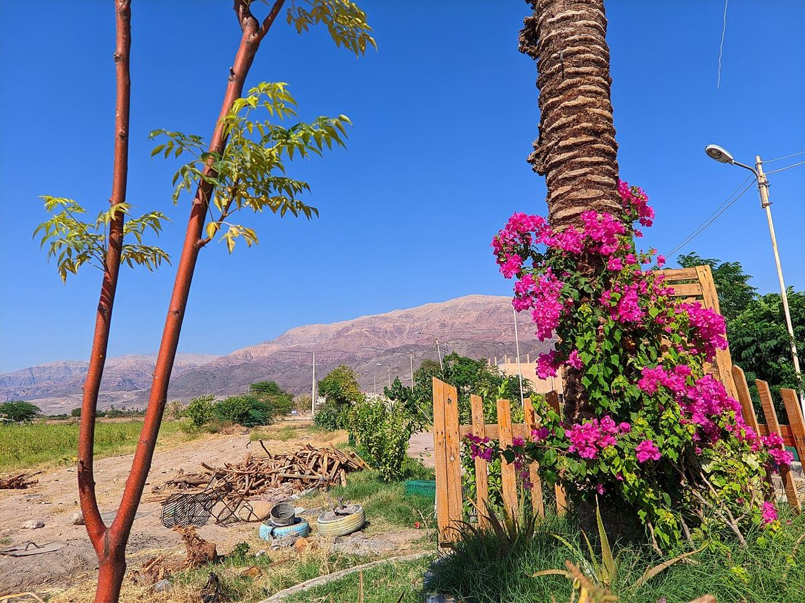{ loading=lazy }
*Ghor es-Safi, Byzantine Zoara, below the mountains of Moab. The palms still grow where the Madaba
mosaic drew them. Photo: [Taha Al-Hayali](https://commons.wikimedia.org/wiki/File:Wild_Jordan_-_Ghor_Safi.jpg), [CC BY-SA 4.0](https://creativecommons.org/licenses/by-sa/4.0/), via Wikimedia Commons.*

## Zoar on a church floor: the Madaba Map

In the town of Madaba, in Jordan, the floor of St George's Greek Orthodox Church holds the oldest
surviving map of the Holy Land. It is a mosaic, laid between about AD 542 and 570 as the floor of a
Byzantine church on the same site. Workmen found fragments while building the present church in 1884,
and the whole map was noticed in October 1896, while a new floor was being laid around it. It once
measured about 21 by 7 metres; about 16 by 5 survive. It is still part of the church floor, and
visitors stand around it.

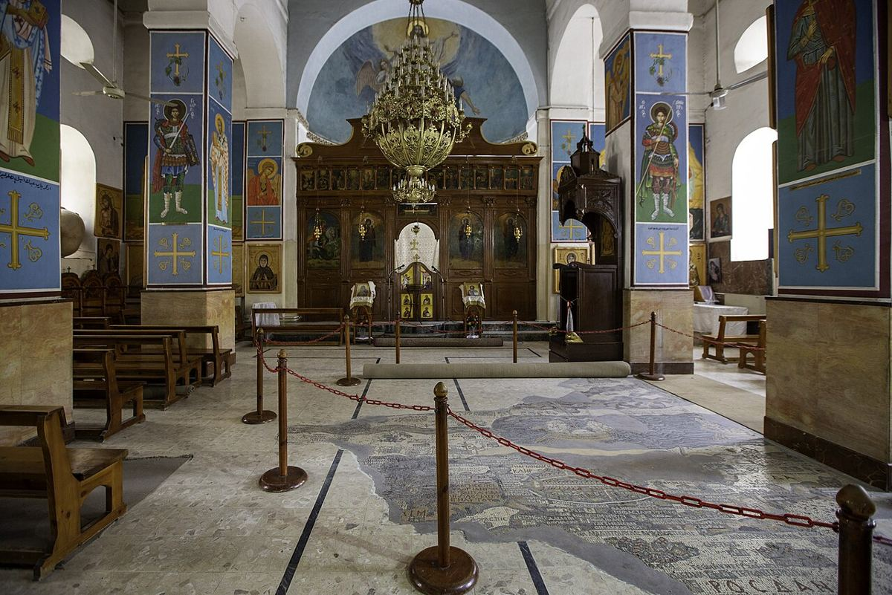{ loading=lazy }
*The Madaba Map in the floor of St George's Church, Madaba. Photo: [Bashar Tabbah](https://commons.wikimedia.org/wiki/File:Madaba_Map_(Church).jpg), [CC BY-SA 4.0](https://creativecommons.org/licenses/by-sa/4.0/), via Wikimedia Commons.*

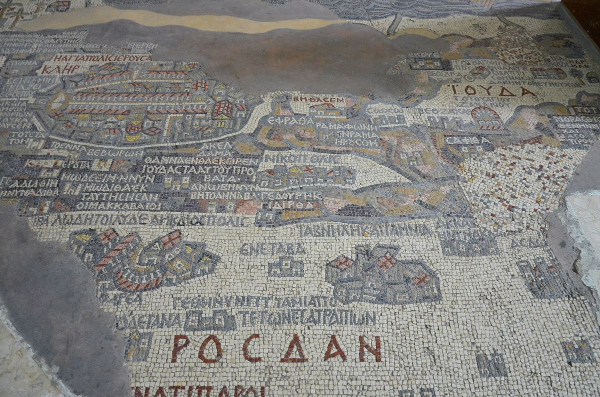{ loading=lazy }
*The Jordan and the Dead Sea on the Madaba Map. The map is oriented with east at the top.
Photo: [Carole Raddato](https://commons.wikimedia.org/wiki/File:The_Madaba_Map,_part_of_a_floor_mosaic_in_the_early_Byzantine_church_of_Saint_George_depicting_the_Holy_Land_in_the_6th_century_AD,_Madaba,_Jordan_(33798361303).jpg), [CC BY-SA 2.0](https://creativecommons.org/licenses/by-sa/2.0/), via Wikimedia Commons.*

At the south-eastern corner of the Dead Sea the mosaicist drew a walled town among date palms and
labelled it "Balak also Segor, now Zoara." Balak is a form of Bela (Genesis 14:2). Segor is Zoar as
the Septuagint spells it, Σηγωρ (*Sēgōr*). Beside the town is a shrine labelled "the (place) of Saint Lot."

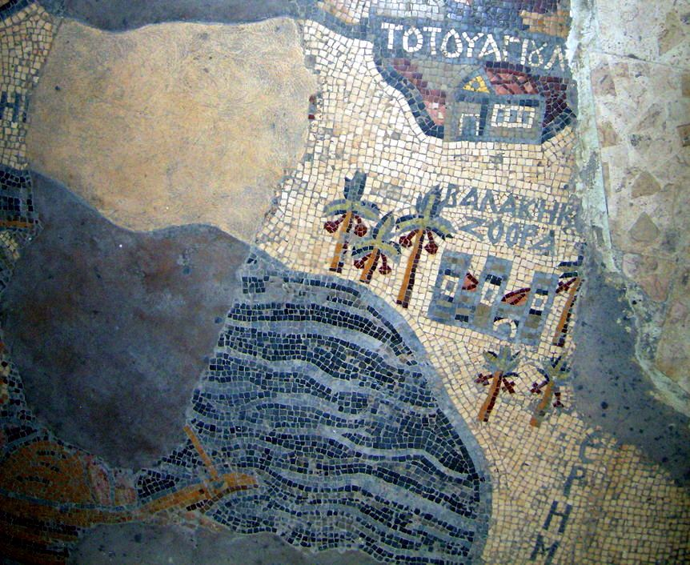{ loading=lazy }
*Zoar on the Madaba Map: "Balak also Segor, now Zoara," a walled town among palms at the
south-eastern end of the Dead Sea. Photo: [Deg777](https://commons.wikimedia.org/wiki/File:Zoar_on_the_Madaba_map.jpg), [CC BY-SA 4.0](https://creativecommons.org/licenses/by-sa/4.0/), via Wikimedia Commons.*

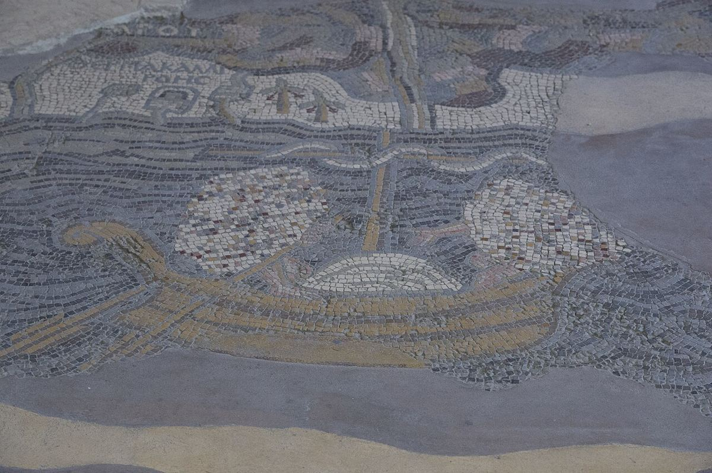{ loading=lazy }
*A boat on the Madaba Map's Dead Sea. Photo: [Dosseman](https://commons.wikimedia.org/wiki/File:Madaba_map_Dead_Sea_1379.jpg), [CC BY-SA 4.0](https://creativecommons.org/licenses/by-sa/4.0/), via Wikimedia Commons.*

The shrine has been found. On the slope above Ghor es-Safi, excavators uncovered a Byzantine church
and monastery built against a cave. Mosaic inscriptions date its construction to AD 606 and a
renovation to AD 691. The oldest material in the cave goes back to the Early and Middle Bronze Ages.
Christians of the Byzantine period honoured it as the cave where Lot lived with his daughters after
he left Zoar (Genesis 19:30). Byzantine Zoara itself lies below, at Ghor es-Safi, where some 300
gravestones from the fourth and fifth centuries name Christian and Jewish dead.

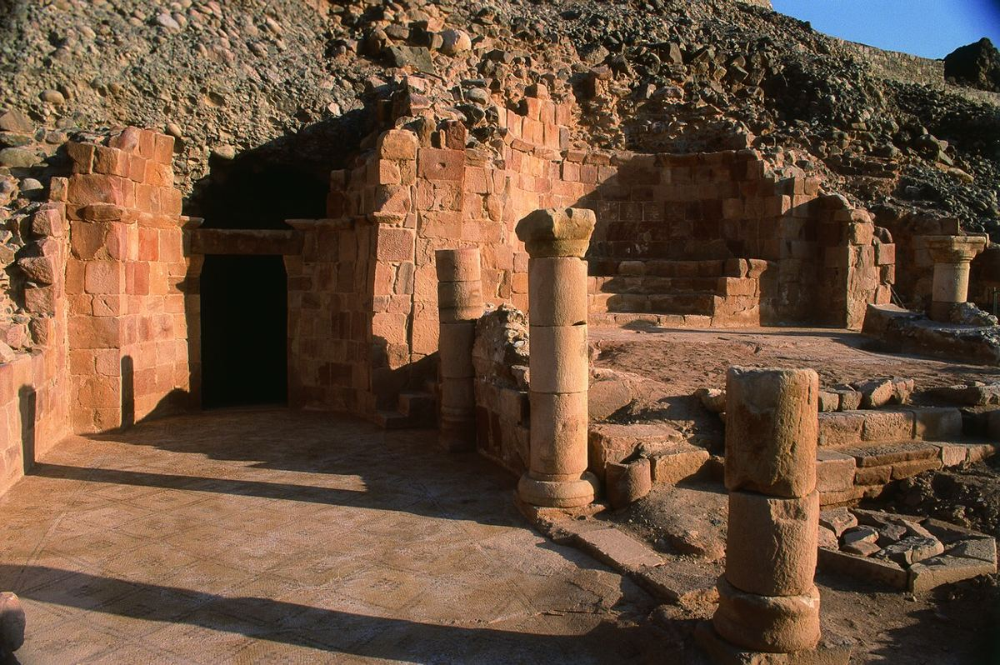{ loading=lazy }
*The Sanctuary of Lot above Ghor es-Safi: the Byzantine church built against the cave.
Photo: [JoTB](https://commons.wikimedia.org/wiki/File:Lot%27s_cave_1.jpg), [CC BY-SA 3.0](https://creativecommons.org/licenses/by-sa/3.0/), via Wikimedia Commons.*

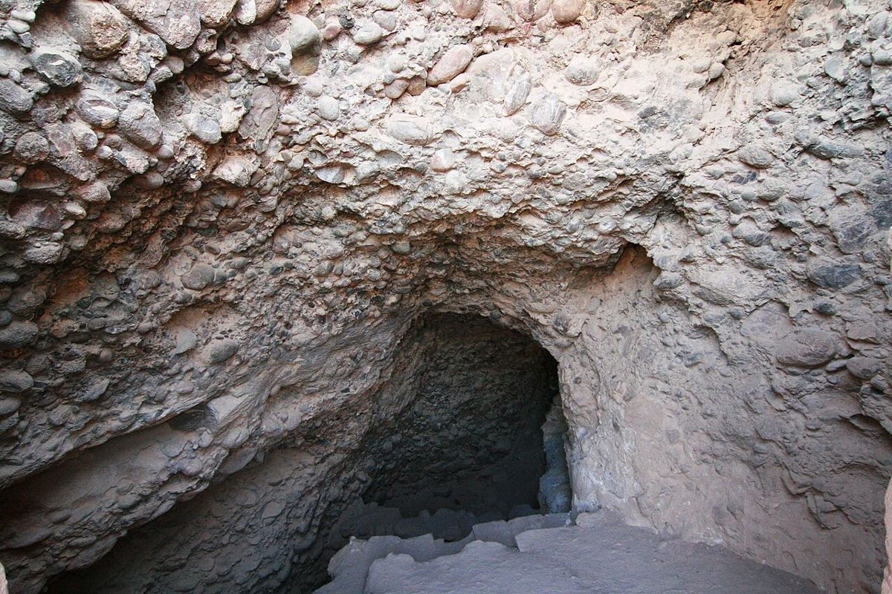{ loading=lazy }
*Inside Lot's Cave. Photo: [Happa](https://commons.wikimedia.org/wiki/File:Lot_cave.JPG), [CC BY 3.0](https://creativecommons.org/licenses/by/3.0/), via Wikimedia Commons.*

Christians of the sixth century placed Zoar at the south-east corner of the Dead Sea, and the town
was still there for them to draw. That fits Genesis exactly. It does not prove the Byzantine town
sits on the Bronze Age one, and the study marks that as a likelihood.

## Where were the burned cities?

No inscription names Sodom, so every identification is a proposal. Two cases are argued.

### The southern case

Joel Kramer of Expedition Bible argues for five Early Bronze Age sites along the plain south-east of
the Dead Sea:

| City | Proposed site | After the destruction |
|---|---|---|
| Sodom | Bab edh-Dhra | burned; never resettled |
| Gomorrah | Numeira | burned; never resettled |
| Admah | Feifa | burned; never resettled |
| Zeboiim | Khanazir | burned; never resettled |
| Zoar (Bela) | es-Safi | lived on; Byzantine Zoara |

That is the pattern Genesis, Deuteronomy and the prophets describe: four towns burned and left empty,
one town spared that went on. It also fits the geography. The valley is the Salt Sea's (Genesis
14:3); it has bitumen (Genesis 14:10); Zoar is a Moabite town (Isaiah 15:5); and Josephus and the
Madaba Map put Zoar at the south-east end.

The excavators found the fire. Walter Rast and Thomas Schaub dug the town at Bab edh-Dhra from 1975
to 1981. Its north-east gate was destroyed by fire, with charcoal, ash and fallen brick. At Numeira
they found burnt debris in almost every area, in places a metre thick over collapsed mudbrick, with
the pottery still on the house floors. Kramer's videos show burned pottery and charcoal at the sites, consistent with destruction by
fire. Beside the town at Bab edh-Dhra lies a large Early Bronze Age cemetery with mudbrick charnel
houses.

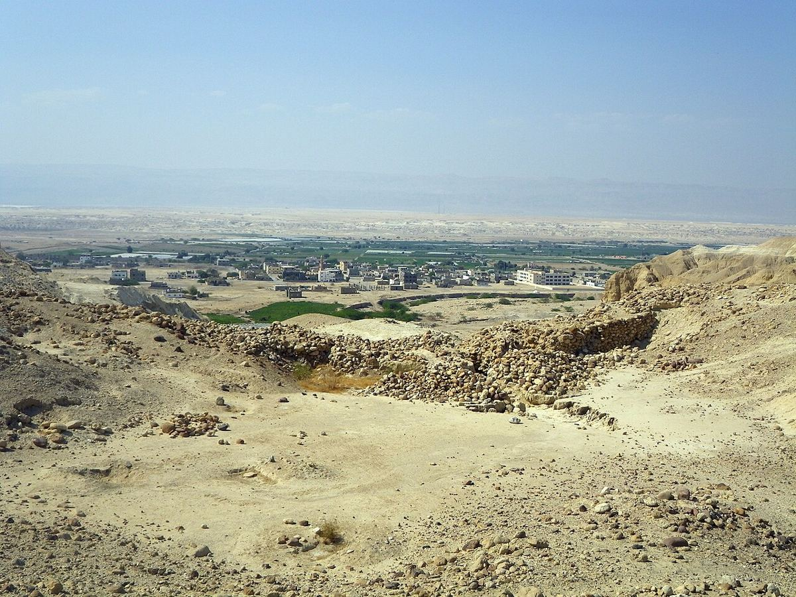{ loading=lazy }
*The Early Bronze Age gate of Bab edh-Dhra, looking out over the southern end of the Dead Sea.
Photo: [Deg777](https://commons.wikimedia.org/wiki/File:Bab_edh-Dhra_gate_overlooking_south_end_dead_sea_2014.jpg), [CC BY-SA 4.0](https://creativecommons.org/licenses/by-sa/4.0/), via Wikimedia Commons.*

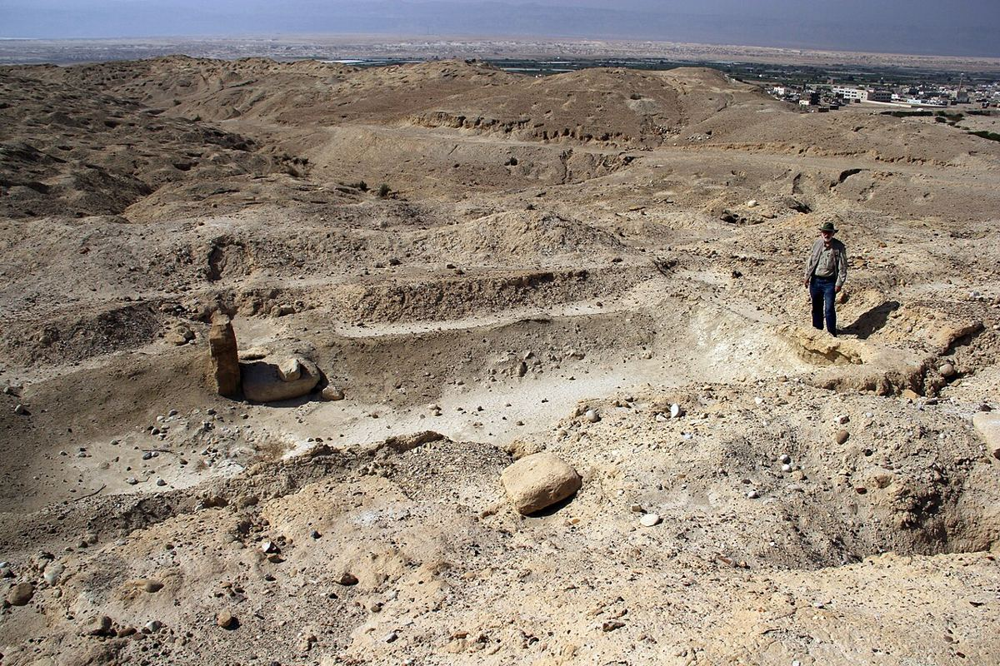{ loading=lazy }
*A charnel house in the Bab edh-Dhra cemetery. Photo: [Deg777](https://commons.wikimedia.org/wiki/File:Bab_edh-Dhra_cemetery_Early_Bronze_Age_III_charnel_house.jpg), [CC BY-SA 4.0](https://creativecommons.org/licenses/by-sa/4.0/), via Wikimedia Commons.*

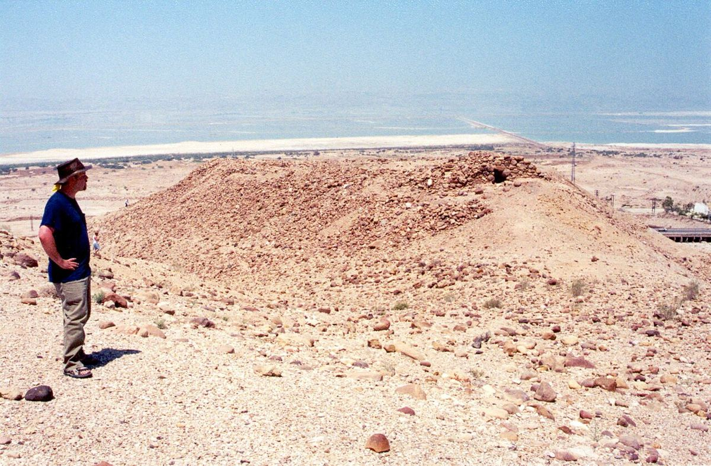{ loading=lazy }
*Numeira, looking west toward the Dead Sea. Photo: [MyOlmec](https://commons.wikimedia.org/wiki/File:Numeira_overview_to_west.JPG), [CC BY-SA 3.0](https://creativecommons.org/licenses/by-sa/3.0/), via Wikimedia Commons.*

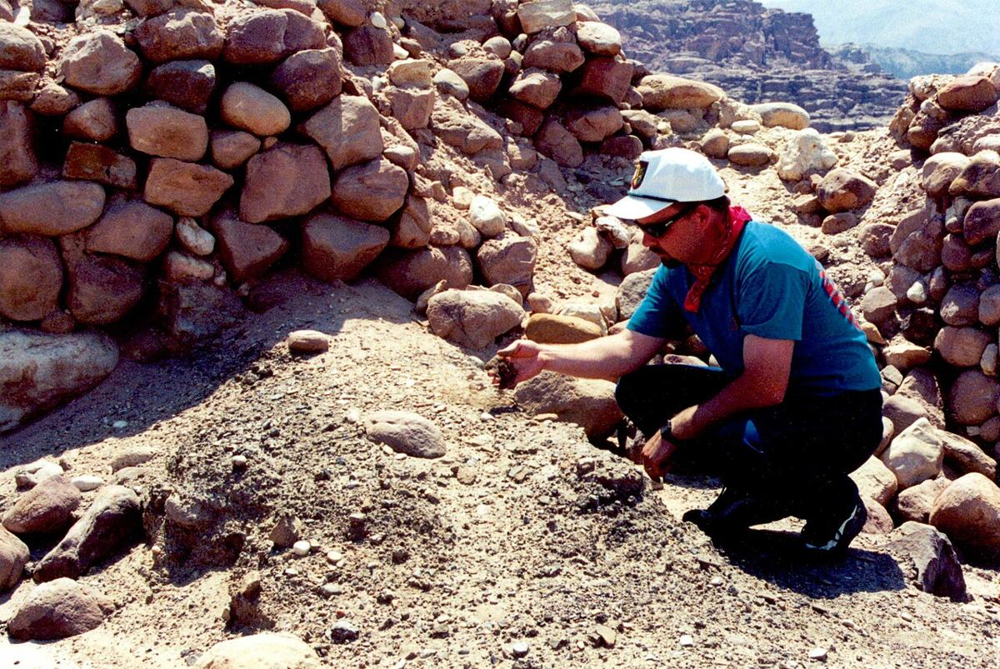{ loading=lazy }
*The destruction layer at Numeira: ash behind the east gate. Photo: [MyOlmec](https://commons.wikimedia.org/wiki/File:Numeira_destruction_level,_back_of_eastern_gate.JPG), [CC BY-SA 3.0](https://creativecommons.org/licenses/by-sa/3.0/), via Wikimedia Commons.*

### The northern case

Steven Collins argues that Sodom was Tall el-Hammam, a large Middle Bronze Age city north-east of the
Dead Sea, in the Jordan Valley opposite Jericho. The case rests on Genesis 13:10: Lot looked out from
near Bethel over "the Jordan Valley," which the northern case reads as the plain north of the sea.
A 2021 paper in *Scientific Reports* claimed a cosmic airburst destroyed the city. The journal
retracted it on 24 April 2025, judging that its data did not support the airburst.

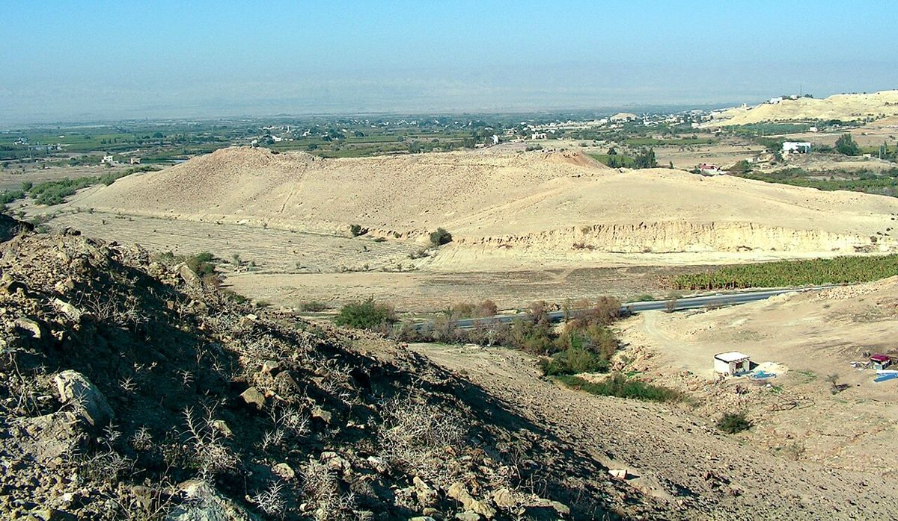{ loading=lazy }
*Tall el-Hammam above the Jordan Valley, the northern proposal for Sodom. Photo: [Deg777](https://commons.wikimedia.org/wiki/File:Tall_el-Hammam_overlooking_the_Jordan_Valley_2007.jpg), [CC BY-SA 4.0](https://creativecommons.org/licenses/by-sa/4.0/), via Wikimedia Commons.*

### The dates

This is the contested point, and both cases have to answer it. This site's chronology places the
overthrow in Abraham's ninety-ninth year, the year before Isaac's birth (Genesis 18:14; 21:5): AM
2107, or 1852 BC on the [Prophetic Timeline](../timeline.md). The excavators date the end of Bab
edh-Dhra to about 2350 BC and Numeira earlier. Kris Udd has argued for lowering both, to about
2000-1950 BC for Bab edh-Dhra. Tall el-Hammam's destruction is dated about 1650 BC, after Abraham.

Two measuring systems are being laid side by side: the Masoretic numbers of Genesis and the
conventional pottery dating of the Early Bronze Age. Where they disagree, this study holds to the
text, and treats the identification of the sites as the open question. On the southern sites the
pattern of four burned and one spared fits Genesis closely. The dates remain the case's weak point.

## The sulphur balls

### What is claimed

Around the Dead Sea, balls of almost pure sulphur turn up in the pale, layered rock and on the ground
below it, many with a darkened crust. Ron Wyatt collected them in 1989 from the whitish formations
near Masada and argued that they were the brimstone of Genesis 19:24, and that the formations were
the ash of the cities. Joel Kramer opens his video
[*Sodom Burned, Zoar Did NOT*](https://www.youtube.com/watch?v=QjPcSQUY2W0) with five sulphur balls
standing for the five cities of the plain: four burning with a blue flame, and one left unlit for
Zoar. On the plain south-east of the sea he pulls more out of the ground: "They're all over the place
here. Literally millions of them."

The balls Kramer burns are about 50 to 70 mm across, the size of a golf ball or a tennis ball. The
archaeologist Titus Kennedy gives the same size, says that "you find a lot of them" around the Lisan
Peninsula, and says that they are found only where the Dead Sea's water once stood. His explanation
is that the balls fell burning, "got extinguished in the water and then stuck in the sediment."

Water answers a real difficulty, and Kramer has tested it. He lights a ball, and the burning sulphur
dripping from it sets dry brush alight: "This is why they're not preserved is because they um are
burned up." Then he drops a burning ball into the Dead Sea. It floats, and the fire goes out. "That
might be why they're all bunched up," he says. "Maybe they floated on the surface and then the wind
drove them."

<iframe src="https://www.youtube-nocookie.com/embed/QjPcSQUY2W0?start=1102&amp;end=1198" title="Joel Kramer burns a sulphur ball and drops it into the Dead Sea" loading="lazy" allow="encrypted-media; picture-in-picture; web-share" referrerpolicy="strict-origin-when-cross-origin" allowfullscreen></iframe>

*A burning sulphur ball sets brush alight, then floats in the Dead Sea and goes out (18:22 to 19:58).
Video: Joel P. Kramer, [Expedition Bible](https://www.youtube.com/@ExpeditionBible), embedded from
YouTube.*

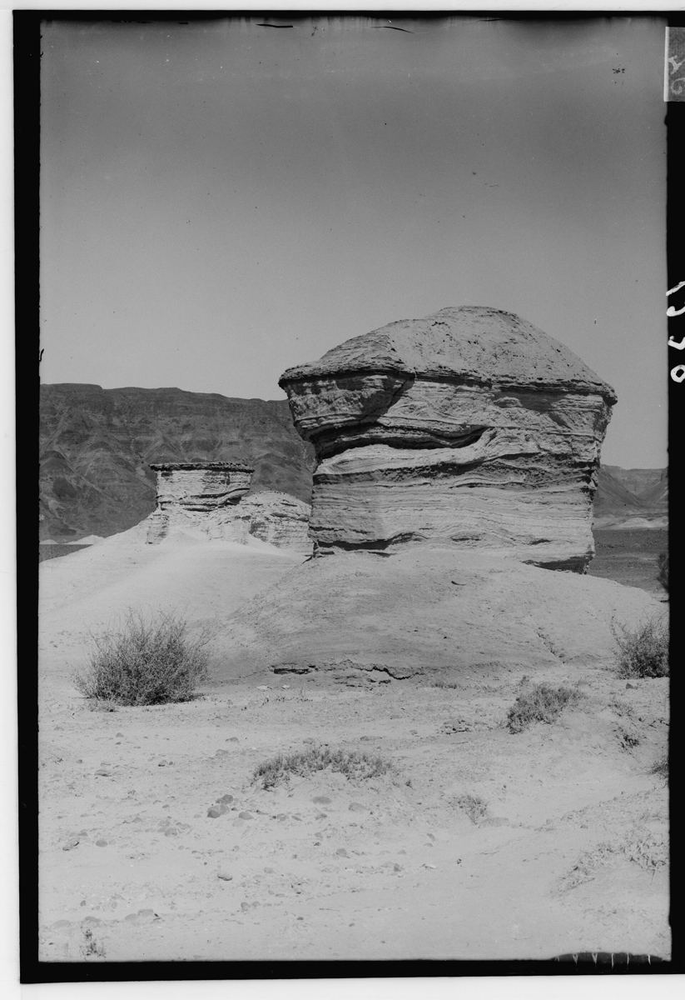{ loading=lazy }
*Marl formations near Masada, photographed by the American Colony photographers in the early
twentieth century. Wyatt identified formations like these as the ash of the cities.
Image: [Matson Collection, Library of Congress](https://commons.wikimedia.org/wiki/File:Around_the_Dead_Sea._Marl_formations_near_Masada_LOC_matpc.01768.jpg), public domain, via Wikimedia Commons.*

### What the geology shows

The pale formations are the Lisan Formation: thin layers of chalk, clay and gypsum laid down by Lake
Lisan, the larger lake that once filled the valley. The excavators of Bab edh-Dhra record that the
town was built on Lisan Marl, so the burned southern towns stand on that old lake bed.

In 2013 T. Bishop, A. V. Turchyn and O. Sivan analysed two sulphur nodules from one gypsum bed at the
foot of Masada. The sulphur in each is 27 to 29 parts per thousand lighter, by its sulphur isotopes,
than the gypsum wrapped around it. That is the known signature of bacteria turning the gypsum's
sulphate into sulphur. Iron and manganese levels change step by step toward each nodule, and the dark
rims are iron rust. They concluded that the nodules grew inside the gypsum after it was laid down.
Nodules formed this way are found in gypsum in many places: Sicily's old sulphur mines, the Tarnobrzeg
deposits in Poland, and the cap rock over the salt domes of the Texas and Louisiana coast.

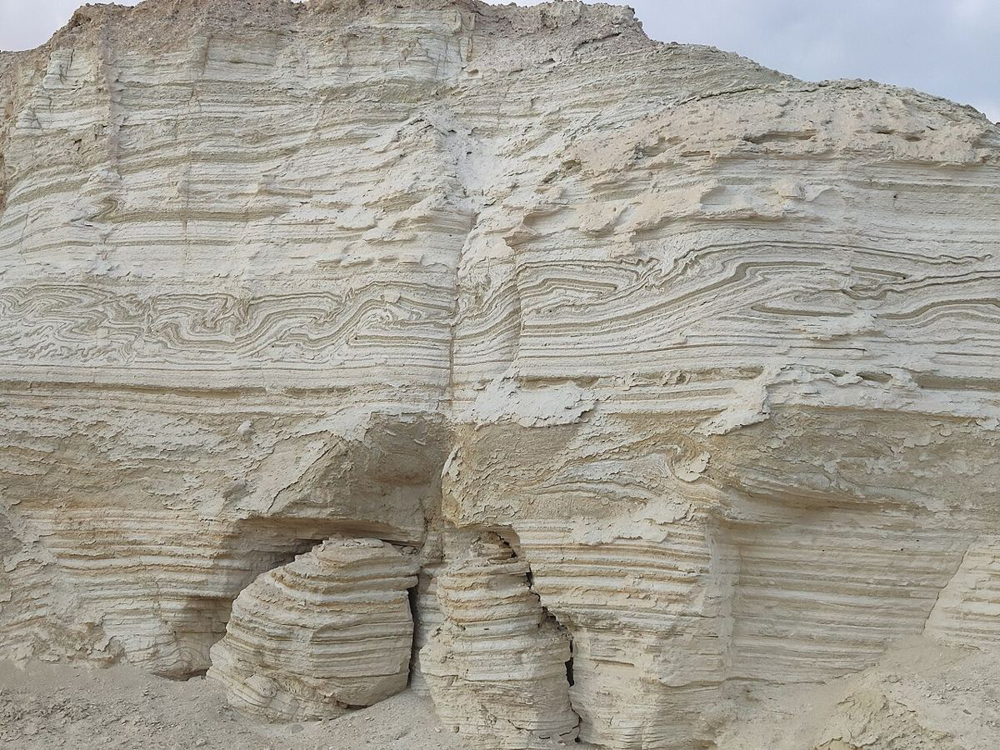{ loading=lazy }
*The Lisan Formation in Nahal Peratsim near the Dead Sea: thin layers laid down in the old lake.
Photo: [Shayshal2](https://commons.wikimedia.org/wiki/File:Lisan_formation_in_Pratzim_river_1.jpg), [CC BY-SA 4.0](https://creativecommons.org/licenses/by-sa/4.0/), via Wikimedia Commons.*

### Weighing it

**This is contested, and each case is narrower than it is usually made to sound.**

The bacterial explanation is demonstrated for two nodules at Masada, across the sea from the southern
cities. The paper describes nodules "millimeter to centimeter in size" and says nothing about the
southern sites or about how many nodules there are. Carrying its result over to Kramer's hail-sized
balls, found by the multitude around Bab edh-Dhra, is an inference. It is a reasonable one, since
those towns stand on the same Lisan beds, but nobody has tested it.

The case from Genesis 19:24 is strongest at the water. Kramer's burning ball floated and went out,
which explains both how a ball could survive its fall and why the balls lie bunched along the old
shores. One part is still unmeasured. Pure solid sulphur is denser than the brine, about 2.07 grams
per cubic centimetre against 1.24, so a ball that floats is holding air in its pores or under its
crust. How long it stays up, and so how far the wind can carry it, nobody has measured.

Three observations fit both explanations and so decide nothing. The balls turn up only below the old
waterline, and the Lisan beds are the old lake floor. They burn blue, as any sulphur does. And they are plentiful wherever the soft marl erodes,
because hard nodules are left lying on the surface as the marl washes away from them.

[![Two cross-sections of the same ground beside the Dead Sea: Lisan marl, the old lake bed, with a gypsum bed inside it and gravel below, an Early Bronze Age town on top with its burn layer, and the ground falling away to the lake. Left, if the sulphur fell from heaven: burning balls fall on the town and lie in its burn layer, and a ball that falls into the lake floats, goes out, and drifts to the shore of Abraham's day. Right, if bacteria grew it: rust-rimmed nodules sit inside the gypsum bed, and some have washed out onto the slope. A table gives the two tests, the layer each ball lies in and its sulphur isotopes, and a dashed card lists what fits both. Cards record the balls' size, about 50 to 70 mm, and that two nodules from one bed at Masada are all that has been analysed. The plate closes with Genesis 19:24.](../assets/img/cities-of-the-plain/sulphur-balls-two-tests.svg)](../assets/img/cities-of-the-plain/sulphur-balls-two-tests.svg)

Two tests would settle it. The first is the layer. Sulphur that fell on the cities and was put out
lies on them and in their burn layers, or along the shore of Abraham's day. Sulphur grown by
bacteria lies inside the far older Lisan gypsum, or on the slope below it where the marl has eroded.
The second is the isotopes. A ball grown from the gypsum around it carries the gap of 27 to 29 parts
per thousand; sulphur that came from elsewhere carries its source's value, with no fixed relation to
the gypsum it lies in. Both tests are routine. No published analysis of Kramer's balls was found for
this study, and until one exists the question stays open.

Genesis 19:24 stands on God's word either way: "the LORD rained on Sodom and Gomorrah sulfur and fire
from the LORD out of heaven" (ESV).

## What the overthrow shows about God

**God judges exactly.** He went down to see whether the outcry was true (Genesis 18:21). He told
Abraham He would spare the city for ten. He overthrew four cities and left the one Lot asked for. The
Judge of all the earth did what is just (Genesis 18:25), city by city.

**God remembers His promises.** Lot was rescued because "God remembered Abraham" (Genesis 19:29,
ESV). Lot was slow and had to be dragged out by the hand, and Peter still calls him "righteous Lot" (2
Peter 2:7, ESV). Righteousness before God is His gift to the one who believes Him, the justification
Abraham received by faith (Genesis 15:6; Romans 4:3), and God keeps those He has justified.

**God's patience has an end.** Sodom became "an example by undergoing a punishment of eternal fire"
(Jude 7, ESV). Peter takes the overthrow straight to the end: "the heavens and earth that now exist
are stored up for fire, being kept until the day of judgment and destruction of the ungodly" (2 Peter
3:7, ESV). Paul says the Lord Jesus will be "revealed from heaven with his mighty angels in flaming
fire" (2 Thessalonians 1:7-8, ESV). The sulphur of Genesis 19 reappears in Revelation's judgments and
in "the lake that burns with fire and sulfur, which is the second death" (Revelation 21:8, ESV).

The site's studies of that fire take it from here:

- [Heaven and Earth Will Pass Away](../last-things/heaven-and-earth-will-pass-away.md) — 2 Peter 3 and
  the day the present heavens and earth are burned up.
- [A New Heaven and a New Earth](../last-things/new-heaven-and-new-earth.md) — the fire after the
  thousand years, and the lake of fire.
- [One Taken, One Left](../last-things/one-taken-one-left.md) — Jesus' "days of Lot" in Luke 17.
- [Taken Before Judgment](../last-things/taken-before-judgment.md) — Lot brought out before the fire.

So the overthrow is good news to you if you belong to Jesus. The God who held the fire until Lot was
inside Zoar has promised to rescue you. Jesus bore God's wrath against your sin at the cross, the
propitiation for it, and He "delivers us from the wrath to come" (1 Thessalonians 1:10, ESV). And if
you have not come to Him, the plain south of the Salt Sea is God's warning: the cities are real, the
fire was real, and He is patient today.

## Discussion Questions

1. Lot calls Zoar מִצְעָר, "a little one," twice, and the town is named for it.
   What does God's answer to that small request show you about how He hears prayer?
2. Deuteronomy 29:23 names four overthrown cities and leaves out Zoar, and Zoar reappears in Isaiah
   15:5 and Jeremiah 48:34. Why does it matter that the record keeps the difference?
3. Jesus told Capernaum that Sodom "would have remained until this day" if it had seen His works
   (Matthew 11:23). What does that say about the people who hear the gospel now?
4. The sulphur balls are contested, and the burned southern towns have a dating problem. How do you
   hold archaeology that supports Scripture alongside archaeology that is still argued over?
5. "Remember Lot's wife" (Luke 17:32). What are you tempted to look back at?

## References & Recommended Reading

- **ESV Study Bible** (Crossway) — notes on Genesis 13:10 (location unknown, possibly south-east of
  the Dead Sea), 14:1-3 and 19:24-26; ESV verse text throughout.
- **NIV and NKJV Cultural Backgrounds Study Bibles** (Zondervan) — notes on Genesis 13:10 and 19:24-26,
  and the article "Genesis 14 and Ancient History."
- **NIV Biblical Theology Study Bible** (Zondervan) — notes on Genesis 13:10 and 19:24-26.
- **CSB Ancient Faith Study Bible** and **Legacy Standard Bible** — footnotes on Genesis 13:10
  (*kikkar*, "Lit circle").
- **Josephus**, *Jewish War* 4.8.4 and *Antiquities* 1.11.1-4; 14.1.4, trans. William Whiston
  (public domain).
- **Wisdom of Solomon** 10:6-7, KJV Apocrypha.
- **Madaba Mosaic Map**, legends translated at [ToposText](https://topostext.org/work/788).
- **Walter E. Rast and R. Thomas Schaub**, excavation reports on Bab edh-Dhra and Numeira (Expedition
  to the Dead Sea Plain).
- **Joel P. Kramer**, Expedition Bible, [*Sodom Burned, Zoar Did NOT*](https://www.youtube.com/watch?v=QjPcSQUY2W0)
  (video).
- **Titus Kennedy**, interview, "Finding Sodom and Gomorrah, Part 2,"
  [Patterns of Evidence](https://www.patternsofevidence.com/2025/07/11/part-2-finding-sodom-and-gomorrah-with-dr-titus-kennedy/)
  (11 July 2025).
- **T. Bishop, A. V. Turchyn and O. Sivan**, "Fire and Brimstone: The Microbially Mediated
  Formation of Elemental Sulfur Nodules from an Isotope and Major Element Study in the Paleo-Dead
  Sea," *PLoS ONE* 8 (2013): e75883.
- **Scientific Reports**, Retraction Note to "A Tunguska sized airburst destroyed Tall el-Hammam a
  Middle Bronze Age city in the Jordan Valley near the Dead Sea" (24 April 2025).
- Original-language data from this project's `bible-text.db` (WLC Hebrew morphology, SBLGNT Greek,
  unfoldingWord interlinear for Genesis 19:20-29).
- Photographs from Wikimedia Commons, credited under each image with its licence.

### On this site

- [Archaeological Sites](archaeological-sites.md) — the wider survey of sites that corroborate
  Scripture.
- [Taken Before Judgment](../last-things/taken-before-judgment.md) — Lot brought out before the fire.
- [The Prophetic Timeline](../timeline.md) — the overthrow placed in Abraham's ninety-ninth year.
